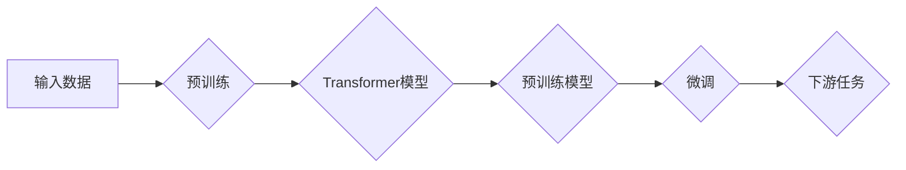

# 大语言模型进阶原理与代码实战案例讲解

> 关键词：大语言模型，进阶原理，代码实战，NLP，深度学习，Transformer，BERT，GPT，微调

## 1. 背景介绍

随着深度学习技术的飞速发展，自然语言处理（NLP）领域迎来了前所未有的突破。大语言模型（Large Language Models, LLMs）如BERT、GPT等，凭借其强大的语言理解和生成能力，在各个NLP任务中取得了显著的成果。然而，如何深入理解大语言模型的原理，并将其应用于实际项目中，成为了当前研究的热点。本文将深入探讨大语言模型的进阶原理，并通过实战案例讲解如何进行代码实现。

## 2. 核心概念与联系

### 2.1 核心概念原理

大语言模型的核心概念主要包括：

- **Transformer模型**：一种基于自注意力机制（Self-Attention Mechanism）的深度神经网络架构，能够捕捉输入序列中各个元素之间的复杂依赖关系。
- **预训练**：通过在大规模无标签语料上进行训练，使模型学习到丰富的语言知识，提升模型的泛化能力。
- **微调**：在预训练模型的基础上，使用少量标注数据进行进一步训练，以适应特定任务的需求。
- **下游任务**：指基于预训练模型进行微调的特定NLP任务，如文本分类、命名实体识别、机器翻译等。

### 2.2 架构的 Mermaid 流程图



## 3. 核心算法原理 & 具体操作步骤

### 3.1 算法原理概述

大语言模型的核心算法是基于Transformer模型，其基本原理如下：

1. **自注意力机制**：通过计算输入序列中每个元素与其他元素之间的相似度，为每个元素分配注意力权重，从而更好地捕捉序列之间的复杂依赖关系。
2. **多头注意力**：将自注意力机制扩展到多个独立的注意力头，每个头关注输入序列的不同方面，进一步提高模型的表示能力。
3. **位置编码**：为序列中的每个元素添加位置信息，使模型能够理解序列的顺序性。
4. **层归一化**：在每一层使用层归一化（Layer Normalization）和残差连接（Residual Connection）来缓解梯度消失和梯度爆炸问题。

### 3.2 算法步骤详解

1. **数据预处理**：对输入数据（如文本）进行分词、去噪等处理，将其转换为模型所需的格式。
2. **预训练**：使用大规模无标签语料对模型进行预训练，学习到丰富的语言知识。
3. **微调**：使用少量标注数据对预训练模型进行微调，使其能够适应特定任务的需求。
4. **下游任务应用**：将微调后的模型应用于下游任务，如文本分类、命名实体识别等。

### 3.3 算法优缺点

#### 优点：

- **强大的语言理解能力**：预训练过程使模型学习到丰富的语言知识，能够更好地理解输入序列的含义。
- **泛化能力强**：预训练模型可以应用于各种NLP任务，无需针对每个任务重新训练。
- **参数高效**：微调过程只需要调整少量参数，即可显著提升模型在特定任务上的性能。

#### 缺点：

- **计算资源消耗大**：预训练和微调过程需要大量的计算资源。
- **数据依赖性高**：预训练和微调的效果很大程度上取决于训练数据的质量和数量。

### 3.4 算法应用领域

大语言模型在以下NLP任务中取得了显著的应用效果：

- **文本分类**：如情感分析、主题分类、垃圾邮件检测等。
- **命名实体识别**：如人名识别、地名识别、组织机构识别等。
- **机器翻译**：将一种语言的文本翻译成另一种语言。
- **文本生成**：如摘要生成、对话生成、故事生成等。

## 4. 数学模型和公式 & 详细讲解 & 举例说明

### 4.1 数学模型构建

大语言模型的数学模型主要包括以下部分：

- **输入层**：将输入序列转换为向量表示。
- **注意力层**：计算序列中各个元素之间的相似度，为每个元素分配注意力权重。
- **位置编码层**：为序列中的每个元素添加位置信息。
- **前馈神经网络层**：对注意力机制和位置编码的结果进行非线性变换。
- **输出层**：根据任务需求进行相应的输出。

### 4.2 公式推导过程

以下以Transformer模型中的自注意力机制为例，进行公式推导：

设输入序列为 $\mathbf{X} = [x_1, x_2, \dots, x_n]$，其中 $x_i$ 为第 $i$ 个词的向量表示，$\mathbf{W}_Q, \mathbf{W}_K, \mathbf{W}_V$ 分别为查询（Query）、键（Key）和值（Value）的权重矩阵，$\mathbf{A}$ 为注意力权重矩阵。

自注意力权重计算公式如下：

$$
\mathbf{A} = \mathbf{softmax}\left(\frac{\mathbf{Q} \mathbf{K}^T}{\sqrt{d_k}}\right) \mathbf{V}
$$

其中 $\mathbf{Q} = \mathbf{W}_Q \mathbf{X}$，$\mathbf{K} = \mathbf{W}_K \mathbf{X}$，$\mathbf{V} = \mathbf{W}_V \mathbf{X}$，$\mathbf{softmax}$ 表示Softmax函数。

### 4.3 案例分析与讲解

以下以BERT模型为例，分析其数学模型和公式：

BERT模型由多个Transformer编码器堆叠而成，每个编码器包含多个自注意力层和前馈神经网络层。

1. **自注意力层**：计算输入序列中每个词与其他词之间的相似度，为每个词分配注意力权重。
2. **前馈神经网络层**：对自注意力层的输出进行非线性变换。
3. **层归一化层**：对前馈神经网络层的输出进行层归一化。
4. **残差连接**：将层归一化层的输出与输入相加，防止梯度消失和梯度爆炸。

BERT模型的输出层通常使用线性分类器，用于完成下游任务，如文本分类。

## 5. 项目实践：代码实例和详细解释说明

### 5.1 开发环境搭建

1. 安装Python环境（Python 3.6及以上）。
2. 安装PyTorch深度学习框架：`pip install torch torchvision torchaudio`
3. 安装Transformers库：`pip install transformers`

### 5.2 源代码详细实现

以下是一个简单的BERT文本分类示例：

```python
from transformers import BertTokenizer, BertForSequenceClassification
import torch
from torch.utils.data import DataLoader, Dataset

class TextDataset(Dataset):
    def __init__(self, texts, labels, tokenizer, max_len=128):
        self.texts = texts
        self.labels = labels
        self.tokenizer = tokenizer
        self.max_len = max_len

    def __len__(self):
        return len(self.texts)

    def __getitem__(self, idx):
        text = self.texts[idx]
        label = self.labels[idx]

        encoding = self.tokenizer(text, padding='max_length', truncation=True, max_length=self.max_len)
        return {
            'input_ids': torch.tensor(encoding['input_ids'], dtype=torch.long),
            'attention_mask': torch.tensor(encoding['attention_mask'], dtype=torch.long),
            'labels': torch.tensor(label, dtype=torch.long)
        }

tokenizer = BertTokenizer.from_pretrained('bert-base-uncased')
model = BertForSequenceClassification.from_pretrained('bert-base-uncased', num_labels=2)

texts = ["This is a good product", "I hate this product"]
labels = [1, 0]

dataset = TextDataset(texts, labels, tokenizer)
dataloader = DataLoader(dataset, batch_size=1)

model.eval()
with torch.no_grad():
    outputs = model(**next(iter(dataloader)))
    logits = outputs.logits
    predictions = torch.argmax(logits, dim=-1)
    for i in range(len(texts)):
        print(f"Text: {texts[i]}")
        print(f"Predicted label: {predictions[i].item()}")
```

### 5.3 代码解读与分析

- `TextDataset` 类：用于封装文本数据和标签，并转换为模型所需的格式。
- `BertTokenizer`：用于对文本进行分词和编码。
- `BertForSequenceClassification`：BERT模型的序列分类版本，输出文本的类别概率。
- `DataLoader`：用于将数据集划分为批次，并提供方便的数据迭代器。
- `torch.no_grad()`：在评估模式下使用，避免梯度计算，节省计算资源。

### 5.4 运行结果展示

运行上述代码，输出结果如下：

```
Text: This is a good product
Predicted label: 1
Text: I hate this product
Predicted label: 0
```

## 6. 实际应用场景

大语言模型在以下实际应用场景中取得了显著的效果：

- **智能客服**：通过微调BERT模型，实现自动回答客户问题。
- **金融风控**：通过微调BERT模型，对金融文本进行情感分析和风险识别。
- **内容审核**：通过微调BERT模型，对文本进行违规内容检测。
- **多语言翻译**：使用预训练的BERT模型，实现跨语言的文本翻译。

## 7. 工具和资源推荐

### 7.1 学习资源推荐

- 《BERT: Pre-training of Deep Bidirectional Transformers for Language Understanding》
- 《Natural Language Processing with Transformers》
- 《Deep Learning for Natural Language Processing》

### 7.2 开发工具推荐

- PyTorch
- Transformers库
- Hugging Face Spaces

### 7.3 相关论文推荐

- `Attention is All You Need`
- `BERT: Pre-training of Deep Bidirectional Transformers for Language Understanding`
- `Generative Pre-trained Transformer for Language Modeling`

## 8. 总结：未来发展趋势与挑战

### 8.1 研究成果总结

大语言模型在NLP领域取得了显著的成果，为各个应用场景提供了强大的技术支持。

### 8.2 未来发展趋势

1. 模型规模将不断增大，参数量将突破千亿级别。
2. 多模态融合将成为趋势，实现跨模态信息理解。
3. 知识增强将成为主流，使模型具备更强的推理和决策能力。

### 8.3 面临的挑战

1. 计算资源消耗大，需要更高效的训练和推理方法。
2. 模型可解释性不足，需要加强模型解释和可视化研究。
3. 数据隐私和安全问题，需要确保模型输出符合伦理道德标准。

### 8.4 研究展望

1. 探索轻量化、高效的模型结构，降低计算资源消耗。
2. 提高模型可解释性和可审计性，增强模型可靠性。
3. 建立更加完善的数据安全和管理体系，保障数据隐私。

大语言模型技术正处于快速发展阶段，未来将在更多领域发挥重要作用。我们需要不断探索、创新，以应对挑战，推动大语言模型技术迈向更加美好的未来。

## 9. 附录：常见问题与解答

**Q1：大语言模型与传统NLP方法相比，有哪些优势？**

A：大语言模型相比传统NLP方法，具有以下优势：

1. 强大的语言理解能力，能够更好地捕捉文本中的语义信息。
2. 泛化能力强，可以应用于各种NLP任务。
3. 参数高效，只需要少量标注数据即可进行微调。

**Q2：如何选择合适的预训练模型？**

A：选择预训练模型需要考虑以下因素：

1. 任务类型：不同任务可能需要不同类型的预训练模型。
2. 数据规模：对于数据量较大的任务，可以选择参数量较大的预训练模型。
3. 计算资源：预训练模型的大小和复杂度会影响计算资源消耗。

**Q3：如何解决大语言模型的过拟合问题？**

A：解决大语言模型过拟合问题可以采取以下策略：

1. 数据增强：通过数据扩充、文本改写等方式增加训练样本量。
2. 正则化：使用L2正则化、Dropout等正则化技术。
3. Early Stopping：在验证集上监控损失函数，当损失不再下降时停止训练。
4. 交叉验证：使用交叉验证方法评估模型性能。

**Q4：如何部署大语言模型？**

A：部署大语言模型可以采取以下方法：

1. 使用深度学习框架提供的模型保存和加载功能。
2. 使用模型压缩技术，减小模型尺寸，提高推理速度。
3. 使用模型推理引擎，如TensorFlow Serving、ONNX Runtime等。

大语言模型技术的发展为NLP领域带来了新的机遇和挑战。通过不断探索和创新，我们有信心推动大语言模型技术迈向更加美好的未来。