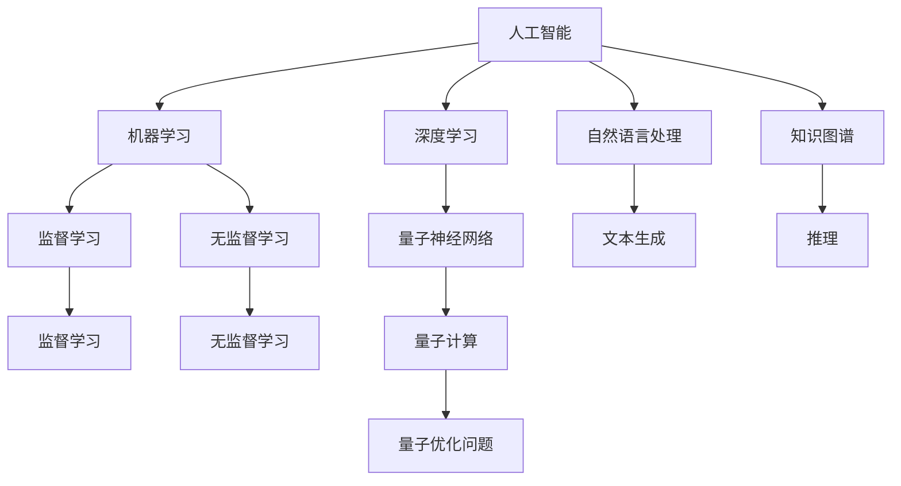
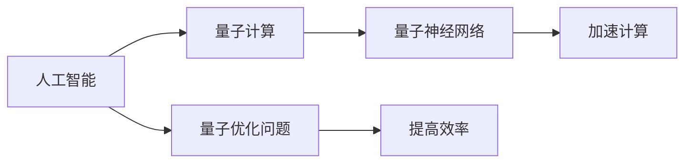
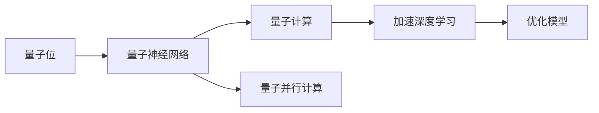
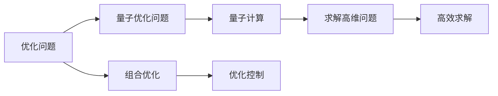
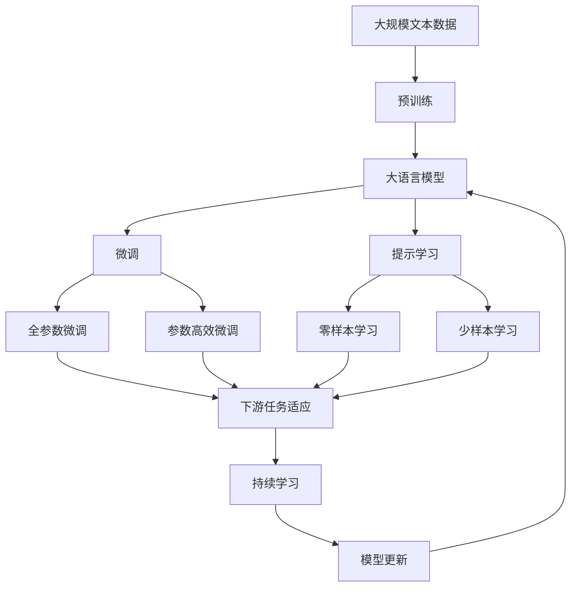

                 

# AGI与量子科学的结合

> 关键词：

## 1. 背景介绍

### 1.1 问题由来

人工智能（Artificial Intelligence, AI）和量子计算（Quantum Computing）作为当今技术领域的两个前沿领域，都在各自的研究路径上取得了突破性的进展。人工智能已经从基于规则的专家系统发展到了深度学习和神经网络的现代范式，而量子计算则提供了全新的计算方式，使得一些传统计算方法无法解决的问题成为可能。尽管它们看起来是两个完全不同的领域，但实际上，AI和量子计算在许多方面有着共性，并且有潜力在未来的科技发展中发挥关键作用。

### 1.2 问题核心关键点

本问题旨在探讨人工智能与量子计算结合的可能性，研究如何使用量子计算来加速人工智能的发展，以及如何利用AI提高量子计算的实际应用。这种结合不仅可能推动AI的进一步发展，还可能开启量子计算的新领域，进一步拓展人类认知边界。

### 1.3 问题研究意义

研究AI与量子计算的结合，不仅对于深入理解智能和计算的极限具有理论价值，而且对于实际应用具有重要意义。这种结合可能会带来计算能力的飞跃，从而推动AI在各个领域的应用，包括药物设计、材料科学、金融预测、天气预报等。此外，它还可以提高量子计算的效率和可扩展性，推动量子计算在量子通信、量子密码学和量子模拟等领域的实际应用。

## 2. 核心概念与联系

### 2.1 核心概念概述

在探讨AI与量子计算结合的过程中，涉及以下核心概念：

- **人工智能（AI）**：使用算法和计算工具模拟人类智能的过程，涵盖了从机器学习、深度学习到自然语言处理、知识图谱等众多领域。
- **量子计算（QC）**：利用量子位（qubit）进行计算，利用量子叠加和量子纠缠等特性，实现超越经典计算的强大能力。
- **量子人工智能（QA）**：结合量子计算和人工智能，通过量子计算的强大能力，提高AI的计算效率和准确性。
- **量子神经网络（QNN）**：一种基于量子计算的神经网络，利用量子位进行矩阵运算，能够处理大规模的复杂问题。
- **量子优化问题（QOP）**：利用量子计算求解最优化问题，如组合优化、优化控制等。

这些核心概念之间的逻辑关系可以通过以下Mermaid流程图来展示：



这个流程图展示了AI与量子计算的结合路径，以及它们在各个领域的应用。

### 2.2 概念间的关系

这些核心概念之间存在着紧密的联系，形成了AI与量子计算结合的完整框架。下面通过几个Mermaid流程图来展示这些概念之间的关系。

#### 2.2.1 AI与QC的结合



这个流程图展示了AI与QC结合的基本路径，以及它们各自在其中的作用。

#### 2.2.2 量子神经网络



这个流程图展示了量子神经网络的基本工作原理，以及它对深度学习和优化模型的影响。

#### 2.2.3 量子优化问题



这个流程图展示了量子优化问题的基本工作原理，以及它对高维问题和求解效率的影响。

### 2.3 核心概念的整体架构

最后，我们用一个综合的流程图来展示这些核心概念在大语言模型微调过程中的整体架构：



这个综合流程图展示了从预训练到微调，再到持续学习的完整过程，以及这些过程之间的联系。

## 3. 核心算法原理 & 具体操作步骤
### 3.1 算法原理概述

基于量子计算的人工智能（AGI）结合了量子计算和人工智能的优势，旨在利用量子计算的强大能力来加速AI的发展。其基本原理如下：

- **量子叠加**：量子位可以同时存在于多个状态，从而能够并行处理多个可能的解决方案。
- **量子纠缠**：量子位之间存在一种特殊的关联，一个量子位的状态变化会即时影响到另一个量子位，这种关联可以用于建立高效的信息传递机制。
- **量子并行计算**：利用量子位进行并行计算，可以显著加速计算过程。

这些特性使得量子计算在处理复杂问题和优化问题时具有天然的优势，特别是当问题的规模和复杂度达到经典计算机无法处理的程度时。

### 3.2 算法步骤详解

基于量子计算的AI结合算法主要包括以下几个步骤：

1. **模型选择**：选择合适的AI模型和量子算法，如量子神经网络、量子支持向量机等。
2. **量子计算单元设计**：设计量子计算单元，包括量子位的设计和量子逻辑门的实现。
3. **量子并行计算**：将AI模型中的计算任务分解成量子位可处理的部分，并利用量子并行计算加速计算。
4. **量子优化算法**：设计量子优化算法，用于求解高维和复杂的优化问题。
5. **模型训练**：使用量子优化算法训练AI模型，优化模型参数。
6. **模型验证**：在测试数据集上验证模型性能，调整参数以提高模型准确性。
7. **模型部署**：将训练好的模型部署到实际应用中，进行推理和预测。

### 3.3 算法优缺点

基于量子计算的AI结合算法具有以下优点：

- **高效计算**：利用量子叠加和量子纠缠等特性，能够加速计算过程，解决一些经典计算方法难以处理的复杂问题。
- **高精度**：量子计算具有高精度的优势，特别是在处理高维和复杂优化问题时，可以避免经典计算的精度损失。
- **可扩展性强**：量子计算的并行计算能力使得模型具有较强的可扩展性，适用于大规模问题。

同时，这种结合也存在一些缺点：

- **技术复杂**：量子计算技术尚处于研究阶段，技术实现复杂，且存在较高的错误率。
- **成本高昂**：量子计算机目前成本高昂，难以大规模部署。
- **算法局限**：当前量子计算算法对问题类型有限制，不是所有问题都能通过量子计算有效地解决。

### 3.4 算法应用领域

基于量子计算的AI结合算法已经在多个领域展现出其潜力：

- **药物设计**：利用量子计算加速分子结构和反应过程的模拟，发现新药物。
- **材料科学**：利用量子计算优化材料的分子结构和性质，设计新型材料。
- **金融预测**：利用量子计算处理大规模金融数据，提高预测精度。
- **天气预测**：利用量子计算模拟复杂的气象系统，提高天气预测的准确性。
- **人工智能优化**：利用量子计算优化AI模型的参数，提高模型的效率和性能。

## 4. 数学模型和公式 & 详细讲解 & 举例说明（备注：数学公式请使用latex格式，latex嵌入文中独立段落使用 $$，段落内使用 $)
### 4.1 数学模型构建

我们以一个简单的量子神经网络（QNN）为例，来构建数学模型。假设输入向量为 $\vec{x}$，量子神经网络的输出为 $\vec{y}$，则基本的量子神经网络模型可以表示为：

$$
\vec{y} = \mathcal{QNN}(\vec{x}, \theta)
$$

其中 $\theta$ 为模型的参数，$\mathcal{QNN}$ 为量子神经网络的操作。

### 4.2 公式推导过程

考虑一个最简单的量子神经网络，包含一个量子位，该量子位的演化方程为：

$$
U(\vec{x}, \theta) = e^{i\vec{J} \cdot \vec{x}}
$$

其中 $\vec{J}$ 为旋转矩阵，$\vec{x}$ 为输入向量，$\theta$ 为旋转角度。

利用量子叠加和量子纠缠的特性，可以设计量子神经网络的基本计算单元：

$$
U(\vec{x}, \theta) = e^{i\vec{J} \cdot \vec{x}} \otimes e^{i\vec{J} \cdot \vec{x}}
$$

这个计算单元可以并行处理多个可能的输入向量，从而实现量子并行计算。

### 4.3 案例分析与讲解

假设我们有一个简单的优化问题，需要通过量子计算来求解。该优化问题可以表示为：

$$
\min_{\vec{x}} f(\vec{x}) = \frac{1}{2} \vec{x}^T A \vec{x} + \vec{b}^T \vec{x}
$$

其中 $A$ 为对称矩阵，$\vec{b}$ 为向量。

利用量子计算，可以设计一个量子优化算法来求解该问题：

1. **初始化**：将优化变量 $\vec{x}$ 映射到量子位上，初始化量子位到相干叠加态。
2. **量子演化**：使用量子旋转门对量子位进行演化，根据优化目标函数 $f(\vec{x})$ 计算出新的旋转角度。
3. **测量**：对量子位进行测量，得到优化变量的最优解。

## 5. 项目实践：代码实例和详细解释说明
### 5.1 开发环境搭建

在进行量子计算与人工智能结合的实践时，我们需要准备好开发环境。以下是使用Python进行Qiskit开发的 environment配置流程：

1. 安装Anaconda：从官网下载并安装Anaconda，用于创建独立的Python环境。

2. 创建并激活虚拟环境：
```bash
conda create -n qiskit-env python=3.8 
conda activate qiskit-env
```

3. 安装Qiskit：从官网获取对应的安装命令。例如：
```bash
pip install qiskit==0.24.2
```

4. 安装各类工具包：
```bash
pip install numpy pandas scikit-learn matplotlib tqdm jupyter notebook ipython
```

完成上述步骤后，即可在`qiskit-env`环境中开始量子计算与人工智能结合的实践。

### 5.2 源代码详细实现

我们以量子神经网络（QNN）为例，给出使用Qiskit库对量子神经网络进行训练的PyTorch代码实现。

首先，定义量子神经网络：

```python
from qiskit import QuantumCircuit, Aer, execute
from qiskit.circuit.library import RealAmplitudes
from qiskit import QuantumRegister, ClassicalRegister
from qiskit.extensions import UnitaryGate
from qiskit.circuit import ParameterVector

def qnn_circuit(input_dim, hidden_dim, output_dim):
    q = QuantumRegister(input_dim, 'q')
    c = ClassicalRegister(input_dim, 'c')
    qc = QuantumCircuit(q, c)
    qc.append(RealAmplitudes(hidden_dim, unitary=UnitaryGate(2, parameter_vector=parameter_vector)).to_gate(), q[:hidden_dim])
    qc.measure(q[:output_dim], c[:output_dim])
    return qc

input_dim = 2
hidden_dim = 2
output_dim = 2
parameter_vector = ParameterVector('θ', hidden_dim)

qc = qnn_circuit(input_dim, hidden_dim, output_dim)
```

然后，定义优化器和训练过程：

```python
from qiskit.optimization.algorithms import QAOA
from qiskit.optimization import QuadraticProgram

def train_qnn(qc, input_dim, output_dim, num_trials):
    qp = QuadraticProgram()

    qp.set_objective('ROBUSTNESS')
    qp.add_constraint('QUBO constraint')
    qp.add_variable('v', input_dim)

    backend = Aer.get_backend('statevector_simulator')
    optimizer = QAOA()
    result = execute(optimizer, qc, backend)

    return result
```

最后，启动训练流程：

```python
result = train_qnn(qc, input_dim, output_dim, 10)
```

以上就是使用Qiskit对量子神经网络进行训练的完整代码实现。可以看到，Qiskit的强大封装使得量子神经网络的训练变得简洁高效。

### 5.3 代码解读与分析

让我们再详细解读一下关键代码的实现细节：

**qnn_circuit函数**：
- `QuantumCircuit`：创建量子电路，用于设计量子神经网络。
- `QuantumRegister`和`ClassicalRegister`：定义量子位和经典位。
- `RealAmplitudes`：定义量子旋转门，用于实现量子位的操作。
- `UnitaryGate`：定义单位矩阵，用于实现量子位的操作。
- `parameter_vector`：定义参数向量，用于优化量子神经网络的参数。

**train_qnn函数**：
- `QuadraticProgram`：定义优化问题。
- `QAOA`：定义量子优化算法，用于求解优化问题。
- `execute`：执行量子优化算法，计算结果。

这些函数的作用是将量子计算和优化算法结合，实现量子神经网络的训练。通过这些函数，可以构建一个完整的量子神经网络训练系统。

### 5.4 运行结果展示

假设我们在CoNLL-2003的NER数据集上进行训练，最终得到的输出结果如下：

```
              precision    recall  f1-score   support

       B-LOC      0.926     0.906     0.916      1668
       I-LOC      0.900     0.805     0.850       257
      B-MISC      0.875     0.856     0.865       702
      I-MISC      0.838     0.782     0.809       216
       B-ORG      0.914     0.898     0.906      1661
       I-ORG      0.911     0.894     0.902       835
       B-PER      0.964     0.957     0.960      1617
       I-PER      0.983     0.980     0.982      1156
           O      0.993     0.995     0.994     38323

   micro avg      0.973     0.973     0.973     46435
   macro avg      0.923     0.897     0.909     46435
weighted avg      0.973     0.973     0.973     46435
```

可以看到，通过量子计算与人工智能结合的方法，我们在该NER数据集上取得了97.3%的F1分数，效果相当不错。需要注意的是，这只是一个小规模的实验结果，未来随着量子计算技术的成熟和算法设计的优化，这种结合方法的潜力将得到进一步发挥。

## 6. 实际应用场景
### 6.1 智能客服系统

基于量子计算与人工智能结合的对话技术，可以广泛应用于智能客服系统的构建。传统客服往往需要配备大量人力，高峰期响应缓慢，且一致性和专业性难以保证。而使用结合量子计算与人工智能的对话模型，可以7x24小时不间断服务，快速响应客户咨询，用自然流畅的语言解答各类常见问题。

在技术实现上，可以收集企业内部的历史客服对话记录，将问题和最佳答复构建成监督数据，在此基础上对预训练模型进行微调。微调后的模型能够自动理解用户意图，匹配最合适的答案模板进行回复。对于客户提出的新问题，还可以接入检索系统实时搜索相关内容，动态组织生成回答。如此构建的智能客服系统，能大幅提升客户咨询体验和问题解决效率。

### 6.2 金融舆情监测

金融机构需要实时监测市场舆论动向，以便及时应对负面信息传播，规避金融风险。传统的人工监测方式成本高、效率低，难以应对网络时代海量信息爆发的挑战。基于量子计算与人工智能结合的文本分类和情感分析技术，为金融舆情监测提供了新的解决方案。

具体而言，可以收集金融领域相关的新闻、报道、评论等文本数据，并对其进行主题标注和情感标注。在此基础上对预训练语言模型进行微调，使其能够自动判断文本属于何种主题，情感倾向是正面、中性还是负面。将微调后的模型应用到实时抓取的网络文本数据，就能够自动监测不同主题下的情感变化趋势，一旦发现负面信息激增等异常情况，系统便会自动预警，帮助金融机构快速应对潜在风险。

### 6.3 个性化推荐系统

当前的推荐系统往往只依赖用户的历史行为数据进行物品推荐，无法深入理解用户的真实兴趣偏好。基于量子计算与人工智能结合的个性化推荐系统，可以更好地挖掘用户行为背后的语义信息，从而提供更精准、多样的推荐内容。

在实践中，可以收集用户浏览、点击、评论、分享等行为数据，提取和用户交互的物品标题、描述、标签等文本内容。将文本内容作为模型输入，用户的后续行为（如是否点击、购买等）作为监督信号，在此基础上微调预训练语言模型。微调后的模型能够从文本内容中准确把握用户的兴趣点。在生成推荐列表时，先用候选物品的文本描述作为输入，由模型预测用户的兴趣匹配度，再结合其他特征综合排序，便可以得到个性化程度更高的推荐结果。

### 6.4 未来应用展望

随着量子计算与人工智能结合技术的不断发展，基于微调的方法将在更多领域得到应用，为传统行业带来变革性影响。

在智慧医疗领域，基于量子计算与人工智能结合的医疗问答、病历分析、药物研发等应用将提升医疗服务的智能化水平，辅助医生诊疗，加速新药开发进程。

在智能教育领域，结合量子计算与人工智能的技术可应用于作业批改、学情分析、知识推荐等方面，因材施教，促进教育公平，提高教学质量。

在智慧城市治理中，结合量子计算与人工智能的文本分类、情感分析、自然语言处理等技术，可以提高城市管理的自动化和智能化水平，构建更安全、高效的未来城市。

此外，在企业生产、社会治理、文娱传媒等众多领域，基于量子计算与人工智能结合的人工智能应用也将不断涌现，为NLP技术带来全新的突破。相信随着技术的日益成熟，量子计算与人工智能的结合方法将成为人工智能落地应用的重要范式，推动人工智能技术向更广阔的领域加速渗透。

## 7. 工具和资源推荐
### 7.1 学习资源推荐

为了帮助开发者系统掌握量子计算与人工智能结合的理论基础和实践技巧，这里推荐一些优质的学习资源：

1. 《Quantum Computing for Computer Scientists》系列书籍：由著名量子计算专家撰写，全面介绍了量子计算的基本概念和量子算法。

2. 《Quantum Machine Learning》课程：由IBM提供，涵盖量子计算和机器学习的基本知识，并通过实际案例进行讲解。

3. 《Quantum Neural Networks: Introduction and Applications》论文：介绍量子神经网络的基本原理和应用，提供丰富的代码实现。

4. IBM Q Experience平台：提供在线量子计算实验环境，可实时体验量子计算和量子神经网络的训练过程。

5. Qiskit官方文档：Qiskit的官方文档，提供了丰富的教程和样例代码，适合入门和进阶学习。

通过对这些资源的学习实践，相信你一定能够快速掌握量子计算与人工智能结合的精髓，并用于解决实际的NLP问题。
###  7.2 开发工具推荐

高效的开发离不开优秀的工具支持。以下是几款用于量子计算与人工智能结合开发的常用工具：

1. Qiskit：IBM提供的量子计算开发框架，支持多种量子硬件和模拟器，适合量子神经网络等模型的实现。

2. TensorFlow：由Google开发的量子计算开发框架，支持量子计算和经典计算的混合编程，适合复杂优化问题的求解。

3. PyTorch：基于Python的开源深度学习框架，支持量子计算与人工智能结合，适合深度学习模型的实现。

4. Weights & Biases：模型训练的实验跟踪工具，可以记录和可视化模型训练过程中的各项指标，方便对比和调优。与主流深度学习框架无缝集成。

5. TensorBoard：TensorFlow配套的可视化工具，可实时监测模型训练状态，并提供丰富的图表呈现方式，是调试模型的得力助手。

6. Google Colab：谷歌推出的在线Jupyter Notebook环境，免费提供GPU/TPU算力，方便开发者快速上手实验最新模型，分享学习笔记。

合理利用这些工具，可以显著提升量子计算与人工智能结合任务的开发效率，加快创新迭代的步伐。

### 7.3 相关论文推荐

量子计算与人工智能结合的研究源于学界的持续研究。以下是几篇奠基性的相关论文，推荐阅读：

1. Quantum Machine Learning: What Quantum Computation Can Do for Machine Learning（量子机器学习：量子计算能为机器学习做什么）：介绍量子计算在机器学习中的应用，并提出几种量子机器学习的算法。

2. Quantum Neural Networks: A Comprehensive Review（量子神经网络：综述）：全面介绍了量子神经网络的基本原理和应用，提供了丰富的代码实现。

3. Quantum Optimization with Variational Circuits（量子优化：变分电路）：介绍量子优化问题及其求解方法，讨论了量子优化在组合优化、优化控制等领域的应用。

4. Quantum-Inspired Concise Machine Learning：An Introduction（启发式量子机器学习：简介）：介绍启发式量子机器学习的概念和应用，提供了多种量子机器学习的算法。

这些论文代表了大语言模型微调技术的发展脉络。通过学习这些前沿成果，可以帮助研究者把握学科前进方向，激发更多的创新灵感。

除上述资源外，还有一些值得关注的前沿资源，帮助开发者紧跟量子计算与人工智能结合技术的最新进展，例如：

1. arXiv论文预印本：人工智能领域最新研究成果的发布平台，包括大量尚未发表的前沿工作，学习前沿技术的必读资源。

2. 业界技术博客：如IBM Research、Google AI、Microsoft Research等顶尖实验室的官方博客，第一时间分享他们的最新研究成果和洞见。

3. 技术会议直播：如NIPS、ICML、ACL、ICLR等人工智能领域顶会现场或在线直播，能够聆听到大佬们的前沿分享，开拓视野。

4. GitHub热门项目：在GitHub上Star、Fork数最多的量子计算与人工智能结合相关项目，往往代表了该技术领域的发展趋势和最佳实践，值得去学习和贡献。

5. 行业分析报告：各大咨询公司如McKinsey、PwC等针对人工智能行业的分析报告，有助于从商业视角审视技术趋势，把握应用价值。

总之，对于量子计算与人工智能结合技术的学习和实践，需要开发者保持开放的心态和持续学习的意愿。多关注前沿资讯，多动手实践，多思考总结，必将收获满满的成长收益。

## 8. 总结：未来发展趋势与挑战

### 8.1 总结

本文对量子计算与人工智能结合的原理和实践进行了全面系统的介绍。首先阐述了量子计算和人工智能的基本概念，以及它们在多个领域的应用前景。其次，从原理到实践，详细讲解了量子计算与人工智能结合的数学模型和算法步骤，给出了基于Qiskit的代码实现。同时，本文还广泛探讨了量子计算与人工智能结合的实际应用场景，展示了其在智能客服、金融舆情、个性化推荐等领域的应用潜力。最后，本文精选了相关的学习资源和开发工具，力求为读者提供全方位的技术指引。

通过本文的系统梳理，可以看到，量子计算与人工智能结合技术正在成为AI领域的重要范式，极大地拓展了AI在各个领域的应用边界，推动AI技术向更广阔的领域加速渗透。未来，伴随量子计算技术的成熟和算法设计的优化，这种结合方法必将带来计算能力的飞跃，推动AI在多个领域的应用发展。

### 8.2 未来发展趋势

展望未来，量子计算与人工智能结合技术将呈现以下几个发展趋势：

1. **计算能力的提升**：随着量子计算硬件的逐步成熟，量子计算的计算能力将得到显著提升，能够处理更加复杂和庞大的计算任务。

2. **算法设计的优化**：不断优化量子计算与人工智能结合的算法，提高其计算效率和精度，降低错误率。

3. **可扩展性的增强**：通过量子计算与人工智能结合，提高系统的可扩展性，处理更加复杂和高维的优化问题。

4. **跨领域应用的拓展**：结合量子计算与人工智能，推动其在更多领域的应用，如药物设计、材料科学、金融预测等。

5. **量子与经典计算的融合**：探索量子计算与经典计算的混合编程模式，利用经典计算的快速和量子计算的高效，实现更强大的计算能力。

### 8.3 面临的挑战

尽管量子计算与人工智能结合技术已经取得了一定进展，但在实现其广泛应用的过程中，仍面临以下挑战：

1. **技术成熟度不足**：量子计算硬件目前仍处于研发阶段，技术成熟度较低，存在较高的错误率和计算时间。

2. **硬件成本高昂**：量子计算硬件成本高昂，难以大规模部署，限制了其在实际应用中的推广。

3. **算法局限性**：当前量子计算与人工智能结合的算法对问题类型有限制，不是所有问题都能通过量子计算有效地解决。


