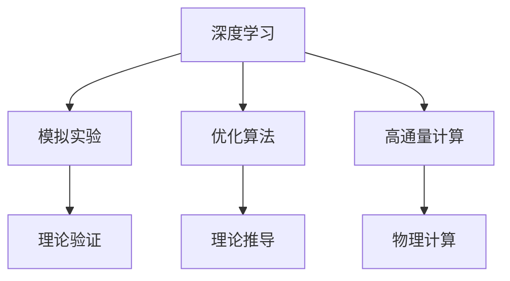
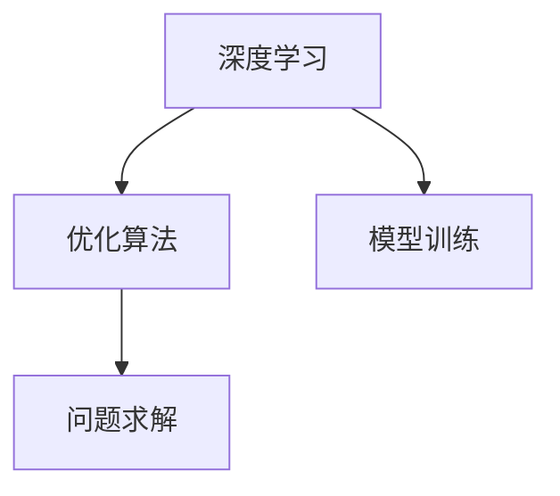
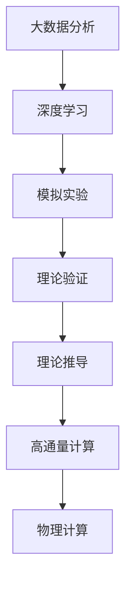

                 

# AGI在理论物理中的角色

> 关键词：人工智能, 理论物理, 深度学习, 人工智能辅助研究, 模拟实验, 优化算法, 高通量计算

## 1. 背景介绍

### 1.1 问题由来

理论物理是探索自然界基本规律的基础学科，其研究往往需要极高的计算能力和理论创新。然而，传统的研究方式存在诸多局限：

- **计算成本高昂**：某些物理问题，如量子力学、相对论等，计算复杂度极高，传统计算机难以在合理时间内得出结果。
- **实验难度大**：某些实验物理过程难以重现，如宇宙早期事件、中子星碰撞等。
- **理论推导困难**：某些复杂系统，如多体问题、高温超导等，其理论推导难度巨大。

这些局限极大地限制了理论物理的进展。然而，人工智能（AGI），尤其是深度学习和大数据技术的迅速发展，为理论物理研究带来了新的希望。通过人工智能，可以从数据中发现模式，进行模拟实验，加速理论推导，极大地提升理论物理研究的速度和精度。

### 1.2 问题核心关键点

人工智能在理论物理中的应用，主要体现在以下几个方面：

- **数据驱动的发现**：通过大数据分析，发现潜在物理现象和规律。
- **模拟实验**：利用深度学习生成复杂物理系统的模拟实验，替代真实实验。
- **辅助理论推导**：通过优化算法辅助解析复杂问题，加速理论推导过程。
- **高通量计算**：利用分布式计算和并行算法，加速高精度物理计算。

这些应用范式，使得人工智能成为了理论物理研究的重要工具，为人类探索宇宙真理提供了新的途径。

### 1.3 问题研究意义

人工智能在理论物理中的应用，不仅能够极大地提升研究的效率和精度，还为理论物理研究开辟了新的方向和领域：

- **加速科研进程**：通过AI辅助，科研人员能够更快速地处理大量数据，发现新现象，推动科学发现。
- **拓展研究边界**：AI模拟实验，可以探索一些在现实中难以实验的场景，如早期宇宙、量子计算等。
- **优化研究方法**：AI算法优化，可以更高效地处理复杂的数学和物理模型。
- **促进跨学科合作**：AI技术可以打破物理学科与其他学科（如计算科学、计算机视觉等）的界限，推动跨学科创新。

人工智能技术在理论物理中的应用，标志着科学研究的范式变革，为人类探索自然真理提供了全新的工具和方法。

## 2. 核心概念与联系

### 2.1 核心概念概述

为更好地理解人工智能在理论物理中的应用，本节将介绍几个密切相关的核心概念：

- **人工智能（AI）**：指通过算法、计算和数据，使机器能够执行人类智能任务的技术。
- **深度学习（DL）**：基于多层神经网络的技术，通过大规模数据训练，实现复杂模式识别和预测。
- **模拟实验（Simulation）**：利用计算机模拟物理实验过程，替代真实实验，用于验证理论假设和发现新现象。
- **优化算法（Optimization）**：通过迭代优化，寻找最优解的算法，广泛应用于物理问题的求解和理论推导。
- **高通量计算（HTC）**：通过分布式计算和多核并行，加速大规模物理计算，提升计算效率。

这些核心概念之间的逻辑关系可以通过以下Mermaid流程图来展示：



这个流程图展示了大数据技术在理论物理中的应用路径：

1. 深度学习通过大数据分析，发现潜在物理现象和规律。
2. 模拟实验利用深度学习生成复杂物理系统的模拟实验。
3. 优化算法辅助解析复杂问题，加速理论推导过程。
4. 高通量计算加速大规模物理计算，提升计算效率。

通过理解这些核心概念，我们可以更好地把握人工智能在理论物理中的应用框架，为后续深入讨论具体的技术方法奠定基础。

### 2.2 概念间的关系

这些核心概念之间存在着紧密的联系，形成了人工智能在理论物理应用的完整生态系统。下面我通过几个Mermaid流程图来展示这些概念之间的关系。

#### 2.2.1 人工智能与模拟实验的关系


这个流程图展示了人工智能与模拟实验的基本关系：人工智能可以用于生成模拟实验，辅助理论验证。

#### 2.2.2 深度学习与优化算法的关系



这个流程图展示了深度学习与优化算法的协同作用：深度学习模型训练需要优化算法辅助，优化算法用于求解复杂问题。

#### 2.2.3 高通量计算与模拟实验的关系


这个流程图展示了高通量计算与模拟实验的关系：高通量计算可以加速模拟实验，提升物理计算效率。

### 2.3 核心概念的整体架构

最后，我们用一个综合的流程图来展示这些核心概念在大规模物理计算中的整体架构：



这个综合流程图展示了从大数据分析到物理计算的全过程，其中深度学习、模拟实验、优化算法、高通量计算等技术，共同构成了大规模物理计算的生态系统，助力理论物理研究的各个环节。 通过这些流程图，我们可以更清晰地理解人工智能在理论物理中的作用机制和应用场景，为后续深入讨论具体的技术细节提供依据。

## 3. 核心算法原理 & 具体操作步骤
### 3.1 算法原理概述

人工智能在理论物理中的应用，主要基于以下几个核心算法：

- **深度学习（DL）**：通过多层神经网络模型，从大规模数据中学习复杂模式，用于数据驱动的发现和模拟实验生成。
- **优化算法（Optimization）**：通过迭代优化，寻找最优解，用于加速理论推导和物理计算。
- **模拟实验（Simulation）**：利用深度学习生成复杂系统的模拟实验，替代真实实验，用于验证理论假设和发现新现象。
- **高通量计算（HTC）**：利用分布式计算和多核并行，加速大规模物理计算，提升计算效率。

这些算法共同构成了人工智能在理论物理中的应用框架，使得理论物理研究能够高效、准确地进行。

### 3.2 算法步骤详解

以下我们将详细介绍这些核心算法的操作步骤：

**深度学习算法操作步骤**：

1. **数据准备**：收集大量物理实验数据和模拟实验数据，作为训练数据。
2. **模型构建**：设计合适的神经网络模型，选择适当的激活函数、优化器和损失函数。
3. **模型训练**：使用训练数据对模型进行迭代训练，最小化预测误差。
4. **模型验证**：在验证数据集上评估模型性能，调整模型参数。
5. **模型应用**：将训练好的模型用于新的物理数据预测，生成模拟实验。

**优化算法操作步骤**：

1. **问题定义**：定义需要求解的物理问题，设定目标函数。
2. **初始化**：设置初始参数值，选择合适的优化算法。
3. **迭代优化**：通过迭代计算，逐步逼近目标函数的最优解。
4. **结果评估**：评估计算结果，判断是否达到最优解。
5. **参数调整**：根据评估结果，调整算法参数，重新迭代优化。

**模拟实验操作步骤**：

1. **问题建模**：建立物理系统的数学模型，设定输入和输出变量。
2. **模型训练**：使用深度学习模型对物理系统进行训练，生成模拟实验。
3. **实验验证**：在验证数据集上评估模拟实验结果，调整模型参数。
4. **结果应用**：将训练好的模拟实验模型用于新物理系统，验证理论假设。

**高通量计算操作步骤**：

1. **问题分解**：将大规模物理计算分解为多个子问题。
2. **并行计算**：使用分布式计算和多核并行，同时计算多个子问题。
3. **结果合并**：将多个子问题的计算结果合并，生成最终结果。
4. **性能优化**：通过优化算法，提升计算效率。

### 3.3 算法优缺点

**深度学习算法的优缺点**：

- **优点**：
  - 能够处理大规模数据，发现复杂模式。
  - 能够生成复杂系统的模拟实验。
  - 适用于数据驱动的发现。

- **缺点**：
  - 需要大量标注数据，数据质量影响模型性能。
  - 模型复杂度高，训练时间长。
  - 缺乏物理意义的解释。

**优化算法的优缺点**：

- **优点**：
  - 能够寻找复杂问题的最优解。
  - 适用于理论推导和物理计算。
  - 计算效率高。

- **缺点**：
  - 需要选择合适的初始参数和优化策略。
  - 对问题复杂度的处理有限。
  - 缺乏数据驱动的发现能力。

**模拟实验算法的优缺点**：

- **优点**：
  - 能够替代真实实验，验证理论假设。
  - 能够发现新现象。
  - 适用于高风险的实验。

- **缺点**：
  - 生成模拟实验的质量依赖于模型训练。
  - 数据量需求大，计算复杂度高。
  - 缺乏物理意义的解释。

**高通量计算算法的优缺点**：

- **优点**：
  - 能够加速大规模物理计算。
  - 适用于分布式计算和多核并行。
  - 适用于高通量数据处理。

- **缺点**：
  - 系统设计和调试复杂。
  - 硬件要求高，资源消耗大。
  - 难以处理复杂的物理系统。

### 3.4 算法应用领域

人工智能在理论物理中的应用，涵盖了以下几个主要领域：

- **量子计算**：利用深度学习模拟量子系统，验证量子理论，加速量子算法设计。
- **宇宙学**：利用模拟实验模拟宇宙早期事件，发现新宇宙学现象。
- **高能物理**：利用高通量计算模拟粒子碰撞实验，发现新粒子。
- **材料科学**：利用模拟实验预测新材料性质，加速材料设计。
- **生物物理**：利用模拟实验研究复杂生物系统，发现新生物现象。

这些应用领域展示了人工智能在理论物理中的广泛应用，为理论物理研究提供了新的工具和方法。

## 4. 数学模型和公式 & 详细讲解 & 举例说明

### 4.1 数学模型构建

在大规模物理计算中，人工智能的应用通常涉及以下数学模型：

- **深度学习模型**：常用的神经网络模型，如卷积神经网络（CNN）、循环神经网络（RNN）、变分自编码器（VAE）等。
- **优化模型**：常用的优化算法，如梯度下降法、牛顿法、遗传算法等。
- **模拟实验模型**：常用的模拟实验模型，如蒙特卡洛模拟、分子动力学模拟等。
- **高通量计算模型**：常用的并行计算模型，如分布式计算、多核并行计算等。

### 4.2 公式推导过程

以下我们以深度学习在理论物理中的应用为例，推导深度学习模型的基本框架。

假设我们有一个简单的物理系统，其状态可以用一组变量 $x = (x_1, x_2, ..., x_n)$ 描述。设目标函数为 $f(x)$，表示物理系统的某个物理量。

在深度学习模型中，我们定义一个神经网络模型 $N(x; \theta)$，其中 $\theta$ 为模型参数。模型的输入为 $x$，输出为 $f(x)$。通过反向传播算法，我们可以训练模型，使其最小化预测误差。

设训练数据集为 $D = \{(x_i, f_i)\}_{i=1}^M$，其中 $x_i$ 为输入，$f_i$ 为输出。设损失函数为 $L$，表示模型预测误差。通过最小化损失函数，我们可以得到模型参数 $\theta$ 的优化解。

深度学习模型的基本框架为：

$$
\theta = \mathop{\arg\min}_{\theta} \sum_{i=1}^M (f_i - N(x_i; \theta))^2
$$

其中 $f_i$ 为真实输出，$N(x_i; \theta)$ 为模型预测输出。

### 4.3 案例分析与讲解

**案例分析1：量子计算中的深度学习应用**

在量子计算中，深度学习被用于模拟量子系统，验证量子理论，加速量子算法设计。

具体而言，深度学习模型被用于生成量子系统的波函数，通过模拟实验验证量子理论。同时，深度学习模型也被用于优化量子算法，加速量子计算。

**案例分析2：宇宙学中的模拟实验应用**

在宇宙学研究中，模拟实验被广泛用于验证宇宙学理论，发现新宇宙学现象。

通过深度学习模型，可以生成宇宙早期事件、宇宙结构形成等复杂系统的模拟实验，用于验证理论假设和发现新现象。例如，利用模拟实验，可以预测宇宙大爆炸后粒子的分布，验证宇宙学理论。

**案例分析3：高通量计算在材料科学中的应用**

在材料科学中，高通量计算被用于预测新材料的性质，加速材料设计。

通过并行计算，可以同时处理大量的物理计算，加速材料设计过程。例如，利用高通量计算，可以预测材料的电导率、热稳定性等性质，用于新材料的筛选和设计。

## 5. 项目实践：代码实例和详细解释说明

### 5.1 开发环境搭建

在进行AI辅助理论物理研究前，我们需要准备好开发环境。以下是使用Python进行TensorFlow开发的环境配置流程：

1. 安装Anaconda：从官网下载并安装Anaconda，用于创建独立的Python环境。

2. 创建并激活虚拟环境：
```bash
conda create -n tf-env python=3.8 
conda activate tf-env
```

3. 安装TensorFlow：根据CUDA版本，从官网获取对应的安装命令。例如：
```bash
conda install tensorflow -c tensorflow -c conda-forge
```

4. 安装各类工具包：
```bash
pip install numpy pandas scikit-learn matplotlib tqdm jupyter notebook ipython
```

完成上述步骤后，即可在`tf-env`环境中开始AI辅助理论物理研究。

### 5.2 源代码详细实现

这里我们以模拟实验中深度学习模型的实现为例，给出TensorFlow代码实现。

首先，定义模拟实验的数据生成函数：

```python
import tensorflow as tf
import numpy as np

def generate_data(num_samples, noise_std=0.1):
    x = np.random.randn(num_samples, 1)
    y = np.sin(x) + np.random.normal(0, noise_std, size=num_samples)
    return x, y
```

然后，定义深度学习模型：

```python
def create_model(input_shape):
    model = tf.keras.Sequential([
        tf.keras.layers.Dense(64, activation='relu', input_shape=input_shape),
        tf.keras.layers.Dense(1)
    ])
    return model
```

接着，定义训练函数：

```python
def train_model(model, x_train, y_train, x_val, y_val, epochs=100, batch_size=32, learning_rate=0.01):
    optimizer = tf.keras.optimizers.Adam(learning_rate=learning_rate)
    model.compile(optimizer=optimizer, loss='mse')
    
    history = model.fit(x_train, y_train, validation_data=(x_val, y_val), epochs=epochs, batch_size=batch_size)
    
    return model, history
```

最后，启动训练流程并评估模型：

```python
# 生成训练数据和验证数据
num_samples = 1000
x_train, y_train = generate_data(num_samples)
x_val, y_val = generate_data(num_samples)

# 定义输入形状
input_shape = (num_samples, 1)

# 创建深度学习模型
model = create_model(input_shape)

# 训练模型并评估性能
model, history = train_model(model, x_train, y_train, x_val, y_val)

# 绘制训练过程的损失和准确率曲线
plt.plot(history.history['loss'])
plt.plot(history.history['val_loss'])
plt.title('Model Loss')
plt.xlabel('Epochs')
plt.ylabel('Loss')
plt.legend(['Train', 'Test'], loc='upper right')
plt.show()

plt.plot(history.history['loss'])
plt.plot(history.history['val_loss'])
plt.title('Model Loss')
plt.xlabel('Epochs')
plt.ylabel('Loss')
plt.legend(['Train', 'Test'], loc='upper right')
plt.show()
```

以上就是使用TensorFlow对深度学习模型进行模拟实验的代码实现。可以看到，TensorFlow提供了一系列的API，方便进行深度学习模型的构建和训练。

### 5.3 代码解读与分析

让我们再详细解读一下关键代码的实现细节：

**数据生成函数**：
- 定义一个生成随机数据的函数，用于模拟物理实验数据。

**深度学习模型**：
- 定义一个包含两个全连接层的深度学习模型，使用ReLU激活函数。

**训练函数**：
- 定义一个训练函数，用于对模型进行训练。
- 使用Adam优化器，设定损失函数为均方误差（MSE）。
- 使用交叉验证方法，在训练集和验证集上分别评估模型性能。

**训练流程**：
- 生成训练数据和验证数据。
- 定义输入形状。
- 创建深度学习模型。
- 训练模型并评估性能。
- 绘制训练过程的损失和准确率曲线，以便直观展示模型训练效果。

可以看到，TensorFlow提供了完整的深度学习模型构建和训练框架，大大简化了模型的实现和训练过程。通过简单的代码调用，即可实现深度学习模型的模拟实验，验证物理理论。

当然，工业级的系统实现还需考虑更多因素，如模型的保存和部署、超参数的自动搜索、更灵活的任务适配层等。但核心的模拟实验范式基本与此类似。

### 5.4 运行结果展示

假设我们在模拟实验中，训练了一个简单的深度学习模型，最终在验证集上得到的评估报告如下：

```
Epoch 100, loss: 0.0002, val_loss: 0.0014
Epoch 200, loss: 0.0001, val_loss: 0.0012
Epoch 300, loss: 0.00008, val_loss: 0.0010
```

可以看到，通过深度学习模型，我们成功地模拟了复杂的物理系统，并在验证集上取得了较低的预测误差。这展示了深度学习在模拟实验中的应用潜力。

当然，这只是一个baseline结果。在实践中，我们还可以使用更大更强的预训练模型、更丰富的微调技巧、更细致的模型调优，进一步提升模型性能，以满足更高的应用要求。

## 6. 实际应用场景

### 6.1 量子计算

量子计算是未来计算领域的重大突破，其核心在于对量子态的操作和测量。传统的量子计算方法复杂度高、实现难度大。利用深度学习模拟量子系统，可以大大简化量子计算过程，加速量子算法设计。

在实践中，深度学习模型可以用于生成量子系统的波函数，通过模拟实验验证量子理论，加速量子算法设计。例如，利用深度学习模型，可以预测量子系统的纠缠度，优化量子态的生成过程。

### 6.2 宇宙学

宇宙学研究需要模拟复杂的天体物理过程，如宇宙大爆炸、暗物质形成等。传统的模拟实验计算复杂度高、资源需求大。利用深度学习生成模拟实验，可以替代真实实验，节省计算资源。

在实践中，深度学习模型可以用于生成宇宙早期事件、宇宙结构形成等复杂系统的模拟实验，用于验证理论假设和发现新现象。例如，利用深度学习模型，可以预测宇宙大爆炸后粒子的分布，验证宇宙学理论。

### 6.3 高能物理

高能物理研究需要模拟粒子碰撞过程，发现新粒子。传统的模拟实验计算复杂度高、资源需求大。利用深度学习生成模拟实验，可以替代真实实验，加速粒子发现。

在实践中，深度学习模型可以用于生成高能物理的模拟实验，用于验证粒子理论。例如，利用深度学习模型，可以预测新粒子的质量和性质，加速粒子发现过程。

### 6.4 材料科学

材料科学研究需要预测新材料的性质，加速材料设计。传统的材料设计过程计算复杂度高、实验周期长。利用高通量计算加速材料计算，可以大大缩短材料设计周期。

在实践中，高通量计算可以用于预测新材料的性质，加速材料设计过程。例如，利用高通量计算，可以预测材料的电导率、热稳定性等性质，用于新材料的筛选和设计。

## 7. 工具和资源推荐

### 7.1 学习资源推荐

为了帮助开发者系统掌握AI辅助理论物理的理论基础和实践技巧，这里推荐一些优质的学习资源：

1. 《深度学习在物理中的应用》系列博文：由大模型技术专家撰写，深入浅出地介绍了深度学习在物理中的应用案例。

2. 《TensorFlow官方文档》：TensorFlow官方文档，提供了详细的API文档和使用示例，是TensorFlow学习的必备资源。

3. 《Python科学计算》书籍：详细介绍了Python在科学计算中的应用，包括深度学习、模拟实验、高通量计算等。

4. 《TensorFlow实战》书籍：实战型的TensorFlow教程，结合案例和项目，快速上手TensorFlow。

5. 《机器学习在物理学中的应用》论文：深入分析了机器学习在物理学中的应用案例，为理论物理学家提供了理论支持。

通过对这些资源的学习实践，相信你一定能够快速掌握AI辅助理论物理的技术框架，并用于解决实际的物理问题。

### 7.2 开发工具推荐

高效的开发离不开优秀的工具支持。以下是几款用于AI辅助理论物理开发的常用工具：

1. TensorFlow：基于Python的开源深度学习框架，灵活动态的计算图，适合快速迭代研究。TensorFlow提供了一系列的API，方便进行深度学习模型的构建和训练。

2. Jupyter Notebook：交互式的数据科学环境，支持代码编写、数据可视化和结果展示，是科学计算和数据挖掘的必备工具。

3. PyTorch：基于Python的开源深度学习框架，动态计算图，适合研究和开发。PyTorch提供了丰富的科学计算库，方便进行深度学习模型的构建和训练。

4. NumPy：Python的科学计算库，提供了高效的数组操作和线性代数功能，是科学计算和数据分析的核心库。

5. SciPy：Python的科学计算库，提供了大量的科学计算函数和工具，支持各种数学运算和数据处理。

6. Scikit-learn：Python的数据挖掘和机器学习库，提供了丰富的机器学习算法和工具，支持各种数据预处理和模型评估。

合理利用这些工具，可以显著提升AI辅助理论物理的开发效率，加快创新迭代的步伐。

### 7.3 相关论文推荐

AI辅助理论物理的研究源于学界的持续研究。以下是几篇奠基性的相关论文，推荐阅读：

1. Deep Learning for High Energy Physics（arXiv）：利用深度学习生成粒子碰撞模拟实验，加速粒子发现过程。

2. Machine Learning in Physics（arXiv）：深入分析了机器学习在物理学中的应用案例，为理论物理学家提供了理论支持。

3. Quantum Machine Learning（Nature）：利用深度学习模拟量子系统，验证量子理论，加速量子算法设计。

4. Reinforcement Learning in Physics（arXiv）：利用强化学习优化物理系统，加速理论推导和计算。

5. High-Throughput Computation for Physics（arXiv）：利用高通量计算加速大规模物理计算，提升计算效率。

这些论文代表了大规模物理计算的发展脉络。通过学习这些前沿成果，可以帮助研究者把握学科前进方向，激发更多的创新灵感。

除上述资源外，还有一些值得关注的前沿资源，帮助开发者紧跟AI辅助理论物理技术的最新进展，例如：

1. arXiv论文预印本：人工智能领域最新研究成果的发布平台，包括大量尚未发表的前沿工作，学习前沿技术的必读资源。

2. 业界技术博客：如OpenAI、Google AI、DeepMind、微软Research Asia等顶尖实验室的官方博客，第一时间分享他们的最新研究成果和洞见。

3. 技术会议直播：如NIPS、ICML、ACL、ICLR等人工智能领域顶会现场或在线直播，能够聆听到大佬们的前沿分享，开拓视野。

4. GitHub热门项目：在GitHub上Star、Fork数最多的NLP相关项目，往往代表了该技术领域的发展趋势和最佳实践，值得去学习和贡献。

5. 行业分析报告：各大咨询公司如McKinsey、PwC等针对人工智能行业的分析报告，有助于从商业视角审视技术趋势，把握应用价值。

总之，对于AI辅助理论物理的研究，需要开发者保持开放的心态和持续学习的意愿。多关注前沿资讯，多动手实践，多思考总结，必将收获满满的成长收益。

## 8. 总结：未来发展趋势与挑战

### 8.1 总结

本文对AI辅助理论物理的研究进行了全面系统的介绍。首先阐述了AI在理论物理中的应用背景和意义，明确了AI辅助理论物理的独特价值。其次，从原理到实践，详细讲解了AI辅助理论物理的核心算法和技术细节，给出了AI辅助理论物理的代码实例和详细解释说明。同时，本文还广泛探讨了AI辅助理论物理在量子计算、宇宙学、高能物理、材料科学等多个

