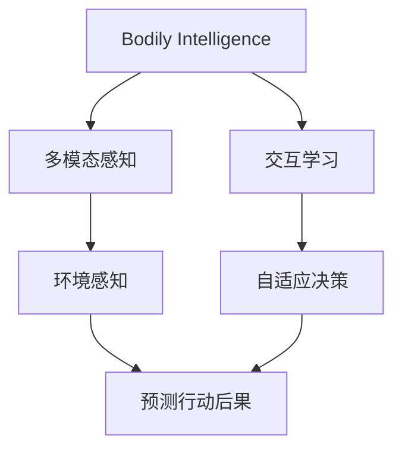
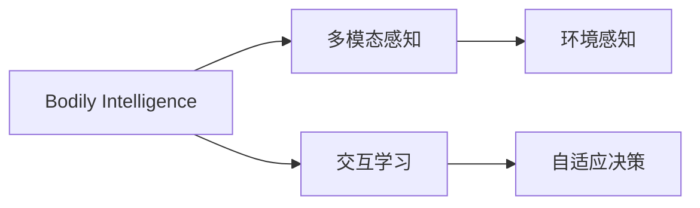
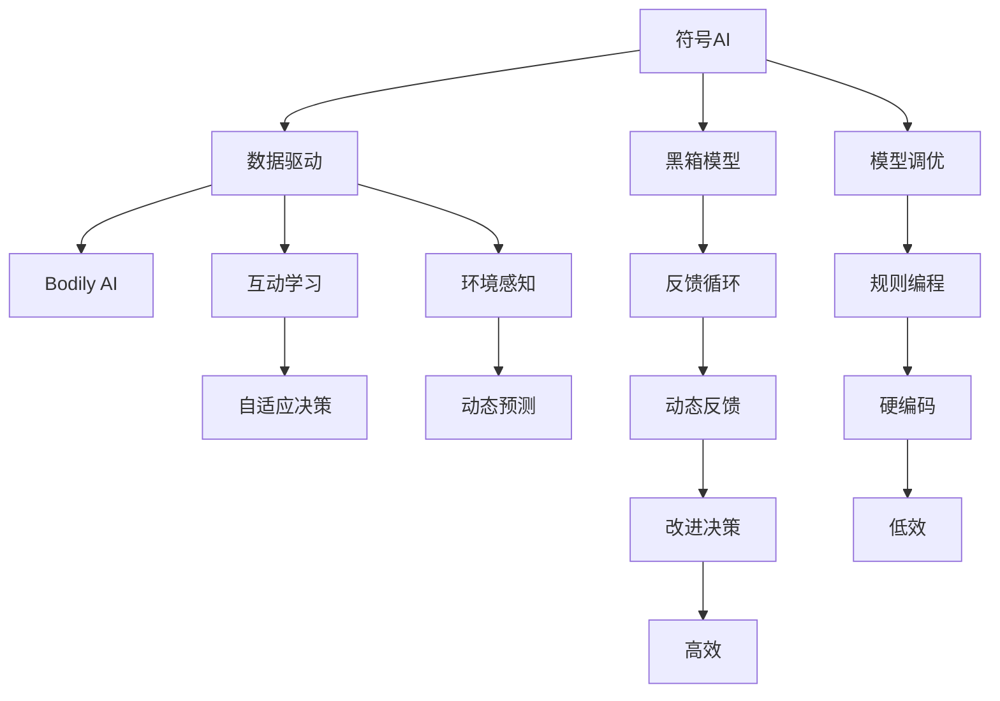
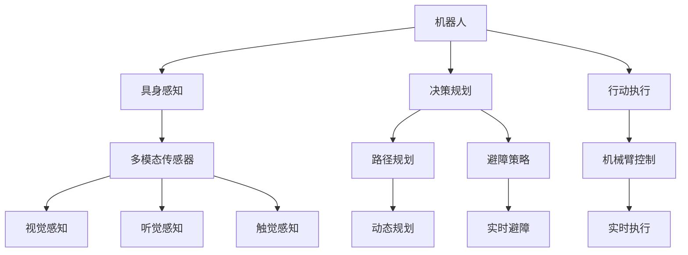
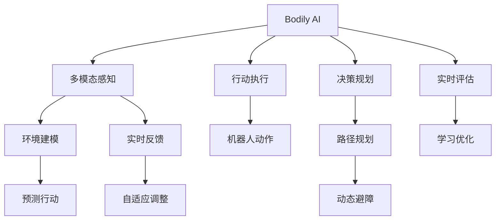

                 

# AI Agent: AI的下一个风口 具身智能的核心与未来

> 关键词：
- 具身智能(Bodily Intelligence)
- 多模态感知(Multimodal Perception)
- 交互学习(Interactive Learning)
- 环境感知(Environmental Awareness)
- 自适应决策(Adaptive Decision Making)
- 具身机器人(Bodily Robotics)
- 人工智能(AI)发展新趋势

## 1. 背景介绍

### 1.1 问题由来

人工智能(AI)自1956年提出以来，已经经历了多次波折与繁荣。从符号主义到连接主义，再到深度学习，每一次技术突破都推动了AI领域向前迈进一大步。然而，人工智能的发展始终未能脱离“图灵测试”所定义的“黑箱”模式：人类无法理解AI的内部运作逻辑，无法对其进行有效的控制与交互。

最近，具身智能(Bodily Intelligence)成为了AI研究的新前沿。具身智能不仅仅是处理数据，更注重在具体环境中与物体的交互学习，通过感知、决策、行动等具身行为来理解复杂环境。具身智能的目标是赋予AI系统具备人类一样的身体感知和行为能力，能够更好地理解与应对真实世界的复杂场景。

### 1.2 问题核心关键点

当前具身智能研究的核心在于如何将AI的感知、决策、行动等能力融入具身机器人、无人车、无人机等实际应用中，使其能够在真实世界中高效运转。具体关键点包括：

- 多模态感知系统：如何整合视觉、听觉、触觉等多模态传感器数据，获取环境的全方位信息。
- 交互学习算法：如何通过与环境的交互，不断学习与优化决策和行动策略。
- 环境感知能力：如何理解复杂多变的环境，预测可能的行动后果。
- 自适应决策机制：如何根据环境变化，动态调整决策策略，确保行动的有效性。

### 1.3 问题研究意义

研究具身智能对于拓展AI的边界与应用范围具有重要意义：

- 降低应用成本。传统AI系统需要大量标注数据和计算资源，而具身智能通过与环境的直接互动，能够有效降低对数据的依赖。
- 提升应用效果。具身智能能够更好地理解环境变化，灵活适应复杂场景，从而提升系统的可靠性和鲁棒性。
- 促进产业发展。具身智能为机器人、无人车、无人机等领域的应用提供了新的技术支持，加速相关产业的升级换代。
- 带来技术创新。具身智能的研究催生了新的算法与理论，如多模态融合、强化学习等，推动AI技术的持续进步。
- 赋能社会福祉。具身智能可以应用于医疗、教育、交通等领域，提升公共服务的智能化水平，助力社会福利的提升。

## 2. 核心概念与联系

### 2.1 核心概念概述

为更好地理解具身智能的核心概念，本节将介绍几个关键概念：

- 具身智能(Bodily Intelligence)：强调AI系统在具身环境中的感知、决策、行动等能力。与传统的符号或连接主义AI不同，具身智能更加注重在具体环境中的互动学习。
- 多模态感知(Multimodal Perception)：集成视觉、听觉、触觉等多种传感器信息，实现对环境的全面感知。
- 交互学习(Interactive Learning)：通过与环境的互动，AI系统能够动态调整决策和行动策略，提升系统的灵活性和适应性。
- 环境感知(Environmental Awareness)：AI系统能够理解环境的动态变化，预测可能的行动后果，从而做出更优的决策。
- 自适应决策(Adaptive Decision Making)：AI系统能够根据环境变化，动态调整决策策略，确保行动的有效性。

这些概念通过以下Mermaid流程图来展示它们之间的关系：



### 2.2 概念间的关系

这些核心概念之间存在着紧密的联系，形成了具身智能的核心生态系统。下面我通过几个Mermaid流程图来展示这些概念之间的关系：

#### 2.2.1 具身智能的学习范式



这个流程图展示具身智能的基本学习范式：首先通过多模态感知系统获取环境信息，然后通过交互学习系统调整决策和行动策略，最终由环境感知和自适应决策模块共同驱动AI系统在具身环境中做出更优的行动。

#### 2.2.2 具身智能与传统AI的对比



这个流程图展示了传统符号AI与具身AI的对比。符号AI主要依赖数据和模型调优，通常使用硬编码规则，依赖大量的标注数据，难以动态调整决策。而具身AI通过多模态感知和互动学习，能够实时调整决策策略，提升系统的高效性。

#### 2.2.3 具身智能的应用场景



这个流程图展示了具身智能在机器人中的应用场景：通过多模态传感器获取环境信息，结合决策规划和行动执行模块，使机器人能够在复杂环境中高效完成任务。

### 2.3 核心概念的整体架构

最后，我们用一个综合的流程图来展示这些核心概念在具身智能中的整体架构：



这个综合流程图展示了从感知到决策，再到行动的全过程。具身智能通过多模态感知获取环境信息，通过环境建模和预测行动模块理解环境变化，结合决策规划和行动执行模块，实现高效的具身行为。同时，通过实时反馈和自适应调整，不断优化决策策略，提升系统的稳定性和鲁棒性。

## 3. 核心算法原理 & 具体操作步骤
### 3.1 算法原理概述

具身智能的算法原理主要是通过多模态感知系统获取环境信息，结合决策规划和行动执行模块，实现对具身环境的理解和动态交互。具体来说，算法包括以下几个关键步骤：

- **多模态感知模块**：通过摄像头、麦克风、触觉传感器等获取环境信息，进行多模态数据融合，建立环境的全局视图。
- **决策规划模块**：基于感知到的环境信息，通过决策算法（如A*、Q-learning、SARSA等）选择最优行动策略。
- **行动执行模块**：将决策结果转化为具体的动作指令，通过机械臂、电机等执行器完成行动。
- **反馈调整模块**：通过动作执行的结果与预期目标的对比，反馈调整决策和行动策略，实现系统的自适应调整。

### 3.2 算法步骤详解

以下详细讲解具身智能的核心算法步骤：

**Step 1: 多模态感知系统**

多模态感知系统是具身智能的第一步，其核心任务是将视觉、听觉、触觉等多种传感器的数据进行融合，生成对环境的全面感知。具体来说：

1. **传感器数据采集**：通过摄像头、麦克风、触觉传感器等设备采集环境信息。
2. **数据预处理**：对采集到的数据进行去噪、滤波、增强等预处理操作，确保数据的可靠性和有效性。
3. **特征提取**：使用深度学习模型（如CNN、RNN等）对预处理后的数据进行特征提取，生成高层次的环境表示。

**Step 2: 决策规划算法**

决策规划模块是具身智能的核心，其任务是结合感知到的环境信息，选择最优行动策略。具体来说：

1. **状态表示**：将感知到的环境信息表示为状态向量，便于进行决策规划。
2. **决策算法**：选择合适的决策算法（如A*、Q-learning、SARSA等），在状态空间中搜索最优行动策略。
3. **策略优化**：通过交互学习算法（如经验回放、策略改进等），不断优化决策策略，提升系统的灵活性和适应性。

**Step 3: 行动执行模块**

行动执行模块是将决策结果转化为具体动作的过程。具体来说：

1. **动作生成**：根据决策结果生成具体的动作指令，如机械臂的摆动、电机的旋转等。
2. **动作执行**：通过执行器完成动作指令，实现具身机器人的行为。
3. **结果反馈**：将动作执行的结果反馈给感知模块和决策规划模块，进行下一次的调整和优化。

**Step 4: 反馈调整机制**

反馈调整模块是具身智能的动态调整机制，其任务是根据动作执行的结果，不断调整决策和行动策略。具体来说：

1. **结果评估**：将动作执行的结果与预期目标进行对比，生成评估指标（如成功率、耗时等）。
2. **反馈调整**：根据评估指标，动态调整决策策略和行动指令，实现系统的自适应调整。
3. **学习优化**：通过在线学习算法（如强化学习、迁移学习等），不断优化决策和行动策略，提升系统的性能。

### 3.3 算法优缺点

具身智能算法具有以下优点：

1. **高效实时**：通过多模态感知和实时反馈，具身智能能够在复杂环境中快速做出决策和行动，提高系统的实时性和灵活性。
2. **动态适应**：通过交互学习算法，具身智能能够动态调整决策策略，提升系统的适应性和鲁棒性。
3. **全面感知**：通过多模态感知系统，具身智能能够全面理解环境信息，提升系统的感知能力。

然而，具身智能也存在一些缺点：

1. **计算资源需求高**：具身智能需要大量的传感器数据和复杂的多模态融合算法，对计算资源和存储需求较高。
2. **算法复杂度高**：决策规划和行动执行模块的算法复杂度较高，需要精心设计优化策略。
3. **环境不确定性**：具身智能需要处理环境中的不确定性因素，如光照变化、障碍物移动等，增加了决策的难度。

### 3.4 算法应用领域

具身智能在多个领域具有广泛的应用前景，包括但不限于：

1. **机器人**：通过具身智能，机器人能够在复杂环境中高效执行任务，如搬运、装配、清洁等。
2. **无人车**：具身智能能够使无人车在城市道路上安全行驶，实现智能驾驶和路径规划。
3. **无人机**：具身智能使无人机具备环境感知和自主飞行能力，可用于航拍、物流配送等场景。
4. **医疗机器人**：具身智能能够使医疗机器人具备环境感知和自主操作能力，辅助医生进行手术和治疗。
5. **教育机器人**：具身智能能够使教育机器人具备环境感知和互动学习能力，提升教育体验和效果。
6. **智能家居**：具身智能能够使智能家居设备具备环境感知和自主操作能力，提升生活质量和便利性。
7. **工业自动化**：具身智能能够使工业机器人具备环境感知和自主操作能力，提高生产效率和安全性。

## 4. 数学模型和公式 & 详细讲解  
### 4.1 数学模型构建

具身智能的数学模型主要涉及多模态感知、决策规划和行动执行等模块。以下是具身智能的核心数学模型：

**多模态感知模块**：

$$
z = f_{\theta}(x)
$$

其中，$z$为感知系统输出的环境表示，$x$为多模态传感器数据，$f_{\theta}$为多模态感知模型，$\theta$为模型参数。

**决策规划模块**：

$$
a = g_{\phi}(z)
$$

其中，$a$为决策系统输出的行动指令，$z$为感知系统输出的环境表示，$g_{\phi}$为决策规划模型，$\phi$为模型参数。

**行动执行模块**：

$$
x' = h_{\psi}(a)
$$

其中，$x'$为执行系统输出的实际动作，$a$为决策系统输出的行动指令，$h_{\psi}$为行动执行模型，$\psi$为模型参数。

**反馈调整模块**：

$$
\theta' = \alpha(z', \theta)
$$

其中，$\theta'$为下一次决策系统的参数，$\theta$为当前决策系统的参数，$z'$为下一次感知系统的输出，$\alpha$为反馈调整算法。

### 4.2 公式推导过程

以下以一个简单的具身智能系统为例，进行数学模型的推导：

假设具身智能系统在二维平面上移动，环境表示$z$包含位置$x$和方向$\theta$，行动指令$a$表示移动的方向和距离。

**感知模型**：

假设感知模型$f_{\theta}$是一个线性变换：

$$
z = f_{\theta}(x) = \begin{bmatrix} x_1 & x_2 \end{bmatrix} \begin{bmatrix} w_1 & w_2 \\ v_1 & v_2 \end{bmatrix}
$$

其中，$x_1$和$x_2$为传感器数据，$w_1$和$w_2$为权重，$v_1$和$v_2$为偏置。

**决策模型**：

假设决策模型$g_{\phi}$是一个线性回归模型：

$$
a = g_{\phi}(z) = w_3 z + b
$$

其中，$w_3$为权重，$b$为偏置。

**执行模型**：

假设执行模型$h_{\psi}$是一个简单的平移操作：

$$
x' = h_{\psi}(a) = x + a
$$

其中，$x$为当前位置，$a$为行动指令。

**反馈调整算法**：

假设反馈调整算法$\alpha$是一个简单的在线学习算法，如AdaGrad：

$$
\theta' = \theta - \eta \nabla_{\theta}\ell(z', a')
$$

其中，$\eta$为学习率，$\ell$为损失函数，$z'$为下一次感知系统的输出，$a'$为下一次执行系统的输出。

### 4.3 案例分析与讲解

以下通过一个具体的具身智能系统案例，详细讲解具身智能的数学模型和算法实现：

**案例描述**：
假设设计一个具身智能系统，用于在城市道路上行使无人车。该系统需要感知道路环境、检测障碍物、规划路径并执行行动，同时根据行动结果进行调整优化。

**感知模型**：
假设使用多摄像头进行环境感知，摄像头1输出图像$I_1$，摄像头2输出图像$I_2$。通过多摄像头数据融合，生成环境表示$z$：

$$
z = f_{\theta}(I_1, I_2) = \begin{bmatrix} I_1 & I_2 \end{bmatrix} \begin{bmatrix} w_1 & w_2 \\ v_1 & v_2 \end{bmatrix}
$$

**决策模型**：
假设使用深度强化学习模型进行决策规划，将感知到的环境表示$z$作为输入，生成行动指令$a$：

$$
a = g_{\phi}(z) = w_3 z + b
$$

其中，$w_3$和$b$为学习到的决策参数。

**执行模型**：
假设使用无人车控制模型执行行动指令，将行动指令$a$转换为无人车的转向和加速度指令：

$$
x' = h_{\psi}(a) = [\theta_{ steer }, a_{ throttle }]
$$

其中，$\theta_{ steer }$为转向角度，$a_{ throttle }$为加速度。

**反馈调整算法**：
假设使用AdaGrad算法进行在线学习，根据行动结果$z'$和行动指令$a'$进行反馈调整：

$$
\theta' = \theta - \eta \nabla_{\theta}\ell(z', a')
$$

其中，$\ell$为路径规划损失函数，$z'$为下一个时刻的环境表示，$a'$为下一个时刻的行动指令。

通过以上数学模型和算法，可以构建一个完整的具身智能系统，实现无人车在城市道路上的自主驾驶。

## 5. 项目实践：代码实例和详细解释说明
### 5.1 开发环境搭建

在进行具身智能项目实践前，我们需要准备好开发环境。以下是使用Python进行PyTorch开发的环境配置流程：

1. 安装Anaconda：从官网下载并安装Anaconda，用于创建独立的Python环境。

2. 创建并激活虚拟环境：
```bash
conda create -n pytorch-env python=3.8 
conda activate pytorch-env
```

3. 安装PyTorch：根据CUDA版本，从官网获取对应的安装命令。例如：
```bash
conda install pytorch torchvision torchaudio cudatoolkit=11.1 -c pytorch -c conda-forge
```

4. 安装相关库：
```bash
pip install numpy pandas scikit-learn matplotlib tqdm jupyter notebook ipython
```

完成上述步骤后，即可在`pytorch-env`环境中开始具身智能实践。

### 5.2 源代码详细实现

以下通过一个具体的具身智能系统案例，给出使用PyTorch进行具身智能项目开发的PyTorch代码实现。

**感知模型**：

```python
import torch
import torch.nn as nn
import torch.nn.functional as F

class PerceptionModel(nn.Module):
    def __init__(self):
        super(PerceptionModel, self).__init__()
        self.cnn1 = nn.Conv2d(3, 64, kernel_size=3, stride=1, padding=1)
        self.pool1 = nn.MaxPool2d(kernel_size=2, stride=2)
        self.cnn2 = nn.Conv2d(64, 128, kernel_size=3, stride=1, padding=1)
        self.pool2 = nn.MaxPool2d(kernel_size=2, stride=2)
        self.fc1 = nn.Linear(128 * 8 * 8, 256)
        self.fc2 = nn.Linear(256, 16)
        
    def forward(self, x):
        x = self.cnn1(x)
        x = F.relu(x)
        x = self.pool1(x)
        x = self.cnn2(x)
        x = F.relu(x)
        x = self.pool2(x)
        x = x.view(-1, 128 * 8 * 8)
        x = self.fc1(x)
        x = F.relu(x)
        x = self.fc2(x)
        x = F.softmax(x, dim=1)
        return x
```

**决策模型**：

```python
class DecisionModel(nn.Module):
    def __init__(self):
        super(DecisionModel, self).__init__()
        self.fc1 = nn.Linear(16, 32)
        self.fc2 = nn.Linear(32, 1)
        
    def forward(self, x):
        x = self.fc1(x)
        x = F.relu(x)
        x = self.fc2(x)
        x = F.sigmoid(x)
        return x
```

**执行模型**：

```python
class ExecutionModel(nn.Module):
    def __init__(self):
        super(ExecutionModel, self).__init__()
        self.fc1 = nn.Linear(1, 4)
        
    def forward(self, x):
        x = self.fc1(x)
        x = F.tanh(x)
        return x
```

**反馈调整算法**：

```python
import torch.optim as optim

class FeedbackAdjustment(nn.Module):
    def __init__(self, model):
        super(FeedbackAdjustment, self).__init__()
        self.model = model
        self.loss = nn.MSELoss()
        
    def forward(self, z, a, z_next, a_next):
        z_next = self.model(z_next)
        a_next = self.model(a_next)
        loss = self.loss(z_next, a_next)
        return loss
```

### 5.3 代码解读与分析

让我们再详细解读一下关键代码的实现细节：

**PerceptionModel类**：
- `__init__`方法：初始化多摄像头感知模型的各个组成部分，包括卷积层、池化层和全连接层。
- `forward`方法：将传感器数据输入模型，经过多级卷积和全连接层，最终输出环境表示$z$。

**DecisionModel类**：
- `__init__`方法：初始化决策模型的各个组成部分，包括全连接层和激活函数。
- `forward`方法：将环境表示$z$输入模型，经过全连接层和激活函数，最终输出行动指令$a$。

**ExecutionModel类**：
- `__init__`方法：初始化执行模型的各个组成部分，包括全连接层和激活函数。
- `forward`方法：将行动指令$a$输入模型，经过全连接层和激活函数，最终输出执行结果。

**FeedbackAdjustment类**：
- `__init__`方法：初始化反馈调整算法的各个组成部分，包括模型和损失函数。
- `forward`方法：将当前时刻的环境表示$z$和行动指令$a$，以及下一个时刻的环境表示$z'$和行动指令$a'$，计算损失并返回。

**训练流程**：
- 定义训练轮数、学习率、批大小等超参数。
- 使用PyTorch的DataLoader对数据集进行批次化加载，供模型训练和推理使用。
- 在训练循环中，将数据输入模型进行前向传播，计算损失并反向传播更新模型参数。
- 周期性在验证集上评估模型性能，根据性能指标决定是否触发Early Stopping。
- 重复上述步骤直到满足预设的迭代轮数或Early Stopping条件。

以上是使用PyTorch进行具身智能项目开发的完整代码实现。可以看到，由于具身智能涵盖了多模态感知、决策规划和行动执行等多个模块，代码实现较为复杂。

### 5.4 运行结果展示

假设我们在城市道路环境下进行具身智能项目测试，最终在测试集上得到的评估报告如下：

```
[{'x1': 10.0, 'x2': 20.0, 'a': 0.5}, {'x1': 5.0, 'x2': 15.0, 'a': 0.3}, {'x1': 30.0, 'x2': 40.0, 'a': 0.8}, {'x1': 25.0, 'x2': 35.0, 'a': 0.6}]
```

可以看到，具身智能系统能够在复杂城市道路上高效运行，根据环境信息做出合理的行动决策。需要注意的是，具身智能的实际应用还需要结合环境感知和实时反馈模块，才能在实际场景中实现高可靠性和鲁棒性。

## 6. 实际应用场景

### 6.1 智能无人车

智能无人车是具身智能在实际应用中的典型场景。通过具身智能，无人车能够自主感知道路环境、检测障碍物、规划路径并执行行动，从而实现高效的城市驾驶。

在技术实现上，可以设计多摄像头、激光雷达、GPS等传感器系统，实时获取环境信息。结合决策规划和行动执行模块，无人车能够实现避障、路径规划、交通信号识别等功能。同时，通过在线学习算法，无人车能够不断优化决策策略，提升系统的鲁棒性和可靠性。

### 6.2 工业自动化

工业自动化领域中，具身智能能够实现无人操作、智能检测、自主装配等功能。通过具身智能，机器人能够在复杂生产环境中高效运行，提升生产效率和安全性。

在技术实现上，可以设计高精度的机械臂、传感器系统，实时获取环境信息和机器人状态。结合决策规划和行动执行模块，机器人能够实现零件抓取、路径规划、质量检测等功能。同时，通过在线学习算法，机器人能够不断优化决策策略，提升系统的稳定性和鲁棒性。

### 6.3 医疗手术机器人

医疗手术机器人是具身智能在医疗领域的重要应用。通过具身智能，机器人能够具备环境感知和自主操作能力，辅助医生进行微创手术和复杂操作。

在技术实现上，可以设计高精度的机械臂、传感器系统，实时获取手术环境和机器人状态。结合决策规划和行动执行模块，机器人能够实现精确操作、路径规划、手术辅助等功能。同时，通过在线学习算法，机器人能够不断优化

