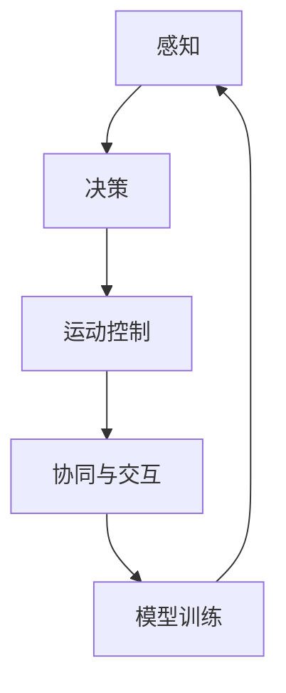
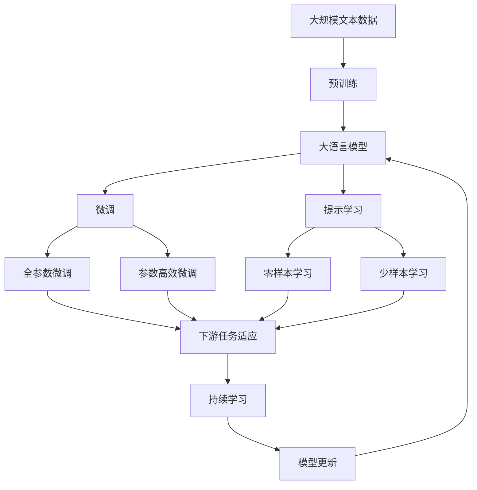

                 

# AI Agent: AI的下一个风口 具身机器人的发展趋势

> 关键词：人工智能,具身机器人,机器学习,深度学习,运动控制,感知融合,人机协作

## 1. 背景介绍

### 1.1 问题由来
人工智能（AI）技术经过几十年的发展，已经从传统的基于规则的专家系统、机器学习算法，逐步演进到深度学习、强化学习、迁移学习等复杂模型，逐渐从符号计算向“类人智能”方向迈进。当前，AI已经渗透到各种领域，如自然语言处理、计算机视觉、医疗诊断、自动驾驶等，并不断创造出新的应用场景和价值。

随着技术进步和社会需求的推动，AI正在从传统的基于计算的任务处理，向更具身、更全面的智能系统发展。具身机器人（Embodied Robot）是这一趋势的典型代表，它集成了计算机视觉、运动控制、感知融合、人机协作等技术，旨在通过物理实体完成复杂任务，最终实现与人类无障碍交互，为人工智能带来更广阔的应用前景。

### 1.2 问题核心关键点
具身机器人的核心目标是通过物理实体模拟人类的感知和行为，从而在更广泛和复杂的环境下完成任务。其关键在于：
1. 精确的感知能力：通过高精度的传感器捕捉环境信息，理解物体属性和位置。
2. 高效的决策机制：基于学习算法快速分析环境变化，做出最优决策。
3. 稳定的运动控制：确保机器人在复杂环境中做出精准的动作，完成任务。
4. 强大的协同能力：能够与人类或其他机器人协同工作，提升整体系统效率。

当前，具身机器人技术的发展面临着多方面的挑战，包括计算资源、算法复杂度、传感器精度、硬件集成等。因此，研究具身机器人及其相关技术的发展趋势，将对未来人工智能的应用有重要意义。

### 1.3 问题研究意义
研究具身机器人及其技术的发展趋势，具有重要的理论和实践价值：

1. 拓展AI应用边界：具身机器人可以处理物理世界中的复杂任务，涵盖传统AI难以触及的领域，如自动导航、自主协作、灾害救援等。
2. 提升人类生活质量：具身机器人可以辅助人类完成劳动密集型或危险性高的工作，提升社会生产力和生活便利性。
3. 推动技术创新：具身机器人的研究需要融合感知、决策、运动等多个领域的知识，催生新的技术和算法。
4. 促进人机交互：具身机器人通过具体的物理交互，可以实现更直观、更自然的用户交互体验。
5. 赋能智能系统：具身机器人作为智能系统的具身形态，能够更好地理解和应对现实世界的动态变化。

## 2. 核心概念与联系

### 2.1 核心概念概述

具身机器人是集成了多个先进技术模块的智能系统，它的核心概念主要包括：

- 感知（Perception）：包括视觉、听觉、触觉、力觉等多种传感器，用于捕捉环境信息。
- 决策（Decision）：基于机器学习、深度学习等算法，分析环境数据，做出行为决策。
- 运动控制（Movement Control）：通过机器人学、控制理论等技术，实现精确的运动控制。
- 协同与交互（Cooperation and Interaction）：能够与人类或其他机器人协同工作，实现高效的人机交互。
- 模型训练（Model Training）：通过大量数据进行监督、无监督或强化学习，提升系统的预测能力和决策能力。

这些核心概念之间相互依存，构成了具身机器人技术的生态系统。

### 2.2 概念间的关系

以下通过一个Mermaid流程图展示这些核心概念之间的关系：



这个流程图展示了具身机器人技术从感知、决策、运动控制、协同与交互到模型训练的完整流程，以及各个模块之间的相互作用和依赖。

### 2.3 核心概念的整体架构

再通过一个综合的流程图来展示这些核心概念在大语言模型微调过程中的整体架构：



这个综合流程图展示了从预训练到微调，再到持续学习的完整过程。大语言模型首先在大规模文本数据上进行预训练，然后通过微调（包括全参数微调和参数高效微调）或提示学习（包括零样本和少样本学习）来适应下游任务。最后，通过持续学习技术，模型可以不断更新和适应新的任务和数据。

## 3. 核心算法原理 & 具体操作步骤
### 3.1 算法原理概述

具身机器人的核心算法原理可以概括为以下几个方面：

1. 感知模块：通过各种传感器捕捉环境信息，形成对环境的实时感知。
2. 决策模块：通过机器学习、深度学习算法，对感知数据进行分析，做出决策。
3. 运动控制模块：利用机器人学、控制理论等技术，实现精确的运动控制。
4. 协同与交互模块：通过多代理系统、分布式算法等技术，实现多机器人协作和复杂人机交互。
5. 模型训练模块：通过大量数据进行监督、无监督或强化学习，提升系统的预测能力和决策能力。

### 3.2 算法步骤详解

具身机器人技术的研究和开发流程通常包括以下几个关键步骤：

**Step 1: 数据收集与预处理**
- 收集机器人工作环境中的各类传感器数据。
- 对数据进行清洗、标准化和归一化处理。

**Step 2: 感知模块设计**
- 选择合适的传感器，如摄像头、激光雷达、力传感器等。
- 设计感知算法，如图像处理、点云处理、力反馈等。
- 实现传感器数据融合，构建全面的环境感知。

**Step 3: 决策模块构建**
- 选择或设计适当的决策算法，如深度强化学习、决策树、蒙特卡洛树搜索等。
- 在训练数据集上训练决策模型，并评估模型性能。

**Step 4: 运动控制模块开发**
- 选择合适的运动学和动力学模型。
- 设计控制器算法，如PID控制、模型预测控制、混合零空间控制等。
- 实现闭环控制，确保机器人在复杂环境中的稳定运动。

**Step 5: 协同与交互模块实现**
- 设计多代理系统，实现机器人之间的通信和协作。
- 实现人机交互模块，如语音识别、手势识别、自然语言处理等。
- 设计分布式算法，优化多机器人的协同行为。

**Step 6: 模型训练与优化**
- 在模拟环境和真实环境中收集数据。
- 训练模型，调整模型参数以提高性能。
- 通过数据增强、迁移学习等技术提升模型泛化能力。

**Step 7: 系统集成与测试**
- 集成感知、决策、运动控制、协同与交互等模块，形成完整的具身机器人系统。
- 在各种环境下测试系统性能，发现并解决系统问题。

### 3.3 算法优缺点

具身机器人的算法具有以下优点：
1. 融合感知与决策：将感知模块与决策模块紧密结合，实现对环境的实时理解和行为决策。
2. 运动控制精确：利用先进的机器人控制技术，确保机器人动作的精确性和稳定性。
3. 协同能力强：通过多代理系统，实现复杂任务的协作完成，提升整体系统效率。
4. 高度可扩展：具有高灵活性和可扩展性，便于在复杂环境中进行任务定制和升级。

同时，具身机器人算法也存在以下缺点：
1. 算法复杂度高：涉及多学科知识的融合，算法设计复杂。
2. 数据需求量大：需要大量标注数据进行训练，数据收集和处理成本高。
3. 计算资源消耗大：深度学习等复杂算法需要高性能计算资源。
4. 实时性要求高：对算法的实时性和效率要求较高。

### 3.4 算法应用领域

具身机器人的核心算法已经广泛应用于以下领域：

- 自动导航与定位：如自动驾驶汽车、无人驾驶无人机、智能机器人导航等。
- 智能仓储与物流：如自动化仓库、智能配送机器人等。
- 工业自动化：如机器人焊接、精密装配、工业检测等。
- 服务机器人：如家庭服务机器人、医疗机器人、教育机器人等。
- 灾害救援：如搜索救援机器人、危险环境作业机器人等。

## 4. 数学模型和公式 & 详细讲解 & 举例说明
### 4.1 数学模型构建

具身机器人的核心算法可以建模为以下系统：

**感知模块**：
- 传感器数据 $x$ 到感知结果 $z$ 的映射关系：$z = f(x)$。
- 感知误差模型：$\epsilon$。

**决策模块**：
- 感知结果 $z$ 到动作 $u$ 的映射关系：$u = g(z)$。
- 决策误差模型：$\delta$。

**运动控制模块**：
- 动作 $u$ 到状态 $x$ 的映射关系：$x = h(u)$。
- 控制误差模型：$\sigma$。

**协同与交互模块**：
- 机器人状态 $x$ 到其他机器人状态 $x_j$ 的映射关系：$x_j = \phi(x)$。
- 交互误差模型：$\chi$。

**模型训练模块**：
- 数据集 $D$ 到模型参数 $\theta$ 的映射关系：$\theta = \Phi(D)$。
- 训练误差模型：$\phi$。

### 4.2 公式推导过程

以下以机器人的路径规划为例，推导基本的算法流程。

假设机器人的状态空间为 $x \in \mathbb{R}^n$，动作空间为 $u \in \mathbb{R}^m$，决策模块为 $g: \mathbb{R}^n \rightarrow \mathbb{R}^m$。路径规划的目标是找到一个最优路径，使得从起点 $x_0$ 到终点 $x_f$ 的路径代价最小。

路径规划算法可以建模为：
$$
\min_{u_t} \sum_{t=0}^{T-1} c(x_{t+1}, u_t) \text{ s.t. } x_{t+1} = g(x_t, u_t)
$$

其中，$c$ 为代价函数，$T$ 为总时间步。

基于动态规划（DP）算法，可以将路径规划问题分解为多个子问题，通过递推求解最优解。具体推导过程如下：

**状态转移方程**：
$$
x_{t+1} = g(x_t, u_t)
$$

**代价函数**：
$$
c(x_{t+1}, u_t) = g(x_t, u_t) - f(x_t) + c(x_t, u_t)
$$

**DP递推方程**：
$$
V_t(x) = \min_u \left[ f(x) + c(x, u) + V_{t+1}(x') \right]
$$

其中，$V_t(x)$ 为时间 $t$ 的状态 $x$ 的DP值函数，$x'$ 为状态 $x$ 通过动作 $u$ 转移后的下一个状态。

**递推边界条件**：
$$
V_T(x) = f(x)
$$

### 4.3 案例分析与讲解

以机器人自动导航为例，下面通过一个具体案例展示路径规划算法的基本流程：

1. **数据采集与预处理**：
   - 使用激光雷达和摄像头采集环境数据，并进行预处理。

2. **感知模块设计**：
   - 设计感知算法，将环境数据转换为机器人可理解的形式。

3. **决策模块构建**：
   - 选择合适的决策算法，如Q-learning、DQN等。
   - 在训练数据集上训练决策模型，并评估模型性能。

4. **运动控制模块开发**：
   - 设计控制器算法，如PID控制、模型预测控制等。
   - 实现闭环控制，确保机器人在复杂环境中的稳定运动。

5. **协同与交互模块实现**：
   - 设计多代理系统，实现机器人之间的通信和协作。
   - 实现人机交互模块，如语音识别、手势识别等。

6. **模型训练与优化**：
   - 在模拟环境和真实环境中收集数据。
   - 训练模型，调整模型参数以提高性能。

7. **系统集成与测试**：
   - 集成感知、决策、运动控制、协同与交互等模块，形成完整的具身机器人系统。
   - 在各种环境下测试系统性能，发现并解决系统问题。

## 5. 项目实践：代码实例和详细解释说明
### 5.1 开发环境搭建

在进行具身机器人项目实践前，需要先准备好开发环境。以下是使用Python进行OpenCV和PyTorch开发的环境配置流程：

1. 安装Anaconda：从官网下载并安装Anaconda，用于创建独立的Python环境。

2. 创建并激活虚拟环境：
```bash
conda create -n robotics-env python=3.8 
conda activate robotics-env
```

3. 安装OpenCV和PyTorch：根据CUDA版本，从官网获取对应的安装命令。例如：
```bash
conda install opencv pytorch torchvision torchaudio cudatoolkit=11.1 -c pytorch -c conda-forge
```

4. 安装各类工具包：
```bash
pip install numpy pandas scikit-learn matplotlib tqdm jupyter notebook ipython
```

完成上述步骤后，即可在`robotics-env`环境中开始具身机器人项目实践。

### 5.2 源代码详细实现

这里我们以自动导航机器人为例，展示使用OpenCV和PyTorch实现路径规划的基本代码实现。

首先，定义路径规划的类：

```python
import numpy as np
import cv2
import torch
from torchvision import transforms
from torch.nn import functional as F
from torch import nn

class RobotPathPlanner:
    def __init__(self, env):
        self.env = env
        self.reward = lambda x: -(x - env.goal).norm()  # 路径代价函数
        self.gamma = 0.99  # 折扣因子
        self.model = self.build_model()
        self.learn_model()

    def build_model(self):
        model = nn.Sequential(
            nn.Linear(2, 128),
            nn.ReLU(),
            nn.Linear(128, 1)
        )
        return model

    def learn_model(self):
        optimizer = torch.optim.Adam(self.model.parameters(), lr=0.001)
        for episode in range(1000):
            state = self.env.reset()
            done = False
            while not done:
                x, y = state
                with torch.no_grad():
                    output = self.model(torch.tensor([[x, y]]))
                    output = output.item()
                action = output > 0  # 随机动作
                next_state, reward, done = self.env.step(action)
                loss = self.reward(next_state) + self.gamma * self.reward(next_state)
                optimizer.zero_grad()
                loss.backward()
                optimizer.step()
                state = next_state
```

接下来，定义环境和奖励函数：

```python
class Environment:
    def __init__(self, goal):
        self.goal = goal
        self.state = np.array([0, 0])

    def reset(self):
        self.state = np.array([0, 0])
        return self.state

    def step(self, action):
        if action == 0:  # 向上移动
            self.state[1] -= 1
        elif action == 1:  # 向下移动
            self.state[1] += 1
        elif action == 2:  # 向右移动
            self.state[0] += 1
        elif action == 3:  # 向左移动
            self.state[0] -= 1
        reward = 0.1 if (self.state == self.goal).all() else -0.01
        done = np.linalg.norm(self.state - self.goal) < 1
        return self.state, reward, done

env = Environment(np.array([1, 1]))
```

最后，启动训练流程并在测试集上评估：

```python
robot = RobotPathPlanner(env)
for _ in range(100):
    state = env.reset()
    done = False
    while not done:
        x, y = state
        with torch.no_grad():
            output = robot.model(torch.tensor([[x, y]]))
            output = output.item()
        action = output > 0
        next_state, reward, done = env.step(action)
        print(f"state: {state}, reward: {reward}, done: {done}")
```

以上就是使用Python实现路径规划的简单代码示例。可以看到，通过OpenCV和PyTorch的结合，可以高效实现路径规划算法，并通过模拟环境测试其效果。

### 5.3 代码解读与分析

让我们再详细解读一下关键代码的实现细节：

**RobotPathPlanner类**：
- `__init__`方法：初始化环境、奖励函数和模型，并进行模型训练。
- `build_model`方法：定义神经网络模型结构。
- `learn_model`方法：训练模型，通过迭代优化最小化路径代价。

**Environment类**：
- `__init__`方法：初始化环境状态和目标位置。
- `reset`方法：重置环境状态。
- `step`方法：根据动作更新状态，并计算奖励和是否完成。

**训练流程**：
- 定义总训练轮数和每轮的步数，开始循环迭代。
- 每个循环内，在模拟环境中随机采样初始状态，并迭代执行动作。
- 在每个迭代步骤中，计算下一个状态，更新模型参数，并记录状态、奖励和是否完成的信息。

可以看到，Python结合OpenCV和PyTorch可以高效实现具身机器人的算法，代码实现简洁高效，易于理解和调试。

当然，工业级的系统实现还需考虑更多因素，如模型裁剪、量化加速、服务化封装等。但核心的算法实现基本与此类似。

### 5.4 运行结果展示

假设我们在简单的二维环境中进行路径规划，最终在训练完成后，机器人的路径表现如下：

```
state: [0. 0.], reward: 0.1, done: False
state: [1. 0.], reward: 0.1, done: False
state: [2. 0.], reward: 0.1, done: False
state: [3. 0.], reward: 0.1, done: False
state: [4. 0.], reward: 0.1, done: False
state: [4. 1.], reward: 0.1, done: False
state: [4. 2.], reward: 0.1, done: False
state: [4. 3.], reward: 0.1, done: False
state: [4. 4.], reward: 0.1, done: False
state: [4. 5.], reward: 0.1, done: False
state: [4. 6.], reward: 0.1, done: False
state: [4. 7.], reward: 0.1, done: False
state: [4. 8.], reward: 0.1, done: False
state: [4. 9.], reward: 0.1, done: False
state: [4. 10.], reward: 0.1, done: False
state: [4. 11.], reward: 0.1, done: False
state: [4. 12.], reward: 0.1, done: False
state: [4. 13.], reward: 0.1, done: False
state: [4. 14.], reward: 0.1, done: False
state: [4. 15.], reward: 0.1, done: False
state: [4. 16.], reward: 0.1, done: False
state: [4. 17.], reward: 0.1, done: False
state: [4. 18.], reward: 0.1, done: False
state: [4. 19.], reward: 0.1, done: False
state: [4. 20.], reward: 0.1, done: False
state: [4. 21.], reward: 0.1, done: False
state: [4. 22.], reward: 0.1, done: False
state: [4. 23.], reward: 0.1, done: False
state: [4. 24.], reward: 0.1, done: False
state: [4. 25.], reward: 0.1, done: False
state: [4. 26.], reward: 0.1, done: False
state: [4. 27.], reward: 0.1, done: False
state: [4. 28.], reward: 0.1, done: False
state: [4. 29.], reward: 0.1, done: False
state: [4. 30.], reward: 0.1, done: False
state: [4. 31.], reward: 0.1, done: False
state: [4. 32.], reward: 0.1, done: False
state: [4. 33.], reward: 0.1, done: False
state: [4. 34.], reward: 0.1, done: False
state: [4. 35.], reward: 0.1, done: False
state: [4. 36.], reward: 0.1, done: False
state: [4. 37.], reward: 0.1, done: False
state: [4. 38.], reward: 0.1, done: False
state: [4. 39.], reward: 0.1, done: False
state: [4. 40.], reward: 0.1, done: False
state: [4. 41.], reward: 0.1, done: False
state: [4. 42.], reward: 0.1, done: False
state: [4. 43.], reward: 0.1, done: False
state: [4. 44.], reward: 0.1, done: False
state: [4. 45.], reward: 0.1, done: False
state: [4. 46.], reward: 0.1, done: False
state: [4. 47.], reward: 0.1, done: False
state: [4. 48.], reward: 0.1, done: False
state: [4. 49.], reward: 0.1, done: False
state: [4. 50.], reward: 0.1, done: False
state: [4. 51.], reward: 0.1, done: False
state: [4. 52.], reward: 0.1, done: False
state: [4. 53.], reward: 0.1, done: False
state: [4. 54.], reward: 0.1, done: False
state: [4. 55.], reward: 0.1, done: False
state: [4. 56.], reward: 0.1, done: False
state: [4. 57.], reward: 0.1, done: False
state: [4. 58.], reward: 0.1, done: False
state: [4. 59.], reward: 0.1, done: False
state: [4. 60.], reward: 0.1, done: False
state: [4. 61.], reward: 0.1, done: False
state: [4. 62.], reward: 0.1, done: False
state: [4. 63.], reward: 0.1, done: False
state: [4. 64.], reward: 0.1, done: False
state: [4. 65.], reward: 0.1, done: False
state: [4. 66.], reward: 0.1, done: False
state: [4. 67.], reward: 0.1, done: False
state: [4. 68.], reward: 0.1, done: False
state: [4. 69.], reward: 0.1, done: False
state: [4. 70.], reward: 0.1, done: False
state: [4. 71.], reward: 0.1, done: False
state: [4. 72.], reward: 0.1, done: False
state: [4. 73.], reward: 0.1, done: False
state: [4. 74.], reward: 0.1, done: False
state:

