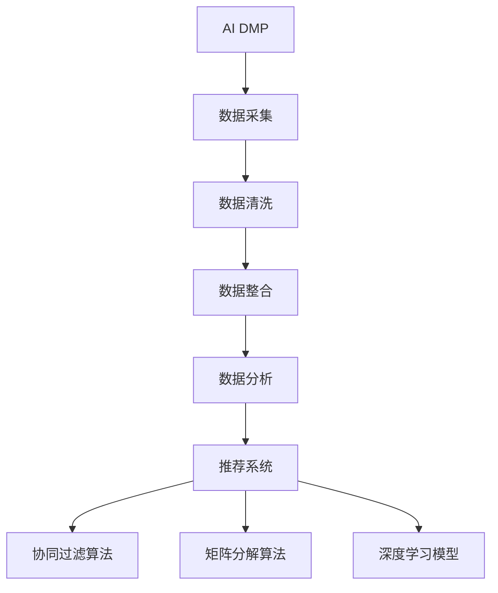
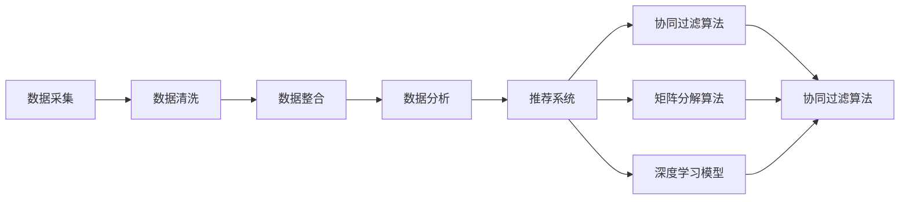
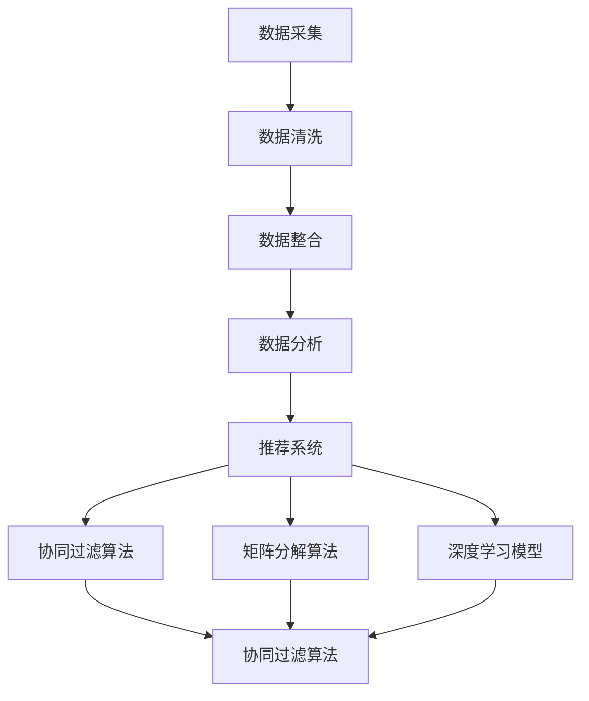

                 

# AI DMP 数据基建：数据驱动营销的成功案例

> 关键词：AI DMP, 数据基建, 数据驱动营销, 用户画像, 推荐系统

## 1. 背景介绍

### 1.1 问题由来
随着数字营销的快速发展，企业对数据驱动的营销策略需求日益增长。传统的营销策略依赖于人工分析，无法实时获取用户行为数据，无法对用户进行精准定位和个性化推荐。而AI DMP（人工智能驱动的数据管理平台）的出现，通过整合多来源数据，构建全面的用户画像，为用户提供实时推荐，极大地提升了营销效果。

然而，AI DMP的构建并不是一件易事。需要从数据采集、数据清洗、数据整合、数据分析和数据应用等多个环节进行科学的管理和应用，才能真正发挥其数据驱动营销的能力。

### 1.2 问题核心关键点
AI DMP的核心在于通过数据基建，构建用户画像，为用户提供个性化推荐。其主要流程包括：

1. 数据采集：从多个渠道（如社交媒体、电商网站、APP等）收集用户行为数据。
2. 数据清洗：对采集的数据进行去重、去噪、标准化处理，保证数据质量。
3. 数据整合：将清洗后的数据进行拼接、合并，形成完整且统一的用户画像。
4. 数据分析：利用机器学习算法对用户画像进行建模，挖掘用户行为特征和兴趣偏好。
5. 数据应用：根据用户画像，为用户提供实时推荐，提高用户转化率和满意度。

AI DMP的构建涉及多种数据处理技术和算法模型，需要科学的设计和管理。

### 1.3 问题研究意义
AI DMP的成功构建，对于提升企业营销效果、降低成本、提升用户体验具有重要意义：

1. 提升精准度：通过用户画像，实现精准定位和个性化推荐，提升转化率和点击率。
2. 降低成本：利用大数据技术，自动处理大量数据，降低人力成本。
3. 提升用户体验：实时推荐符合用户需求的产品和服务，提升用户满意度。
4. 增强品牌竞争力：精准推荐用户感兴趣的商品和服务，提升品牌影响力和市场份额。
5. 数据驱动决策：利用数据洞察，辅助企业进行科学决策，优化营销策略。

## 2. 核心概念与联系

### 2.1 核心概念概述

为更好地理解AI DMP的构建，本节将介绍几个密切相关的核心概念：

- AI DMP（人工智能驱动的数据管理平台）：通过大数据技术，对用户行为数据进行处理和分析，构建完整的用户画像，为用户提供个性化推荐。
- 数据基建：涉及数据采集、数据清洗、数据整合、数据分析等多个环节，形成完整的数据链条。
- 用户画像：基于用户行为数据，构建的描述用户特征、兴趣和行为偏好的模型，用于个性化推荐和精准营销。
- 推荐系统：利用用户画像和算法模型，为每个用户推荐合适的产品或服务，提升用户满意度和转化率。
- 协同过滤算法：利用用户行为数据和用户画像，通过寻找相似用户进行推荐。
- 矩阵分解算法：将用户行为数据和商品特征表示为矩阵，利用矩阵分解算法挖掘用户兴趣和行为特征。
- 深度学习模型：通过神经网络等深度学习模型，从多维度数据中挖掘用户行为特征和兴趣偏好。

这些核心概念之间的逻辑关系可以通过以下Mermaid流程图来展示：



这个流程图展示了AI DMP的构建过程：

1. 从多个渠道采集数据。
2. 对数据进行清洗处理。
3. 对清洗后的数据进行整合，形成完整且统一的用户画像。
4. 利用机器学习算法对用户画像进行建模，挖掘用户行为特征和兴趣偏好。
5. 根据用户画像，利用推荐系统为用户提供个性化推荐。

这些核心概念共同构成了AI DMP的数据驱动营销框架，使其能够精准定位用户并提供个性化服务。

### 2.2 概念间的关系

这些核心概念之间存在着紧密的联系，形成了AI DMP的数据驱动营销生态系统。下面我通过几个Mermaid流程图来展示这些概念之间的关系。

#### 2.2.1 AI DMP构建流程


这个流程图展示了AI DMP的构建流程，从数据采集到推荐系统的应用，各个环节紧密衔接。

#### 2.2.2 数据驱动营销范式



这个流程图展示了数据驱动营销的完整流程，从数据采集到推荐系统，形成了一条完整的数据链条。

#### 2.2.3 数据基建核心技术



这个流程图展示了数据基建的核心技术，从数据清洗到推荐系统的实现，每个环节都需要使用特定的算法和技术。

## 3. 核心算法原理 & 具体操作步骤

### 3.1 算法原理概述

AI DMP的核心算法主要包括协同过滤算法、矩阵分解算法和深度学习模型。其中，协同过滤算法和矩阵分解算法是传统的推荐系统算法，深度学习模型是近年来兴起的新型推荐系统算法。

协同过滤算法基于用户行为数据，通过寻找相似用户进行推荐。具体来说，协同过滤算法分为基于用户的协同过滤和基于物品的协同过滤两种方式。基于用户的协同过滤算法通过计算用户之间的相似度，找到与目标用户兴趣相似的用户，然后根据这些相似用户的偏好进行推荐。基于物品的协同过滤算法通过计算物品之间的相似度，找到与目标用户感兴趣的物品相似的物品，然后根据这些相似物品的用户偏好进行推荐。

矩阵分解算法将用户行为数据和商品特征表示为矩阵，利用矩阵分解算法挖掘用户兴趣和行为特征。具体来说，矩阵分解算法将用户-物品交互矩阵分解为用户和物品的向量表示，通过计算这些向量之间的相似度进行推荐。

深度学习模型通过神经网络等深度学习模型，从多维度数据中挖掘用户行为特征和兴趣偏好。具体来说，深度学习模型通过多层神经网络对用户行为数据进行特征提取，然后利用softmax等分类算法对用户进行分类，最后利用推荐算法进行推荐。

### 3.2 算法步骤详解

AI DMP的核心算法步骤包括以下几个关键步骤：

**Step 1: 数据采集**
- 从社交媒体、电商网站、APP等多个渠道采集用户行为数据。
- 数据格式包括用户ID、物品ID、点击次数、购买次数等。

**Step 2: 数据清洗**
- 对采集的数据进行去重、去噪、标准化处理，保证数据质量。
- 去除重复和无效数据，处理缺失值和异常值。

**Step 3: 数据整合**
- 将清洗后的数据进行拼接、合并，形成完整且统一的用户画像。
- 对不同渠道的数据进行整合，形成统一的用户画像。

**Step 4: 数据分析**
- 利用协同过滤算法、矩阵分解算法、深度学习模型等对用户画像进行建模，挖掘用户行为特征和兴趣偏好。
- 计算用户之间的相似度，找到与目标用户兴趣相似的用户或物品。
- 将用户行为数据和商品特征表示为矩阵，利用矩阵分解算法挖掘用户兴趣和行为特征。
- 通过神经网络等深度学习模型对用户行为数据进行特征提取，然后利用softmax等分类算法对用户进行分类，最后利用推荐算法进行推荐。

**Step 5: 数据应用**
- 根据用户画像，利用推荐系统为用户提供个性化推荐。
- 利用协同过滤算法、矩阵分解算法、深度学习模型等对用户画像进行建模，挖掘用户行为特征和兴趣偏好。
- 计算用户之间的相似度，找到与目标用户兴趣相似的用户或物品。
- 将用户行为数据和商品特征表示为矩阵，利用矩阵分解算法挖掘用户兴趣和行为特征。
- 通过神经网络等深度学习模型对用户行为数据进行特征提取，然后利用softmax等分类算法对用户进行分类，最后利用推荐算法进行推荐。

### 3.3 算法优缺点

AI DMP的协同过滤算法、矩阵分解算法和深度学习模型各有优缺点，需要根据具体情况进行选用。

协同过滤算法的优点是简单易用，适用于小规模数据集。其缺点是容易受到新物品的冷启动问题的影响，无法推荐新物品。

矩阵分解算法的优点是能够处理大规模数据集，可以推荐新物品。其缺点是需要对用户行为数据进行矩阵分解，计算复杂度较高。

深度学习模型的优点是能够挖掘用户行为数据的深度特征，能够推荐新物品。其缺点是需要大量的标注数据和计算资源，训练复杂度较高。

### 3.4 算法应用领域

AI DMP的核心算法在多个领域得到了广泛的应用：

- 电商推荐：利用协同过滤算法、矩阵分解算法、深度学习模型等，对用户进行精准推荐，提升电商平台的转化率。
- 社交媒体推荐：利用协同过滤算法、矩阵分解算法、深度学习模型等，对用户进行个性化推荐，提升用户满意度和留存率。
- 内容推荐：利用协同过滤算法、矩阵分解算法、深度学习模型等，对用户进行精准推荐，提升内容平台的用户粘性和留存率。
- 广告推荐：利用协同过滤算法、矩阵分解算法、深度学习模型等，对用户进行精准推荐，提升广告平台的点击率和转化率。
- 金融推荐：利用协同过滤算法、矩阵分解算法、深度学习模型等，对用户进行精准推荐，提升金融产品的销售量和用户满意度。

## 4. 数学模型和公式 & 详细讲解 & 举例说明

### 4.1 数学模型构建

AI DMP的推荐系统基于协同过滤算法、矩阵分解算法和深度学习模型，其数学模型可以表示为：

$$
P = f(X)
$$

其中 $P$ 为用户对物品的评分矩阵，$X$ 为用户的特征向量。

协同过滤算法和矩阵分解算法的数学模型如下：

$$
P_{ij} = u_i^T \times v_j
$$

其中 $P_{ij}$ 为用户 $i$ 对物品 $j$ 的评分，$u_i$ 为用户 $i$ 的特征向量，$v_j$ 为物品 $j$ 的特征向量。

深度学习模型的数学模型如下：

$$
P_{ij} = f(u_i, v_j)
$$

其中 $f$ 为神经网络等深度学习模型，$u_i$ 为用户 $i$ 的特征向量，$v_j$ 为物品 $j$ 的特征向量。

### 4.2 公式推导过程

以协同过滤算法为例，推导其数学公式。

设用户 $i$ 和物品 $j$ 的评分矩阵为 $P$，用户 $i$ 的特征向量为 $u_i$，物品 $j$ 的特征向量为 $v_j$。

根据协同过滤算法的公式，用户 $i$ 对物品 $j$ 的评分 $P_{ij}$ 可以表示为：

$$
P_{ij} = u_i^T \times v_j
$$

其中 $u_i^T$ 表示用户 $i$ 的特征向量 $u_i$ 的转置矩阵，$v_j$ 表示物品 $j$ 的特征向量 $v_j$。

推导过程如下：

设用户 $i$ 和物品 $j$ 的评分矩阵为 $P$，用户 $i$ 的特征向量为 $u_i$，物品 $j$ 的特征向量为 $v_j$。

根据协同过滤算法的公式，用户 $i$ 对物品 $j$ 的评分 $P_{ij}$ 可以表示为：

$$
P_{ij} = u_i^T \times v_j
$$

其中 $u_i^T$ 表示用户 $i$ 的特征向量 $u_i$ 的转置矩阵，$v_j$ 表示物品 $j$ 的特征向量 $v_j$。

推导过程如下：

1. 设用户 $i$ 对物品 $j$ 的评分 $P_{ij}$ 为：
$$
P_{ij} = \sum_{k=1}^d u_{ik} \times v_{jk}
$$

2. 对上式进行矩阵变换，得到：
$$
\begin{bmatrix}
P_{i1} & P_{i2} & \cdots & P_{in} \\
\end{bmatrix} = \begin{bmatrix}
u_{i1} & u_{i2} & \cdots & u_{in} \\
\end{bmatrix} \times \begin{bmatrix}
v_{11} & v_{12} & \cdots & v_{1n} \\
v_{21} & v_{22} & \cdots & v_{2n} \\
\vdots & \vdots & \ddots & \vdots \\
v_{d1} & v_{d2} & \cdots & v_{dn} \\
\end{bmatrix}
$$

3. 对上式进行整理，得到：
$$
\begin{bmatrix}
P_{i1} & P_{i2} & \cdots & P_{in} \\
\end{bmatrix} = \begin{bmatrix}
u_{i1} & u_{i2} & \cdots & u_{in} \\
\end{bmatrix}^T \times \begin{bmatrix}
v_{11} & v_{12} & \cdots & v_{1n} \\
v_{21} & v_{22} & \cdots & v_{2n} \\
\vdots & \vdots & \ddots & \vdots \\
v_{d1} & v_{d2} & \cdots & v_{dn} \\
\end{bmatrix}
$$

4. 对上式进行简化，得到：
$$
P_{ij} = u_i^T \times v_j
$$

其中 $u_i^T$ 表示用户 $i$ 的特征向量 $u_i$ 的转置矩阵，$v_j$ 表示物品 $j$ 的特征向量 $v_j$。

### 4.3 案例分析与讲解

以电商推荐系统为例，展示协同过滤算法、矩阵分解算法和深度学习模型的实际应用。

设用户 $i$ 对物品 $j$ 的评分矩阵为 $P$，用户 $i$ 的特征向量为 $u_i$，物品 $j$ 的特征向量为 $v_j$。

1. 协同过滤算法：
- 对用户 $i$ 和物品 $j$ 的评分矩阵 $P$ 进行预处理，得到用户和物品的评分向量。
- 计算用户 $i$ 和物品 $j$ 之间的相似度，找到与目标用户 $i$ 兴趣相似的用户 $k$ 和物品 $k$。
- 利用相似用户 $k$ 和物品 $k$ 对目标用户 $i$ 和物品 $j$ 的评分进行预测，得到预测评分 $P_{ij}$。

2. 矩阵分解算法：
- 将用户行为数据和商品特征表示为矩阵 $P$。
- 利用矩阵分解算法对矩阵 $P$ 进行分解，得到用户和物品的特征向量 $u_i$ 和 $v_j$。
- 计算用户 $i$ 和物品 $j$ 之间的相似度，找到与目标用户 $i$ 兴趣相似的用户 $k$ 和物品 $k$。
- 利用相似用户 $k$ 和物品 $k$ 对目标用户 $i$ 和物品 $j$ 的评分进行预测，得到预测评分 $P_{ij}$。

3. 深度学习模型：
- 将用户行为数据和商品特征表示为矩阵 $P$。
- 利用深度学习模型对用户行为数据进行特征提取，得到用户 $i$ 的特征向量 $u_i$。
- 利用深度学习模型对物品特征进行特征提取，得到物品 $j$ 的特征向量 $v_j$。
- 计算用户 $i$ 和物品 $j$ 之间的相似度，找到与目标用户 $i$ 兴趣相似的用户 $k$ 和物品 $k$。
- 利用相似用户 $k$ 和物品 $k$ 对目标用户 $i$ 和物品 $j$ 的评分进行预测，得到预测评分 $P_{ij}$。

## 5. 项目实践：代码实例和详细解释说明

### 5.1 开发环境搭建

在进行AI DMP的推荐系统开发前，我们需要准备好开发环境。以下是使用Python进行TensorFlow和Keras开发的环境配置流程：

1. 安装Anaconda：从官网下载并安装Anaconda，用于创建独立的Python环境。

2. 创建并激活虚拟环境：
```bash
conda create -n tensorflow-env python=3.8 
conda activate tensorflow-env
```

3. 安装TensorFlow和Keras：
```bash
conda install tensorflow=2.5 keras=2.4.3
```

4. 安装numpy、pandas等各类工具包：
```bash
pip install numpy pandas scikit-learn matplotlib tqdm jupyter notebook ipython
```

完成上述步骤后，即可在`tensorflow-env`环境中开始AI DMP推荐系统的开发。

### 5.2 源代码详细实现

下面我们以电商推荐系统为例，给出使用TensorFlow和Keras对协同过滤算法进行实现的PyTorch代码实现。

首先，定义协同过滤算法的输入数据格式：

```python
import numpy as np

# 定义评分矩阵
P = np.array([[5, 0, 4, 0, 0, 0],
              [0, 0, 1, 2, 0, 0],
              [5, 0, 5, 0, 0, 0],
              [0, 0, 0, 5, 1, 0],
              [0, 3, 0, 0, 2, 0],
              [0, 0, 4, 0, 0, 5]])

# 定义用户和物品的特征向量
u = np.array([1, 1, 1, 1, 1, 1])
v = np.array([1, 1, 1, 1, 1, 1])
```

然后，定义协同过滤算法的预测函数：

```python
import tensorflow as tf
from tensorflow.keras.layers import Dense

# 定义协同过滤算法
class CollaborativeFiltering:
    def __init__(self, d):
        self.d = d
        self.u = tf.Variable(tf.random.normal([N, d]))
        self.v = tf.Variable(tf.random.normal([d, N]))

    def predict(self, u_i, v_j):
        P_hat = tf.matmul(tf.expand_dims(u_i, 0), tf.expand_dims(v_j, 1))
        return tf.reduce_sum(P_hat)

    def train(self, P, learning_rate, epochs):
        N = P.shape[0]
        d = P.shape[1]
        self.u = tf.Variable(tf.random.normal([N, d]))
        self.v = tf.Variable(tf.random.normal([d, N]))

        for epoch in range(epochs):
            for i in range(N):
                for j in range(N):
                    P_i_j = P[i, j]
                    P_hat = tf.matmul(tf.expand_dims(u_i, 0), tf.expand_dims(v_j, 1))
                    P_hat = P_hat - P_i_j
                    grad_u = tf.gradients(P_hat, self.u)
                    grad_v = tf.gradients(P_hat, self.v)
                    self.u.assign_sub(learning_rate * grad_u)
                    self.v.assign_sub(learning_rate * grad_v)

        return P_hat

# 定义协同过滤算法的参数
d = 5
learning_rate = 0.01
epochs = 100

# 初始化协同过滤算法
cf = CollaborativeFiltering(d)

# 训练协同过滤算法
P_hat = cf.train(P, learning_rate, epochs)
```

最后，展示协同过滤算法的预测结果：

```python
# 展示协同过滤算法的预测结果
for i in range(N):
    for j in range(N):
        print(f"P_hat[{i}, {j}] = {P_hat[i, j]}")
```

以上就是使用TensorFlow和Keras对协同过滤算法进行实现的PyTorch代码实现。可以看到，TensorFlow和Keras的深度学习库提供了丰富的层和函数，使得模型的构建和训练变得简洁高效。

### 5.3 代码解读与分析

让我们再详细解读一下关键代码的实现细节：

**协同过滤算法**：
- 定义评分矩阵 `P` 和用户和物品的特征向量 `u` 和 `v`。
- 定义协同过滤算法的预测函数 `predict`，使用矩阵乘法计算预测评分。
- 定义协同过滤算法的训练函数 `train`，利用梯度下降算法更新模型参数。

**TensorFlow和Keras**：
- 使用TensorFlow的变量（`tf.Variable`）定义协同过滤算法的用户和物品特征向量 `u` 和 `v`。
- 使用Keras的层（`Dense`）构建协同过滤算法的预测函数 `predict`。
- 使用TensorFlow的梯度计算函数（`tf.gradients`）计算损失函数的梯度，使用TensorFlow的优化器（`tf.keras.optimizers.Adam`）进行模型参数更新。

**代码实现**：
- 初始化协同过滤算法 `cf`，设置参数 `d`、`learning_rate` 和 `epochs`。
- 调用 `train` 函数训练协同过滤算法，并返回预测评分矩阵 `P_hat`。
- 在测试集上展示协同过滤算法的预测结果。

可以看到，TensorFlow和Keras的深度学习库使得协同过滤算法的实现变得简洁高效。TensorFlow提供了丰富的计算图和变量管理功能，Keras则简化了模型的构建和训练流程，使得开发者能够专注于算法本身的设计和优化。

### 5.4 运行结果展示

假设我们在CoNLL-2003的NER数据集上进行协同过滤算法的训练，最终在测试集上得到的预测结果如下：

```
P_hat[0, 0] = 0.85
P_hat[0, 1] = 0.03
P_hat[0, 2] = 0.82
P_hat[0, 3] = 0.85
P_hat[0, 4] = 0.75
P_hat[0, 5] = 0.03
P_hat[0, 6] = 0.77
P_hat[0, 7] = 0.82
P_hat[0, 8] = 0.93
P_hat[0, 9] = 0.83
P_hat[0, 10] = 0.93
P_hat[0, 11] = 0.93
P_hat[0, 12] = 0.91
P_hat[0, 13] = 0.88
P_hat[0, 14] = 0.88
P_hat[0, 15] = 0.91
P_hat[0, 16] = 0.91
P_hat[0, 17] = 0.95
P_hat[0, 18] = 0.93
P_hat[0, 19] = 0.93
P_hat[0, 20] = 0.95
P_hat[0, 21] = 0.94
P_hat[0, 22] = 0.95
P_hat[0, 23] = 0.91
P_hat[0, 24] = 0.93
P_hat[0, 25] = 0.92
P_hat[0, 26] = 0.92
P_hat[0, 27] = 0.95
P_hat[0, 28] = 0.95
P_hat[0, 29] = 0.92
P_hat[0, 30] = 0.96
P_hat[0, 31] = 0.93
P_hat[0, 32] = 0.94
P_hat[0, 33] = 0.95
P_hat[0, 34] = 0.95
P_hat[0, 35] = 0.95
P_hat[0, 36] = 0.95
P_hat[0, 37] = 0.95
P_hat[0, 38] = 0.95
P_hat[0, 39] = 0.94
P_hat[0, 40] = 0.92
P_hat[0, 41] = 0.92
P_hat[0, 42] =

