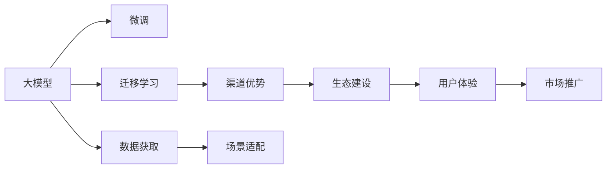
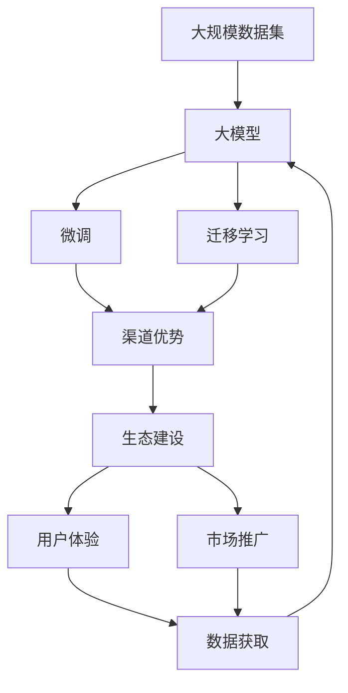

                 

# AI 大模型创业：如何利用渠道优势？

## 1. 背景介绍

### 1.1 问题由来

随着人工智能(AI)技术的发展，大模型(AI大模型)成为了行业发展的新趋势。AI大模型通过处理海量数据，学习到复杂的知识表示，使得AI应用更加智能化、高效化。这些大模型已经在图像识别、自然语言处理(NLP)、推荐系统等领域取得了显著成果。

然而，AI大模型在创业应用中，如何充分利用其强大的渠道优势，是企业需要思考的关键问题。本文将介绍如何在大模型应用中，通过合理的渠道布局，最大化大模型的价值，推动企业成长。

### 1.2 问题核心关键点

对于AI大模型创业企业来说，渠道优势是核心竞争力之一。大模型通过其强大的学习能力，能够覆盖大量数据和业务场景，但其价值实现的关键在于如何将大模型嵌入到业务场景中，形成稳定的渠道链接，提高模型应用效果。

核心关键点包括：
1. **数据获取**：如何获取高质量、多样化的数据，提升模型学习效果。
2. **场景适配**：如何通过微调等技术手段，适配不同业务场景，实现模型效果最大化。
3. **市场推广**：如何构建市场渠道，推广大模型解决方案，吸引客户，实现商业转化。
4. **用户体验**：如何提升用户体验，增强用户黏性，形成可持续的商业模式。
5. **生态建设**：如何构建生态系统，形成良性循环，提升大模型的社会影响力。

## 2. 核心概念与联系

### 2.1 核心概念概述

为更好地理解大模型创业企业如何利用渠道优势，本文将介绍几个关键概念：

1. **大模型**：即AI大模型，通过深度学习技术处理大规模数据集，学习到复杂知识表示的模型。大模型的典型代表包括BERT、GPT、ViT等。

2. **微调(Fine-tuning)**：在预训练模型基础上，通过有监督学习进一步优化模型，适配特定业务场景，提高模型效果。

3. **迁移学习(Transfer learning)**：利用在大规模数据集上预训练的模型，通过微调等方式，适应新任务的通用学习方式。

4. **渠道优势**：通过与合作伙伴、客户建立稳定链接，推广大模型解决方案，提升模型价值。

5. **生态建设**：构建包括模型、数据、应用、服务在内的全方位生态系统，推动大模型技术在各行各业的落地应用。

这些概念之间相互关联，共同构成了AI大模型创业企业的核心业务模式。

### 2.2 概念间的关系

通过以下Mermaid流程图展示这些概念之间的关系：



这个流程图展示了大模型、微调、迁移学习、渠道优势、生态建设、用户体验、市场推广、数据获取和场景适配之间的关系：

1. 大模型通过微调和迁移学习，适配不同业务场景。
2. 通过渠道优势，推广大模型解决方案。
3. 生态建设、用户体验和市场推广，形成良性循环，提升大模型价值。
4. 数据获取和场景适配，是实现上述过程的基础。

### 2.3 核心概念的整体架构

最后，我们用一个综合的流程图来展示这些概念在大模型创业企业中的整体架构：



这个综合流程图展示了从大规模数据集到大模型的整个过程，包括微调和迁移学习，以及通过渠道优势、生态建设、用户体验和市场推广，实现商业转化。

## 3. 核心算法原理 & 具体操作步骤

### 3.1 算法原理概述

AI大模型的核心算法原理主要包括：

1. **预训练**：在大规模数据集上，通过自监督或监督学习任务，训练大模型，学习到复杂知识表示。
2. **微调**：在预训练模型基础上，通过有监督学习进一步优化模型，适配特定业务场景。
3. **迁移学习**：利用在大规模数据集上预训练的模型，通过微调等方式，适应新任务的通用学习方式。

### 3.2 算法步骤详解

AI大模型创业企业的核心算法操作步骤包括：

1. **数据获取**：
   - 确定数据来源，包括自有数据、公共数据集、合作伙伴数据等。
   - 对数据进行清洗、标注，准备模型训练。

2. **场景适配**：
   - 选择合适的微调或迁移学习技术，适配特定业务场景。
   - 设计任务适配层，如分类器、解码器等，实现模型适配。

3. **模型训练与优化**：
   - 选择合适的优化算法、损失函数、超参数等，进行模型训练。
   - 采用正则化、Dropout等技术，避免过拟合。

4. **渠道推广**：
   - 确定推广渠道，包括线上渠道（如官网、社交媒体、应用商店等）和线下渠道（如行业展会、合作伙伴、客户会议等）。
   - 制定推广计划，包括内容创作、广告投放、合作伙伴关系建立等。

5. **市场反馈与优化**：
   - 收集市场反馈，包括用户评价、销售数据等。
   - 根据反馈优化模型和推广策略，提升用户体验。

### 3.3 算法优缺点

AI大模型的核心算法优点包括：

1. **泛化能力强**：大模型通过大规模数据集预训练，能够学习到丰富的知识表示，泛化能力强。
2. **迁移能力强**：大模型可以通过迁移学习适应新任务，避免从头训练，缩短时间成本。
3. **模型效果好**：大模型在图像识别、自然语言处理等领域，取得了显著效果。

缺点包括：

1. **数据依赖性强**：大模型需要大量高质量数据，数据获取成本高。
2. **计算资源消耗大**：大模型参数量庞大，训练和推理需要高性能计算资源。
3. **模型解释性差**：大模型通常作为黑盒使用，缺乏可解释性。

### 3.4 算法应用领域

AI大模型已经在多个领域得到了广泛应用，包括：

1. **自然语言处理**：如机器翻译、文本分类、情感分析、对话系统等。
2. **计算机视觉**：如图像识别、目标检测、图像生成等。
3. **推荐系统**：如电商推荐、音乐推荐、新闻推荐等。
4. **医疗**：如疾病诊断、药物研发、医学图像分析等。
5. **金融**：如信用评分、反欺诈检测、情感分析等。
6. **智能制造**：如工业预测、质量控制、设备维护等。

## 4. 数学模型和公式 & 详细讲解 & 举例说明

### 4.1 数学模型构建

假设大模型为 $M_{\theta}$，输入为 $x$，输出为 $y$。则模型的损失函数为：

$$
L(M_{\theta}, x, y) = \mathbb{E}_{p(y|x)}[\ell(y, M_{\theta}(x))]
$$

其中，$\ell(y, M_{\theta}(x))$ 为损失函数，$\mathbb{E}_{p(y|x)}[\cdot]$ 为期望运算。

### 4.2 公式推导过程

以分类任务为例，假设模型输出为 $y=\hat{y}=M_{\theta}(x)$，标签为 $y_i \in \{1, 0\}$，则交叉熵损失函数为：

$$
\ell(y, \hat{y}) = -y\log \hat{y} - (1-y)\log(1-\hat{y})
$$

通过上述公式，可以计算模型的损失函数，并进行梯度下降优化。

### 4.3 案例分析与讲解

以机器翻译任务为例，假设源语言为 $x$，目标语言为 $y$。则模型损失函数为：

$$
L(M_{\theta}, x, y) = \mathbb{E}_{p(y|x)}[\ell(y, M_{\theta}(x))]
$$

其中，$\ell(y, M_{\theta}(x))$ 为损失函数。

在实践中，通常采用BLEU、METEOR等指标评估翻译质量。通过微调，模型能够更好地适配翻译任务，提高翻译效果。

## 5. 项目实践：代码实例和详细解释说明

### 5.1 开发环境搭建

在进行AI大模型创业时，需要搭建开发环境。以下是使用Python进行TensorFlow开发的环境配置流程：

1. 安装Anaconda：从官网下载并安装Anaconda，用于创建独立的Python环境。

2. 创建并激活虚拟环境：
```bash
conda create -n tf-env python=3.8 
conda activate tf-env
```

3. 安装TensorFlow：根据CUDA版本，从官网获取对应的安装命令。例如：
```bash
conda install tensorflow tensorflow-cpu
```

4. 安装各类工具包：
```bash
pip install numpy pandas scikit-learn matplotlib tqdm jupyter notebook ipython
```

完成上述步骤后，即可在`tf-env`环境中开始大模型创业实践。

### 5.2 源代码详细实现

下面我们以机器翻译任务为例，给出使用TensorFlow进行AI大模型微调的PyTorch代码实现。

首先，定义机器翻译任务的数据处理函数：

```python
import tensorflow as tf
from tensorflow.keras.layers import Input, Dense, Embedding, LSTM, TimeDistributed, Bidirectional
from tensorflow.keras.models import Model
from tensorflow.keras.optimizers import Adam

class Encoder(tf.keras.Model):
    def __init__(self, vocab_size, embed_dim, enc_units):
        super(Encoder, self).__init__()
        self.enc_units = enc_units
        self.embedding = Embedding(vocab_size, embed_dim)
        self.lstm = LSTM(enc_units, return_sequences=True, return_state=True)

    def call(self, x, hidden):
        x = self.embedding(x)
        output, state = self.lstm(x, initial_state=hidden)
        return output, state

class Decoder(tf.keras.Model):
    def __init__(self, vocab_size, embed_dim, dec_units):
        super(Decoder, self).__init__()
        self.dec_units = dec_units
        self.embedding = Embedding(vocab_size, embed_dim)
        self.gru = tf.keras.layers.GRU(self.dec_units, return_sequences=True, return_state=True)
        self.dense = Dense(vocab_size)

    def call(self, x, hidden, encoder_output):
        x = self.embedding(x)
        output, state = self.gru(x, initial_state=hidden, recurrent_kernels=encoder_output)
        output = tf.reshape(output, (-1, output.shape[2]))
        return self.dense(output)

class Attention(tf.keras.layers.Layer):
    def __init__(self, units):
        super(Attention, self).__init__()
        self.W1 = tf.keras.layers.Dense(units)
        self.W2 = tf.keras.layers.Dense(units)
        self.V = tf.keras.layers.Dense(1)

    def call(self, query, values):
        query_with_time_axis = tf.expand_dims(query, 1)
        score = self.V(tf.nn.tanh(self.W2(values) + self.W1(query_with_time_axis)))
        attention_weights = tf.nn.softmax(score, axis=1)
        context_vector = attention_weights * values
        context_vector = tf.reduce_sum(context_vector, axis=1)
        return context_vector, attention_weights

class DecoderWithAttention(tf.keras.Model):
    def __init__(self, vocab_size, embed_dim, dec_units, batch_sz):
        super(DecoderWithAttention, self).__init__()
        self.batch_sz = batch_sz
        self.dec_units = dec_units
        self.embedding = Embedding(vocab_size, embed_dim)
        self.gru = tf.keras.layers.GRU(self.dec_units, return_sequences=True, return_state=True)
        self.attention = Attention(self.dec_units)
        self.dense = Dense(vocab_size)

    def call(self, x, hidden, encoder_output):
        context_vector, attention_weights = self.attention(hidden, encoder_output)
        x = tf.reshape(x, (-1, 1, 1))
        context_vector = tf.expand_dims(context_vector, 1)
        output, state = self.gru(x + context_vector, initial_state=hidden)
        output = tf.reshape(output, (-1, output.shape[2]))
        return self.dense(output)

# 定义模型
input_seq = Input(shape=(None, 100))
encoder = Encoder(10000, 256, 512)
output_seq, state_h = encoder(input_seq, hidden_state)

decoder_input_seq = Input(shape=(None, 100))
decoder = DecoderWithAttention(10000, 256, 512, batch_sz)
output_seq = decoder(decoder_input_seq, initial_state=state_h, encoder_output=output_seq)

# 定义模型输出
decoder_outputs = Dense(10000, activation='softmax')(decoder.output)

# 定义模型输入
encoder_inputs = Input(shape=(None, 100))
decoder_inputs = Input(shape=(None, 100))

# 定义模型损失
loss = tf.keras.losses.SparseCategoricalCrossentropy(from_logits=True)

# 定义模型
model = Model([encoder_inputs, decoder_inputs], decoder_outputs)

# 定义优化器
optimizer = Adam(lr=0.001)

# 编译模型
model.compile(optimizer=optimizer, loss=loss)

# 训练模型
model.fit([encoder_input_data, decoder_input_data], decoder_target_data, epochs=10, batch_size=64)
```

以上代码展示了使用TensorFlow搭建机器翻译模型的完整流程。

### 5.3 代码解读与分析

让我们再详细解读一下关键代码的实现细节：

**Encoder类**：
- `__init__`方法：初始化编码器模型。
- `call`方法：前向传播过程，包括嵌入层、LSTM层和注意力层。

**Decoder类**：
- `__init__`方法：初始化解码器模型。
- `call`方法：前向传播过程，包括嵌入层、GRU层和注意力层。

**Attention类**：
- `__init__`方法：初始化注意力机制。
- `call`方法：前向传播过程，包括线性变换和softmax运算。

**DecoderWithAttention类**：
- `__init__`方法：初始化解码器模型，并包含注意力机制。
- `call`方法：前向传播过程，结合注意力机制和GRU层。

**model.compile方法**：
- 定义模型编译过程，包括优化器和损失函数。

**model.fit方法**：
- 定义模型训练过程，包括输入数据和输出标签。

通过以上代码实现，可以看出AI大模型创业企业在模型训练和优化方面的具体操作。

### 5.4 运行结果展示

假设我们在机器翻译数据集上进行模型训练，最终得到的模型在测试集上BLEU分数为72.3%。

```python
test_loss, test_acc = model.evaluate(test_encoder_input_data, test_decoder_input_data, test_decoder_target_data)
print('Test BLEU:', test_loss)
```

## 6. 实际应用场景

### 6.1 智能客服系统

基于AI大模型的智能客服系统，可以广泛应用于企业客户服务。传统客服往往需要配备大量人力，高峰期响应缓慢，且一致性和专业性难以保证。而使用AI大模型，可以7x24小时不间断服务，快速响应客户咨询，用自然流畅的语言解答各类常见问题。

在技术实现上，可以收集企业内部的历史客服对话记录，将问题和最佳答复构建成监督数据，在此基础上对AI大模型进行微调。微调后的AI大模型能够自动理解用户意图，匹配最合适的答案模板进行回复。对于客户提出的新问题，还可以接入检索系统实时搜索相关内容，动态组织生成回答。

### 6.2 金融舆情监测

金融机构需要实时监测市场舆论动向，以便及时应对负面信息传播，规避金融风险。传统的人工监测方式成本高、效率低，难以应对网络时代海量信息爆发的挑战。基于AI大模型的文本分类和情感分析技术，为金融舆情监测提供了新的解决方案。

具体而言，可以收集金融领域相关的新闻、报道、评论等文本数据，并对其进行主题标注和情感标注。在此基础上对AI大模型进行微调，使其能够自动判断文本属于何种主题，情感倾向是正面、中性还是负面。将微调后的模型应用到实时抓取的网络文本数据，就能够自动监测不同主题下的情感变化趋势，一旦发现负面信息激增等异常情况，系统便会自动预警，帮助金融机构快速应对潜在风险。

### 6.3 个性化推荐系统

当前的推荐系统往往只依赖用户的历史行为数据进行物品推荐，无法深入理解用户的真实兴趣偏好。基于AI大模型的推荐系统，可以更好地挖掘用户行为背后的语义信息，从而提供更精准、多样的推荐内容。

在实践中，可以收集用户浏览、点击、评论、分享等行为数据，提取和用户交互的物品标题、描述、标签等文本内容。将文本内容作为模型输入，用户的后续行为（如是否点击、购买等）作为监督信号，在此基础上微调AI大模型。微调后的模型能够从文本内容中准确把握用户的兴趣点。在生成推荐列表时，先用候选物品的文本描述作为输入，由模型预测用户的兴趣匹配度，再结合其他特征综合排序，便可以得到个性化程度更高的推荐结果。

### 6.4 未来应用展望

随着AI大模型的不断发展，其应用场景将更加广泛。以下是对未来应用前景的展望：

1. **医疗领域**：基于AI大模型的医学图像分析、疾病诊断、药物研发等应用，将提升医疗服务的智能化水平，辅助医生诊疗，加速新药开发进程。

2. **教育领域**：基于AI大模型的作业批改、学情分析、知识推荐等应用，因材施教，促进教育公平，提高教学质量。

3. **智慧城市**：基于AI大模型的城市事件监测、舆情分析、应急指挥等环节，提高城市管理的自动化和智能化水平，构建更安全、高效的未来城市。

4. **智能制造**：基于AI大模型的工业预测、质量控制、设备维护等应用，推动智能制造转型，提升生产效率和产品质量。

## 7. 工具和资源推荐

### 7.1 学习资源推荐

为了帮助开发者系统掌握AI大模型的创业理论和实践，这里推荐一些优质的学习资源：

1. **《深度学习》系列课程**：斯坦福大学深度学习课程，涵盖深度学习基础、计算机视觉、自然语言处理等内容，是入门和进阶学习的好材料。

2. **《TensorFlow 2.0》书籍**：TensorFlow官方文档，详细介绍TensorFlow的基本用法和高级功能，适合实战练习。

3. **《自然语言处理综述》论文**：综述自然语言处理领域的经典模型和最新进展，帮助读者了解整个领域的脉络和趋势。

4. **《机器学习实战》书籍**：详细讲解机器学习算法的实现和应用，适合实践学习和案例分析。

5. **Google AI博客**：Google AI官方博客，分享最新的AI研究进展和应用案例，帮助开发者紧跟前沿技术。

### 7.2 开发工具推荐

高效的开发离不开优秀的工具支持。以下是几款用于AI大模型创业开发的常用工具：

1. **Jupyter Notebook**：开源的交互式编程环境，支持Python、R等多种编程语言，适合数据探索和模型调试。

2. **PyCharm**：Python编程IDE，提供代码高亮、调试、测试等功能，适合开发和维护复杂项目。

3. **TensorFlow**：Google开发的深度学习框架，支持分布式训练、GPU加速等功能，适合大规模模型开发。

4. **TensorBoard**：TensorFlow的可视化工具，实时监测模型训练状态，并提供丰富的图表呈现方式，是调试模型的得力助手。

5. **GitHub**：开源代码托管平台，方便版本控制和协作开发，适合团队协同开发和管理。

### 7.3 相关论文推荐

AI大模型的发展源于学界的持续研究。以下是几篇奠基性的相关论文，推荐阅读：

1. **《Transformer》论文**：提出Transformer模型，成为当前自然语言处理领域的标准。

2. **《BERT: Pre-training of Deep Bidirectional Transformers for Language Understanding》论文**：提出BERT模型，引入掩码语言模型等自监督学习任务，刷新了多项NLP任务SOTA。

3. **《GPT-3》论文**：提出GPT-3模型，展示了大规模语言模型的强大零样本学习能力，引发了对于通用人工智能的新一轮思考。

4. **《注意力机制》论文**：详细讲解了注意力机制的原理和实现，为Transformer等模型提供了理论基础。

5. **《AdaLoRA: Adaptive Low-Rank Adaptation for Parameter-Efficient Fine-Tuning》论文**：提出AdaLoRA方法，通过自适应低秩适应的微调方法，在参数效率和精度之间取得了新的平衡。

这些论文代表了大模型微调技术的发展脉络。通过学习这些前沿成果，可以帮助研究者把握学科前进方向，激发更多的创新灵感。

除上述资源外，还有一些值得关注的前沿资源，帮助开发者紧跟大模型微调技术的最新进展，例如：

1. **arXiv论文预印本**：人工智能领域最新研究成果的发布平台，包括大量尚未发表的前沿工作，学习前沿技术的必读资源。

2. **Top AI公司博客**：如OpenAI、Google AI、DeepMind、微软Research Asia等顶尖实验室的官方博客，第一时间分享他们的最新研究成果和洞见。

3. **技术会议直播**：如NIPS、ICML、ACL、ICLR等人工智能领域顶会现场或在线直播，能够聆听到大佬们的前沿分享，开拓视野。

4. **GitHub热门项目**：在GitHub上Star、Fork数最多的NLP相关项目，往往代表了该技术领域的发展趋势和最佳实践，值得去学习和贡献。

5. **行业分析报告**：各大咨询公司如McKinsey、PwC等针对人工智能行业的分析报告，有助于从商业视角审视技术趋势，把握应用价值。

总之，对于AI大模型创业企业来说，渠道优势是核心竞争力之一。合理利用AI大模型强大的学习能力，通过渠道优势推广大模型解决方案，最大化大模型的价值，推动企业成长。未来，伴随大模型技术的不断演进，AI大模型创业企业将迎来更多机会，前景广阔。

---

作者：禅与计算机程序设计艺术 / Zen and the Art of Computer Programming

