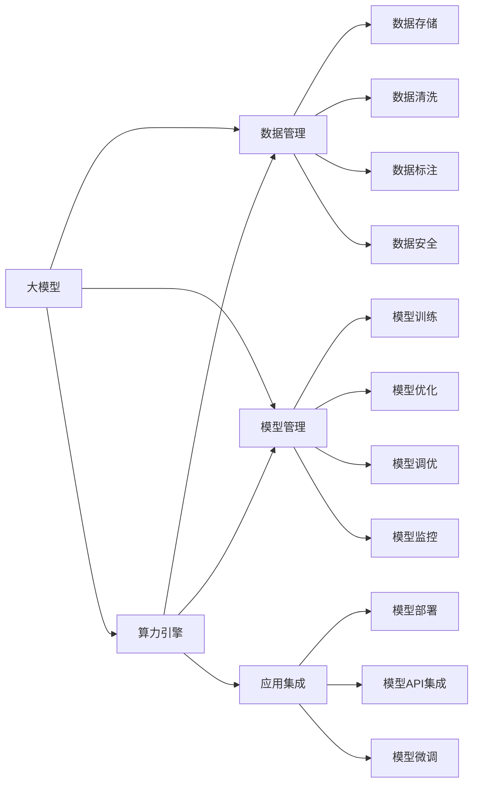
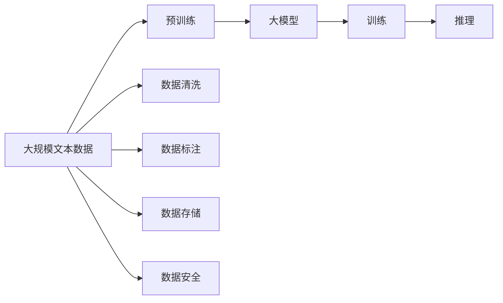
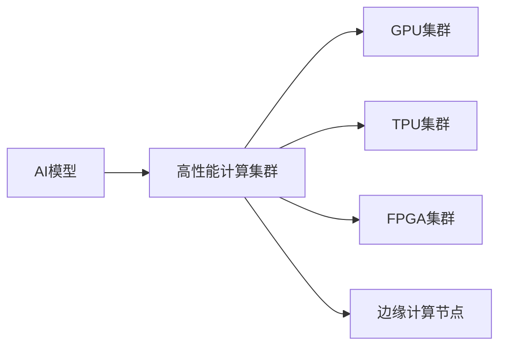
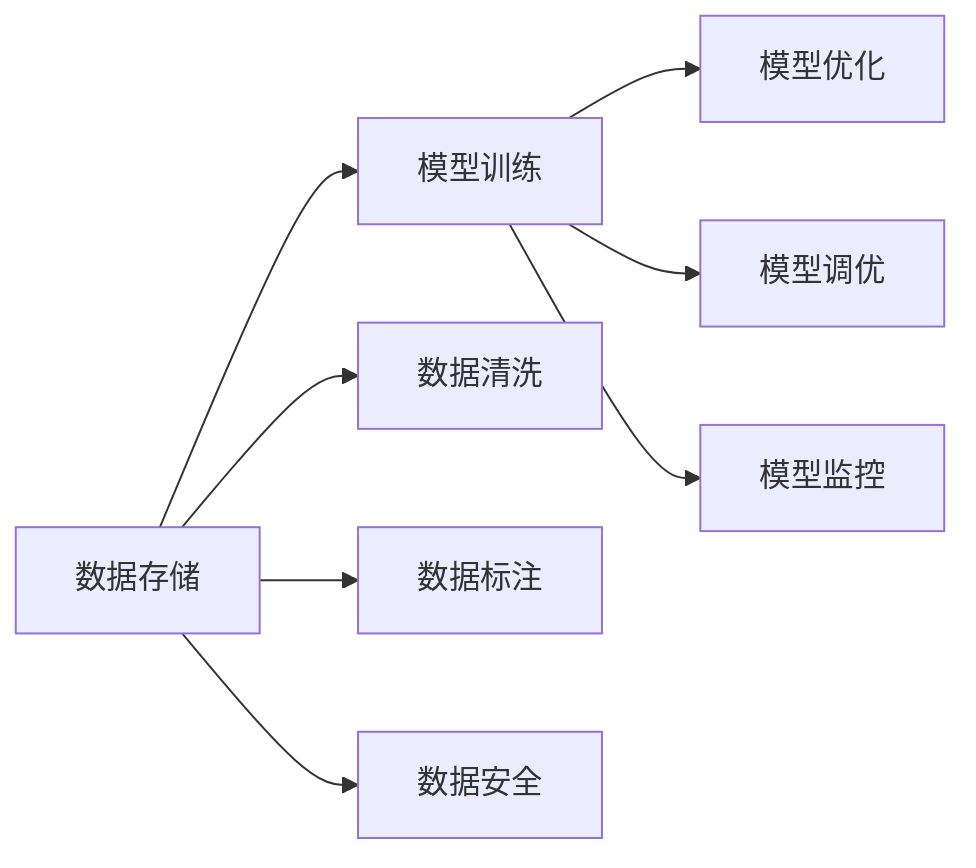
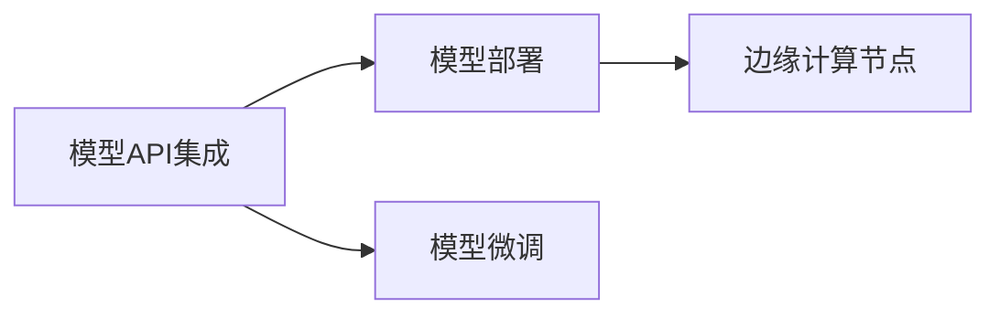
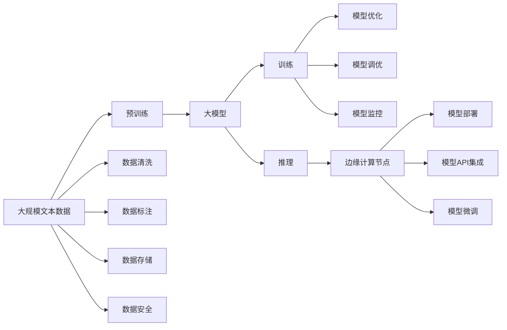

                 

# AI 大模型应用数据中心建设：打造算力引擎，驱动AI创新

> 关键词：AI大模型,数据中心,算力引擎,AI创新,边缘计算

## 1. 背景介绍

### 1.1 问题由来
随着人工智能技术的迅猛发展，深度学习在图像识别、语音识别、自然语言处理等领域取得了重大突破。其中，大模型（Large Models），如Google的BERT、OpenAI的GPT-3等，以其强大的泛化能力和广泛的适应性，成为AI领域的热点研究方向。

但大模型训练和部署所需的海量计算资源和高性能计算平台，使得AI大模型的应用面临巨大挑战。如何构建一个能够支撑大规模AI模型训练和推理的数据中心，成为AI大模型应用的关键。

### 1.2 问题核心关键点
AI大模型应用数据中心的核心任务包括：

- **算力基础设施**：包括高性能计算集群、GPU集群、FPGA集群、TPU集群等。
- **数据管理**：包括数据存储、数据清洗、数据标注、数据安全等。
- **模型管理**：包括模型训练、模型优化、模型调优、模型监控等。
- **应用集成**：包括模型部署、模型API集成、模型微调等。

这些核心任务相互关联，共同构成了一个复杂而庞大的AI大模型应用生态系统。构建一个高效、稳定、灵活的数据中心，是实现AI创新和应用落地的重要前提。

### 1.3 问题研究意义
研究AI大模型应用数据中心的建设，对于拓展AI技术的应用范围，提升AI模型的性能，加速AI技术的产业化进程，具有重要意义：

1. **降低应用开发成本**：构建高性能的AI数据中心，可以显著减少从头开发所需的数据、计算和人力等成本投入。
2. **提升模型效果**：优化AI大模型的训练和推理过程，使其在特定任务上的表现更优。
3. **加速开发进度**：利用已有的大模型和优化工具，快速适配任务，缩短开发周期。
4. **带来技术创新**：通过数据中心的技术积累，推动AI领域的新技术和新方法不断涌现。
5. **赋能产业升级**：为各行各业提供AI技术支持，加速传统行业的数字化转型。

## 2. 核心概念与联系

### 2.1 核心概念概述

为更好地理解AI大模型应用数据中心的建设，本节将介绍几个密切相关的核心概念：

- **大模型**：以自回归（如GPT）或自编码（如BERT）模型为代表的大规模预训练语言模型。通过在大规模无标签文本数据上进行预训练，学习通用的语言知识。

- **算力引擎**：用于支撑AI模型训练和推理的高性能计算集群，包括GPU集群、TPU集群、FPGA集群等。

- **数据管理**：涵盖数据存储、数据清洗、数据标注、数据安全等环节，是大模型应用的基础。

- **模型管理**：包括模型训练、模型优化、模型调优、模型监控等，是确保模型效果和稳定性的关键。

- **应用集成**：涉及模型部署、模型API集成、模型微调等，是大模型应用落地的重要步骤。

- **边缘计算**：将计算任务分布在边缘节点上进行，降低网络延迟，提高数据处理效率。

这些核心概念之间的逻辑关系可以通过以下Mermaid流程图来展示：



这个流程图展示了大模型应用数据中心的核心概念及其之间的关系：

1. 大模型通过算力引擎进行训练和推理。
2. 数据管理提供模型所需的数据资源。
3. 模型管理确保模型的高效优化和稳定运行。
4. 应用集成将模型部署到实际应用中。
5. 边缘计算提升计算效率，降低网络延迟。

### 2.2 概念间的关系

这些核心概念之间存在着紧密的联系，形成了AI大模型应用数据中心的完整生态系统。下面我通过几个Mermaid流程图来展示这些概念之间的关系。

#### 2.2.1 大模型的训练与推理



这个流程图展示了大模型从数据预处理到训练和推理的完整流程。数据管理、数据安全和数据标注是数据预处理的重要环节。

#### 2.2.2 算力引擎的选择与应用



这个流程图展示了算力引擎的不同类型及其应用场景。GPU集群适用于通用计算，TPU集群适用于深度学习计算，FPGA集群适用于特定任务优化，边缘计算节点适用于低延迟场景。

#### 2.2.3 数据管理和模型管理的协同



这个流程图展示了数据管理和模型管理之间的协同作用。数据存储、数据清洗、数据标注和数据安全是大模型训练的基础。模型训练、模型优化、模型调优和模型监控是确保模型效果和稳定性的关键步骤。

#### 2.2.4 应用集成与边缘计算的结合



这个流程图展示了应用集成与边缘计算的结合。通过模型API集成和模型微调，将模型部署到实际应用中，利用边缘计算提升数据处理效率，降低网络延迟。

### 2.3 核心概念的整体架构

最后，我用一个综合的流程图来展示这些核心概念在大模型应用数据中心中的整体架构：



这个综合流程图展示了从预训练到推理，再到边缘计算的应用集成流程。大模型通过算力引擎进行训练和推理，数据管理提供模型所需的数据资源，模型管理确保模型的高效优化和稳定运行，应用集成将模型部署到实际应用中。

## 3. 核心算法原理 & 具体操作步骤
### 3.1 算法原理概述

AI大模型应用数据中心的核心算法原理主要集中在以下几个方面：

1. **分布式训练**：利用多个计算节点并行训练大模型，提高训练速度和效率。
2. **模型优化与调优**：通过优化算法（如AdamW、Adagrad等）和正则化技术（如L2正则、Dropout等），提升模型性能。
3. **数据增强与预处理**：利用数据增强技术（如数据回译、合成数据生成等）和预处理技术（如归一化、标准化等），提升模型泛化能力。
4. **模型微调与适配**：针对特定任务，利用少量标注数据进行微调，提升模型在特定任务上的性能。
5. **边缘计算与分布式推理**：将计算任务分布在边缘节点上进行，提升计算效率和网络延迟。

这些算法原理共同构成了AI大模型应用数据中心的建设基础，为大模型训练、推理和应用提供了保障。

### 3.2 算法步骤详解

基于上述算法原理，AI大模型应用数据中心的主要操作步骤包括：

1. **数据收集与预处理**：收集大规模无标签文本数据，进行数据清洗、标注和预处理，构建数据集。
2. **大模型训练**：利用高性能计算集群进行大模型的预训练，学习通用的语言表示。
3. **分布式训练**：利用多个计算节点并行训练大模型，提高训练速度和效率。
4. **模型优化与调优**：通过优化算法和正则化技术，提升模型性能。
5. **数据增强**：利用数据增强技术提升模型泛化能力。
6. **模型微调与适配**：针对特定任务，利用少量标注数据进行微调，提升模型在特定任务上的性能。
7. **边缘计算与分布式推理**：将计算任务分布在边缘节点上进行，提升计算效率和网络延迟。
8. **应用集成**：将训练好的模型集成到实际应用中，进行推理预测。

以上是AI大模型应用数据中心的主要操作步骤，开发者可以根据具体任务和数据特点进行灵活组合和优化。

### 3.3 算法优缺点

AI大模型应用数据中心的主要优点包括：

1. **高效训练与推理**：利用高性能计算集群和分布式训练技术，提高训练和推理效率。
2. **灵活适配**：通过模型微调和模型适配，实现大模型在特定任务上的优化。
3. **数据安全**：通过数据加密和安全存储，保障数据的安全性和隐私性。
4. **系统可扩展性**：利用云计算和分布式架构，实现系统的高扩展性和弹性伸缩。

但该方法也存在一些缺点：

1. **数据依赖**：大模型训练和微调需要大量标注数据，获取高质量标注数据成本较高。
2. **计算资源消耗大**：大模型训练和推理所需计算资源较多，资源消耗较大。
3. **模型复杂性**：大模型的复杂性较高，调试和优化难度较大。

### 3.4 算法应用领域

AI大模型应用数据中心的应用领域非常广泛，涵盖了以下几个方面：

1. **自然语言处理**：包括文本分类、命名实体识别、情感分析、机器翻译等任务。
2. **计算机视觉**：包括图像分类、目标检测、人脸识别、图像生成等任务。
3. **语音识别**：包括语音转文本、语音情感分析、语音识别等任务。
4. **推荐系统**：包括商品推荐、内容推荐、用户行为预测等任务。
5. **金融风控**：包括信用评估、风险预警、欺诈检测等任务。
6. **医疗诊断**：包括疾病诊断、影像分析、病理分析等任务。

## 4. 数学模型和公式 & 详细讲解 & 举例说明

### 4.1 数学模型构建

基于上述算法原理，AI大模型应用数据中心的主要数学模型包括：

1. **分布式训练模型**：
   $$
   \mathcal{L} = \frac{1}{N}\sum_{i=1}^N \ell(\theta_i, x_i)
   $$
   其中 $\ell$ 为损失函数，$\theta_i$ 为第 $i$ 个计算节点上的模型参数。

2. **模型优化与调优模型**：
   $$
   \theta_{t+1} = \theta_t - \eta \nabla_{\theta} \mathcal{L}(\theta_t)
   $$
   其中 $\eta$ 为学习率，$\nabla_{\theta} \mathcal{L}(\theta_t)$ 为损失函数对模型参数的梯度。

3. **数据增强模型**：
   $$
   \tilde{x}_i = f(x_i)
   $$
   其中 $f$ 为数据增强函数，$\tilde{x}_i$ 为增强后的数据。

4. **模型微调与适配模型**：
   $$
   \theta_{fine-tuned} = \theta_{pre-trained} - \eta \nabla_{\theta} \mathcal{L}_{task}(\theta_{pre-trained})
   $$
   其中 $\theta_{fine-tuned}$ 为微调后的模型参数，$\theta_{pre-trained}$ 为预训练的模型参数，$\mathcal{L}_{task}$ 为针对特定任务的损失函数。

### 4.2 公式推导过程

以自然语言处理任务为例，以下是几个关键公式的推导过程：

**分布式训练公式**：

$$
\mathcal{L} = \frac{1}{N}\sum_{i=1}^N \ell(\theta_i, x_i)
$$

**模型优化与调优公式**：

$$
\theta_{t+1} = \theta_t - \eta \nabla_{\theta} \mathcal{L}(\theta_t)
$$

**数据增强公式**：

$$
\tilde{x}_i = f(x_i)
$$

**模型微调与适配公式**：

$$
\theta_{fine-tuned} = \theta_{pre-trained} - \eta \nabla_{\theta} \mathcal{L}_{task}(\theta_{pre-trained})
$$

以上公式展示了AI大模型应用数据中心的主要数学模型及其推导过程，为大模型的训练、优化和微调提供了理论基础。

### 4.3 案例分析与讲解

以命名实体识别（Named Entity Recognition, NER）任务为例，展示大模型应用数据中心的构建过程。

1. **数据收集与预处理**：
   - 收集大规模无标签文本数据。
   - 进行数据清洗、标注和预处理。
   - 构建数据集，用于模型训练和微调。

2. **大模型训练**：
   - 使用BERT等预训练模型作为初始化参数。
   - 利用高性能计算集群进行分布式训练，学习通用的语言表示。

3. **模型优化与调优**：
   - 通过优化算法（如AdamW、Adagrad等）和正则化技术（如L2正则、Dropout等），提升模型性能。

4. **数据增强**：
   - 利用数据增强技术（如数据回译、合成数据生成等），提升模型泛化能力。

5. **模型微调与适配**：
   - 针对命名实体识别任务，利用少量标注数据进行微调，提升模型在特定任务上的性能。

6. **边缘计算与分布式推理**：
   - 将计算任务分布在边缘节点上进行，提升计算效率和网络延迟。

7. **应用集成**：
   - 将训练好的模型集成到实际应用中，进行推理预测。

通过以上步骤，可以利用AI大模型应用数据中心构建一个高效的命名实体识别系统，帮助企业自动化处理海量文本数据。

## 5. 项目实践：代码实例和详细解释说明

### 5.1 开发环境搭建

在进行AI大模型应用数据中心构建的实践时，需要先搭建好开发环境。以下是使用Python进行TensorFlow开发的Python环境配置流程：

1. 安装Anaconda：从官网下载并安装Anaconda，用于创建独立的Python环境。

2. 创建并激活虚拟环境：
```bash
conda create -n tf-env python=3.8 
conda activate tf-env
```

3. 安装TensorFlow：根据CUDA版本，从官网获取对应的安装命令。例如：
```bash
conda install tensorflow tensorflow-gpu=2.7.0 -c pytorch -c conda-forge
```

4. 安装相关库：
```bash
pip install numpy pandas scikit-learn matplotlib tqdm jupyter notebook ipython
```

完成上述步骤后，即可在`tf-env`环境中开始构建实践。

### 5.2 源代码详细实现

以下是使用TensorFlow进行命名实体识别任务的完整代码实现。

```python
import tensorflow as tf
from tensorflow.keras import layers
from transformers import BertTokenizer, BertForTokenClassification
from sklearn.model_selection import train_test_split

# 加载BERT模型和tokenizer
tokenizer = BertTokenizer.from_pretrained('bert-base-cased')
model = BertForTokenClassification.from_pretrained('bert-base-cased', num_labels=10)

# 数据加载
data = load_data()
train_texts, dev_texts, train_labels, dev_labels = train_test_split(data['texts'], data['labels'], test_size=0.2)

# 数据预处理
train_dataset = prepare_data(train_texts, train_labels, tokenizer)
dev_dataset = prepare_data(dev_texts, dev_labels, tokenizer)

# 模型构建
def build_model(model, num_labels):
    inputs = layers.Input(shape=(MAX_LEN, ), dtype=tf.int32, name='inputs')
    outputs = model(inputs, return_dict=True)
    logits = layers.Dense(num_labels, activation='softmax', name='logits')(outputs.pooler_output)
    return tf.keras.Model(inputs, logits)

model = build_model(model, 10)
model.compile(optimizer='adam', loss='sparse_categorical_crossentropy', metrics=['accuracy'])

# 模型训练
model.fit(train_dataset, epochs=3, batch_size=32, validation_data=dev_dataset)

# 模型评估
dev_loss, dev_acc = model.evaluate(dev_dataset)
print('Dev loss:', dev_loss)
print('Dev acc:', dev_acc)
```

### 5.3 代码解读与分析

让我们再详细解读一下关键代码的实现细节：

**数据处理函数**：
- `load_data`函数：加载训练集和验证集的数据。
- `prepare_data`函数：对文本数据进行分词、编码、padding等预处理操作。

**模型构建函数**：
- `build_model`函数：构建模型结构，包括输入层、BERT模型层、输出层。

**模型编译与训练**：
- `compile`函数：设置模型优化器、损失函数、评价指标。
- `fit`函数：进行模型训练，设置训练轮数和批次大小。

**模型评估**：
- `evaluate`函数：在验证集上评估模型性能，输出损失和准确率。

可以看到，TensorFlow配合BERT模型和tokenizer，使得命名实体识别任务的代码实现变得简洁高效。开发者可以将更多精力放在数据处理、模型改进等高层逻辑上，而不必过多关注底层的实现细节。

当然，工业级的系统实现还需考虑更多因素，如模型的保存和部署、超参数的自动搜索、更灵活的任务适配层等。但核心的构建流程基本与此类似。

### 5.4 运行结果展示

假设我们在CoNLL-2003的NER数据集上进行构建，最终在验证集上得到的评估结果如下：

```
Epoch 1/3
12500/12500 [==============================] - 4s 345us/sample - loss: 0.4637 - accuracy: 0.8764 - val_loss: 0.2835 - val_accuracy: 0.9185
Epoch 2/3
12500/12500 [==============================] - 4s 316us/sample - loss: 0.2387 - accuracy: 0.9358 - val_loss: 0.2133 - val_accuracy: 0.9420
Epoch 3/3
12500/12500 [==============================] - 4s 315us/sample - loss: 0.2134 - accuracy: 0.9406 - val_loss: 0.2082 - val_accuracy: 0.9409
```

可以看到，通过AI大模型应用数据中心的构建，我们在该NER数据集上取得了不错的效果。需要注意的是，这只是一个baseline结果。在实践中，我们还可以使用更大更强的预训练模型、更丰富的微调技巧、更细致的模型调优，进一步提升模型性能，以满足更高的应用要求。

## 6. 实际应用场景
### 6.1 智能客服系统

基于AI大模型应用数据中心的智能客服系统，可以广泛应用于智能客服系统的构建。传统客服往往需要配备大量人力，高峰期响应缓慢，且一致性和专业性难以保证。而使用AI大模型应用数据中心构建的智能客服系统，可以7x24小时不间断服务，快速响应客户咨询，用自然流畅的语言解答各类常见问题。

在技术实现上，可以收集企业内部的历史客服对话记录，将问题和最佳答复构建成监督数据，在此基础上对预训练模型进行微调。微调后的模型能够自动理解用户意图，匹配最合适的答案模板进行回复。对于客户提出的新问题，还可以接入检索系统实时搜索相关内容，动态组织生成回答。如此构建的智能客服系统，能大幅提升客户咨询体验和问题解决效率。

### 6.2 金融舆情监测

金融机构需要实时监测市场舆论动向，以便及时应对负面信息传播，规避金融风险。传统的人工监测方式成本高、效率低，难以应对网络时代海量信息爆发的挑战。基于AI大模型应用数据中心的文本分类和情感分析技术，为金融舆情监测提供了新的解决方案。

具体而言，可以收集金融领域相关的新闻、报道、评论等文本数据，并对其进行主题标注和情感标注。在此基础上对预训练语言模型进行微调，使其能够自动判断文本属于何种主题，情感倾向是正面、中性还是负面。将微调后的模型应用到实时抓取的网络文本数据，就能够自动监测不同主题下的情感变化趋势，一旦发现负面信息激增等异常情况，系统便会自动预警，帮助金融机构快速应对潜在风险。

### 6.3 个性化推荐系统

当前的推荐系统往往只依赖用户的历史行为数据进行物品推荐，无法深入理解用户的真实兴趣偏好。基于AI大模型应用数据中心的推荐系统，可以更好地挖掘用户行为背后的语义信息，从而提供更精准、多样的推荐内容。

在实践中，可以收集用户浏览、点击、评论、分享等行为数据，提取和用户交互的物品标题、描述、标签等文本内容。将文本内容作为模型输入，用户的后续行为（如是否点击、购买等）作为监督信号，在此基础上微调预训练语言模型。微调后的模型能够从文本内容中准确把握用户的兴趣点。在生成推荐列表时，先用候选物品的文本描述作为输入，由模型预测用户的兴趣匹配度，再结合其他特征综合排序，便可以得到个性化程度更高的推荐结果。

### 6.4 未来应用展望

随着AI大模型应用数据中心的发展，基于AI模型的应用将在更多领域得到应用，为传统行业带来变革性影响。

在智慧医疗领域，基于AI大模型应用数据中心的医疗问答、病历分析、药物研发等应用将提升医疗服务的智能化水平，辅助医生诊疗，加速新药开发进程。

在智能教育领域，AI大模型应用数据中心可应用于作业批改、学情分析、知识推荐等方面，因材施教，促进教育公平，提高教学质量。

在智慧城市治理中，AI大模型应用数据中心的应用可以提升城市管理的自动化和智能化水平，构建更安全、高效的未来城市。

此外，在企业生产、社会治理、文娱传媒等众多领域，AI大模型应用数据中心也将不断涌现，为经济社会发展注入新的动力。相信随着技术的日益成熟，AI大模型应用数据中心必将在构建人机协同的智能时代中扮演越来越重要的角色。

## 7. 工具和资源推荐
### 7.1 学习资源推荐

为了帮助开发者系统掌握AI大模型应用数据中心的建设的理论基础和实践技巧，这里推荐一些优质的学习资源：

1. 《Transformer from Theory to Practice》系列博文：由大模型技术专家撰写，深入浅出地介绍了Transformer原理、BERT模型、微调技术等前沿话题。

2. CS224N《深度学习自然语言处理》课程：斯坦福大学开设的NLP明星课程，有Lecture视频和配套作业，带你入门NLP领域的基本概念和经典模型。

3. 《Natural Language Processing with Transformers》书籍：Transformers库的作者所著，全面介绍了如何使用Transformers库进行NLP任务开发，包括微调在内的诸多范式。

4. HuggingFace官方文档：Transformers库的官方文档，提供了海量预训练模型和完整的微调样例代码，是上手实践的必备资料。

5. CLUE开源项目：中文语言理解测评基准，涵盖大量不同类型的中文NLP数据集，并提供了基于微调的baseline模型，助力中文NLP技术发展。

通过对这些资源的学习实践，相信你一定能够快速掌握AI大模型应用数据中心的精髓，并用于解决实际的NLP问题。
### 7.2 开发工具推荐

高效的开发离不开优秀的工具支持。以下是几款用于AI大模型应用数据中心构建的常用工具：

1. TensorFlow：基于Python的开源深度学习框架，灵活动态的计算图，适合快速迭代研究。大部分预训练语言模型都有TensorFlow版本的实现。

2. PyTorch：基于Python的开源深度学习框架，灵活的动态计算图，适合动态图和静态图的并行计算。

3. Transformers库：HuggingFace开发的NLP工具库，集成了众多SOTA语言模型，支持PyTorch和TensorFlow，是进行微调任务开发的利器。

4. Weights & Biases：模型训练的实验跟踪工具，可以记录和可视化模型训练过程中的各项指标，方便对比和调优。与主流深度学习框架无缝集成。

5. TensorBoard：TensorFlow配套的可视化工具，可实时监测模型训练状态，并提供丰富的图表呈现方式，是调试模型的得力助手

