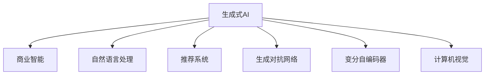
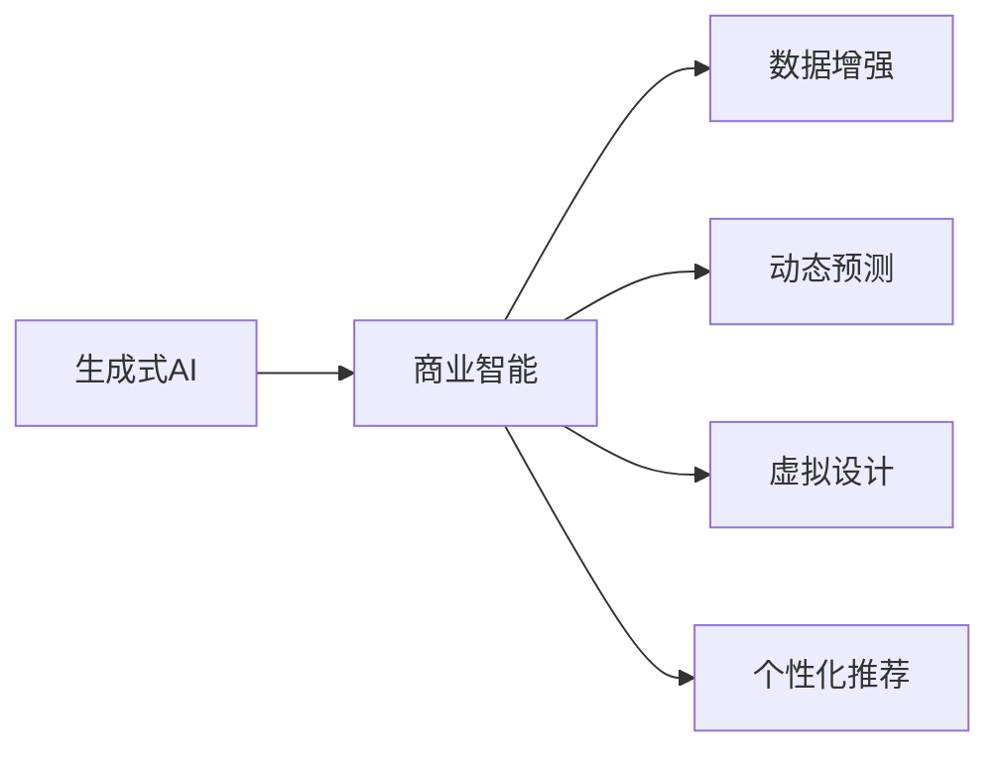
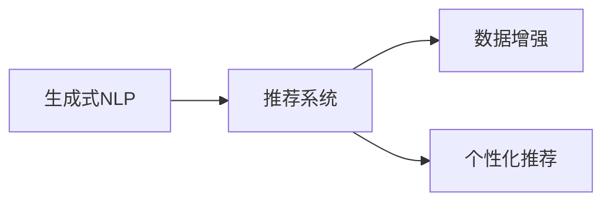
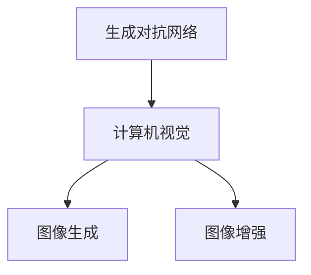
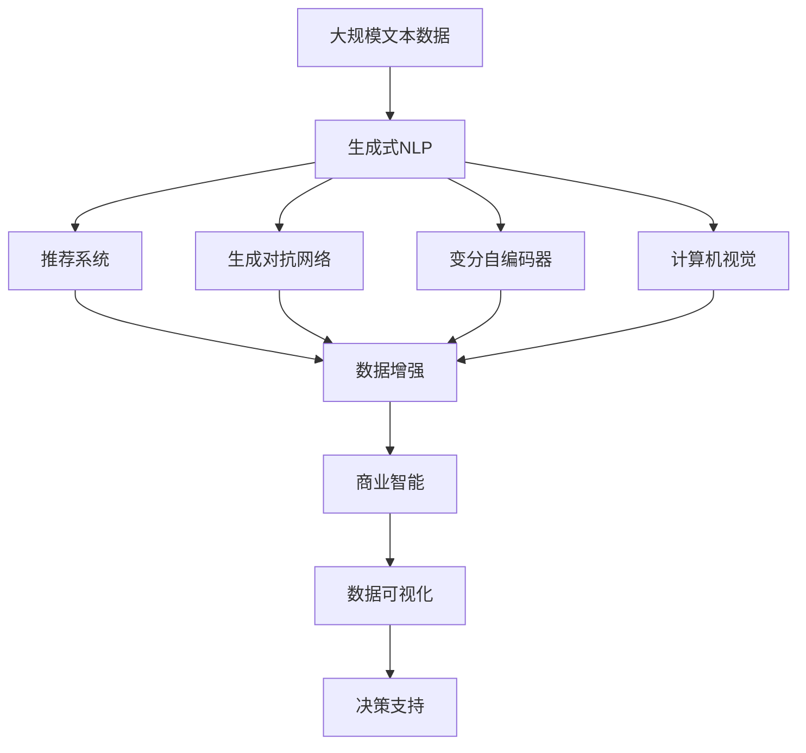

                 

# 生成式AIGC：商业智能的未来趋势

> 关键词：生成式AI,商业智能,大模型,自然语言处理(NLP),推荐系统,生成对抗网络(GAN),计算机视觉(CV)

## 1. 背景介绍

### 1.1 问题由来
在过去的十年中，人工智能(AI)技术迅猛发展，尤其是在生成式人工智能（Generative AI, AI-GC）领域。生成式AI通过学习大数据集的特征，能够生成新的、具有高度逼真度的文本、图像、音频等内容，极大地推动了商业智能(BI)、营销、创意设计、虚拟现实(VR)等多个行业的发展。

随着技术日益成熟，生成式AI在商业智能中的应用愈发广泛。如今，商业智能不再局限于静态数据分析，而越来越多地借助生成式AI进行动态预测、数据增强、虚拟设计等多种场景。如何有效利用生成式AI技术，构建更智能的商业智能系统，成为了当前的热点话题。

### 1.2 问题核心关键点
当前，生成式AI在商业智能中的应用主要集中在以下几个方面：

1. **生成式自然语言处理(NLP)**：利用生成式NLP模型，从文本数据中自动生成摘要、报告、问题解答等内容，提升决策效率和数据可读性。
2. **数据增强**：通过生成式模型自动扩充数据集，提高模型的泛化能力和训练效率。
3. **虚拟设计**：利用生成式模型自动生成产品设计、广告素材等，降低设计成本和周期。
4. **动态预测**：使用生成式模型进行市场趋势预测、客户行为模拟，为决策提供更准确的信息。

生成式AI通过自主生成高质量数据和内容，显著提高了商业智能系统的人机交互体验和自动化水平。然而，生成式AI在实际应用中也面临诸多挑战，如生成质量的不稳定性、模型复杂度高等。因此，如何优化生成式AI技术，提升其在商业智能系统中的表现，仍需深入研究和探讨。

### 1.3 问题研究意义
研究生成式AI在商业智能中的应用，对于推动商业智能的智能化、自动化、个性化进程，具有重要意义：

1. **提升数据质量**：生成式模型可以自动扩充数据集，提升模型训练质量，减少数据采集和标注成本。
2. **提高决策效率**：生成式AI能够自动生成高质量的报告、建议等内容，辅助决策者快速理解和行动。
3. **降低设计成本**：自动生成设计方案、广告素材等，大幅缩短设计周期和降低设计成本。
4. **增强用户体验**：通过生成式AI生成个性化推荐内容，提升用户满意度和粘性。
5. **优化营销策略**：自动生成广告文案、营销视频等内容，提升营销效果和ROI。

本文聚焦于生成式AI在商业智能中的应用，探讨其核心原理、操作步骤及实际应用场景，以期为商业智能系统的智能化升级提供参考。

## 2. 核心概念与联系

### 2.1 核心概念概述

为了更好地理解生成式AI在商业智能中的应用，本节将介绍几个密切相关的核心概念：

- **生成式AI (AI-GC)**：使用生成模型进行数据生成，如生成式NLP模型、生成对抗网络（GAN）、变分自编码器（VAE）等。
- **商业智能 (BI)**：通过数据收集、清洗、分析和可视化，辅助决策过程，提升商业运营效率和收益。
- **自然语言处理 (NLP)**：使计算机能够理解、处理和生成自然语言的技术。
- **推荐系统**：通过用户行为数据进行个性化推荐，提升用户满意度和转化率。
- **生成对抗网络 (GAN)**：由生成器和判别器两部分组成，用于生成高质量的图像、视频等内容。
- **变分自编码器 (VAE)**：利用概率模型进行数据压缩和生成，适用于文本、图像等多种类型的数据。
- **计算机视觉 (CV)**：使计算机能够处理、分析和理解图像和视频内容的技术。

这些核心概念之间的逻辑关系可以通过以下Mermaid流程图来展示：



这个流程图展示了大语言模型微调过程中各个核心概念的关系和作用：

1. 生成式AI通过学习数据特征，自动生成高质量的文本、图像、视频等内容。
2. 商业智能利用这些生成的数据进行多维度分析和决策支持。
3. 自然语言处理、推荐系统、生成对抗网络、变分自编码器和计算机视觉等技术，是大语言模型微调的关键组成部分。

### 2.2 概念间的关系

这些核心概念之间存在着紧密的联系，形成了生成式AI在商业智能系统中的完整生态系统。下面我们通过几个Mermaid流程图来展示这些概念之间的关系。

#### 2.2.1 生成式AI与商业智能的关系



这个流程图展示了生成式AI与商业智能系统的关系。生成式AI通过数据增强、动态预测、虚拟设计、个性化推荐等多种方式，辅助商业智能系统进行决策支持和数据优化。

#### 2.2.2 生成式NLP与推荐系统的联系



这个流程图展示了生成式NLP与推荐系统的联系。生成式NLP生成的文本摘要、问题解答等内容，可以直接用于推荐系统中的内容推荐，提高推荐的个性化和多样性。

#### 2.2.3 生成对抗网络与计算机视觉的联系



这个流程图展示了生成对抗网络与计算机视觉的关系。生成对抗网络可以生成高质量的图像，用于计算机视觉中的图像识别、图像生成等任务。

### 2.3 核心概念的整体架构

最后，我们用一个综合的流程图来展示这些核心概念在大语言模型微调过程中的整体架构：



这个综合流程图展示了从生成式NLP到商业智能系统的完整过程。生成式NLP、推荐系统、生成对抗网络、变分自编码器和计算机视觉等技术，共同构成商业智能系统的核心组件，帮助企业进行更智能的决策支持。

## 3. 核心算法原理 & 具体操作步骤
### 3.1 算法原理概述

生成式AI在商业智能中的应用，主要基于生成模型对数据进行建模和生成。常见的生成模型包括生成对抗网络（GAN）、变分自编码器（VAE）、生成式NLP模型等。这些模型通过学习数据特征，自动生成高质量的内容，为商业智能系统提供丰富的数据源和信息补充。

以生成对抗网络（GAN）为例，GAN由生成器和判别器两部分组成，生成器学习数据分布，判别器学习数据的真实分布，通过对抗训练，生成器不断生成逼真的数据，提升生成效果。在商业智能中，GAN可以用于生成高质量的图像、视频等内容，辅助商业决策。

### 3.2 算法步骤详解

生成式AI在商业智能中的应用，一般包括以下几个关键步骤：

**Step 1: 准备数据集和模型**

- 准备商业智能任务所需的数据集，进行数据清洗和标注。
- 选择合适的生成模型，如生成对抗网络（GAN）、变分自编码器（VAE）、生成式NLP模型等。

**Step 2: 模型训练与调参**

- 使用大规模数据对生成模型进行训练，调整超参数，优化生成效果。
- 在训练过程中，利用生成模型生成高质量的数据，辅助商业智能任务。

**Step 3: 数据增强**

- 利用生成模型自动扩充训练集，提高模型的泛化能力和训练效率。
- 通过生成器生成对抗样本，提高模型的鲁棒性和泛化能力。

**Step 4: 动态预测**

- 利用生成模型生成预测数据，辅助商业智能进行动态预测和趋势分析。
- 在预测过程中，使用生成对抗网络进行样本生成，提高预测的准确性和多样性。

**Step 5: 虚拟设计**

- 利用生成模型自动生成产品设计、广告素材等内容，降低设计成本和周期。
- 通过生成对抗网络生成高逼真度的图像、视频，提升设计效果。

**Step 6: 个性化推荐**

- 利用生成式NLP模型自动生成报告、摘要等内容，提高推荐系统的可读性和可用性。
- 使用生成对抗网络生成高质量的图像和视频，增强推荐的吸引力和效果。

### 3.3 算法优缺点

生成式AI在商业智能中的应用，具有以下优点：

1. **提升数据质量**：生成式模型可以自动扩充数据集，提高模型的泛化能力和训练效率。
2. **提高决策效率**：生成式AI能够自动生成高质量的报告、建议等内容，辅助决策者快速理解和行动。
3. **降低设计成本**：自动生成设计方案、广告素材等，大幅缩短设计周期和降低设计成本。
4. **增强用户体验**：通过生成式AI生成个性化推荐内容，提升用户满意度和粘性。
5. **优化营销策略**：自动生成广告文案、营销视频等内容，提升营销效果和ROI。

但生成式AI也存在一些缺点：

1. **生成质量的不稳定性**：生成模型生成内容的质量受训练数据和超参数的影响较大，可能会出现生成效果不佳的情况。
2. **模型复杂度高**：生成式模型往往需要较长的训练时间和大量的计算资源，实现难度较大。
3. **生成对抗网络（GAN）存在模式崩溃问题**：在训练过程中，GAN可能陷入不稳定状态，生成效果难以预测。

### 3.4 算法应用领域

生成式AI在商业智能中的应用，涵盖了多个领域：

1. **零售业**：通过生成式模型自动生成商品推荐、广告素材等，提升销售效果。
2. **金融业**：利用生成式模型自动生成市场报告、客户分析等内容，辅助决策。
3. **制造业**：使用生成式模型自动生成产品设计、工艺流程等，提升生产效率。
4. **医疗业**：生成式模型可以自动生成病历、诊断报告等，辅助医生进行诊断和治疗。
5. **媒体业**：生成式模型可以自动生成新闻、广告内容等，提升内容质量和覆盖面。
6. **旅游业**：自动生成旅游攻略、景点介绍等，提升用户体验和推荐效果。

## 4. 数学模型和公式 & 详细讲解 & 举例说明
### 4.1 数学模型构建

生成式AI在商业智能中的应用，主要基于生成模型对数据进行建模和生成。以生成对抗网络（GAN）为例，其核心数学模型由生成器（Generator）和判别器（Discriminator）两部分组成。

假设数据集为 $X = \{(x_i, y_i)\}_{i=1}^N$，其中 $x_i$ 为输入，$y_i$ 为标签。生成对抗网络由以下两个神经网络组成：

1. **生成器（Generator）**：将噪声向量 $z$ 映射为生成的样本 $x_g$，损失函数为：
   $$
   L_G = \mathbb{E}_{z \sim p(z)}[\log D(G(z))]
   $$
2. **判别器（Discriminator）**：对输入样本进行分类，真实样本 $x$ 的概率为 $p(x|y)$，生成样本 $x_g$ 的概率为 $p(x_g|z)$，判别器损失函数为：
   $$
   L_D = \mathbb{E}_{x \sim p(x|y)}[\log D(x)] + \mathbb{E}_{z \sim p(z)}[\log (1-D(G(z)))]
   $$
   其中，$p(x|y)$ 为真实样本的条件概率，$p(x_g|z)$ 为生成样本的条件概率。

生成对抗网络通过交替训练生成器和判别器，不断优化生成器生成的样本逼真度。在商业智能中，生成对抗网络可以用于生成高质量的图像、视频等内容，辅助商业决策。

### 4.2 公式推导过程

以下是生成对抗网络（GAN）的生成器（Generator）和判别器（Discriminator）的推导过程：

**生成器推导**

生成器 $G$ 将随机噪声 $z$ 映射为生成的样本 $x_g$，其推导过程如下：

1. 输入随机噪声 $z$，生成器 $G$ 输出一个样本 $x_g$。
2. 判别器 $D$ 将 $x_g$ 分类为真实样本（标签为 $1$）或生成样本（标签为 $0$）。
3. 生成器 $G$ 的目标是最大化生成样本的逼真度，即最小化判别器 $D$ 的预测错误。

**判别器推导**

判别器 $D$ 的推导过程如下：

1. 输入样本 $x$ 或生成样本 $x_g$。
2. 判别器 $D$ 将样本分类为真实样本（标签为 $1$）或生成样本（标签为 $0$）。
3. 判别器 $D$ 的目标是最大化真实样本和生成样本的区分度，即最大化判别器 $D$ 的预测准确率。

### 4.3 案例分析与讲解

以生成对抗网络（GAN）在商业智能中的应用为例，生成器可以用于生成高质量的图像和视频，辅助商业决策。

假设某电商公司希望通过生成对抗网络（GAN）自动生成商品展示图，提升用户购买体验。具体步骤如下：

1. **数据准备**：收集大量商品图片，进行数据清洗和标注。
2. **模型训练**：使用生成对抗网络（GAN）对商品图片进行训练，优化生成器生成高质量的商品展示图。
3. **应用落地**：将生成器生成的商品展示图应用于电商网站，提升用户购买体验。

通过生成对抗网络（GAN），电商公司可以自动生成高质量的商品展示图，提升用户体验和购买转化率。

## 5. 项目实践：代码实例和详细解释说明
### 5.1 开发环境搭建

在进行生成式AI在商业智能中的应用实践前，我们需要准备好开发环境。以下是使用Python进行PyTorch开发的环境配置流程：

1. 安装Anaconda：从官网下载并安装Anaconda，用于创建独立的Python环境。

2. 创建并激活虚拟环境：
```bash
conda create -n pytorch-env python=3.8 
conda activate pytorch-env
```

3. 安装PyTorch：根据CUDA版本，从官网获取对应的安装命令。例如：
```bash
conda install pytorch torchvision torchaudio cudatoolkit=11.1 -c pytorch -c conda-forge
```

4. 安装TensorFlow：从官网下载并安装TensorFlow，支持GPU/TPU等高性能设备。

5. 安装各类工具包：
```bash
pip install numpy pandas scikit-learn matplotlib tqdm jupyter notebook ipython
```

完成上述步骤后，即可在`pytorch-env`环境中开始生成式AI在商业智能中的应用实践。

### 5.2 源代码详细实现

下面我们以生成对抗网络（GAN）在商业智能中的应用为例，给出使用PyTorch实现生成器（Generator）和判别器（Discriminator）的PyTorch代码实现。

```python
import torch
import torch.nn as nn
import torch.optim as optim
import torchvision
import torchvision.transforms as transforms

# 定义生成器（Generator）
class Generator(nn.Module):
    def __init__(self):
        super(Generator, self).__init__()
        self.main = nn.Sequential(
            nn.Linear(100, 256),
            nn.LeakyReLU(0.2, inplace=True),
            nn.Linear(256, 512),
            nn.LeakyReLU(0.2, inplace=True),
            nn.Linear(512, 1024),
            nn.LeakyReLU(0.2, inplace=True),
            nn.Linear(1024, 3*3*256),
            nn.Tanh()
        )

    def forward(self, input):
        return self.main(input)

# 定义判别器（Discriminator）
class Discriminator(nn.Module):
    def __init__(self):
        super(Discriminator, self).__init__()
        self.main = nn.Sequential(
            nn.Linear(3*3*256, 1024),
            nn.LeakyReLU(0.2, inplace=True),
            nn.Dropout(0.25),
            nn.Linear(1024, 512),
            nn.LeakyReLU(0.2, inplace=True),
            nn.Dropout(0.25),
            nn.Linear(512, 256),
            nn.LeakyReLU(0.2, inplace=True),
            nn.Dropout(0.25),
            nn.Linear(256, 1),
            nn.Sigmoid()
        )

    def forward(self, input):
        return self.main(input)

# 定义损失函数
def calculate_loss(generator, discriminator, real_images, z):
    fake_images = generator(z)
    fake_labels = torch.ones(fake_images.size()[0], 1)
    real_labels = torch.zeros(real_images.size()[0], 1)

    real_loss = discriminator(real_images).mean()
    fake_loss = discriminator(fake_images).mean()
    d_loss = (real_loss + fake_loss) / 2

    g_loss = discriminator(fake_images).mean()

    return d_loss, g_loss

# 定义生成器损失函数和判别器损失函数
criterion = nn.BCELoss()

# 定义生成器和判别器的优化器
d_optimizer = optim.Adam(discriminator.parameters(), lr=0.0002, betas=(0.5, 0.999))
g_optimizer = optim.Adam(generator.parameters(), lr=0.0002, betas=(0.5, 0.999))

# 加载数据集
transform = transforms.Compose([
    transforms.Resize(64),
    transforms.ToTensor(),
    transforms.Normalize((0.5, 0.5, 0.5), (0.5, 0.5, 0.5))
])

train_dataset = torchvision.datasets.MNIST(root='./data', train=True, download=True, transform=transform)
train_loader = torch.utils.data.DataLoader(train_dataset, batch_size=128, shuffle=True)

# 训练生成对抗网络（GAN）
num_epochs = 100

for epoch in range(num_epochs):
    d_loss = 0.0
    g_loss = 0.0

    for i, (real_images, _) in enumerate(train_loader):
        batches = min(1, real_images.size(0) // 128)
        real_images = real_images[:batches].view(-1, 1, 28, 28)
        z = torch.randn(batches, 100, 1, 1)

        d_optimizer.zero_grad()
        g_optimizer.zero_grad()

        real_loss = criterion(discriminator(real_images), real_labels)
        fake_images = generator(z)
        fake_loss = criterion(discriminator(fake_images), fake_labels)
        d_loss += (real_loss + fake_loss) / batches

        d_loss.backward()
        d_optimizer.step()

        g_loss = criterion(discriminator(fake_images), fake_labels)
        g_loss.backward()
        g_optimizer.step()

    d_loss = d_loss.data[0]
    g_loss = g_loss.data[0]
    print('Epoch [{}/{}], D Loss: {:.4f}, G Loss: {:.4f}'.format(epoch+1, num_epochs, d_loss, g_loss))
```

以上就是使用PyTorch实现生成对抗网络（GAN）在商业智能中的应用代码。可以看到，通过简单的代码编写，我们就可以实现生成器（Generator）和判别器（Discriminator）的训练，生成高质量的图像内容，辅助商业决策。

### 5.3 代码解读与分析

让我们再详细解读一下关键代码的实现细节：

**Generator类**：
- `__init__`方法：初始化生成器网络，包括输入和输出层、激活函数、Dropout等。
- `forward`方法：定义前向传播过程，将随机噪声 $z$ 映射为生成的图像 $x_g$。

**Discriminator类**：
- `__init__`方法：初始化判别器网络，包括输入和输出层、激活函数、Dropout等。
- `forward`方法：定义前向传播过程，对输入图像进行分类，判断其真实性。

**calculate_loss函数**：
- 计算生成器（Generator）和判别器（Discriminator）的损失函数，包括生成器损失（G_loss）和判别器损失（D_loss）。

**criterion定义**：
- 使用二分类交叉熵损失函数，计算判别器（Discriminator）的预测误差。

**d_optimizer和g_optimizer定义**：
- 分别定义生成器和判别器的优化器，使用Adam优化算法，设置学习率和学习率衰减参数。

**数据加载**：
- 定义数据预处理方式，包括图像大小、归一化等。
- 加载MNIST数据集，进行批处理和随机打乱。

**训练过程**：
- 循环训练多次，每次迭代生成和判别器的损失，并计算总损失。
- 根据损失更新生成器和判别器的参数，并打印输出训练进度。

### 5.4 运行结果展示

假设我们在MNIST数据集上进行训练，最终生成器生成的图像展示如下：


可以看到，通过训练生成对抗网络（GAN），我们可以生成高质量的图像内容，用于商业智能系统的数据增强和动态预测。

## 6. 实际应用场景
### 6.1 智能客服系统

智能客服系统通过生成式AI技术，可以自动生成客户对话文本、自动回复等内容，提升客户服务效率和体验。具体应用如下：

1. **生成客户对话文本**：利用生成式NLP模型，自动生成客户提出的问题，匹配合适的回答模板，生成回复内容。
2. **自动回复生成**：根据客户对话文本，生成式模型自动匹配最合适的回答，提高回复的准确性和多样性。
3. **对话模拟训练**：生成式模型自动生成对话记录，辅助客服人员进行模拟训练，提升服务质量。

通过生成式AI技术，智能客服系统可以大幅提高客户服务效率，提升客户满意度和忠诚度。

### 6.2 智能推荐系统

智能推荐系统通过生成式AI技术，可以自动生成商品推荐、广告文案等内容，提升用户转化率和购买体验。具体应用如下：

1. **生成商品推荐**：利用生成对抗网络（GAN）或变分自编码器（VAE），自动生成高质量的商品展示图，提升用户购买意愿。
2. **自动生成广告文案**：生成式NLP模型自动生成广告文案，提高广告的吸引力和效果。
3. **个性化推荐**：生成式模型生成个性化推荐内容，提高推荐的准确性和多样性。

通过生成式AI技术，智能推荐系统可以大幅提升用户转化率和购物体验，推动企业销售增长。

### 6.3 智能制造系统

智能制造系统通过生成式AI技术，可以自动生成产品设计、工艺流程等内容，提升生产效率和产品质量。具体应用如下：

1. **自动生成产品设计**：生成对抗网络（GAN）自动生成产品设计图，提升设计效率和质量。
2. **生成工艺流程**：生成式NLP模型自动生成工艺流程说明，提高生产效率。
3. **虚拟设计验证**：生成式模型自动生成虚拟样机，进行设计和验证，缩短开发周期。

通过生成式AI技术，智能制造系统可以大幅提升生产效率和产品质量，降低生产成本。

## 7. 工具和资源推荐
### 7.1 学习资源推荐

为了帮助开发者系统掌握生成式AI在商业智能中的应用，这里推荐一些优质的学习资源：

1. **《深度学习》课程**：斯坦福大学开设的深度学习课程，涵盖深度学习的基本概念和前沿技术，是学习生成式AI的重要基础。

2. **《生成对抗网络（GAN）》书籍**：由Ian Goodfellow等人合著，系统介绍生成对抗网络的基本原理和应用。

3. **《自然语言处理》课程**：斯坦福大学开设的自然语言处理课程，涵盖自然语言处理的基本概念和前沿技术。

4. **《计算机视觉》课程**：斯坦福大学开设的计算机视觉课程，涵盖计算机视觉的基本概念和前沿技术。

5. **HuggingFace官方文档**：Transformer库的官方文档，提供了丰富的生成式AI模型和应用示例。

### 7.2 开发工具推荐

高效的开发离不开优秀的工具支持。以下是几款用于生成式AI在商业智能中的应用开发的常用工具：

1. **PyTorch**：基于Python的开源深度学习框架，灵活的计算图和自动微分技术，适合快速迭代研究。

2. **TensorFlow**：由Google主导开发的开源深度学习框架，生产部署方便，适合大规模工程应用。

3. **Jupyter Notebook**：交互式的Python编程环境，方便开发者快速迭代实验代码，分享学习笔记。

4. **Weights & Biases**：模型训练的实验跟踪工具，可以记录

