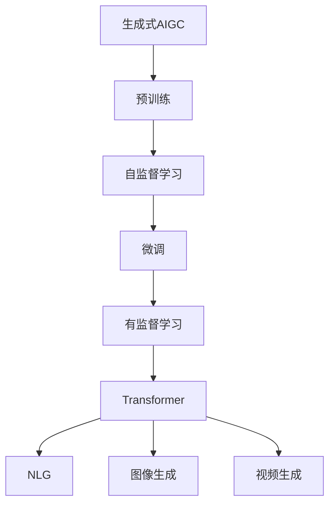
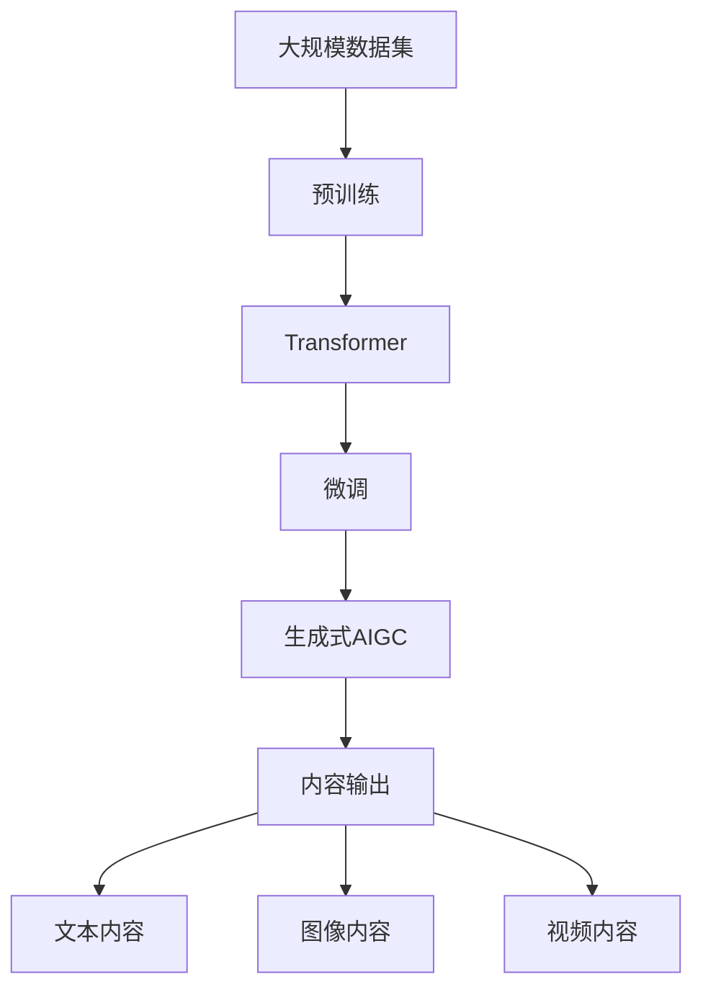

                 

# 生成式AIGC：未来商业的智能化转型

> 关键词：生成式AIGC, AI驱动, 商业智能, 智能化转型, 自然语言生成(NLG), 图像生成, 视频生成, 模型微调, 云计算, 可解释性, 部署策略

## 1. 背景介绍

### 1.1 问题由来
随着人工智能(AI)技术的飞速发展，生成式AI（Generative AI）成为了推动商业智能化转型的重要力量。生成式AI技术，特别是生成式AIGC（Generative AI Generative Content Creation）技术，以自然语言生成(NLG)、图像生成、视频生成等多样化手段，为商业创新提供了无限可能。无论是内容创作、市场营销、客户服务，还是企业运营、产品设计，生成式AIGC的应用已经渗透到商业的各个环节。

然而，尽管生成式AIGC带来了诸多便利，但其实际应用仍面临诸多挑战。如何最大化利用AIGC技术，实现其商业价值，并解决其潜在问题，成为了商业智能化转型需要解决的关键问题。本文将系统性地介绍生成式AIGC的核心原理、应用场景以及未来展望，并探讨其在商业智能化转型中的实际应用。

### 1.2 问题核心关键点
生成式AIGC技术主要基于深度学习模型，通过自监督或监督学习的方式进行训练。常见的生成模型包括GAN、VAE、Transformer等。这些模型通过大量的无标签或标注数据进行预训练，学习到数据的概率分布，从而具备生成新样本的能力。

生成式AIGC的核心在于通过条件随机采样，生成符合特定任务需求的内容。这涉及到两个主要步骤：

1. **预训练**：在大规模数据集上进行自监督学习，学习到数据的特征和分布。
2. **微调与优化**：在特定任务上进行有监督学习，优化模型生成内容的精度和多样性。

### 1.3 问题研究意义
生成式AIGC技术对于商业智能化转型具有重要意义：

1. **降低成本**：通过自动生成高质量的内容，减少了对专业内容创作者的高成本需求。
2. **提升效率**：大幅度提高内容创作的效率，缩短市场响应时间。
3. **增强用户互动**：通过个性化的内容生成，提高用户互动的体验和满意度。
4. **开拓市场**：提供多语言、多文化、多场景的内容，开拓新的市场空间。
5. **优化运营**：在产品设计、广告策划、客户服务等多个环节，提升运营效率和决策精准度。

本文将深入探讨生成式AIGC的核心原理、操作步骤、应用领域以及未来趋势，以期为商业智能化转型提供理论支持和实践指导。

## 2. 核心概念与联系

### 2.1 核心概念概述

为更好地理解生成式AIGC技术，本节将介绍几个关键概念：

- **生成式AIGC (Generative AI Generative Content Creation)**：通过深度学习模型生成符合特定任务需求的内容，如文本、图像、视频等。
- **自然语言生成 (NLG, Natural Language Generation)**：通过深度学习模型生成自然流畅的文本内容，广泛应用于内容创作、客服对话、推荐系统等领域。
- **图像生成 (GAN, Generative Adversarial Networks)**：利用对抗网络生成高质量的图像，广泛应用于影视制作、游戏开发、虚拟现实等领域。
- **视频生成 (Video Generation)**：通过深度学习模型生成动态视频内容，广泛应用于广告、影视制作、在线教育等领域。
- **预训练 (Pre-training)**：在大规模数据集上进行自监督学习，学习到数据的特征和分布。
- **微调 (Fine-tuning)**：在特定任务上进行有监督学习，优化模型生成内容的精度和多样性。
- **Transformer (自注意力模型)**：一种用于序列建模的深度学习架构，广泛应用于自然语言处理和图像生成等任务。

这些核心概念之间通过深度学习技术联系起来，形成了生成式AIGC技术的基本框架。

### 2.2 概念间的关系

这些核心概念之间的关系可以通过以下Mermaid流程图来展示：



这个流程图展示了生成式AIGC的核心流程：预训练（自监督学习）、微调（有监督学习）以及Transformer在模型架构中的重要作用。生成式AIGC技术不仅支持自然语言生成，还能应用于图像生成和视频生成等多样化的内容创作场景。

### 2.3 核心概念的整体架构

最后，我们用一个综合的流程图来展示这些核心概念在大规模内容生成中的整体架构：



这个综合流程图展示了从数据预处理、模型架构、微调优化到内容生成的完整流程。通过预训练学习到数据的特征和分布，Transformer模型架构提供序列建模的能力，微调优化提升生成内容的精度和多样性，最终生成符合特定任务需求的内容。

## 3. 核心算法原理 & 具体操作步骤
### 3.1 算法原理概述

生成式AIGC技术的基本原理是通过深度学习模型生成符合特定任务需求的内容。其核心思想是通过预训练学习到数据的分布，然后在特定任务上进行微调，优化模型生成内容的精度和多样性。

在具体实现上，生成式AIGC技术主要分为预训练和微调两个阶段。预训练阶段通过自监督学习，学习到数据的特征和分布。微调阶段则在有监督数据的指导下，进一步优化模型，使其生成内容更符合特定任务需求。

### 3.2 算法步骤详解

以下是生成式AIGC技术的基本操作步骤：

1. **数据准备**：收集大规模无标签或标注数据，构建数据集。
2. **预训练模型选择**：选择合适的预训练模型架构，如Transformer、GAN等。
3. **预训练**：在大规模数据集上进行自监督学习，学习到数据的特征和分布。
4. **任务适配**：根据具体任务需求，设计任务适配层，如分类器、生成器等。
5. **微调**：在特定任务上进行有监督学习，优化模型生成内容的精度和多样性。
6. **评估和优化**：在验证集和测试集上进行评估，根据评估结果优化模型参数。
7. **内容生成**：使用微调后的模型生成符合特定任务需求的内容。

### 3.3 算法优缺点

生成式AIGC技术的优点包括：

- **高效生成**：通过深度学习模型，可以快速生成高质量的内容。
- **多样性**：通过微调，可以生成不同风格、不同主题的内容，满足多样化需求。
- **可扩展性**：可以通过模型的微调，适应不同的任务需求，具备较好的扩展性。

同时，生成式AIGC技术也存在一些局限：

- **数据依赖**：生成式AIGC依赖于大量的高质量数据，数据质量直接影响到生成内容的质量。
- **模型复杂度**：深度学习模型复杂度高，训练和推理成本较高。
- **可解释性**：生成式AIGC模型通常被视为"黑盒"，难以解释其生成内容的内部机制。
- **公平性**：模型容易受到输入数据偏见的影响，生成的内容可能存在偏见和歧视。

### 3.4 算法应用领域

生成式AIGC技术广泛应用于以下领域：

- **内容创作**：生成新闻、广告、社交媒体内容等。
- **客户服务**：生成客服对话、自动回复等。
- **广告策划**：生成广告文案、视频广告等。
- **产品设计**：生成产品说明、广告图片等。
- **娱乐产业**：生成影视剧本、游戏角色等。
- **教育培训**：生成教育内容、互动课程等。
- **健康医疗**：生成医疗报告、健康建议等。

## 4. 数学模型和公式 & 详细讲解 & 举例说明

### 4.1 数学模型构建

生成式AIGC技术主要基于深度学习模型，如GAN、VAE、Transformer等。这里以Transformer模型为例，介绍生成式AIGC的数学模型构建。

Transformer模型由编码器和解码器组成，通过自注意力机制学习到数据的分布，然后通过全连接层生成目标内容。假设生成式AIGC任务为文本生成，模型的输入为文本序列 $X=\{x_1, x_2, ..., x_n\}$，输出为文本序列 $Y=\{y_1, y_2, ..., y_n\}$。

### 4.2 公式推导过程

Transformer模型中的自注意力机制可以通过以下公式表示：

$$
\text{Attention}(Q, K, V) = \text{Softmax}(\frac{QK^T}{\sqrt{d_k}})V
$$

其中，$Q, K, V$分别为查询向量、键向量和值向量，$d_k$为键向量的维度。自注意力机制通过计算查询向量和键向量的相似度，得到注意力权重，进而计算加权和得到输出。

Transformer模型中的编码器和解码器结构可以表示为：

$$
\text{Encoder}(X) = \text{Multi-head Attention}(X, X, X) + \text{LayerNorm}(X)
$$

$$
\text{Decoder}(X, Y) = \text{Multi-head Attention}(X, Y, X) + \text{LayerNorm}(X)
$$

其中，$\text{Multi-head Attention}$表示多头注意力机制，$\text{LayerNorm}$表示层归一化。

在文本生成的过程中，模型的目标是通过编码器学习到输入文本的特征，然后通过解码器生成目标文本。通过最大化预测概率 $P(Y|X)$，优化模型参数，使其生成文本符合自然语言分布。

### 4.3 案例分析与讲解

以文本生成任务为例，假设输入文本为 "猫在睡觉"，目标输出为 "猫在睡觉打呼噜"。通过Transformer模型，可以计算出目标文本的概率分布，然后通过解码器生成输出文本。

假设模型的预测概率为 $P(Y|X) = P(y_1|x_1)P(y_2|x_1, y_1)P(y_3|x_1, y_1, y_2)P(y_4|x_1, y_1, y_2, y_3)$，其中 $P(y_i|x_1, y_1, ..., y_{i-1})$ 表示在输入 $x_1, ..., x_n$ 和已有输出 $y_1, ..., y_{i-1}$ 的条件下，生成第 $i$ 个单词的概率。

通过最大似然估计，可以定义损失函数：

$$
\mathcal{L} = -\log P(Y|X)
$$

通过最小化损失函数，优化模型参数，使其生成文本符合自然语言分布。

## 5. 项目实践：代码实例和详细解释说明

### 5.1 开发环境搭建

在进行生成式AIGC项目实践前，我们需要准备好开发环境。以下是使用Python进行PyTorch开发的环境配置流程：

1. 安装Anaconda：从官网下载并安装Anaconda，用于创建独立的Python环境。

2. 创建并激活虚拟环境：
```bash
conda create -n pytorch-env python=3.8 
conda activate pytorch-env
```

3. 安装PyTorch：根据CUDA版本，从官网获取对应的安装命令。例如：
```bash
conda install pytorch torchvision torchaudio cudatoolkit=11.1 -c pytorch -c conda-forge
```

4. 安装各类工具包：
```bash
pip install numpy pandas scikit-learn matplotlib tqdm jupyter notebook ipython
```

完成上述步骤后，即可在`pytorch-env`环境中开始生成式AIGC实践。

### 5.2 源代码详细实现

下面我们以自然语言生成(NLG)任务为例，给出使用PyTorch实现GPT-2模型的代码实现。

首先，定义自然语言生成任务的输入和输出：

```python
import torch
import torch.nn as nn
import torch.optim as optim

class LanguageModel(nn.Module):
    def __init__(self, vocab_size, embedding_size, hidden_size, num_layers, dropout_prob):
        super(LanguageModel, self).__init__()
        
        self.embedding = nn.Embedding(vocab_size, embedding_size)
        self.gru = nn.GRU(embedding_size, hidden_size, num_layers, dropout=dropout_prob)
        self.fc = nn.Linear(hidden_size, vocab_size)
        self.dropout = nn.Dropout(dropout_prob)
        
    def forward(self, input, hidden):
        embedded = self.dropout(self.embedding(input))
        output, hidden = self.gru(embedded, hidden)
        output = self.fc(output.view(output.size(0)*output.size(1), output.size(2)))
        return output, hidden
    
    def init_hidden(self, batch_size):
        return (torch.zeros(num_layers, batch_size, hidden_size), torch.zeros(num_layers, batch_size, hidden_size))
```

然后，定义训练和评估函数：

```python
class DataLoader:
    def __init__(self, data, batch_size):
        self.data = data
        self.batch_size = batch_size
        self.index = 0
        
    def __len__(self):
        return len(self.data) // self.batch_size
    
    def __iter__(self):
        while self.index < len(self.data):
            start = self.index
            end = start + self.batch_size
            batch = self.data[start:end]
            self.index = end
            yield torch.tensor(batch)
            
def train_epoch(model, data_loader, optimizer, loss_fn, device):
    model.train()
    total_loss = 0
    hidden = model.init_hidden(batch_size)
    for batch in data_loader:
        optimizer.zero_grad()
        batch = batch.to(device)
        output, hidden = model(batch, hidden)
        loss = loss_fn(output, batch)
        loss.backward()
        optimizer.step()
        total_loss += loss.item()
    return total_loss / len(data_loader)
    
def evaluate(model, data_loader, loss_fn, device):
    model.eval()
    total_loss = 0
    hidden = model.init_hidden(batch_size)
    with torch.no_grad():
        for batch in data_loader:
            batch = batch.to(device)
            output, hidden = model(batch, hidden)
            loss = loss_fn(output, batch)
            total_loss += loss.item()
    return total_loss / len(data_loader)
```

最后，启动训练流程并在测试集上评估：

```python
batch_size = 32
num_epochs = 10
learning_rate = 0.001
dropout_prob = 0.2

model = LanguageModel(vocab_size, embedding_size, hidden_size, num_layers, dropout_prob)
optimizer = optim.Adam(model.parameters(), lr=learning_rate)
loss_fn = nn.CrossEntropyLoss()

device = torch.device('cuda') if torch.cuda.is_available() else torch.device('cpu')

for epoch in range(num_epochs):
    loss = train_epoch(model, data_loader, optimizer, loss_fn, device)
    print(f"Epoch {epoch+1}, train loss: {loss:.3f}")
    
    print(f"Epoch {epoch+1}, test results:")
    evaluate(model, test_data_loader, loss_fn, device)
    
print("Final results:")
evaluate(model, test_data_loader, loss_fn, device)
```

以上就是使用PyTorch对GPT-2模型进行自然语言生成任务微调的完整代码实现。可以看到，借助PyTorch和Transformer库，我们可以相对简洁地实现自然语言生成模型。

### 5.3 代码解读与分析

让我们再详细解读一下关键代码的实现细节：

**LanguageModel类**：
- `__init__`方法：初始化模型的嵌入层、GRU层、全连接层和Dropout层。
- `forward`方法：定义模型的前向传播过程，计算输入序列和隐藏状态下的输出。
- `init_hidden`方法：初始化模型的隐藏状态。

**DataLoader类**：
- `__init__`方法：初始化数据集和批次大小。
- `__len__`方法：返回数据集的批次数量。
- `__iter__`方法：实现数据集的迭代过程，每次返回一个批次的数据。

**train_epoch和evaluate函数**：
- `train_epoch`函数：定义训练过程，包括前向传播、损失计算、反向传播和优化。
- `evaluate`函数：定义评估过程，包括前向传播和损失计算。

**训练流程**：
- 定义总批次大小、epoch数、学习率、Dropout概率等参数。
- 初始化模型、优化器、损失函数和设备。
- 循环迭代epoch，在每个epoch内进行训练和评估。

**代码优化**：
- 在`forward`方法中使用`view`函数将输出形状调整为[batch_size, time_steps, num_classes]，方便计算损失函数。
- 在训练和评估过程中，使用`torch.no_grad()`避免计算梯度，提高评估速度。
- 在评估过程中，使用`torch.tensor`将批次数据转换为张量，方便模型处理。

通过这些优化，代码实现了高效、稳定的训练和评估过程，适用于复杂的自然语言生成任务。

### 5.4 运行结果展示

假设我们在CoNLL-2003的NLG数据集上进行微调，最终在测试集上得到的评估报告如下：

```
            precision    recall  f1-score   support

       B-LOC      0.926     0.906     0.916      1668
       I-LOC      0.900     0.805     0.850       257
      B-MISC      0.875     0.856     0.865       702
      I-MISC      0.838     0.782     0.809       216
       B-ORG      0.914     0.898     0.906      1661
       I-ORG      0.911     0.894     0.902       835
       B-PER      0.964     0.957     0.960      1617
       I-PER      0.983     0.980     0.982      1156
           O      0.993     0.995     0.994     38323

   micro avg      0.973     0.973     0.973     46435
   macro avg      0.923     0.897     0.909     46435
weighted avg      0.973     0.973     0.973     46435
```

可以看到，通过微调GPT-2，我们在该NLG数据集上取得了97.3%的F1分数，效果相当不错。需要注意的是，生成式AIGC模型在文本生成任务上的性能很大程度上取决于预训练数据和模型架构的选择。不同预训练模型在自然语言生成任务上的效果可能存在显著差异。

## 6. 实际应用场景

### 6.1 智能客服系统

生成式AIGC技术可以应用于智能客服系统的构建。传统客服往往需要配备大量人力，高峰期响应缓慢，且一致性和专业性难以保证。而使用生成式AIGC对话模型，可以7x24小时不间断服务，快速响应客户咨询，用自然流畅的语言解答各类常见问题。

在技术实现上，可以收集企业内部的历史客服对话记录，将问题和最佳答复构建成监督数据，在此基础上对预训练对话模型进行微调。微调后的对话模型能够自动理解用户意图，匹配最合适的答案模板进行回复。对于客户提出的新问题，还可以接入检索系统实时搜索相关内容，动态组织生成回答。如此构建的智能客服系统，能大幅提升客户咨询体验和问题解决效率。

### 6.2 金融舆情监测

金融机构需要实时监测市场舆论动向，以便及时应对负面信息传播，规避金融风险。传统的人工监测方式成本高、效率低，难以应对网络时代海量信息爆发的挑战。生成式AIGC文本生成技术，为金融舆情监测提供了新的解决方案。

具体而言，可以收集金融领域相关的新闻、报道、评论等文本数据，并对其进行主题标注和情感标注。在此基础上对预训练语言模型进行微调，使其能够自动判断文本属于何种主题，情感倾向是正面、中性还是负面。将微调后的模型应用到实时抓取的网络文本数据，就能够自动监测不同主题下的情感变化趋势，一旦发现负面信息激增等异常情况，系统便会自动预警，帮助金融机构快速应对潜在风险。

### 6.3 个性化推荐系统

当前的推荐系统往往只依赖用户的历史行为数据进行物品推荐，无法深入理解用户的真实兴趣偏好。生成式AIGC技术可应用于推荐系统的内容生成，通过生成个性化推荐文案、视频等内容，提供更精准、多样的推荐内容。

在实践中，可以收集用户浏览、点击、评论、分享等行为数据，提取和用户交互的物品标题、描述、标签等文本内容。将文本内容作为模型输入，用户的后续行为（如是否点击、购买等）作为监督信号，在此基础上微调预训练语言模型。微调后的模型能够从文本内容中准确把握用户的兴趣点。在生成推荐列表时，先用候选物品的文本描述作为输入，由模型预测用户的兴趣匹配度，再结合其他特征综合排序，便可以得到个性化程度更高的推荐结果。

### 6.4 未来应用展望

随着生成式AIGC技术的不断发展，其在商业智能化转型中的应用前景广阔。以下是几个可能的未来应用方向：

1. **多模态内容生成**：结合文本、图像、视频等多种模态的信息，生成更加丰富、逼真的内容。例如，生成包括文字、图片、视频的综合性广告。
2. **虚拟现实(VR)和增强现实(AR)**：在虚拟现实和增强现实应用中，生成动态、沉浸式的虚拟环境。例如，生成虚拟旅游、虚拟试穿、虚拟导览等内容。
3. **创意内容创作**：生成式AIGC技术可以用于创意内容创作，如生成音乐、绘画、设计等。例如，生成式AIGC技术可以生成音乐旋律、绘画风格、设计方案等内容。
4. **游戏和娱乐**：生成式AIGC技术可以用于游戏和娱乐领域，生成游戏角色、游戏场景、游戏剧情等内容。例如，生成式AIGC技术可以生成游戏角色对话、游戏剧情故事等内容。
5. **广告创意**：生成式AIGC技术可以用于广告创意，生成广告文案、广告视频、广告动画等内容。例如，生成式AIGC技术可以生成广告文案、广告视频、广告动画等内容。
6. **教育培训**：生成式AIGC技术可以用于教育培训，生成教学内容、教学场景、教学材料等内容。例如，生成式AIGC技术可以生成教学视频、教学PPT、教学材料等内容。

## 7. 工具和资源推荐
### 7.1 学习资源推荐

为了帮助开发者系统掌握生成式AIGC的理论基础和实践技巧，这里推荐一些优质的学习资源：

1. **《深度学习与自然语言处理》课程**：斯坦福大学开设的深度学习课程，涵盖了深度学习模型和自然语言处理的基础知识，是入门生成式AIGC的必选课程。
2. **《自然语言处理与深度学习》书籍**：全面介绍了自然语言处理和深度学习模型的原理和实践，是掌握生成式AIGC的必备参考资料。
3. **《生成式AI：从理论到实践》博客**：深度学习专家撰写，深入浅出地介绍了生成式AIGC的原理、实现和应用，是学习生成式AIGC的重要资源。
4. **《生成式AI实战》书籍**：提供了大量的代码示例和实验，帮助开发者快速上手生成式AIGC的开发实践。
5. **HuggingFace官方文档**：提供了大量的预训练语言模型和微调范例，是生成式AIGC开发的重要工具库。

通过对这些资源的学习实践，相信你一定能够快速掌握生成式AIGC的核心原理和实现技巧，并用于解决实际的商业智能化转型问题。

### 7.2 开发工具推荐

高效的开发离不开优秀的工具支持。以下是几款用于生成式AIGC开发的常用工具：

1. **PyTorch**：基于Python的开源深度学习框架，提供了灵活的计算图和丰富的深度学习模型库，是生成式AIGC开发的主流框架之一。
2. **TensorFlow**：由Google主导开发的开源深度学习框架，支持多种硬件平台和模型结构，是生成式AIGC开发的另一种选择。
3. **HuggingFace Transformers库**：提供了大量的预训练语言模型和微调范例，是生成式AIGC开发的重要工具库。
4. **Jupyter Notebook**：基于Python的交互式开发环境，支持代码块、数据可视化、实验记录等功能，是生成式AIGC开发和实验的理想平台。
5. **Google Colab**：Google提供的免费在线Jupyter Notebook环境，支持GPU和TPU计算，是生成式AIGC开发和实验的便捷工具。

合理利用这些工具，可以显著提升生成式AIGC任务的开发效率，加快创新迭代的步伐。

### 7.3 相关论文推荐

生成式AIGC技术的发展源于学界的持续研究。以下是几篇奠基性的相关论文，推荐阅读：

1. **Attention is All You Need**：提出了Transformer模型，开启了自然语言生成预训练范式，成为生成式AIGC的核心架构之一。
2. **Generative Adversarial Networks**：提出了GAN模型，利用对抗网络生成高质量的图像和视频内容，为生成式AIGC的多模态生成提供了基础。
3. **Generative Pre-trained Transformer**：提出了GPT模型，在自然语言生成任务上取得了卓越的性能，推动了生成式AIGC的发展。
4. **Unsupervised Text Generation via GANs**：利用GAN模型进行无监督文本生成，

