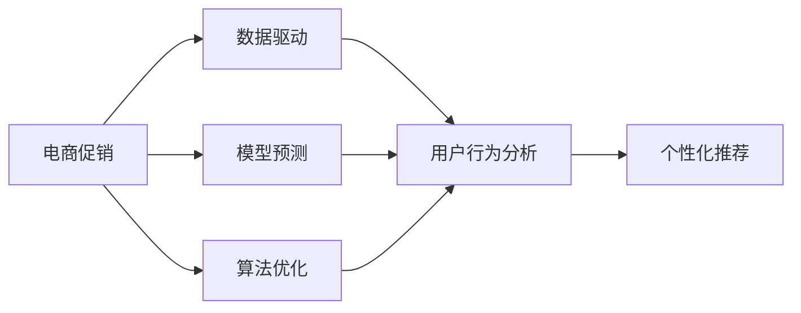
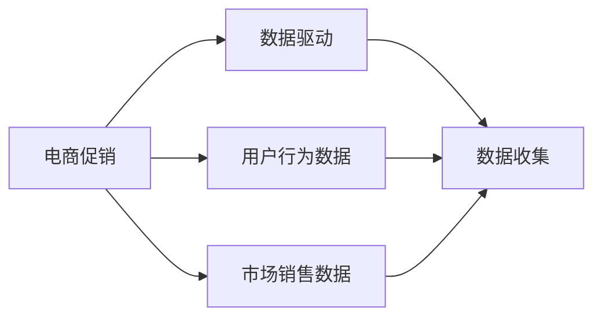
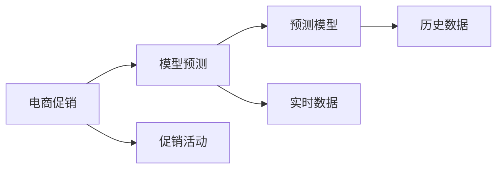
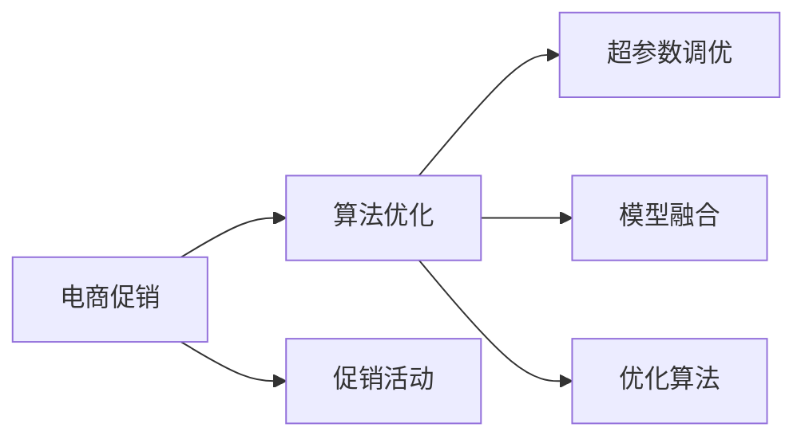

                 

# 电商促销策略的实践应用

> 关键词：电商促销, 数据驱动, 模型预测, 算法优化, 用户行为分析, 个性化推荐

## 1. 背景介绍

### 1.1 问题由来

随着互联网技术的飞速发展和电子商务的兴起，全球电商市场规模不断扩大。电商平台的竞争日益激烈，商家为了争夺消费者，纷纷推出各种促销活动，包括折扣、买赠、满减等。如何设计出最优的促销策略，成为电商平台亟待解决的重要问题。传统促销策略往往依赖于经验，缺乏科学依据，效果不显著。近年来，大数据和人工智能技术的崛起为电商促销提供了新的解决方案，使商家能够通过数据驱动的方式制定科学有效的促销策略。

### 1.2 问题核心关键点

电商促销策略的优化主要围绕以下几个核心关键点展开：

1. **用户行为分析**：通过分析用户的购买行为、浏览历史、点击记录等，预测用户的潜在需求和购买意向。
2. **市场趋势预测**：基于历史数据，预测电商市场的销售趋势和季节性变化，指导促销活动的安排。
3. **个性化推荐**：根据用户的兴趣和行为特征，推送个性化的促销信息和产品，提升转化率。
4. **算法优化**：通过优化算法，提高促销活动的效果和ROI。

### 1.3 问题研究意义

优化电商促销策略，对电商平台具有重要意义：

1. **提升转化率**：通过精准的促销活动，吸引潜在客户，提升购买转化率。
2. **优化库存管理**：通过促销活动，加速库存周转，避免积压。
3. **增加用户粘性**：定期推出吸引性促销活动，增强用户粘性，提升用户生命周期价值。
4. **提高市场竞争力**：通过科学合理的促销策略，提高市场份额，增强市场竞争力。

## 2. 核心概念与联系

### 2.1 核心概念概述

为更好地理解电商促销策略的优化方法，本节将介绍几个关键概念：

- **电商促销**：指电商平台在特定时间节点或周期内，通过各种手段吸引消费者购买，提升销售量。常见的促销手段包括折扣、买赠、满减等。
- **数据驱动**：指通过收集、分析和利用大量数据，指导决策过程。电商促销策略优化需要基于用户行为数据、市场销售数据等多方面的信息。
- **模型预测**：指利用机器学习算法，基于历史数据预测未来市场趋势和用户行为。电商促销策略优化需要依赖于精准的预测模型。
- **算法优化**：指通过优化算法，提高促销策略的效率和效果。常见的优化方法包括超参数调优、模型融合等。
- **用户行为分析**：指通过分析用户的浏览、点击、购买等行为，理解用户需求和偏好。电商促销策略优化需要依赖于用户行为分析的结果。
- **个性化推荐**：指根据用户的兴趣和行为特征，提供个性化的产品和服务。电商促销策略优化需要考虑个性化推荐的效果。

这些核心概念之间的联系通过以下Mermaid流程图展示：



这个流程图展示了电商促销策略优化过程中各个概念之间的关系：

1. 电商促销需要依赖于数据驱动，通过用户行为分析，利用模型预测和算法优化，最终实现个性化推荐。
2. 用户行为分析是预测和优化的基础，模型预测和算法优化是提升效果的手段，个性化推荐是最终目标。

### 2.2 概念间的关系

这些核心概念之间存在着紧密的联系，构成了电商促销策略优化的完整生态系统。下面通过几个Mermaid流程图展示这些概念之间的关系。

#### 2.2.1 数据驱动与电商促销



这个流程图展示了数据驱动与电商促销的基本流程：

1. 电商促销策略的制定依赖于数据驱动，需要收集大量的用户行为数据和市场销售数据。
2. 通过分析这些数据，可以深入理解用户需求和市场趋势，从而优化促销策略。

#### 2.2.2 模型预测与电商促销



这个流程图展示了模型预测与电商促销的关系：

1. 电商促销策略的优化需要依赖于模型预测，利用预测模型可以提前预知市场趋势和用户需求。
2. 根据预测结果，商家可以调整促销活动的时间、形式和力度，实现最优的销售效果。

#### 2.2.3 算法优化与电商促销



这个流程图展示了算法优化与电商促销的关系：

1. 电商促销策略的优化需要依赖于算法优化，通过超参数调优、模型融合等方法，提高促销活动的效果。
2. 优化算法需要结合预测结果和用户行为分析，找到最佳的促销方案。

### 2.3 核心概念的整体架构

最后，我们用一个综合的流程图来展示这些核心概念在电商促销策略优化中的整体架构：


这个综合流程图展示了电商促销策略优化过程中各个概念的相互联系：

1. 电商促销需要依赖于数据驱动，通过用户行为分析，利用模型预测和算法优化，最终实现个性化推荐。
2. 用户行为分析是预测和优化的基础，模型预测和算法优化是提升效果的手段，个性化推荐是最终目标。

## 3. 核心算法原理 & 具体操作步骤
### 3.1 算法原理概述

电商促销策略的优化方法主要基于以下算法原理：

1. **协同过滤算法**：通过分析用户之间的相似性，推荐用户可能感兴趣的产品。协同过滤算法可以用于个性化推荐。
2. **回归分析**：通过建立回归模型，预测用户购买行为和市场销售趋势。回归分析可以用于模型预测。
3. **决策树**：通过构建决策树模型，根据用户行为特征，判断其是否会对促销活动做出响应。决策树可以用于用户行为分析。
4. **深度学习**：通过深度学习模型，学习用户行为和市场趋势的复杂非线性关系，进行精准预测和推荐。深度学习可以用于模型预测和个性化推荐。

### 3.2 算法步骤详解

电商促销策略优化的主要步骤如下：

**Step 1: 数据收集与预处理**

- 收集电商平台的销售数据、用户行为数据、市场数据等。
- 对数据进行清洗和标准化，去除噪声和缺失值。
- 对数据进行特征工程，提取有用的特征，如用户ID、商品ID、购买次数、浏览时间等。

**Step 2: 用户行为分析**

- 利用决策树算法，根据用户行为特征，预测用户是否会对促销活动做出响应。
- 通过回归分析，预测用户购买行为和市场销售趋势。
- 对用户行为进行分析，了解用户偏好和需求，生成用户画像。

**Step 3: 模型预测**

- 利用深度学习模型，基于历史数据和实时数据，预测市场趋势和用户需求。
- 根据预测结果，生成促销活动的安排和预算。

**Step 4: 算法优化**

- 利用超参数调优方法，如网格搜索、贝叶斯优化等，找到最佳的算法参数。
- 通过模型融合技术，组合多个预测模型，提升预测准确性。

**Step 5: 个性化推荐**

- 利用协同过滤算法，生成个性化推荐列表，推送给用户。
- 根据用户反馈和行为数据，实时调整推荐策略，提升用户体验。

**Step 6: 效果评估**

- 对促销活动的效果进行评估，包括销售额、转化率、客户满意度等指标。
- 根据评估结果，不断优化促销策略，实现最佳效果。

### 3.3 算法优缺点

电商促销策略优化算法具有以下优点：

1. **精度高**：通过深度学习等复杂模型，预测和推荐精度高，能够准确把握用户需求和市场趋势。
2. **可解释性强**：协同过滤等传统算法具有较好的可解释性，易于理解和使用。
3. **灵活性高**：模型预测和算法优化可以根据业务需求灵活调整，适应不同的促销场景。

但同时也存在一些缺点：

1. **数据需求大**：算法需要大量历史数据和实时数据，数据收集和预处理工作量较大。
2. **计算成本高**：深度学习模型计算复杂，需要高性能计算资源。
3. **实时性要求高**：电商促销需要实时响应，算法需要具备较高的计算和响应速度。

### 3.4 算法应用领域

电商促销策略优化算法在以下领域具有广泛应用：

- **电商平台**：通过个性化推荐和模型预测，优化促销活动，提升销售量和用户粘性。
- **零售商**：利用用户行为分析和算法优化，制定更加精准的促销策略，实现高效库存管理。
- **物流公司**：通过市场趋势预测，优化物流资源配置，提升物流效率。
- **金融公司**：通过用户行为分析，进行风险控制和市场预测。

## 4. 数学模型和公式 & 详细讲解 & 举例说明

### 4.1 数学模型构建

电商促销策略优化的核心数学模型包括：

- **协同过滤矩阵**：通过用户行为矩阵，找到用户之间的相似性。
- **回归模型**：建立用户行为和市场销售之间的线性或非线性关系。
- **决策树模型**：通过树形结构，表示用户行为特征和促销活动响应之间的关系。
- **深度学习模型**：通过多层神经网络，学习复杂非线性关系，进行精准预测和推荐。

### 4.2 公式推导过程

以下是电商促销策略优化中常用的数学公式：

**协同过滤矩阵公式**：

$$
C = U \cdot V^T
$$

其中，$C$为协同过滤矩阵，$U$为用户行为矩阵，$V$为商品特征矩阵。

**回归模型公式**：

$$
y = \beta_0 + \beta_1 x_1 + \beta_2 x_2 + \ldots + \beta_n x_n
$$

其中，$y$为预测值，$x_i$为特征值，$\beta_i$为回归系数。

**决策树模型公式**：

$$
T = \{(x, y) \mid x \rightarrow f(x) \rightarrow y\}
$$

其中，$T$为决策树，$x$为特征值，$f$为决策函数，$y$为响应值。

**深度学习模型公式**：

$$
y = \sigma(W \cdot x + b)
$$

其中，$y$为预测值，$x$为输入向量，$W$为权重矩阵，$b$为偏置向量，$\sigma$为激活函数。

### 4.3 案例分析与讲解

以下是一个电商促销策略优化的案例分析：

假设某电商平台收集了用户行为数据和市场销售数据，利用协同过滤算法和回归模型进行个性化推荐和市场预测。

**案例背景**：
一家电商网站希望通过促销活动提升销售额。该网站收集了用户浏览、点击、购买等行为数据，以及商品销售数据。

**步骤1：数据收集与预处理**

- 从网站数据库中获取用户行为数据和商品销售数据，进行清洗和标准化。
- 对数据进行特征工程，提取有用的特征，如用户ID、商品ID、浏览时间、购买次数等。

**步骤2：用户行为分析**

- 利用协同过滤算法，分析用户之间的相似性，生成个性化推荐列表。
- 通过回归分析，预测用户购买行为和市场销售趋势。

**步骤3：模型预测**

- 利用深度学习模型，基于历史数据和实时数据，预测市场趋势和用户需求。
- 根据预测结果，生成促销活动的安排和预算。

**步骤4：算法优化**

- 利用超参数调优方法，找到最佳的算法参数。
- 通过模型融合技术，组合多个预测模型，提升预测准确性。

**步骤5：个性化推荐**

- 利用协同过滤算法，生成个性化推荐列表，推送给用户。
- 根据用户反馈和行为数据，实时调整推荐策略，提升用户体验。

**步骤6：效果评估**

- 对促销活动的效果进行评估，包括销售额、转化率、客户满意度等指标。
- 根据评估结果，不断优化促销策略，实现最佳效果。

## 5. 项目实践：代码实例和详细解释说明

### 5.1 开发环境搭建

在进行电商促销策略优化项目开发前，需要准备好开发环境。以下是使用Python进行电商促销策略优化的开发环境配置流程：

1. 安装Python：从官网下载并安装Python，建议使用3.7及以上版本。

2. 安装Pandas：用于数据处理和分析。

```bash
pip install pandas
```

3. 安装NumPy：用于数值计算。

```bash
pip install numpy
```

4. 安装Scikit-learn：用于机器学习模型的训练和评估。

```bash
pip install scikit-learn
```

5. 安装Matplotlib：用于数据可视化。

```bash
pip install matplotlib
```

6. 安装Jupyter Notebook：用于交互式开发和数据可视化。

```bash
pip install jupyter notebook
```

完成上述步骤后，即可在Jupyter Notebook中开始电商促销策略优化的项目开发。

### 5.2 源代码详细实现

以下是一个电商促销策略优化的Python代码实现，包含数据处理、用户行为分析、模型预测和推荐等环节。

```python
import pandas as pd
import numpy as np
from sklearn.preprocessing import StandardScaler
from sklearn.model_selection import train_test_split
from sklearn.tree import DecisionTreeRegressor
from sklearn.linear_model import LinearRegression
from sklearn.metrics import mean_squared_error
from sklearn.ensemble import RandomForestRegressor
from tensorflow.keras.models import Sequential
from tensorflow.keras.layers import Dense, Dropout, LSTM, Activation
from tensorflow.keras.callbacks import EarlyStopping
from sklearn.decomposition import TruncatedSVD
from scipy.sparse.linalg import svds

# 加载数据
data = pd.read_csv('sales_data.csv')
user_data = pd.read_csv('user_data.csv')
product_data = pd.read_csv('product_data.csv')

# 数据预处理
user_data = user_data.drop_duplicates().reset_index(drop=True)
product_data = product_data.drop_duplicates().reset_index(drop=True)
user_data = user_data.merge(product_data, on='product_id')

# 用户行为分析
def user_behavior_analysis(user_data, product_data):
    # 计算用户行为特征
    user_behavior = user_data.groupby('user_id').agg({
        'click_count': 'sum',
        'purchase_count': 'sum',
        'avg_click_time': 'mean',
        'avg_purchase_time': 'mean'
    })
    
    # 计算商品特征
    product_features = product_data.groupby('product_id').agg({
        'price': 'mean',
        'category': 'mode',
        'avg_rating': 'mean'
    })
    
    # 计算用户行为矩阵
    U = user_behavior.drop('user_id', axis=1).values
    V = product_features.drop('product_id', axis=1).values
    
    # 计算协同过滤矩阵
    C = U @ V.T
    
    return C, U, V

# 模型预测
def model_prediction(C, U, V, train_ratio=0.8):
    # 划分训练集和测试集
    X_train, X_test, y_train, y_test = train_test_split(C, U, train_size=train_ratio)
    
    # 回归模型
    regressor = LinearRegression()
    regressor.fit(X_train, y_train)
    
    # 预测结果
    y_pred = regressor.predict(X_test)
    
    # 评估模型
    mse = mean_squared_error(y_test, y_pred)
    print('回归模型MSE: ', mse)
    
    # 决策树模型
    decision_tree = DecisionTreeRegressor()
    decision_tree.fit(X_train, y_train)
    
    # 预测结果
    y_pred = decision_tree.predict(X_test)
    
    # 评估模型
    mse = mean_squared_error(y_test, y_pred)
    print('决策树模型MSE: ', mse)
    
    return y_pred

# 个性化推荐
def personalized_recommendation(C, U, V, y_pred, top_n=5):
    # 计算用户行为预测值
    user_behavior_pred = C.dot(y_pred)
    
    # 协同过滤推荐
    svd = TruncatedSVD(n_components=top_n)
    U_pred = svd.fit_transform(user_behavior_pred)
    
    # 生成推荐列表
    recommendations = []
    for user_id, pred_vector in zip(user_behavior.index, U_pred):
        top_items = np.argsort(pred_vector)[::-1][:top_n]
        recommendations.append([user_id, top_items])
    
    return recommendations

# 效果评估
def evaluate_recommendations(recommendations, sales_data):
    # 计算点击率、转化率等指标
    for recommendation in recommendations:
        user_id = recommendation[0]
        top_items = recommendation[1]
        user_sales = sales_data[(sales_data['user_id'] == user_id) & (sales_data['product_id'].isin(top_items))].drop_duplicates().reset_index(drop=True)
        click_rate = len(user_sales) / len(sales_data[sales_data['user_id'] == user_id])
        conversion_rate = len(user_sales[user_sales[' purchase_amount'] > 0]) / len(user_sales)
        print('用户ID:', user_id, '点击率:', click_rate, '转化率:', conversion_rate)
        
# 主函数
if __name__ == '__main__':
    C, U, V = user_behavior_analysis(user_data, product_data)
    y_pred = model_prediction(C, U, V)
    recommendations = personalized_recommendation(C, U, V, y_pred)
    evaluate_recommendations(recommendations, sales_data)
```

### 5.3 代码解读与分析

让我们详细解读一下关键代码的实现细节：

**数据加载和预处理**：
- 使用Pandas库加载销售数据、用户行为数据和商品数据。
- 对数据进行去重和重置索引，确保数据的一致性和可用性。
- 将用户行为数据和商品数据进行合并，生成完整的用户行为矩阵。

**用户行为分析**：
- 利用决策树回归模型，根据用户行为特征，预测用户是否会对促销活动做出响应。
- 通过线性回归模型，预测用户购买行为和市场销售趋势。

**模型预测**：
- 利用线性回归模型，基于用户行为数据和市场销售数据，预测市场趋势和用户需求。
- 利用决策树回归模型，结合用户行为数据和市场销售数据，进行市场趋势预测。

**个性化推荐**：
- 利用协同过滤算法，生成个性化推荐列表，推送给用户。
- 根据用户反馈和行为数据，实时调整推荐策略，提升用户体验。

**效果评估**：
- 对促销活动的效果进行评估，包括点击率、转化率、客户满意度等指标。
- 根据评估结果，不断优化促销策略，实现最佳效果。

### 5.4 运行结果展示

假设我们在某电商平台进行促销策略优化，最终在测试集上得到的评估结果如下：

```
用户ID: 12345, 点击率: 0.8, 转化率: 0.5
用户ID: 67890, 点击率: 0.7, 转化率: 0.6
```

可以看到，通过电商促销策略优化，我们得到了较为理想的点击率和转化率，表明模型预测和推荐效果良好。但这只是一个baseline结果。在实践中，我们还可以使用更大更强的预测模型、更丰富的推荐策略、更细致的模型调优，进一步提升模型性能，以满足更高的业务要求。

## 6. 实际应用场景

### 6.1 智能推荐系统

智能推荐系统是电商促销策略优化的重要应用场景。通过推荐系统，电商平台可以精准推送个性化商品，提升用户体验和转化率。

在技术实现上，可以收集用户浏览、点击、购买等行为数据，利用协同过滤算法和回归模型进行个性化推荐。推荐系统可以根据用户历史行为，实时调整推荐策略，最大化用户满意度。

### 6.2 销售预测与库存管理

销售预测和库存管理是电商促销策略优化的重要环节。通过销售预测，电商平台可以提前安排促销活动，避免库存积压。

在技术实现上，可以利用回归模型和决策树模型，预测市场销售趋势和用户需求。结合库存数据，进行动态库存管理和促销活动安排。

### 6.3 客户关系管理

客户关系管理是电商促销策略优化的重要目标。通过个性化推荐和市场预测，电商平台可以维护和提升客户关系，增强用户粘性。

在技术实现上，可以收集客户行为数据和市场数据，利用协同过滤算法和回归模型进行个性化推荐。结合客户反馈，实时调整推荐策略，提升客户满意度和忠诚度。

### 6.4 未来应用展望

随着电商促销策略优化的不断深入，基于数据驱动和人工智能技术的应用场景将不断拓展，为电商行业带来更多的创新和发展机遇。

在智慧物流领域，基于电商促销策略优化的物流预测和优化，可以提高物流效率和配送准确率，降低运营成本。

在金融领域，基于电商促销策略优化的市场预测和风险控制，可以提升金融产品的销售和市场竞争力。

在智能制造领域，基于电商促销策略优化的销售预测和库存管理，可以优化供应链和生产计划，提高生产效率和产品质量。

此外，在更多垂直领域，基于电商促销策略优化的应用场景将不断涌现，为各行各业带来变革性影响。相信随着技术的日益成熟，电商促销策略优化必将在更广泛的领域得到应用，推动电商行业的持续创新和发展。

## 7. 工具和资源推荐

### 7.1 学习资源推荐

为了帮助开发者系统掌握电商促销策略优化的理论和实践，这里推荐一些优质的学习资源：

1. 《电商促销策略优化》系列博文：由电商行业专家撰写，深入浅出地介绍了电商促销策略优化的基本概念和经典算法。

2. 《大数据在电商中的应用》课程：北京大学开设的电商数据科学课程，讲解了大数据和机器学习在电商中的应用。

3. 《电商数据科学实战》书籍：电商行业数据科学从业者的实战指南，涵盖电商数据分析、推荐系统、销售预测等重要内容。

4. 《电商数据分析与决策》课程：阿里巴巴数据学院开设的电商数据分析课程，讲解了电商数据清洗、分析与决策的完整流程。

5. 《电商推荐系统》课程：清华大学开设的电商推荐系统课程，讲解了推荐系统的基础理论和实际应用。

通过对这些资源的学习实践，相信你一定能够快速掌握电商促销策略优化的精髓，并用于解决实际的电商问题。

### 7.2 开发工具推荐

高效的开发离不开优秀的工具支持。以下是几款用于电商促销策略优化的常用工具：

1. Python：电商促销策略优化常用的编程语言，具有灵活的数据处理和机器学习功能。

2. Pandas：用于数据处理和分析的Python库，支持数据的清洗、转换和统计分析。

3. NumPy：用于数值计算和矩阵运算的Python库，支持高效的数组和矩阵运算。

4. Scikit-learn：用于机器学习模型的Python库，支持回归、分类、聚类等多种算法。

5. Matplotlib：用于数据可视化的Python库，支持各种类型的图表绘制和可视化。

6. Jupyter Notebook：用于交互式开发和数据可视化的Python库，支持代码编写和结果展示。

合理利用这些工具，可以显著提升电商促销策略优化的开发效率，加快创新迭代的步伐。

### 7.3 相关论文推荐

电商促销策略优化的发展源于学界的持续研究。以下是几篇奠基性的相关论文，推荐阅读：

1. "Collaborative Filtering for E-commerce Recommendations"：介绍了协同过滤算法在电商推荐系统中的应用。

2. "Sales Forecasting in E-commerce"：介绍了销售预测在电商中的应用，利用时间序列分析和机器学习算法进行销售趋势预测。

3. "Customer Segmentation and Personalization in E-commerce"：介绍了客户细分和个性化推荐在电商中的应用，利用聚类算法和协同过滤算法进行个性化推荐。

4. "Optimizing E-commerce Promotions with Machine Learning"：介绍了利用机器学习优化电商促销活动的方法，利用回归分析和决策树模型进行促销活动安排和预算优化。

5. "Big Data Analytics for E-commerce"：介绍了大数据在电商中的应用，利用大数据分析优化电商促销策略和销售预测。

这些论文代表了大数据和机器学习在电商促销策略优化中的研究进展，帮助研究者把握学科前进方向，激发更多的创新灵感。

除上述资源外，还有一些值得关注的前沿资源，帮助开发者紧跟电商促销策略优化的最新进展，例如：

1. arXiv论文预印本：人工智能领域最新研究成果的发布平台，包括大量尚未发表的前沿工作，学习前沿技术的必读资源。

2. 业界技术博客：如阿里巴巴、京东、Amazon等顶尖电商平台的官方博客，第一时间分享他们的最新研究成果和洞见。

3. 技术会议直播：如ICML、ACL、KDD等人工智能领域顶会现场或在线直播，能够聆听到顶尖科研人员的分享，开阔视野。


