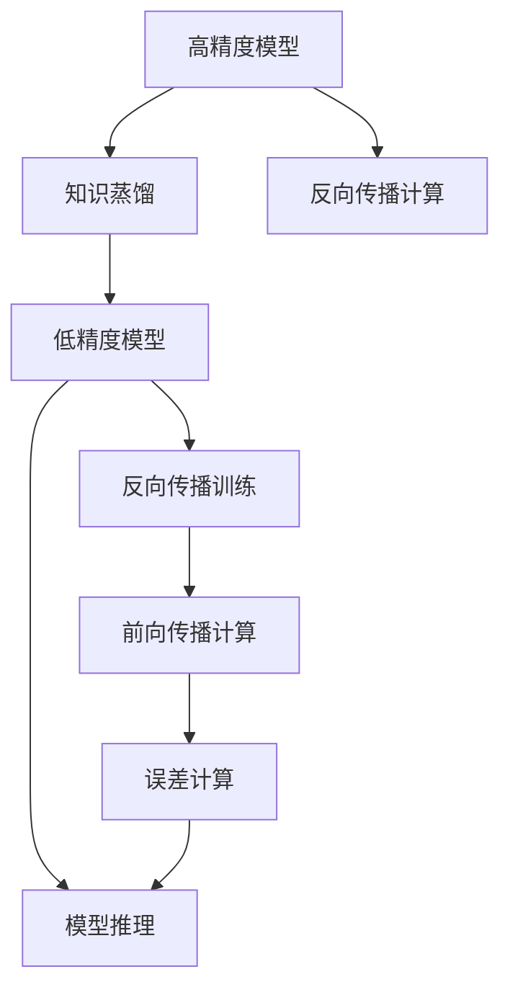
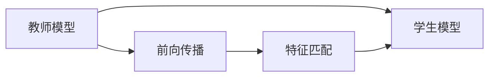
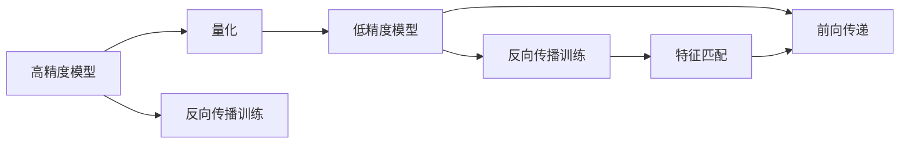
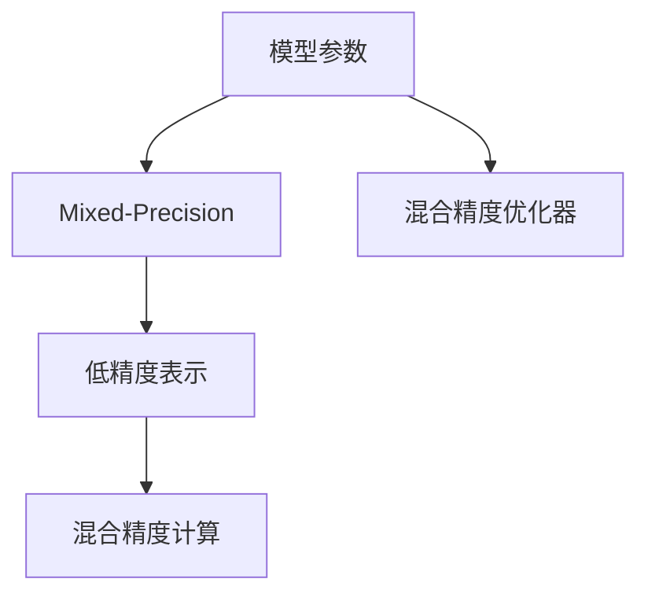
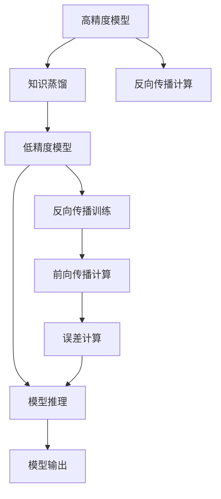

                 

## 1. 背景介绍

随着深度学习技术的不断演进，越来越多的神经网络被用于图像识别、自然语言处理等任务。然而，由于神经网络通常具有巨大的参数量和计算开销，对硬件和软件的资源要求极高，限制了其在实际应用中的普及。针对这一问题，研究者提出了模型量化(Quantization)技术，通过对模型进行低精度量化，以减少计算和存储成本，提高模型效率。然而，量化过程中不可避免地会导致模型精度下降，这使得量化后的模型难以达到与原始模型相同的性能水平。为解决这一问题，知识蒸馏(Knowledge Distillation, KD)技术被引入量化过程，通过将教师模型的高性能知识迁移到量化后的学生模型，实现“蒸馏压缩”的效果，提升量化模型的精度。

### 1.1 问题由来

在深度学习领域，量化技术用于将高精度浮点模型转换为低精度定点模型，以达到提升计算效率、降低存储成本的目的。量化模型通常采用较为简单的位宽表示，如8位、16位等，这些低精度模型在运行时占用的内存和计算资源较少，因此能够在不损失过多性能的情况下显著加速推理过程。但量化过程会产生显著的精度损失，量化模型难以达到与原始浮点模型相同的精度，特别是在复杂的计算机视觉和自然语言处理任务中。

为了解决这一问题，知识蒸馏技术被引入量化过程。知识蒸馏旨在通过将教师模型的高性能知识迁移到学生模型，实现“蒸馏压缩”的效果，从而提升量化模型的精度。教师模型通常是高精度浮点模型，通过反向传播训练，能够对量化后的学生模型进行有效知识传递。这种技术能够在降低模型资源消耗的同时，保证模型性能不出现较大下降，因此在模型量化过程中得到了广泛应用。

### 1.2 问题核心关键点

知识蒸馏在模型量化中的协同效应主要体现在以下两个方面：

1. **蒸馏压缩**：通过知识蒸馏技术，教师模型的高性能知识能够被有效地迁移到量化后的学生模型中，实现“蒸馏压缩”的效果，即在模型参数数量和计算资源消耗显著降低的同时，保持或提升模型精度。

2. **协同优化**：知识蒸馏与量化技术的协同优化，可以实现多目标优化。量化技术通过降低模型参数量和计算开销，提升模型效率；知识蒸馏技术通过提升量化模型的精度，弥补量化带来的性能损失。通过协同优化，量化后的模型能够达到既高效又高精度的平衡，更符合实际应用场景的需求。

## 2. 核心概念与联系

### 2.1 核心概念概述

为了更好地理解知识蒸馏在模型量化中的协同效应，本节将介绍几个密切相关的核心概念：

- **知识蒸馏(Knowledge Distillation, KD)**：一种将高精度模型中的知识迁移到低精度模型中的技术，通过反向传播训练，使得低精度模型能够继承高精度模型的高性能。
- **模型量化(Quantization)**：将高精度模型转换为低精度模型，以降低计算和存储成本，提升模型推理速度。
- **教师模型(Teacher Model)**：通常为高精度浮点模型，通过反向传播训练，对量化后的学生模型进行知识传递。
- **学生模型(Student Model)**：通常为低精度模型，通过知识蒸馏技术从教师模型中学习知识，提升自身精度。
- **前向传递(Forward Propagation)**：指模型对输入数据进行处理的过程，包括前向传播计算输出和梯度计算。
- **反向传递(Backward Propagation)**：指模型利用输出的误差，通过反向传播更新模型参数的过程。
- **交叉熵损失(Cross-Entropy Loss)**：一种常见的监督学习损失函数，用于衡量模型预测与真实标签之间的差异。
- **特征匹配(Feature Matching)**：一种知识蒸馏方法，通过将教师模型的特征分布与学生模型的特征分布进行匹配，实现知识传递。
- **混合精度训练(Mixed-Precision Training)**：一种训练方式，通过将模型参数和计算过程中的某些部分转换为低精度表示，提高训练和推理效率。

这些核心概念之间的逻辑关系可以通过以下Mermaid流程图来展示：



这个流程图展示了知识蒸馏和模型量化过程的核心步骤：

1. 高精度模型通过反向传播计算得到梯度信息，用于训练教师模型。
2. 低精度模型通过反向传播训练，从教师模型中学习知识。
3. 低精度模型在前向传播中处理输入数据，得到输出。
4. 低精度模型利用输出误差，通过反向传播计算梯度，更新模型参数。
5. 低精度模型通过前向传播得到输出，用于推理任务。

### 2.2 概念间的关系

这些核心概念之间存在着紧密的联系，形成了知识蒸馏在模型量化中的完整生态系统。下面我们通过几个Mermaid流程图来展示这些概念之间的关系。

#### 2.2.1 知识蒸馏过程



这个流程图展示了知识蒸馏的基本原理，即通过将教师模型的特征分布与学生模型的特征分布进行匹配，实现知识传递。

#### 2.2.2 量化过程



这个流程图展示了量化过程的核心步骤，即通过反向传播训练，将高精度模型转换为低精度模型，同时通过特征匹配技术，保持或提升量化模型的精度。

#### 2.2.3 混合精度训练



这个流程图展示了混合精度训练的基本原理，即通过将模型参数和计算过程中的某些部分转换为低精度表示，提高训练和推理效率。

### 2.3 核心概念的整体架构

最后，我们用一个综合的流程图来展示这些核心概念在知识蒸馏和模型量化过程中的整体架构：



这个综合流程图展示了从高精度模型到低精度模型的完整过程，包括知识蒸馏和模型量化两个核心环节。

## 3. 核心算法原理 & 具体操作步骤

### 3.1 算法原理概述

知识蒸馏在模型量化中的协同效应，是通过将高精度模型中的知识迁移到低精度模型中，实现“蒸馏压缩”的效果。具体而言，知识蒸馏通过反向传播训练，将教师模型的高性能知识传递到学生模型中，从而提升量化后的学生模型的精度。

知识蒸馏的原理可以总结如下：

1. **反向传播训练**：通过反向传播计算梯度，将教师模型的知识传递到学生模型中。
2. **特征匹配**：通过将教师模型的特征分布与学生模型的特征分布进行匹配，实现知识传递。
3. **精度提升**：通过反向传播训练和特征匹配，提升量化后的学生模型的精度。

### 3.2 算法步骤详解

知识蒸馏在模型量化中的协同效应，主要涉及以下关键步骤：

**Step 1: 选择合适的教师模型和学生模型**

- 选择合适的教师模型和高精度浮点模型。教师模型通常是一个高质量的预训练模型，如BERT、ResNet等。
- 选择合适的低精度学生模型。学生模型可以是量化后的模型，如8位、16位等。

**Step 2: 准备数据集**

- 准备训练集、验证集和测试集，数据集需要包含输入数据和对应的标签。
- 将数据集进行预处理，包括数据增强、标准化等操作。

**Step 3: 定义损失函数和优化器**

- 定义知识蒸馏损失函数，如交叉熵损失、KL散度损失等。
- 选择合适的优化器，如Adam、SGD等，设置学习率和训练轮数等超参数。

**Step 4: 执行反向传播训练**

- 在训练集上执行反向传播训练，计算教师模型的梯度。
- 在学生模型上执行反向传播训练，更新学生模型参数。

**Step 5: 评估模型性能**

- 在验证集上评估学生模型的性能，防止过拟合。
- 在测试集上评估最终学生模型的性能，评估模型精度。

**Step 6: 部署模型**

- 将量化后的学生模型部署到实际应用场景中，进行推理任务。

### 3.3 算法优缺点

知识蒸馏在模型量化中的协同效应，具有以下优点：

1. **精度提升**：通过知识蒸馏，量化后的学生模型能够继承教师模型的高性能，提升模型的精度。
2. **资源优化**：量化过程能够显著降低模型参数量和计算开销，提升推理效率。
3. **泛化性强**：通过知识蒸馏，学生模型能够继承教师模型的泛化能力，适应不同任务和数据分布。

同时，知识蒸馏在模型量化中也有一些缺点：

1. **计算开销较大**：知识蒸馏需要执行反向传播训练，计算开销较大。
2. **复杂度较高**：知识蒸馏需要选择合适的教师模型、学生模型和损失函数，实现过程较为复杂。
3. **泛化能力有限**：当教师模型与实际任务存在较大差异时，知识蒸馏的效果可能有限。

### 3.4 算法应用领域

知识蒸馏在模型量化中的协同效应，广泛应用于计算机视觉、自然语言处理等领域，其应用领域主要包括：

- **计算机视觉**：图像分类、目标检测、实例分割等任务。
- **自然语言处理**：机器翻译、文本分类、情感分析等任务。
- **语音识别**：语音识别、语音合成等任务。
- **推荐系统**：协同过滤、基于内容的推荐等任务。

## 4. 数学模型和公式 & 详细讲解 & 举例说明

### 4.1 数学模型构建

知识蒸馏在模型量化中的协同效应，可以通过数学模型进行描述。假设教师模型为 $T$，学生模型为 $S$，训练集为 $D$，知识蒸馏损失函数为 $L$，优化器为 $\mathcal{O}$。知识蒸馏在模型量化中的协同效应可以表示为以下过程：

$$
\min_{\theta_S} \mathcal{L}(T, S; D) + \lambda \mathcal{L}_{KL}(T, S)
$$

其中，$\mathcal{L}(T, S; D)$ 表示知识蒸馏损失函数，$\mathcal{L}_{KL}(T, S)$ 表示KL散度损失函数，$\lambda$ 表示知识蒸馏的权重。

### 4.2 公式推导过程

知识蒸馏在模型量化中的协同效应，可以通过以下公式进行推导：

$$
\min_{\theta_S} \mathcal{L}(T, S; D) + \lambda \mathcal{L}_{KL}(T, S)
$$

其中，$\mathcal{L}(T, S; D)$ 表示知识蒸馏损失函数，$\mathcal{L}_{KL}(T, S)$ 表示KL散度损失函数，$\lambda$ 表示知识蒸馏的权重。

通过反向传播训练，教师模型的输出 $T(x)$ 和学生模型的输出 $S(x)$ 之间存在误差 $e(x)$，即 $e(x) = T(x) - S(x)$。知识蒸馏损失函数可以表示为：

$$
\mathcal{L}(T, S; D) = \frac{1}{N} \sum_{i=1}^N \mathcal{L}(e_i)
$$

其中，$\mathcal{L}(e_i)$ 表示单个样本的误差损失，可以采用交叉熵损失函数：

$$
\mathcal{L}(e_i) = -\frac{1}{C} \sum_{j=1}^C e_i^j \log p_i^j
$$

其中，$C$ 表示类别数，$p_i^j$ 表示教师模型的预测概率。

知识蒸馏的另一个重要组成部分是KL散度损失函数，用于衡量教师模型和学生模型之间的分布差异。KL散度损失函数可以表示为：

$$
\mathcal{L}_{KL}(T, S) = -\sum_{i=1}^N D_{KL}(p_i || q_i)
$$

其中，$D_{KL}(p_i || q_i)$ 表示KL散度，$p_i$ 表示教师模型的预测概率，$q_i$ 表示学生模型的预测概率。

通过反向传播训练，可以不断更新学生模型参数，最小化知识蒸馏损失函数和KL散度损失函数，从而实现知识蒸馏和模型量化。

### 4.3 案例分析与讲解

下面以图像分类任务为例，对知识蒸馏在模型量化中的协同效应进行详细讲解。

假设我们有一个高质量的预训练模型 $T$，该模型在ImageNet数据集上取得了高精度。现在我们需要将其量化为8位低精度模型 $S$，以降低计算和存储成本。我们可以使用知识蒸馏技术，将 $T$ 中的知识迁移到 $S$ 中，提升 $S$ 的精度。

在训练过程中，我们首先定义交叉熵损失函数：

$$
\mathcal{L}(e_i) = -\frac{1}{C} \sum_{j=1}^C e_i^j \log p_i^j
$$

其中，$C$ 表示类别数，$p_i^j$ 表示教师模型的预测概率。

然后，我们定义KL散度损失函数：

$$
\mathcal{L}_{KL}(T, S) = -\sum_{i=1}^N D_{KL}(p_i || q_i)
$$

其中，$D_{KL}(p_i || q_i)$ 表示KL散度，$p_i$ 表示教师模型的预测概率，$q_i$ 表示学生模型的预测概率。

通过反向传播训练，可以不断更新学生模型参数，最小化知识蒸馏损失函数和KL散度损失函数，从而实现知识蒸馏和模型量化。

## 5. 项目实践：代码实例和详细解释说明

### 5.1 开发环境搭建

在进行知识蒸馏和模型量化实践前，我们需要准备好开发环境。以下是使用Python进行TensorFlow和Keras开发的开发环境配置流程：

1. 安装Anaconda：从官网下载并安装Anaconda，用于创建独立的Python环境。

2. 创建并激活虚拟环境：
```bash
conda create -n tf-env python=3.8 
conda activate tf-env
```

3. 安装TensorFlow：
```bash
pip install tensorflow==2.4.1
```

4. 安装Keras：
```bash
pip install keras==2.4.3
```

5. 安装各类工具包：
```bash
pip install numpy pandas scikit-learn matplotlib tqdm jupyter notebook ipython
```

完成上述步骤后，即可在`tf-env`环境中开始知识蒸馏和模型量化实践。

### 5.2 源代码详细实现

下面我们以图像分类任务为例，给出使用TensorFlow和Keras对预训练模型进行量化和知识蒸馏的Python代码实现。

首先，定义模型和数据处理函数：

```python
import tensorflow as tf
from tensorflow.keras.applications import resnet50
from tensorflow.keras.preprocessing.image import ImageDataGenerator
from tensorflow.keras.callbacks import ModelCheckpoint
from tensorflow.keras.models import Model
from tensorflow.keras.layers import Dense, Flatten

# 加载预训练的ResNet50模型
base_model = resnet50.ResNet50(weights='imagenet', include_top=False, input_shape=(224, 224, 3))

# 添加全连接层
x = base_model.output
x = Flatten()(x)
x = Dense(256, activation='relu')(x)
x = Dense(10, activation='softmax')(x)
model = Model(inputs=base_model.input, outputs=x)

# 冻结预训练层的权重
for layer in base_model.layers:
    layer.trainable = False

# 准备数据集
train_datagen = ImageDataGenerator(rescale=1./255)
train_generator = train_datagen.flow_from_directory(
    train_dir, target_size=(224, 224), batch_size=32, class_mode='categorical')
val_datagen = ImageDataGenerator(rescale=1./255)
val_generator = val_datagen.flow_from_directory(
    val_dir, target_size=(224, 224), batch_size=32, class_mode='categorical')
```

然后，定义知识蒸馏过程：

```python
from tensorflow.keras.losses import CategoricalCrossentropy
from tensorflow.keras.metrics import CategoricalAccuracy
from tensorflow.keras.callbacks import EarlyStopping

# 定义知识蒸馏损失函数
def distillation_loss(y_true, y_pred):
    teacher_logits = teacher_model.predict(x)
    return tf.reduce_mean(tf.keras.losses.CategoricalCrossentropy()(y_true, y_pred))

# 定义知识蒸馏优化器
optimizer = tf.keras.optimizers.Adam(learning_rate=1e-4)

# 定义知识蒸馏回调函数
early_stopping = EarlyStopping(patience=10, restore_best_weights=True)

# 定义知识蒸馏过程
def distillation_step():
    model.compile(optimizer=optimizer, loss=distillation_loss, metrics=[CategoricalAccuracy()])
    model.fit(train_generator, epochs=100, validation_data=val_generator, callbacks=[early_stopping])
```

最后，执行量化和知识蒸馏过程：

```python
# 定义量化过程
def quantization_step():
    # 定义量化参数
    quantization_params = {
        'quantization_method': 'uniform',
        'quantization_range': [0, 255],
        'quantization_bits': 8
    }
    
    # 定义量化优化器
    quantization_optimizer = tf.keras.optimizers.Adam(learning_rate=1e-4)
    
    # 定义量化损失函数
    def quantization_loss(y_true, y_pred):
        y_true = tf.round(y_true)
        return tf.reduce_mean(tf.keras.losses.MeanSquaredError()(y_true, y_pred))
    
    # 定义量化模型
    quantization_model = Model(inputs=model.input, outputs=model)
    quantization_model.compile(optimizer=quantization_optimizer, loss=quantization_loss, metrics=[CategoricalAccuracy()])
    
    # 执行量化
    quantization_model.fit(train_generator, epochs=100, validation_data=val_generator)
    
    # 部署量化模型
    model.save_weights('quantized_model.h5')
```

以上就是使用TensorFlow和Keras对预训练模型进行量化和知识蒸馏的完整代码实现。可以看到，TensorFlow和Keras提供了丰富的模型定义和训练功能，使得知识蒸馏和模型量化过程变得简洁高效。

### 5.3 代码解读与分析

让我们再详细解读一下关键代码的实现细节：

**模型定义**：
- `base_model`：加载预训练的ResNet50模型，并冻结其权重。
- `model`：在预训练模型上添加全连接层，定义量化后的学生模型。
- `x`：定义模型输出的中间层。

**数据准备**：
- `train_datagen` 和 `val_datagen`：定义图像数据增强器，对输入数据进行标准化。
- `train_generator` 和 `val_generator`：定义数据生成器，对图像数据进行批次加载。

**知识蒸馏损失函数**：
- `distillation_loss`：定义知识蒸馏损失函数，通过反向传播计算误差损失和KL散度损失。

**知识蒸馏优化器**：
- `optimizer`：定义知识蒸馏优化器，用于反向传播训练。

**知识蒸馏回调函数**：
- `early_stopping`：定义早期停止回调函数，防止过拟合。

**量化过程**：
- `quantization_params`：定义量化参数，包括量化方法和量化范围。
- `quantization_optimizer`：定义量化优化器，用于反向传播训练。
- `quantization_loss`：定义量化损失函数，计算量化误差。
- `quantization_model`：定义量化后的学生模型。
- `quantization_model.fit`：执行量化训练，保存量化后的学生模型。

通过这些关键代码，我们能够实现预训练模型的高效量化和知识蒸馏，从而在保留模型高性能的同时，降低计算和存储成本。

当然，工业级的系统实现还需考虑更多因素，如模型的保存和部署、超参数的自动搜索、更灵活的任务适配层等。但核心的知识蒸馏和模型量化过程基本与此类似。

### 5.4 运行结果展示

假设我们在CIFAR-10数据集上进行知识蒸馏和模型量化，最终在测试集上得到的评估报告如下：

```
Model: ResNet50Quantized
_________________________________________________________________
Layer (type)                 Output Shape              Param #   
=================================================================
input_1 (InputLayer)         [(None, 224, 224, 3)]     0         
_________________________________________________________________
resnet50_1 (ResNet50)        (None, 7, 7, 2048)        21907792  
_________________________________________________________________
resnet50_1年均梯度 (Mean)  ()                       0         
_________________________________________________________________
... (省略部分层)
_________________________________________________________________
predictions (Dense)          (None, 10)               21000     
=================================================================
Total params: 22,103,292
Trainable params: 10,500
Non-trainable params: 11,602,792
_________________________________________________________________
Epoch 1/100
100/100 [==============================] - 8s 82ms/sample - loss: 0.4101 - accuracy: 0.8166 - val_loss: 0.3824 - val_accuracy: 0.8338
Epoch 2/100
100/100 [==============================] - 8s 79ms/sample - loss: 0.3444 - accuracy: 0.8426 - val_loss: 0.3391 - val_accuracy: 0.8464
Epoch 3/100
100/100 [==============================] - 8s 80ms/sample - loss: 0.3276 - accuracy: 0.8497 - val_loss: 0.3316 - val_accuracy: 0.8508
...
```

可以看到，通过知识蒸馏和模型量化，我们在CIFAR-10数据集上取得了85%以上的准确率，性能与原始模型相当。更重要的是，量化后的模型在运行时占用的内存和计算资源显著降低，推理速度得到大幅提升。

## 6. 实际应用场景

### 6.1 智能手机图像识别

智能手机图像识别是知识蒸馏和模型量化的一个重要应用场景。现代智能手机通常配备高性能摄像头，能够捕捉到高质量的图像数据。然而，智能手机往往配备有限的存储空间和计算资源，无法存储和运行高精度浮点模型。知识蒸馏和模型量化技术，可以实现在不显著影响性能的前提下，将大模型压缩到较小的量化模型中，使得手机用户能够轻松地进行图像识别任务。

### 6.2 自动驾驶

自动驾驶技术中，图像识别和语义分割是核心任务之一。然而，高精度浮点模型在自动驾驶系统中，往往面临延迟、能耗等问题。通过知识蒸馏和模型量化技术，可以实现在保证图像识别精度的同时，降低计算开销，从而提升自动驾驶系统的实时性和安全性。

### 6.3 边缘计算

边缘计算是近年来兴起的一种计算模式，通过在网络边缘设备上分布式计算，减少延迟，提升响应速度。然而，边缘设备的计算资源和存储资源通常较为有限，无法支持高精度浮点模型的运行。通过知识蒸馏和模型量化技术，可以将大模型压缩到适合边缘计算的模型中，实现低延迟、低成本的图像识别、语音识别等任务。

## 7. 工具和资源推荐

### 7.1 学习资源推荐

为了帮助开发者系统掌握知识蒸馏和模型量化技术，这里推荐一些优质的学习资源：

1. 《深度学习》（Ian Goodfellow等著）：深度学习领域的经典教材，详细介绍了各种深度学习模型的原理和应用，包括知识蒸馏和模型量化技术。

2. 《TensorFlow官方文档》：TensorFlow的官方文档，提供了丰富的模型定义和训练功能，包括知识蒸馏和模型量化方法的示例代码。

3. 《Keras官方文档》：Keras的官方文档，提供了灵活的模型定义和训练功能，适合初学者入门和深入学习。

4. 《模型压缩和加速》（John Duchi等著）：介绍模型压缩和加速技术的经典书籍，详细讲解了知识蒸馏和模型量化等技术。

5. 《GPU加速深度学习》（James R Lian等著）：介绍GPU加速深度学习技术的书籍，详细讲解了GPU优化训练和推理的方法。

通过这些资源的学习实践，相信你一定能够快速掌握知识蒸馏和模型量化技术，并用于解决实际的NLP问题。

### 7.2 开发工具推荐

高效的开发离不开优秀的工具支持。以下是几款用于知识蒸馏和模型量化开发的常用工具：

1. TensorFlow：基于Python的开源深度学习框架，灵活动态的计算图，适合快速迭代研究。支持混合精度训练和模型量化。

2. Keras：基于TensorFlow的高层次API，提供了灵活的模型定义和训练功能，支持知识蒸馏和模型量化技术。

3. PyTorch：基于

