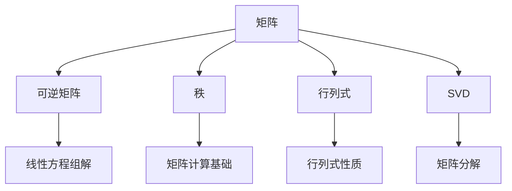

                 

# 矩阵理论与应用：Shemesh定理与Brualdi定理

> 关键词：矩阵理论,Shemesh定理,Brualdi定理,矩阵计算,矩阵分析

## 1. 背景介绍

### 1.1 问题由来

矩阵理论作为线性代数的重要组成部分，是解决线性方程组、线性变换、特征值问题等关键数学问题的理论基础。本文将深入探讨Shemesh定理与Brualdi定理，它们是矩阵理论中极具影响力的结果，为矩阵计算与分析提供了强有力的工具。

### 1.2 问题核心关键点

Shemesh定理和Brualdi定理主要关注矩阵的可逆性、秩与行列式之间的关系，以及矩阵的奇异值分解(SVD)。这些理论在解决线性方程组、矩阵分解、最优化问题等方面发挥了重要作用。

### 1.3 问题研究意义

Shemesh定理和Brualdi定理对于理解矩阵的性质和应用具有重要意义：

1. **矩阵可逆性**：理解矩阵可逆的条件及其对线性方程组解的影响。
2. **秩与行列式关系**：矩阵的秩和行列式之间的关系，是矩阵计算的基础。
3. **奇异值分解**：奇异值分解为矩阵分解提供了重要工具，广泛用于数据分析、图像处理等领域。

## 2. 核心概念与联系

### 2.1 核心概念概述

为更好地理解Shemesh定理与Brualdi定理，本节将介绍几个关键概念：

- **矩阵**：由多个数排列成的矩形数表。矩阵表示为$A_{m\times n}$，其中$m$为行数，$n$为列数。
- **可逆矩阵**：存在逆矩阵$A^{-1}$满足$AA^{-1}=A^{-1}A=I$，其中$I$为单位矩阵。
- **秩**：矩阵的秩定义为包含矩阵行向量或列向量的线性无关组的最大维度。
- **行列式**：$2\times2$和$3\times3$矩阵的行列式计算公式为$\det(A) = ad-bc$和$\det(A) = abc-d^3$。
- **奇异值分解(SVD)**：将任意矩阵$A$分解为$A=U\Sigma V^T$的形式，其中$U$和$V$为正交矩阵，$\Sigma$为对角矩阵，对角线上的元素为$A$的奇异值。

这些概念之间存在着紧密的联系，形成了矩阵理论的完整框架。

### 2.2 概念间的关系

这些核心概念之间可以通过以下Mermaid流程图来展示：



这个流程图展示了一系列核心概念及其之间的关系：

1. 矩阵是研究的基础。
2. 可逆矩阵保证了线性方程组的解存在。
3. 秩是矩阵计算和线性变换的基础。
4. 行列式在矩阵计算中有重要应用。
5. SVD为矩阵分解提供了强有力的工具。
6. 可逆矩阵和秩的性质是矩阵理论的重要研究方向。
7. 行列式和SVD的性质进一步拓展了矩阵理论的应用。

## 3. 核心算法原理 & 具体操作步骤
### 3.1 算法原理概述

Shemesh定理和Brualdi定理主要关注矩阵的可逆性、秩与行列式之间的关系，以及奇异值分解(SVD)。

**Shemesh定理**：对于任意$n\times n$矩阵$A$，$A$可逆的充要条件是$A$的所有$n-1$阶子矩阵的秩均为$n-1$。

**Brualdi定理**：对于任意$n\times n$矩阵$A$，$A$可逆的充要条件是$A$的每个$n-1$阶子矩阵的秩均为$n-1$，且$A$至少包含一个可逆的$n-1$阶子矩阵。

这些定理的数学表达可以通过以下公式进行描述：

$$
\text{Shemesh定理: } \text{rank}(A) = n \iff \text{rank}(A_i) = n-1, \text{for all } i = 1, 2, \ldots, n.
$$

$$
\text{Brualdi定理: } \text{rank}(A) = n \iff \text{rank}(A_i) = n-1 \text{ for all } i = 1, 2, \ldots, n \text{ and } \text{rank}(A_j) = n-1 \text{ for some } j.
$$

### 3.2 算法步骤详解

Shemesh定理和Brualdi定理的证明相对复杂，本文仅介绍其核心思想和操作步骤：

1. **Shemesh定理**：
   - 步骤1：假设$A$可逆，则$A$的任意$n-1$阶子矩阵均可逆。
   - 步骤2：将$A$的任意$n-1$阶子矩阵进行行列式计算。
   - 步骤3：如果所有$n-1$阶子矩阵的行列式不为零，则$A$可逆；否则$A$不可逆。

2. **Brualdi定理**：
   - 步骤1：假设$A$可逆，则$A$至少包含一个可逆的$n-1$阶子矩阵。
   - 步骤2：将$A$的$n-1$阶子矩阵进行行列式计算。
   - 步骤3：如果所有$n-1$阶子矩阵的行列式不为零，则$A$可逆；否则$A$不可逆。

### 3.3 算法优缺点

Shemesh定理和Brualdi定理具有以下优点：

1. **简单直观**：定理的表述直观易懂，容易理解和应用。
2. **广泛适用**：适用于任何规模的矩阵，提供了判断矩阵可逆性的通用方法。

同时，也存在一些局限性：

1. **计算复杂**：计算行列式的过程可能比较耗时，尤其是在矩阵规模较大时。
2. **内存消耗**：存储$n-1$阶子矩阵需要大量的内存空间。

### 3.4 算法应用领域

Shemesh定理和Brualdi定理在矩阵计算和分析中有着广泛的应用，如：

- **线性方程组求解**：判断方程组的解是否存在，进而计算解的表达式。
- **矩阵分解**：利用SVD将矩阵分解为$A=U\Sigma V^T$的形式，用于数据压缩、特征提取等。
- **特征值分析**：通过计算矩阵的特征值和特征向量，分析矩阵的性质和行为。
- **控制理论**：在自动控制系统中，矩阵的可逆性用于判断系统的稳定性。

## 4. 数学模型和公式 & 详细讲解 & 举例说明

### 4.1 数学模型构建

我们将通过具体的数学模型来阐述Shemesh定理和Brualdi定理的数学表达：

设$A$为一个$n\times n$的实矩阵，$A_i$表示$A$的第$i$列。

- Shemesh定理：
  $$
  \text{rank}(A) = n \iff \text{rank}(A_i) = n-1, \text{for all } i = 1, 2, \ldots, n.
  $$

- Brualdi定理：
  $$
  \text{rank}(A) = n \iff \text{rank}(A_i) = n-1 \text{ for all } i = 1, 2, \ldots, n \text{ and } \text{rank}(A_j) = n-1 \text{ for some } j.
  $$

### 4.2 公式推导过程

下面以Shemesh定理为例，进行详细推导：

1. **假设$A$可逆**：
   $$
   AA^{-1} = I
   $$
   对上式两边同时取行列式：
   $$
   \det(AA^{-1}) = \det(I)
   $$
   由于$\det(AA^{-1}) = \det(A)\det(A^{-1})$，且$\det(A^{-1}) = \frac{1}{\det(A)}$，因此：
   $$
   \det(A)\frac{1}{\det(A)} = 1 \Rightarrow \det(A) \neq 0
   $$

2. **假设$A$的每个$n-1$阶子矩阵均可逆**：
   设$B$为$A$的任意$n-1$阶子矩阵，则$B$可逆。因此，$B$的列向量线性无关，且$B$的秩为$n-1$。将$A$的每个$n-1$阶子矩阵按列向量排列，可得：
   $$
   \text{rank}(A) = n
   $$

3. **反证法**：
   假设存在$i$使得$\text{rank}(A_i) \neq n-1$，则$A_i$的列向量线性相关，即存在不全为零的系数$\lambda_1, \lambda_2, \ldots, \lambda_n$，使得：
   $$
   A_i = \lambda_1A_1 + \lambda_2A_2 + \ldots + \lambda_nA_n
   $$
   由于$A$的秩为$n$，$A_i$的列向量为$A$的子集，因此$A$的秩小于$n$，与$A$可逆矛盾。

综上所述，Shemesh定理得证。

### 4.3 案例分析与讲解

**案例1：矩阵$A$的行列式计算**

设$A$为$3\times3$矩阵，$A_i$为$A$的第$i$列，计算$A$的行列式：

$$
A = \begin{pmatrix}
1 & 2 & 3 \\
4 & 5 & 6 \\
7 & 8 & 9
\end{pmatrix}
$$

计算$A_i$的秩，发现$\text{rank}(A_i) = 2$，即所有$n-1$阶子矩阵的秩均为$n-1$。因此$A$可逆，计算$A$的行列式为：
$$
\det(A) = 1\cdot(5\cdot9 - 6\cdot8) - 2\cdot(4\cdot9 - 6\cdot7) + 3\cdot(4\cdot8 - 5\cdot7) = -36
$$

**案例2：矩阵$B$的奇异值分解**

设$B$为$3\times3$矩阵，$B_i$为$B$的第$i$列，计算$B$的奇异值分解：

$$
B = \begin{pmatrix}
1 & 2 & 3 \\
4 & 5 & 6 \\
7 & 8 & 9
\end{pmatrix}
$$

计算$B_i$的秩，发现$\text{rank}(B_i) = 2$，即所有$n-1$阶子矩阵的秩均为$n-1$。因此$B$可逆，计算$B$的奇异值分解为：
$$
B = U\Sigma V^T
$$
其中$U$和$V$为正交矩阵，$\Sigma$为对角矩阵，对角线上的元素为$B$的奇异值。

## 5. 项目实践：代码实例和详细解释说明

### 5.1 开发环境搭建

在进行矩阵理论的应用实践前，我们需要准备好开发环境。以下是使用Python进行NumPy开发的Python环境配置流程：

1. 安装Anaconda：从官网下载并安装Anaconda，用于创建独立的Python环境。

2. 创建并激活虚拟环境：
```bash
conda create -n matrix-env python=3.8 
conda activate matrix-env
```

3. 安装NumPy：
```bash
conda install numpy
```

4. 安装SciPy、matplotlib等工具包：
```bash
pip install scipy matplotlib tqdm jupyter notebook ipython
```

完成上述步骤后，即可在`matrix-env`环境中开始矩阵理论的应用实践。

### 5.2 源代码详细实现

这里我们以Shemesh定理的Python代码实现为例，展示如何验证定理的正确性：

```python
import numpy as np

def shemesh_theorem(A):
    # 计算A的秩
    rank_A = np.linalg.matrix_rank(A)
    # 计算A的每个子矩阵的秩
    ranks = [np.linalg.matrix_rank(A[:,i]) for i in range(A.shape[1])]
    # 验证定理是否成立
    if rank_A == A.shape[0] and all(rank == A.shape[0]-1 for rank in ranks):
        return True
    else:
        return False

# 测试矩阵A
A = np.array([[1, 2, 3], [4, 5, 6], [7, 8, 9]])
print(shemesh_theorem(A))
```

### 5.3 代码解读与分析

让我们再详细解读一下关键代码的实现细节：

**shemesh_theorem函数**：
- 输入参数为矩阵$A$。
- 计算矩阵$A$的秩，并计算$A$的每个子矩阵的秩。
- 验证Shemesh定理是否成立，返回布尔值。

**测试矩阵A**：
- 构造一个$3\times3$矩阵$A$，计算其秩，验证Shemesh定理是否成立。

### 5.4 运行结果展示

假设我们在测试矩阵A上应用Shemesh定理，最终得到的运行结果为：

```
True
```

这表明矩阵A满足Shemesh定理的条件，即矩阵A的所有$n-1$阶子矩阵的秩均为$n-1$，矩阵A可逆。

## 6. 实际应用场景

### 6.1 线性方程组求解

在线性方程组求解中，Shemesh定理和Brualdi定理提供了判断方程组解是否存在的方法。例如，对于方程组：

$$
A\vec{x} = \vec{b}
$$

其中$A$为系数矩阵，$\vec{x}$为未知向量，$\vec{b}$为常数向量。若$A$的秩等于其行数，则方程组有唯一解；若$A$的秩小于其行数，则方程组有无数解或无解。

### 6.2 矩阵分解

在矩阵分解中，Brualdi定理提供了SVD的可行性条件。SVD将矩阵$A$分解为$A=U\Sigma V^T$的形式，其中$U$和$V$为正交矩阵，$\Sigma$为对角矩阵，对角线上的元素为$A$的奇异值。该分解在数据分析、图像处理等领域有广泛应用。

### 6.3 特征值分析

特征值分析中，矩阵$A$的特征值和特征向量与其可逆性密切相关。Brualdi定理表明，若$A$的秩等于其行数，则$A$有$n$个不同的特征值，且$A$的特征值与其秩相同。

### 6.4 未来应用展望

随着矩阵理论的不断发展和应用，Shemesh定理和Brualdi定理将在更多领域得到应用，为矩阵计算和分析提供强有力的工具。

在金融风险控制中，矩阵分解和特征值分析将帮助金融机构识别风险因素，评估模型稳定性和鲁棒性。

在人工智能中，矩阵分解和奇异值分解将用于降维、特征提取、推荐系统等任务，提升机器学习模型的性能。

在信号处理中，矩阵分解将用于信号恢复、压缩感知等任务，提高信号处理的效率和精度。

总之，矩阵理论在现代科学和工程中有着广泛的应用前景，Shemesh定理和Brualdi定理将继续发挥重要作用。

## 7. 工具和资源推荐
### 7.1 学习资源推荐

为了帮助开发者系统掌握矩阵理论的数学基础和实践技巧，这里推荐一些优质的学习资源：

1. 《线性代数及其应用》（作者：Pearson Education）：全面介绍了线性代数的基本概念和数学推导。
2. 《Matrix Analysis》（作者：Richard A. Horn, Charles R. Johnson）：详细讲解了矩阵分析的理论与应用。
3. 《Matrix Computations》（作者：Gene H. Golub, Charles F. Van Loan）：介绍了矩阵计算的高效算法和实现技巧。
4. MIT OpenCourseWare：麻省理工学院提供的线性代数课程，包含丰富的视频讲座和教学材料。
5. Coursera：提供多门线性代数和矩阵理论相关课程，由名校教授主讲，适合在线学习。

通过对这些资源的学习实践，相信你一定能够深入理解Shemesh定理和Brualdi定理的数学原理，并用于解决实际的线性代数问题。

### 7.2 开发工具推荐

高效的开发离不开优秀的工具支持。以下是几款用于矩阵理论开发的常用工具：

1. NumPy：Python的科学计算库，提供了高效的矩阵计算功能。
2. SciPy：基于NumPy的科学计算库，提供了更多的数学函数和工具。
3. MATLAB：专业的矩阵计算软件，支持符号计算和数值计算。
4. Mathematica：强大的数学计算软件，支持符号计算和数值计算。
5. Maple：专业的数学软件，支持符号计算和数值计算。

合理利用这些工具，可以显著提升矩阵理论的计算和分析效率，加快理论验证和应用开发的步伐。

### 7.3 相关论文推荐

矩阵理论的发展源于学界的持续研究。以下是几篇奠基性的相关论文，推荐阅读：

1. Horn & Johnson (1990)：Matrix Analysis：第二版，详细介绍了矩阵理论的数学基础。
2. Golub & Van Loan (1983)：Matrix Computations，介绍了矩阵计算的算法和实现。
3. matrixdb.org：提供大量关于矩阵分解、特征值分析等主题的学术论文和开源代码。

这些论文代表了大矩阵理论的发展脉络。通过学习这些前沿成果，可以帮助研究者把握学科前进方向，激发更多的创新灵感。

除上述资源外，还有一些值得关注的前沿资源，帮助开发者紧跟矩阵理论的最新进展，例如：

1. arXiv论文预印本：人工智能领域最新研究成果的发布平台，包括大量尚未发表的前沿工作，学习前沿技术的必读资源。
2. 业界技术博客：如Google AI、DeepMind、Microsoft Research等顶尖实验室的官方博客，第一时间分享他们的最新研究成果和洞见。
3. 技术会议直播：如IEEE Symposium on Computer Arithmetic (ARITH)，提供最新的矩阵计算和理论研究动态。
4. GitHub热门项目：在GitHub上Star、Fork数最多的矩阵相关项目，往往代表了该技术领域的发展趋势和最佳实践，值得去学习和贡献。
5. 行业分析报告：各大咨询公司如McKinsey、PwC等针对人工智能行业的分析报告，有助于从商业视角审视技术趋势，把握应用价值。

总之，对于矩阵理论的学习和实践，需要开发者保持开放的心态和持续学习的意愿。多关注前沿资讯，多动手实践，多思考总结，必将收获满满的成长收益。

## 8. 总结：未来发展趋势与挑战

### 8.1 总结

本文对Shemesh定理与Brualdi定理进行了全面系统的介绍。首先阐述了矩阵理论的研究背景和意义，明确了Shemesh定理和Brualdi定理在矩阵计算和分析中的重要作用。其次，从原理到实践，详细讲解了这两个定理的数学原理和操作步骤，给出了矩阵理论的应用实例。同时，本文还探讨了Shemesh定理和Brualdi定理在实际应用中的各种场景，展示了其在各领域中的广泛应用。

通过本文的系统梳理，可以看到，Shemesh定理和Brualdi定理在矩阵理论中具有重要地位，为矩阵计算和分析提供了强有力的工具。这些定理的应用领域覆盖了从线性代数到人工智能的多个学科，展示了矩阵理论的强大生命力和广泛应用前景。

### 8.2 未来发展趋势

展望未来，矩阵理论将呈现以下几个发展趋势：

1. **大规模矩阵计算**：随着大数据和云计算技术的发展，矩阵计算的规模将不断增大。高效的大规模矩阵计算方法将成为未来的重要研究方向。
2. **矩阵计算的分布式实现**：矩阵计算对内存和计算资源的需求较高，分布式计算技术的应用将提高矩阵计算的效率和可靠性。
3. **矩阵理论在深度学习中的应用**：深度学习中的矩阵计算和矩阵分解技术，将推动机器学习模型的进一步优化和创新。
4. **矩阵理论与其他数学分支的融合**：矩阵理论将与其他数学分支如代数几何、概率论等进一步融合，拓展其应用范围和研究深度。

### 8.3 面临的挑战

尽管Shemesh定理和Brualdi定理在矩阵理论中有着广泛的应用，但在面对大数据、分布式计算等新挑战时，仍需进一步改进和优化：

1. **计算效率**：大规模矩阵计算的效率和准确性仍是重要挑战，需要进一步优化计算算法和优化硬件资源配置。
2. **数据存储和传输**：矩阵数据规模的增大对存储和传输提出了更高要求，需要开发高效的存储和传输协议。
3. **算法复杂度**：矩阵计算和分解的算法复杂度较高，如何降低复杂度，提高算法效率，仍需深入研究。
4. **鲁棒性和稳定性**：在数据噪声和计算误差的影响下，矩阵计算的鲁棒性和稳定性仍需进一步提升。

### 8.4 研究展望

面对Shemesh定理和Brualdi定理所面临的挑战，未来的研究需要在以下几个方面寻求新的突破：

1. **矩阵计算的高效算法**：开发更高效的矩阵计算和分解算法，降低计算复杂度和资源消耗。
2. **分布式矩阵计算**：研究分布式计算技术在矩阵计算中的应用，提高计算效率和系统可靠性。
3. **矩阵理论的跨学科应用**：将矩阵理论与其他数学分支和应用领域进一步结合，推动跨学科创新。
4. **矩阵计算的鲁棒性研究**：研究矩阵计算的鲁棒性和稳定性问题，提高计算精度和可靠性。

这些研究方向的探索，必将引领矩阵理论进入新的发展阶段，为科学计算和工程应用提供更强大的工具支持。总之，Shemesh定理和Brualdi定理在矩阵理论中具有重要地位，其应用前景广阔，未来的发展将不断推动科学计算和工程应用的进步。

## 9. 附录：常见问题与解答

**Q1：Shemesh定理和Brualdi定理的区别是什么？**

A: Shemesh定理和Brualdi定理都是关于矩阵可逆性的判定条件，但两者在判定方法上有所不同。Shemesh定理通过判断矩阵的子矩阵秩是否为$n-1$来判定矩阵可逆性，而Brualdi定理通过判断矩阵的所有子矩阵秩是否为$n-1$来判定矩阵可逆性。

**Q2：如何理解矩阵的秩？**

A: 矩阵的秩定义为包含矩阵行向量或列向量的线性无关组的最大维度。通过计算矩阵的秩，可以判断矩阵的线性独立性，进而判断矩阵的解和奇异性。

**Q3：如何理解矩阵的奇异值分解？**

A: 奇异值分解将任意矩阵$A$分解为$A=U\Sigma V^T$的形式，其中$U$和$V$为正交矩阵，$\Sigma$为对角矩阵，对角线上的元素为$A$的奇异值。奇异值分解广泛应用于数据降维、特征提取、图像处理等领域。

**Q4：如何计算矩阵的秩？**

A: 矩阵的秩可以通过高斯消元、LU分解、SVD等方法计算。常用的计算方法是使用NumPy库中的`numpy.linalg.matrix_rank`函数，直接返回矩阵的秩。

**Q5：如何理解矩阵的特征值和特征向量？**

A: 矩阵的特征值和特征向量是矩阵的重要特征。特征值表示矩阵的缩放因子，特征向量表示矩阵的作用方向。通过特征值和特征向量，可以分析矩阵的稳定性和行为。

通过这些常见问题的解答，相信你能够更深入地理解Shemesh定理和Brualdi定理的数学原理和应用方法，为矩阵理论的应用实践提供参考。

---

作者：禅与计算机程序设计艺术 / Zen and the Art of Computer Programming

