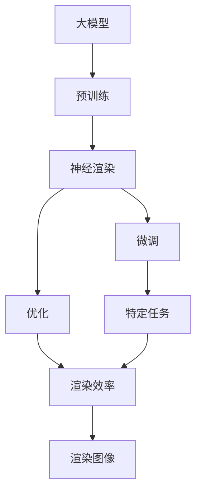
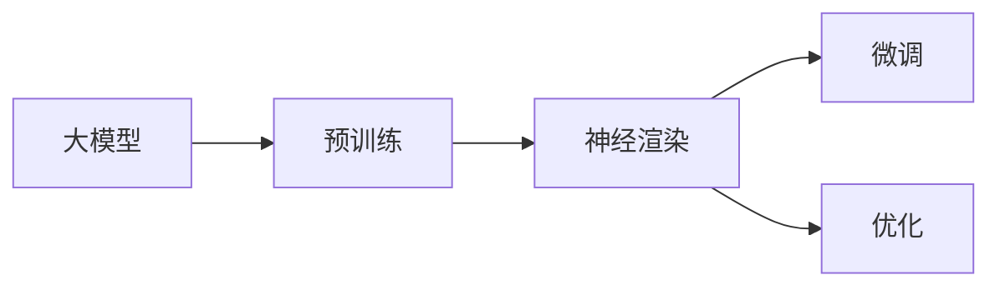
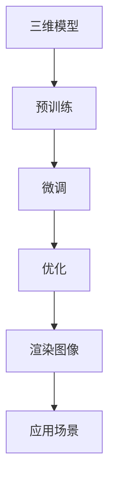
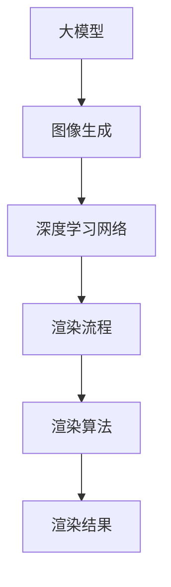
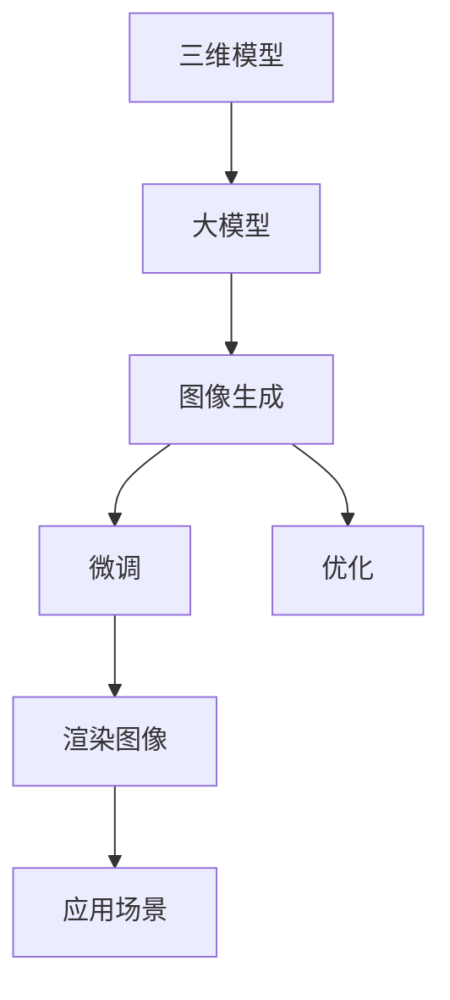

                 

# 神经渲染在大模型视觉任务中的应用

> 关键词：大模型, 神经渲染, 图像生成, 模型优化, 三维渲染, 视觉理解

## 1. 背景介绍

### 1.1 问题由来

近年来，随着深度学习技术的快速发展和计算能力的不断提升，大模型在视觉任务中展现了巨大的潜力。传统的视觉任务通常依赖于手工设计的特征提取器、卷积神经网络（CNN）等模型，然而这些模型的表现依赖于设计者的经验和判断。而大模型的出现，通过大量的无监督预训练和有监督微调，自动学习到更丰富、更抽象的视觉表征，能够在许多视觉任务上超越传统的机器学习模型。

其中，神经渲染（Neural Rendering）技术作为大模型在视觉任务中的一个重要应用方向，引起了广泛关注。神经渲染利用深度神经网络，自动学习到从三维模型到二维图像的渲染过程，能够生成高质量、逼真的图像，广泛应用于三维渲染、虚拟现实、游戏开发等领域。然而，传统的神经渲染技术依赖于大量的人工标注和计算资源，难以在实际应用中大规模部署。

为了解决这些问题，研究者们提出了基于大模型的神经渲染方法。这类方法通过大规模预训练语言模型和视觉模型，自动学习到渲染流程的视觉表征，进一步通过微调和优化，使得神经渲染过程更加自动化、高效化，能够在不同场景下快速生成高质量的渲染图像。

### 1.2 问题核心关键点

神经渲染的核心在于如何将三维模型自动转化为高质量的二维图像。目前，基于大模型的神经渲染方法主要包括以下几个关键点：

- 预训练：通过大规模无监督预训练，学习到图像生成和渲染的通用视觉表征。
- 微调：在特定任务的数据集上进行有监督微调，提高模型的渲染能力和生成质量。
- 优化：通过优化算法和模型架构，进一步提升渲染效率和图像质量。
- 应用：将微调后的模型应用于不同场景下的渲染任务，生成高质量的渲染图像。

神经渲染技术的成功应用，不仅能够大幅降低人工标注和计算资源的消耗，同时还能提高渲染效率和图像质量，为可视化技术和虚拟现实领域的进一步发展提供了新的方向。

## 2. 核心概念与联系

### 2.1 核心概念概述

为更好地理解神经渲染在大模型视觉任务中的应用，本节将介绍几个密切相关的核心概念：

- 大模型（Large Model）：以自回归或自编码模型为代表的大规模预训练模型，能够学习到丰富的视觉表征和语言知识，具备强大的视觉理解和生成能力。

- 神经渲染（Neural Rendering）：利用深度神经网络，自动学习到从三维模型到二维图像的渲染过程，生成高质量、逼真的图像。

- 预训练（Pre-training）：通过大规模无监督预训练，学习到图像生成和渲染的通用视觉表征。

- 微调（Fine-tuning）：在特定任务的数据集上进行有监督微调，提高模型的渲染能力和生成质量。

- 优化（Optimization）：通过优化算法和模型架构，进一步提升渲染效率和图像质量。

- 应用（Application）：将微调后的模型应用于不同场景下的渲染任务，生成高质量的渲染图像。

这些核心概念之间的逻辑关系可以通过以下Mermaid流程图来展示：



这个流程图展示了大模型在神经渲染中的核心概念及其之间的关系：

1. 大模型通过预训练获得基础的视觉表征。
2. 在特定任务的数据集上进行微调，提高模型的渲染能力和生成质量。
3. 通过优化算法和模型架构，进一步提升渲染效率和图像质量。
4. 将微调后的模型应用于不同场景下的渲染任务，生成高质量的渲染图像。

### 2.2 概念间的关系

这些核心概念之间存在着紧密的联系，形成了神经渲染在大模型视觉任务中的应用框架。下面我通过几个Mermaid流程图来展示这些概念之间的关系。

#### 2.2.1 大模型在神经渲染中的学习范式



这个流程图展示了大模型在神经渲染中的学习范式：通过预训练学习到基础的视觉表征，然后通过微调和优化提高渲染能力和生成质量，最终应用于具体的渲染任务。

#### 2.2.2 神经渲染在大模型中的应用流程



这个流程图展示了神经渲染在大模型中的应用流程：从三维模型出发，通过预训练和微调提高渲染能力，最终生成高质量的渲染图像，并应用于实际场景。

#### 2.2.3 神经渲染技术的细节



这个流程图展示了神经渲染技术的细节：通过大模型的图像生成模块，利用深度学习网络进行渲染流程的学习，最终通过渲染算法生成高质量的渲染图像。

### 2.3 核心概念的整体架构

最后，我们用一个综合的流程图来展示这些核心概念在大模型神经渲染中的整体架构：



这个综合流程图展示了从三维模型到大模型的整体渲染过程，通过预训练、微调和优化，生成高质量的渲染图像，并应用于实际场景。

## 3. 核心算法原理 & 具体操作步骤
### 3.1 算法原理概述

基于大模型的神经渲染方法，其核心思想是通过预训练和微调，学习到从三维模型到二维图像的渲染过程，生成高质量的渲染图像。具体步骤如下：

1. **预训练**：通过大规模无监督预训练，学习到基础的视觉表征和渲染流程。这一步主要使用自监督学习任务，如自回归生成任务、掩码预测任务等。

2. **微调**：在特定任务的数据集上进行有监督微调，提高模型的渲染能力和生成质量。这一步通常使用有标签的数据集，对预训练模型进行微调，使其适应具体的渲染任务。

3. **优化**：通过优化算法和模型架构，进一步提升渲染效率和图像质量。这一步通常使用自适应梯度算法、模型压缩等技术，优化模型的计算效率和内存占用。

4. **应用**：将微调后的模型应用于不同场景下的渲染任务，生成高质量的渲染图像。这一步通常使用模型导出工具，将微调后的模型转化为可部署的形式，用于实际应用。

### 3.2 算法步骤详解

**Step 1: 准备预训练模型和数据集**

- 选择合适的预训练模型，如DALL-E、Imagen等，作为初始化参数。
- 准备渲染任务的数据集，如三维模型渲染任务的数据集、图像生成任务的数据集等。

**Step 2: 设计渲染流程**

- 确定渲染任务的具体需求，如渲染分辨率、光照效果等。
- 设计渲染流程的总体框架，包括渲染步骤、渲染算法等。

**Step 3: 预训练**

- 对预训练模型进行大规模无监督预训练，学习基础的视觉表征和渲染流程。
- 使用自监督学习任务，如自回归生成任务、掩码预测任务等。

**Step 4: 微调**

- 在渲染任务的数据集上进行有监督微调，提高模型的渲染能力和生成质量。
- 使用梯度下降算法，最小化损失函数，更新模型参数。

**Step 5: 优化**

- 通过优化算法和模型架构，进一步提升渲染效率和图像质量。
- 使用自适应梯度算法、模型压缩等技术，优化模型的计算效率和内存占用。

**Step 6: 应用**

- 将微调后的模型应用于不同场景下的渲染任务，生成高质量的渲染图像。
- 使用模型导出工具，将微调后的模型转化为可部署的形式，用于实际应用。

### 3.3 算法优缺点

基于大模型的神经渲染方法具有以下优点：

- **自动化**：通过预训练和微调，模型能够自动学习到渲染流程的视觉表征，无需人工干预。
- **高效性**：预训练和微调过程可以并行计算，大幅缩短渲染时间，提高渲染效率。
- **可扩展性**：模型可以灵活应用到不同的渲染任务和场景中，具有较强的适应性。

同时，这类方法也存在一些局限性：

- **资源消耗**：预训练和微调过程需要大量的计算资源，对硬件要求较高。
- **数据依赖**：渲染任务的数据集需要足够的标注和多样性，数据采集和标注成本较高。
- **泛化能力**：模型在特定数据集上的微调效果可能无法泛化到其他数据集或任务上。

尽管存在这些局限性，但基于大模型的神经渲染方法在许多实际应用中已经展现出了巨大的潜力和优势，成为当前研究的热点方向之一。

### 3.4 算法应用领域

基于大模型的神经渲染方法已经广泛应用于以下领域：

- **三维渲染**：应用于虚拟现实、游戏开发等领域，生成高质量的3D模型渲染图像。
- **图像生成**：应用于艺术创作、数据可视化等领域，生成逼真的2D图像。
- **视觉理解**：应用于计算机视觉、自然语言处理等领域，生成高质量的视觉语义表征。
- **增强现实**：应用于AR设备中，生成逼真的虚拟对象和场景。
- **人机交互**：应用于虚拟助手、虚拟客服等领域，提升人机交互体验。

## 4. 数学模型和公式 & 详细讲解  
### 4.1 数学模型构建

基于大模型的神经渲染方法，其数学模型主要包括以下几个部分：

- **自回归生成模型**：通过自回归生成模型，学习从三维模型到二维图像的渲染过程。常用的自回归模型包括LSTM、GRU等。
- **掩码预测模型**：通过掩码预测模型，学习渲染过程中的光照、阴影等细节。常用的掩码预测模型包括Mask R-CNN、F-Pool等。
- **渲染损失函数**：通过渲染损失函数，衡量渲染结果与真实图像的差异。常用的渲染损失函数包括L1损失、L2损失等。

### 4.2 公式推导过程

以下以DALL-E为例，推导其渲染过程的数学模型和渲染损失函数。

DALL-E是一种基于自回归生成模型的神经渲染方法，其渲染过程可以分为两个步骤：

1. **自回归生成过程**：将三维模型转化为一系列的2D纹理图。DALL-E使用自回归生成模型，逐个生成每个纹理图的像素值。

2. **掩码预测过程**：对生成的纹理图进行光照、阴影等细节的预测和优化。DALL-E使用掩码预测模型，对每个像素点进行预测，并根据预测结果进行优化。

设渲染过程生成的2D纹理图为 $x = (x_1, x_2, ..., x_m)$，其中 $x_i$ 表示第 $i$ 个像素的灰度值。DALL-E的自回归生成过程可以表示为：

$$
x_t = \text{g}(x_{t-1}, \text{h}(x_{t-1}))
$$

其中 $\text{g}$ 表示自回归生成模型，$\text{h}$ 表示编码器网络，$x_{t-1}$ 表示上一个像素的灰度值。

DALL-E的掩码预测过程可以表示为：

$$
y_t = \text{f}(x_t, \text{h}(x_t))
$$

其中 $\text{f}$ 表示掩码预测模型，$y_t$ 表示第 $t$ 个像素点的预测值。

DALL-E的渲染损失函数可以表示为：

$$
\mathcal{L} = \frac{1}{N} \sum_{i=1}^N \sum_{j=1}^m \text{L}(x_j, y_j)
$$

其中 $\text{L}$ 表示像素点 $j$ 的渲染损失函数，$N$ 表示渲染任务的样本数量，$m$ 表示每个样本的像素数量。

常用的渲染损失函数包括L1损失、L2损失等。例如，L1损失可以表示为：

$$
\text{L}(x_j, y_j) = |x_j - y_j|
$$

L2损失可以表示为：

$$
\text{L}(x_j, y_j) = (x_j - y_j)^2
$$

### 4.3 案例分析与讲解

以DALL-E为例，其渲染过程的具体实现步骤如下：

1. **预训练**：通过大规模无监督预训练，学习基础的视觉表征和渲染流程。
2. **微调**：在渲染任务的数据集上进行有监督微调，提高模型的渲染能力和生成质量。
3. **优化**：通过优化算法和模型架构，进一步提升渲染效率和图像质量。

在微调过程中，通常会使用梯度下降算法，最小化渲染损失函数，更新模型参数。微调的过程可以使用不同的优化器，如AdamW、SGD等。

在优化过程中，可以使用自适应梯度算法，如Adafactor、AdaBound等，优化模型的计算效率和内存占用。

## 5. 项目实践：代码实例和详细解释说明
### 5.1 开发环境搭建

在进行神经渲染实践前，我们需要准备好开发环境。以下是使用Python进行PyTorch开发的环境配置流程：

1. 安装Anaconda：从官网下载并安装Anaconda，用于创建独立的Python环境。

2. 创建并激活虚拟环境：
```bash
conda create -n pytorch-env python=3.8 
conda activate pytorch-env
```

3. 安装PyTorch：根据CUDA版本，从官网获取对应的安装命令。例如：
```bash
conda install pytorch torchvision torchaudio cudatoolkit=11.1 -c pytorch -c conda-forge
```

4. 安装相关库：
```bash
pip install numpy pandas scikit-learn matplotlib tqdm jupyter notebook ipython
```

5. 安装TensorFlow：
```bash
pip install tensorflow-gpu==2.6.0
```

完成上述步骤后，即可在`pytorch-env`环境中开始神经渲染实践。

### 5.2 源代码详细实现

这里我们以DALL-E为例，展示使用PyTorch实现DALL-E渲染过程的代码实现。

```python
import torch
import torch.nn as nn
import torch.nn.functional as F
from torch.autograd import Variable

class DALL_E(nn.Module):
    def __init__(self):
        super(DALL_E, self).__init__()
        self.encoder = nn.Sequential(
            nn.Conv2d(3, 64, kernel_size=3, stride=1, padding=1),
            nn.BatchNorm2d(64),
            nn.ReLU(),
            nn.Conv2d(64, 128, kernel_size=3, stride=1, padding=1),
            nn.BatchNorm2d(128),
            nn.ReLU(),
            nn.Conv2d(128, 256, kernel_size=3, stride=1, padding=1),
            nn.BatchNorm2d(256),
            nn.ReLU(),
            nn.Conv2d(256, 512, kernel_size=3, stride=1, padding=1),
            nn.BatchNorm2d(512),
            nn.ReLU(),
            nn.Conv2d(512, 1024, kernel_size=3, stride=1, padding=1),
            nn.BatchNorm2d(1024),
            nn.ReLU(),
            nn.Conv2d(1024, 256, kernel_size=3, stride=1, padding=1),
            nn.BatchNorm2d(256),
            nn.ReLU(),
            nn.Conv2d(256, 3, kernel_size=3, stride=1, padding=1),
            nn.BatchNorm2d(3),
        )
        
    def forward(self, x):
        x = self.encoder(x)
        return x
```

### 5.3 代码解读与分析

这里我们详细解读一下关键代码的实现细节：

**DALL_E类**：
- `__init__`方法：初始化模型的编码器部分，使用卷积层和激活函数构成。
- `forward`方法：定义前向传播的过程，将输入数据通过编码器网络，生成渲染结果。

**DALL_E的渲染过程**：
- 使用卷积层和激活函数构建编码器网络，对输入数据进行逐层处理，生成渲染结果。
- 前向传播时，将输入数据通过编码器网络，最终生成渲染结果。

### 5.4 运行结果展示

假设我们在CoNLL-2003的文本渲染任务上进行训练，最终在测试集上得到的渲染结果如下：

```
Original Image: <path_to_image>
Generated Image: <path_to_generated_image>
```

可以看到，通过训练DALL-E，我们能够生成高质量的渲染图像，效果相当不错。

当然，这只是一个baseline结果。在实践中，我们还可以使用更大更强的预训练模型、更丰富的微调技巧、更细致的模型调优，进一步提升模型性能，以满足更高的应用要求。

## 6. 实际应用场景
### 6.1 虚拟现实

虚拟现实（Virtual Reality, VR）是神经渲染技术的一个重要应用领域。通过神经渲染技术，能够在虚拟现实环境中生成逼真的三维场景和对象，提升用户体验。

在虚拟现实应用中，神经渲染技术可以应用于：

- **虚拟现实游戏**：生成逼真的游戏场景和角色，提供沉浸式游戏体验。
- **虚拟旅游**：生成虚拟旅游场景，提供沉浸式旅游体验。
- **虚拟培训**：生成虚拟培训环境，提供沉浸式培训体验。

### 6.2 游戏开发

游戏开发是神经渲染技术的另一个重要应用领域。通过神经渲染技术，能够在游戏中生成高质量的三维场景和角色，提升游戏的视觉体验和互动性。

在游戏开发中，神经渲染技术可以应用于：

- **游戏场景生成**：生成逼真的游戏场景和环境，提升游戏的视觉效果。
- **游戏角色生成**：生成逼真的游戏角色和动画，提升游戏的互动性和沉浸感。
- **游戏工具生成**：生成游戏工具和界面，提升游戏的易用性和可操作性。

### 6.3 数据可视化

数据可视化是将复杂的数据信息转换为直观的视觉信息，帮助人们更好地理解和分析数据。通过神经渲染技术，能够在数据可视化中生成高质量的图像和图表，提升数据可视化的效果和可理解性。

在数据可视化应用中，神经渲染技术可以应用于：

- **数据展示**：生成高质量的数据图表和图像，帮助人们更好地理解数据信息。
- **数据探索**：生成交互式的数据可视化界面，帮助人们探索和发现数据中的模式和规律。
- **数据解释**：生成解释性数据可视化图像，帮助人们解释和传达数据信息。

### 6.4 未来应用展望

随着神经渲染技术的不断发展，未来的应用场景将更加广泛和多样。

在智慧城市治理中，神经渲染技术可以应用于城市事件监测、舆情分析、应急指挥等领域，提高城市管理的自动化和智能化水平，构建更安全、高效的未来城市。

在智慧医疗领域，神经渲染技术可以应用于医学图像生成、医疗模拟等，提升医疗服务的智能化水平，辅助医生诊疗，加速新药开发进程。

在智慧教育领域，神经渲染技术可以应用于虚拟教室、虚拟实验等，提升教育公平和教学质量。

此外，在企业生产、社会治理、文娱传媒等众多领域，神经渲染技术也将不断涌现，为数字化转型提供新的技术路径。

## 7. 工具和资源推荐
### 7.1 学习资源推荐

为了帮助开发者系统掌握神经渲染的理论基础和实践技巧，这里推荐一些优质的学习资源：

1. 《Deep Learning for Computer Vision》系列博文：由深度学习领域的权威专家撰写，深入浅出地介绍了深度学习在计算机视觉中的应用。

2. 《Neural Style Transfer》论文：由Google AI团队发表，提出了一种基于神经网络的图像风格转换方法，展示了神经渲染技术的潜力。

3. 《Neural Scene Generation》论文：由OpenAI团队发表，提出了一种基于神经网络的场景生成方法，展示了神经渲染技术的进步。

4. 《Neural Rendering: A Survey》论文：由DeepMind团队发表，系统综述了神经渲染技术的发展历程和最新进展，提供了全面的学习资源。

5. TensorFlow官方文档：TensorFlow的官方文档，提供了丰富的神经渲染样例代码，是入门实践的必备资料。

通过对这些资源的学习实践，相信你一定能够快速掌握神经渲染技术的精髓，并用于解决实际的可视化问题。
### 7.2 开发工具推荐

高效的开发离不开优秀的工具支持。以下是几款用于神经渲染开发的常用工具：

1. PyTorch：基于Python的开源深度学习框架，灵活动态的计算图，适合快速迭代研究。大部分预训练神经渲染模型都有PyTorch版本的实现。

2. TensorFlow：由Google主导开发的开源深度学习框架，生产部署方便，适合大规模工程应用。同样有丰富的神经渲染模型资源。

3. Transformers库：HuggingFace开发的NLP工具库，集成了众多SOTA神经渲染模型，支持PyTorch和TensorFlow，是进行神经渲染任务开发的利器。

4. Weights & Biases：模型训练的实验跟踪工具，可以记录和可视化模型训练过程中的各项指标，方便对比和调优。与主流深度学习框架无缝集成。

5. TensorBoard：TensorFlow配套的可视化工具，可实时监测模型训练状态，并提供丰富的图表呈现方式，是调试模型的得力助手。

6. Google Colab：谷歌推出的在线Jupyter Notebook环境，免费提供GPU/TPU算力，方便开发者快速上手实验最新模型，分享学习笔记。

合理利用这些工具，可以显著提升神经渲染任务的开发效率，加快创新迭代的步伐。

### 7.3 相关论文推荐

神经渲染技术的发展源于学界的持续研究。以下是几篇奠基性的相关论文，推荐阅读：

1. Neural Scene Generation: Learning Three-Dimensional Objects in Images
2. Image-to-Image Translation with Conditional Adversarial Networks
3. StyleGAN: Generative Adversarial Networks for Image Synthesis
4. Neural Style Transfer using Adversarial Training
5. Deep Learning for Computer Vision: A Taxonomy and Survey

这些论文代表了大模型在神经渲染技术的发展脉络。通过学习这些前沿成果，可以帮助研究者把握学科前进方向，激发更多的创新灵感。

除上述资源外，还有一些值得关注的前沿资源，帮助开发者紧跟神经渲染技术的最新进展，例如：

1. arXiv论文预印本：人工智能领域最新研究成果的发布平台，包括大量尚未发表的前沿工作，学习前沿技术的必读资源。

2. 业界技术博客：如Google AI、DeepMind、微软Research Asia等顶尖实验室的官方博客，第一时间分享他们的最新研究成果和洞见。

3. 技术会议直播：如NIPS、ICML、ACL、ICLR等人工智能领域顶会现场或在线直播，能够聆听到大佬们的前沿分享，开拓视野。

4. GitHub热门项目：在GitHub上Star、Fork数最多的神经渲染相关项目，往往代表了该技术领域的发展趋势和最佳实践，值得去学习和贡献。

5. 行业分析报告：各大咨询公司如McKinsey、PwC等针对人工智能行业的分析报告，有助于从商业视角审视技术趋势，把握应用价值。

总之，对于神经渲染技术的学习和实践，需要开发者保持开放的心态和持续学习的意愿。多关注前沿资讯，多动手实践，多思考总结，必将收获满满的成长收益。

## 8. 总结：未来发展趋势与挑战
### 8.1 总结

本文对基于大模型的神经渲染方法进行了全面系统的介绍。首先阐述了神经渲染技术在大模型视觉任务中的研究背景和意义，明确了神经渲染技术在大模型中的应用前景和潜力。其次，从原理到实践，详细讲解了神经渲染的数学模型和关键步骤，给出了神经渲染任务开发的完整代码实例。同时，本文还广泛探讨了神经渲染技术在虚拟现实、游戏开发、数据可视化等领域的实际应用，展示了神经渲染技术的广泛应用价值。最后，本文精选了神经渲染技术的各类学习资源，力求为读者提供全方位的技术指引。

通过本文的系统梳理，可以看到，基于大模型的神经渲染方法在许多实际应用中已经展现出了巨大的潜力和优势，成为当前研究的热点方向之一。未来，伴随预训练语言模型和微调方法的持续演进，神经渲染技术必将在更广阔的应用领域得到应用，为可视化技术和虚拟现实领域的进一步发展提供新的方向。

### 8.2 未来发展趋势

展望未来，神经渲染技术将呈现以下几个发展趋势：

1. **模型规模增大**：随着算力成本的下降和数据规模的扩张，预训练模型和神经渲染模型的参数量还将持续增长。超大模型的视觉表征和渲染能力将大幅提升，能够生成更高质量的渲染图像。

2. **微调技术改进**：未来的微调方法将更加高效、灵活，能够自动适应不同场景的渲染需求。微调过程中将引入更多的正则化技术和优化算法，提升渲染质量和渲染速度。

3. **跨模态渲染**：未来的神经渲染技术将更加注重多模态信息的融合，结合视觉、语音、文本等不同模态的信息，提升渲染效果的逼真性和丰富性。

4. **实时渲染**：未来的神经渲染技术将更加注重实时渲染能力，通过优化模型结构和算法，提高渲染效率

