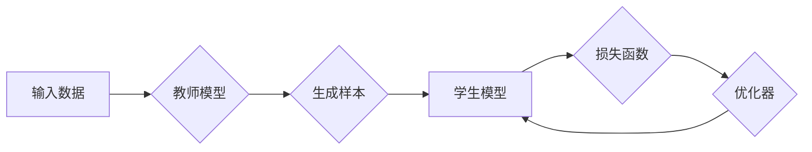

# Transformer大模型实战 教师 学生架构

> 关键词：Transformer, 大模型, 教师模型, 学生模型, 预训练, 微调, 自监督学习, NLP, 代码实例

## 1. 背景介绍

近年来，自然语言处理（NLP）领域取得了长足的进步，其中Transformer模型的出现更是将NLP推向了新的高度。Transformer模型因其并行处理能力和对序列数据的强大建模能力，成为NLP任务的首选架构。然而，随着模型规模的不断扩大，如何高效地进行模型训练和推理成为一个重要的挑战。本文将探讨如何利用“教师-学生架构”（Teacher-Student Architecture）在Transformer大模型上进行实战，通过微调和自监督学习等方法，实现模型的有效训练和优化。

## 2. 核心概念与联系

### 2.1 核心概念原理

#### 教师模型（Teacher Model）

教师模型是指一个大型、预训练的Transformer模型，它已经在大规模文本数据上进行了充分训练，并学习到了丰富的语言知识。教师模型的目的是生成高质量的样本，以指导学生模型的训练。

#### 学生模型（Student Model）

学生模型是指一个较小的、经过微调的Transformer模型，它在教师模型的指导下进行训练，以学习更优的参数设置。

#### 自监督学习（Self-Supervised Learning）

自监督学习是一种无需人工标注数据的机器学习方法，通过设计特殊的任务，使模型从无标注数据中学习有用的特征。

### 2.2 架构的Mermaid流程图



### 2.3 核心概念联系

教师模型和学生模型通过自监督学习相互联系。教师模型生成样本，学生模型通过学习这些样本来优化自身参数。这种架构允许教师模型在大量未标注数据上进行训练，而学生模型则利用教师模型的输出进行微调，从而在有限标注数据的情况下取得优异的性能。

## 3. 核心算法原理 & 具体操作步骤

### 3.1 算法原理概述

教师-学生架构的核心思想是利用教师模型的强大能力来指导学生模型的训练。教师模型通常是一个大型预训练模型，而学生模型是一个经过微调的小型模型。以下是该架构的主要步骤：

1. 教师模型在大量未标注数据上进行预训练，学习到丰富的语言知识。
2. 教师模型生成高质量的样本，例如，通过同义词替换、掩码语言模型等任务。
3. 学生模型使用教师模型生成的样本进行训练，并优化自身参数。
4. 通过优化器调整学生模型的参数，以最小化损失函数。

### 3.2 算法步骤详解

1. **预训练教师模型**：使用大规模文本数据集，通过自监督学习任务（如掩码语言模型）训练教师模型。
2. **生成样本**：教师模型使用特定任务（如同义词替换）生成高质量的样本。
3. **训练学生模型**：学生模型使用教师模型生成的样本进行训练，学习任务相关的特征和知识。
4. **优化学生模型**：通过优化器调整学生模型的参数，以最小化损失函数。
5. **评估学生模型**：在测试集上评估学生模型的性能，以验证其有效性。

### 3.3 算法优缺点

#### 优点

- **高效**：教师-学生架构可以利用教师模型的强大能力来加速学生模型的训练。
- **泛化能力强**：学生模型可以学习到更广泛的特征，从而在未见过的数据上表现良好。
- **资源高效**：学生模型可以更有效地利用计算资源。

#### 缺点

- **对教师模型依赖性强**：学生模型的性能很大程度上取决于教师模型的质量。
- **样本生成开销大**：教师模型生成样本需要大量的计算资源。

### 3.4 算法应用领域

教师-学生架构在以下NLP任务中取得了显著效果：

- 文本分类
- 情感分析
- 命名实体识别
- 机器翻译
- 文本摘要

## 4. 数学模型和公式 & 详细讲解 & 举例说明

### 4.1 数学模型构建

教师-学生架构的数学模型可以表示为：

$$
\begin{align*}
\text{损失函数}(\theta_S) &= \frac{1}{N} \sum_{i=1}^{N} \ell(f_S(x_i, \theta_S), y_i) \\
\text{损失函数}(\theta_T) &= \frac{1}{N} \sum_{i=1}^{N} \ell(f_T(x_i), y_i)
\end{align*}
$$

其中，$f_S$ 和 $f_T$ 分别代表学生模型和教师模型的前向传播函数，$\ell$ 代表损失函数，$x_i$ 和 $y_i$ 分别代表第 $i$ 个样本的输入和标签。

### 4.2 公式推导过程

公式推导过程主要涉及教师模型和学生模型的损失函数计算。教师模型的损失函数通常基于某种自监督学习任务，如掩码语言模型。学生模型的损失函数则基于特定任务，如文本分类或命名实体识别。

### 4.3 案例分析与讲解

以下是一个简单的例子，说明如何使用教师-学生架构进行文本分类：

- 教师模型：使用BERT模型进行预训练。
- 教学任务：掩码语言模型。
- 学生模型：使用较小的BERT模型进行微调。
- 任务：情感分析。

教师模型在预训练阶段学习到丰富的语言知识，并能够生成高质量的样本。例如，对于句子“这是一个非常好的产品”，教师模型可能生成以下样本：“这是一个非常好的产品（mask）”。

学生模型使用这些样本进行训练，学习如何识别情感极性。在微调阶段，学生模型会尝试预测被掩码的词汇。通过优化器调整学生模型的参数，以最小化损失函数。

## 5. 项目实践：代码实例和详细解释说明

### 5.1 开发环境搭建

为了进行教师-学生架构的实战，我们需要搭建以下开发环境：

- Python
- PyTorch
- Transformers库

### 5.2 源代码详细实现

以下是一个简单的例子，展示如何使用PyTorch和Transformers库实现教师-学生架构：

```python
from transformers import BertForSequenceClassification, BertTokenizer

# 加载预训练模型和分词器
teacher_model = BertForSequenceClassification.from_pretrained('bert-base-uncased')
tokenizer = BertTokenizer.from_pretrained('bert-base-uncased')

# 加载教师模型生成的样本
def load_samples(filename):
    samples = []
    with open(filename, 'r') as f:
        for line in f:
            texts, labels = line.strip().split('\t')
            samples.append((texts, labels))
    return samples

teacher_samples = load_samples('teacher_samples.txt')

# 训练学生模型
def train_student_model(student_model, teacher_samples, epochs):
    for epoch in range(epochs):
        for texts, labels in teacher_samples:
            inputs = tokenizer(texts, return_tensors='pt')
            labels = torch.tensor([int(label) for label in labels])
            outputs = student_model(**inputs, labels=labels)
            loss = outputs.loss
            loss.backward()
            optimizer.step()
            optimizer.zero_grad()
        print(f"Epoch {epoch+1}, loss: {loss.item()}")

# 定义学生模型
student_model = BertForSequenceClassification.from_pretrained('bert-base-uncased', num_labels=2)

# 训练学生模型
train_student_model(student_model, teacher_samples, epochs=3)
```

### 5.3 代码解读与分析

上述代码首先加载预训练的BERT模型和分词器。然后，定义一个函数 `load_samples` 来加载教师模型生成的样本。接着，定义一个函数 `train_student_model` 来训练学生模型。最后，定义学生模型并调用 `train_student_model` 函数进行训练。

### 5.4 运行结果展示

运行上述代码后，学生模型将在教师模型生成的样本上进行训练。训练完成后，可以在测试集上评估学生模型的性能。

## 6. 实际应用场景

教师-学生架构在以下实际应用场景中表现出色：

- **文本分类**：通过训练学生模型，可以实现对新闻、社交媒体等文本数据的自动分类。
- **情感分析**：学生模型可以用于识别文本中的情感极性，如正面、负面或中性。
- **命名实体识别**：学生模型可以用于识别文本中的命名实体，如人名、地点、组织等。

## 7. 工具和资源推荐

### 7.1 学习资源推荐

- 《Deep Learning for NLP》
- 《Natural Language Processing with Python》
- 《The Hundred-Page Machine Learning Book》

### 7.2 开发工具推荐

- PyTorch
- Transformers库
- Hugging Face

### 7.3 相关论文推荐

- "BERT: Pre-training of Deep Bidirectional Transformers for Language Understanding"
- "Transformers: State-of-the-Art General Language Modeling"
- "Teacher-Student Distillation: Learning to Teach from Demonstrations"

## 8. 总结：未来发展趋势与挑战

### 8.1 研究成果总结

本文介绍了Transformer大模型实战中的教师-学生架构，探讨了其在NLP任务中的应用和优势。通过教师模型和学生模型的协同训练，可以实现模型的有效训练和优化，并在多个实际应用场景中取得显著效果。

### 8.2 未来发展趋势

- **更强大的预训练模型**：随着计算资源的提升，预训练模型的规模将不断扩大，进一步提升模型的表达能力。
- **更高效的微调方法**：探索新的微调方法，降低模型训练和推理的开销。
- **多模态学习**：将文本模型与其他模态（如图像、音频）结合，实现更全面的语义理解。

### 8.3 面临的挑战

- **计算资源**：大型预训练模型的训练和推理需要大量的计算资源。
- **数据标注**：高质量的数据标注是训练有效模型的关键。
- **可解释性**：提高模型的可解释性，增强用户对模型的信任。

### 8.4 研究展望

教师-学生架构在大模型实战中具有广阔的应用前景。未来，随着技术的不断进步，教师-学生架构将在NLP领域发挥更大的作用，推动人工智能技术的发展。

## 9. 附录：常见问题与解答

**Q1：教师-学生架构适用于所有NLP任务吗？**

A1：教师-学生架构在许多NLP任务中都取得了良好的效果，但并非适用于所有任务。对于某些需要特定领域知识的任务，可能需要结合其他技术，如领域自适应或知识图谱。

**Q2：如何选择合适的预训练模型？**

A2：选择预训练模型时，需要考虑以下因素：

- 任务类型：不同的任务可能需要不同类型的预训练模型。
- 数据规模：预训练模型的数据规模应与任务数据规模相匹配。
- 计算资源：预训练模型的训练和推理需要大量的计算资源。

**Q3：如何评估学生模型的性能？**

A3：可以使用多种指标来评估学生模型的性能，如准确率、召回率、F1分数等。在实际应用中，可以根据具体任务选择合适的评估指标。

**Q4：教师-学生架构是否需要大量标注数据？**

A4：教师-学生架构可以减少对标注数据的依赖，但仍然需要一定量的标注数据来训练学生模型。通过自监督学习等方法，可以进一步降低标注数据的需求。

**Q5：如何处理预训练模型中的偏见？**

A5：预训练模型可能会学习到一些偏见，可以通过以下方法来减少偏见：

- 使用更公平的数据集进行预训练。
- 在训练过程中引入对抗训练。
- 使用后处理方法去除偏见。

作者：禅与计算机程序设计艺术 / Zen and the Art of Computer Programming