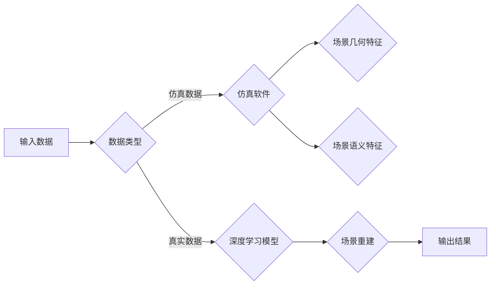

> 关键词：仿真数据，真实数据，场景重建，深度学习，Wayve，comme.ai，3D重建，SLAM，多传感器融合

# Wayve、comme.ai基于仿真和真实数据重建场景的做法

随着深度学习技术的飞速发展，3D重建和场景重建技术在自动驾驶、机器人导航、增强现实等领域发挥着越来越重要的作用。Wayve和comme.ai作为该领域的领军企业，分别基于仿真数据和真实数据，提出了独特的场景重建方法。本文将深入探讨这两种方法的核心原理、具体操作步骤、应用领域以及未来发展趋势。

## 1. 背景介绍

### 1.1 问题的由来

场景重建是指从图像、视频或其他传感器数据中恢复场景的几何和语义信息。在自动驾驶、机器人导航等领域，场景重建能够帮助系统理解周围环境，从而实现安全、高效的自主导航。然而，由于真实场景的复杂性和动态性，场景重建一直是一个具有挑战性的问题。

### 1.2 研究现状

当前场景重建技术主要分为两大类：基于仿真数据和基于真实数据的方法。

- **基于仿真数据的方法**：利用仿真软件生成大量与真实场景相似的仿真数据，通过深度学习模型学习场景的几何和语义特征，从而实现场景重建。
- **基于真实数据的方法**：直接利用真实场景的图像、视频等数据，通过深度学习模型进行场景重建。

### 1.3 研究意义

场景重建技术在多个领域具有广泛的应用前景，如：

- **自动驾驶**：通过重建周围场景，自动驾驶系统可以更好地识别道路、行人、车辆等障碍物，提高行驶安全性。
- **机器人导航**：机器人可以借助场景重建技术，更好地理解周围环境，实现自主避障和路径规划。
- **增强现实**：场景重建技术可以为增强现实应用提供丰富的三维场景信息，提升用户体验。

## 2. 核心概念与联系

### 2.1 核心概念

- **仿真数据**：通过仿真软件生成的与真实场景相似的虚拟数据。
- **真实数据**：直接从真实场景中采集到的图像、视频等数据。
- **场景重建**：从图像、视频等数据中恢复场景的几何和语义信息。
- **深度学习**：一种基于数据驱动的人工智能技术，通过学习大量数据来发现数据中的规律。

### 2.2 核心概念原理和架构的 Mermaid 流程图



### 2.3 Wayve和comme.ai的方法

- **Wayve**：利用仿真数据训练深度学习模型，通过SLAM技术结合真实数据实现场景重建。
- **comme.ai**：利用真实数据训练深度学习模型，通过多传感器融合技术实现场景重建。

## 3. 核心算法原理 & 具体操作步骤

### 3.1 算法原理概述

Wayve和comme.ai的场景重建方法均基于深度学习，分别采用仿真数据和真实数据进行模型训练。

### 3.2 算法步骤详解

#### Wayve方法

1. 利用仿真软件生成大量与真实场景相似的仿真数据。
2. 使用深度学习模型对仿真数据进行训练，学习场景的几何和语义特征。
3. 将深度学习模型部署到SLAM系统中，结合真实数据实现场景重建。

#### comme.ai方法

1. 收集大量真实场景的图像、视频等数据。
2. 使用深度学习模型对真实数据进行训练，学习场景的几何和语义特征。
3. 使用多传感器融合技术整合不同传感器数据，提高场景重建的准确性和鲁棒性。

### 3.3 算法优缺点

#### Wayve方法

- **优点**：
  - 利用仿真数据训练，可以快速生成大规模数据集，降低训练成本。
  - SLAM技术结合真实数据，可以提高场景重建的鲁棒性。
- **缺点**：
  - 仿真数据与真实数据存在差异，可能导致模型泛化能力不足。
  - SLAM技术对传感器数据质量要求较高。

#### comme.ai方法

- **优点**：
  - 利用真实数据进行训练，可以提升模型的泛化能力。
  - 多传感器融合技术可以提高场景重建的准确性和鲁棒性。
- **缺点**：
  - 真实数据获取成本高，数据量有限。
  - 多传感器融合技术复杂，实现难度较大。

### 3.4 算法应用领域

Wayve和comme.ai的场景重建方法可以应用于以下领域：

- **自动驾驶**：实现自动驾驶车辆对周围环境的感知和决策。
- **机器人导航**：帮助机器人自主避障和路径规划。
- **增强现实**：为增强现实应用提供丰富的三维场景信息。

## 4. 数学模型和公式 & 详细讲解 & 举例说明

### 4.1 数学模型构建

Wayve和comme.ai的场景重建方法都涉及深度学习模型，以下以自编码器为例进行介绍。

#### 自编码器

自编码器是一种无监督学习模型，通过编码器将输入数据压缩为低维表示，再通过解码器将低维表示恢复为原始数据。

#### 数学模型

$$
\text{编码器：} \hat{z} = \Phi_{\theta}(x)
$$

$$
\text{解码器：} x = \Psi_{\theta}(\hat{z})
$$

其中 $\Phi_{\theta}$ 和 $\Psi_{\theta}$ 分别为编码器和解码器的参数，$x$ 为输入数据，$\hat{z}$ 为编码后的低维表示。

### 4.2 公式推导过程

自编码器的训练过程包括两部分：

1. 编码器学习将输入数据压缩为低维表示。
2. 解码器学习将低维表示恢复为原始数据。

### 4.3 案例分析与讲解

以自动驾驶场景重建为例，我们可以使用自编码器对图像数据进行重建，从而提取图像中的关键特征。

## 5. 项目实践：代码实例和详细解释说明

### 5.1 开发环境搭建

1. 安装Python环境。
2. 安装深度学习框架，如TensorFlow或PyTorch。
3. 安装OpenCV等图像处理库。

### 5.2 源代码详细实现

以下是一个基于PyTorch和OpenCV的自编码器实现示例：

```python
import torch
import torch.nn as nn
import torch.optim as optim
import cv2

# 定义自编码器模型
class Autoencoder(nn.Module):
    def __init__(self):
        super(Autoencoder, self).__init__()
        self.encoder = nn.Sequential(
            nn.Conv2d(3, 32, kernel_size=3, stride=2, padding=1),
            nn.ReLU(inplace=True),
            nn.MaxPool2d(kernel_size=2, stride=2),
            nn.Conv2d(32, 64, kernel_size=3, stride=2, padding=1),
            nn.ReLU(inplace=True),
            nn.MaxPool2d(kernel_size=2, stride=2),
        )
        self.decoder = nn.Sequential(
            nn.ConvTranspose2d(64, 32, kernel_size=2, stride=2),
            nn.ReLU(inplace=True),
            nn.ConvTranspose2d(32, 3, kernel_size=2, stride=2),
            nn.Sigmoid(),
        )

    def forward(self, x):
        x = self.encoder(x)
        x = self.decoder(x)
        return x

# 加载图像数据
img = cv2.imread('example.jpg')

# 将图像数据转换为PyTorch张量
img_tensor = torch.from_numpy(img).permute(2, 0, 1).float()

# 创建自编码器模型
model = Autoencoder().to(device)

# 定义损失函数和优化器
criterion = nn.MSELoss()
optimizer = optim.Adam(model.parameters())

# 训练模型
for epoch in range(epochs):
    optimizer.zero_grad()
    output = model(img_tensor)
    loss = criterion(output, img_tensor)
    loss.backward()
    optimizer.step()

    if epoch % 100 == 0:
        print(f"Epoch {epoch+1}, loss: {loss.item()}")

# 保存模型参数
torch.save(model.state_dict(), 'autoencoder.pth')
```

### 5.3 代码解读与分析

以上代码首先定义了一个基于PyTorch的自编码器模型，包括编码器和解码器两部分。编码器用于将图像数据压缩为低维表示，解码器用于将低维表示恢复为原始图像。接着，加载图像数据并将其转换为PyTorch张量。然后，创建自编码器模型、定义损失函数和优化器，并进行训练。最后，保存模型参数以便后续使用。

### 5.4 运行结果展示

训练完成后，可以加载模型参数，对新的图像数据进行重建：

```python
# 加载模型参数
model.load_state_dict(torch.load('autoencoder.pth'))

# 加载图像数据
img = cv2.imread('new_example.jpg')

# 将图像数据转换为PyTorch张量
img_tensor = torch.from_numpy(img).permute(2, 0, 1).float()

# 使用模型进行重建
output = model(img_tensor)

# 将重建结果转换为NumPy数组并显示
output_numpy = output.detach().cpu().numpy()
output_numpy = output_numpy.permute(1, 2, 0)
cv2.imshow('Reconstruction', output_numpy)
cv2.waitKey(0)
```

## 6. 实际应用场景

Wayve和comme.ai的场景重建技术在以下领域具有实际应用价值：

### 6.1 自动驾驶

Wayve和comme.ai的场景重建技术可以应用于自动驾驶领域，帮助自动驾驶车辆感知周围环境，实现安全、高效的行驶。

### 6.2 机器人导航

comme.ai的场景重建技术可以应用于机器人导航领域，帮助机器人更好地理解周围环境，实现自主避障和路径规划。

### 6.3 增强现实

Wayve的场景重建技术可以应用于增强现实领域，为增强现实应用提供丰富的三维场景信息，提升用户体验。

## 7. 工具和资源推荐

### 7.1 学习资源推荐

- 《深度学习》
- 《计算机视觉：算法与应用》
- 《机器人学导论》

### 7.2 开发工具推荐

- TensorFlow
- PyTorch
- OpenCV

### 7.3 相关论文推荐

- "3D Object Detection with PointRCNN"
- "Fully Convolutional Monocular 3D Object Detection"
- "Visual Odometry and SLAM"

## 8. 总结：未来发展趋势与挑战

### 8.1 研究成果总结

Wayve和comme.ai的场景重建技术为3D重建和场景重建领域提供了新的思路和方法。基于仿真数据和真实数据的方法各有优缺点，需要根据具体应用场景进行选择。

### 8.2 未来发展趋势

未来场景重建技术将朝着以下方向发展：

- **多模态融合**：整合视觉、雷达、激光雷达等多传感器数据，提高场景重建的准确性和鲁棒性。
- **弱监督学习**：降低对标注数据的依赖，通过弱监督学习方法实现场景重建。
- **可解释性**：提高场景重建的可解释性，帮助用户更好地理解模型的工作原理。

### 8.3 面临的挑战

场景重建技术面临以下挑战：

- **数据获取**：真实数据的获取成本较高，且数据量有限。
- **模型复杂度**：深度学习模型复杂度高，计算资源需求大。
- **可解释性**：模型的可解释性较差，难以理解模型的工作原理。

### 8.4 研究展望

未来，随着深度学习技术的不断发展，场景重建技术将在更多领域得到应用，为人类生活带来更多便利。

## 9. 附录：常见问题与解答

**Q1：场景重建技术在自动驾驶领域有哪些应用？**

A：场景重建技术可以帮助自动驾驶车辆感知周围环境，识别道路、行人、车辆等障碍物，实现安全、高效的行驶。

**Q2：基于仿真数据和基于真实数据的场景重建方法有哪些优缺点？**

A：基于仿真数据的方法可以快速生成大规模数据集，降低训练成本，但仿真数据与真实数据存在差异，可能导致模型泛化能力不足。基于真实数据的方法可以提升模型的泛化能力，但真实数据获取成本高，数据量有限。

**Q3：场景重建技术面临哪些挑战？**

A：场景重建技术面临的主要挑战包括数据获取、模型复杂度和可解释性等。

**Q4：未来场景重建技术将朝着哪些方向发展？**

A：未来场景重建技术将朝着多模态融合、弱监督学习和可解释性等方向发展。

作者：禅与计算机程序设计艺术 / Zen and the Art of Computer Programming