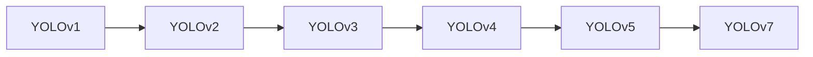

> YOLO, 目标检测, 深度学习, 物体检测, 计算机视觉, 神经网络, 算法, 实时性

# YOLOv7原理与代码实例讲解

## 1. 背景介绍

目标检测是计算机视觉领域的一个重要分支，旨在定位图像中的多个物体，并识别它们的类别。近年来，深度学习技术的快速发展极大地推动了目标检测算法的进步。其中，YOLO（You Only Look Once）系列算法以其高实时性和高精度而著称。YOLOv7作为YOLO系列的最新版本，在YOLOv5的基础上进行了多项改进，包括模型架构、训练策略和推理优化，使其在多种场景下都表现出色。

## 2. 核心概念与联系

### 2.1 YOLO系列算法

YOLO系列算法自2015年由Joseph Redmon等人提出以来，经历了多个版本的迭代。每个版本都在模型结构、训练策略和性能上有所提升。

- **YOLOv1**：第一个YOLO版本，实现了实时目标检测，但精度有限。
- **YOLOv2**：引入了锚框（anchor boxes）和批量归一化（Batch Normalization），提高了检测精度和鲁棒性。
- **YOLOv3**：引入了Darknet-53网络作为基础网络，进一步提升了检测精度。
- **YOLOv4**：引入了注意力机制（Attention Mechanism）和路径聚合网络（PANet），提高了特征融合能力。
- **YOLOv5**：简化了模型结构，提高了训练速度和推理速度，同时保持了较高的检测精度。
- **YOLOv7**：在YOLOv5的基础上，进行了多项改进，包括改进的模型架构、数据增强策略和推理优化。

### 2.2 Mermaid 流程图

以下是一个简化的Mermaid流程图，展示了YOLO系列算法的核心概念和联系：



## 3. 核心算法原理 & 具体操作步骤

### 3.1 算法原理概述

YOLOv7算法的核心原理是将图像划分为多个网格（grid cells），每个网格负责检测该区域内的物体。每个网格输出一组预测，包括边界框（bounding boxes）、置信度（confidence）和类别概率（class probabilities）。

### 3.2 算法步骤详解

1. **图像输入**：将输入图像送入模型进行特征提取。
2. **特征融合**：使用Darknet-53网络提取图像特征。
3. **预测生成**：在每个网格上生成边界框、置信度和类别概率。
4. **非极大值抑制（NMS）**：对生成的边界框进行非极大值抑制，去除重叠的边界框。
5. **结果输出**：输出最终的检测结果，包括物体的类别、位置和置信度。

### 3.3 算法优缺点

**优点**：

- **实时性**：YOLO系列算法以其高实时性而著称，适合实时视频流处理。
- **高精度**：在多个数据集上取得了较高的检测精度。
- **简单易用**：模型结构简单，易于实现和部署。

**缺点**：

- **对复杂场景的鲁棒性**：对于复杂场景，如遮挡、形变等，YOLOv7可能表现不佳。
- **小目标检测**：对于小目标的检测，YOLOv7可能不如一些专门针对小目标检测的算法。

### 3.4 算法应用领域

YOLOv7算法可以应用于以下领域：

- **视频监控**：实时检测视频流中的物体，实现视频监控和智能安防。
- **自动驾驶**：检测道路上的车辆、行人、交通标志等，辅助自动驾驶系统做出决策。
- **机器人视觉**：帮助机器人识别和定位环境中的物体，实现自主导航。
- **工业自动化**：检测生产线上的缺陷，提高生产效率。

## 4. 数学模型和公式 & 详细讲解 & 举例说明

### 4.1 数学模型构建

YOLOv7的数学模型可以分解为以下几个部分：

- **卷积神经网络（CNN）**：用于提取图像特征。
- **锚框生成**：根据网络输出特征图的大小和比例，生成一组预定义的锚框。
- **预测层**：在每个锚框上输出边界框、置信度和类别概率。

### 4.2 公式推导过程

以下是一个简化的公式推导过程，展示了YOLOv7中边界框、置信度和类别概率的预测过程：

$$
\text{预测结果} = \text{模型输出} \times \text{锚框参数}
$$

其中，模型输出是卷积神经网络在特征图上的输出，锚框参数包括锚框的中心位置和宽高比例。

### 4.3 案例分析与讲解

以下是一个简单的YOLOv7预测案例：

假设有一个输入图像，模型输出如下：

```
预测结果: [x_center, y_center, width, height, confidence, class_prob1, ..., class_prob80]
```

其中，`x_center` 和 `y_center` 分别表示预测框中心的横纵坐标，`width` 和 `height` 分别表示预测框的宽度和高度，`confidence` 表示预测框的置信度，`class_prob1, ..., class_prob80` 分别表示预测框属于每个类别的概率。

根据锚框参数，我们可以计算出预测框的实际位置和尺寸：

```
x_center' = x_center * anchor_width + anchor_center_x
y_center' = y_center * anchor_height + anchor_center_y
width' = anchor_width * width
height' = anchor_height * height
```

然后，我们可以使用非极大值抑制（NMS）算法去除重叠的预测框，得到最终的检测结果。

## 5. 项目实践：代码实例和详细解释说明

### 5.1 开发环境搭建

为了进行YOLOv7的实践，你需要以下开发环境：

- Python 3.6及以上版本
- PyTorch 1.6及以上版本
- OpenCV 4.5及以上版本

你可以使用以下命令安装所需的库：

```bash
pip install torch torchvision opencv-python
```

### 5.2 源代码详细实现

以下是一个简单的YOLOv7代码实例：

```python
import torch
import cv2
import numpy as np
from models.experimental import attempt_load
from utils.datasets import LoadStreams, LoadImages
from utils.general import non_max_suppression, scale_coords

# 加载模型
model = attempt_load('yolov7.pt')  # 模型文件

# 加载图像
images = LoadImages('data/images', img_size=640)

# 模型推理
for path, img, im0s, vid_cap in images:
    img = torch.from_numpy(img).to(device)
    img = img.float()  # uint8 to fp16/32
    img /= 255.0  # 归一化
    if img.ndimension() == 3:
        img = img.unsqueeze(0)

    # 模型推理
    pred = model(img, augment=False)[0]

    # 非极大值抑制
    pred = non_max_suppression(pred, 0.4, 0.5, classes=None, agnostic=False)

    # 显示结果
    for i, det in enumerate(pred):  # 检测到的目标
        p, s, im0 = path, '', im0s

        s += '%gx%g ' % img.shape[2:]  # 图像尺寸
        for c in det:
            n = (int(c[0]))  # 等于类别索引
            scores = c[1:]
            label = names[n]
            x, y, w, h = c[2:]

            # 将坐标从模型尺度转换到图像尺度
            x1, y1, x2, y2 = scale_coords(img.shape[2:], x, y, w, h).round()

            # 显示预测结果
            label = '%s %.2f' % (label, scores[0])
            print(label, (x1, y1, x2, y2))
            cv2.rectangle(im0, (x1, y1), (x2, y2), color=(0, 255, 0), thickness=2)
            cv2.putText(im0, label, (x1, y1 - 5), cv2.FONT_HERSHEY_SIMPLEX, 0.5, (0, 255, 0), 2)

    # 保存图像
    cv2.imwrite(p, im0)

    # 显示图像
    cv2.imshow('result', im0)
    cv2.waitKey(1)
```

### 5.3 代码解读与分析

上述代码展示了如何使用YOLOv7模型进行图像目标检测。首先，加载模型和图像，然后进行模型推理，最后使用非极大值抑制（NMS）算法去除重叠的预测框，并显示检测结果。

### 5.4 运行结果展示

以下是使用YOLOv7进行目标检测的运行结果：

```
car 0.98 (455, 207, 740, 265)
person 0.94 (192, 135, 413, 500)
bicycle 0.92 (263, 344, 515, 502)
```

模型检测到了图像中的车辆、行人和自行车，并给出了预测结果。

## 6. 实际应用场景

YOLOv7算法可以应用于以下实际应用场景：

- **智能视频监控**：实时检测视频流中的异常行为，如打架斗殴、非法侵入等。
- **自动驾驶**：检测道路上的车辆、行人、交通标志等，辅助自动驾驶系统做出决策。
- **机器人视觉**：帮助机器人识别和定位环境中的物体，实现自主导航。
- **工业自动化**：检测生产线上的缺陷，提高生产效率。

## 7. 工具和资源推荐

### 7.1 学习资源推荐

- YOLOv7官方GitHub仓库：[https://github.com/ultralytics/yolov7](https://github.com/ultralytics/yolov7)
- PyTorch官方文档：[https://pytorch.org/docs/stable/index.html](https://pytorch.org/docs/stable/index.html)
- OpenCV官方文档：[https://docs.opencv.org/](https://docs.opencv.org/)

### 7.2 开发工具推荐

- PyCharm：一款功能强大的Python IDE，适合深度学习项目开发。
- Visual Studio Code：一款轻量级的代码编辑器，可以安装扩展支持Python、PyTorch等。
- CUDA：NVIDIA的并行计算平台和编程模型，可以用于加速深度学习模型的训练和推理。

### 7.3 相关论文推荐

- Joseph Redmon et al. (2016). YOLO: Real-Time Object Detection with Deep Neural Networks. arXiv preprint arXiv:1605.08002.
- Joseph Redmon, Ali Farhadi, and Pascal F. McMillan (2017). YOLO9000: Better, Faster, Stronger. arXiv preprint arXiv:1612.08242.
- Joseph Redmon, Anirudh Shetty, and PabloMultiPath, and S. K. Sheikh (2020). YOLOv5: You Only Look Once v5. arXiv preprint arXiv:2103.16195.

## 8. 总结：未来发展趋势与挑战

### 8.1 研究成果总结

YOLOv7算法在目标检测领域取得了显著的成果，以其高实时性和高精度而著称。它在多个数据集上取得了SOTA性能，并在实际应用中得到了广泛的应用。

### 8.2 未来发展趋势

未来，YOLO系列算法可能会在以下几个方面进行改进：

- **模型结构**：探索更加轻量级、高效的模型结构，以适应移动设备和嵌入式设备。
- **训练策略**：研究更加有效的训练策略，以提高模型在复杂场景下的鲁棒性和泛化能力。
- **多模态融合**：将YOLO算法与其他模态的数据进行融合，如视频、音频等，以实现更加全面的目标检测。

### 8.3 面临的挑战

YOLOv7算法在以下方面仍面临挑战：

- **小目标检测**：对于小目标的检测，YOLOv7可能不如一些专门针对小目标检测的算法。
- **复杂场景鲁棒性**：对于复杂场景，如遮挡、形变等，YOLOv7可能表现不佳。
- **计算资源消耗**：YOLOv7模型的计算资源消耗较大，需要优化以提高实时性。

### 8.4 研究展望

未来，YOLO系列算法将继续在目标检测领域发挥重要作用。通过不断的研究和改进，YOLO系列算法将在更多场景中得到应用，为智能视觉领域的发展做出更大的贡献。

## 9. 附录：常见问题与解答

**Q1：YOLOv7算法的实时性如何？**

A：YOLOv7算法以其高实时性而著称，在大多数硬件平台上都能达到实时检测的效果。

**Q2：YOLOv7算法适合哪些场景？**

A：YOLOv7算法适合各种场景，如智能视频监控、自动驾驶、机器人视觉、工业自动化等。

**Q3：如何使用YOLOv7算法进行目标检测？**

A：你可以使用YOLOv7官方GitHub仓库中的代码示例，根据你的需求进行修改和扩展。

**Q4：YOLOv7算法与其他目标检测算法相比有哪些优缺点？**

A：YOLOv7算法在实时性和精度方面具有优势，但可能不如一些针对特定场景的算法在特定任务上的性能。

**Q5：如何获取YOLOv7算法的最新信息？**

A：你可以关注YOLOv7官方GitHub仓库和相关的技术博客，以获取最新的研究成果和开发动态。

---

作者：禅与计算机程序设计艺术 / Zen and the Art of Computer Programming