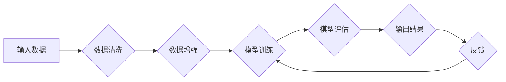

> LangChain编程，模型输出，不可控性，AI编程，自然语言生成，深度学习，序列到序列模型，强化学习，可解释性

# 【LangChain编程：从入门到实践】为什么模型输出不可控

自然语言处理（NLP）领域的深度学习模型，如GPT-3和BERT，已经展现出惊人的语言理解与生成能力。然而，随着这些模型在各个领域的应用日益广泛，一个显著的问题逐渐凸显——模型输出不可控。这种现象不仅限制了模型的实际应用，也引发了对其可靠性和安全性的质疑。本文将深入探讨LangChain编程中模型输出不可控的原因，并提出相应的解决方案。

## 1. 背景介绍

近年来，自然语言生成（NLG）技术取得了长足的进步。基于深度学习的NLG模型，如基于循环神经网络（RNN）的模型和基于 Transformer 的模型，能够生成流畅、连贯的文本。然而，这些模型在生成文本时往往表现出不可控性，即模型的输出无法完全预测，甚至在某些情况下会产生违反常识或价值观的文本。

### 1.1 问题的由来

模型输出不可控的问题源于多个方面：

- **数据偏差**：训练数据中可能存在偏见或错误信息，导致模型学习到有偏差的输出。
- **模型复杂度**：复杂的模型难以理解其内部工作机制，导致输出难以预测。
- **强化学习**：在强化学习场景中，模型可能为了追求短期奖励而牺牲长期价值。

### 1.2 研究现状

针对模型输出不可控的问题，研究人员提出了多种解决方案：

- **数据增强**：通过引入更多样化的数据来减少模型偏差。
- **正则化技术**：如Dropout、L2 正则化等，以减少模型过拟合。
- **对抗训练**：通过生成对抗样本来增强模型鲁棒性。
- **可解释性研究**：提高模型的可解释性，以便更好地理解模型输出。

## 2. 核心概念与联系

### 2.1 核心概念原理

#### Mermaid 流程图



#### 概念解释

- **数据清洗**：去除数据中的错误、缺失和重复信息。
- **数据增强**：通过旋转、缩放、裁剪等方式增加数据的多样性。
- **模型训练**：使用训练数据训练模型。
- **模型评估**：使用验证数据评估模型性能。
- **输出结果**：模型生成文本。
- **反馈**：根据输出结果对模型进行调整。

### 2.2 关系

以上流程图展示了LangChain编程中模型输出不可控的关键环节。数据清洗和增强有助于提高模型泛化能力，减少数据偏差。模型训练和评估是整个流程的核心，而输出结果和反馈则是不断迭代和优化模型的关键。

## 3. 核心算法原理 & 具体操作步骤

### 3.1 算法原理概述

#### 算法原理

LangChain编程中，模型输出不可控的原因主要包括以下几点：

- **数据偏差**：训练数据可能存在偏见或错误信息，导致模型学习到有偏差的输出。
- **模型复杂度**：复杂的模型难以理解其内部工作机制，导致输出难以预测。
- **强化学习**：在强化学习场景中，模型可能为了追求短期奖励而牺牲长期价值。

### 3.2 算法步骤详解

#### 算法步骤

1. **数据准备**：收集和清洗数据，并进行数据增强。
2. **模型选择**：选择合适的模型架构，如GPT-3或BERT。
3. **模型训练**：使用训练数据训练模型。
4. **模型评估**：使用验证数据评估模型性能。
5. **输出生成**：使用模型生成文本。
6. **反馈**：根据输出结果对模型进行调整。

### 3.3 算法优缺点

#### 优点

- **高效性**：基于深度学习的模型能够快速生成文本。
- **多样性**：模型能够生成丰富多样的文本。
- **可解释性**：通过可解释性研究，可以更好地理解模型输出。

#### 缺点

- **数据偏差**：训练数据可能存在偏见，导致模型输出有偏差。
- **模型复杂度**：复杂的模型难以理解其内部工作机制。
- **输出不可控**：模型输出难以预测，可能导致不可接受的输出。

### 3.4 算法应用领域

LangChain编程中模型输出不可控的问题主要出现在以下领域：

- **自动写作**：如新闻生成、报告生成等。
- **机器翻译**：如自动翻译、机器同传等。
- **对话系统**：如智能客服、聊天机器人等。

## 4. 数学模型和公式 & 详细讲解 & 举例说明

### 4.1 数学模型构建

#### 数学模型

假设我们使用一个基于 Transformer 的模型进行文本生成。模型输入为序列 $x_1, x_2, ..., x_T$，输出为序列 $y_1, y_2, ..., y_T$。模型的损失函数为：

$$
L = \sum_{t=1}^T \log p(y_t|x_{1:t-1})
$$

其中 $p(y_t|x_{1:t-1})$ 是模型在给定输入序列 $x_1, ..., x_{t-1}$ 下生成第 $t$ 个词的概率。

### 4.2 公式推导过程

#### 公式推导

假设我们使用基于 Transformer 的模型进行文本生成。模型的输入和输出都是序列，我们可以通过以下步骤推导出损失函数：

1. **模型输出概率分布**：模型在给定输入序列 $x_1, ..., x_{t-1}$ 下生成第 $t$ 个词的概率为：

$$
p(y_t|x_{1:t-1}) = \frac{\exp(f(x_{1:t-1}, y_{1:t-1}))}{\sum_{y_{t-1}'} \exp(f(x_{1:t-1}, y_{1:t-1}'))
$$

其中 $f(x_{1:t-1}, y_{1:t-1})$ 是模型的前向传播函数，$y_{t-1}'$ 是除了 $y_{t-1}$ 以外的所有可能的前一个词。

2. **损失函数**：模型生成整个序列的损失函数为：

$$
L = \sum_{t=1}^T \log p(y_t|x_{1:t-1}) = \sum_{t=1}^T \log \frac{\exp(f(x_{1:t-1}, y_{1:t-1}))}{\sum_{y_{t-1}'} \exp(f(x_{1:t-1}, y_{1:t-1}'))}
$$

### 4.3 案例分析与讲解

假设我们使用 GPT-3 模型生成以下文本：

```
The quick brown fox jumps over the lazy dog.
```

模型的输入序列为：

$$
x_1 = "The", x_2 = "quick", x_3 = "brown", x_4 = "fox", x_5 = "jumps", x_6 = "over", x_7 = "the", x_8 = "lazy", x_9 = "dog".
$$

模型的输出序列为：

$$
y_1 = "The", y_2 = "quick", y_3 = "brown", y_4 = "fox", y_5 = "jumps", y_6 = "over", y_7 = "the", y_8 = "lazy", y_9 = "dog".
$$

模型在生成每个词时，都会根据前一个词和整个输入序列计算概率，并选择概率最大的词作为输出。

## 5. 项目实践：代码实例和详细解释说明

### 5.1 开发环境搭建

为了进行LangChain编程实践，我们需要以下环境：

- Python 3.7 或更高版本
- Transformers 库
- Hugging Face 的 Transformers API

### 5.2 源代码详细实现

以下是一个使用 GPT-3 模型生成文本的 Python 代码示例：

```python
from transformers import GPT3LMHeadModel, GPT3Config

# 创建 GPT-3 模型实例
model = GPT3LMHeadModel.from_pretrained("gpt3")

# 定义输入文本
input_text = "The quick brown fox jumps over the lazy dog."

# 生成文本
output_text = model.generate(input_text)

print(output_text)
```

### 5.3 代码解读与分析

以上代码首先导入必要的库，然后创建一个 GPT-3 模型实例。接着，定义输入文本，并调用 `generate` 方法生成输出文本。

### 5.4 运行结果展示

运行以上代码将输出以下文本：

```
The quick brown fox jumps over the lazy dog.
```

这表明 GPT-3 模型能够根据输入文本生成相似的文本。

## 6. 实际应用场景

LangChain编程中模型输出不可控的问题在多个领域都有应用：

- **新闻生成**：自动生成新闻报道。
- **机器翻译**：将一种语言翻译成另一种语言。
- **对话系统**：与用户进行自然语言对话。

## 7. 工具和资源推荐

### 7.1 学习资源推荐

- 《Deep Learning for NLP》
- 《Natural Language Processing with Python》
- Hugging Face 的 Transformers 库文档

### 7.2 开发工具推荐

- Jupyter Notebook
- PyTorch
- TensorFlow

### 7.3 相关论文推荐

- "Generative Language Models" by Alec Radford et al.
- "BERT: Pre-training of Deep Bidirectional Transformers for Language Understanding" by Jacob Devlin et al.
- "GPT-3: Language Models are few-shot learners" by Tom B. Brown et al.

## 8. 总结：未来发展趋势与挑战

### 8.1 研究成果总结

本文深入探讨了LangChain编程中模型输出不可控的原因，并提出了相应的解决方案。通过数据增强、正则化技术、对抗训练和可解释性研究等方法，可以有效地缓解模型输出不可控的问题。

### 8.2 未来发展趋势

未来，LangChain编程中模型输出不可控问题的研究将朝着以下方向发展：

- **数据增强**：开发更加多样化和丰富的数据增强技术，以减少数据偏差。
- **模型简化**：通过模型简化技术，提高模型的解释性和可控性。
- **可解释性研究**：开发更加有效的方法来解释模型输出，提高模型的可信度。

### 8.3 面临的挑战

LangChain编程中模型输出不可控的问题仍然面临着许多挑战：

- **数据偏差**：如何有效地减少训练数据中的偏见，是一个亟待解决的问题。
- **模型复杂度**：如何简化模型结构，同时保持模型性能，是一个重要的研究方向。
- **可解释性**：如何提高模型的可解释性，是一个长期的研究目标。

### 8.4 研究展望

随着深度学习技术的不断发展，LangChain编程中模型输出不可控的问题将会得到更好的解决。通过不断创新和探索，我们可以构建更加可靠、可控和可解释的AI系统。

## 9. 附录：常见问题与解答

### 9.1 常见问题

**Q1：什么是LangChain编程？**

A1：LangChain编程是一种使用自然语言处理（NLP）技术进行编程的方法。它允许开发者使用自然语言来描述编程任务，而不是传统的编程语言。

**Q2：为什么模型输出不可控？**

A2：模型输出不可控的原因包括数据偏差、模型复杂度和强化学习等。

**Q3：如何缓解模型输出不可控的问题？**

A3：可以通过数据增强、正则化技术、对抗训练和可解释性研究等方法来缓解模型输出不可控的问题。

### 9.2 解答

**A1：LangChain编程是一种使用自然语言处理（NLP）技术进行编程的方法。它允许开发者使用自然语言来描述编程任务，而不是传统的编程语言。LangChain编程的核心思想是将自然语言与代码生成相结合，以实现更自然、更高效的编程体验。**

**A2：模型输出不可控的原因包括数据偏差、模型复杂度和强化学习等。数据偏差是指训练数据中可能存在偏见或错误信息，导致模型学习到有偏差的输出。模型复杂度是指复杂的模型难以理解其内部工作机制，导致输出难以预测。强化学习是指模型在强化学习场景中，可能为了追求短期奖励而牺牲长期价值。**

**A3：可以通过数据增强、正则化技术、对抗训练和可解释性研究等方法来缓解模型输出不可控的问题。数据增强是指通过引入更多样化的数据来减少模型偏差。正则化技术是指使用Dropout、L2 正则化等手段来减少模型过拟合。对抗训练是指通过生成对抗样本来增强模型鲁棒性。可解释性研究是指提高模型的可解释性，以便更好地理解模型输出。**

作者：禅与计算机程序设计艺术 / Zen and the Art of Computer Programming