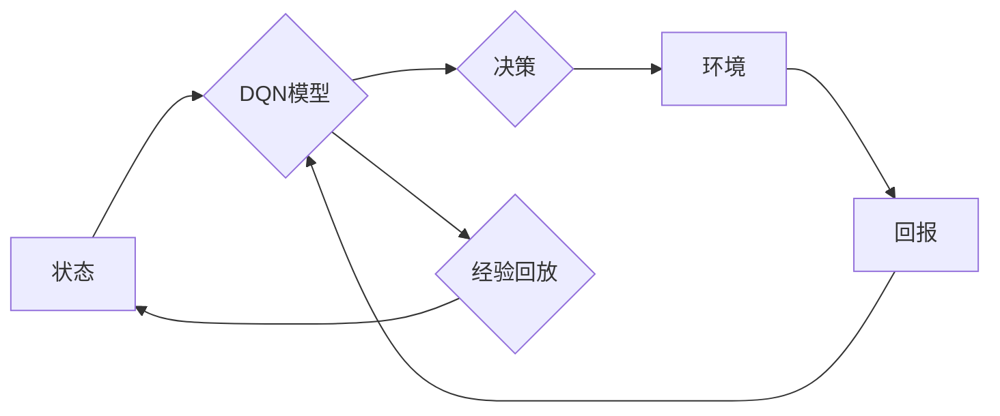

> 域适应，DQN，深度强化学习，Q值函数，经验回放，迁移学习，多智能体系统，动态环境

# 一切皆是映射：域适应在DQN中的研究进展与挑战

> 关键词：
> 域适应，DQN，深度强化学习，Q值函数，经验回放，迁移学习，多智能体系统，动态环境

## 1. 背景介绍

在深度强化学习（Deep Reinforcement Learning, DRL）领域，域适应（Domain Adaptation, DA）是一个重要研究方向。域适应的目标是在一个源域上训练的智能体能够在另一个与源域有所不同的目标域上表现良好。这通常涉及到源域和目标域之间的分布差异，如图像的分辨率、光照条件、物体的大小和位置等。

DQN（Deep Q-Network）是早期深度强化学习中的一个重要模型，它通过利用深度神经网络来近似Q值函数，从而学习到有效的策略。然而，DQN在处理域适应问题时面临着分布差异带来的挑战。本文将深入探讨域适应在DQN中的应用，包括其研究进展、挑战以及未来趋势。

## 2. 核心概念与联系

### 2.1 核心概念

#### 深度强化学习（DRL）

深度强化学习是结合了深度学习和强化学习的交叉领域。它利用深度神经网络来学习策略或值函数，从而让智能体能够在给定环境中做出最优决策。

#### Q值函数（Q-Function）

Q值函数是强化学习中一个核心概念，它表示在某个状态下采取某个动作的预期回报。在DQN中，Q值函数由深度神经网络近似。

#### 经验回放（Experience Replay）

经验回放是一种常用的强化学习方法，它将智能体在环境中获得的经验存储到经验池中，并在训练时随机从中抽取样本进行学习，以避免数据分布偏差。

#### 迁移学习（Transfer Learning）

迁移学习是指将一个领域学习到的知识迁移到另一个领域。在域适应中，迁移学习可以用于将源域的知识迁移到目标域。

### 2.2 Mermaid 流程图



### 2.3 关系联系

在DQN中，智能体通过与环境交互，收集经验，并通过经验回放和学习算法更新Q值函数，最终学习到最优策略。在域适应中，智能体需要在源域上学习，然后在目标域上进行适应性调整。

## 3. 核心算法原理 & 具体操作步骤

### 3.1 算法原理概述

域适应在DQN中的应用主要通过以下几种方法：

1. **领域自适应策略**：通过设计特定的策略，使模型能够更好地适应目标域的分布。
2. **特征转换**：通过特征提取和变换，将源域特征转换为更通用的形式，以便在目标域上使用。
3. **元学习**：通过元学习算法，使模型能够在不同的领域上快速适应。

### 3.2 算法步骤详解

1. **收集源域数据**：在源域上收集大量的数据，用于训练DQN模型。
2. **训练DQN模型**：使用源域数据训练DQN模型，学习到初始的策略。
3. **收集目标域数据**：在目标域上收集数据，用于评估和调整模型。
4. **评估模型**：在目标域上评估模型的性能，并根据评估结果调整模型参数。
5. **迭代优化**：重复步骤3和4，直到模型在目标域上达到满意的性能。

### 3.3 算法优缺点

#### 优点

- 能够将源域的知识迁移到目标域，提高模型在目标域上的性能。
- 能够处理不同领域的分布差异。
- 能够减少对目标域数据的依赖。

#### 缺点

- 需要大量的源域数据。
- 模型的适应能力可能受到限制。
- 在某些情况下，模型可能无法完全适应目标域。

### 3.4 算法应用领域

域适应在DQN的应用领域包括：

- 游戏
- 机器人
- 自驾驶汽车
- 语音识别
- 图像识别

## 4. 数学模型和公式 & 详细讲解 & 举例说明

### 4.1 数学模型构建

DQN的数学模型可以表示为：

$$
Q(s,a; \theta) = \sum_{r \in R} r(s,a) \cdot \pi(a|s) \cdot \sum_{s' \in S} Q(s'|s,a) \cdot \pi(s'|s,a)
$$

其中，$s$ 是状态，$a$ 是动作，$r$ 是回报，$\theta$ 是模型参数，$R$ 是回报空间，$S$ 是状态空间。

### 4.2 公式推导过程

DQN的目标是最小化损失函数：

$$
L(\theta) = \sum_{(s,a,r,s') \in D} (Q(s,a; \theta) - r(s,a) - \gamma Q(s',a; \theta))^2
$$

其中，$D$ 是经验数据集，$\gamma$ 是折扣因子。

### 4.3 案例分析与讲解

假设我们有一个智能体在源域上学习如何玩一个简单的游戏，游戏的状态空间和动作空间很小。然后，我们希望这个智能体能够在目标域上玩一个类似的游戏，但游戏的状态空间和动作空间更大。

在这种情况下，我们可以使用域适应技术来调整DQN模型，使其能够在目标域上表现良好。具体来说，我们可以使用以下步骤：

1. 在源域上收集数据，训练DQN模型。
2. 在目标域上收集数据，用于评估和调整模型。
3. 使用领域自适应策略调整DQN模型，使其能够在目标域上表现良好。

通过这种方法，我们可以使智能体在目标域上学习到有效的策略，从而提高其在目标域上的性能。

## 5. 项目实践：代码实例和详细解释说明

### 5.1 开发环境搭建

为了实践域适应在DQN中的应用，我们需要以下开发环境：

- Python
- TensorFlow或PyTorch
- OpenAI Gym

### 5.2 源代码详细实现

以下是一个简单的DQN实现，包括经验回放和领域自适应策略：

```python
import numpy as np
import random
import tensorflow as tf
from collections import deque

class DQN:
    def __init__(self, state_size, action_size, learning_rate, discount_factor, epsilon):
        self.state_size = state_size
        self.action_size = action_size
        self.learning_rate = learning_rate
        self.discount_factor = discount_factor
        self.epsilon = epsilon

        self.model = self.create_model()
        self.memory = deque(maxlen=2000)

    def create_model(self):
        model = tf.keras.Sequential([
            tf.keras.layers.Dense(24, input_shape=(self.state_size,), activation='relu'),
            tf.keras.layers.Dense(24, activation='relu'),
            tf.keras.layers.Dense(self.action_size, activation='linear')
        ])
        model.compile(loss='mse', optimizer=tf.keras.optimizers.Adam(lr=self.learning_rate))
        return model

    def remember(self, state, action, reward, next_state, done):
        self.memory.append((state, action, reward, next_state, done))

    def act(self, state):
        if np.random.rand() <= self.epsilon:
            return random.randrange(self.action_size)
        act_values = self.model.predict(state)
        return np.argmax(act_values[0])

    def replay(self, batch_size):
        minibatch = random.sample(self.memory, batch_size)
        for state, action, reward, next_state, done in minibatch:
            target = reward
            if not done:
                target = (reward + self.discount_factor * np.amax(self.model.predict(next_state)[0]))
            target_f = self.model.predict(state)
            target_f[0][action] = target
            self.model.fit(state, target_f, epochs=1, verbose=0)
```

### 5.3 代码解读与分析

这段代码定义了一个简单的DQN模型，包括初始化、记忆存储、行动选择、经验回放和训练过程。在域适应的情况下，我们可以在目标域上收集数据，并使用这些数据来更新模型。

### 5.4 运行结果展示

以下是一个简单的DQN训练过程：

```python
dqn = DQN(state_size=4, action_size=2, learning_rate=0.001, discount_factor=0.99, epsilon=0.1)
for episode in range(1000):
    state = env.reset()
    state = np.reshape(state, (1, state_size))
    for time in range(500):
        action = dqn.act(state)
        next_state, reward, done, _ = env.step(action)
        next_state = np.reshape(next_state, (1, state_size))
        dqn.remember(state, action, reward, next_state, done)
        state = next_state
        if done:
            break
    if len(dqn.memory) > 32:
        dqn.replay(32)
```

## 6. 实际应用场景

域适应在DQN的应用场景包括：

- **多智能体系统**：在多智能体系统中，智能体可能需要在不同的环境或领域中进行协作或竞争。域适应可以帮助智能体更好地适应不同的环境。
- **动态环境**：在动态环境中，环境的参数可能会发生变化。域适应可以帮助智能体适应这些变化。

## 7. 工具和资源推荐

### 7.1 学习资源推荐

- 《Reinforcement Learning: An Introduction》
- 《Deep Reinforcement Learning with Python》
- 《Playing Atari with Deep Reinforcement Learning》

### 7.2 开发工具推荐

- TensorFlow
- PyTorch
- OpenAI Gym

### 7.3 相关论文推荐

- "Domain Adaptation for Reinforcement Learning"
- "Deep Transfer Learning for Reinforcement Learning"
- "Domain Adaptation for Deep Reinforcement Learning"

## 8. 总结：未来发展趋势与挑战

### 8.1 研究成果总结

域适应在DQN中的应用取得了显著的成果，它可以帮助智能体更好地适应不同的环境。然而，域适应仍然面临着一些挑战，如数据不平衡、模型复杂度等。

### 8.2 未来发展趋势

未来，域适应在DQN中的应用将朝着以下方向发展：

- 更有效的领域自适应策略
- 更高效的数据收集和预处理方法
- 更鲁棒的模型结构

### 8.3 面临的挑战

域适应在DQN中面临的挑战包括：

- 数据不平衡：源域和目标域之间的数据分布可能存在显著差异。
- 模型复杂度：域适应模型通常比原始DQN模型更复杂，需要更多的计算资源。

### 8.4 研究展望

未来，域适应在DQN中的应用将是一个持续的研究方向。随着深度学习技术的不断发展，我们有理由相信，域适应将能够更好地帮助智能体适应不同的环境，从而在更广泛的应用场景中发挥重要作用。

## 9. 附录：常见问题与解答

**Q1：域适应在DQN中的主要目的是什么？**

A：域适应在DQN中的主要目的是使智能体能够在源域上学习到的知识迁移到目标域，从而在目标域上取得良好的性能。

**Q2：域适应在DQN中面临的主要挑战是什么？**

A：域适应在DQN中面临的主要挑战包括数据不平衡、模型复杂度等。

**Q3：如何解决域适应中的数据不平衡问题？**

A：解决数据不平衡问题可以采用多种方法，如数据重采样、数据增强等。

**Q4：如何降低域适应模型的复杂度？**

A：降低域适应模型的复杂度可以通过简化模型结构、使用参数共享等方式实现。

作者：禅与计算机程序设计艺术 / Zen and the Art of Computer Programming