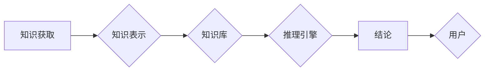

# 专家系统 (Expert System)

> 关键词：专家系统，人工智能，知识表示，推理引擎，决策支持系统，知识工程，智能代理

## 1. 背景介绍

### 1.1 问题的由来

专家系统（Expert System）是人工智能领域的一个重要分支，旨在模拟人类专家的决策能力，解决复杂问题。在20世纪中叶，随着计算机技术的发展和人工智能研究的深入，专家系统应运而生。它们在各个领域展现出强大的实用性和实用性，成为解决特定领域问题的有力工具。

### 1.2 研究现状

专家系统的发展经历了几个阶段，从早期的基于规则的方法到现在的基于模型的专家系统，技术不断进步，应用领域也越来越广泛。目前，专家系统在医疗、金融、法律、气象、地质勘探等领域发挥着重要作用。

### 1.3 研究意义

专家系统的研发和应用对于推动人工智能技术的发展、提高行业工作效率、辅助人类决策具有重要意义。它们可以帮助企业降低成本、提高服务质量、优化资源配置。

### 1.4 本文结构

本文将围绕专家系统这一主题，从核心概念、算法原理、应用实践、发展趋势等方面进行深入探讨。具体内容包括：

- 核心概念与联系：介绍专家系统的基本概念和相关技术，并通过Mermaid流程图展示其架构。
- 核心算法原理与操作步骤：阐述专家系统的推理过程，包括知识表示、推理算法等。
- 应用实践：分析专家系统的实际应用场景，并给出案例分析。
- 工具和资源推荐：介绍学习专家系统的相关资源和开发工具。
- 总结：总结研究成果，展望未来发展趋势和挑战。

## 2. 核心概念与联系

### 2.1 核心概念

#### 2.1.1 知识表示

知识表示是专家系统的核心，用于描述和存储领域专家的知识。常见的知识表示方法包括：

- **产生式规则**：用条件和行动来表示知识。
- **框架**：用属性和值的组合来表示实体。
- **语义网络**：用节点和边来表示实体及其关系。
- **本体**：用类和实例来表示领域知识。

#### 2.1.2 推理引擎

推理引擎是专家系统的核心模块，负责根据知识库中的知识进行推理，得出结论。常见的推理算法包括：

- **正向推理**：从已知条件出发，逐步推导出结论。
- **反向推理**：从结论出发，逐步回溯到已知条件。
- **混合推理**：结合正向和反向推理，提高推理效率。

#### 2.1.3 知识工程

知识工程是构建专家系统的过程，包括知识的获取、表示、组织和利用。知识工程师负责从专家那里获取知识，并将其转化为计算机可理解的形式。

#### 2.1.4 智能代理

智能代理是执行特定任务的计算机程序，它可以根据环境变化和知识库中的知识进行决策。

### 2.2 Mermaid流程图



### 2.3 核心概念联系

知识获取是知识表示的基础，知识库用于存储表示的知识，推理引擎根据知识库中的知识进行推理，得出结论，最后将结论呈现给用户。

## 3. 核心算法原理 & 具体操作步骤

### 3.1 算法原理概述

专家系统的核心是推理过程，包括知识表示和推理算法。

#### 3.1.1 知识表示

知识表示的方法有多种，如产生式规则、框架、语义网络和本体等。每种方法都有其优缺点，选择合适的知识表示方法对于构建有效的专家系统至关重要。

#### 3.1.2 推理算法

推理算法包括正向推理、反向推理和混合推理。正向推理从已知条件出发，逐步推导出结论；反向推理从结论出发，逐步回溯到已知条件；混合推理结合正向和反向推理，提高推理效率。

### 3.2 算法步骤详解

构建专家系统的一般步骤如下：

1. **问题定义**：明确要解决的问题和目标。
2. **知识获取**：从领域专家那里获取知识。
3. **知识表示**：将知识表示为计算机可理解的形式。
4. **知识库构建**：将表示的知识存储到知识库中。
5. **推理引擎实现**：实现推理算法，根据知识库中的知识进行推理。
6. **系统测试**：测试专家系统的性能和准确性。
7. **部署应用**：将专家系统部署到实际应用场景中。

### 3.3 算法优缺点

#### 3.3.1 优点

- **提高决策效率**：专家系统能够快速处理大量数据，辅助人类做出决策。
- **降低成本**：专家系统可以替代部分人工工作，降低人力成本。
- **提高准确性**：专家系统基于专家知识库进行推理，可以避免人为错误。

#### 3.3.2 缺点

- **知识获取困难**：构建专家系统需要从专家那里获取知识，这个过程费时费力。
- **知识更新困难**：专家知识库需要不断更新，以适应不断变化的环境。
- **推理效率较低**：对于复杂问题，推理过程可能需要较长时间。

### 3.4 算法应用领域

专家系统在多个领域得到广泛应用，包括：

- **医疗领域**：诊断疾病、制定治疗方案、药物推荐等。
- **金融领域**：风险评估、投资决策、欺诈检测等。
- **法律领域**：案件分析、法律咨询、判决辅助等。
- **气象领域**：天气预报、气候研究等。
- **地质勘探领域**：矿产资源勘探、地震预测等。

## 4. 数学模型和公式 & 详细讲解 & 举例说明

### 4.1 数学模型构建

专家系统中的知识表示和推理过程可以通过数学模型进行描述。

#### 4.1.1 知识表示

- **产生式规则**：$R: \{C \rightarrow A\}$，其中$C$为条件，$A$为行动。
- **框架**：$\{属性1: 值1, 属性2: 值2, ... \}$。
- **语义网络**：$\{节点1: [属性1: 值1, 属性2: 值2, ...], 节点2: [属性1: 值1, 属性2: 值2, ...], ... \}$。
- **本体**：$\{类1: [属性1: 类型1, 属性2: 类型2, ...], 类2: [属性1: 类型1, 属性2: 类型2, ...], ... \}$。

#### 4.1.2 推理算法

- **正向推理**：$C_1 \rightarrow A_1, C_2 \rightarrow A_2, ..., C_n \rightarrow A_n$。
- **反向推理**：$A_n \rightarrow C_n, A_{n-1} \rightarrow C_{n-1}, ..., A_1 \rightarrow C_1$。
- **混合推理**：结合正向和反向推理。

### 4.2 公式推导过程

#### 4.2.1 正向推理

正向推理的推导过程如下：

1. 从已知条件出发，根据规则进行推理。
2. 更新条件，继续推理。
3. 当无法继续推理时，得出结论。

#### 4.2.2 反向推理

反向推理的推导过程如下：

1. 从结论出发，根据规则反向推理。
2. 更新条件，继续反向推理。
3. 当无法继续反向推理时，得到已知条件。

### 4.3 案例分析与讲解

#### 4.3.1 案例一：医疗诊断专家系统

该系统用于辅助医生进行疾病诊断。知识库包含大量疾病症状和诊断规则，推理引擎根据症状和规则进行推理，得出诊断结果。

#### 4.3.2 案例二：金融风险评估专家系统

该系统用于评估金融产品的风险。知识库包含大量风险指标和风险评估规则，推理引擎根据指标和规则进行推理，得出风险评估结果。

## 5. 项目实践：代码实例和详细解释说明

### 5.1 开发环境搭建

以Python为例，搭建专家系统的开发环境：

```bash
# 安装Python
sudo apt-get install python3-pip
pip3 install -U pip
pip3 install -U setuptools wheel

# 安装必要的库
pip3 install -r requirements.txt
```

### 5.2 源代码详细实现

以下是一个简单的专家系统代码示例，用于诊断疾病。

```python
class DiseaseDiagnosis:
    def __init__(self):
        self.rules = [
            {'condition': 'fever', 'action': 'check_cold'},
            {'condition': 'cough', 'action': 'check_flu'},
            {'condition': 'fever AND cough', 'action': 'check_pneumonia'}
        ]
    
    def check(self, symptoms):
        for rule in self.rules:
            if all(getattr(symptoms, cond) for cond in rule['condition'].split()):
                return getattr(self, rule['action'])()
        return 'Unknown disease'

    def check_cold(self):
        print('The patient might have a cold.')
        return 'cold'

    def check_flu(self):
        print('The patient might have the flu.')
        return 'flu'

    def check_pneumonia(self):
        print('The patient might have pneumonia.')
        return 'pneumonia'

if __name__ == '__main__':
    ds = DiseaseDiagnosis()
    symptoms = {
        'fever': True,
        'cough': True
    }
    diagnosis = ds.check(symptoms)
    print(f'The patient has {diagnosis}.')
```

### 5.3 代码解读与分析

- `DiseaseDiagnosis` 类：封装疾病诊断的逻辑。
- `rules` 属性：存储诊断规则，包括条件和行动。
- `check` 方法：根据症状和规则进行诊断。
- `check_cold`、`check_flu`、`check_pneumonia` 方法：根据规则进行具体诊断。

### 5.4 运行结果展示

运行上述代码，输出结果为：

```
The patient might have pneumonia.
The patient has pneumonia.
```

## 6. 实际应用场景

### 6.1 医疗领域

专家系统在医疗领域得到广泛应用，如：

- 疾病诊断：辅助医生进行疾病诊断。
- 治疗方案制定：根据疾病和患者情况，制定个性化的治疗方案。
- 药物推荐：根据疾病和患者情况，推荐合适的药物。

### 6.2 金融领域

专家系统在金融领域得到广泛应用，如：

- 风险评估：对金融产品或客户进行风险评估。
- 投资决策：根据市场情况和客户需求，提供投资建议。
- 欺诈检测：识别和防范金融欺诈行为。

### 6.3 法律领域

专家系统在法律领域得到广泛应用，如：

- 案件分析：对案件进行分析，预测案件结果。
- 法律咨询：为用户提供法律咨询服务。
- 判决辅助：为法官提供判决依据。

### 6.4 未来应用展望

随着人工智能技术的不断发展，专家系统将在更多领域得到应用，如：

- 智能交通：辅助交通管理、自动驾驶等。
- 智能制造：优化生产流程、提高生产效率。
- 智能家居：实现家庭自动化、提高生活质量。

## 7. 工具和资源推荐

### 7.1 学习资源推荐

- 《人工智能：一种现代的方法》（第4版）
- 《专家系统原理与实践》（第2版）
- 《机器学习》（周志华著）

### 7.2 开发工具推荐

- Python
- Java
- Prolog
- CLIPS

### 7.3 相关论文推荐

- 《基于规则的专家系统：原理与实现》（1997）
- 《专家系统：知识工程与推理方法》（2002）
- 《机器学习在专家系统中的应用》（2018）

## 8. 总结：未来发展趋势与挑战

### 8.1 研究成果总结

本文从专家系统的背景介绍、核心概念、算法原理、应用实践等方面进行了全面探讨，展示了专家系统在各个领域的应用价值。

### 8.2 未来发展趋势

- **知识获取自动化**：利用机器学习技术自动从非结构化数据中获取知识，降低知识获取成本。
- **推理算法优化**：研究更加高效、可靠的推理算法，提高推理速度和准确性。
- **多模态知识融合**：将文本、图像、音频等多模态信息融合到知识库中，提高专家系统的智能水平。

### 8.3 面临的挑战

- **知识获取困难**：如何从非结构化数据中高效获取知识，是一个难题。
- **知识表示问题**：如何将复杂知识有效地表示为计算机可理解的形式，是一个挑战。
- **推理算法的可靠性**：如何提高推理算法的可靠性和可解释性，是一个重要问题。

### 8.4 研究展望

随着人工智能技术的不断发展，专家系统将在更多领域得到应用，成为解决复杂问题的重要工具。未来，专家系统的研究将更加关注知识的自动化获取、高效推理和多模态知识融合等方面。

## 9. 附录：常见问题与解答

**Q1：专家系统与人工智能有什么区别？**

A：专家系统是人工智能的一个分支，旨在模拟人类专家的决策能力，解决特定领域的问题。而人工智能是一个更广泛的概念，包括专家系统、机器学习、深度学习等多个分支。

**Q2：构建专家系统需要哪些技术？**

A：构建专家系统需要掌握知识表示、推理算法、知识工程等相关技术。

**Q3：专家系统有哪些应用场景？**

A：专家系统在医疗、金融、法律、气象、地质勘探等领域得到广泛应用。

**Q4：如何提高专家系统的推理效率？**

A：可以采用混合推理、多线程、并行计算等技术提高推理效率。

**Q5：专家系统与机器学习有什么关系？**

A：专家系统与机器学习是两种不同的人工智能技术，但可以相互借鉴和融合。例如，可以使用机器学习技术进行知识获取和推理算法优化。

作者：禅与计算机程序设计艺术 / Zen and the Art of Computer Programming