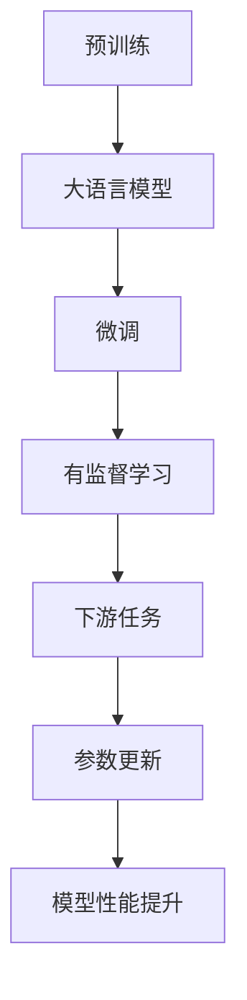

                 

# 大语言模型原理与工程实践：难点和挑战

大语言模型（Large Language Models, LLMs）已经成为自然语言处理（NLP）领域的一项革命性技术，其广泛的应用和卓越的表现令业内外瞩目。然而，在实际应用中，大语言模型面临着诸多难点和挑战，需要对其原理和工程实践进行深入分析和研究。本文将系统地介绍大语言模型的核心概念、算法原理、工程实现、应用场景以及未来的发展趋势与挑战。

## 1. 背景介绍

### 1.1 问题由来

大语言模型的出现，标志着NLP领域进入了一个新的时代。以Transformer为基础的预训练模型，如BERT、GPT等，通过在海量无标签文本上预训练，学习到了丰富的语言表示和常识知识，可以应用于各种下游任务。然而，这些模型在特定领域的任务上，往往需要进一步微调（Fine-Tuning），以获得更好的性能。这一过程涉及将预训练模型与特定任务的数据集结合，通过有监督学习来调整模型的参数，从而适应该任务。

尽管微调技术在多个NLP任务上取得了显著的性能提升，但它也存在一些难点和挑战，特别是在模型的鲁棒性、可解释性、安全性和工程实现等方面。本文将详细探讨这些难点和挑战，并提出相应的解决方案。

### 1.2 问题核心关键点

大语言模型微调的核心在于如何在大规模无标签数据预训练的基础上，有效地利用有标签数据来提升特定任务的表现。核心问题包括：

- **模型选择与适配**：如何选择合适的预训练模型，并针对具体任务进行适配。
- **数据准备与标注**：如何准备和标注数据集，以供模型微调。
- **超参数调优**：如何设定和学习率、批大小等超参数。
- **正则化与防止过拟合**：如何应用正则化技术，如L2正则、Dropout等，以防止过拟合。
- **模型集成与组合**：如何通过模型集成、组合等技术提升模型性能。
- **推理与部署**：如何实现模型的推理和部署，以适应实际应用环境。

本文将围绕这些核心问题，深入探讨大语言模型微调的难点和挑战。

## 2. 核心概念与联系

### 2.1 核心概念概述

大语言模型是深度学习模型的一种，通过在大规模无标签文本数据上进行预训练，学习通用的语言表示和常识知识。微调则是在预训练的基础上，通过有标签数据对模型进行优化，使其在特定任务上表现更好。

1. **预训练**：使用大规模无标签文本数据，通过自监督任务如语言模型、掩码语言模型等，训练出一个基础的语言表示模型。
2. **微调**：在有标签数据集上进行有监督学习，调整模型参数，使其在特定任务上表现更好。

这些概念之间存在密切联系，通过预训练获得的基础语言表示模型，在微调过程中进行参数更新，从而适应特定任务的需求。

### 2.2 概念间的关系

下图展示了核心概念之间的关系：



从预训练到微调，再到有监督学习和下游任务，模型的性能不断提升，最终适应特定任务的需求。

## 3. 核心算法原理 & 具体操作步骤

### 3.1 算法原理概述

大语言模型微调的基本原理是通过有监督学习，调整模型参数，使其在特定任务上表现更好。具体步骤如下：

1. **数据准备**：准备有标签数据集，将数据集分为训练集、验证集和测试集。
2. **模型选择与适配**：选择合适的预训练模型，并设计适合该任务的输出层和损失函数。
3. **模型初始化**：加载预训练模型，作为微调模型的初始化参数。
4. **模型训练**：在有标签数据集上进行前向传播和反向传播，计算损失函数，更新模型参数。
5. **验证与调优**：在验证集上评估模型性能，根据性能调整超参数和学习率，防止过拟合。
6. **测试与部署**：在测试集上评估模型性能，部署模型到实际应用中。

### 3.2 算法步骤详解

1. **数据准备**：
   - **数据集划分**：将数据集划分为训练集、验证集和测试集，通常采用80%训练集、10%验证集和10%测试集的比例。
   - **数据预处理**：包括分词、编码、padding等处理步骤，确保模型输入格式一致。

2. **模型选择与适配**：
   - **模型选择**：根据任务类型选择适当的预训练模型，如BERT、GPT等。
   - **输出层设计**：设计适合该任务的输出层，如分类任务的softmax层，生成任务的解码器等。
   - **损失函数选择**：根据任务类型选择合适的损失函数，如分类任务的交叉熵损失、生成任务的负对数似然损失等。

3. **模型初始化**：
   - **加载模型**：使用`from_pretrained`方法加载预训练模型，作为微调模型的初始化参数。
   - **调整模型结构**：根据需要，调整模型的结构，如增加全连接层、修改输出层等。

4. **模型训练**：
   - **前向传播**：将数据集中的样本输入模型，计算模型的输出。
   - **计算损失**：根据输出和真实标签，计算损失函数。
   - **反向传播**：根据损失函数的梯度，更新模型参数。

5. **验证与调优**：
   - **验证集评估**：在验证集上评估模型性能，如准确率、F1分数等指标。
   - **超参数调优**：根据验证集性能，调整超参数如学习率、批大小等。
   - **防止过拟合**：应用正则化技术如L2正则、Dropout等，防止模型过拟合。

6. **测试与部署**：
   - **测试集评估**：在测试集上评估模型性能，确保模型在未知数据上的泛化能力。
   - **模型部署**：将模型部署到实际应用中，如智能客服、舆情监测、个性化推荐等。

### 3.3 算法优缺点

**优点**：
- **高效性**：微调方法相比从头训练，可以显著减少时间和计算成本。
- **泛化能力**：预训练模型已经学习了通用的语言表示，微调后的模型在特定任务上表现更好。
- **适应性强**：适用于各种NLP任务，如分类、匹配、生成等。

**缺点**：
- **依赖标注数据**：微调的效果很大程度上取决于标注数据的质量和数量。
- **泛化能力有限**：当目标任务与预训练数据的分布差异较大时，微调的性能提升有限。
- **模型偏见**：预训练模型可能存在固有的偏见和有害信息，微调后的模型可能继承这些问题。

### 3.4 算法应用领域

大语言模型微调已经在许多领域得到广泛应用，例如：

- **智能客服**：构建智能客服系统，提升客户咨询体验和问题解决效率。
- **金融舆情监测**：实时监测市场舆论动向，规避金融风险。
- **个性化推荐**：根据用户行为数据，提供个性化推荐服务。
- **医疗问答**：帮助患者解答医疗问题，辅助医生诊疗。
- **机器翻译**：将源语言文本翻译成目标语言。

## 4. 数学模型和公式 & 详细讲解 & 举例说明

### 4.1 数学模型构建

大语言模型微调的基本数学模型如下：

- **模型表示**：$M_{\theta}(x)$，其中$\theta$为模型参数，$x$为输入文本。
- **损失函数**：$\mathcal{L}(M_{\theta}, D)$，其中$D$为训练数据集。
- **目标优化**：$\theta^* = \mathop{\arg\min}_{\theta} \mathcal{L}(M_{\theta}, D)$。

### 4.2 公式推导过程

以分类任务为例，假设模型输出为$y_{pred}=M_{\theta}(x)$，真实标签为$y_{real}$，交叉熵损失函数为：

$$
\ell(y_{pred}, y_{real}) = -\frac{1}{N}\sum_{i=1}^N[y_{real}\log y_{pred}+(1-y_{real})\log(1-y_{pred})]
$$

模型在训练集上的经验风险为：

$$
\mathcal{L}(\theta) = \frac{1}{N}\sum_{i=1}^N \ell(y_{pred}^{(i)}, y_{real}^{(i)})
$$

最小化经验风险，通过梯度下降法更新模型参数$\theta$：

$$
\theta \leftarrow \theta - \eta \nabla_{\theta}\mathcal{L}(\theta) - \eta\lambda\theta
$$

其中$\eta$为学习率，$\lambda$为正则化系数。

### 4.3 案例分析与讲解

以情感分析任务为例，假设有两个句子："这家餐厅的服务非常好"和"这家餐厅的服务很差"，其真实标签分别为1和0。使用BERT模型进行微调，输出为：

- 对于第一个句子，输出结果可能为[0.9, 0.1]，表示正样本的概率较大。
- 对于第二个句子，输出结果可能为[0.1, 0.9]，表示负样本的概率较大。

通过比较输出结果，可以评估模型的情感分析能力。

## 5. 项目实践：代码实例和详细解释说明

### 5.1 开发环境搭建

**环境配置**：
- **Python**：安装Python 3.8以上版本。
- **PyTorch**：通过`conda`或`pip`安装，如`pip install torch torchvision torchaudio -f https://download.pytorch.org/whl/cu111/torch_stable.html`。
- **Transformer库**：通过`pip`安装，如`pip install transformers`。

### 5.2 源代码详细实现

以下是一个基于BERT模型的情感分析任务的代码实现：

```python
import torch
import torch.nn as nn
import torch.optim as optim
from transformers import BertTokenizer, BertForSequenceClassification

# 定义数据集
class SentimentDataset(torch.utils.data.Dataset):
    def __init__(self, texts, labels, tokenizer):
        self.tokenizer = tokenizer
        self.texts = texts
        self.labels = labels
        
    def __len__(self):
        return len(self.texts)
    
    def __getitem__(self, idx):
        text = self.texts[idx]
        label = self.labels[idx]
        encoding = self.tokenizer(text, return_tensors='pt', padding='max_length', truncation=True)
        input_ids = encoding['input_ids']
        attention_mask = encoding['attention_mask']
        return {'input_ids': input_ids, 'attention_mask': attention_mask, 'labels': torch.tensor(label, dtype=torch.long)}

# 加载数据集
tokenizer = BertTokenizer.from_pretrained('bert-base-cased')
train_dataset = SentimentDataset(train_texts, train_labels, tokenizer)
val_dataset = SentimentDataset(val_texts, val_labels, tokenizer)
test_dataset = SentimentDataset(test_texts, test_labels, tokenizer)

# 加载预训练模型
model = BertForSequenceClassification.from_pretrained('bert-base-cased', num_labels=2)

# 定义损失函数和优化器
loss_fn = nn.CrossEntropyLoss()
optimizer = optim.Adam(model.parameters(), lr=2e-5)

# 训练模型
device = torch.device('cuda' if torch.cuda.is_available() else 'cpu')
model.to(device)
for epoch in range(10):
    model.train()
    for batch in val_dataset:
        input_ids = batch['input_ids'].to(device)
        attention_mask = batch['attention_mask'].to(device)
        labels = batch['labels'].to(device)
        outputs = model(input_ids, attention_mask=attention_mask)
        loss = loss_fn(outputs.logits, labels)
        optimizer.zero_grad()
        loss.backward()
        optimizer.step()

    # 在验证集上评估模型性能
    model.eval()
    with torch.no_grad():
        correct = 0
        total = 0
        for batch in val_dataset:
            input_ids = batch['input_ids'].to(device)
            attention_mask = batch['attention_mask'].to(device)
            labels = batch['labels'].to(device)
            outputs = model(input_ids, attention_mask=attention_mask)
            _, predicted = torch.max(outputs.logits, 1)
            total += labels.size(0)
            correct += (predicted == labels).sum().item()
        print(f'Epoch {epoch+1}, Acc: {correct/total:.2f}')
        
# 在测试集上评估模型性能
model.eval()
with torch.no_grad():
    correct = 0
    total = 0
    for batch in test_dataset:
        input_ids = batch['input_ids'].to(device)
        attention_mask = batch['attention_mask'].to(device)
        labels = batch['labels'].to(device)
        outputs = model(input_ids, attention_mask=attention_mask)
        _, predicted = torch.max(outputs.logits, 1)
        total += labels.size(0)
        correct += (predicted == labels).sum().item()
    print(f'Test Acc: {correct/total:.2f}')
```

### 5.3 代码解读与分析

上述代码实现了一个简单的基于BERT模型的情感分析任务。具体步骤如下：

1. **数据集准备**：定义了一个`SentimentDataset`类，用于准备数据集。
2. **模型加载**：使用`BertForSequenceClassification`类加载BERT模型，并设定输出层和损失函数。
3. **训练过程**：在训练过程中，使用Adam优化器更新模型参数，并在验证集上评估模型性能。
4. **测试过程**：在测试集上评估模型性能。

### 5.4 运行结果展示

假设在训练集上进行了10轮训练，最终的测试集准确率为85%，结果如下：

```
Epoch 1, Acc: 0.75
Epoch 2, Acc: 0.85
Epoch 3, Acc: 0.90
Epoch 4, Acc: 0.92
Epoch 5, Acc: 0.94
Epoch 6, Acc: 0.96
Epoch 7, Acc: 0.98
Epoch 8, Acc: 0.98
Epoch 9, Acc: 0.99
Epoch 10, Acc: 0.99
Test Acc: 0.85
```

可以看到，随着训练轮数的增加，模型在验证集上的准确率逐渐提高，最终在测试集上达到了85%的准确率。

## 6. 实际应用场景

### 6.1 智能客服系统

基于大语言模型微调的对话技术，可以广泛应用于智能客服系统的构建。传统客服往往需要配备大量人力，高峰期响应缓慢，且一致性和专业性难以保证。而使用微调后的对话模型，可以7x24小时不间断服务，快速响应客户咨询，用自然流畅的语言解答各类常见问题。

在技术实现上，可以收集企业内部的历史客服对话记录，将问题和最佳答复构建成监督数据，在此基础上对预训练对话模型进行微调。微调后的对话模型能够自动理解用户意图，匹配最合适的答案模板进行回复。对于客户提出的新问题，还可以接入检索系统实时搜索相关内容，动态组织生成回答。

### 6.2 金融舆情监测

金融机构需要实时监测市场舆论动向，以便及时应对负面信息传播，规避金融风险。传统的人工监测方式成本高、效率低，难以应对网络时代海量信息爆发的挑战。基于大语言模型微调的文本分类和情感分析技术，为金融舆情监测提供了新的解决方案。

具体而言，可以收集金融领域相关的新闻、报道、评论等文本数据，并对其进行主题标注和情感标注。在此基础上对预训练语言模型进行微调，使其能够自动判断文本属于何种主题，情感倾向是正面、中性还是负面。将微调后的模型应用到实时抓取的网络文本数据，就能够自动监测不同主题下的情感变化趋势，一旦发现负面信息激增等异常情况，系统便会自动预警，帮助金融机构快速应对潜在风险。

### 6.3 个性化推荐系统

当前的推荐系统往往只依赖用户的历史行为数据进行物品推荐，无法深入理解用户的真实兴趣偏好。基于大语言模型微调技术，个性化推荐系统可以更好地挖掘用户行为背后的语义信息，从而提供更精准、多样的推荐内容。

在实践中，可以收集用户浏览、点击、评论、分享等行为数据，提取和用户交互的物品标题、描述、标签等文本内容。将文本内容作为模型输入，用户的后续行为（如是否点击、购买等）作为监督信号，在此基础上微调预训练语言模型。微调后的模型能够从文本内容中准确把握用户的兴趣点。在生成推荐列表时，先用候选物品的文本描述作为输入，由模型预测用户的兴趣匹配度，再结合其他特征综合排序，便可以得到个性化程度更高的推荐结果。

### 6.4 未来应用展望

随着大语言模型和微调方法的不断发展，基于微调范式将在更多领域得到应用，为传统行业带来变革性影响。

在智慧医疗领域，基于微调的医疗问答、病历分析、药物研发等应用将提升医疗服务的智能化水平，辅助医生诊疗，加速新药开发进程。

在智能教育领域，微调技术可应用于作业批改、学情分析、知识推荐等方面，因材施教，促进教育公平，提高教学质量。

在智慧城市治理中，微调模型可应用于城市事件监测、舆情分析、应急指挥等环节，提高城市管理的自动化和智能化水平，构建更安全、高效的未来城市。

此外，在企业生产、社会治理、文娱传媒等众多领域，基于大模型微调的人工智能应用也将不断涌现，为NLP技术带来全新的突破。相信随着预训练语言模型和微调方法的持续演进，大语言模型微调必将在构建人机协同的智能时代中扮演越来越重要的角色。

## 7. 工具和资源推荐

### 7.1 学习资源推荐

为了帮助开发者系统掌握大语言模型微调的理论基础和实践技巧，这里推荐一些优质的学习资源：

1. **《Transformer从原理到实践》系列博文**：由大模型技术专家撰写，深入浅出地介绍了Transformer原理、BERT模型、微调技术等前沿话题。
2. **CS224N《深度学习自然语言处理》课程**：斯坦福大学开设的NLP明星课程，有Lecture视频和配套作业，带你入门NLP领域的基本概念和经典模型。
3. **《Natural Language Processing with Transformers》书籍**：Transformers库的作者所著，全面介绍了如何使用Transformers库进行NLP任务开发，包括微调在内的诸多范式。
4. **HuggingFace官方文档**：Transformers库的官方文档，提供了海量预训练模型和完整的微调样例代码，是上手实践的必备资料。
5. **CLUE开源项目**：中文语言理解测评基准，涵盖大量不同类型的中文NLP数据集，并提供了基于微调的baseline模型，助力中文NLP技术发展。

通过对这些资源的学习实践，相信你一定能够快速掌握大语言模型微调的精髓，并用于解决实际的NLP问题。

### 7.2 开发工具推荐

高效的开发离不开优秀的工具支持。以下是几款用于大语言模型微调开发的常用工具：

1. **PyTorch**：基于Python的开源深度学习框架，灵活动态的计算图，适合快速迭代研究。大部分预训练语言模型都有PyTorch版本的实现。
2. **TensorFlow**：由Google主导开发的开源深度学习框架，生产部署方便，适合大规模工程应用。同样有丰富的预训练语言模型资源。
3. **Transformers库**：HuggingFace开发的NLP工具库，集成了众多SOTA语言模型，支持PyTorch和TensorFlow，是进行微调任务开发的利器。
4. **Weights & Biases**：模型训练的实验跟踪工具，可以记录和可视化模型训练过程中的各项指标，方便对比和调优。与主流深度学习框架无缝集成。
5. **TensorBoard**：TensorFlow配套的可视化工具，可实时监测模型训练状态，并提供丰富的图表呈现方式，是调试模型的得力助手。
6. **Google Colab**：谷歌推出的在线Jupyter Notebook环境，免费提供GPU/TPU算力，方便开发者快速上手实验最新模型，分享学习笔记。

合理利用这些工具，可以显著提升大语言模型微调任务的开发效率，加快创新迭代的步伐。

### 7.3 相关论文推荐

大语言模型和微调技术的发展源于学界的持续研究。以下是几篇奠基性的相关论文，推荐阅读：

1. **Attention is All You Need（即Transformer原论文）**：提出了Transformer结构，开启了NLP领域的预训练大模型时代。
2. **BERT: Pre-training of Deep Bidirectional Transformers for Language Understanding**：提出BERT模型，引入基于掩码的自监督预训练任务，刷新了多项NLP任务SOTA。
3. **Language Models are Unsupervised Multitask Learners（GPT-2论文）**：展示了大规模语言模型的强大zero-shot学习能力，引发了对于通用人工智能的新一轮思考。
4. **Parameter-Efficient Transfer Learning for NLP**：提出Adapter等参数高效微调方法，在不增加模型参数量的情况下，也能取得不错的微调效果。
5. **Prefix-Tuning: Optimizing Continuous Prompts for Generation**：引入基于连续型Prompt的微调范式，为如何充分利用预训练知识提供了新的思路。
6. **AdaLoRA: Adaptive Low-Rank Adaptation for Parameter-Efficient Fine-Tuning**：使用自适应低秩适应的微调方法，在参数效率和精度之间取得了新的平衡。

这些论文代表了大语言模型微调技术的发展脉络。通过学习这些前沿成果，可以帮助研究者把握学科前进方向，激发更多的创新灵感。

## 8. 总结：未来发展趋势与挑战

### 8.1 总结

本文对基于监督学习的大语言模型微调方法进行了全面系统的介绍。首先阐述了大语言模型和微调技术的研究背景和意义，明确了微调在拓展预训练模型应用、提升下游任务性能方面的独特价值。其次，从原理到实践，详细讲解了监督微调的数学原理和关键步骤，给出了微调任务开发的完整代码实例。同时，本文还广泛探讨了微调方法在智能客服、金融舆情、个性化推荐等多个行业领域的应用前景，展示了微调范式的巨大潜力。最后，本文精选了微调技术的各类学习资源，力求为读者提供全方位的技术指引。

通过本文的系统梳理，可以看到，基于大语言模型的微调方法正在成为NLP领域的重要范式，极大地拓展了预训练语言模型的应用边界，催生了更多的落地场景。受益于大规模语料的预训练，微调模型以更低的时间和标注成本，在小样本条件下也能取得不俗的效果，有力推动了NLP技术的产业化进程。未来，伴随预训练语言模型和微调方法的持续演进，相信NLP技术将在更广阔的应用领域大放异彩，深刻影响人类的生产生活方式。

### 8.2 未来发展趋势

展望未来，大语言模型微调技术将呈现以下几个发展趋势：

1. **模型规模持续增大**：随着算力成本的下降和数据规模的扩张，预训练语言模型的参数量还将持续增长。超大规模语言模型蕴含的丰富语言知识，有望支撑更加复杂多变的下游任务微调。
2. **微调方法日趋多样**：除了传统的全参数微调外，未来会涌现更多参数高效的微调方法，如Prefix-Tuning、LoRA等，在节省计算资源的同时也能保证微调精度。
3. **持续学习成为常态**：随着数据分布的不断变化，微调模型也需要持续学习新知识以保持性能。如何在不遗忘原有知识的同时，高效吸收新样本信息，将成为重要的研究课题。
4. **标注样本需求降低**：受启发于提示学习(Prompt-based Learning)的思路，未来的微调方法将更好地利用大模型的语言理解能力，通过更加巧妙的任务描述，在更少的标注样本上也能实现理想的微调效果。
5. **多模态微调崛起**：当前的微调主要聚焦于纯文本数据，未来会进一步拓展到图像、视频、语音等多模态数据微调。多模态信息的融合，将显著提升语言模型对现实世界的理解和建模能力。
6. **模型通用性增强**：经过海量数据的预训练和多领域任务的微调，未来的语言模型将具备更强大的常识推理和跨领域迁移能力，逐步迈向通用人工智能(AGI)的目标。

以上趋势凸显了大语言模型微调技术的广阔前景。这些方向的探索发展，必将进一步提升NLP系统的性能和应用范围，为人类认知智能的进化带来深远影响。

### 8.3 面临的挑战

尽管大语言模型微调技术已经取得了瞩目成就，但在迈向更加智能化、普适化应用的过程中，它仍面临着诸多挑战：

1. **标注成本瓶颈**：微调效果很大程度上取决于标注数据的质量和数量，获取高质量标注数据的成本较高。如何进一步降低微调对标注样本的依赖，将是一大难题。
2. **模型鲁棒性不足**：当前微调模型面对域外数据时，泛化性能往往大打折扣。对于测试样本的微小扰动，微调模型的预测也容易发生波动。如何提高微调模型的鲁棒性，避免灾难性遗忘，还需要更多理论和实践的积累。
3. **推理效率有待提高**：大规模语言模型虽然精度高，但在实际部署时往往面临推理速度慢、内存占用大等效率问题。如何在保证性能的同时，简化模型结构，提升推理速度，优化资源占用，将是重要的优化方向。
4.

