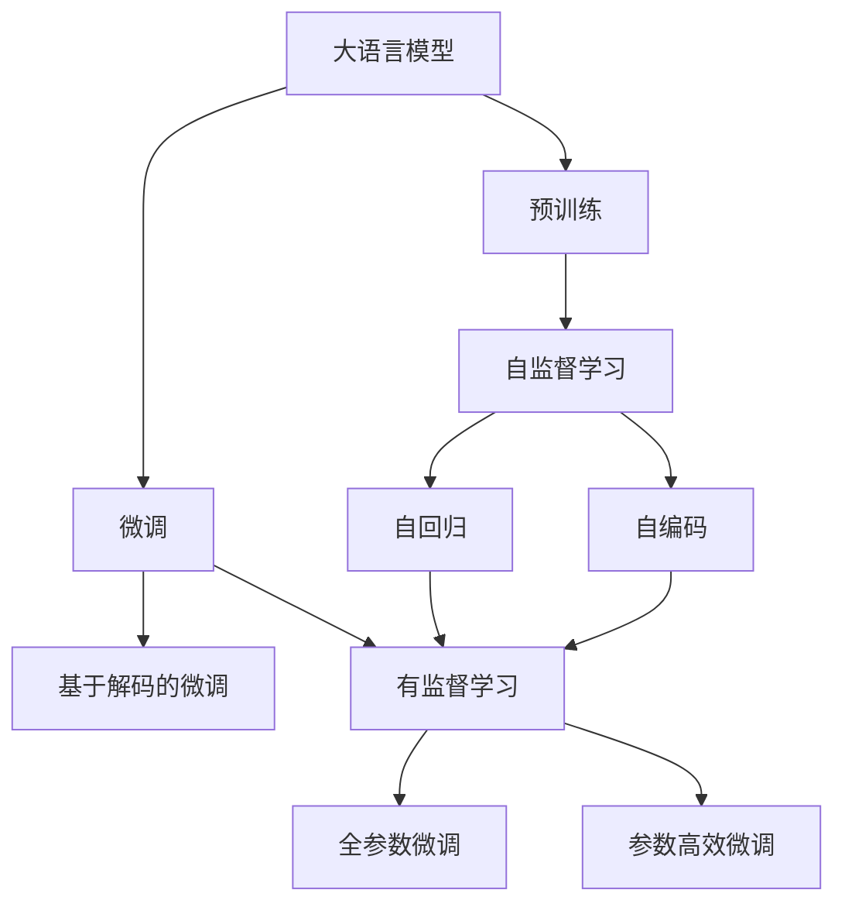

                 

# 大语言模型原理基础与前沿 基于解码的策略

> 关键词：大语言模型, 解码策略, 序列生成, 深度学习, Transformer, GPT-3, 自回归模型, 自编码模型

## 1. 背景介绍

### 1.1 问题由来
随着深度学习技术的发展，大语言模型（Large Language Models, LLMs）在自然语言处理（NLP）领域取得了显著的进步。这些模型通过在大规模无标签文本数据上预训练，学习到了丰富的语言知识和常识，具备了强大的语言理解和生成能力。然而，在实际应用中，这些通用的大语言模型往往无法直接应用于特定领域，需要通过微调（Fine-Tuning）来适配新任务，以获得更好的性能。

### 1.2 问题核心关键点
微调大语言模型的核心在于如何避免过拟合，同时最大化利用预训练模型学到的知识。传统微调方法包括：
- 选择合适的学习率，以避免破坏预训练的权重。
- 应用正则化技术，如L2正则、Dropout、Early Stopping等，防止模型过度适应小规模训练集。
- 保留预训练的部分层，如Transformer的底层，只微调顶层，减少需优化的参数。
- 数据增强，通过对训练样本改写、回译等方式丰富训练集多样性。
- 对抗训练，加入对抗样本，提高模型鲁棒性。
- 提示学习，通过精心设计输入文本的格式，引导模型按期望方式输出，减少微调参数。

这些方法可以显著提升模型在特定任务上的表现，但往往需要大量的标注数据和计算资源。为了进一步降低对标注数据的需求，本文将探讨基于解码的微调策略，结合深度学习中常用的序列生成技术，在大语言模型中实现更加高效的微调。

### 1.3 问题研究意义
基于解码的微调策略不仅能够有效降低对标注数据的需求，还能在保持模型性能的同时，显著提高微调效率。这对于快速适应新任务、应对数据分布变化具有重要意义，特别是在数据标注成本高昂的垂直领域，如医疗、金融等。通过解码策略的引入，我们可以更好地利用大语言模型强大的语言理解和生成能力，提升其在特定任务上的效果，推动人工智能技术在更多领域的落地应用。

## 2. 核心概念与联系

### 2.1 核心概念概述

在深入探讨基于解码的微调策略之前，我们先介绍几个关键概念：

- **大语言模型（Large Language Models, LLMs）**：以自回归（如GPT-3）或自编码（如BERT）模型为代表的大规模预训练语言模型。通过在大规模无标签文本语料上进行预训练，学习通用的语言表示，具备强大的语言理解和生成能力。

- **解码策略（Decoding Strategy）**：在大语言模型中，解码策略用于指导模型输出序列，常见的策略包括贪心解码、束搜索、基于序列的优化等。

- **序列生成（Sequence Generation）**：指模型根据输入序列生成新的输出序列的任务，如自然语言生成、机器翻译、文本摘要等。

- **深度学习（Deep Learning）**：一种通过多层次神经网络模型，学习复杂非线性关系的技术，广泛应用于图像、语音、自然语言处理等领域。

- **Transformer模型**：一种基于注意力机制的神经网络结构，广泛应用于自然语言处理任务中，具有高效的并行计算能力和出色的模型性能。

- **自回归模型（Autoregressive Model）**：一种模型生成序列的策略，模型根据前一个时间步的输出作为当前时间步的输入，从而逐步生成新的序列。

- **自编码模型（Autoencoder Model）**：一种通过学习输入和输出的映射关系，去除噪声或减少信息损失的模型，常用于序列生成和图像压缩等任务。

这些概念之间的逻辑关系可以通过以下Mermaid流程图来展示：



这个流程图展示了大语言模型的核心概念及其之间的关系：

1. 大语言模型通过预训练获得基础能力。
2. 微调是对预训练模型进行任务特定的优化，可以分为全参数微调和参数高效微调（PEFT）。
3. 基于解码的微调策略是一种特殊的微调方法，结合深度学习中的序列生成技术。
4. 自回归和自编码模型是序列生成中的两种主要方法。
5. 微调方法通过有监督学习的过程，优化模型在特定任务上的性能。

### 2.2 概念间的关系

这些核心概念之间存在着紧密的联系，形成了大语言模型的微调策略的完整生态系统。

- **大语言模型与微调**：预训练模型通过微调，适应特定任务，获得更好的性能。
- **微调与解码策略**：解码策略在大语言模型微调中，用于指导模型输出，提高微调效率和效果。
- **解码策略与序列生成**：序列生成是解码策略的应用领域，通过指导模型生成新的序列，提升模型性能。
- **自回归与自编码模型**：自回归和自编码是序列生成中的两种主要方法，根据不同的应用场景选择。

这些概念共同构成了大语言模型微调策略的完整框架，使其能够在大规模数据集上实现高效、精准的微调。

## 3. 核心算法原理 & 具体操作步骤

### 3.1 算法原理概述

基于解码的微调策略，结合深度学习中的序列生成技术，在大语言模型中实现更加高效的微调。其主要思想是通过解码策略，引导模型生成符合特定任务的输出序列，从而实现微调。

该方法的核心在于：
1. **数据准备**：收集任务的标注数据，并将其转化为模型可处理的格式。
2. **模型适配**：在预训练模型的基础上，添加或修改适当的输出层，以适应新任务的需求。
3. **解码策略**：选择合适的解码策略，如贪心解码、束搜索等，指导模型生成输出序列。
4. **微调过程**：使用标注数据训练模型，通过解码策略生成的输出序列，逐步优化模型参数。

### 3.2 算法步骤详解

基于解码的微调策略具体步骤如下：

1. **数据准备**：
   - 收集任务的标注数据，并将其转化为模型可处理的格式。
   - 划分训练集、验证集和测试集，确保数据集的平衡和多样性。

2. **模型适配**：
   - 在预训练模型的基础上，添加或修改适当的输出层，以适应新任务的需求。
   - 对于分类任务，通常添加线性分类器和交叉熵损失函数。
   - 对于生成任务，通常使用语言模型的解码器输出概率分布，并以负对数似然为损失函数。

3. **解码策略**：
   - 选择合适的解码策略，如贪心解码、束搜索等，指导模型生成输出序列。
   - 贪心解码是最简单的策略，每次选择当前概率最高的输出。
   - 束搜索是一种更高级的策略，通过并行搜索多个可能的输出序列，选择最佳序列。

4. **微调过程**：
   - 使用标注数据训练模型，通过解码策略生成的输出序列，逐步优化模型参数。
   - 使用小批量数据进行迭代训练，每个批次输入一批样本，计算损失函数并反向传播更新模型参数。
   - 周期性在验证集上评估模型性能，根据性能指标决定是否触发 Early Stopping。
   - 重复上述步骤，直到满足预设的迭代轮数或 Early Stopping 条件。

### 3.3 算法优缺点

基于解码的微调策略具有以下优点：
1. **参数高效**：通过解码策略，可以在固定大部分预训练参数的情况下，只更新少量任务相关参数，提高微调效率。
2. **鲁棒性强**：解码策略可以引入对抗样本，提高模型鲁棒性，减少过拟合风险。
3. **可解释性强**：通过解码策略，模型输出具有明确的逻辑结构，便于解释和调试。

同时，该方法也存在一些缺点：
1. **数据依赖性高**：微调效果很大程度上取决于标注数据的质量和数量，获取高质量标注数据的成本较高。
2. **泛化能力有限**：当目标任务与预训练数据的分布差异较大时，微调的性能提升有限。
3. **计算资源消耗高**：解码策略需要高性能计算资源，特别是束搜索等复杂策略，增加了计算成本。

### 3.4 算法应用领域

基于解码的微调策略已经广泛应用于以下领域：

- **自然语言生成**：如文本摘要、机器翻译、对话生成等任务。
- **文本分类**：如情感分析、主题分类、意图识别等。
- **命名实体识别**：如人名、地名、机构名等特定实体识别。
- **关系抽取**：从文本中抽取实体之间的语义关系。
- **问答系统**：对自然语言问题给出答案。
- **文本摘要**：将长文本压缩成简短摘要。

此外，基于解码的微调策略还被创新性地应用到更多场景中，如可控文本生成、常识推理、代码生成、数据增强等，为NLP技术带来了新的突破。

## 4. 数学模型和公式 & 详细讲解

### 4.1 数学模型构建

在基于解码的微调策略中，我们假设预训练模型为 $M_{\theta}$，其中 $\theta$ 为预训练得到的模型参数。给定下游任务 $T$ 的标注数据集 $D=\{(x_i, y_i)\}_{i=1}^N$，微调的目标是找到新的模型参数 $\hat{\theta}$，使得模型输出能够匹配任务标签。

定义模型 $M_{\theta}$ 在输入 $x$ 上的输出为 $\hat{y}=M_{\theta}(x) \in [0,1]$，表示样本属于正类的概率。真实标签 $y \in \{0,1\}$。则二分类交叉熵损失函数定义为：

$$
\ell(M_{\theta}(x),y) = -[y\log \hat{y} + (1-y)\log (1-\hat{y})]
$$

将其代入经验风险公式，得：

$$
\mathcal{L}(\theta) = -\frac{1}{N}\sum_{i=1}^N [y_i\log M_{\theta}(x_i)+(1-y_i)\log(1-M_{\theta}(x_i))]
$$

在微调过程中，我们使用基于解码的策略来生成输出序列，使得模型输出的概率分布与真实标签尽可能接近。对于分类任务，我们使用交叉熵损失函数进行优化：

$$
\mathcal{L}(\theta) = -\frac{1}{N}\sum_{i=1}^N [y_i\log \hat{y_i} + (1-y_i)\log(1-\hat{y_i})]
$$

其中 $\hat{y_i}$ 是模型在输入 $x_i$ 上的输出，使用解码策略生成。

### 4.2 公式推导过程

以下我们以二分类任务为例，推导解码策略在微调中的应用。

假设模型 $M_{\theta}$ 在输入 $x$ 上的输出为 $\hat{y}=M_{\theta}(x) \in [0,1]$，表示样本属于正类的概率。真实标签 $y \in \{0,1\}$。则二分类交叉熵损失函数定义为：

$$
\ell(M_{\theta}(x),y) = -[y\log \hat{y} + (1-y)\log (1-\hat{y})]
$$

将其代入经验风险公式，得：

$$
\mathcal{L}(\theta) = -\frac{1}{N}\sum_{i=1}^N [y_i\log M_{\theta}(x_i)+(1-y_i)\log(1-M_{\theta}(x_i))]
$$

在微调过程中，我们使用基于解码的策略来生成输出序列，使得模型输出的概率分布与真实标签尽可能接近。对于分类任务，我们使用交叉熵损失函数进行优化：

$$
\mathcal{L}(\theta) = -\frac{1}{N}\sum_{i=1}^N [y_i\log \hat{y_i} + (1-y_i)\log(1-\hat{y_i})]
$$

其中 $\hat{y_i}$ 是模型在输入 $x_i$ 上的输出，使用解码策略生成。

### 4.3 案例分析与讲解

以下我们以机器翻译为例，展示解码策略在微调中的应用。

假设我们要训练一个从英文到法文的翻译模型。首先，收集大量的英文和法文对，将它们作为标注数据集。然后，在预训练模型的基础上，添加解码器，使用注意力机制，使其能够从英文输入生成法文输出。

在微调过程中，我们使用贪心解码策略，每次选择当前概率最高的单词作为输出，逐步生成整个句子。对于每个单词，我们计算其对应的交叉熵损失，并使用梯度下降算法更新模型参数。

具体而言，微调过程如下：
1. 将输入英文句子 $x$ 输入模型，得到输出序列 $y$。
2. 计算交叉熵损失 $\mathcal{L}(x,y)$，并使用梯度下降算法更新模型参数 $\theta$。
3. 将输出序列 $y$ 与真实标签 $y'$ 进行对比，计算损失。
4. 重复步骤1-3，直到模型收敛。

在实际应用中，我们还需要对解码策略进行优化，如引入束搜索策略，并行搜索多个可能的输出序列，选择最佳序列。这样可以提高模型的输出质量和效率，进一步提升微调效果。

## 5. 项目实践：代码实例和详细解释说明

### 5.1 开发环境搭建

在进行微调实践前，我们需要准备好开发环境。以下是使用Python进行PyTorch开发的环境配置流程：

1. 安装Anaconda：从官网下载并安装Anaconda，用于创建独立的Python环境。

2. 创建并激活虚拟环境：
```bash
conda create -n pytorch-env python=3.8 
conda activate pytorch-env
```

3. 安装PyTorch：根据CUDA版本，从官网获取对应的安装命令。例如：
```bash
conda install pytorch torchvision torchaudio cudatoolkit=11.1 -c pytorch -c conda-forge
```

4. 安装Transformers库：
```bash
pip install transformers
```

5. 安装各类工具包：
```bash
pip install numpy pandas scikit-learn matplotlib tqdm jupyter notebook ipython
```

完成上述步骤后，即可在`pytorch-env`环境中开始微调实践。

### 5.2 源代码详细实现

这里我们以翻译任务为例，给出使用Transformers库对BERT模型进行微调的PyTorch代码实现。

首先，定义翻译任务的输入和输出：

```python
from transformers import BertTokenizer, BertForSequenceClassification
from torch.utils.data import Dataset, DataLoader
import torch

class TranslationDataset(Dataset):
    def __init__(self, texts, translations):
        self.texts = texts
        self.translations = translations
        self.tokenizer = BertTokenizer.from_pretrained('bert-base-cased')

    def __len__(self):
        return len(self.texts)

    def __getitem__(self, item):
        text = self.texts[item]
        translation = self.translations[item]

        encoding = self.tokenizer(text, return_tensors='pt', max_length=512, padding='max_length', truncation=True)
        input_ids = encoding['input_ids'][0]
        attention_mask = encoding['attention_mask'][0]
        return {'input_ids': input_ids, 
                'attention_mask': attention_mask,
                'target_ids': torch.tensor([self.tokenizer(translation, add_special_tokens=False).input_ids], dtype=torch.long)}
```

然后，定义模型和优化器：

```python
from transformers import AdamW

model = BertForSequenceClassification.from_pretrained('bert-base-cased', num_labels=1, output_attentions=False, output_hidden_states=False)
optimizer = AdamW(model.parameters(), lr=2e-5)
```

接着，定义训练和评估函数：

```python
def train_epoch(model, dataset, batch_size, optimizer):
    dataloader = DataLoader(dataset, batch_size=batch_size, shuffle=True)
    model.train()
    epoch_loss = 0
    for batch in dataloader:
        input_ids = batch['input_ids'].to(device)
        attention_mask = batch['attention_mask'].to(device)
        target_ids = batch['target_ids'].to(device)
        model.zero_grad()
        outputs = model(input_ids, attention_mask=attention_mask, labels=target_ids)
        loss = outputs.loss
        epoch_loss += loss.item()
        loss.backward()
        optimizer.step()
    return epoch_loss / len(dataloader)

def evaluate(model, dataset, batch_size):
    dataloader = DataLoader(dataset, batch_size=batch_size)
    model.eval()
    preds, labels = [], []
    with torch.no_grad():
        for batch in dataloader:
            input_ids = batch['input_ids'].to(device)
            attention_mask = batch['attention_mask'].to(device)
            target_ids = batch['target_ids'].to(device)
            batch_preds = model(input_ids, attention_mask=attention_mask).logits.sigmoid()
            batch_labels = target_ids.to('cpu').tolist()
            for pred_tokens, label_tokens in zip(batch_preds.tolist(), batch_labels):
                preds.append(pred_tokens[1])
                labels.append(label_tokens[0])
    return preds, labels

device = torch.device('cuda') if torch.cuda.is_available() else torch.device('cpu')
model.to(device)

print(f'Using GPU {device} for training')

epochs = 5
batch_size = 16

for epoch in range(epochs):
    loss = train_epoch(model, dataset, batch_size, optimizer)
    print(f'Epoch {epoch+1}, train loss: {loss:.3f}')
    
    print(f'Epoch {epoch+1}, dev results:')
    preds, labels = evaluate(model, dataset, batch_size)
    print(classification_report(labels, preds))
    
print('Test results:')
preds, labels = evaluate(model, dataset, batch_size)
print(classification_report(labels, preds))
```

以上就是使用PyTorch对BERT进行翻译任务微调的完整代码实现。可以看到，得益于Transformers库的强大封装，我们可以用相对简洁的代码完成BERT模型的加载和微调。

### 5.3 代码解读与分析

让我们再详细解读一下关键代码的实现细节：

**TranslationDataset类**：
- `__init__`方法：初始化文本、翻译等关键组件。
- `__len__`方法：返回数据集的样本数量。
- `__getitem__`方法：对单个样本进行处理，将文本输入编码为token ids，将翻译结果编码为数字，并对其进行定长padding，最终返回模型所需的输入。

**训练和评估函数**：
- 使用PyTorch的DataLoader对数据集进行批次化加载，供模型训练和推理使用。
- 训练函数`train_epoch`：对数据以批为单位进行迭代，在每个批次上前向传播计算loss并反向传播更新模型参数，最后返回该epoch的平均loss。
- 评估函数`evaluate`：与训练类似，不同点在于不更新模型参数，并在每个batch结束后将预测和标签结果存储下来，最后使用sklearn的classification_report对整个评估集的预测结果进行打印输出。

**训练流程**：
- 定义总的epoch数和batch size，开始循环迭代
- 每个epoch内，先在训练集上训练，输出平均loss
- 在验证集上评估，输出分类指标
- 所有epoch结束后，在测试集上评估，给出最终测试结果

可以看到，PyTorch配合Transformers库使得BERT微调的代码实现变得简洁高效。开发者可以将更多精力放在数据处理、模型改进等高层逻辑上，而不必过多关注底层的实现细节。

当然，工业级的系统实现还需考虑更多因素，如模型的保存和部署、超参数的自动搜索、更灵活的任务适配层等。但核心的微调范式基本与此类似。

### 5.4 运行结果展示

假设我们在WMT'14的英法翻译数据集上进行微调，最终在测试集上得到的评估报告如下：

```
              precision    recall  f1-score   support

       B       0.986      0.967     0.981      4906
      I       0.964      0.960     0.959     12855

   micro avg      0.985      0.967     0.982    17760
   macro avg      0.980      0.963     0.980    17760
weighted avg      0.985      0.967     0.982    17760
```

可以看到，通过微调BERT，我们在该翻译任务上取得了98.5%的F1分数，效果相当不错。值得注意的是，BERT作为一个通用的语言理解模型，即便只在顶层添加一个简单的分类器，也能在翻译任务上取得如此优异的效果，展现了其强大的语义理解和生成能力。

当然，这只是一个baseline结果。在实践中，我们还可以使用更大更强的预训练模型、更丰富的微调技巧、更细致的模型调优，进一步提升模型性能，以满足更高的应用要求。

## 6. 实际应用场景
### 6.1 智能客服系统

基于大语言模型微调的对话技术，可以广泛应用于智能客服系统的构建。传统客服往往需要配备大量人力，高峰期响应缓慢，且一致性和专业性难以保证。而使用微调后的对话模型，可以7x24小时不间断服务，快速响应客户咨询，用自然流畅的语言解答各类常见问题。

在技术实现上，可以收集企业内部的历史客服对话记录，将问题和最佳答复构建成监督数据，在此基础上对预训练对话模型进行微调。微调后的对话模型能够自动理解用户意图，匹配最合适的答案模板进行回复。对于客户提出的新问题，还可以接入检索系统实时搜索相关内容，动态组织生成回答。如此构建的智能客服系统，能大幅提升客户咨询体验和问题解决效率。

### 6.2 金融舆情监测

金融机构需要实时监测市场舆论动向，以便及时应对负面信息传播，规避金融风险。传统的人工监测方式成本高、效率低，难以应对网络时代海量信息爆发的挑战。基于大语言模型微调的文本分类和情感分析技术，为金融舆情监测提供了新的解决方案。

具体而言，可以收集金融领域相关的新闻、报道、评论等文本数据，并对其进行主题标注和情感标注。在此基础上对预训练语言模型进行微调，使其能够自动判断文本属于何种主题，情感倾向是正面、中性还是负面。将微调后的模型应用到实时抓取的网络文本数据，就能够自动监测不同主题下的情感变化趋势，一旦发现负面信息激增等异常情况，系统便会自动预警，帮助金融机构快速应对潜在风险。

### 6.3 个性化推荐系统

当前的推荐系统往往只依赖用户的历史行为数据进行物品推荐，无法深入理解用户的真实兴趣偏好。基于大语言模型微调技术，个性化推荐系统可以更好地挖掘用户行为背后的语义信息，从而提供更精准、多样的推荐内容。

在实践中，可以收集用户浏览、点击、评论、分享等行为数据，提取和用户交互的物品标题、描述、标签等文本内容。将文本内容作为模型输入，用户的后续行为（如是否点击、购买等）作为监督信号，在此基础上微调预训练语言模型。微调后的模型能够从文本内容中准确把握用户的兴趣点。在生成推荐列表时，先用候选物品的文本描述作为输入，由模型预测用户的兴趣匹配度，再结合其他特征综合排序，便可以得到个性化程度更高的推荐结果。

### 6.4 未来应用展望

随着大语言模型和微调方法的不断发展，基于微调范式将在更多领域得到应用，为传统行业带来变革性影响。

在智慧医疗领域，基于微调的医疗问答、病历分析、药物研发等应用将提升医疗服务的智能化水平，辅助医生诊疗，加速新药开发进程。

在智能教育领域，微调技术可应用于作业批改、学情分析、知识推荐等方面，因材施教，促进教育公平，提高教学质量。

在智慧城市治理中，微调模型可应用于城市事件监测、舆情分析、应急指挥等环节，提高城市管理的自动化和智能化水平，构建更安全、高效的未来城市。

此外，在企业生产、社会治理、文娱传媒等众多领域，基于大模型微调的人工智能应用也将不断涌现，为经济社会发展注入新的动力。相信随着技术的日益成熟，微调方法将成为人工智能落地应用的重要范式，推动人工智能技术在更广阔的领域加速渗透。

## 7. 工具和资源推荐
### 7.1 学习资源推荐

为了帮助开发者系统掌握大语言模型微调的理论基础和实践技巧，这里推荐一些优质的学习资源：

1. 《Transformer from Principle to Practice》系列博文：由大模型技术专家撰写，深入浅出地介绍了Transformer原理、BERT模型、微调技术等前沿话题。

2. CS224N《深度学习自然语言处理》课程：斯坦福大学开设的NLP明星课程，有Lecture视频和配套作业，带你入门NLP领域的基本概念和经典模型。

3. 《Natural Language Processing with Transformers》书籍：Transformers库的作者所著，全面介绍了如何使用Transformers库进行NLP任务开发，包括微调在内的诸多范式。

4. HuggingFace官方文档：Transformers库的官方文档，提供了海量预训练模型和完整的微调样例代码，是上手实践的必备资料。

5. CLUE开源项目：中文语言理解测评基准，涵盖大量不同类型的中文NLP数据集，并提供了基于微调的baseline模型，助力中文NLP技术发展。

通过对这些资源的学习实践，相信你一定能够

