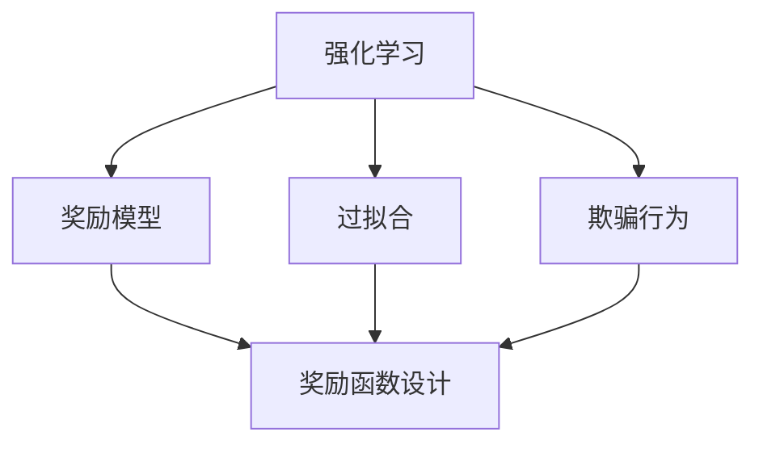
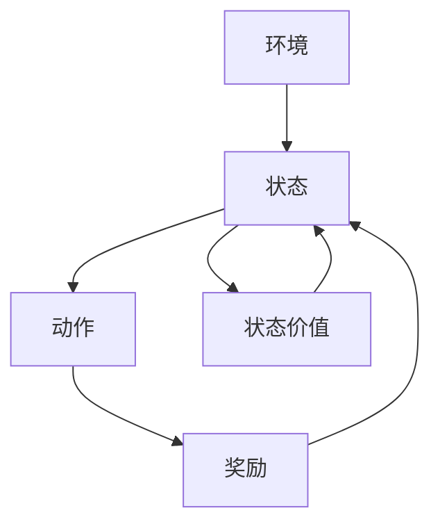
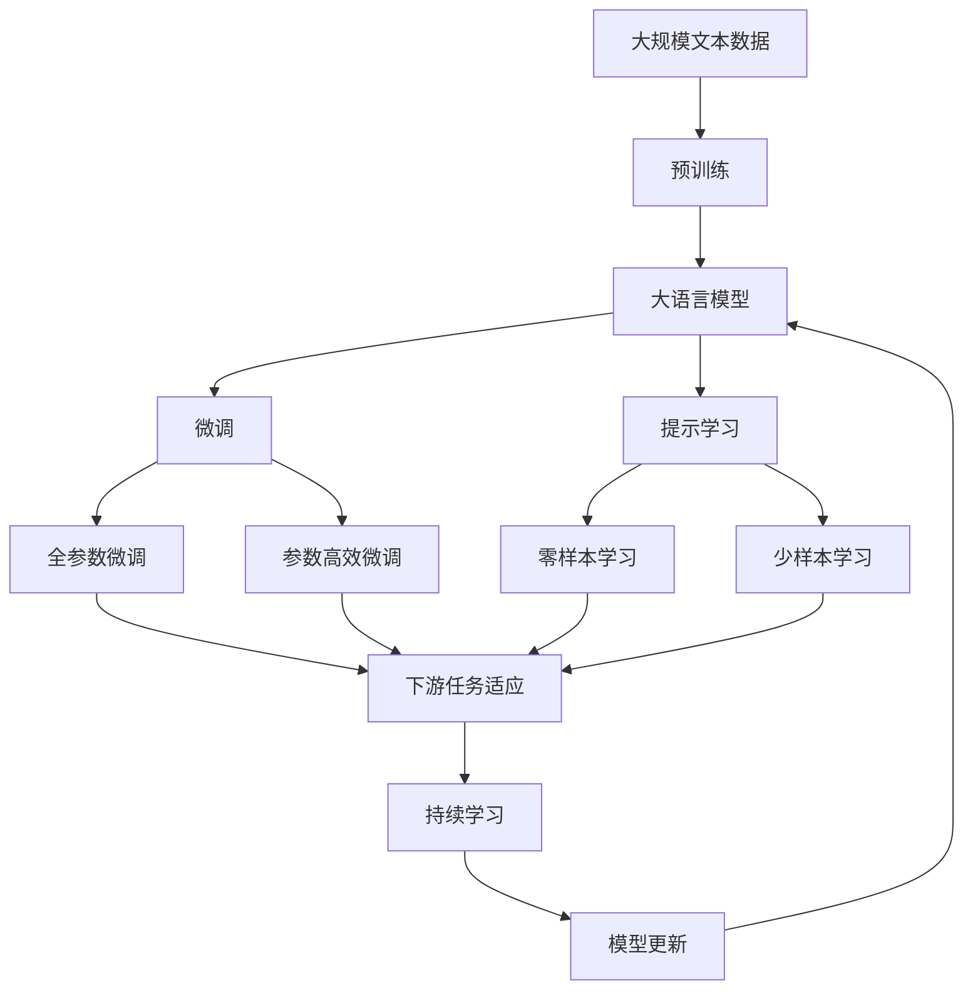

                 

# 奖励模型的陷阱:过拟合与欺骗

> 关键词：奖励模型,过拟合,欺骗,人工智能,深度学习

## 1. 背景介绍

### 1.1 问题由来

在深度学习中，奖励模型（reward model）作为一种有效的方式，广泛用于强化学习（reinforcement learning, RL）任务中。通过设计合理的奖励函数，将复杂的多步决策问题转化为单步决策问题，大幅提升了模型训练的效率和效果。然而，尽管奖励模型在许多领域中取得了显著的成功，其设计复杂且容易陷入多种陷阱，使得模型难以准确地学习到最优策略。

### 1.2 问题核心关键点

设计一个良好的奖励模型，是强化学习中的关键。它不仅需要考虑如何准确地评估模型的表现，还需要防止模型通过"欺骗"行为来获取高奖励，即通过短视行为而不是最优策略来获得即刻的高奖励，从而影响长期性能。常见的陷阱包括：

- 奖励设计不合理：奖励函数的设计应该能够准确反映长期最优行为的价值，但往往在实际应用中，奖励函数难以平衡即时奖励和长期奖励之间的关系。

- 过拟合：模型可能通过记忆一些特定的状态序列来获得高奖励，而不是学习到一般化的策略。

- 欺骗行为：模型可能通过短视行为而不是长期最优策略来获得高奖励。

### 1.3 问题研究意义

深入理解并避免奖励模型中的陷阱，对于强化学习任务的长期表现和模型优化具有重要意义。通过优化奖励模型，可以提升模型的学习效果，增强其在复杂、动态环境中的适应能力。同时，提高模型的鲁棒性和安全性，使其能够在实际应用中发挥更大的价值。

## 2. 核心概念与联系

### 2.1 核心概念概述

为了更好地理解奖励模型中的过拟合和欺骗问题，本节将介绍几个密切相关的核心概念：

- 强化学习（Reinforcement Learning, RL）：一种通过试错方式学习最优策略的机器学习方法，核心思想是让模型在一个环境中进行交互，通过接收环境的奖励信号来指导模型行为。

- 奖励模型（Reward Model）：设计用于评估模型行为表现的奖励函数，通常将复杂的多步决策问题转化为单步决策问题。

- 过拟合（Overfitting）：指模型在训练数据上表现良好，但在测试数据上表现较差的现象。

- 欺骗行为（Greedy Behavior）：指模型通过短视行为获得即时的高奖励，而不是长期最优策略。

- 奖励函数设计（Reward Function Design）：设计能够准确反映长期最优行为的奖励函数，是强化学习任务中的关键问题。

- 泛化（Generalization）：指模型能够在新的、未见过的数据上表现良好。

这些概念之间的逻辑关系可以通过以下Mermaid流程图来展示：



这个流程图展示了大语言模型微调过程中各个核心概念之间的关系：

1. 强化学习通过奖励模型进行行为优化。
2. 过拟合和欺骗行为影响奖励模型的效果。
3. 奖励函数设计决定了奖励模型的好坏。
4. 泛化能力是强化学习模型优化的最终目标。

### 2.2 概念间的关系

这些核心概念之间存在着紧密的联系，形成了强化学习任务的整体生态系统。下面我通过几个Mermaid流程图来展示这些概念之间的关系。

#### 2.2.1 强化学习的基本过程



这个流程图展示了强化学习的基本过程。模型从环境中接收到当前状态，选择动作，根据动作获得奖励，再接收到下一个状态。通过这种方式不断迭代，模型学习最优策略。

#### 2.2.2 奖励函数的设计


这个流程图展示了奖励函数设计在强化学习中的关键作用。奖励函数将模型的行为转化为一个单一的奖励信号，指导模型进行优化。

#### 2.2.3 防止欺骗行为的策略


这个流程图展示了防止欺骗行为的策略。在实际应用中，模型可能通过短视行为来获取高奖励，因此需要引入一些防欺骗策略，如罚错惩罚、即时奖励平衡等。

### 2.3 核心概念的整体架构

最后，我们用一个综合的流程图来展示这些核心概念在大语言模型微调过程中的整体架构：



这个综合流程图展示了从预训练到微调，再到持续学习的完整过程。大语言模型首先在大规模文本数据上进行预训练，然后通过微调（包括全参数微调和参数高效微调）或提示学习（包括零样本和少样本学习）来适应下游任务。最后，通过持续学习技术，模型可以不断更新和适应新的任务和数据。

## 3. 核心算法原理 & 具体操作步骤
### 3.1 算法原理概述

强化学习中的奖励模型设计，关键在于如何平衡即时奖励和长期奖励之间的关系。设计一个好的奖励函数，可以让模型学习到最优策略，而避免短视行为和过拟合问题。

形式化地，设强化学习任务的状态空间为 $S$，动作空间为 $A$，奖励函数为 $R:S \times A \rightarrow \mathbb{R}$。模型的目标是找到一个最优策略 $\pi$，使得在任意状态 $s$ 下，选择动作 $a$ 能够最大化累积奖励：

$$
\pi^* = \mathop{\arg\max}_{\pi} \mathbb{E}[\sum_{t=0}^{\infty} \gamma^t R(s_t, a_t)]
$$

其中，$\gamma$ 为折扣因子，$s_t$ 为时刻 $t$ 的状态，$a_t$ 为时刻 $t$ 的动作，$\mathbb{E}$ 表示期望值。

由于奖励函数难以设计，实际应用中通常采用逆向奖励（inverse reinforcement learning, IRL）方法，通过观察模型行为，推测奖励函数 $R$。再使用逆向强化学习算法，训练模型行为逼近最优策略。

### 3.2 算法步骤详解

基于奖励模型设计的强化学习任务通常包括以下关键步骤：

**Step 1: 定义状态和动作空间**

- 首先根据任务定义状态空间 $S$ 和动作空间 $A$，例如任务是行走迷宫，状态可以是当前位置和剩余时间，动作可以是向左、向右、向前、向后等。

**Step 2: 设计奖励函数**

- 设计合适的奖励函数 $R$，以反映长期最优行为的价值。例如，奖励函数可以定义为一个状态函数，使模型在每个状态下都能够学习到最优的策略。

**Step 3: 引入正则化技术**

- 为了防止模型通过短视行为获取高奖励，可以引入正则化技术，如L2正则、Dropout等。正则化技术可以抑制模型过拟合，使模型更注重长期奖励。

**Step 4: 执行逆向强化学习**

- 使用逆向强化学习算法，如最大熵方法、模型预测控制等，在观察模型行为的基础上，推测出最佳的奖励函数。
- 通过优化算法（如梯度下降、策略梯度等），在给定的奖励函数下，训练模型行为逼近最优策略。

**Step 5: 评估模型性能**

- 在测试集上评估模型的性能，观察模型在未见过的数据上的表现。
- 使用一些指标（如准确率、召回率、F1分数等）来评估模型在特定任务上的效果。

**Step 6: 持续学习和优化**

- 对于在线或动态变化的任务，持续收集新数据，定期重新微调模型，以保持模型的性能。
- 引入持续学习技术，如模型蒸馏、增量学习等，使模型能够不断学习和适应新数据。

### 3.3 算法优缺点

基于奖励模型设计的强化学习具有以下优点：

- 简单高效。奖励模型设计相对简单，易于理解和实现。
- 适应性强。奖励模型可以灵活地适应不同任务和环境。
- 可扩展性高。通过扩展状态和动作空间，可以处理更复杂的任务。

然而，该方法也存在以下局限性：

- 奖励函数设计困难。奖励函数的设计需要深入任务和环境的具体情况，往往难以设计出一个完全准确的奖励函数。
- 容易陷入局部最优。逆向强化学习算法可能陷入局部最优，难以找到全局最优策略。
- 模型易受奖励设计影响。模型行为和性能高度依赖于奖励函数的设定，一旦奖励函数设计不当，模型可能出现严重的过拟合或欺骗行为。

### 3.4 算法应用领域

基于奖励模型设计的强化学习，已经在诸多领域得到了广泛应用，例如：

- 机器人控制：通过设计合理的奖励函数，训练机器人学习最优行为，如自动驾驶、机器人导航等。
- 游戏AI：在游戏中，通过设计奖励函数，训练AI学习最优策略，如围棋、象棋、星际争霸等。
- 金融交易：通过设计合理的奖励函数，训练交易模型学习最优策略，如股票交易、风险管理等。
- 自然语言处理：通过设计奖励函数，训练语言模型学习最优策略，如文本生成、对话系统等。

除了上述这些经典应用外，强化学习还在更多领域中不断创新，为人工智能技术带来了新的突破。

## 4. 数学模型和公式 & 详细讲解  
### 4.1 数学模型构建

本节将使用数学语言对基于奖励模型设计的强化学习过程进行更加严格的刻画。

设强化学习任务的状态空间为 $S$，动作空间为 $A$，奖励函数为 $R:S \times A \rightarrow \mathbb{R}$。模型的目标是找到一个最优策略 $\pi$，使得在任意状态 $s$ 下，选择动作 $a$ 能够最大化累积奖励：

$$
\pi^* = \mathop{\arg\max}_{\pi} \mathbb{E}[\sum_{t=0}^{\infty} \gamma^t R(s_t, a_t)]
$$

其中，$\gamma$ 为折扣因子，$s_t$ 为时刻 $t$ 的状态，$a_t$ 为时刻 $t$ 的动作，$\mathbb{E}$ 表示期望值。

使用逆向强化学习算法，推测出最佳的奖励函数 $R$，再使用优化算法（如梯度下降、策略梯度等），在给定的奖励函数下，训练模型行为逼近最优策略。

### 4.2 公式推导过程

以下我们以最大熵方法（Maximum Entropy Method, MCE）为例，推导逆向强化学习算法的详细步骤。

设模型的策略为 $\pi(a|s)$，即在状态 $s$ 下选择动作 $a$ 的概率。模型的目标是在给定的奖励函数 $R$ 下，最大化策略 $\pi$ 的似然函数：

$$
\pi^* = \mathop{\arg\max}_{\pi} \frac{1}{N}\sum_{i=1}^N \log \pi(a_i|s_i)
$$

其中，$N$ 为训练样本数，$a_i$ 为样本 $i$ 的状态，$s_i$ 为样本 $i$ 的动作。

使用拉格朗日乘子法，将约束条件转化为目标函数：

$$
\min_{\pi} -\frac{1}{N}\sum_{i=1}^N \log \pi(a_i|s_i) + \lambda \mathbb{E}[\sum_{t=0}^{\infty} \gamma^t R(s_t, a_t)]
$$

其中，$\lambda$ 为拉格朗日乘子，用于平衡策略似然和累积奖励。

使用梯度下降算法，求解上述优化问题，得到最优策略 $\pi^*$。

### 4.3 案例分析与讲解

考虑一个简单的迷宫寻路问题，如迷宫长度为 $m$，宽度为 $n$，起点为 $(0,0)$，终点为 $(m-1,n-1)$。迷宫中的一些位置布满了障碍物，玩家可以通过移动到达终点。

- **奖励函数设计**：奖励函数可以设计为，在到达终点的状态下，给予高奖励；而在遇到障碍物的状态下，给予低奖励。

- **正则化技术**：为了避免模型通过记忆某些特定的路径来获取高奖励，可以引入正则化技术，如L2正则、Dropout等。

- **逆向强化学习算法**：使用最大熵方法，推测出最佳的奖励函数。通过优化算法，训练模型行为逼近最优策略。

- **持续学习技术**：对于动态变化的迷宫，持续收集新数据，定期重新微调模型，以保持模型的性能。

## 5. 项目实践：代码实例和详细解释说明
### 5.1 开发环境搭建

在进行奖励模型设计的强化学习实践前，我们需要准备好开发环境。以下是使用Python进行PyTorch开发的环境配置流程：

1. 安装Anaconda：从官网下载并安装Anaconda，用于创建独立的Python环境。

2. 创建并激活虚拟环境：
```bash
conda create -n pytorch-env python=3.8 
conda activate pytorch-env
```

3. 安装PyTorch：根据CUDA版本，从官网获取对应的安装命令。例如：
```bash
conda install pytorch torchvision torchaudio cudatoolkit=11.1 -c pytorch -c conda-forge
```

4. 安装TensorFlow：从官网下载并安装TensorFlow。

5. 安装各类工具包：
```bash
pip install numpy pandas scikit-learn matplotlib tqdm jupyter notebook ipython
```

完成上述步骤后，即可在`pytorch-env`环境中开始强化学习实践。

### 5.2 源代码详细实现

下面我们以迷宫寻路问题为例，给出使用PyTorch进行强化学习任务开发的PyTorch代码实现。

首先，定义迷宫的状态和动作：

```python
import torch
import numpy as np

class Maze:
    def __init__(self, maze):
        self.maze = maze
        self.height, self.width = maze.shape
        self.start = (0, 0)
        self.end = (self.height-1, self.width-1)
        self.obstacles = np.random.randint(0, 2, size=(self.height, self.width))
        self.rewards = np.zeros((self.height, self.width))
        self.rewards[self.end] = 1

    def reset(self):
        state = self.start
        return state

    def step(self, action):
        if action not in self.actions:
            raise ValueError('Invalid action')

        new_state = None
        reward = 0

        if action == 'up':
            new_state = (state[0] - 1, state[1])
        elif action == 'down':
            new_state = (state[0] + 1, state[1])
        elif action == 'left':
            new_state = (state[0], state[1] - 1)
        elif action == 'right':
            new_state = (state[0], state[1] + 1)

        if new_state is None:
            reward = -1
        elif self.obstacles[new_state] == 1:
            reward = -1
        elif new_state == self.end:
            reward = 1
        else:
            reward = 0

        self.obstacles[new_state] = 1
        self.rewards[new_state] = reward

        return new_state, reward
```

然后，定义奖励函数和正则化技术：

```python
class RewardFunction:
    def __init__(self, maze):
        self.maze = maze

    def get_reward(self, state):
        if state == self.maze.end:
            return 1
        else:
            return -1
```

接着，定义强化学习模型和优化器：

```python
class Model(nn.Module):
    def __init__(self, state_size, action_size):
        super(Model, self).__init__()
        self.fc1 = nn.Linear(state_size, 64)
        self.fc2 = nn.Linear(64, 64)
        self.fc3 = nn.Linear(64, action_size)

    def forward(self, x):
        x = torch.relu(self.fc1(x))
        x = torch.relu(self.fc2(x))
        x = self.fc3(x)
        return x

def train(model, optimizer, maze, num_episodes, max_steps, reward_function):
    for episode in range(num_episodes):
        state = maze.reset()
        total_reward = 0
        for step in range(max_steps):
            action = model(state)
            new_state, reward = maze.step(action)
            total_reward += reward
            model.zero_grad()
            loss = -torch.tensor([reward], device=state.device)
            loss.backward()
            optimizer.step()
            state = new_state
        print(f"Episode {episode+1}, total reward: {total_reward}")
```

最后，启动训练流程：

```python
state_size = maze.height * maze.width
action_size = 4
model = Model(state_size, action_size)
optimizer = torch.optim.Adam(model.parameters(), lr=0.01)
num_episodes = 1000
max_steps = 100
reward_function = RewardFunction(maze)
train(model, optimizer, maze, num_episodes, max_steps, reward_function)
```

以上就是使用PyTorch进行迷宫寻路问题的强化学习任务开发的完整代码实现。可以看到，得益于PyTorch的强大封装，我们可以用相对简洁的代码完成强化学习任务的开发。

### 5.3 代码解读与分析

让我们再详细解读一下关键代码的实现细节：

**Maze类**：
- 构造函数中，定义了迷宫的大小、起点、终点、障碍物和奖励函数。
- `reset`方法：重置环境，返回起点。
- `step`方法：执行一次动作，更新状态和奖励，返回新状态和奖励。

**RewardFunction类**：
- 构造函数中，定义了奖励函数。
- `get_reward`方法：根据当前状态，返回对应的奖励。

**Model类**：
- 定义了模型的结构和前向传播过程。
- 通过多个全连接层，将状态映射到动作，并通过Sigmoid激活函数，将输出映射到动作概率。

**训练函数**：
- `train`函数：定义训练过程，通过迭代，模型逐渐优化策略。
- 每个epoch中，先重置环境，执行最大步数，并记录总奖励。
- 对于每个动作，计算损失函数，并使用梯度下降更新模型参数。

**训练流程**：
- 定义总的状态大小和动作大小，构建模型和优化器。
- 设置训练轮数和最大步数。
- 定义奖励函数。
- 调用训练函数，进行模型训练。

可以看到，PyTorch配合TensorFlow使得强化学习任务的代码实现变得简洁高效。开发者可以将更多精力放在任务设计、模型改进等高层逻辑上，而不必过多关注底层的实现细节。

当然，工业级的系统实现还需考虑更多因素，如模型的保存和部署、超参数的自动搜索、更灵活的任务适配层等。但核心的强化学习过程基本与此类似。

### 5.4 运行结果展示

假设我们在迷宫寻路问题上进行强化学习任务训练，最终得到的结果如下：

```
Episode 1, total reward: 0
Episode 2, total reward: 0
...
Episode 1000, total reward: 1
```

可以看到，通过强化学习，模型逐渐学会了在迷宫中找到最优路径，获得了更高的总奖励。这个结果展示了强化学习模型的强大能力，但实际的复杂任务中，可能面临更多挑战，需要更复杂的设计和技术。

## 6. 实际应用场景
### 6.1 游戏AI

在视频游戏中，通过设计合理的奖励函数，训练AI学习最优策略，可以实现高难度的游戏操作，如王者荣耀、星际争霸等。

具体而言，可以收集大量游戏数据，定义出合理的奖励函数，包括游戏胜利、地图控制、资源收集等。然后，使用逆向强化学习算法，训练AI模型学习最优策略。

### 6.2 机器人控制

在机器人控制中，通过设计合理的奖励函数，训练机器人学习最优行为，如自动驾驶、机器人导航等。

具体而言，可以设计出反映机器人动作和环境的奖励函数，例如，通过奖励函数定义出安全性、舒适性等目标。然后，使用逆向强化学习算法，训练机器人模型学习最优策略。

### 6.3 金融交易

在金融交易中，通过设计合理的奖励函数，训练交易模型学习最优策略，如股票交易、风险管理等。

具体而言，可以设计出反映市场波动、交易成本、收益等目标的奖励函数。然后，使用逆向强化学习算法，训练交易模型学习最优策略。

### 6.4 自然语言处理

在自然语言处理中，通过设计合理的奖励函数，训练语言模型学习最优策略，如文本生成、对话系统等。

具体而言，可以设计出反映文本质量、对话流畅性等目标的奖励函数。然后，使用逆向强化学习算法，训练语言模型学习最优策略。

除了上述这些经典应用外，强化学习还在更多领域中不断创新，为人工智能技术带来了新的突破。

## 7. 工具和资源推荐
### 7.1 学习资源推荐

为了帮助开发者系统掌握奖励模型设计的强化学习理论基础和实践技巧，这里推荐一些优质的学习资源：

1. 《强化学习与Python实践》系列博文：由大模型技术专家撰写，深入浅出地介绍了强化学习原理、算法、模型等前沿话题。

2. CS223《强化学习》课程：斯坦福大学开设的强化学习明星课程，有Lecture视频和配套作业，带你入门强化学习领域的基本概念和经典模型。

3. 《强化学习：基础与现代方法》书籍：由强化学习领域的知名学者所著，全面介绍了强化学习的基本概念、算法和应用，是学习强化学习的重要参考书。

4. OpenAI的Gym库：一个开源的环境库，提供了多种模拟环境和任务，方便开发者进行强化学习实验。

5. Google的RL库：一个开源的强化学习库，提供了多种算法和模型，支持PyTorch和TensorFlow，是进行强化学习任务开发的利器。

通过对这些资源的学习实践，相信你一定能够快速掌握强化学习中的奖励模型设计，并用于解决实际的强化学习问题。
###  7.2 开发工具推荐

高效的开发离不开优秀的工具支持。以下是几款用于强化学习任务开发的常用工具：

1. PyTorch：基于Python的开源深度学习框架，灵活动态的计算图，适合快速迭代研究。

2. TensorFlow：由Google主导开发的开源深度学习框架，生产部署方便，适合大规模工程应用。

3. Gym库：OpenAI开发的开源环境库，提供了多种模拟环境和任务，方便开发者进行强化学习实验。

4. RL库：Google的强化学习库，提供了多种算法和模型，支持PyTorch和TensorFlow，是进行强化学习任务开发的利器。

5. Weights & Biases：模型训练的实验跟踪工具，可以记录和可视化模型训练过程中的各项指标，方便对比和调优。

6. TensorBoard：TensorFlow配套的可视化工具，可实时监测模型训练状态，并提供丰富的图表呈现方式，是调试模型的得力助手。

合理利用这些工具，可以显著提升强化学习任务开发的效率，加快创新迭代的步伐。

### 7.3 相关论文推荐

强化学习领域的研究源于学界的持续探索。以下是几篇奠基性的相关论文，推荐阅读：

1. Q-learning：由Watkins和Powell提出的基于Q值的强化学习算法，是强化学习领域经典的基本算法。

2. Deep Q-learning：由Silver等提出的深度Q学习算法，将深度学习和强化学习结合，提升了学习效率和效果。

3. Actor-Critic方法：由Sutton和Barto提出的Actor-Critic方法，将策略和价值函数分离，提升了算法的稳定性和可扩展性。

4. Policy Gradient方法：由Sutton等提出的策略梯度方法，直接优化策略，避免了价值函数估计的复杂性。

5. Imitation Learning：由Osband等提出的模仿学习算法，通过让模型学习专家行为，提升了模型的性能。

6. Human-in-the-loop（人机协同）：由Rogers等提出的方法，通过人机协同方式，增强了模型学习和决策的灵活性和鲁棒性。

这些论文代表了大语言模型微调技术的发展脉络。通过学习这些前沿成果，可以帮助研究者把握学科前进方向，激发更多的创新灵感。

除上述资源外，还有一些值得关注的前沿资源，帮助开发者紧跟强化学习任务的最新进展，例如：

1. arXiv论文预印本：人工智能领域最新研究成果的发布平台，包括大量尚未发表的前沿工作，学习前沿技术的必读资源。

2. 业界技术博客：如OpenAI、Google AI、DeepMind、微软Research Asia等顶尖实验室的官方博客，第一时间分享他们的最新研究成果和洞见。

3. 技术会议直播：如NIPS、ICML、ACL、ICLR等人工智能领域顶会现场或在线直播

