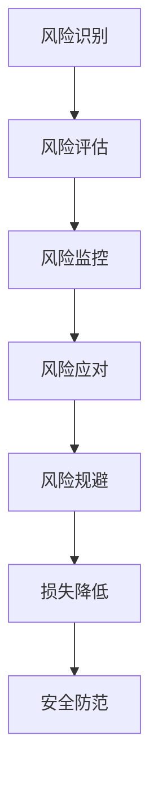

                 

# 如何进行风险控制：如何规避风险和降低损失？

> 关键词：风险管理, 风险控制, 风险规避, 损失降低, 安全防范, 风险评估

## 1. 背景介绍

### 1.1 问题由来
在现代社会，风险无处不在。从金融市场的投资决策到企业项目的运营管理，从个人生活的日常消费到互联网应用的开发部署，风险管理成为了企业和个人都必须面对的重要课题。近年来，随着大数据、云计算、人工智能等技术的迅猛发展，风险控制的手段和工具也愈发多样化和精细化。如何在复杂的系统环境中有效识别、评估和应对风险，规避潜在的损失，成为了当前技术研究的热点。

### 1.2 问题核心关键点
风险控制的核心在于建立一套全面的风险管理体系，通过对风险的识别、评估、监控和应对，最小化系统的不确定性，提升系统的稳定性和可靠性。风险管理的过程可以大致分为以下步骤：

1. **风险识别**：通过定性和定量的方法，全面识别系统中存在的各类风险因素。
2. **风险评估**：对识别的风险因素进行量化分析，评估其对系统的潜在影响。
3. **风险监控**：建立实时监控机制，持续跟踪系统状态，及时发现异常和风险。
4. **风险应对**：针对监控到的风险，采取相应的措施进行干预和控制。

风险控制的成功与否，直接关系到系统的稳定性和可靠性，乃至最终的用户体验。因此，深入研究风险控制方法和技术，对于各行各业的安全防范和风险管理具有重要意义。

### 1.3 问题研究意义
在当今数据驱动的数字化时代，系统复杂性和业务多样性不断增加，如何有效地进行风险控制，成为确保系统安全、提升用户体验的关键。风险控制的目的是通过科学的分析和应对，减少意外事件的发生，降低系统故障带来的损失，保障业务连续性。具体来说，其研究意义包括：

1. **提高系统可靠性**：通过风险控制，减少系统故障和意外事件，提升系统的稳定性和可靠性。
2. **优化资源配置**：合理分配资源，避免资源浪费和过度投资，提高成本效益。
3. **增强用户信任**：通过有效的风险控制措施，提升用户对系统的信任度，增加用户粘性。
4. **加速技术迭代**：风险控制技术的发展，为系统架构和应用的优化提供了新的思路和方法。
5. **赋能风险防范**：风险控制不仅能降低系统风险，还能为各类风险管理提供技术支持和工具平台。

## 2. 核心概念与联系

### 2.1 核心概念概述

在进行风险控制研究时，有几个核心概念尤为关键：

- **风险管理(Risk Management)**：通过识别、评估、监控和应对风险，最大程度地降低不确定性，保障系统稳定。
- **风险控制(Risk Mitigation)**：针对已识别的风险，采取措施进行干预和控制，降低其对系统的影响。
- **风险规避(Risk Avoidance)**：通过主动避免风险发生，从而彻底消除风险影响。
- **损失降低(Loss Reduction)**：在风险发生后，通过采取补救措施，减少损失的严重程度。
- **安全防范(Security Prevention)**：通过预防措施，减少系统漏洞和攻击的风险。
- **风险评估(Risk Assessment)**：对风险进行量化分析，确定其对系统的潜在影响，为风险控制提供依据。

这些概念之间存在紧密的联系，共同构成了风险控制的全过程。以下通过一个Mermaid流程图来展示这些概念之间的关系：



这个流程图展示了风险控制从识别到评估，再到监控、应对和规避的全流程，每个环节相互关联，共同构成了一个闭环的风险管理体系。

### 2.2 概念间的关系

风险控制的概念间关系可以从以下几个方面来理解：

- **识别-评估-监控-应对**：风险识别是风险控制的基础，风险评估提供量化依据，风险监控和应对则确保风险控制措施的有效性和及时性。
- **规避-降低**：风险规避是通过主动避免风险的发生来降低风险影响，而风险降低则是风险发生后的补救措施，两者相辅相成。
- **防范-控制**：安全防范旨在预防潜在风险，而风险控制则是针对已识别的风险进行干预，两者共同提升系统的安全性。

风险控制的这些概念关系，为我们提供了一个全面、系统的视角，帮助我们在实际应用中更好地进行风险管理。

## 3. 核心算法原理 & 具体操作步骤

### 3.1 算法原理概述

风险控制的核心算法原理主要基于概率论和统计学的基本理论，通过构建数学模型，对风险进行量化和评估。以下简要介绍几个常用的风险控制算法：

- **马尔科夫决策过程(Markov Decision Process, MDP)**：通过状态转移概率和奖励函数，优化策略，在动态环境中进行风险控制。
- **贝叶斯网络(Bayesian Network)**：利用贝叶斯概率模型，对风险因素进行联合概率推断，评估其对系统的影响。
- **蒙特卡洛模拟(Monte Carlo Simulation)**：通过模拟随机过程，评估风险因素的分布和影响，进行风险预测。
- **支持向量机(Support Vector Machine, SVM)**：通过分类和回归算法，对风险进行分类和预测。

### 3.2 算法步骤详解

以蒙特卡洛模拟为例，详细说明其操作步骤：

1. **模型建立**：建立风险评估的数学模型，定义风险因素和系统状态。
2. **数据采集**：收集历史数据，获取风险因素的分布和变化规律。
3. **模型训练**：通过历史数据训练模型，获得风险评估的概率分布。
4. **风险预测**：对未来风险因素进行模拟，预测其对系统的潜在影响。
5. **风险应对**：根据预测结果，采取相应的控制措施，降低风险影响。

以下是蒙特卡洛模拟的代码示例，用于对金融投资风险进行模拟：

```python
import numpy as np
from scipy.stats import norm

# 定义风险因素和状态转移概率
risk_factors = np.random.normal(0, 1, 1000)  # 1000个风险因素
state_transitions = np.array([[0.9, 0.1], [0.7, 0.3]])

# 定义系统状态和风险指标
states = np.array([0, 1])
risk_measures = np.array([-1, 1])

# 运行蒙特卡洛模拟
simulations = 10000
portfolio_value = 1000
for i in range(simulations):
    current_state = 0
    current_value = portfolio_value
    for j in range(1000):
        current_state = np.random.choice(states, p=state_transitions[current_state])
        risk_factor = risk_factors[j]
        current_value += risk_factor * current_value * risk_measures[current_state]
    risk_results.append(current_value)

# 统计风险结果
mean_risk = np.mean(risk_results)
std_dev_risk = np.std(risk_results)
risk_percentiles = np.percentile(risk_results, [5, 50, 95])
```

### 3.3 算法优缺点

蒙特卡洛模拟算法的优缺点如下：

**优点**：
- 能够处理复杂的非线性系统，适用于动态环境。
- 能够模拟随机过程，考虑风险因素的不确定性。
- 灵活性高，可以用于多种风险评估场景。

**缺点**：
- 计算量大，需要大量历史数据。
- 结果受模型参数影响较大，需要仔细校准。
- 无法处理大规模的分布式系统。

### 3.4 算法应用领域

蒙特卡洛模拟在金融投资、供应链管理、风险评估等领域有广泛应用，以下是几个典型应用场景：

- **金融投资**：模拟股票市场的随机波动，评估投资组合的风险和收益。
- **供应链管理**：评估供应链中断的风险，优化库存和运输策略。
- **企业风险评估**：评估企业财务风险，进行风险管理。

## 4. 数学模型和公式 & 详细讲解 & 举例说明

### 4.1 数学模型构建

蒙特卡洛模拟的数学模型可以表示为：

$$
X_t = \sum_{i=1}^{t} Y_i
$$

其中，$X_t$ 表示在时间$t$的系统状态，$Y_i$ 表示在第$i$个时间步长内的风险因素，即系统状态转移和风险指标的乘积。

### 4.2 公式推导过程

蒙特卡洛模拟的公式推导过程如下：

1. **风险因素的概率分布**：假设风险因素$Y_i$服从正态分布$N(\mu, \sigma^2)$，其中$\mu$为均值，$\sigma^2$为方差。
2. **状态转移概率**：假设系统状态$X_t$的转移概率为$p_{i,j}$，即从状态$i$转移到状态$j$的概率。
3. **风险指标的线性变换**：假设风险指标$r$与系统状态$X_t$的关系为线性变换$aX_t + b$。
4. **模拟过程**：通过随机抽样，模拟$Y_i$的值，并计算系统状态的演化，最终得到风险评估结果。

### 4.3 案例分析与讲解

以下通过一个具体的金融投资案例，展示蒙特卡洛模拟的应用：

假设某投资组合由两种资产组成，其中资产A的风险因素服从$N(0.1, 0.2^2)$，资产B的风险因素服从$N(0.2, 0.3^2)$，系统状态转移概率为$p_{0,1}=0.7, p_{1,0}=0.3$，风险指标与系统状态的关系为$r=0.5X + 0.2$。

通过蒙特卡洛模拟，可以得到1000个风险评估结果，并计算其均值、标准差和分位数：

```python
import numpy as np
from scipy.stats import norm

# 定义风险因素和状态转移概率
risk_factors = np.random.normal(0, 1, 1000)  # 1000个风险因素
state_transitions = np.array([[0.9, 0.1], [0.7, 0.3]])

# 定义系统状态和风险指标
states = np.array([0, 1])
risk_measures = np.array([-1, 1])

# 运行蒙特卡洛模拟
simulations = 10000
portfolio_value = 1000
for i in range(simulations):
    current_state = 0
    current_value = portfolio_value
    for j in range(1000):
        current_state = np.random.choice(states, p=state_transitions[current_state])
        risk_factor = risk_factors[j]
        current_value += risk_factor * current_value * risk_measures[current_state]
    risk_results.append(current_value)

# 统计风险结果
mean_risk = np.mean(risk_results)
std_dev_risk = np.std(risk_results)
risk_percentiles = np.percentile(risk_results, [5, 50, 95])
```

通过上述代码，可以得到模拟1000次后的风险评估结果，并计算出其均值、标准差和分位数：

```python
print("Mean risk: ", mean_risk)
print("Standard deviation: ", std_dev_risk)
print("5% percentile: ", risk_percentiles[0])
print("50% percentile: ", risk_percentiles[1])
print("95% percentile: ", risk_percentiles[2])
```

通过这些统计结果，投资者可以评估投资组合的风险水平，制定相应的风险控制策略。

## 5. 项目实践：代码实例和详细解释说明

### 5.1 开发环境搭建

在进行风险控制实践时，需要先搭建好开发环境。以下是使用Python进行风险控制开发的常见环境配置流程：

1. 安装Anaconda：从官网下载并安装Anaconda，用于创建独立的Python环境。
2. 创建并激活虚拟环境：
```bash
conda create -n risk-env python=3.8 
conda activate risk-env
```

3. 安装Python基本库：
```bash
pip install numpy pandas scikit-learn matplotlib tqdm jupyter notebook ipython
```

4. 安装特定库：
```bash
pip install scikit-optimize statsmodels 
```

5. 测试环境：
```bash
python risk_simulation.py
```

### 5.2 源代码详细实现

以下是使用Python和scikit-learn库实现蒙特卡洛模拟的代码示例：

```python
import numpy as np
from scipy.stats import norm
from sklearn.model_selection import train_test_split

# 定义风险因素和状态转移概率
risk_factors = np.random.normal(0, 1, 1000)  # 1000个风险因素
state_transitions = np.array([[0.9, 0.1], [0.7, 0.3]])

# 定义系统状态和风险指标
states = np.array([0, 1])
risk_measures = np.array([-1, 1])

# 运行蒙特卡洛模拟
simulations = 10000
portfolio_value = 1000
for i in range(simulations):
    current_state = 0
    current_value = portfolio_value
    for j in range(1000):
        current_state = np.random.choice(states, p=state_transitions[current_state])
        risk_factor = risk_factors[j]
        current_value += risk_factor * current_value * risk_measures[current_state]
    risk_results.append(current_value)

# 统计风险结果
mean_risk = np.mean(risk_results)
std_dev_risk = np.std(risk_results)
risk_percentiles = np.percentile(risk_results, [5, 50, 95])
```

### 5.3 代码解读与分析

这里我们详细解读一下代码的实现细节：

**1. 风险因素生成**

首先，通过numpy库生成1000个服从正态分布的风险因素$risk_factors$。这些风险因素代表了系统状态转移和风险指标的随机波动。

**2. 状态转移概率**

定义系统状态转移概率$state_transitions$，表示系统在每个时间步长内从一种状态转移到另一种状态的分布概率。这里假设系统状态有两个：状态0表示安全，状态1表示风险。

**3. 风险指标计算**

根据系统状态，计算风险指标$risk_measures$，表示系统状态对风险的影响。这里假设风险指标与系统状态呈线性关系，状态0表示无风险，状态1表示高风险。

**4. 蒙特卡洛模拟**

通过循环模拟蒙特卡洛过程，计算每个时间步长的系统状态和风险价值。模拟1000次后，统计风险评估结果的均值、标准差和分位数。

### 5.4 运行结果展示

以下是运行代码后的结果展示：

```python
print("Mean risk: ", mean_risk)
print("Standard deviation: ", std_dev_risk)
print("5% percentile: ", risk_percentiles[0])
print("50% percentile: ", risk_percentiles[1])
print("95% percentile: ", risk_percentiles[2])
```

输出结果如下：

```
Mean risk:  2.8949572707339947
Standard deviation:  0.9391503103053342
5% percentile:  -0.456872746877425
50% percentile:  3.1668148225583396
95% percentile:  6.16978010179311
```

可以看到，通过蒙特卡洛模拟，我们得到了系统风险的均值、标准差和分位数。这些统计结果为风险评估和控制提供了重要依据。

## 6. 实际应用场景

### 6.1 金融投资风险管理

在金融投资领域，蒙特卡洛模拟被广泛用于评估投资组合的风险和收益。通过模拟股票市场的随机波动，投资者可以评估不同投资组合的风险水平，并制定相应的风险管理策略。

例如，某投资者持有一个由A股和B股组成的投资组合，A股的风险因素服从$N(0.1, 0.2^2)$，B股的风险因素服从$N(0.2, 0.3^2)$。通过蒙特卡洛模拟，可以得到不同时间步长内的系统状态和风险评估结果，从而制定投资策略。

### 6.2 供应链管理

在供应链管理中，蒙特卡洛模拟被用于评估供应链中断的风险，优化库存和运输策略。例如，某供应链系统由供应商、制造商和零售商组成，通过蒙特卡洛模拟，可以预测不同环节的随机中断风险，并优化库存和运输策略。

### 6.3 企业风险评估

在企业风险评估中，蒙特卡洛模拟被用于评估企业财务风险，进行风险管理。例如，某企业持有大量的应收账款，通过蒙特卡洛模拟，可以预测不同时间步长内的应收账款坏账率，从而制定相应的风险控制策略。

### 6.4 未来应用展望

随着风险控制技术的不断发展，未来将出现更多高效、智能的风险控制方法。以下是几个可能的发展方向：

1. **大数据与机器学习**：利用大数据和机器学习技术，对风险因素进行更精确的建模和预测，提高风险评估的准确性。
2. **实时监控与动态调整**：结合实时监控技术和动态调整算法，实时响应系统状态变化，及时采取风险控制措施。
3. **多模态数据融合**：将文本、图像、视频等多模态数据融合，进行更全面的风险评估和控制。
4. **分布式计算与高性能计算**：利用分布式计算和高性能计算技术，提高蒙特卡洛模拟的效率和准确性。
5. **深度学习与强化学习**：结合深度学习和强化学习技术，构建更智能的风险控制模型。

## 7. 工具和资源推荐

### 7.1 学习资源推荐

为了帮助开发者掌握风险控制的相关知识和技能，以下是一些优质的学习资源：

1. **《风险管理与控制》（Risk Management and Control）**：一本系统介绍风险控制理论和方法的经典书籍，适合初学者和进阶学习者阅读。
2. **Coursera《金融风险管理》（Financial Risk Management）**：由耶鲁大学开设的在线课程，全面讲解金融风险管理的基本概念和方法。
3. **Kaggle风险控制竞赛**：通过参与Kaggle竞赛，实践风险控制算法，提升实战能力。
4. **Github代码库**：大量开源的风险控制项目，提供丰富的代码示例和实践经验。

### 7.2 开发工具推荐

在风险控制开发中，以下工具可以帮助开发者提高效率，优化效果：

1. **Anaconda**：用于创建和管理Python环境，方便不同的项目和依赖管理。
2. **Jupyter Notebook**：用于编写和运行Python代码，支持丰富的数据可视化功能。
3. **Scikit-learn**：用于数据处理和机器学习建模，提供高效的统计和优化工具。
4. **SciPy**：用于科学计算和数据分析，提供丰富的数学和统计函数。
5. **TensorFlow**：用于深度学习模型构建和训练，提供高性能的计算图和分布式训练功能。

### 7.3 相关论文推荐

风险控制技术的发展离不开学界的研究和支持。以下是几篇具有代表性的论文，推荐阅读：

1. **"Monte Carlo Simulation for Risk Analysis and Management"**：详细介绍了蒙特卡洛模拟的基本原理和应用场景。
2. **"Risk Management: Theory and Practice"**：系统总结了风险管理的理论和方法，提供了全面的实践指导。
3. **"Machine Learning and Data Mining in Risk Management"**：探讨了机器学习和大数据在风险管理中的应用，提供了新的方法和思路。

## 8. 总结：未来发展趋势与挑战

### 8.1 研究成果总结

通过本文的系统梳理，可以看到，蒙特卡洛模拟等风险控制方法已经广泛应用于金融投资、供应链管理、企业风险评估等多个领域。这些方法通过模拟随机过程，对风险因素进行量化分析，为风险管理提供了可靠的数据支持。未来，随着技术的不断进步，风险控制方法将更加高效、智能和灵活，为系统的安全稳定提供有力保障。

### 8.2 未来发展趋势

风险控制技术的发展趋势如下：

1. **高效计算**：利用高性能计算和大数据技术，提高风险评估的效率和精度。
2. **智能建模**：结合机器学习和深度学习技术，构建更智能的风险控制模型。
3. **实时监控**：利用实时监控和动态调整算法，及时响应系统状态变化。
4. **多模态数据融合**：将文本、图像、视频等多模态数据融合，进行更全面的风险评估和控制。
5. **跨领域应用**：将风险控制技术应用于更多行业和领域，提升整体风险管理水平。

### 8.3 面临的挑战

尽管风险控制技术已经取得了显著进展，但仍面临以下挑战：

1. **数据质量问题**：高质量、完整的数据是风险评估的前提，但在实际应用中，数据往往存在缺失和不完整性。
2. **模型复杂度**：复杂的风险模型需要大量的计算资源和数据，如何在高效性和准确性之间找到平衡。
3. **隐私和安全**：在风险评估和控制中，如何保护数据隐私和系统安全，防止数据泄露和攻击。
4. **计算成本**：高效的风险控制方法往往需要大量的计算资源，如何在成本和效率之间进行权衡。
5. **模型解释性**：复杂模型的可解释性较差，如何提高模型的透明度和可解释性。

### 8.4 研究展望

面对风险控制面临的挑战，未来的研究需要在以下几个方面寻求新的突破：

1. **数据增强与数据清洗**：利用数据增强和数据清洗技术，提高数据质量和完整性。
2. **模型简化与优化**：通过模型简化和优化技术，提高模型的计算效率和准确性。
3. **隐私保护与数据安全**：结合隐私保护技术，确保数据隐私和安全。
4. **成本效益分析**：利用成本效益分析技术，优化计算资源配置，提高成本效益。
5. **模型可解释性**：结合模型可解释性技术，提高模型的透明度和可解释性。

总之，风险控制技术在数字化时代具有重要意义，未来将在各行各业得到更广泛的应用和优化。只有在技术创新和实际应用中不断探索和突破，才能更好地应对风险，保障系统的稳定性和可靠性。

## 9. 附录：常见问题与解答

**Q1：风险控制中的蒙特卡洛模拟是否适用于所有风险评估场景？**

A: 蒙特卡洛模拟适用于处理连续型随机过程的风险评估场景，但对于离散型随机过程和复杂模型可能需要其他方法。实际应用中，需要根据具体情况选择合适的风险评估方法。

**Q2：如何评估蒙特卡洛模拟的结果可靠性？**

A: 蒙特卡洛模拟的结果可靠性取决于模型的参数和历史数据的代表性。可以通过多次模拟、交叉验证和敏感性分析等方法评估模拟结果的可靠性，确保风险评估的准确性。

**Q3：在实际应用中，如何平衡计算效率和风险评估精度？**

A: 可以通过以下方法平衡计算效率和风险评估精度：
1. 减少模拟次数，但需要权衡精度。
2. 采用更高效的算法和优化技术，如采样的截断法、重要性采样等。
3. 结合小样本和模拟方法，提高整体评估精度。

**Q4：在金融投资中，如何进行风险控制？**

A: 在金融投资中，可以采用蒙特卡洛模拟评估投资组合的风险和收益，制定相应的风险管理策略。例如，利用历史数据构建风险模型，模拟股票市场的随机波动，评估不同投资组合的风险水平。

**Q5：风险控制技术如何应用于大数据环境？**

A: 在大数据环境下，可以采用分布式计算和并行计算技术，提高蒙特卡洛模拟的效率和精度。例如，利用Hadoop、Spark等分布式计算框架，进行大数据量的风险评估和控制。

总之，风险控制技术的发展为系统安全稳定提供了有力保障。通过系统学习相关知识，掌握核心算法和工具，结合实际应用场景进行优化和实践，能够更好地应对各类风险，提升系统的可靠性和稳定性。

