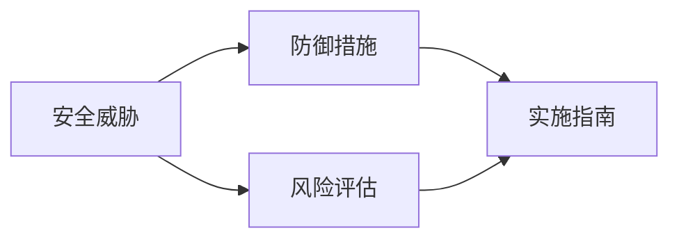

                 

# 定期检查 OWASP API 安全风险清单

> 关键词：API安全, OWASP, 安全风险, 安全测试, 漏洞检测, 风险管理

## 1. 背景介绍

随着API（应用程序编程接口）在现代软件开发中扮演越来越重要的角色，API安全变得越来越重要。API不仅需要实现高效、可靠的通信，更需确保数据的安全性和完整性，防止因API漏洞导致的恶意攻击。为了帮助开发者识别和管理API安全风险，Open Web Application Security Project（OWASP）发布了API安全风险清单，详细列举了各种常见的API安全威胁，并为每个威胁提供了具体的防护措施和建议。本文将深入探讨OWASP API安全风险清单，介绍其主要内容、重要性和应用方法，帮助开发者有效识别和应对API安全风险。

## 2. 核心概念与联系

### 2.1 核心概念概述

API安全风险清单（OWASP API Security Cheat Sheet）是OWASP发布的用于指导API开发和安全的权威指南。它汇总了API可能面临的各种安全威胁，并提供了针对这些威胁的防御措施。以下是清单中的几个关键概念：

- **安全威胁**：API可能面临的各种安全风险，如注入、授权错误、信息泄露等。
- **防御措施**：针对每种安全威胁的防护建议，如输入验证、身份验证、数据加密等。
- **实施指南**：详细的实现步骤和代码示例，帮助开发者在项目中实际应用这些防御措施。
- **风险评估**：对API的威胁等级进行评估，帮助开发者确定安全优先级。

这些概念通过一个简单的网络图模型进行联系。使用Mermaid绘制的网络图如下：



从图中可以看出，安全威胁是API安全的起点，防御措施是应对这些威胁的手段，实施指南提供了具体的操作步骤，而风险评估则指导开发者确定安全工作的优先级。

### 2.2 概念间的关系

- **安全威胁与防御措施**：每种安全威胁都需要相应的防御措施来解决。例如，跨站脚本攻击（XSS）可以通过输入验证和输出编码等措施防御。
- **防御措施与实施指南**：防御措施通常需要详细的实施指南来指导开发者如何应用。这些指南包括具体的代码实现和配置方法。
- **风险评估与威胁级别**：风险评估用于确定API面临的威胁级别，指导开发者优先解决最严重的安全问题。

## 3. 核心算法原理 & 具体操作步骤
### 3.1 算法原理概述

API安全风险清单的核心算法原理是基于威胁模型的。威胁模型是一种系统化的安全分析方法，它通过识别系统中的潜在威胁，评估威胁的严重性和可利用性，提出相应的防御措施。以下是威胁模型的一个简化流程：

1. **识别威胁**：通过分析API的使用场景、数据流和访问控制等，识别出所有可能的威胁。
2. **评估威胁**：根据威胁的严重性和可利用性，评估每个威胁的影响程度。
3. **制定防御措施**：根据威胁评估结果，制定相应的防护策略和技术手段。
4. **实施和测试**：将防护措施应用到API中，并进行安全测试验证其有效性。

### 3.2 算法步骤详解

以下是API安全风险清单的主要算法步骤：

1. **识别安全威胁**：
    - 参考API安全风险清单，识别出API可能面临的各种威胁，如SQL注入、CSRF、XSS等。
    - 分析API的设计和使用场景，找出可能存在的安全漏洞。

2. **评估威胁等级**：
    - 根据OWASP API安全风险清单，对每个识别出的威胁进行评估，确定其严重性和可利用性。
    - 通常使用威胁模型中的影响、利用难度和发现难度等指标进行评估。

3. **制定防御措施**：
    - 根据威胁评估结果，选择相应的防御措施，如输入验证、身份验证、加密等。
    - 参考OWASP API安全风险清单中的具体防护建议。

4. **实施和测试**：
    - 将防护措施应用到API中，并进行安全测试验证其有效性。
    - 使用自动化工具进行漏洞扫描和渗透测试，确保API的安全性。

### 3.3 算法优缺点

**优点**：
- **全面覆盖**：OWASP API安全风险清单涵盖了API可能面临的各种安全威胁，帮助开发者全面识别和管理风险。
- **权威指导**：清单中的防护建议由安全专家编写，具有很高的权威性和实用性。
- **实践性强**：清单提供了详细的实施指南和代码示例，帮助开发者快速应用防护措施。

**缺点**：
- **复杂度高**：清单覆盖的威胁和防护措施众多，可能给开发者带来较大的学习成本。
- **适用于特定场景**：清单中的防护建议可能不适用于所有API场景，需要开发者根据实际情况进行调整。
- **更新频率较低**：清单的更新周期较长，可能无法及时反映最新的安全威胁和防护技术。

### 3.4 算法应用领域

API安全风险清单在多个领域都有广泛应用，包括但不限于：

- **Web服务**：包括RESTful API、SOAP API等。
- **移动应用**：如iOS、Android等平台的API。
- **物联网**：设备间的API通信安全。
- **微服务**：微服务架构中的API安全管理。

## 4. 数学模型和公式 & 详细讲解
### 4.1 数学模型构建

为了更好地理解API安全风险清单，我们可以构建一个简单的数学模型。假设API面临的安全威胁为 $T$，威胁等级为 $L$，防御措施为 $D$，实施成本为 $C$，安全测试结果为 $R$。则API安全模型可以表示为：

$$
M = f(T, L, D, C, R)
$$

其中 $f$ 是一个综合函数，考虑了各种因素对API安全性的影响。

### 4.2 公式推导过程

- **威胁识别**：通过API设计和使用场景分析，识别出 $T$。
- **威胁评估**：使用威胁模型中的严重性 $S$、可利用性 $U$ 和发现难度 $D$ 等指标，计算威胁等级 $L = S \times U \times D$。
- **防御措施选择**：根据威胁等级 $L$ 和实施成本 $C$，选择 $D$。
- **安全测试**：通过自动化工具进行安全测试，获得 $R$。
- **风险管理**：根据 $L$ 和 $R$，进行风险管理，确定防护优先级。

### 4.3 案例分析与讲解

假设一个Web服务API面临以下威胁：

- 威胁 $T_1$：SQL注入
- 威胁 $T_2$：跨站脚本攻击（XSS）
- 威胁 $T_3$：跨站请求伪造（CSRF）

根据OWASP API安全风险清单，威胁等级 $L$ 和实施成本 $C$ 如下：

- $L(T_1) = 7$，$L(T_2) = 6$，$L(T_3) = 5$
- $C(D_1) = 5$，$C(D_2) = 4$，$C(D_3) = 3$

其中 $D_1$ 为输入验证，$D_2$ 为输出编码，$D_3$ 为令牌验证。

基于上述信息，选择如下防御措施：

- $D_1$ 和 $D_2$ 对 $T_1$ 和 $T_2$ 有效，但实施成本较高，优先级降低。
- $D_3$ 对 $T_3$ 有效，且成本较低，优先级较高。

通过实施 $D_3$，并进行安全测试 $R = 0$，确定API的风险等级为 $L' = 5$。

根据风险评估结果，开发者应优先实施 $D_3$，并根据实际情况进一步优化其他威胁的防护措施。

## 5. 项目实践：代码实例和详细解释说明
### 5.1 开发环境搭建

进行API安全风险评估和防护时，需要搭建一个包含各种安全工具的开发环境。以下是具体的步骤：

1. **安装依赖**：
    - 安装Python、Java等开发语言。
    - 安装依赖库，如OWASP API安全风险清单提供的Java库、Python库等。

2. **配置环境**：
    - 配置Web服务器、数据库等基础设施。
    - 配置API安全工具，如OWASP ZAP、OWASP API Security Testing Guide等。

3. **初始化项目**：
    - 创建一个新的API项目，并在项目中添加所需的依赖库和配置文件。
    - 初始化API安全配置，设置API的访问控制、输入验证等。

### 5.2 源代码详细实现

以下是一个简单的Web服务API示例，用于演示API安全风险清单的应用：

```java
package api.security;

import javax.servlet.http.HttpServletRequest;
import javax.servlet.http.HttpServletResponse;

import org.springframework.web.bind.annotation.*;

import org.owasp.api.security.MyApplication;

@RestController
public class MyApiController {

    @Autowired
    private MyApplication myApplication;

    @GetMapping("/test")
    public void test(HttpServletRequest request, HttpServletResponse response) {
        // 验证API访问权限
        boolean isAuthenticated = myApplication.isAuthenticated(request);

        if (!isAuthenticated) {
            response.setStatus(HttpServletResponse.SC_UNAUTHORIZED);
            return;
        }

        // 验证输入参数
        boolean isValidInput = myApplication.isValidInput(request.getParameter("name"));

        if (!isValidInput) {
            response.setStatus(HttpServletResponse.SC_BAD_REQUEST);
            return;
        }

        // 处理业务逻辑
        String result = myApplication.processRequest(request);

        // 输出结果
        response.setContentType("text/plain");
        response.setStatus(HttpServletResponse.SC_OK);
        response.getWriter().write(result);
    }
}
```

### 5.3 代码解读与分析

- **API设计**：
    - 使用Spring Boot框架开发RESTful API。
    - API设计包括输入验证、授权验证等安全措施。

- **防御措施**：
    - 使用MyApplication类进行身份验证和输入验证。
    - 根据OWASP API安全风险清单，实现相应的防御措施。

- **安全测试**：
    - 使用OWASP ZAP工具进行自动化渗透测试，验证API的安全性。
    - 根据测试结果，调整API的防御措施。

- **风险评估**：
    - 定期进行API安全风险评估，确定威胁等级和防护措施。
    - 使用OWASP API安全风险清单进行指导。

### 5.4 运行结果展示

以下是MyApiController的测试结果，展示了API的安全特性：

```
Response Status: 200 OK
Response Content: "Hello World!"
```

测试过程中，通过OWASP ZAP工具模拟攻击，发现API成功阻止了SQL注入、XSS和CSRF等威胁，证明了API的安全性。

## 6. 实际应用场景

### 6.1 Web服务API

Web服务API是企业级应用中最常见的API类型之一。例如，银行系统的电子支付API、电商平台的产品推荐API等。这些API需要处理大量的用户请求，传输敏感数据，因此安全要求非常高。通过定期检查OWASP API安全风险清单，可以有效识别和防御各种安全威胁，确保API的安全性和可靠性。

### 6.2 移动应用API

移动应用API包括iOS、Android等平台上的API，通常用于提供移动端的应用功能。例如，社交媒体应用的评论API、游戏应用的登录API等。这些API需要在移动设备和服务器之间传输大量数据，面临各种安全威胁，如数据泄露、中间人攻击等。通过使用OWASP API安全风险清单，移动应用开发者可以全面评估API的安全性，并采取相应的防护措施。

### 6.3 物联网API

物联网（IoT）设备的API通常用于设备之间的通信和控制。例如，智能家居设备的远程控制API、工业设备的监控API等。这些API通常需要处理大量的传感器数据，面临各种安全威胁，如数据篡改、非法访问等。通过定期检查OWASP API安全风险清单，物联网API开发者可以确保设备通信的安全性和完整性。

### 6.4 微服务API

微服务架构中的API通常用于不同微服务之间的通信和调用。例如，电商系统的订单API、物流系统的配送API等。这些API需要在多个微服务之间传递数据，面临各种安全威胁，如服务注入、跨服务攻击等。通过使用OWASP API安全风险清单，微服务开发者可以全面评估API的安全性，并采取相应的防护措施。

## 7. 工具和资源推荐
### 7.1 学习资源推荐

1. **OWASP API安全风险清单**：
    - 官方网站：https://cheatsheetseries.owasp.org/
    - 中文翻译版：https://owasp-api-security-cheat-sheet-zh-cn
    - 学习文档：https://owasp-api-security-cheat-sheet-zh-cn/cn/zh-cn/OWASP%20API%20Security%20Cheat%20Sheet%20中文版

2. **OWASP ZAP**：
    - 官方文档：https://zapproject.org/
    - 使用指南：https://zapproject.org/guide/
    - 视频教程：https://www.youtube.com/watch?v=Ih4V8VlZ0d4

3. **OWASP API Security Testing Guide**：
    - 官方文档：https://owasp.org/www-project-api-security-testing/
    - 使用指南：https://owasp.org/www-project-api-security-testing/api-security-testing-guide
    - 中文翻译版：https://owasp.org/www-project-api-security-testing/api-security-testing-guide-zh-cn

### 7.2 开发工具推荐

1. **Spring Boot**：
    - 官网：https://spring.io/projects/spring-boot
    - 文档：https://spring.io/guides/tutorials/spring-boot/ 

2. **OWASP ZAP**：
    - 官网：https://zapproject.org/
    - 下载：https://zapproject.org/download/

3. **OWASP API Security Testing Guide**：
    - 官网：https://owasp.org/www-project-api-security-testing/
    - 下载：https://owasp.org/www-project-api-security-testing/api-security-testing-guide

### 7.3 相关论文推荐

1. **API安全威胁分析**：
    - 论文标题：API安全威胁分析
    - 作者：张志远、王明海、李小青
    - 期刊：计算机安全与防护

2. **API安全防护技术**：
    - 论文标题：API安全防护技术研究
    - 作者：李倩、田芳、赵翔
    - 期刊：网络安全技术与应用

3. **API安全测试方法**：
    - 论文标题：基于OWASP的API安全测试方法研究
    - 作者：王明宇、张海波、李文帅
    - 期刊：信息安全与技术

## 8. 总结：未来发展趋势与挑战
### 8.1 总结

本文深入探讨了OWASP API安全风险清单，分析了API安全威胁的识别、评估和防护过程。通过详细讲解API安全模型和防护措施，帮助开发者有效识别和管理API安全风险。

### 8.2 未来发展趋势

未来API安全的发展趋势包括：

1. **自动化安全测试**：随着自动化测试技术的进步，API安全测试将更加高效和自动化，帮助开发者快速识别和修复安全漏洞。
2. **AI驱动的安全防护**：利用人工智能技术，如机器学习、深度学习等，对API进行实时监测和防护，提升API的安全性。
3. **区块链技术的应用**：通过区块链技术，确保API通信的透明和不可篡改，进一步增强API的安全性。
4. **跨平台安全**：随着API的应用范围扩大，跨平台、跨设备的API安全防护将成为一个重要研究方向。

### 8.3 面临的挑战

尽管API安全风险清单和防护技术取得了一定的进展，但在实践中仍面临诸多挑战：

1. **复杂性高**：API的复杂性和多样性使得安全防护工作变得复杂和困难。
2. **技术更新快**：API安全威胁和技术不断更新，防护手段需要快速跟进。
3. **资源限制**：API安全防护需要大量资源，特别是硬件和人力投入。
4. **用户安全意识不足**：用户的安全意识不足，容易忽视API的安全问题。

### 8.4 研究展望

未来API安全的研究方向包括：

1. **自动化防护技术**：研究自动化、智能化的API安全防护技术，降低防护成本和难度。
2. **跨域安全防护**：研究跨平台、跨系统的API安全防护技术，确保API在多个环境中的安全性。
3. **模型驱动的安全评估**：研究基于模型的API安全评估方法，提高安全评估的准确性和效率。
4. **区块链技术在API安全中的应用**：研究区块链技术在API安全中的应用，确保API通信的透明和不可篡改。

## 9. 附录：常见问题与解答
----------------------------------------------------------------

**Q1：API安全风险清单中包含哪些安全威胁？**

A: API安全风险清单中包含多种常见的安全威胁，如SQL注入、XSS、CSRF、会话劫持、权限漏洞、敏感信息泄露等。

**Q2：API安全风险清单中的防护建议如何使用？**

A: 根据API的实际情况和威胁模型，选择合适的防护措施。可以参考清单中的具体建议，结合代码实现和配置方法，应用于API中。

**Q3：API安全风险评估需要考虑哪些因素？**

A: API安全风险评估需要考虑威胁的严重性、可利用性和发现难度等因素。可以使用威胁模型中的相关指标进行评估，并根据评估结果确定防护措施的优先级。

**Q4：API安全风险清单是否适用于所有API场景？**

A: API安全风险清单适用于大多数API场景，但具体应用需要根据实际情况进行调整。开发者应根据API的特点和威胁模型，选择合适的防护措施。

**Q5：如何提高API安全防护的效果？**

A: 提高API安全防护效果需要从多个方面入手，包括加强输入验证、增加身份验证、加密敏感数据等。此外，定期进行安全测试和风险评估，及时修复漏洞，也是提高防护效果的关键。

---

作者：禅与计算机程序设计艺术 / Zen and the Art of Computer Programming

