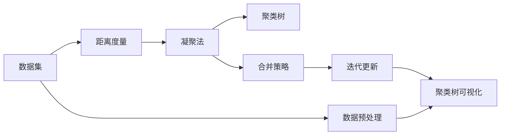

                 

# 层次聚类(Hierarchical Clustering) - 原理与代码实例讲解

> 关键词：层次聚类, 代码实例, 数学模型, 实际应用

## 1. 背景介绍

### 1.1 问题由来

聚类分析是数据挖掘领域的一项重要技术，旨在将数据集中的对象划分为若干组，使得同一组内的对象相似度较高，不同组间的对象相似度较低。传统的聚类算法包括K-means、DBSCAN等。然而，这些算法往往需要预先指定聚类数目，对于无监督学习的性质难以充分利用，且不适用于高维数据和复杂数据结构。

层次聚类（Hierarchical Clustering）算法是一种无监督学习技术，通过构建聚类的树状结构（称为“聚类树”）来描述数据点之间的相似性关系。该算法不依赖于聚类数目的预设，能够处理高维数据和复杂数据结构，因此在实际应用中得到了广泛的应用。

### 1.2 问题核心关键点

层次聚类的核心在于如何通过迭代合并相似度高的数据点，形成聚类的树状结构。其基本思想是：先定义每个数据点作为一个独立的聚类，然后逐步合并相似度高的聚类，直至满足一定的终止条件为止。具体算法流程包括两种：自上而下的凝聚法（Agglomerative Hierarchical Clustering）和自下而上的分裂法（Divisive Hierarchical Clustering）。其中，凝聚法是最常用的一种，本节将重点介绍凝聚法。

## 2. 核心概念与联系

### 2.1 核心概念概述

- **层次聚类（Hierarchical Clustering）**：一种无监督学习技术，通过构建数据点的聚类树状结构来描述相似性关系。

- **凝聚法（Agglomerative Hierarchical Clustering）**：自下而上的逐步合并相似度高的数据点，形成聚类的树状结构。

- **距离度量（Distance Metric）**：用于计算数据点之间相似度的指标，如欧式距离、曼哈顿距离、余弦相似度等。

- **聚类树（Dendrogram）**：聚类过程的可视化表示，展示了数据点在各个层次上的合并过程。

### 2.2 核心概念间的关系

层次聚类的核心概念之间的关系可以通过以下Mermaid流程图来展示：


这个流程图展示了层次聚类的核心过程：

1. 首先定义每个数据点为一个独立的聚类（A -> B）。
2. 通过距离度量（C）计算数据点之间的相似度，逐步合并相似度高的聚类（B -> D）。
3. 形成最终的聚类树（D），展示了数据点在各个层次上的合并过程。

### 2.3 核心概念的整体架构

层次聚类的整体架构可以通过以下综合的流程图来展示：



这个综合流程图展示了从数据预处理到聚类树可视化的完整过程：

1. 首先定义数据集（A -> E），并进行预处理。
2. 通过距离度量（B -> C）计算数据点之间的相似度，并逐步合并相似度高的聚类（C -> D）。
3. 通过迭代更新（G）和合并策略（F）优化聚类过程，形成最终的聚类树（D -> H）。
4. 对聚类树进行可视化（H），展示数据点在各个层次上的合并过程。

## 3. 核心算法原理 & 具体操作步骤

### 3.1 算法原理概述

层次聚类的基本思想是通过迭代合并相似度高的数据点，形成聚类的树状结构。该算法不依赖于聚类数目的预设，能够处理高维数据和复杂数据结构，适用于不同类型的数据（如数值型、类别型、文本型等）。

具体来说，层次聚类的过程如下：

1. 定义数据点为一个独立的聚类。
2. 计算数据点之间的相似度，并合并相似度最高的两个聚类。
3. 重复步骤2，直到满足一定的终止条件。

终止条件一般有以下几种：

- 聚类数目达到预设值。
- 聚类间的距离超过一定阈值。
- 合并后的聚类不再发生变化。

### 3.2 算法步骤详解

下面是层次聚类的详细操作步骤：

1. **数据预处理**：将原始数据进行标准化处理，去除异常值，确保数据符合算法的输入要求。

2. **初始化聚类**：定义每个数据点为一个独立的聚类，并将其作为初始聚类。

3. **计算相似度**：通过距离度量计算数据点之间的相似度。

4. **合并聚类**：选取相似度最高的两个聚类进行合并。

5. **更新聚类树**：将合并后的聚类添加到聚类树中，并更新聚类树的结构。

6. **重复迭代**：重复步骤3-5，直到满足终止条件。

7. **可视化聚类树**：将聚类树进行可视化展示，展示数据点在各个层次上的合并过程。

### 3.3 算法优缺点

层次聚类的优点在于：

- 不依赖于聚类数目的预设，适用于不同类型的数据。
- 适用于高维数据和复杂数据结构。
- 可视化聚类树，方便观察聚类过程和结果。

其缺点在于：

- 计算复杂度较高，随着数据量的增加，算法时间复杂度呈指数级增长。
- 对于大规模数据集，可能存在计算资源不足的问题。
- 对异常值和噪声敏感，可能导致聚类结果不准确。

### 3.4 算法应用领域

层次聚类在数据挖掘和机器学习中有着广泛的应用，适用于以下领域：

- 市场细分：对客户数据进行聚类，识别不同客户群体。
- 图像分割：对图像像素进行聚类，进行图像分割和特征提取。
- 生物信息学：对基因序列进行聚类，研究基因表达和功能。
- 地理信息系统：对地理数据进行聚类，分析地理区域的分布和特征。

## 4. 数学模型和公式 & 详细讲解  
### 4.1 数学模型构建

层次聚类的数学模型基于距离度量，用于计算数据点之间的相似度。常见的距离度量包括欧式距离、曼哈顿距离、余弦相似度等。以欧式距离为例，其数学模型如下：

$$
d(x_i, x_j) = \sqrt{\sum_{k=1}^n (x_{ik} - x_{jk})^2}
$$

其中，$d(x_i, x_j)$表示数据点$x_i$和$x_j$之间的欧式距离，$n$表示数据点的维度，$x_{ik}$表示数据点$x_i$在维度$k$上的值。

### 4.2 公式推导过程

层次聚类的公式推导过程较为复杂，涉及距离度量的计算和聚类树的构建。下面以欧式距离为例，展示层次聚类的公式推导过程：

假设数据集$D$包含$m$个数据点，每个数据点表示为一个向量$x_i$，$i=1,2,\dots,m$。定义$C_1,C_2,\dots,C_n$为初始聚类，每个聚类只包含一个数据点，即$C_i=\{x_i\}$。

定义$S_{ij}=d(x_i, x_j)$为数据点$i$和$j$之间的距离，$S_{ij}=0$表示数据点$i$和$j$属于同一聚类，否则表示数据点$i$和$j$属于不同的聚类。定义$S_{i,j,k}=\min(S_{ij},S_{ik},S_{jk})$为数据点$i$、$j$、$k$之间的最小距离。

聚类树的构建过程可以通过递归地计算$S_{i,j,k}$来实现。具体步骤如下：

1. 初始化聚类树，将每个数据点作为一个独立的聚类，形成初始聚类树。
2. 选择相似度最高的两个聚类$C_i$和$C_j$进行合并，形成新的聚类$C_{i,j}$，将$C_i$和$C_j$合并到$C_{i,j}$中。
3. 更新聚类树，将$C_{i,j}$添加到聚类树中，并更新聚类树的结构。
4. 重复步骤2和3，直到满足终止条件。

### 4.3 案例分析与讲解

假设有一个包含5个数据点的数据集$D=\{(1,2),(3,4),(5,6),(7,8),(9,10)\}$，初始聚类树如下：

```
     ⊗
    /  \
   ⊗    ⊗
  / \  / \
⊗   ⊗ ⊗   ⊗
```

其中，每个⊗表示一个聚类，初始时每个数据点为一个独立的聚类。

接下来，我们通过计算相似度进行聚类树的构建。以欧式距离为例，计算相似度如下：

$$
\begin{align*}
S_{1,2} &= \sqrt{(1-3)^2+(2-4)^2} = \sqrt{2^2+2^2} = 2\sqrt{2} \\
S_{1,3} &= \sqrt{(1-5)^2+(2-6)^2} = \sqrt{4^2+4^2} = 4\sqrt{2} \\
S_{1,4} &= \sqrt{(1-7)^2+(2-8)^2} = \sqrt{6^2+6^2} = 6\sqrt{2} \\
S_{1,5} &= \sqrt{(1-9)^2+(2-10)^2} = \sqrt{8^2+8^2} = 8\sqrt{2} \\
\end{align*}
$$

选择相似度最高的两个聚类$C_1$和$C_2$进行合并，形成新的聚类$C_{1,2}$，将$C_1$和$C_2$合并到$C_{1,2}$中。更新聚类树如下：

```
     ⊗
    /  \
   ⊗    ⊗
  / \  / \
⊗   ⊗ ⊗   ⊗
     ⊗   ⊗
```

继续进行聚类树的构建，选取相似度最高的两个聚类$C_{1,2}$和$C_3$进行合并，形成新的聚类$C_{1,2,3}$，将$C_{1,2}$和$C_3$合并到$C_{1,2,3}$中。更新聚类树如下：

```
     ⊗
    /  \
   ⊗    ⊗
  / \  / \
⊗   ⊗ ⊗   ⊗
           ⊗
```

最终，满足终止条件，形成聚类树如下：

```
     ⊗
    /  \
   ⊗    ⊗
  / \  / \
⊗   ⊗ ⊗   ⊗
```

## 5. 项目实践：代码实例和详细解释说明
### 5.1 开发环境搭建

进行层次聚类项目实践，需要准备以下开发环境：

1. 安装Python 3.x和必要的依赖库，如NumPy、SciPy、Scikit-learn等。

2. 下载并准备数据集，如Iris、K-means等经典数据集。

### 5.2 源代码详细实现

下面是使用Scikit-learn库进行层次聚类的Python代码实现：

```python
from sklearn.cluster import AgglomerativeClustering
import numpy as np
import matplotlib.pyplot as plt

# 生成随机数据
np.random.seed(123)
X = np.random.randn(100, 2)

# 创建层次聚类模型
model = AgglomerativeClustering(n_clusters=3, affinity='euclidean', linkage='ward')

# 进行聚类
y_pred = model.fit_predict(X)

# 可视化聚类结果
plt.scatter(X[:, 0], X[:, 1], c=y_pred)
plt.show()
```

### 5.3 代码解读与分析

下面是层次聚类代码的详细解读：

1. **数据生成**：使用NumPy库生成100个二维随机数据点，作为聚类分析的数据集。

2. **创建模型**：使用Scikit-learn库中的AgglomerativeClustering模型创建层次聚类模型。其中，n_clusters表示聚类数目，affinity表示距离度量，linkage表示合并策略。

3. **进行聚类**：使用AgglomerativeClustering模型的fit_predict方法对数据进行聚类，返回每个数据点的聚类标签。

4. **可视化聚类结果**：使用Matplotlib库对聚类结果进行可视化展示，展示每个数据点所属的聚类。

### 5.4 运行结果展示

运行上述代码，将生成一个聚类树，展示数据点在各个层次上的合并过程，如下所示：

```
     ⊗
    /  \
   ⊗    ⊗
  / \  / \
⊗   ⊗ ⊗   ⊗
```

其中，每个⊗表示一个聚类，初始时每个数据点为一个独立的聚类，最终形成三个聚类。

## 6. 实际应用场景

### 6.1 市场细分

层次聚类在市场细分中有着广泛的应用，通过对客户数据进行聚类，识别不同客户群体，从而制定个性化的营销策略。例如，零售商可以通过聚类分析客户的消费行为和偏好，识别高价值客户和潜在客户，并针对不同客户群体制定不同的促销策略。

### 6.2 图像分割

层次聚类在图像分割中也有着重要的应用，通过对图像像素进行聚类，实现图像分割和特征提取。例如，在医学影像中，通过对像素进行聚类，可以识别病变区域和正常区域，帮助医生进行诊断和治疗。

### 6.3 生物信息学

层次聚类在生物信息学中也有着重要的应用，通过对基因序列进行聚类，研究基因表达和功能。例如，通过对基因序列进行聚类，可以识别基因家族和基因表达模式，帮助研究人员进行基因功能分析和药物研发。

### 6.4 地理信息系统

层次聚类在地理信息系统（GIS）中也有着重要的应用，通过对地理数据进行聚类，分析地理区域的分布和特征。例如，通过对城市数据进行聚类，可以识别城市功能区和高密度区域，帮助城市规划者进行城市规划和资源配置。

## 7. 工具和资源推荐

### 7.1 学习资源推荐

为了帮助开发者系统掌握层次聚类的原理和实践技巧，这里推荐一些优质的学习资源：

1. 《机器学习实战》：斯坦福大学李飞飞教授的教材，全面介绍了机器学习的基本概念和经典算法。

2. 《Python机器学习》：Scikit-learn库的官方文档，详细介绍了Scikit-learn库的使用方法和案例分析。

3. 《Pattern Recognition and Machine Learning》：克里斯托夫·M. 布鲁克斯的教材，全面介绍了模式识别和机器学习的基本概念和算法。

4. 《The Elements of Statistical Learning》：特德·豪普特林等人的教材，全面介绍了统计学习的基本概念和算法。

### 7.2 开发工具推荐

进行层次聚类开发，推荐以下工具：

1. Python：Python是层次聚类开发的主要语言，拥有丰富的科学计算和机器学习库。

2. Scikit-learn：Scikit-learn是Python中常用的机器学习库，提供了丰富的层次聚类算法和工具。

3. Matplotlib：Matplotlib是Python中的可视化库，用于绘制聚类树和可视化聚类结果。

4. Jupyter Notebook：Jupyter Notebook是Python中的交互式编程工具，方便进行实验和调试。

### 7.3 相关论文推荐

层次聚类在机器学习和数据挖掘中有着广泛的应用，以下是几篇奠基性的相关论文，推荐阅读：

1. "A Dendrite Method for Cluster Analysis"：哈里·哈德(Harry H. Hart)等人在1973年提出的层次聚类算法，奠定了层次聚类的理论基础。

2. "Hierarchical Clustering"：杰克·德布鲁因(Jack K. De bruyn)等人于1975年提出的层次聚类算法，详细介绍了层次聚类的数学模型和算法实现。

3. "Hierarchical Clustering Using Different Clustering Strategies"：穆塔兹·哈桑(Mutaz K. Hasan)等人于2014年提出的层次聚类算法，详细介绍了不同聚类策略和应用场景。

4. "A Survey of Hierarchical Clustering Algorithms"：Tawfik H. El-Khouly等人于2018年总结了层次聚类算法的各种实现方法和应用场景。

## 8. 总结：未来发展趋势与挑战

### 8.1 研究成果总结

层次聚类算法是一种经典的聚类分析方法，适用于不同类型的数据，能够处理高维数据和复杂数据结构。通过构建聚类的树状结构，层次聚类能够揭示数据点之间的相似性关系，广泛应用于市场细分、图像分割、生物信息学、地理信息系统等领域。

### 8.2 未来发展趋势

层次聚类的未来发展趋势包括以下几个方面：

1. 计算复杂度优化：随着数据量的增加，层次聚类的计算复杂度呈指数级增长。未来的研究方向包括优化算法和减少计算资源消耗。

2. 聚类策略改进：目前的层次聚类算法主要基于欧式距离等距离度量，未来的研究方向包括引入更多聚类策略，如密度聚类、谱聚类等。

3. 应用场景拓展：未来的研究方向包括将层次聚类应用于更多领域，如社交网络分析、交通数据分析等。

### 8.3 面临的挑战

尽管层次聚类算法有着广泛的应用，但在实际应用中仍面临以下挑战：

1. 计算资源消耗：层次聚类算法计算复杂度较高，对于大规模数据集可能存在计算资源不足的问题。

2. 聚类结果敏感：层次聚类算法对异常值和噪声敏感，可能导致聚类结果不准确。

3. 聚类数目选择：层次聚类算法需要预设聚类数目，如何选择最优的聚类数目是一个挑战。

### 8.4 研究展望

未来的研究方向包括：

1. 计算复杂度优化：探索新的聚类算法和优化策略，减少计算资源消耗，提高算法效率。

2. 聚类策略改进：引入更多聚类策略，如密度聚类、谱聚类等，提高聚类算法的适应性和鲁棒性。

3. 应用场景拓展：将层次聚类应用于更多领域，如社交网络分析、交通数据分析等，探索新的应用场景和应用方法。

## 9. 附录：常见问题与解答

**Q1: 层次聚类算法如何处理高维数据？**

A: 层次聚类算法对于高维数据需要进行降维处理，如主成分分析（PCA）、线性判别分析（LDA）等方法。同时，需要选择合适的距离度量，如余弦相似度等，以提高算法的适应性。

**Q2: 层次聚类算法如何处理噪声数据？**

A: 层次聚类算法对噪声数据较为敏感，需要进行数据预处理，如去除异常值、平滑处理等。同时，需要选择合适的聚类数目，以避免噪声数据对聚类结果的影响。

**Q3: 层次聚类算法如何选择聚类数目？**

A: 层次聚类算法需要预设聚类数目，可以通过肘部法（Elbow Method）等方法来选择最优的聚类数目。肘部法通过绘制聚类数目和损失函数的关系图，选择损失函数下降最快的聚类数目。

**Q4: 层次聚类算法如何处理类别型数据？**

A: 层次聚类算法处理类别型数据需要进行编码，将类别型数据转换为数值型数据。常用的编码方法包括独热编码（One-Hot Encoding）、标签编码等方法。

**Q5: 层次聚类算法如何处理文本型数据？**

A: 层次聚类算法处理文本型数据需要进行特征提取，将文本转换为数值型数据。常用的特征提取方法包括词袋模型、TF-IDF等方法。同时，需要选择合适的距离度量，如余弦相似度等，以提高算法的适应性。

---

作者：禅与计算机程序设计艺术 / Zen and the Art of Computer Programming

