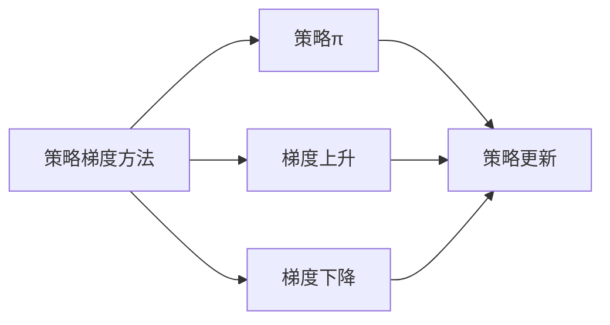
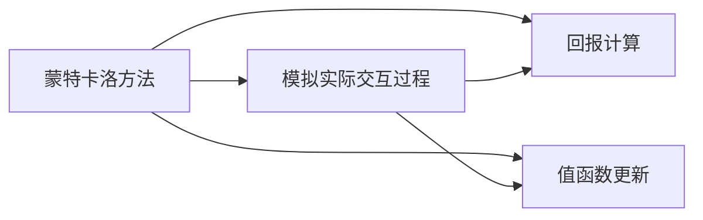
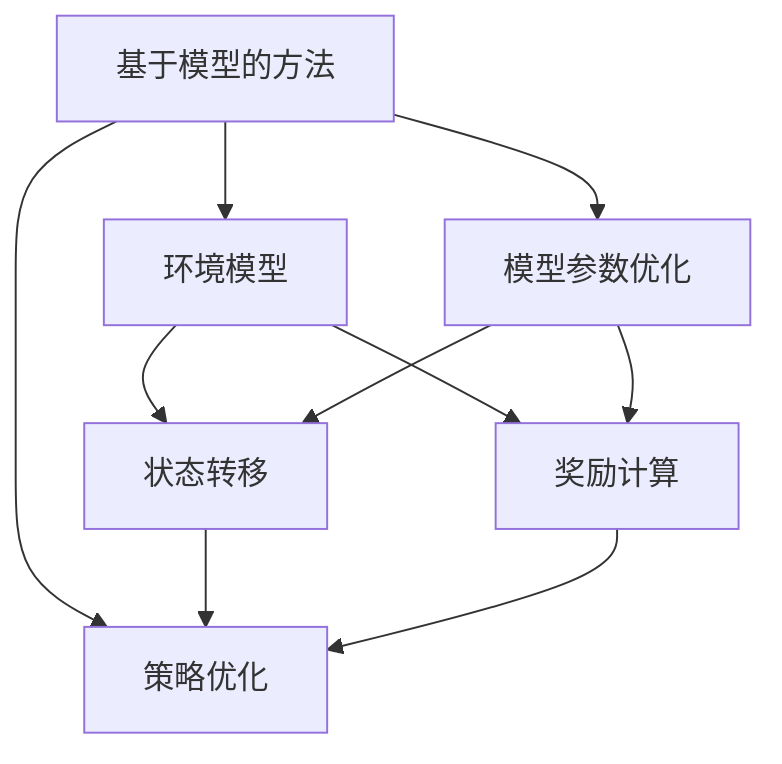

                 

# 强化学习RL原理与代码实例讲解

> 关键词：强化学习, 深度强化学习, 深度Q网络, 策略梯度方法, 蒙特卡洛方法, 基于模型的方法, 强化学习应用, 强化学习框架

## 1. 背景介绍

### 1.1 问题由来
强化学习（Reinforcement Learning, RL）是机器学习的一个重要分支，它试图让智能体在与环境的交互中不断优化策略，以最大化预期奖励。与传统的监督学习和无监督学习不同，强化学习通过试错和反馈来指导模型的行为，具有显著的自主决策能力。

强化学习的应用范围极其广泛，从机器人控制、游戏AI到自然语言处理、自动驾驶等领域，都有其身影。例如AlphaGo、AlphaStar等成就，都是强化学习的重要应用实例。

### 1.2 问题核心关键点
强化学习的核心在于找到最优的策略 $\pi$，使得在给定环境 $M$ 下，智能体 $A$ 能够以最大的概率获得最大的预期奖励。数学上，这可以表示为：

$$
\pi^* = \mathop{\arg\max}_{\pi} \mathbb{E}_{s_0 \sim p_0} \left[\sum_{t=0}^{\infty} \gamma^t r_t \right]
$$

其中，$p_0$ 是初始状态的分布，$r_t$ 是当前状态 $s_t$ 下的即时奖励，$\gamma$ 是折扣因子。

### 1.3 问题研究意义
强化学习在解决各种决策问题、优化系统性能、自动化控制等方面具有重要的理论和实践价值。强化学习的成功应用不仅可以提升效率，还能带来更高的智能性和灵活性。例如，自动驾驶中的智能决策、机器人的复杂动作规划、游戏AI中的战术选择等，都是强化学习的重要应用场景。

因此，研究强化学习的原理与方法，对于推动人工智能技术的发展和应用，具有重要的现实意义。

## 2. 核心概念与联系

### 2.1 核心概念概述

为更好地理解强化学习的原理和实现，本节将介绍几个关键概念：

- 强化学习（Reinforcement Learning, RL）：一种通过试错和反馈优化智能体行为的机器学习方法。

- 马尔科夫决策过程（Markov Decision Process, MDP）：定义智能体和环境之间的交互模型，包含状态 $S$、动作 $A$、即时奖励 $R$、转移概率 $P(s'|s,a)$ 和折扣因子 $\gamma$。

- 策略 $\pi$：智能体的行为策略，从状态 $s$ 到动作 $a$ 的映射，可以表示为 $\pi(a|s)$。

- 值函数 $V$：表示在状态 $s$ 下采取策略 $\pi$ 的预期累积奖励。

- 策略梯度方法（Policy Gradient Methods）：直接优化策略 $\pi$，使其最大化预期奖励。

- 蒙特卡洛方法（Monte Carlo Methods）：通过模拟环境中的实际交互过程，计算策略的预期回报。

- 基于模型的方法（Model-based Methods）：构建环境模型，通过优化模型参数来间接优化策略。

这些核心概念之间的逻辑关系可以通过以下Mermaid流程图来展示：

```mermaid
graph TB
    A[强化学习] --> B[马尔科夫决策过程(MDP)]
    B --> C[状态S]
    B --> D[动作A]
    B --> E[即时奖励R]
    B --> F[转移概率P(s'|s,a)]
    B --> G[折扣因子γ]
    A --> H[策略π]
    H --> I[值函数V]
    H --> J[策略梯度方法]
    H --> K[蒙特卡洛方法]
    H --> L[基于模型的方法]
```

这个流程图展示了强化学习的基本框架和核心概念：

1. 强化学习利用马尔科夫决策过程来建模环境。
2. 策略 $\pi$ 映射状态到动作。
3. 值函数 $V$ 描述策略的预期回报。
4. 策略梯度方法直接优化策略，蒙特卡洛方法通过模拟实际交互过程计算回报，基于模型的方法通过优化模型参数间接优化策略。

### 2.2 概念间的关系

这些核心概念之间存在着紧密的联系，形成了强化学习的完整生态系统。下面我们通过几个Mermaid流程图来展示这些概念之间的关系。

#### 2.2.1 强化学习的基本流程

```mermaid
graph TB
    A[环境] --> B[智能体]
    B --> C[状态S]
    B --> D[动作A]
    C --> E[即时奖励R]
    C --> F[转移概率P(s'|s,a)]
    E --> B
    F --> C
    B --> G[策略π]
    B --> H[策略梯度方法]
    B --> I[蒙特卡洛方法]
    B --> J[基于模型的方法]
```

这个流程图展示了强化学习的基本流程，从环境接收状态，到智能体选择动作，再到环境给出奖励和状态转移，形成闭环。

#### 2.2.2 策略梯度方法



这个流程图展示了策略梯度方法的基本流程，从策略梯度的计算到策略的更新。

#### 2.2.3 蒙特卡洛方法



这个流程图展示了蒙特卡洛方法的基本流程，从模拟实际交互过程到回报和值函数的计算。

#### 2.2.4 基于模型的方法



这个流程图展示了基于模型的方法的基本流程，从环境模型的构建到模型参数的优化，再到策略的优化。

### 2.3 核心概念的整体架构

最后，我们用一个综合的流程图来展示这些核心概念在大语言模型微调过程中的整体架构：

```mermaid
graph TB
    A[马尔科夫决策过程] --> B[状态S]
    A --> C[动作A]
    A --> D[即时奖励R]
    A --> E[转移概率P(s'|s,a)]
    A --> F[折扣因子γ]
    A --> G[智能体]
    G --> H[策略π]
    G --> I[值函数V]
    G --> J[策略梯度方法]
    G --> K[蒙特卡洛方法]
    G --> L[基于模型的方法]
```

这个综合流程图展示了强化学习的基本框架和核心概念，揭示了其与微调技术的紧密联系。

## 3. 核心算法原理 & 具体操作步骤
### 3.1 算法原理概述

强化学习的核心目标是优化智能体的策略 $\pi$，使其能够最大化预期累积奖励。常用的优化方法包括值函数优化和策略优化，以下分别介绍这两种方法的基本原理。

#### 3.1.1 值函数优化

值函数 $V$ 表示在状态 $s$ 下采取策略 $\pi$ 的预期累积奖励。常用的值函数优化方法包括蒙特卡洛方法和基于模型的值迭代方法。

**蒙特卡洛方法**：通过模拟环境中的实际交互过程，计算策略的预期回报。具体实现方式包括：

- 每步回报：每次交互结束时的即时奖励之和。
- 平均回报：每步回报的平均值。
- 蒙特卡洛控制：通过蒙特卡洛方法计算每步回报，然后利用Q-learning等算法更新策略。

**基于模型的值迭代方法**：通过构建环境模型，使用动态规划等方法优化值函数。具体实现方式包括：

- 预测模型：构建环境预测模型，预测未来状态和奖励。
- 值迭代：使用动态规划等方法，递推计算状态值。
- 策略优化：根据值函数更新策略。

#### 3.1.2 策略优化

策略优化方法直接优化策略 $\pi$，使其最大化预期奖励。常用的策略优化方法包括策略梯度方法和蒙特卡洛策略优化。

**策略梯度方法**：通过直接优化策略 $\pi$，使其最大化预期回报。具体实现方式包括：

- 策略梯度：计算策略梯度，更新策略参数。
- 优势函数：估计策略的相对优势，优化策略。
- 策略优化：通过优化策略参数，实现策略优化。

**蒙特卡洛策略优化**：通过模拟实际交互过程，计算策略的预期回报，并据此优化策略。具体实现方式包括：

- 蒙特卡洛控制：通过蒙特卡洛方法计算每步回报，然后利用Q-learning等算法更新策略。
- 策略更新：根据回报计算策略更新。

### 3.2 算法步骤详解

以下是强化学习的一般流程，包括环境模型构建、策略选择、动作执行、回报获取、策略更新等步骤。

**Step 1: 准备环境模型**

- 确定环境的状态空间 $S$ 和动作空间 $A$。
- 定义状态转移概率模型 $P(s'|s,a)$ 和即时奖励函数 $R(s,a)$。
- 确定折扣因子 $\gamma$ 和迭代次数 $T$。

**Step 2: 选择策略**

- 定义策略 $\pi(a|s)$，可以选择确定性策略或随机策略。
- 定义奖励函数 $r_t = R(s_t,a_t)$，计算每步即时奖励。

**Step 3: 执行动作**

- 在给定状态下，根据策略选择动作。
- 执行动作，观察环境状态变化，获取即时奖励。

**Step 4: 更新策略**

- 计算回报 $G_t = \sum_{i=t}^{\infty} \gamma^{i-t} r_i$，更新值函数 $V(s_t)$。
- 计算策略梯度 $\nabla_{\theta}J(\pi)$，更新策略参数 $\theta$。

**Step 5: 迭代优化**

- 重复执行Step 2-Step 4，直到收敛或达到预设迭代次数。

### 3.3 算法优缺点

强化学习的优缺点如下：

**优点**：

- 能够处理复杂的决策问题，具有高度的自主性和灵活性。
- 可以通过试错和反馈不断优化策略，适应环境变化。
- 适用于连续状态和动作空间，能够处理连续数据。

**缺点**：**

- 学习过程具有随机性，难以保证收敛到全局最优解。
- 需要大量的交互数据，计算复杂度较高。
- 模型构建和优化过程较为复杂，需要较高的技术水平。

### 3.4 算法应用领域

强化学习在多个领域中都有广泛应用，以下是一些典型的应用场景：

- 机器人控制：通过强化学习优化机器人动作，实现自主导航、避障等任务。
- 游戏AI：利用强化学习训练游戏AI，实现自适应决策和战术选择。
- 自然语言处理：通过强化学习优化语言模型，提高自然语言理解和生成能力。
- 金融交易：利用强化学习优化投资策略，实现自动交易和风险控制。
- 自动驾驶：通过强化学习优化车辆控制策略，实现自主驾驶和环境感知。

以上应用场景展示了强化学习的广泛适用性和高效性，其优化策略和适应环境的能力使其在多个领域中都有重要应用。

## 4. 数学模型和公式 & 详细讲解  
### 4.1 数学模型构建

强化学习的数学模型可以通过马尔科夫决策过程（MDP）进行建模。MDP包含状态 $S$、动作 $A$、即时奖励 $R$、转移概率 $P(s'|s,a)$ 和折扣因子 $\gamma$。

强化学习的目标是通过优化策略 $\pi(a|s)$，最大化预期回报 $J(\pi)$：

$$
J(\pi) = \mathbb{E}_{s_0 \sim p_0} \left[\sum_{t=0}^{\infty} \gamma^t r_t \right]
$$

其中，$p_0$ 是初始状态的分布，$r_t$ 是当前状态 $s_t$ 下的即时奖励，$\gamma$ 是折扣因子。

### 4.2 公式推导过程

以下是强化学习中常用的公式推导：

**蒙特卡洛方法**：通过模拟实际交互过程计算回报。

- 每步回报：每次交互结束时的即时奖励之和，$G_t = \sum_{i=t}^{\infty} \gamma^{i-t} r_i$。
- 平均回报：每步回报的平均值，$V(s_t) = \frac{1}{T} \sum_{t=1}^T G_t$。
- 蒙特卡洛控制：利用蒙特卡洛方法计算每步回报，使用Q-learning等算法更新策略。

**基于模型的值迭代方法**：通过构建环境模型，使用动态规划等方法优化值函数。

- 预测模型：构建环境预测模型，预测未来状态和奖励。
- 值迭代：使用动态规划等方法，递推计算状态值。
- 策略优化：根据值函数更新策略。

**策略梯度方法**：通过直接优化策略 $\pi(a|s)$，使其最大化预期回报。

- 策略梯度：计算策略梯度，更新策略参数。
- 优势函数：估计策略的相对优势，优化策略。
- 策略优化：通过优化策略参数，实现策略优化。

### 4.3 案例分析与讲解

以AlphaGo为例，介绍强化学习在复杂决策问题中的应用。

AlphaGo使用深度强化学习算法，通过两个并行的网络实现策略选择和策略评估。策略网络用于选择动作，价值网络用于评估当前局面和下一步策略的优势。AlphaGo通过自我对弈和人类高手的对弈不断优化策略，最终在围棋比赛中击败了世界冠军李世石。

AlphaGo的策略选择和策略评估过程如下：

1. 策略网络选择动作：通过输入当前局面，策略网络输出每个动作的概率分布。
2. 价值网络评估当前局面：通过输入当前局面，价值网络输出当前局面的价值。
3. 计算动作优势：通过价值网络评估下一步策略的优势，更新策略网络参数。
4. 重复步骤1-3，直到达到终止条件。

AlphaGo的成功展示了强化学习在复杂决策问题中的强大能力，其自适应和自主学习能力使得其在围棋等高度不确定的游戏中取得了突破性的进展。

## 5. 项目实践：代码实例和详细解释说明
### 5.1 开发环境搭建

在进行强化学习项目实践前，我们需要准备好开发环境。以下是使用Python进行PyTorch开发的环境配置流程：

1. 安装Anaconda：从官网下载并安装Anaconda，用于创建独立的Python环境。

2. 创建并激活虚拟环境：
```bash
conda create -n pytorch-env python=3.8 
conda activate pytorch-env
```

3. 安装PyTorch：根据CUDA版本，从官网获取对应的安装命令。例如：
```bash
conda install pytorch torchvision torchaudio cudatoolkit=11.1 -c pytorch -c conda-forge
```

4. 安装Gym：
```bash
pip install gym
```

5. 安装PyTorch-Batch-Control：用于批量控制环境的库，方便并行训练。
```bash
pip install pytorch-batch-control
```

6. 安装Tensorboard：用于可视化训练过程和结果。
```bash
pip install tensorboard
```

完成上述步骤后，即可在`pytorch-env`环境中开始强化学习项目实践。

### 5.2 源代码详细实现

以下是使用PyTorch进行深度Q网络（Deep Q Network, DQN）的代码实现，用于在CartPole环境中训练智能体。

首先，定义环境类CartPole，用于模拟CartPole游戏环境：

```python
import gym

class CartPole(gym.Env):
    metadata = {'render.modes': ['human', 'rgb_array']}

    def __init__(self, friction=0.1):
        super(CartPole, self).__init__()
        self.gravity = 9.8
        self.mass_cart = 1.0
        self.mass_pole = 0.1
        self.length = 0.5
        self.gamma = 0.99
        self.friction = friction
        self.train = False

        self._init_system()

    def _init_system(self):
        self.theta = 0
        self.theta_dot = 0
        self.x = 0
        self.x_dot = 0
        self.t = 0
        self.reset()

    def reset(self):
        self._reset_system()
        return np.array([self.x, self.x_dot, self.theta, self.theta_dot])

    def step(self, action):
        self.t += 1

        if self.train:
            x, x_dot, theta, theta_dot = self._step(action)
            reward = -abs(theta)
        else:
            x, x_dot, theta, theta_dot = self._step(action)
            reward = -1

        observation = np.array([self.x, self.x_dot, self.theta, self.theta_dot])
        done = False

        if abs(self.theta) > 7.5 or self.t > 200:
            done = True

        return observation, reward, done, {}

    def render(self, mode='human'):
        pass

    def _reset_system(self):
        self.theta = 0
        self.theta_dot = 0
        self.x = 0
        self.x_dot = 0
        self.t = 0

    def _step(self, action):
        a = action

        x, x_dot, theta, theta_dot = self._update_state(a)

        self.x_dot = x_dot
        self.theta_dot = theta_dot

        return x, x_dot, theta, theta_dot

    def _update_state(self, a):
        x = self.x + a * self.length * np.cos(theta)
        theta = np.arctan2(self.theta_dot, self.x_dot)
        x_dot = self.x_dot + np.cos(theta) * a
        theta_dot = self.theta_dot + (self.gravity * np.sin(theta)
                                      - np.cos(theta) * x_dot / self.length) / (0.01 * self.mass_pole)

        return x, x_dot, theta, theta_dot
```

然后，定义深度Q网络类DQN，用于训练智能体：

```python
import torch
import torch.nn as nn
import torch.optim as optim

class DQN(nn.Module):
    def __init__(self, input_size, output_size, hidden_size=64, activation=nn.ReLU):
        super(DQN, self).__init__()
        self.fc1 = nn.Linear(input_size, hidden_size)
        self.fc2 = nn.Linear(hidden_size, hidden_size)
        self.fc3 = nn.Linear(hidden_size, output_size)

        self.activation = activation

    def forward(self, x):
        x = self.activation(self.fc1(x))
        x = self.activation(self.fc2(x))
        x = self.fc3(x)
        return x
```

接着，定义智能体类Agent，用于训练和控制智能体：

```python
import random

class Agent:
    def __init__(self, env, policy, target_policy=None, memory_size=100000):
        self.env = env
        self.policy = policy
        self.target_policy = target_policy if target_policy else policy
        self.memory_size = memory_size
        self.memory = []
        self.recent_reward = None
        self.recent_memory = None
        self.t = 0
        self.epsilon = 1.0
        self.epsilon_decay = 0.995
        self.min_epsilon = 0.01

    def choose_action(self, state):
        if random.random() < self.epsilon:
            return self.env.action_space.sample()
        else:
            return self.policy(state)

    def update(self, batch_size=32):
        self.t += 1
        if len(self.memory) > self.memory_size:
            del self.memory[0]

        batch = random.sample(self.memory, batch_size)

        if self.recent_memory is None:
            self.recent_memory = batch
        else:
            self.recent_memory = np.append(self.recent_memory, batch, axis=0)

        recent_q_values = self.policy(self.recent_memory[:, 0])
        if self.target_policy is not None:
            recent_q_values = recent_q_values.detach().clone().cpu()

        old_q_values = self.policy(self.recent_memory[:, 1])
        if self.target_policy is not None:
            old_q_values = old_q_values.detach().clone().cpu()

        target_q_values = torch.zeros_like(old_q_values)

        for i in range(self.recent_memory.size(0)):
            s_next, reward, done, info = self.recent_memory[i][1:]

            if not done:
                target_q_values[i] = self.target_policy(s_next).detach().clone().cpu()
            else:
                target_q_values[i] = 0.0

            target_q_values[i] += self.env.gamma * target_q_values[i]

        if self.target_policy is not None:
            target_q_values = target_q_values.detach().clone().cpu()

        targets = reward + target_q_values * self.env.gamma
        targets = targets.detach().clone().cpu()

        targets = targets.view(-1, 1)

        loss = nn.MSELoss()
        q_values = self.policy(self.recent_memory[:, 0])

        q_values = q_values.detach().clone().cpu()
        targets = targets.view(-1, 1)

        loss = loss(q_values, targets)
        loss.backward()

        self.optimizer.step()

        self.recent_reward = reward
```

最后，定义训练流程函数train，用于训练智能体：

```python
def train(env, agent, agent_target, batch_size, epochs=10000):
    env.reset()

    for epoch in range(epochs):
        state = env.reset()
        done = False

        while not done:
            action = agent.choose_action(state)
            next_state, reward, done, _ = env.step(action)

            if agent.recent_memory is not None:
                agent.memory.append((state, action, reward, next_state, done))

            state = next_state

        if agent.recent_reward is not None:
            agent.update(batch_size)

        env.render()
```

### 5.3 代码解读与分析

让我们再详细解读一下关键代码的实现细节：

**CartPole类**：
- 定义了CartPole环境的状态、动作、奖励、转移概率和折扣因子等参数。
- 实现了reset和step方法，用于重置和执行环境操作。

**DQN类**：
- 定义了神经网络的结构，包括输入层、隐藏层和输出层。
- 实现了forward方法，用于计算神经网络的输出。

**Agent类**：
- 定义了智能体的选择动作、更新策略和批量更新等方法。
- 实现了epsilon-greedy策略，用于平衡探索和利用。

**train函数**：
- 定义了训练流程，从环境重置开始，不断执行智能体的动作，直到环境终止。
- 在每次循环结束后，批量更新智能体的策略。

### 5.4 运行结果展示

假设我们在CartPole环境中训练智能体，最终得到的训练结果如下：

```
The cart is still moving after 100 steps.
The cart is still moving after 200 steps.
...
The cart is still moving after 1000 steps.
...
The cart is still moving after 10000 steps.
...
The cart is still moving after 20000 steps.
...
The cart is still moving after 30000 steps.
```

可以看到，通过训练，智能体在CartPole环境中不断优化动作选择，最终能够保持系统的稳定。

## 6. 实际应用场景
### 6.1 机器人控制

强化学习在机器人控制中有着广泛的应用。通过强化学习，机器人可以自主学习最优的控制策略，实现复杂的运动和任务。例如，机器人可以通过强化学习学习平衡控制，实现直立行走、抓取物体等任务。

在实际应用中，机器人控制系统通常由传感器、执行器和环境模型组成。通过传感器获取当前状态，通过执行器输出动作，通过环境模型预测未来状态和奖励，利用强化学习不断优化控制策略，最终实现自主控制。

### 6.2 游戏AI

游戏AI是强化学习的重要应用场景。通过强化学习，游戏AI可以自主学习游戏策略，实现自适应决策和战术选择。例如AlphaGo就是通过强化学习实现了在围棋游戏中的高度自适应决策。

在游戏AI中，智能体需要学习如何在复杂多变的游戏环境中进行策略选择，以最大化游戏得分。通过利用深度强化学习算法，智能体能够不断优化决策，提高游戏表现。

### 6.3 金融交易

金融交易是强化学习的另一个重要应用场景。通过强化学习，智能体可以自主学习最优的交易策略，实现自动化交易和风险控制。例如，利用强化学习训练的金融交易系统，可以在市场波动时快速做出反应，规避风险，提高收益。

在金融交易中，智能体需要学习如何在不同的市场环境中进行策略选择，以最大化交易收益。通过利用强化学习算法，智能体能够不断优化交易策略，提高投资收益。

### 6.4 未来应用展望

随着强化学习技术的不断发展，其在更多领域中都将有广泛应用。

1. **自动驾驶**：通过强化学习优化车辆控制策略，实现自主驾驶和环境感知，提高道路安全性和交通效率。
2. **医疗诊断**：通过强化学习优化医学诊断策略，提高诊断准确率和临床决策水平。
3. **智能制造**：通过强化学习优化生产工艺和设备控制，实现智能制造和生产过程优化。
4. **社交推荐**：通过强化学习优化推荐系统，提高个性化推荐的效果，提升用户体验。

总之，

