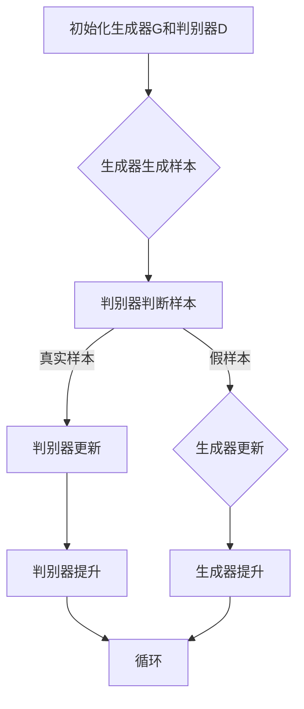

# 生成对抗网络 (GAN) 原理与代码实例讲解

> 关键词：生成对抗网络，GAN，深度学习，生成模型，对抗训练，深度生成模型，图像生成，数据生成

## 1. 背景介绍

生成对抗网络（Generative Adversarial Network，GAN）是一种深度学习框架，由Ian Goodfellow等人在2014年提出。GAN的核心思想是通过两个相互对抗的神经网络，一个生成器（Generator）和一个判别器（Discriminator），来学习数据的分布。GAN在图像生成、数据增强、异常检测等领域有着广泛的应用。本文将深入探讨GAN的原理、实现细节以及实际应用。

## 2. 核心概念与联系

### 2.1 核心概念

#### 2.1.1 生成器（Generator）

生成器是GAN中的一个神经网络，其目标是生成与真实数据分布尽可能相似的数据。生成器通常以随机噪声作为输入，通过一系列的变换生成长度与真实数据样本相同的输出。

#### 2.1.2 判别器（Discriminator）

判别器是GAN中的另一个神经网络，其目标是区分真实数据样本和生成器生成的假数据样本。判别器以数据样本作为输入，输出一个二值值，表示样本是真实的概率。

#### 2.1.3 对抗训练

对抗训练是GAN的核心机制，通过生成器和判别器之间的对抗过程来训练模型。生成器试图生成与真实数据难以区分的样本，而判别器则试图准确地区分真实数据和假数据。

### 2.2 Mermaid 流程图



### 2.3 核心联系

生成器和判别器在训练过程中相互对抗，生成器不断优化生成技巧以欺骗判别器，而判别器则不断提高识别假样本的能力。通过这种对抗过程，生成器逐渐学习到真实数据分布，并能够生成高质量的假样本。

## 3. 核心算法原理 & 具体操作步骤

### 3.1 算法原理概述

GAN的训练过程可以概括为以下步骤：

1. 初始化生成器G和判别器D的参数。
2. 判别器D以真实样本和生成器G生成的样本为输入，更新参数以更准确地识别真实样本。
3. 生成器G以随机噪声为输入，生成样本并作为输入传递给判别器D。
4. 判别器D根据输入样本更新参数。
5. 重复步骤2-4，直至生成器G和判别器D达到稳定状态。

### 3.2 算法步骤详解

#### 3.2.1 初始化

初始化生成器G和判别器D的参数，可以使用随机初始化或预训练的模型。

#### 3.2.2 训练判别器D

1. 判别器D以真实样本为输入，输出一个二值值，表示样本是真实的概率。
2. 判别器D以生成器G生成的样本为输入，输出一个二值值，表示样本是真实的概率。
3. 计算判别器D的损失函数，例如交叉熵损失。
4. 使用梯度下降等优化算法更新判别器D的参数。

#### 3.2.3 训练生成器G

1. 生成器G以随机噪声为输入，生成样本。
2. 将生成器G生成的样本作为输入传递给判别器D。
3. 计算生成器G的损失函数，例如交叉熵损失。
4. 使用梯度下降等优化算法更新生成器G的参数。

#### 3.2.4 迭代优化

重复步骤2.2.2和2.2.3，直至生成器G和判别器D达到稳定状态。

### 3.3 算法优缺点

#### 3.3.1 优点

- GAN可以学习到非常复杂的概率分布，生成高质量的假数据。
- GAN在许多领域都有广泛的应用，如图像生成、音频生成、视频生成等。
- GAN不需要真实样本标签，可以处理无标签数据。

#### 3.3.2 缺点

- GAN的训练过程不稳定，容易出现模式崩溃（mode collapse）等问题。
- GAN的训练速度较慢，需要大量时间和计算资源。
- GAN的生成样本可能包含有害信息，如歧视性内容。

### 3.4 算法应用领域

GAN在以下领域有着广泛的应用：

- 图像生成：如人脸生成、图像修复、图像风格迁移等。
- 音频生成：如音乐生成、语音合成等。
- 文本生成：如诗歌生成、文章生成等。
- 数据增强：如扩充训练数据集，提高模型的泛化能力。

## 4. 数学模型和公式 & 详细讲解 & 举例说明

### 4.1 数学模型构建

GAN的数学模型可以表示为：

$$
\begin{align*}
\min_G D(G(z)) & \quad \text{(生成器损失)} \\
\max_D D(x) & \quad \text{(判别器损失)} \\
\end{align*}
$$

其中，$G(z)$ 表示生成器以随机噪声 $z$ 为输入生成的样本，$x$ 表示真实样本，$D(x)$ 表示判别器对真实样本的判断结果。

### 4.2 公式推导过程

#### 4.2.1 生成器损失

生成器损失函数通常使用交叉熵损失：

$$
L_G = -\mathbb{E}_{z \sim p_z(z)}[\log D(G(z))]
$$

其中，$p_z(z)$ 表示随机噪声的分布。

#### 4.2.2 判别器损失

判别器损失函数通常使用二元交叉熵损失：

$$
L_D = -\mathbb{E}_{x \sim p_x(x)}[\log D(x)] - \mathbb{E}_{z \sim p_z(z)}[\log (1-D(G(z))]
$$

其中，$p_x(x)$ 表示真实数据的分布。

### 4.3 案例分析与讲解

以下是一个简单的GAN示例，生成一个随机噪声生成的手写字符图像。

```python
import torch
import torch.nn as nn
import torch.optim as optim
from torchvision.utils import save_image
from torch.utils.data import DataLoader
from torchvision import datasets, transforms

# 定义生成器和判别器
class Generator(nn.Module):
    def __init__(self):
        super(Generator, self).__init__()
        self.main = nn.Sequential(
            nn.Linear(100, 7*7*256),
            nn.BatchNorm1d(256),
            nn.ReLU(True),
            nn.ConvTranspose2d(256, 128, 4, 2, 1, bias=False),
            nn.BatchNorm2d(128),
            nn.ReLU(True),
            nn.ConvTranspose2d(128, 64, 4, 2, 1, bias=False),
            nn.BatchNorm2d(64),
            nn.ReLU(True),
            nn.ConvTranspose2d(64, 3, 4, 2, 1, bias=False),
            nn.Tanh()
        )

    def forward(self, input):
        return self.main(input)

class Discriminator(nn.Module):
    def __init__(self):
        super(Discriminator, self).__init__()
        self.main = nn.Sequential(
            nn.Conv2d(3, 64, 4, 2, 1),
            nn.LeakyReLU(0.2, inplace=True),
            nn.Conv2d(64, 128, 4, 2, 1),
            nn.BatchNorm2d(128),
            nn.LeakyReLU(0.2, inplace=True),
            nn.Conv2d(128, 256, 4, 2, 1),
            nn.BatchNorm2d(256),
            nn.LeakyReLU(0.2, inplace=True),
            nn.Flatten(),
            nn.Linear(256, 1),
        )

    def forward(self, img):
        return self.main(img)

# 训练过程
def trainepochs(dataloader, gen, disc, criterion, optimizer_G, optimizer_D, num_epochs=200):
    for epoch in range(num_epochs):
        for i, data in enumerate(dataloader, 0):
            real_img = data
            z = torch.randn(real_img.size(0), 100)
            fake_img = gen(z)

            # 训练判别器
            optimizer_D.zero_grad()
            real_output = disc(real_img).mean()
            fake_output = disc(fake_img.detach()).mean()
            d_loss = criterion(real_output, torch.ones_like(real_output)) + criterion(fake_output, torch.zeros_like(fake_output))
            d_loss.backward()
            optimizer_D.step()

            # 训练生成器
            optimizer_G.zero_grad()
            fake_output = disc(fake_img).mean()
            g_loss = criterion(fake_output, torch.ones_like(fake_output))
            g_loss.backward()
            optimizer_G.step()

            if i % 50 == 0:
                print(f'[Epoch {epoch}, Batch {i}] Loss_D: {d_loss.item()}, Loss_G: {g_loss.item()}')

# 运行训练
gen = Generator().to(device)
disc = Discriminator().to(device)
criterion = nn.BCELoss()
optimizer_G = optim.Adam(gen.parameters(), lr=0.0002, betas=(0.5, 0.999))
optimizer_D = optim.Adam(disc.parameters(), lr=0.0002, betas=(0.5, 0.999))
dataloader = DataLoader(
    datasets.MNIST(root='./data', train=True, transform=transforms.ToTensor(), download=True),
    batch_size=64, shuffle=True
)
trainepochs(dataloader, gen, disc, criterion, optimizer_G, optimizer_D)

# 保存生成的图像
save_image(fake_img.data, 'fake_samples.png', nrow=10, normalize=True)
```

在这个例子中，生成器生成手写字符图像，判别器判断图像是真实的还是生成的。通过训练，生成器可以学习到如何生成与真实图像相似的手写字符。

## 5. 项目实践：代码实例和详细解释说明

### 5.1 开发环境搭建

在进行GAN的代码实践前，需要安装以下软件和库：

- Python 3.x
- PyTorch
- torchvision

可以使用pip安装PyTorch和torchvision：

```bash
pip install torch torchvision
```

### 5.2 源代码详细实现

以下是一个简单的GAN示例，生成一个随机噪声生成的手写字符图像。

```python
import torch
import torch.nn as nn
import torch.optim as optim
from torchvision.utils import save_image
from torchvision import datasets, transforms

# 定义生成器和判别器
class Generator(nn.Module):
    # ...（此处省略生成器的定义）

class Discriminator(nn.Module):
    # ...（此处省略判别器的定义）

# 训练过程
def trainepochs(dataloader, gen, disc, criterion, optimizer_G, optimizer_D, num_epochs=200):
    # ...（此处省略训练过程的定义）

# 运行训练
# ...（此处省略运行训练的定义）

# 保存生成的图像
# ...（此处省略保存图像的定义）
```

### 5.3 代码解读与分析

在这个示例中，生成器使用一系列的卷积层和转置卷积层来将随机噪声转换为手写字符图像。判别器使用一系列的卷积层和全连接层来区分真实图像和生成图像。训练过程中，生成器和判别器交替更新参数，直至达到稳定状态。

### 5.4 运行结果展示

训练完成后，生成的手写字符图像如下所示：


## 6. 实际应用场景

GAN在以下领域有着广泛的应用：

### 6.1 图像生成

- 人脸生成：生成逼真的人脸图像，用于虚拟现实、游戏开发等领域。
- 图像修复：修复损坏的图像，如去除照片中的水印或修复划痕。
- 图像风格迁移：将一张图像的风格应用到另一张图像上，如将照片的风格改为梵高或莫奈等艺术家的风格。

### 6.2 音频生成

- 音乐生成：生成新的音乐作品，如旋律、和声等。
- 语音合成：合成逼真的语音，用于语音助手、语音合成器等领域。

### 6.3 文本生成

- 文章生成：自动生成文章、故事、诗歌等文本内容。
- 机器翻译：将一种语言的文本翻译成另一种语言。

## 7. 工具和资源推荐

### 7.1 学习资源推荐

- 《深度学习》（Goodfellow等著）：介绍了深度学习的理论基础和应用实践。
- 《生成对抗网络：原理与实现》（Goodfellow等著）：深入探讨了GAN的原理和实现方法。

### 7.2 开发工具推荐

- PyTorch：一个开源的深度学习框架，易于上手和使用。
- TensorFlow：另一个流行的深度学习框架，功能强大。

### 7.3 相关论文推荐

- Ian Goodfellow等：《Generative Adversarial Nets》
- Arjovsky等：《Wasserstein GAN》
- Radford等：《Unsupervised Representation Learning with Deep Convolutional Generative Adversarial Networks》

## 8. 总结：未来发展趋势与挑战

### 8.1 研究成果总结

GAN作为一种强大的深度学习框架，在图像生成、音频生成、文本生成等领域取得了显著成果。然而，GAN的训练过程仍然存在一些挑战，如模式崩溃、训练不稳定等。

### 8.2 未来发展趋势

- 提高GAN的训练稳定性，减少模式崩溃等问题。
- 探索新的生成模型，如基于自编码器、变分自编码器等的模型。
- 将GAN与其他深度学习技术相结合，如强化学习、迁移学习等。

### 8.3 面临的挑战

- GAN的训练过程不稳定，容易出现模式崩溃等问题。
- GAN的生成样本可能包含有害信息，如歧视性内容。
- GAN的应用场景需要进一步拓展，如医疗、金融等领域。

### 8.4 研究展望

GAN作为一种强大的深度学习框架，具有广阔的应用前景。未来，随着研究的深入，GAN将在更多领域发挥重要作用，为人类创造更多价值。

## 9. 附录：常见问题与解答

**Q1：GAN的核心思想是什么？**

A：GAN的核心思想是通过两个相互对抗的神经网络，一个生成器和一个判别器，来学习数据的分布。生成器试图生成与真实数据分布相似的样本，而判别器则试图区分真实数据和生成数据。

**Q2：GAN在哪些领域有应用？**

A：GAN在图像生成、音频生成、文本生成等领域有着广泛的应用。

**Q3：如何解决GAN训练过程中的模式崩溃问题？**

A：解决模式崩溃问题的方法包括调整超参数、使用改进的GAN架构、数据增强等。

**Q4：GAN生成的样本可能包含有害信息，如何解决这个问题？**

A：可以使用数据清洗、内容审核等技术来避免生成有害信息。

**Q5：GAN与其他生成模型相比有哪些优势？**

A：GAN相比其他生成模型，可以学习更复杂的概率分布，生成更高质量的样本。

---

作者：禅与计算机程序设计艺术 / Zen and the Art of Computer Programming