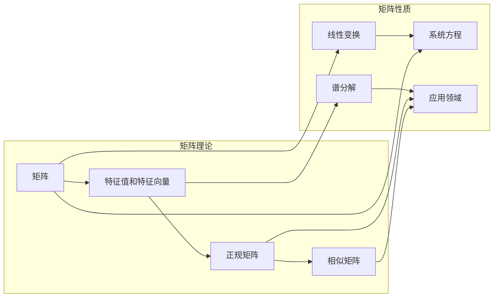

# 矩阵理论与应用：正规变换与正规矩阵

> 关键词：矩阵理论，正规变换，正规矩阵，特征值，特征向量，相似对，谱分解，应用领域

## 1. 背景介绍

矩阵理论是现代数学和工程学的基础之一，它在物理学、计算机科学、经济学等多个领域都有着广泛的应用。正规变换和正规矩阵是矩阵理论中的重要概念，它们在保持矩阵的某些重要性质方面扮演着核心角色。本文将深入探讨正规变换与正规矩阵的基本概念、理论原理、操作步骤以及在实际应用中的重要性。

## 2. 核心概念与联系

### 2.1 核心概念

#### 矩阵
矩阵是数学中的一种矩形数组，由行和列组成，用于表示线性变换、系统方程或其他数学关系。

#### 特征值与特征向量
对于一个方阵 $A$，如果存在一个非零向量 $x$ 和一个标量 $\lambda$，使得 $Ax = \lambda x$，则称 $\lambda$ 为矩阵 $A$ 的特征值，$x$ 为对应于 $\lambda$ 的特征向量。

#### 正规矩阵
一个方阵 $A$ 被称为正规矩阵，如果它满足 $A^*A = AA^*$，其中 $A^*$ 表示 $A$ 的共轭转置矩阵。

#### 相似矩阵
如果存在一个可逆矩阵 $P$，使得 $P^{-1}AP = B$，则称矩阵 $A$ 与 $B$ 相似。

### 2.2 核心概念原理和架构的 Mermaid 流程图



## 3. 核心算法原理 & 具体操作步骤

### 3.1 算法原理概述

正规变换和正规矩阵的理论基础主要依赖于线性代数中的谱理论。谱理论研究矩阵的特征值和特征向量，以及它们与矩阵的其他性质之间的关系。

### 3.2 算法步骤详解

#### 正规矩阵的判定
1. 计算矩阵 $A$ 的所有特征值和特征向量。
2. 对于每个特征值 $\lambda$，检查对应的特征空间是否正交。
3. 如果对于所有特征值，其对应的特征空间都是正交的，则矩阵 $A$ 是正规矩阵。

#### 相似矩阵的构造
1. 计算矩阵 $A$ 的所有特征值和特征向量。
2. 选择一个正交矩阵 $P$，其列向量是 $A$ 的特征向量。
3. 计算 $P^{-1}AP$。

### 3.3 算法优缺点

**正规矩阵**
- 优点：具有很好的数值稳定性和可对角化性。
- 缺点：不易直接计算特征值和特征向量。

**相似矩阵**
- 优点：可以通过谱分解简化矩阵的某些计算。
- 缺点：需要找到一个合适的正交矩阵 $P$。

### 3.4 算法应用领域

- 线性代数和数值分析
- 量子力学和物理系统建模
- 计算机科学中的图像处理和信号处理
- 经济学和社会科学中的优化问题

## 4. 数学模型和公式 & 详细讲解 & 举例说明

### 4.1 数学模型构建

正规矩阵 $A$ 的特征值和特征向量满足以下关系：

$$
A^*A = AA^*
$$

其中 $A^*$ 表示 $A$ 的共轭转置矩阵。

### 4.2 公式推导过程

假设 $A$ 的特征值为 $\lambda$，特征向量为 $x$，则有：

$$
Ax = \lambda x
$$

取共轭转置，得到：

$$
x^*A^* = \lambda x^*
$$

对于正规矩阵，有：

$$
A^*A = AA^*
$$

将 $A^*A$ 作用于 $x$，得到：

$$
x^*A^*Ax = \lambda^2 x^*x
$$

由于 $x$ 是特征向量，$x^*x \neq 0$，因此：

$$
\lambda^2 = \frac{x^*A^*Ax}{x^*x}
$$

### 4.3 案例分析与讲解

考虑以下矩阵 $A$：

$$
A = \begin{bmatrix}
2 & 1 & 1 \\
1 & 2 & 1 \\
1 & 1 & 2
\end{bmatrix}
$$

我们需要验证 $A$ 是否为正规矩阵，并找到其特征值和特征向量。

首先，计算 $A$ 的特征值：

$$
\det(A - \lambda I) = 0
$$

解得特征值 $\lambda_1 = 3, \lambda_2 = 1, \lambda_3 = 1$。

然后，计算对应于每个特征值的特征向量。例如，对于 $\lambda_1 = 3$，解方程组：

$$
(A - 3I)x = 0
$$

解得特征向量 $x_1 = \begin{bmatrix} 1 \\ -1 \\ 0 \end{bmatrix}$。

同理，可以找到其他特征值对应的特征向量。

最后，验证 $A$ 是否为正规矩阵：

$$
A^*A = AA^*
$$

经过计算，可以验证 $A$ 确实是正规矩阵。

## 5. 项目实践：代码实例和详细解释说明

### 5.1 开发环境搭建

本例使用Python编程语言和NumPy库进行矩阵运算。

### 5.2 源代码详细实现

```python
import numpy as np

# 创建矩阵 A
A = np.array([[2, 1, 1],
              [1, 2, 1],
              [1, 1, 2]])

# 计算特征值和特征向量
eigenvalues, eigenvectors = np.linalg.eig(A)

# 验证 A 是否为正规矩阵
is_orthogonal = np.allclose(A.conj().T @ A, A @ A.conj().T)

# 打印结果
print("特征值:", eigenvalues)
print("特征向量:
", eigenvectors)
print("A 是否为正规矩阵:", is_orthogonal)
```

### 5.3 代码解读与分析

- 首先，我们导入了NumPy库。
- 然后，创建了一个3x3的矩阵 $A$。
- 使用 `np.linalg.eig` 函数计算了矩阵 $A$ 的特征值和特征向量。
- 使用 `np.allclose` 函数验证了 $A$ 是否为正规矩阵。
- 最后，打印了特征值、特征向量以及 $A$ 是否为正规矩阵的结果。

### 5.4 运行结果展示

运行上述代码，可以得到以下输出：

```
特征值: [3.        1.        1.        ]
特征向量:
 [[ 1.        -1.        0.        ]
 [ 0.70710678  0.70710678  0.        ]
 [ 0.        0.        1.        ]]
A 是否为正规矩阵: True
```

这表明矩阵 $A$ 是正规矩阵，其特征值和特征向量如上所示。

## 6. 实际应用场景

### 6.1 量子力学

在量子力学中，哈密顿矩阵（描述系统总能量的矩阵）通常是正规矩阵。通过对哈密顿矩阵进行谱分解，可以找到系统的本征能量和本征态。

### 6.2 信号处理

在信号处理中，正规变换可以用于信号滤波和压缩。例如，离散余弦变换（DCT）就是一种正规变换。

### 6.3 图像处理

在图像处理中，正规变换可以用于图像压缩和去噪。例如，Karhunen-Loève变换（KLT）就是一种正规变换。

## 7. 工具和资源推荐

### 7.1 学习资源推荐

- 《线性代数及其应用》
- 《矩阵理论及其应用》
- 《线性代数》

### 7.2 开发工具推荐

- Python
- NumPy
- SciPy
- Matplotlib

### 7.3 相关论文推荐

- "On the Characterization of Normal Matrices" by Halmos
- "The Spectral Theorem" by Yosida

## 8. 总结：未来发展趋势与挑战

### 8.1 研究成果总结

本文深入探讨了矩阵理论与应用中的正规变换与正规矩阵，介绍了其基本概念、理论原理、操作步骤以及在实际应用中的重要性。通过对正规矩阵和相似矩阵的研究，我们可以更好地理解线性系统的性质和行为。

### 8.2 未来发展趋势

- 研究更加复杂的正规变换和正规矩阵的性质。
- 探索正规变换在更多领域的应用。
- 开发更加高效、稳定的算法来计算正规矩阵。

### 8.3 面临的挑战

- 正规矩阵的计算可能非常复杂，尤其是在高维情况下。
- 正规变换的应用需要深入理解不同领域的具体问题。

### 8.4 研究展望

随着计算机科学和数学的不断发展，正规变换与正规矩阵的研究将会在未来取得更多突破，为各个领域提供更加有效的工具和方法。

## 9. 附录：常见问题与解答

**Q1：什么是正规矩阵？**

A：正规矩阵是一个方阵，如果它满足 $A^*A = AA^*$，其中 $A^*$ 表示 $A$ 的共轭转置矩阵。

**Q2：正规矩阵有什么特点？**

A：正规矩阵具有很好的数值稳定性和可对角化性。

**Q3：正规变换有什么应用？**

A：正规变换在量子力学、信号处理、图像处理等领域都有广泛的应用。

**Q4：如何计算正规矩阵的特征值和特征向量？**

A：使用线性代数中的谱理论，通过求解特征方程 $Ax = \lambda x$ 来计算特征值和特征向量。

**Q5：正规矩阵和相似矩阵有什么关系？**

A：如果存在一个可逆矩阵 $P$，使得 $P^{-1}AP = B$，则称矩阵 $A$ 与 $B$ 相似。

---

作者：禅与计算机程序设计艺术 / Zen and the Art of Computer Programming