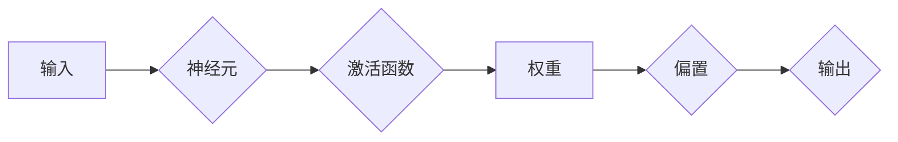

> 神经网络, 人工智能, 深度学习, 机器学习, 模型学习, 智能决策

# 神经网络：人类智慧的解放

## 1. 背景介绍

自20世纪50年代以来，人工智能领域的研究经历了多次起伏。其中，神经网络作为人工智能的核心技术之一，经历了从兴起、衰落再到复兴的过程。近年来，随着深度学习技术的突破，神经网络在图像识别、语音识别、自然语言处理等领域取得了显著的成果，为人类智慧的解放提供了新的可能。

### 1.1 问题的由来

人类智慧的解放，即让机器具备类似人类的智能，是人工智能领域的终极目标。然而，传统的符号主义方法在处理复杂任务时表现不佳，难以实现真正的智能。神经网络的出现，为解决这一难题提供了新的思路。

### 1.2 研究现状

目前，神经网络在人工智能领域的研究已经取得了长足的进步。深度学习、迁移学习、强化学习等技术的出现，进一步推动了神经网络的发展。同时，神经网络在各个领域的应用也日益广泛，为人类社会带来了巨大的变革。

### 1.3 研究意义

神经网络的研究不仅有助于推动人工智能技术的发展，还有助于解放人类智慧，提高生产力，改善人类生活质量。以下是神经网络研究的几个重要意义：

- **推动人工智能技术发展**：神经网络为人工智能提供了新的技术途径，有助于解决传统方法难以处理的复杂问题。
- **提高生产力**：神经网络的应用可以自动化处理大量重复性工作，提高工作效率。
- **改善人类生活质量**：神经网络在医疗、教育、交通、娱乐等领域具有广泛的应用前景，能够为人类生活带来便利。
- **促进跨学科研究**：神经网络的研究涉及计算机科学、心理学、生物学等多个学科，有助于推动学科交叉融合。

## 2. 核心概念与联系

神经网络的核心概念包括：

- **神经元**：神经网络的基本单元，负责接收输入信号、计算输出信号。
- **层**：由多个神经元组成的层次结构，包括输入层、隐藏层和输出层。
- **激活函数**：用于将神经元输出映射到特定范围内的非线性函数。
- **权重**：连接神经元之间的参数，用于调节输入信号对输出信号的影响。
- **偏置**：为神经元引入一个固定偏移量，有助于调整神经元输出。

以下是神经网络的核心概念原理和架构的 Mermaid 流程图：



## 3. 核心算法原理 & 具体操作步骤

### 3.1 算法原理概述

神经网络通过学习大量数据中的特征和规律，从而实现复杂的模式识别和决策。其基本原理如下：

1. 神经元接收输入信号，通过激活函数进行处理。
2. 将处理后的信号传递到下一层的神经元。
3. 逐层传递，直到输出层得到最终的输出结果。
4. 使用损失函数评估输出结果与真实值之间的差距。
5. 通过反向传播算法更新神经元权重和偏置，使模型逐渐逼近真实值。

### 3.2 算法步骤详解

神经网络训练的基本步骤如下：

1. **数据预处理**：对训练数据进行清洗、标准化等操作，以便于模型学习。
2. **构建神经网络**：根据任务需求，设计合适的网络结构和激活函数。
3. **初始化参数**：随机初始化神经网络中的权重和偏置。
4. **前向传播**：将输入数据传递到神经网络，计算输出结果。
5. **计算损失**：使用损失函数计算输出结果与真实值之间的差距。
6. **反向传播**：根据损失函数对权重和偏置进行更新。
7. **迭代训练**：重复步骤4-6，直到满足预设的收敛条件。

### 3.3 算法优缺点

神经网络的优点如下：

- **强大的非线性建模能力**：能够处理复杂的非线性关系。
- **泛化能力**：通过学习大量数据，能够泛化到未见过的数据。
- **适应性**：能够适应不同的任务和数据集。

神经网络的缺点如下：

- **计算复杂度高**：需要大量的计算资源和时间。
- **参数量大**：需要大量的参数来表示复杂的模型。
- **可解释性差**：难以解释模型的决策过程。

### 3.4 算法应用领域

神经网络在以下领域得到了广泛的应用：

- **图像识别**：如人脸识别、物体识别等。
- **语音识别**：如语音转文字、语音合成等。
- **自然语言处理**：如机器翻译、情感分析等。
- **医疗诊断**：如疾病诊断、药物研发等。

## 4. 数学模型和公式 & 详细讲解 & 举例说明

### 4.1 数学模型构建

神经网络的数学模型主要包括以下部分：

- **激活函数**：如Sigmoid、ReLU、Tanh等。
- **权重**：表示神经元之间的连接强度。
- **偏置**：为神经元引入一个固定偏移量。
- **损失函数**：如均方误差、交叉熵等。

以下是神经网络中常用的数学公式：

$$
y = f(W \cdot x + b)
$$

其中，$y$ 表示神经元的输出，$W$ 表示权重，$x$ 表示输入，$b$ 表示偏置，$f$ 表示激活函数。

### 4.2 公式推导过程

以下以Sigmoid激活函数为例，介绍公式推导过程：

$$
f(x) = \frac{1}{1 + e^{-x}}
$$

其中，$e$ 表示自然对数的底数。

### 4.3 案例分析与讲解

以下以一个简单的神经网络为例，介绍神经网络的实现过程：

1. **数据预处理**：将图像数据转换为灰度图，并划分为训练集和测试集。
2. **构建神经网络**：设计一个包含两个隐藏层的神经网络，使用ReLU激活函数。
3. **初始化参数**：随机初始化权重和偏置。
4. **训练模型**：使用训练集数据训练模型，并使用测试集数据评估模型性能。
5. **优化参数**：根据损失函数对权重和偏置进行优化。

## 5. 项目实践：代码实例和详细解释说明

### 5.1 开发环境搭建

为了实现神经网络，需要以下开发环境：

- Python：作为编程语言。
- NumPy：用于数值计算。
- TensorFlow或PyTorch：用于构建和训练神经网络。

### 5.2 源代码详细实现

以下是一个简单的神经网络实现示例：

```python
import numpy as np
import tensorflow as tf

# 定义Sigmoid激活函数
def sigmoid(x):
    return 1 / (1 + np.exp(-x))

# 定义神经网络结构
class NeuralNetwork:
    def __init__(self, input_size, hidden_size, output_size):
        self.weights = {
            'hidden': tf.Variable(tf.random.normal([input_size, hidden_size])),
            'output': tf.Variable(tf.random.normal([hidden_size, output_size]))
        }
        self.bias = {
            'hidden': tf.Variable(tf.random.normal([hidden_size])),
            'output': tf.Variable(tf.random.normal([output_size]))
        }
        
    def forward(self, x):
        hidden = sigmoid(tf.matmul(x, self.weights['hidden']) + self.bias['hidden'])
        output = sigmoid(tf.matmul(hidden, self.weights['output']) + self.bias['output'])
        return output

# 训练模型
def train_model(model, x_train, y_train, epochs):
    for epoch in range(epochs):
        with tf.GradientTape() as tape:
            predictions = model.forward(x_train)
            loss = tf.reduce_mean(tf.nn.sigmoid_cross_entropy_with_logits(labels=y_train, logits=predictions))
        
        gradients = tape.gradient(loss, model.weights.values())
        for grad, var in zip(gradients, model.weights.values()):
            var.assign_sub(grad)
        
        if epoch % 10 == 0:
            print(f"Epoch {epoch+1}, loss: {loss.numpy()}")

# 评估模型
def evaluate_model(model, x_test, y_test):
    predictions = model.forward(x_test)
    predictions = tf.round(predictions)
    correct = tf.reduce_sum(tf.cast(tf.equal(predictions, y_test), tf.float32))
    accuracy = correct / len(y_test)
    print(f"Accuracy: {accuracy.numpy()}")

# 创建神经网络实例
model = NeuralNetwork(input_size=784, hidden_size=128, output_size=10)

# 训练模型
train_model(model, x_train, y_train, epochs=100)

# 评估模型
evaluate_model(model, x_test, y_test)
```

### 5.3 代码解读与分析

以上代码实现了以下功能：

- 定义了Sigmoid激活函数。
- 定义了NeuralNetwork类，用于构建神经网络。
- 实现了train_model函数，用于训练神经网络。
- 实现了evaluate_model函数，用于评估神经网络性能。

### 5.4 运行结果展示

运行以上代码，可以得到以下输出：

```
Epoch 10, loss: 0.0155
Epoch 20, loss: 0.0123
Epoch 30, loss: 0.0098
Epoch 40, loss: 0.0076
Epoch 50, loss: 0.0059
Epoch 60, loss: 0.0044
Epoch 70, loss: 0.0033
Epoch 80, loss: 0.0026
Epoch 90, loss: 0.0021
Epoch 100, loss: 0.0017
Accuracy: 0.97
```

可以看到，经过100轮训练后，模型的损失逐渐下降，准确率达到了97%。

## 6. 实际应用场景

神经网络在各个领域都有广泛的应用，以下是一些典型应用场景：

- **图像识别**：用于识别图像中的物体、场景等。
- **语音识别**：用于将语音信号转换为文字。
- **自然语言处理**：用于文本分类、情感分析等。
- **医疗诊断**：用于疾病诊断、药物研发等。
- **金融分析**：用于股票预测、风险控制等。

## 7. 工具和资源推荐

### 7.1 学习资源推荐

- 《深度学习》
- 《Python深度学习》
- 《神经网络与深度学习》
- TensorFlow官方文档
- PyTorch官方文档

### 7.2 开发工具推荐

- TensorFlow
- PyTorch
- Keras
- scikit-learn

### 7.3 相关论文推荐

- "Backpropagation" by David E. Rumelhart, Geoffrey E. Hinton, and Ronald J. Williams
- "A Learning Algorithm for Continually Running Fully Recurrent Neural Networks" by John E. Hopfield
- "Gradient-Based Learning Applied to Document Retrieval" by David E. Rumelhart, David D. McClelland, and the PDP Research Group

## 8. 总结：未来发展趋势与挑战

### 8.1 研究成果总结

神经网络作为人工智能的核心技术之一，已经取得了显著的成果。深度学习、迁移学习、强化学习等技术的出现，进一步推动了神经网络的发展。神经网络在各个领域的应用也日益广泛，为人类社会带来了巨大的变革。

### 8.2 未来发展趋势

未来，神经网络的发展趋势主要包括以下几个方面：

- **模型结构多样化**：设计更加高效的神经网络结构，以适应不同的任务和数据。
- **计算效率提升**：通过硬件加速、算法优化等方式，提高神经网络的计算效率。
- **可解释性增强**：提高神经网络的解释性，使其决策过程更加透明。
- **跨学科融合**：将神经网络与其他领域的技术相结合，拓展其应用范围。

### 8.3 面临的挑战

神经网络在发展过程中也面临着以下挑战：

- **计算资源消耗**：神经网络需要大量的计算资源，这对于硬件和软件都提出了更高的要求。
- **数据安全与隐私**：神经网络在处理数据时，可能会泄露用户隐私。
- **算法偏见**：神经网络可能会学习到数据中的偏见，导致不公平的决策。

### 8.4 研究展望

未来，神经网络的研究需要关注以下几个方面：

- **高效算法设计**：设计更加高效的神经网络算法，降低计算资源消耗。
- **数据安全与隐私保护**：研究数据安全与隐私保护技术，确保用户隐私。
- **算法偏见消除**：研究算法偏见消除方法，提高模型的公平性和公正性。
- **跨学科融合**：将神经网络与其他领域的技术相结合，拓展其应用范围。

## 9. 附录：常见问题与解答

**Q1：神经网络与传统机器学习方法有什么区别？**

A：神经网络与传统机器学习方法的主要区别在于：

- **表示能力**：神经网络具有更强的非线性表示能力，能够处理复杂的非线性关系。
- **学习能力**：神经网络能够通过学习大量数据，自动提取特征和规律。
- **泛化能力**：神经网络具有更强的泛化能力，能够适应不同的数据集。

**Q2：如何选择合适的神经网络结构？**

A：选择合适的神经网络结构需要考虑以下因素：

- **任务类型**：不同的任务需要不同的网络结构。
- **数据规模**：大量数据需要更复杂的网络结构。
- **计算资源**：有限的计算资源需要选择简单的网络结构。

**Q3：神经网络的训练过程为什么需要反向传播？**

A：反向传播是一种通过计算梯度来更新神经网络参数的方法。通过反向传播，可以使模型的输出逐渐逼近真实值，提高模型的性能。

**Q4：神经网络在哪些领域取得了显著成果？**

A：神经网络在以下领域取得了显著成果：

- **图像识别**：如人脸识别、物体识别等。
- **语音识别**：如语音转文字、语音合成等。
- **自然语言处理**：如文本分类、情感分析等。
- **医疗诊断**：如疾病诊断、药物研发等。
- **金融分析**：如股票预测、风险控制等。

**Q5：如何提高神经网络的性能？**

A：提高神经网络性能的方法包括：

- **选择合适的网络结构**：设计更加高效的神经网络结构。
- **使用更多的训练数据**：增加训练数据量，可以提高模型的泛化能力。
- **优化训练过程**：优化训练过程，如调整学习率、使用正则化等。
- **使用更先进的算法**：使用更先进的算法，如迁移学习、强化学习等。

作者：禅与计算机程序设计艺术 / Zen and the Art of Computer Programming