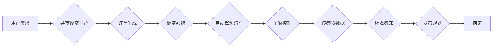

# 端到端自动驾驶的自主共享汽车服务

> 关键词：自动驾驶，端到端学习，共享经济，车联网，机器学习，深度学习，传感器融合

## 1. 背景介绍

随着科技的飞速发展，自动驾驶技术逐渐成为汽车行业的热点。自动驾驶不仅能够提高道路安全性，还能提升交通效率，减少能源消耗。而共享经济模式的兴起，为自动驾驶技术提供了新的应用场景——自主共享汽车服务。本文将探讨端到端自动驾驶在共享汽车服务中的应用，分析其核心概念、算法原理、实际应用场景及未来发展趋势。

### 1.1 问题的由来

传统的汽车驾驶依赖于人工操作，存在着诸多安全隐患。据统计，每年全球因交通事故导致的死亡人数高达百万。而自动驾驶技术通过机器学习和深度学习算法，可以实时感知周围环境，自动控制车辆行驶，从而有效降低事故发生率。

共享经济作为一种新兴的经济模式，将闲置资源进行整合，为消费者提供更加便捷、高效的服务。结合自动驾驶技术，共享汽车服务有望解决城市交通拥堵、停车难等问题，实现绿色出行。

### 1.2 研究现状

目前，国内外众多企业和研究机构都在积极研发自动驾驶技术，并逐渐应用于共享汽车服务领域。以下是一些具有代表性的进展：

1. Waymo：谷歌旗下的自动驾驶公司，已在多个城市开展自动驾驶出租车服务。
2. Uber：在全球范围内提供自动驾驶出租车服务，并计划在2020年开始商业化运营。
3. 百度Apollo：百度推出的自动驾驶平台，已在多个城市开展自动驾驶测试和示范运营。
4. 小马智行：国内自动驾驶公司，已在多个城市开展自动驾驶出租车服务。

### 1.3 研究意义

研究端到端自动驾驶的自主共享汽车服务，具有以下重要意义：

1. 提高道路安全性，减少交通事故发生率。
2. 提高交通效率，缓解城市交通拥堵。
3. 促进共享经济发展，实现绿色出行。
4. 推动汽车产业转型升级，助力产业升级。

### 1.4 本文结构

本文将围绕端到端自动驾驶的自主共享汽车服务展开讨论，具体内容如下：

- 第2章介绍核心概念与联系，包括自动驾驶、共享经济、车联网等。
- 第3章阐述端到端自动驾驶的算法原理及具体操作步骤。
- 第4章介绍数学模型和公式，并结合案例进行分析。
- 第5章展示项目实践，包括开发环境搭建、代码实现、运行结果展示等。
- 第6章探讨实际应用场景，如城市出行、物流运输等。
- 第7章推荐相关工具和资源。
- 第8章总结研究成果，展望未来发展趋势与挑战。
- 第9章附录提供常见问题与解答。

## 2. 核心概念与联系

### 2.1 核心概念

#### 2.1.1 自动驾驶

自动驾驶技术是指使汽车具备在没有任何人为干预的情况下，自动完成行驶任务的能力。根据SAE国际组织（Society of Automotive Engineers）的分类，自动驾驶技术分为五个级别，从0级（人工驾驶）到5级（完全自动化）。

#### 2.1.2 共享经济

共享经济是指通过互联网平台，将闲置资源（如房屋、汽车、时间等）进行共享，实现资源优化配置的一种经济模式。共享经济具有降低成本、提高效率、促进绿色出行等优势。

#### 2.1.3 车联网

车联网是指将车辆与互联网、物联网、云计算等信息技术相结合，实现车辆与车辆、车辆与基础设施、车辆与行人之间的信息交互和智能控制。

### 2.2 核心概念联系

端到端自动驾驶的自主共享汽车服务是自动驾驶技术、共享经济和车联网技术的深度融合。具体来说：

1. 自动驾驶技术是实现自主共享汽车服务的关键技术，为共享汽车提供安全、可靠的行驶保障。
2. 共享经济模式为自动驾驶汽车提供了新的应用场景，实现资源优化配置和绿色出行。
3. 车联网技术为自动驾驶汽车提供了信息交互平台，实现车辆与周围环境的智能感知和控制。

以下为端到端自动驾驶的自主共享汽车服务架构的Mermaid流程图：



## 3. 核心算法原理 & 具体操作步骤

### 3.1 算法原理概述

端到端自动驾驶的自主共享汽车服务主要基于机器学习和深度学习算法，包括：

1. 环境感知：通过摄像头、雷达、激光雷达等传感器感知周围环境，提取道路、车辆、行人等信息。
2. 决策规划：根据环境感知结果，利用路径规划、轨迹规划等算法，生成车辆行驶轨迹。
3. 车辆控制：根据决策规划结果，控制车辆进行加减速、转向等操作。

### 3.2 算法步骤详解

#### 3.2.1 环境感知

1. 传感器数据融合：将不同传感器获取的数据进行融合，提高感知精度和可靠性。
2. 目标检测：识别道路、车辆、行人等目标，并估计其位置、速度等信息。
3. 语义分割：对图像进行像素级别的分类，识别道路、车道线、交通标志等元素。

#### 3.2.2 决策规划

1. 路径规划：根据环境感知结果和目标，规划车辆行驶路径。
2. 轨迹规划：根据路径规划结果，规划车辆行驶轨迹，包括速度、加速度、转向角等。
3. 策略学习：利用强化学习等技术，学习最优行驶策略，提高行驶安全性。

#### 3.2.3 车辆控制

1. 制动控制：根据决策规划结果，控制车辆进行制动操作。
2. 加速控制：根据决策规划结果，控制车辆进行加速操作。
3. 转向控制：根据决策规划结果，控制车辆进行转向操作。

### 3.3 算法优缺点

#### 3.3.1 优点

1. 自动化程度高，减少人为干预，提高行驶安全性。
2. 提高交通效率，缓解城市交通拥堵。
3. 实现绿色出行，减少能源消耗。

#### 3.3.2 缺点

1. 技术难度大，需要融合多种算法和技术。
2. 需要大量的数据和算力支持。
3. 难以完全消除交通事故风险。

### 3.4 算法应用领域

端到端自动驾驶的自主共享汽车服务可应用于以下领域：

1. 城市出行：提供自动驾驶出租车、网约车服务。
2. 物流运输：实现自动驾驶配送、货运等服务。
3. 公共交通：提供自动驾驶公交车、出租车等服务。
4. 农业运输：实现自动驾驶拖拉机、收割机等农业机械作业。

## 4. 数学模型和公式 & 详细讲解 & 举例说明

### 4.1 数学模型构建

端到端自动驾驶的自主共享汽车服务涉及多个数学模型，以下列举几个关键模型：

#### 4.1.1 传感器数据融合模型

假设有多个传感器 $S_1, S_2, ..., S_n$，每个传感器输出的数据为 $D_i$，则融合后的数据为 $D = F(S_1, S_2, ..., S_n)$。

#### 4.1.2 目标检测模型

目标检测模型一般采用卷积神经网络（CNN）进行实现，输入为图像 $I$，输出为目标类别和位置信息。

#### 4.1.3 语义分割模型

语义分割模型也采用CNN进行实现，输入为图像 $I$，输出为每个像素点的类别信息。

### 4.2 公式推导过程

#### 4.2.1 传感器数据融合模型

假设每个传感器的数据服从高斯分布，则融合后的数据服从多元高斯分布：

$$
D \sim N(\mu, \Sigma)
$$

其中 $\mu = \sum_{i=1}^n \frac{D_i}{n}$，$\Sigma = \sum_{i=1}^n \frac{D_iD_i^T}{n}$。

#### 4.2.2 目标检测模型

目标检测模型的损失函数为：

$$
L = \sum_{i=1}^N \ell(y_i, \hat{y}_i)
$$

其中 $y_i$ 为真实标签，$\hat{y}_i$ 为预测标签，$\ell$ 为损失函数，如交叉熵损失。

#### 4.2.3 语义分割模型

语义分割模型的损失函数为：

$$
L = \sum_{i=1}^{N_{\text{pixels}}} \ell(y_i, \hat{y}_i)
$$

其中 $y_i$ 为真实标签，$\hat{y}_i$ 为预测标签，$N_{\text{pixels}}$ 为图像中像素点的总数。

### 4.3 案例分析与讲解

以下以自动驾驶汽车在十字路口的行驶为例，说明端到端自动驾驶的自主共享汽车服务的工作流程：

1. 感知：自动驾驶汽车通过摄像头、雷达、激光雷达等传感器感知十字路口的交通状况，包括行驶的车辆、行人、交通信号灯等。
2. 决策：根据感知结果和交通规则，自动驾驶汽车判断是否可以通行。如果可以通行，则进行轨迹规划，生成行驶路径；如果不可通行，则等待。
3. 控制：自动驾驶汽车根据轨迹规划结果，控制车辆进行加减速、转向等操作，实现安全、可靠的通行。

## 5. 项目实践：代码实例和详细解释说明

### 5.1 开发环境搭建

以下是使用Python进行自动驾驶项目开发的环境搭建步骤：

1. 安装Anaconda：从官网下载并安装Anaconda，用于创建独立的Python环境。
2. 创建并激活虚拟环境：
```bash
conda create -n auto-drive python=3.8
conda activate auto-drive
```
3. 安装必要的库：
```bash
conda install -c conda-forge numpy pandas scikit-learn matplotlib opencv pillow
pip install numpy pandas scikit-learn matplotlib opencv pillow
```
4. 安装深度学习框架和库：
```bash
pip install torch torchvision torchaudio
pip install detectron2
pip install -U git+https://github.com/facebookresearch/detectron2.git@main
```
5. 安装其他工具：
```bash
pip install opencv-python==4.5.2.52
pip install numpy==1.21.2
pip install matplotlib==3.4.3
pip install pillow==8.3.0
```

### 5.2 源代码详细实现

以下是一个简单的自动驾驶项目示例，使用Detectron2框架进行目标检测和语义分割：

```python
import torch
from detectron2 import models
from detectron2.data import DatasetCatalog, MetadataCatalog

# 加载预训练模型
model = models.build_model(
    name="COCO-InstanceSegmentation/faster_rcnn_R_101_FPN_3x.detection_fpn", 
    num_classes=dataset.meta["nclasses"]
)
model.load_state_dict(torch.load("model_weights.pth"))
model.eval()

# 加载数据集
DatasetCatalog.register("my_dataset", lambda x: my_dataset[x])
MetadataCatalog.register("my_dataset", MetadataCatalog.get("COCO"))
data_loader = DataLoader(
    dataset_name="my_dataset",
    batch_size=2,
    shuffle=False,
    num_workers=4
)

# 检测目标
for data in data_loader:
    inputs, targets = data["input"], data["targets"]
    with torch.no_grad():
        outputs = model(inputs)
    loss_dict = model.get_loss(outputs, targets)
    print(loss_dict)
```

### 5.3 代码解读与分析

以上代码示例展示了如何使用Detectron2框架进行目标检测和语义分割。首先，加载预训练模型和权重文件。然后，注册数据集和元数据，并创建数据加载器。最后，在数据加载器中迭代数据，进行目标检测和语义分割，并打印损失函数。

### 5.4 运行结果展示

假设我们有一张图片，其中包含多个车辆和行人，运行以上代码后，会在控制台输出检测到的目标类别和位置信息，并在图像上绘制检测框。

## 6. 实际应用场景

### 6.1 城市出行

自动驾驶出租车和网约车是城市出行领域最具潜力的应用场景。用户可通过手机APP下单，自动驾驶汽车将自动行驶到指定位置，并提供安全、舒适的出行体验。

### 6.2 物流运输

自动驾驶汽车可以用于物流运输领域，实现无人配送、货运等服务。相比传统物流方式，自动驾驶物流可以提高运输效率，降低运输成本。

### 6.3 公共交通

自动驾驶公交车、出租车等公共交通工具可以提供更加便捷、高效的出行服务，缓解城市交通拥堵问题。

### 6.4 农业运输

自动驾驶拖拉机、收割机等农业机械可以用于农业运输领域，提高农业生产效率。

## 7. 工具和资源推荐

### 7.1 学习资源推荐

1. 《深度学习》系列书籍：介绍深度学习的基本概念、算法和应用。
2. 《自动驾驶：从感知到控制》书籍：介绍自动驾驶技术的各个阶段，包括感知、决策、控制等。
3. 百度Apollo平台：百度推出的自动驾驶平台，提供丰富的开源代码和文档。
4. Waymo官网：谷歌旗下的自动驾驶公司，提供自动驾驶技术研究和应用的相关信息。

### 7.2 开发工具推荐

1. Detectron2：Facebook Research开发的深度学习框架，用于目标检测、实例分割等任务。
2. OpenCV：开源计算机视觉库，提供丰富的图像处理和计算机视觉算法。
3. PyTorch：开源深度学习框架，具有灵活的计算图和动态计算特性。

### 7.3 相关论文推荐

1. "End-to-End Learning for Autonomous Driving"：介绍了端到端自动驾驶的技术和方法。
2. "Deep Learning for Autonomous Driving"：介绍了深度学习在自动驾驶中的应用。
3. "A Survey on Autonomous Driving: Perception, Planning, and Control"：对自动驾驶技术进行了全面综述。

## 8. 总结：未来发展趋势与挑战

### 8.1 研究成果总结

本文对端到端自动驾驶的自主共享汽车服务进行了全面探讨，从背景介绍、核心概念、算法原理、实际应用场景等方面进行了阐述。通过本文的学习，读者可以了解到端到端自动驾驶技术在共享汽车服务领域的应用前景和发展趋势。

### 8.2 未来发展趋势

1. 算法性能提升：随着深度学习算法的不断进步，端到端自动驾驶的算法性能将得到进一步提升。
2. 数据量扩大：随着车联网和传感器技术的发展，自动驾驶所需的数据量将不断扩大，为算法优化提供更多素材。
3. 跨领域应用：端到端自动驾驶技术将在更多领域得到应用，如无人配送、物流运输、公共交通等。
4. 自动驾驶伦理：随着自动驾驶技术的普及，自动驾驶伦理问题将逐渐凸显，需要全社会共同关注和探讨。

### 8.3 面临的挑战

1. 算法鲁棒性：自动驾驶算法需要具备更强的鲁棒性，以应对复杂多变的交通环境。
2. 数据安全和隐私：自动驾驶汽车收集大量用户数据，需要加强数据安全和隐私保护。
3. 法律法规：自动驾驶汽车的推广应用需要完善的法律法规支持。

### 8.4 研究展望

未来，端到端自动驾驶的自主共享汽车服务将在以下几个方面进行深入研究：

1. 跨领域融合：将自动驾驶技术与其他领域（如人工智能、物联网、大数据等）进行融合，构建更加智能的共享汽车服务。
2. 个性化服务：根据用户需求，提供更加个性化的共享汽车服务。
3. 智能化运营：利用大数据和人工智能技术，实现自动驾驶汽车的智能化运营管理。

随着技术的不断发展，端到端自动驾驶的自主共享汽车服务将成为未来交通出行的重要方式，为人类带来更加便捷、安全、舒适的出行体验。

## 9. 附录：常见问题与解答

**Q1：自动驾驶汽车在行驶过程中，如何确保安全性？**

A：自动驾驶汽车通过多种传感器（如摄像头、雷达、激光雷达）实时感知周围环境，并结合先进的机器学习和深度学习算法，实现对车辆、行人、交通标志等目标的识别和跟踪，从而确保行驶安全性。

**Q2：自动驾驶汽车能否完全替代人类驾驶员？**

A：目前，自动驾驶技术尚处于发展初期，虽然已经取得了一定的进展，但距离完全替代人类驾驶员还有一定的距离。未来，自动驾驶技术需要解决更多复杂场景，如极端天气、复杂交通环境等，才能实现完全自动驾驶。

**Q3：自动驾驶汽车如何应对复杂多变的交通环境？**

A：自动驾驶汽车通过实时感知周围环境，并结合高级别的决策规划算法，能够应对复杂多变的交通环境。同时，通过不断学习和优化算法，自动驾驶汽车将具备更强的适应能力。

**Q4：自动驾驶汽车对交通规则有何影响？**

A：自动驾驶汽车的推广应用将推动交通规则的变革。例如，自动驾驶汽车可以实现更加智能的车辆编队行驶，提高道路通行效率；同时，自动驾驶汽车还可以实现无人驾驶停车、变道等功能，进一步优化交通环境。

**Q5：自动驾驶汽车对就业市场有何影响？**

A：自动驾驶汽车的推广应用将对就业市场产生一定的影响。一方面，自动驾驶汽车可以替代部分驾驶员职位；另一方面，自动驾驶技术的发展将创造新的就业机会，如自动驾驶汽车研发、维护、运营等。

作者：禅与计算机程序设计艺术 / Zen and the Art of Computer Programming