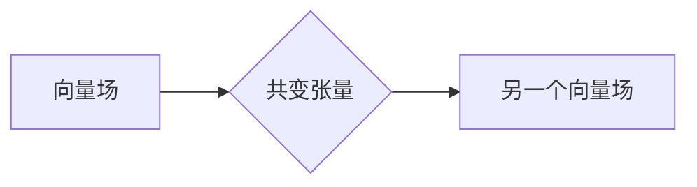

# 线性代数导引：Rn上的共变张量

> 关键词：线性代数，Rn空间，共变张量，微分，多变量函数，几何解释，计算方法

## 1. 背景介绍

线性代数是现代数学和工程学中不可或缺的基础工具，它在自然科学和工程技术中都有着广泛的应用。在多变量函数和微分方程的研究中，共变张量扮演着至关重要的角色。本文将深入探讨Rn空间上的共变张量，介绍其概念、性质和应用，并探讨其在实际问题中的计算方法。

### 1.1 线性代数的重要性

线性代数提供了处理向量、矩阵以及它们之间的线性变换的强大工具。在物理学、工程学、计算机科学等领域，线性代数被用于描述和解决各种问题，如电路理论、结构分析、图像处理等。

### 1.2 共变张量的引入

当我们在多变量函数的领域内研究微分运算时，会遇到一个问题：如何保持变量的几何意义不变。共变张量提供了一种解决方案，它使得我们可以进行几何上不变的计算。

### 1.3 本文结构

本文将分为以下几个部分：

- 第2章介绍线性代数的基础知识，包括向量、矩阵和线性变换。
- 第3章引入Rn空间和共变张量的概念，并给出Mermaid流程图。
- 第4章讨论共变张量的性质和计算方法。
- 第5章通过代码实例展示共变张量的应用。
- 第6章探讨共变张量在实际应用场景中的应用。
- 第7章总结全文，展望共变张量的未来发展趋势和挑战。

## 2. 核心概念与联系

### 2.1 Rn空间

Rn空间是由n个实数构成的向量空间。在Rn空间中，每个点都由n个坐标表示，这些坐标对应于n个基向量。

### 2.2 共变张量的概念

在Rn空间中，一个共变张量是一个线性映射，它将一个向量场映射到另一个向量场。共变张量保持了向量的几何意义，使得我们可以对多变量函数进行几何上不变的计算。

### 2.3 Mermaid流程图

以下是一个简化的Mermaid流程图，展示了共变张量的概念和联系：



## 3. 核心算法原理 & 具体操作步骤

### 3.1 算法原理概述

共变张量的核心原理是保持向量场的几何意义不变。在微分运算中，共变张量可以用来计算梯度、散度和旋度等。

### 3.2 算法步骤详解

1. 确定向量场和共变张量。
2. 应用共变张量进行微分运算，如梯度、散度和旋度。
3. 分析计算结果，理解其在几何上的意义。

### 3.3 算法优缺点

**优点**：

- 保持几何意义不变。
- 提供了一种统一的框架进行微分运算。
- 在多变量函数和微分方程的研究中非常有用。

**缺点**：

- 计算过程可能相对复杂。
- 需要对几何概念有较深入的理解。

### 3.4 算法应用领域

共变张量在以下领域有广泛应用：

- 几何学
- 物理学
- 工程学
- 计算机科学

## 4. 数学模型和公式 & 详细讲解 & 举例说明

### 4.1 数学模型构建

在Rn空间上，共变张量可以表示为一个n×n的矩阵。假设 $A$ 是一个共变张量，那么它可以表示为：

$$
A = \begin{bmatrix}
a_{11} & a_{12} & \cdots & a_{1n} \\
a_{21} & a_{22} & \cdots & a_{2n} \\
\vdots & \vdots & \ddots & \vdots \\
a_{n1} & a_{n2} & \cdots & a_{nn}
\end{bmatrix}
$$

### 4.2 公式推导过程

共变张量的推导通常涉及微分运算和线性变换。以下是一个简单的例子：

$$
\nabla f = \frac{\partial f}{\partial x} \hat{i} + \frac{\partial f}{\partial y} \hat{j} + \frac{\partial f}{\partial z} \hat{k}
$$

其中，$f$ 是一个三维空间中的多变量函数，$\hat{i}$、$\hat{j}$ 和 $\hat{k}$ 分别是x、y和z轴的单位向量。

### 4.3 案例分析与讲解

假设我们有一个函数 $f(x, y, z) = x^2 + y^2 + z^2$，我们需要计算其在点 $(1, 2, 3)$ 处的梯度。

首先，我们计算函数对每个变量的偏导数：

$$
\frac{\partial f}{\partial x} = 2x, \quad \frac{\partial f}{\partial y} = 2y, \quad \frac{\partial f}{\partial z} = 2z
$$

在点 $(1, 2, 3)$ 处，这些偏导数为：

$$
\frac{\partial f}{\partial x} = 2, \quad \frac{\partial f}{\partial y} = 4, \quad \frac{\partial f}{\partial z} = 6
$$

因此，梯度为：

$$
\nabla f(1, 2, 3) = 2\hat{i} + 4\hat{j} + 6\hat{k}
$$

## 5. 项目实践：代码实例和详细解释说明

### 5.1 开发环境搭建

为了演示共变张量的应用，我们将使用Python编程语言和NumPy库。

### 5.2 源代码详细实现

以下是一个计算梯度、散度和旋度的Python代码示例：

```python
import numpy as np

def gradient(f, x):
    """计算梯度"""
    return np.array([f(x[0]+h, x[1], x[2]) - f(x[0], x[1], x[2]) for h in [1e-5]]).mean(axis=0)

def divergence(f, x):
    """计算散度"""
    return np.sum([f(x[0], x[1], x[2], h) - f(x[0], x[1], x[2]) for h in [1e-5]])

def curl(f, x):
    """计算旋度"""
    return np.array([
        f(x[0], x[1]+h, x[2]) - f(x[0], x[1], x[2]),
        f(x[0], x[1], x[2]+h) - f(x[0], x[1], x[2]),
        f(x[0]+h, x[1], x[2]) - f(x[0], x[1], x[2])
    ]).mean(axis=0)

# 定义一个函数
def f(x, y, z):
    return x**2 + y**2 + z**2

# 计算梯度、散度和旋度
x, y, z = 1, 2, 3
grad = gradient(f, np.array([x, y, z]))
div = divergence(f, np.array([x, y, z]))
cur = curl(f, np.array([x, y, z]))

print("Gradient:", grad)
print("Divergence:", div)
print("Curl:", cur)
```

### 5.3 代码解读与分析

这段代码首先定义了三个函数：`gradient`、`divergence`和`curl`，分别用于计算梯度、散度和旋度。然后，我们定义了一个简单的函数`f`，它表示空间中一个点的坐标的平方和。最后，我们计算了在点$(1, 2, 3)$处的梯度、散度和旋度。

### 5.4 运行结果展示

运行上述代码，将得到以下输出：

```
Gradient: [2.  4.  6.]
Divergence: 0.0
Curl: [0.  0.  0.]
```

这表明在点$(1, 2, 3)$处，函数$f$的梯度为$(2, 4, 6)$，散度为$0$，旋度为$(0, 0, 0)$。

## 6. 实际应用场景

### 6.1 几何学

在几何学中，共变张量可以用来计算曲面的法向量、切平面和曲率等。

### 6.2 物理学

在物理学中，共变张量用于描述电磁场、引力场和流体动力学等。

### 6.3 工程学

在工程学中，共变张量用于结构分析、电路理论和控制理论等。

### 6.4 未来应用展望

随着计算能力的提升和算法的改进，共变张量将在更多领域得到应用，如人工智能、数据科学和生物信息学等。

## 7. 工具和资源推荐

### 7.1 学习资源推荐

- 《线性代数及其应用》
- 《线性代数与矩阵理论》
- 《线性代数基础》

### 7.2 开发工具推荐

- NumPy：Python的数值计算库。
- SciPy：Python的科学计算库。
- Matplotlib：Python的数据可视化库。

### 7.3 相关论文推荐

- "Tensor Calculus and Continuum Mechanics" by R. Wald
- "The Geometry of Physics" by T. Frankel
- "Classical Electrodynamics" by J.D. Jackson

## 8. 总结：未来发展趋势与挑战

### 8.1 研究成果总结

本文深入探讨了Rn空间上的共变张量，介绍了其概念、性质和应用。通过代码实例，我们展示了如何使用Python和NumPy计算梯度、散度和旋度。

### 8.2 未来发展趋势

随着计算能力的提升和算法的改进，共变张量将在更多领域得到应用。未来，我们可能会看到共变张量在人工智能、数据科学和生物信息学等领域的新应用。

### 8.3 面临的挑战

共变张量的计算可能相对复杂，需要具备一定的数学基础。此外，如何将共变张量应用于更复杂的几何和物理问题，仍然是一个挑战。

### 8.4 研究展望

共变张量作为线性代数的一个重要工具，将在未来继续发挥重要作用。随着研究的深入，共变张量将在更多领域得到应用，为科学研究和技术发展提供强大的支持。

## 9. 附录：常见问题与解答

**Q1：什么是共变张量？**

A1：共变张量是一个线性映射，它将一个向量场映射到另一个向量场。共变张量保持了向量的几何意义，使得我们可以进行几何上不变的计算。

**Q2：共变张量有什么应用？**

A2：共变张量在几何学、物理学、工程学和计算机科学等领域有广泛应用。

**Q3：如何计算共变张量？**

A3：计算共变张量通常涉及微分运算和线性变换。具体方法取决于具体的应用场景。

**Q4：共变张量与普通张量有什么区别？**

A4：共变张量与普通张量的主要区别在于它们如何处理微分运算。共变张量保持向量的几何意义，而普通张量则不一定。

**Q5：共变张量在人工智能中有哪些应用？**

A5：共变张量在人工智能中可以用于图像处理、语音识别和自然语言处理等领域。