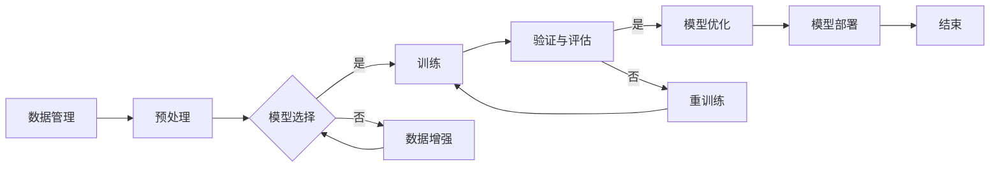

# 自动驾驶公司的云端训练设施建设

> 关键词：自动驾驶，云端训练，深度学习，GPU集群，分布式计算，数据管理，模型优化，高性能计算

## 1. 背景介绍

随着人工智能和自动驾驶技术的飞速发展，自动驾驶汽车逐渐从概念走向现实。自动驾驶技术的核心在于复杂的机器学习模型，这些模型需要在海量数据上进行训练，以实现高精度的感知、决策和执行。云端训练设施作为自动驾驶研发的重要基础设施，其建设对于提高研发效率和模型性能至关重要。

### 1.1 自动驾驶技术的发展

自动驾驶技术经历了从感知、决策到执行的不断演进。感知阶段主要通过摄像头、雷达、激光雷达等多传感器融合技术实现；决策阶段则依赖于高级的机器学习模型，如深度神经网络，来处理感知数据并生成驾驶指令；执行阶段则将决策转化为具体的控制信号，驱动汽车执行相应的动作。

### 1.2 云端训练的重要性

自动驾驶汽车的研发需要大量的计算资源和数据。传统的本地训练方法受限于硬件资源和数据存储，往往难以满足大规模数据集和复杂模型的训练需求。云端训练设施通过提供弹性、可扩展的计算资源和高效的数据管理，为自动驾驶模型的研发提供了强有力的支持。

## 2. 核心概念与联系

### 2.1 核心概念

**深度学习**：一种利用多层神经网络进行数据学习和特征提取的技术，广泛应用于图像识别、语音识别和自然语言处理等领域。

**GPU集群**：由多台图形处理单元（GPU）组成的计算集群，适用于并行计算密集型任务。

**分布式计算**：将计算任务分布在多台计算机上执行，以提高计算效率和扩展性。

**数据管理**：对训练数据、模型参数、训练日志等数据进行高效存储、管理和备份。

**模型优化**：通过调整模型结构、优化算法和超参数等手段，提高模型性能和效率。

**高性能计算**：使用高性能硬件和软件技术，实现快速计算和数据处理。

### 2.2 架构流程图



## 3. 核心算法原理 & 具体操作步骤

### 3.1 算法原理概述

云端训练设施的核心是分布式计算和深度学习框架。分布式计算通过将训练任务分解为多个子任务，并行地在多台GPU上进行计算，从而加速训练过程。深度学习框架则提供了一系列库和工具，用于模型定义、训练和评估。

### 3.2 算法步骤详解

**步骤 1：数据管理**

- 数据收集：从各种来源收集用于训练的数据，包括图像、视频、雷达数据等。
- 数据预处理：对收集到的数据进行清洗、标注、增强等预处理操作，以提高数据质量和模型泛化能力。
- 数据存储：将预处理后的数据存储在云端存储系统中，如Amazon S3、Azure Blob Storage等。

**步骤 2：模型选择**

- 根据任务需求选择合适的深度学习模型，如卷积神经网络（CNN）、循环神经网络（RNN）或 Transformer。
- 使用深度学习框架定义模型结构，并设置超参数。

**步骤 3：训练**

- 使用分布式计算框架将训练任务分配到GPU集群中，进行并行计算。
- 使用优化算法（如SGD、Adam等）更新模型参数，以最小化损失函数。

**步骤 4：验证与评估**

- 使用验证集评估模型性能，并根据评估结果调整超参数和模型结构。
- 使用交叉验证等技术评估模型的泛化能力。

**步骤 5：模型优化**

- 根据验证结果对模型进行优化，包括调整超参数、改变模型结构或引入正则化技术。

**步骤 6：模型部署**

- 将训练好的模型部署到生产环境中，用于实时预测或离线分析。

### 3.3 算法优缺点

**优点**：

- **高效**：分布式计算可以显著缩短训练时间。
- **可扩展**：可以根据需要扩展计算资源。
- **灵活**：可以使用不同的深度学习框架和模型。

**缺点**：

- **成本高**：需要大量的计算资源和存储空间。
- **复杂**：需要管理和维护复杂的计算集群。

### 3.4 算法应用领域

云端训练设施在自动驾驶领域具有广泛的应用，包括：

- **感知系统**：使用深度学习模型进行图像识别、雷达数据解读等。
- **决策系统**：使用强化学习等技术进行路径规划和决策。
- **执行系统**：使用深度学习模型进行控制信号生成。

## 4. 数学模型和公式 & 详细讲解 & 举例说明

### 4.1 数学模型构建

自动驾驶汽车的决策系统通常采用深度神经网络进行建模。以下是一个简单的CNN模型示例：

$$
\begin{align*}
\text{Conv}_1(x) &= \text{ReLU}(\text{Conv}(\text{Relu}(\text{Conv}(\text{Relu}(\text{Conv}(x))))), W_1, b_1) \\
\text{Conv}_2(x) &= \text{ReLU}(\text{Conv}(\text{Relu}(\text{Relu}(\text{Relu}(\text{Relu}(\text{Conv}_1(x))))), W_2, b_2) \\
\text{FClayer}(x) &= \text{ReLU}(\text{FC}(\text{ReLU}(\text{FC}(\text{ReLU}(\text{FC}(x))))), W_3, b_3) \\
\text{Output} &= \text{softmax}(\text{FClayer}(x))
\end{align*}
$$

其中，$\text{Conv}$ 表示卷积层，$\text{FC}$ 表示全连接层，$W$ 表示权重矩阵，$b$ 表示偏置向量，$\text{ReLU}$ 表示ReLU激活函数，$\text{softmax}$ 表示softmax激活函数。

### 4.2 公式推导过程

CNN模型的基本原理是通过卷积层提取图像特征，再通过全连接层进行分类。卷积层通过权值矩阵学习图像的空间特征，全连接层则将特征转换为类别概率。

### 4.3 案例分析与讲解

以自动驾驶汽车的路径规划任务为例，使用CNN模型对道路场景进行分类，并根据分类结果生成驾驶指令。

## 5. 项目实践：代码实例和详细解释说明

### 5.1 开发环境搭建

以下是一个使用PyTorch在GPU集群上训练CNN模型的示例代码：

```python
import torch
import torch.nn as nn
import torch.optim as optim
from torchvision import datasets, transforms

# 定义CNN模型
class CNN(nn.Module):
    def __init__(self):
        super(CNN, self).__init__()
        self.conv1 = nn.Conv2d(3, 16, kernel_size=3, stride=1, padding=1)
        self.conv2 = nn.Conv2d(16, 32, kernel_size=3, stride=1, padding=1)
        self.fc1 = nn.Linear(32 * 16 * 16, 128)
        self.fc2 = nn.Linear(128, 10)

    def forward(self, x):
        x = torch.relu(self.conv1(x))
        x = torch.relu(self.conv2(x))
        x = x.view(-1, 32 * 16 * 16)
        x = torch.relu(self.fc1(x))
        x = self.fc2(x)
        return x

# 加载数据
transform = transforms.Compose([transforms.ToTensor()])
train_dataset = datasets.MNIST(root='./data', train=True, transform=transform, download=True)
train_loader = torch.utils.data.DataLoader(dataset=train_dataset, batch_size=64, shuffle=True)

# 初始化模型和优化器
model = CNN()
optimizer = optim.Adam(model.parameters(), lr=0.001)

# 训练模型
for epoch in range(5):
    for i, (images, labels) in enumerate(train_loader):
        optimizer.zero_grad()
        outputs = model(images)
        loss = nn.CrossEntropyLoss()(outputs, labels)
        loss.backward()
        optimizer.step()
        if i % 100 == 0:
            print(f'Epoch {epoch}, Step {i}, Loss: {loss.item()}')

# 保存模型
torch.save(model.state_dict(), 'cnn_model.pth')
```

### 5.2 源代码详细实现

以上代码定义了一个简单的CNN模型，并使用MNIST数据集进行训练。代码首先定义了模型结构，然后加载数据集并创建数据加载器。接着，初始化模型和优化器，并进行训练。最后，保存训练好的模型。

### 5.3 代码解读与分析

- `CNN` 类定义了CNN模型结构，包括两个卷积层、两个ReLU激活函数和一个全连接层。
- `forward` 方法实现了数据的前向传播过程。
- 使用 `torch.utils.data.DataLoader` 加载数据集，并进行批处理。
- 使用 `nn.CrossEntropyLoss` 计算损失函数。
- 使用 `optimizer.zero_grad` 和 `optimizer.step` 进行参数更新。

### 5.4 运行结果展示

运行以上代码后，模型将在GPU集群上训练MNIST数据集，并输出训练过程中的损失值。

## 6. 实际应用场景

### 6.1 自动驾驶感知系统

在自动驾驶汽车的感知系统中，使用深度学习模型进行图像识别、雷达数据解读等，以获取周围环境信息。

### 6.2 自动驾驶决策系统

在自动驾驶汽车的决策系统中，使用强化学习等技术进行路径规划和决策，以控制汽车的行驶方向和速度。

### 6.3 自动驾驶执行系统

在自动驾驶汽车的执行系统中，使用深度学习模型生成控制信号，以驱动汽车执行相应的动作。

## 7. 工具和资源推荐

### 7.1 学习资源推荐

- 《深度学习》 [Goodfellow, Bengio, Courville]
- 《Python深度学习》 [François Chollet]
- 《TensorFlow实战》 [Adrian Rosebrock]

### 7.2 开发工具推荐

- PyTorch
- TensorFlow
- CUDA
- cuDNN

### 7.3 相关论文推荐

- "GoogLeNet: A Large Scale Deep Convolutional Network for Image Recognition" [Szegedy et al., 2015]
- "Deep Residual Learning for Image Recognition" [He et al., 2016]
- "Batch Normalization: Accelerating Deep Network Training by Reducing Internal Covariate Shift" [Ioffe & Szegedy, 2015]

## 8. 总结：未来发展趋势与挑战

### 8.1 研究成果总结

云端训练设施在自动驾驶领域的应用取得了显著成果，提高了自动驾驶模型的研发效率和性能。未来，随着深度学习技术和云计算技术的不断发展，云端训练设施将更加高效、灵活，并能够支持更复杂的模型和更大的数据集。

### 8.2 未来发展趋势

- **更高效的训练算法**：开发更高效的训练算法，如分布式训练、联邦学习等，以减少训练时间和计算资源消耗。
- **更强大的模型压缩技术**：开发模型压缩技术，如知识蒸馏、模型剪枝等，以减小模型尺寸和提高推理速度。
- **更智能的数据管理**：开发更智能的数据管理技术，如数据增强、数据去噪等，以提高数据质量和模型泛化能力。

### 8.3 面临的挑战

- **数据隐私和安全**：自动驾驶训练过程中涉及大量敏感数据，如何保护数据隐私和安全是一个重要挑战。
- **模型可解释性**：如何提高模型的可解释性，以增强用户对自动驾驶系统的信任。
- **计算资源限制**：如何优化训练过程，以适应有限的计算资源。

### 8.4 研究展望

随着技术的不断发展，云端训练设施将在自动驾驶领域发挥越来越重要的作用。未来，我们需要关注以下几个方面：

- **跨领域迁移学习**：开发能够跨领域迁移的模型，以适应不同场景和任务的需求。
- **多模态数据融合**：将图像、雷达、激光雷达等多模态数据进行融合，以提高感知系统的鲁棒性和准确性。
- **人机协同决策**：开发人机协同的决策系统，以应对复杂多变的驾驶场景。

## 9. 附录：常见问题与解答

**Q1：什么是自动驾驶云平台？**

A：自动驾驶云平台是一种基于云计算的自动驾驶研发平台，提供弹性、可扩展的计算资源和数据管理功能，支持自动驾驶模型的训练、测试和部署。

**Q2：为什么选择云端训练？**

A：云端训练具有以下优势：
- **弹性计算资源**：可以根据需求动态调整计算资源。
- **高效数据管理**：提供高效的数据存储、管理和备份功能。
- **降低研发成本**：减少硬件投资和运维成本。

**Q3：如何保证数据安全和隐私？**

A：为了保证数据安全和隐私，可以采取以下措施：
- **数据加密**：对敏感数据进行加密存储和传输。
- **访问控制**：限制对数据的访问权限。
- **审计日志**：记录数据访问和操作记录，以便进行追踪和审计。

**Q4：如何评估模型性能？**

A：可以通过以下指标评估模型性能：
- **准确率**：模型预测正确的样本比例。
- **召回率**：模型正确预测的样本占所有正类样本的比例。
- **F1分数**：准确率和召回率的调和平均值。

**Q5：如何选择合适的训练算法？**

A：选择训练算法时，需要考虑以下因素：
- **模型类型**：不同类型的模型适合不同的训练算法。
- **数据规模**：大规模数据集适合使用分布式训练算法。
- **计算资源**：有限的计算资源可能需要使用参数高效的训练算法。

作者：禅与计算机程序设计艺术 / Zen and the Art of Computer Programming