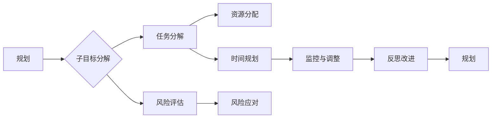

# 规划：子目标分解与反思改进

> 关键词：规划，子目标分解，目标管理，迭代改进，项目成功，项目管理

## 1. 背景介绍

在快速变化和竞争激烈的技术领域，有效的规划是确保项目成功的关键。规划不仅仅是设定一个宏伟的目标，更重要的是将这个目标分解为一系列可执行的子目标，并通过持续反思和改进来确保项目按计划进行。本文将深入探讨子目标分解的原理、操作步骤，以及如何通过反思改进来提升项目管理的效率。

### 1.1 问题的由来

在项目管理中，我们经常会遇到以下问题：

- 项目目标不够明确，导致团队成员对任务的理解不一致。
- 项目进度缓慢，无法按预期完成。
- 遇到意外情况时，缺乏有效的应对策略。
- 项目成果与预期存在较大偏差。

这些问题通常源于规划的不完善。因此，如何进行有效的子目标分解和反思改进，成为了项目管理中的重要课题。

### 1.2 研究现状

目前，许多项目管理理论和实践都强调了子目标分解和反思改进的重要性。例如，敏捷开发、精益管理、六西格玛等管理方法都提出了相应的原则和工具，帮助团队进行有效的规划、执行和改进。

### 1.3 研究意义

研究子目标分解与反思改进，对于提升项目管理效率、确保项目成功具有重要意义：

- 明确项目目标和任务，提高团队协作效率。
- 提早发现问题，降低项目风险。
- 优化项目流程，提高项目交付速度和质量。
- 持续改进，提升团队能力和项目管理水平。

### 1.4 本文结构

本文将围绕以下结构展开：

- 第2章介绍规划与子目标分解的核心概念。
- 第3章阐述子目标分解的原理和操作步骤。
- 第4章探讨反思改进的方法和工具。
- 第5章通过实际案例说明子目标分解与反思改进的应用。
- 第6章展望子目标分解与反思改进的未来发展趋势。
- 第7章推荐相关学习资源和工具。
- 第8章总结研究成果，并提出未来研究方向。
- 第9章提供常见问题的解答。

## 2. 核心概念与联系

### 2.1 核心概念

- **规划**：指在项目开始前，对项目目标、任务、资源、时间等进行系统性的安排和设计。
- **子目标分解**：将项目目标分解为一系列可执行的子目标，以便于团队进行管理和监控。
- **反思改进**：在项目执行过程中，对项目进展和成果进行反思，并据此进行改进。

### 2.2 架构的 Mermaid 流程图



### 2.3 核心概念之间的联系

规划是项目管理的起点，它为项目提供了明确的方向和目标。子目标分解是将规划细化为可执行的任务，确保项目按计划进行。反思改进则是对项目执行过程中的问题进行总结和优化，以提升未来项目的效率和质量。

## 3. 核心算法原理 & 具体操作步骤

### 3.1 算法原理概述

子目标分解的原理是将复杂的目标分解为一系列简单的、可管理的子目标。这有助于团队成员更好地理解任务，提高执行效率。

### 3.2 算法步骤详解

**步骤 1：明确项目目标**

在项目开始前，首先要明确项目的总体目标。这通常包括项目的愿景、使命和主要目标。

**步骤 2：分解项目目标**

将项目目标分解为一系列子目标。子目标应具有以下特征：

- 可衡量：可以量化或评估。
- 可实现：在资源和时间内可完成。
- 相关性：与项目目标紧密相关。
- 可依赖：可以分解为更小的任务。

**步骤 3：分配资源**

根据子目标的需求，分配所需的资源，包括人力、物力、财力等。

**步骤 4：制定时间计划**

为每个子目标制定详细的时间计划，并确保时间计划的可行性。

**步骤 5：风险评估与应对**

识别项目可能遇到的风险，并制定相应的应对策略。

**步骤 6：监控与调整**

在项目执行过程中，定期监控项目进度和成果，并根据实际情况进行调整。

### 3.3 算法优缺点

**优点**：

- 提高项目透明度，让团队成员了解项目进展。
- 降低项目风险，提前发现并解决问题。
- 提高团队协作效率，确保项目按计划进行。

**缺点**：

- 需要投入时间进行规划和监控。
- 可能会因为外部因素导致计划变更。

### 3.4 算法应用领域

子目标分解方法适用于各种项目管理场景，包括软件开发、市场营销、产品开发等。

## 4. 数学模型和公式 & 详细讲解 & 举例说明

### 4.1 数学模型构建

在项目管理中，可以使用以下数学模型来描述子目标分解和反思改进的过程：

- **目标函数**：最大化项目成功概率，最小化项目成本和风险。
- **约束条件**：资源限制、时间限制、质量标准等。

### 4.2 公式推导过程

假设项目成功概率为 $P(S)$，成本为 $C$，风险为 $R$，则目标函数可以表示为：

$$
f(P(S), C, R) = P(S) - w_C \cdot C - w_R \cdot R
$$

其中，$w_C$ 和 $w_R$ 分别为成本和风险的权重。

### 4.3 案例分析与讲解

假设一个软件开发项目，目标是开发一个具备以下功能的Web应用程序：

- 用户注册与登录。
- 文档上传与下载。
- 文档分享与评论。
- 用户反馈收集。

我们可以将这个目标分解为以下子目标：

- **子目标 1**：开发用户注册与登录功能。
- **子目标 2**：开发文档上传与下载功能。
- **子目标 3**：开发文档分享与评论功能。
- **子目标 4**：开发用户反馈收集功能。

每个子目标都可以进一步分解为具体的任务，例如：

- **任务 1.1**：设计用户注册与登录页面。
- **任务 1.2**：实现用户注册与登录逻辑。
- **任务 2.1**：设计文档上传与下载页面。
- **任务 2.2**：实现文档上传与下载逻辑。
- **...**

通过这样的分解，团队可以清晰地了解项目进度和任务分配，从而提高项目管理的效率。

## 5. 项目实践：代码实例和详细解释说明

### 5.1 开发环境搭建

为了演示子目标分解和反思改进的过程，我们将使用Python编写一个简单的项目管理工具。以下是环境搭建的步骤：

1. 安装Python 3.8或更高版本。
2. 安装PyCharm或其他Python开发环境。
3. 安装以下Python库：requests、pandas、numpy、matplotlib。

### 5.2 源代码详细实现

以下是一个简单的项目管理工具的代码实现：

```python
import requests
import pandas as pd
import numpy as np
import matplotlib.pyplot as plt

# 项目数据
project_data = {
    '子目标': ['子目标 1', '子目标 2', '子目标 3', '子目标 4'],
    '任务': [['任务 1.1', '任务 1.2'], ['任务 2.1', '任务 2.2'], ['任务 3.1', '任务 3.2'], ['任务 4.1', '任务 4.2']],
    '状态': ['未开始', '进行中', '已完成', '进行中'],
    '进度': [0, 0.5, 1, 0.3],
}

df = pd.DataFrame(project_data)

# 绘制进度图
df['进度'].plot(kind='bar', color='skyblue')
plt.xlabel('子目标')
plt.ylabel('进度')
plt.title('项目进度图')
plt.show()

# 查看项目详情
print(df)
```

### 5.3 代码解读与分析

上述代码首先创建了一个包含项目子目标、任务、状态和进度的DataFrame。然后，使用matplotlib绘制了项目进度图，并打印出项目详情。

### 5.4 运行结果展示

运行上述代码后，将显示一个项目进度图，直观地展示每个子目标的进度情况。

## 6. 实际应用场景

子目标分解和反思改进在以下场景中具有实际应用价值：

- **软件开发项目**：将项目目标分解为功能模块，并根据实际情况进行调整。
- **产品开发项目**：将产品功能分解为可执行的子任务，并监控项目进度。
- **市场推广项目**：将市场推广目标分解为具体的推广活动，并评估推广效果。

## 7. 工具和资源推荐

### 7.1 学习资源推荐

- 《敏捷软件开发：原则、模式与实践》
- 《项目管理知识体系指南》（PMBOK）
- 《精益创业》

### 7.2 开发工具推荐

- JIRA：项目管理工具，可以帮助团队跟踪项目进度和任务分配。
- Trello：看板工具，可以帮助团队可视化任务流程和进度。
- Confluence：协作工具，可以帮助团队记录项目文档和知识。

### 7.3 相关论文推荐

- "Agile Software Development: Principles, Patterns, and Practices"
- "A Guide to the Project Management Body of Knowledge (PMBOK® Guide)"
- "The Lean Startup"

## 8. 总结：未来发展趋势与挑战

### 8.1 研究成果总结

本文介绍了子目标分解与反思改进的原理、方法和应用，为项目管理者提供了有效的工具和思路。

### 8.2 未来发展趋势

随着项目管理理论的不断发展和技术的进步，子目标分解和反思改进的方法将会更加智能化、自动化。例如，利用人工智能技术自动识别项目风险、预测项目进度，并自动调整子目标。

### 8.3 面临的挑战

- 如何将人工智能技术有效应用于子目标分解和反思改进。
- 如何在保证项目效率的同时，兼顾团队协作和沟通。
- 如何应对项目执行过程中的不确定性。

### 8.4 研究展望

未来，子目标分解与反思改进的研究将更加注重以下方向：

- 开发更加智能化的项目管理工具。
- 提高项目管理的效率和质量。
- 探索更加有效的团队协作和沟通方式。

## 9. 附录：常见问题与解答

**Q1：什么是子目标分解？**

A：子目标分解是将项目目标分解为一系列可执行的子目标，以便于团队进行管理和监控。

**Q2：如何进行子目标分解？**

A：进行子目标分解时，应遵循以下原则：

- 明确项目目标。
- 将目标分解为可执行的子目标。
- 为每个子目标分配资源。
- 制定时间计划。
- 风险评估与应对。

**Q3：反思改进的作用是什么？**

A：反思改进的作用是总结项目经验，识别问题，并提出改进措施，以提升未来项目的效率和质量。

**Q4：如何进行反思改进？**

A：进行反思改进时，应遵循以下步骤：

- 收集项目执行过程中的数据。
- 分析数据，识别问题和机会。
- 制定改进措施，并实施改进。
- 评估改进效果。

作者：禅与计算机程序设计艺术 / Zen and the Art of Computer Programming