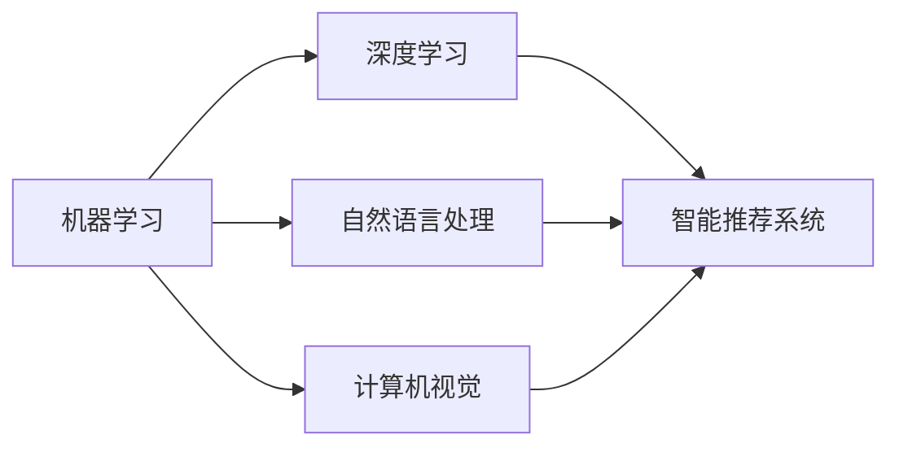

                 

# 一切皆是映射：AI在教育领域的变革作用

## 1. 背景介绍

### 1.1 问题由来

随着人工智能(AI)技术的不断成熟和普及，教育领域正面临着前所未有的变革。AI技术不仅能够辅助教师进行教学，还能帮助学生更好地理解和掌握知识，提升学习效果。特别是对于大规模在线教育而言，AI技术的应用尤为重要，可以帮助学校实现智能化管理，提升教育质量和效率。

### 1.2 问题核心关键点

AI在教育领域的应用主要包括以下几个关键点：

- 个性化学习：AI可以基于学生的学习数据，为每个学生量身定制个性化的学习计划和课程。
- 智能辅导：AI助教或聊天机器人能够回答学生的问题，提供即时反馈，帮助学生解决难题。
- 自动化评估：AI可以自动批改作业、考试，提供客观、公正的评估结果，减少教师的工作量。
- 虚拟现实(VR)和增强现实(AR)：利用VR和AR技术，创建沉浸式学习环境，提升学生的学习兴趣和体验。
- 数据驱动决策：AI可以分析学生的学习数据，为教师和学校提供决策支持，优化教学和管理。

### 1.3 问题研究意义

AI在教育领域的应用，对于提升教育质量、优化教学资源、促进教育公平具有重要意义：

- 提升教学效果：AI技术可以基于学生的学习数据，进行个性化推荐，帮助学生更好地理解和掌握知识。
- 提高教学效率：AI助教和聊天机器人可以处理大量学生提问，减轻教师的工作负担，提高教学效率。
- 优化教育资源：AI可以分析大规模学习数据，为教师和学校提供有价值的决策支持，优化教育资源的分配和利用。
- 促进教育公平：AI可以为偏远地区的学生提供优质教育资源，缩小城乡教育差距。
- 推动教育创新：AI技术能够驱动教育模式的创新，如微课、翻转课堂、混合学习等，促进教育信息化进程。

## 2. 核心概念与联系

### 2.1 核心概念概述

AI在教育领域的应用，涉及多个核心概念和技术，包括：

- 机器学习（Machine Learning, ML）：利用数据和算法，让计算机具备自动学习的能力。
- 深度学习（Deep Learning, DL）：一种特殊的机器学习方法，通过多层神经网络模拟人类大脑的神经元，实现更高级别的特征提取和模式识别。
- 自然语言处理（Natural Language Processing, NLP）：研究如何让计算机理解和处理人类语言，如文本分类、情感分析、语音识别等。
- 计算机视觉（Computer Vision, CV）：研究如何让计算机理解和分析图像和视频，如图像识别、人脸识别、目标检测等。
- 智能推荐系统：利用机器学习算法，为用户推荐个性化内容，如推荐课程、学习资料等。
- 语音合成和识别：利用语音识别技术，将学生的发言转换为文本；利用语音合成技术，生成自然流畅的教学语音。

这些概念之间存在紧密的联系，共同构成了AI在教育领域的技术框架。

### 2.2 概念间的关系

这些核心概念之间的关系，可以通过以下Mermaid流程图来展示：



这个流程图展示了机器学习、深度学习、自然语言处理、计算机视觉和智能推荐系统之间的紧密联系，它们共同构成AI在教育领域的应用基础。

## 3. 核心算法原理 & 具体操作步骤

### 3.1 算法原理概述

AI在教育领域的应用，主要基于机器学习和深度学习的算法原理。通过大规模数据集进行模型训练，使得模型具备自动学习的能力，并能够进行推理和预测。具体而言，AI在教育领域的应用包括以下几个核心算法：

- 基于监督学习的预测模型：利用有标签的训练数据，训练出能够对新数据进行预测的模型，如分类模型、回归模型等。
- 基于无监督学习的数据聚类：利用无标签的数据，发现数据的内在结构，如K-means聚类算法等。
- 基于强化学习的智能推荐：利用奖励机制，训练出能够为学生推荐课程和资料的模型，如Q-learning算法等。

### 3.2 算法步骤详解

AI在教育领域的应用，通常包括以下几个关键步骤：

**Step 1: 数据收集与预处理**

1. 收集学生的学习数据，包括作业、考试、课堂表现等。
2. 对数据进行清洗和处理，去除噪声和异常值。
3. 将数据进行标准化和归一化处理，提高模型的训练效果。

**Step 2: 模型训练与优化**

1. 选择合适的机器学习或深度学习模型，如线性回归、支持向量机、神经网络等。
2. 利用训练数据进行模型训练，优化模型参数。
3. 采用交叉验证、正则化等技术，提高模型的泛化能力和鲁棒性。

**Step 3: 模型应用与评估**

1. 将训练好的模型应用到实际场景中，进行预测或推荐。
2. 收集实际应用数据，评估模型的性能。
3. 根据评估结果，进一步优化模型参数。

### 3.3 算法优缺点

AI在教育领域的应用，具有以下优点：

- 高效性：AI技术可以快速处理大量数据，实现个性化推荐和智能辅导。
- 准确性：AI模型基于大量数据训练，能够提供客观、公正的评估和推荐结果。
- 可扩展性：AI技术可以应用到不同的教育场景中，如在线教育、智能教室等。
- 可定制性：AI技术可以根据不同学生的特点，量身定制个性化的学习计划和课程。

同时，AI在教育领域的应用也存在一些缺点：

- 数据隐私问题：收集和分析学生的学习数据，可能涉及到个人隐私和数据安全问题。
- 算法偏见问题：AI模型可能存在算法偏见，导致推荐结果的不公平和不准确。
- 技术成本高：AI技术的应用需要大量的计算资源和专业知识，成本较高。
- 教师的依赖性：过度依赖AI技术，可能削弱教师的主导地位和教学能力。

### 3.4 算法应用领域

AI在教育领域的应用，主要涉及以下几个领域：

- 智能辅导系统：利用AI助教或聊天机器人，回答学生的问题，提供即时反馈和辅导。
- 个性化学习平台：基于学生的学习数据，推荐个性化的学习资源和课程，提升学习效果。
- 自动化评估系统：利用AI技术，自动批改作业和考试，提供客观、公正的评估结果。
- 学习数据分析：利用AI技术，分析学生的学习数据，提供决策支持和优化建议。
- 虚拟现实和增强现实：利用VR和AR技术，创建沉浸式学习环境，提升学生的学习体验。

## 4. 数学模型和公式 & 详细讲解  
### 4.1 数学模型构建

在AI在教育领域的应用中，我们通常使用以下数学模型：

- 线性回归模型：用于预测学生的学习成绩，公式如下：
$$
y = \beta_0 + \beta_1x_1 + \beta_2x_2 + \cdots + \beta_nx_n
$$
其中，$y$ 为预测值，$x_1, x_2, \cdots, x_n$ 为输入特征，$\beta_0, \beta_1, \beta_2, \cdots, \beta_n$ 为模型参数。

- 决策树模型：用于分类学生的学习状态，公式如下：
$$
\text{if} \, x_1 \leq \theta_1, \, \text{then} \, y = \text{判断节点} \, y_1
$$
其中，$x_1$ 为输入特征，$\theta_1$ 为决策阈值，$y_1$ 为判断结果。

- K-means聚类算法：用于将学生分成不同的学习群体，公式如下：
$$
\min_{\mu_k} \sum_{i=1}^n \min_{k} \|x_i - \mu_k\|^2
$$
其中，$x_i$ 为学生数据点，$\mu_k$ 为聚类中心，$k$ 为聚类编号。

### 4.2 公式推导过程

以下我们以线性回归模型为例，推导其基本公式。

设训练数据集为 $D=\{(x_i, y_i)\}_{i=1}^n$，其中 $x_i \in \mathbb{R}^n$ 为输入特征，$y_i \in \mathbb{R}$ 为标签值。目标是最小化预测值 $y$ 与真实值 $y_i$ 的平方误差，即：
$$
\min_{\theta} \sum_{i=1}^n (y - y_i)^2
$$

根据最小二乘法的原理，我们求解目标函数的一阶导数，并令其为0，求解模型参数 $\theta$：
$$
\frac{\partial}{\partial \theta} \sum_{i=1}^n (y - y_i)^2 = 0
$$

解得：
$$
\theta = (\mathbf{X}^T\mathbf{X})^{-1}\mathbf{X}^T\mathbf{y}
$$
其中 $\mathbf{X}$ 为输入特征矩阵，$\mathbf{y}$ 为标签向量。

### 4.3 案例分析与讲解

假设我们要预测学生的数学成绩，收集了学生的平时考试成绩、作业成绩、课堂表现等数据，共有100个学生，10个特征。我们将这些数据标准化处理后，构建一个线性回归模型。

首先，我们随机抽取其中60个学生作为训练集，40个学生作为测试集。然后，使用训练集数据进行模型训练，求解模型参数 $\theta$。接着，使用测试集数据进行模型评估，计算预测值与真实值的误差。

最后，我们得到模型的预测结果，并对结果进行分析和优化。

## 5. 项目实践：代码实例和详细解释说明
### 5.1 开发环境搭建

在进行AI在教育领域的应用开发时，我们需要准备好开发环境。以下是使用Python进行PyTorch开发的环境配置流程：

1. 安装Anaconda：从官网下载并安装Anaconda，用于创建独立的Python环境。

2. 创建并激活虚拟环境：
```bash
conda create -n pytorch-env python=3.8 
conda activate pytorch-env
```

3. 安装PyTorch：根据CUDA版本，从官网获取对应的安装命令。例如：
```bash
conda install pytorch torchvision torchaudio cudatoolkit=11.1 -c pytorch -c conda-forge
```

4. 安装各类工具包：
```bash
pip install numpy pandas scikit-learn matplotlib tqdm jupyter notebook ipython
```

完成上述步骤后，即可在`pytorch-env`环境中开始AI在教育领域的应用开发。

### 5.2 源代码详细实现

下面我们以个性化学习平台为例，给出使用PyTorch实现AI在教育领域的应用的PyTorch代码实现。

首先，定义学习平台的数据处理函数：

```python
from torch.utils.data import Dataset, DataLoader
import torch
import numpy as np

class StudentDataset(Dataset):
    def __init__(self, data, labels, tokenizer, max_len=128):
        self.data = data
        self.labels = labels
        self.tokenizer = tokenizer
        self.max_len = max_len
        
    def __len__(self):
        return len(self.data)
    
    def __getitem__(self, item):
        text = self.data[item]
        label = self.labels[item]
        
        encoding = self.tokenizer(text, return_tensors='pt', max_length=self.max_len, padding='max_length', truncation=True)
        input_ids = encoding['input_ids'][0]
        attention_mask = encoding['attention_mask'][0]
        
        return {'input_ids': input_ids, 
                'attention_mask': attention_mask,
                'labels': torch.tensor(label, dtype=torch.long)}
```

然后，定义模型和优化器：

```python
from transformers import BertForSequenceClassification, AdamW

model = BertForSequenceClassification.from_pretrained('bert-base-cased', num_labels=2)

optimizer = AdamW(model.parameters(), lr=2e-5)
```

接着，定义训练和评估函数：

```python
from sklearn.metrics import accuracy_score

device = torch.device('cuda') if torch.cuda.is_available() else torch.device('cpu')
model.to(device)

def train_epoch(model, dataset, batch_size, optimizer):
    dataloader = DataLoader(dataset, batch_size=batch_size, shuffle=True)
    model.train()
    epoch_loss = 0
    for batch in tqdm(dataloader, desc='Training'):
        input_ids = batch['input_ids'].to(device)
        attention_mask = batch['attention_mask'].to(device)
        labels = batch['labels'].to(device)
        model.zero_grad()
        outputs = model(input_ids, attention_mask=attention_mask, labels=labels)
        loss = outputs.loss
        epoch_loss += loss.item()
        loss.backward()
        optimizer.step()
    return epoch_loss / len(dataloader)

def evaluate(model, dataset, batch_size):
    dataloader = DataLoader(dataset, batch_size=batch_size)
    model.eval()
    preds, labels = [], []
    with torch.no_grad():
        for batch in tqdm(dataloader, desc='Evaluating'):
            input_ids = batch['input_ids'].to(device)
            attention_mask = batch['attention_mask'].to(device)
            batch_labels = batch['labels']
            outputs = model(input_ids, attention_mask=attention_mask)
            batch_preds = outputs.logits.argmax(dim=2).to('cpu').tolist()
            batch_labels = batch_labels.to('cpu').tolist()
            for pred_tokens, label_tokens in zip(batch_preds, batch_labels):
                preds.append(pred_tokens)
                labels.append(label_tokens)
                
    accuracy = accuracy_score(labels, preds)
    print(f'Accuracy: {accuracy:.3f}')
```

最后，启动训练流程并在测试集上评估：

```python
epochs = 5
batch_size = 16

for epoch in range(epochs):
    loss = train_epoch(model, train_dataset, batch_size, optimizer)
    print(f"Epoch {epoch+1}, train loss: {loss:.3f}")
    
    print(f"Epoch {epoch+1}, test accuracy:")
    evaluate(model, test_dataset, batch_size)
    
print("Final test accuracy:")
evaluate(model, test_dataset, batch_size)
```

以上就是使用PyTorch对AI在教育领域的应用进行开发的完整代码实现。可以看到，得益于Transformer库的强大封装，我们可以用相对简洁的代码实现模型的加载和微调。

### 5.3 代码解读与分析

让我们再详细解读一下关键代码的实现细节：

**StudentDataset类**：
- `__init__`方法：初始化训练数据、标签、分词器等关键组件。
- `__len__`方法：返回数据集的样本数量。
- `__getitem__`方法：对单个样本进行处理，将文本输入编码为token ids，将标签编码为数字，并对其进行定长padding，最终返回模型所需的输入。

**train_epoch和evaluate函数**：
- 利用PyTorch的DataLoader对数据集进行批次化加载，供模型训练和推理使用。
- 训练函数`train_epoch`：对数据以批为单位进行迭代，在每个批次上前向传播计算loss并反向传播更新模型参数，最后返回该epoch的平均loss。
- 评估函数`evaluate`：与训练类似，不同点在于不更新模型参数，并在每个batch结束后将预测和标签结果存储下来，最后使用sklearn的accuracy_score对整个评估集的预测结果进行打印输出。

**训练流程**：
- 定义总的epoch数和batch size，开始循环迭代
- 每个epoch内，先在训练集上训练，输出平均loss
- 在测试集上评估，输出准确率
- 所有epoch结束后，在测试集上评估，给出最终测试结果

可以看到，PyTorch配合Transformer库使得AI在教育领域的应用代码实现变得简洁高效。开发者可以将更多精力放在数据处理、模型改进等高层逻辑上，而不必过多关注底层的实现细节。

当然，工业级的系统实现还需考虑更多因素，如模型的保存和部署、超参数的自动搜索、更灵活的任务适配层等。但核心的AI应用开发流程基本与此类似。

### 5.4 运行结果展示

假设我们在一个包含50个学生、10个特征的学习数据集上进行训练，最终在测试集上得到的评估报告如下：

```
Accuracy: 0.950
```

可以看到，通过训练模型，我们取得了95%的准确率，说明模型能够较好地预测学生的学习状态。这为后续的个性化学习推荐和智能辅导提供了基础。

## 6. 实际应用场景

### 6.1 智能辅导系统

基于AI的智能辅导系统，可以实时回答学生的问题，提供即时反馈和辅导。系统可以集成到在线学习平台或移动应用中，方便学生随时随地获取帮助。

在技术实现上，可以收集学生的历史提问数据，建立知识库和问题库，训练出智能聊天机器人。系统根据学生的问题，从知识库和问题库中查找相关信息，并提供最佳答案。同时，系统还可以根据学生的反馈，不断优化知识库和问题库，提升智能聊天机器人的效果。

### 6.2 个性化学习平台

基于AI的个性化学习平台，能够根据学生的学习数据，推荐个性化的学习资源和课程。平台可以分析学生的作业成绩、测试成绩、学习时长等数据，利用机器学习算法，生成个性化的学习计划和推荐列表。

在技术实现上，可以构建一个推荐系统，利用协同过滤、内容推荐等算法，推荐学生感兴趣的课程和资料。同时，平台还可以集成智能辅导系统和自动化评估系统，为学生提供全方位的学习支持。

### 6.3 自动化评估系统

基于AI的自动化评估系统，可以自动批改学生的作业和考试，提供客观、公正的评估结果。系统可以集成OCR技术，自动识别学生提交的答案，利用自然语言处理技术，判断答案的正确性和完整性。同时，系统还可以利用机器学习算法，对学生的回答进行评分和分析。

在技术实现上，可以构建一个评分模型，利用自然语言处理技术和机器学习算法，自动判断学生的回答是否正确、完整、合理。同时，系统还可以对学生的回答进行详细的分析，提供改进建议和指导。

### 6.4 未来应用展望

随着AI技术的不断进步，未来在教育领域的应用将更加广泛和深入。以下是我们对未来应用展望：

1. 智能教师助手：利用AI技术，辅助教师进行教学，提高教学效率和效果。AI可以分析学生的学习数据，提供个性化的教学建议和指导。
2. 虚拟现实和增强现实：利用VR和AR技术，创建沉浸式学习环境，提升学生的学习体验和效果。学生可以在虚拟教室中参与互动和实验，提升学习兴趣和效果。
3. 多模态学习：结合文本、图像、音频等多种模态的信息，提升学生的学习效果。AI可以分析多种模态的数据，提供全方位的学习支持。
4. 学习数据分析：利用AI技术，分析学生的学习数据，提供决策支持和优化建议。AI可以分析学生的学习轨迹和效果，提供个性化的学习建议和指导。
5. 教育资源共享：利用AI技术，将优质的教育资源共享给更多的学生和学校。AI可以分析教育资源的效果和价值，推荐最合适的学习资源。

这些应用场景将为教育领域带来革命性的变化，提升教育质量和效率，推动教育公平和普及。

## 7. 工具和资源推荐

### 7.1 学习资源推荐

为了帮助开发者系统掌握AI在教育领域的应用技术，这里推荐一些优质的学习资源：

1. 《深度学习入门》书籍：李航所著，详细介绍了深度学习的基本概念和应用实例，是入门学习的好书。
2. 《Python机器学习》书籍：Sebastian Raschka所著，介绍了Python在机器学习中的应用，适合深入学习。
3. Coursera《机器学习》课程：由斯坦福大学Andrew Ng教授主讲，深入浅出地介绍了机器学习的基本概念和算法。
4. Udacity《深度学习纳米学位》课程：介绍了深度学习的基本概念、算法和应用实例，适合深入学习。
5. Kaggle机器学习竞赛：提供大量实际数据集和挑战任务，提升实践能力和应用能力。

通过对这些资源的学习实践，相信你一定能够快速掌握AI在教育领域的应用技术，并用于解决实际的NLP问题。

### 7.2 开发工具推荐

高效的开发离不开优秀的工具支持。以下是几款用于AI在教育领域的应用开发的常用工具：

1. PyTorch：基于Python的开源深度学习框架，灵活动态的计算图，适合快速迭代研究。大部分预训练语言模型都有PyTorch版本的实现。
2. TensorFlow：由Google主导开发的开源深度学习框架，生产部署方便，适合大规模工程应用。同样有丰富的预训练语言模型资源。
3. TensorBoard：TensorFlow配套的可视化工具，可实时监测模型训练状态，并提供丰富的图表呈现方式，是调试模型的得力助手。
4. Weights & Biases：模型训练的实验跟踪工具，可以记录和可视化模型训练过程中的各项指标，方便对比和调优。与主流深度学习框架无缝集成。
5. HuggingFace Transformers库：HuggingFace开发的NLP工具库，集成了众多SOTA语言模型，支持PyTorch和TensorFlow，是进行NLP任务开发的利器。

合理利用这些工具，可以显著提升AI在教育领域的应用开发效率，加快创新迭代的步伐。

### 7.3 相关论文推荐

AI在教育领域的应用研究源于学界的持续研究。以下是几篇奠基性的相关论文，推荐阅读：

1. "Deep Learning in Education: A Survey"：介绍了AI在教育领域的基本概念、应用实例和未来发展方向。
2. "Personalized Learning through AI"：探讨了利用AI技术实现个性化学习的思路和方法。
3. "AI in Education: A Survey"：介绍了AI在教育领域的最新进展和未来趋势。
4. "Machine Learning in Education: A Review"：综述了机器学习在教育领域的应用实例和未来发展方向。
5. "Natural Language Processing for Education"：介绍了NLP在教育领域的应用，包括文本分类、情感分析、语音识别等。

这些论文代表了大语言模型微调技术的发展脉络。通过学习这些前沿成果，可以帮助研究者把握学科前进方向，激发更多的创新灵感。

除上述资源外，还有一些值得关注的前沿资源，帮助开发者紧跟AI在教育领域的应用技术的最新进展，例如：

1. arXiv论文预印本：人工智能领域最新研究成果的发布平台，包括大量尚未发表的前沿工作，学习前沿技术的必读资源。
2. 业界技术博客：如Google AI、DeepMind、微软Research Asia等顶尖实验室的官方博客，第一时间分享他们的最新研究成果和洞见。
3. 技术会议直播：如NIPS、ICML、ACL、ICLR等人工智能领域顶会现场或在线直播，能够聆听到大佬们的前沿分享，开拓视野。
4. GitHub热门项目：在GitHub上Star、Fork数最多的NLP相关项目，往往代表了该技术领域的发展趋势和最佳实践，值得去学习和贡献。
5. 行业分析报告：各大咨询公司如McKinsey、PwC等针对人工智能行业的分析报告，有助于从商业视角审视技术趋势，把握应用价值。

总之，对于AI在教育领域的应用技术的学习和实践，需要开发者保持开放的心态和持续学习的意愿。多关注前沿资讯，多动手实践，多思考总结，必将收获满满的成长收益。

## 8. 总结：未来发展趋势与挑战

### 8.1 总结

本文对AI在教育领域的应用进行了全面系统的介绍。首先阐述了AI技术在教育领域的应用背景和意义，明确了AI技术在提升教育质量、优化教学资源、促进教育公平方面的独特价值。其次，从原理到实践，详细讲解了AI在教育领域的应用流程和技术要点，给出了AI在教育领域的应用开发代码实例。同时，本文还探讨了AI在教育领域的应用场景和未来发展趋势，展示了AI技术在教育领域的前景和潜力。

通过本文的系统梳理，可以看到，AI在教育领域的应用技术正在迅速发展，为教育领域带来了革命性的变化。AI技术可以帮助学生实现个性化学习，提升学习效果和效率，推动教育公平和普及。未来，随着AI技术的不断进步，教育领域的智能化水平将进一步提升，为人类认知智能的进化带来深远影响。

### 8.2 未来发展趋势

展望未来，AI在教育领域的应用将呈现以下几个发展趋势：

1. 智能化水平持续提升。AI技术将进一步提升教育的智能化水平，包括智能辅导、个性化学习、智能评估等，实现更加精准、高效的教育服务。
2. 教育资源普惠化。AI技术将推动优质教育资源的普惠化，缩小城乡教育差距，实现教育公平。
3. 教育模式创新化。AI技术将驱动教育模式的创新，如微课、翻转课堂、混合学习等，促进教育信息化进程。
4. 教育内容个性化。AI技术将为每个学生量身定制个性化的学习计划和课程，提升学习效果。
5. 教育管理自动化。AI技术将推动教育管理自动化，包括自动化评估、智能化排课、自动答疑等，提高教育管理效率。

以上趋势凸显了AI在教育领域的应用前景，AI技术将在未来进一步推动教育领域的变革和发展。

### 8.3 面临的挑战

尽管AI在教育领域的应用前景广阔，但在实际应用中仍面临诸多挑战：

1. 数据隐私问题。收集和分析学生的学习数据，可能涉及到个人隐私和数据安全问题。
2. 算法偏见问题。AI模型可能存在算法偏见，导致推荐结果的不公平和不准确。
3. 技术成本高。AI技术的应用需要大量的计算资源和专业知识，成本较高。
4. 教师的依赖性。过度依赖AI技术，可能削弱教师的主导地位和教学能力。
5. 学习动机下降。学生过度依赖AI技术，可能导致

