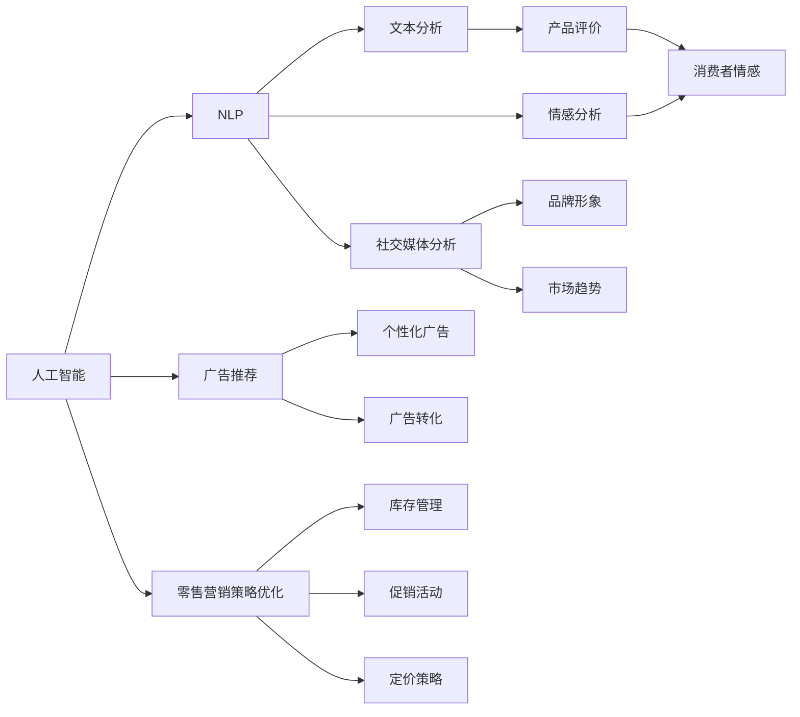
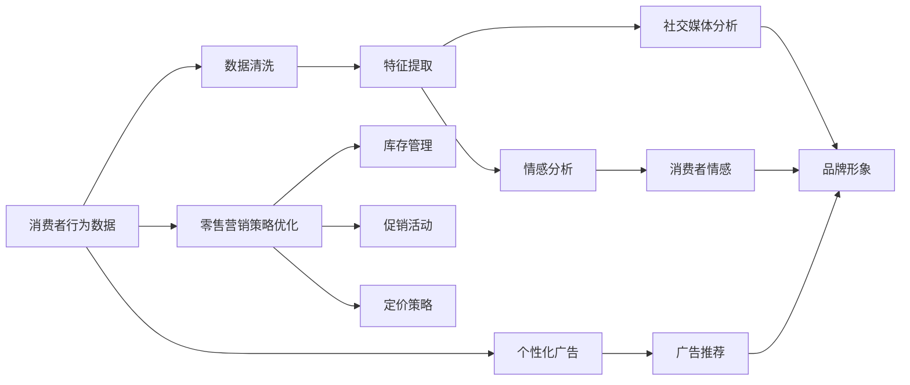
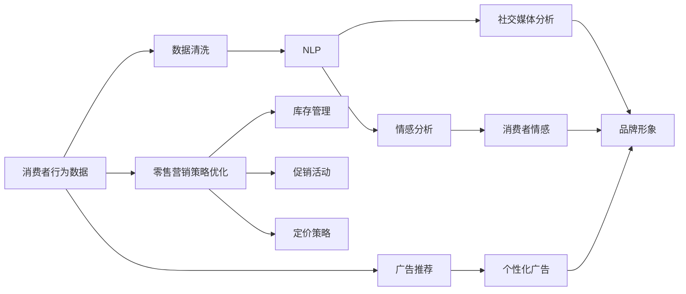
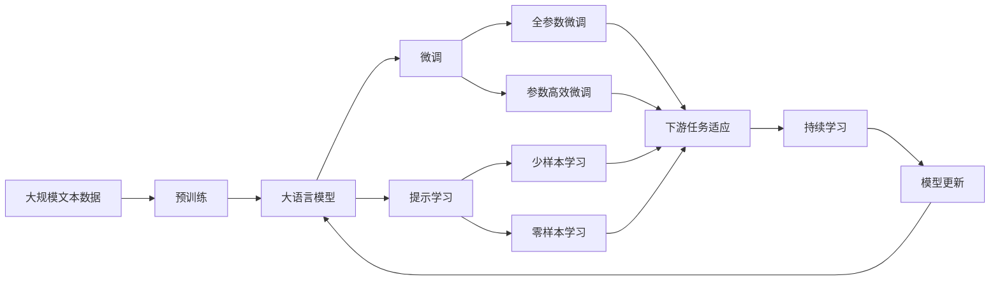

                 

# 一切皆是映射：AI在消费者行为分析中的应用实例

> 关键词：人工智能, 消费者行为, 自然语言处理, 文本分析, 情感分析, 社交媒体, 广告推荐, 零售营销

## 1. 背景介绍

### 1.1 问题由来
在数字化时代，消费者的行为变得越来越复杂和多样化。传统的市场调研和消费者行为分析方法往往基于小样本数据，难以捕捉到消费者行为的深层规律和趋势。借助人工智能（AI）技术，尤其是基于深度学习和大数据处理的AI应用，可以更全面、更准确地分析消费者行为，从而为品牌和商家提供更加精准的市场洞察和运营策略支持。

### 1.2 问题核心关键点
AI在消费者行为分析中的应用主要围绕以下几个核心点展开：

- **自然语言处理（NLP）**：通过对消费者评论、社交媒体互动和在线购物评价等文本数据的深度分析，提取消费者情感倾向、产品评价和偏好等信息。
- **情感分析**：识别和分析消费者对产品、服务或品牌的情感态度，帮助商家理解消费者的情感波动和需求变化。
- **社交媒体分析**：监测社交媒体上的消费者讨论，提取品牌提及、产品推荐和反馈意见，评估品牌形象和消费者态度。
- **广告推荐**：利用消费者行为数据，实现个性化广告投放和推荐，提升广告转化率和用户满意度。
- **零售营销策略优化**：通过消费者行为数据分析，优化库存管理、促销活动和定价策略，提高营销活动效果。

这些技术的应用，使得品牌和商家能够基于消费者行为进行更精准的市场定位和产品开发，提升营销效果和客户忠诚度。

### 1.3 问题研究意义
研究AI在消费者行为分析中的应用，对于提升品牌市场竞争力、优化用户体验和驱动营销策略创新具有重要意义：

- **市场洞察**：深入理解消费者需求和行为规律，帮助品牌制定更符合市场需求的产品和服务策略。
- **客户体验优化**：通过情感分析和社交媒体监测，及时回应消费者反馈，提升用户满意度和品牌忠诚度。
- **营销策略优化**：基于消费者行为数据，实现个性化营销和精准广告推荐，提高广告ROI和营销活动效果。
- **跨界创新**：将AI技术应用于不同行业，如零售、金融、医疗等，推动行业数字化转型和创新发展。

## 2. 核心概念与联系

### 2.1 核心概念概述

为更好地理解AI在消费者行为分析中的应用，本节将介绍几个密切相关的核心概念：

- **人工智能（AI）**：涵盖机器学习、深度学习、自然语言处理等技术，能够模拟人类智能行为，进行自动化决策和任务执行。
- **自然语言处理（NLP）**：使计算机能够理解、解释和生成人类语言的技术，包括文本分析、情感分析、语音识别等。
- **情感分析**：通过分析文本数据，识别和量化消费者情感态度的技术，如正面情感、负面情感、中性情感等。
- **社交媒体分析**：利用AI技术从社交媒体数据中提取关键信息，评估品牌声誉、消费者态度和市场趋势。
- **广告推荐**：基于消费者行为数据，实现个性化广告的精准投放和推荐。
- **零售营销策略优化**：通过AI技术分析消费者行为数据，优化库存管理、促销活动和定价策略。

这些核心概念之间的逻辑关系可以通过以下Mermaid流程图来展示：



这个流程图展示了大语言模型微调过程中各个核心概念的关系：

1. 人工智能包括自然语言处理、情感分析等技术，为消费者行为分析提供支持。
2. 文本分析和情感分析通过处理消费者评论和社交媒体数据，提取情感倾向和产品评价。
3. 社交媒体分析监测品牌提及和消费者讨论，评估品牌形象和市场趋势。
4. 广告推荐利用消费者行为数据，实现个性化广告投放和推荐。
5. 零售营销策略优化基于消费者行为数据分析，优化库存管理、促销活动和定价策略。

### 2.2 概念间的关系

这些核心概念之间存在着紧密的联系，形成了消费者行为分析的完整生态系统。下面我通过几个Mermaid流程图来展示这些概念之间的关系。

#### 2.2.1 消费者行为分析的流程



这个流程图展示了大语言模型微调任务的具体流程：

1. 从消费者行为数据开始，进行数据清洗和特征提取。
2. 利用情感分析提取消费者情感，通过社交媒体分析评估品牌形象和市场趋势。
3. 基于消费者行为数据，实现个性化广告推荐。
4. 通过零售营销策略优化，优化库存管理、促销活动和定价策略。

#### 2.2.2 AI在消费者行为分析中的角色



这个流程图展示了大语言模型在消费者行为分析中的核心作用：

1. 数据清洗和特征提取，利用NLP技术处理文本数据。
2. 情感分析和社交媒体分析，利用AI技术提取关键信息。
3. 广告推荐和零售营销策略优化，基于消费者行为数据分析。

### 2.3 核心概念的整体架构

最后，我们用一个综合的流程图来展示这些核心概念在大语言模型微调过程中的整体架构：



这个综合流程图展示了从预训练到微调，再到持续学习的完整过程。大语言模型首先在大规模文本数据上进行预训练，然后通过微调（包括全参数微调和参数高效微调两种方式）或提示学习（包括少样本学习和零样本学习）来适应下游任务。最后，通过持续学习技术，模型可以不断学习新知识，同时避免遗忘旧知识。 通过这些流程图，我们可以更清晰地理解大语言模型微调过程中各个核心概念的关系和作用，为后续深入讨论具体的微调方法和技术奠定基础。

## 3. 核心算法原理 & 具体操作步骤
### 3.1 算法原理概述

AI在消费者行为分析中的应用，本质上是一个多任务学习和迁移学习的复杂过程。其核心思想是：通过深度学习和大数据分析，构建一个能够理解、解释和生成人类语言的模型，从而实现对消费者行为的深度分析和智能决策。

形式化地，假设我们有一组标记化的消费者行为数据 $D=\{(x_i, y_i)\}_{i=1}^N$，其中 $x_i$ 为行为数据（如评论文本、社交媒体互动），$y_i$ 为消费者情感或行为标签。微调的目标是找到新的模型参数 $\hat{\theta}$，使得模型在新样本上的预测效果最大化：

$$
\hat{\theta}=\mathop{\arg\min}_{\theta} \mathcal{L}(M_{\theta},D)
$$

其中 $\mathcal{L}$ 为损失函数，衡量模型在新样本上的预测输出与真实标签之间的差异。常见的损失函数包括交叉熵损失、均方误差损失等。

通过梯度下降等优化算法，微调过程不断更新模型参数 $\theta$，最小化损失函数 $\mathcal{L}$，使得模型在新样本上的预测逼近真实标签。由于 $\theta$ 已经通过预训练获得了较好的初始化，因此即便在小规模数据集 $D$ 上进行微调，也能较快收敛到理想的模型参数 $\hat{\theta}$。

### 3.2 算法步骤详解

AI在消费者行为分析的应用，主要包括以下几个关键步骤：

**Step 1: 数据准备和预处理**
- 收集消费者行为数据，包括社交媒体互动、评论文本、购买记录等。
- 对数据进行清洗和标注，去除噪声和无用信息，标注消费者情感和行为标签。
- 对文本数据进行分词、词向量化、截断等预处理操作。

**Step 2: 选择合适的模型和算法**
- 选择合适的深度学习模型，如循环神经网络（RNN）、卷积神经网络（CNN）、Transformer等。
- 选择合适的优化算法及其参数，如Adam、SGD等，设置学习率、批大小、迭代轮数等。
- 设置正则化技术及强度，包括权重衰减、Dropout、Early Stopping等。

**Step 3: 训练模型**
- 将训练集数据分批次输入模型，前向传播计算损失函数。
- 反向传播计算参数梯度，根据设定的优化算法和学习率更新模型参数。
- 周期性在验证集上评估模型性能，根据性能指标决定是否触发 Early Stopping。
- 重复上述步骤直到满足预设的迭代轮数或 Early Stopping 条件。

**Step 4: 模型评估和应用**
- 在测试集上评估微调后模型 $M_{\hat{\theta}}$ 的性能，对比微调前后的效果提升。
- 使用微调后的模型对新样本进行推理预测，应用于消费者行为分析和营销决策中。

以上是AI在消费者行为分析的一般流程。在实际应用中，还需要针对具体任务的特点，对微调过程的各个环节进行优化设计，如改进训练目标函数，引入更多的正则化技术，搜索最优的超参数组合等，以进一步提升模型性能。

### 3.3 算法优缺点

AI在消费者行为分析中的应用，具有以下优点：

1. 数据驱动：基于大数据分析和深度学习模型，能够从海量数据中挖掘出消费者行为的深层规律。
2. 实时性：通过在线数据分析和实时监控，能够及时响应消费者反馈和市场变化。
3. 个性化：利用消费者行为数据进行个性化广告推荐和营销策略优化，提升用户体验和满意度。
4. 可扩展性：模型可应用于不同领域和任务，具有较强的跨领域迁移能力。

同时，该方法也存在一些局限性：

1. 数据质量要求高：消费者行为数据需要高质量标注，数据收集和清洗成本较高。
2. 隐私和安全问题：收集和分析消费者数据可能涉及隐私和数据安全问题，需要严格遵守法律法规。
3. 模型复杂度高：深度学习模型复杂度高，训练和推理成本较高。
4. 对抗攻击脆弱：模型可能受到对抗样本的攻击，影响预测准确性。
5. 可解释性不足：AI模型往往是"黑盒"系统，难以解释其内部工作机制和决策逻辑。

尽管存在这些局限性，但AI在消费者行为分析的应用，已经在市场调研、品牌管理、广告推荐等诸多领域取得了显著的效果，成为现代营销和市场分析的重要工具。

### 3.4 算法应用领域

AI在消费者行为分析中的应用已经广泛应用于多个领域，包括但不限于：

- **市场调研**：通过情感分析和社交媒体监测，了解消费者对品牌的看法和需求，进行市场趋势预测和产品改进。
- **品牌管理**：利用消费者情感分析，评估品牌形象和声誉，优化营销策略，提升品牌价值。
- **广告推荐**：基于消费者行为数据，实现个性化广告推荐，提升广告转化率和用户满意度。
- **零售营销策略优化**：通过消费者行为数据分析，优化库存管理、促销活动和定价策略，提高营销活动效果。
- **客户服务**：利用自然语言处理技术，自动化客户服务，提高服务质量和客户满意度。

此外，AI在消费者行为分析中的应用还在不断拓展，如在金融、医疗、教育等不同行业，通过消费者数据分析，推动行业数字化转型和创新发展。

## 4. 数学模型和公式 & 详细讲解  
### 4.1 数学模型构建

本节将使用数学语言对AI在消费者行为分析中的应用进行更加严格的刻画。

记消费者行为数据为 $D=\{(x_i, y_i)\}_{i=1}^N$，其中 $x_i$ 为行为数据（如评论文本、社交媒体互动），$y_i$ 为消费者情感或行为标签。假设模型 $M_{\theta}$ 为深度学习模型，如循环神经网络（RNN）、卷积神经网络（CNN）、Transformer等。微调的目标是找到新的模型参数 $\hat{\theta}$，使得模型在新样本上的预测输出与真实标签之间的差异最小化：

$$
\hat{\theta}=\mathop{\arg\min}_{\theta} \mathcal{L}(M_{\theta},D)
$$

其中 $\mathcal{L}$ 为损失函数，衡量模型在新样本上的预测输出与真实标签之间的差异。常见的损失函数包括交叉熵损失、均方误差损失等。

### 4.2 公式推导过程

以交叉熵损失函数为例，假设模型 $M_{\theta}$ 在输入 $x_i$ 上的输出为 $\hat{y}=M_{\theta}(x_i)$，真实标签 $y_i \in \{0,1\}$。则交叉熵损失函数定义为：

$$
\ell(M_{\theta}(x_i),y_i) = -y_i\log \hat{y} + (1-y_i)\log(1-\hat{y})
$$

将其代入经验风险公式，得：

$$
\mathcal{L}(\theta) = -\frac{1}{N}\sum_{i=1}^N [y_i\log M_{\theta}(x_i)+(1-y_i)\log(1-M_{\theta}(x_i))]
$$

根据链式法则，损失函数对参数 $\theta_k$ 的梯度为：

$$
\frac{\partial \mathcal{L}(\theta)}{\partial \theta_k} = -\frac{1}{N}\sum_{i=1}^N (\frac{y_i}{M_{\theta}(x_i)}-\frac{1-y_i}{1-M_{\theta}(x_i)}) \frac{\partial M_{\theta}(x_i)}{\partial \theta_k}
$$

其中 $\frac{\partial M_{\theta}(x_i)}{\partial \theta_k}$ 可进一步递归展开，利用自动微分技术完成计算。

### 4.3 案例分析与讲解

以情感分析为例，展示如何利用深度学习模型进行消费者情感分析。假设我们有一组评论数据 $D=\{(x_i, y_i)\}_{i=1}^N$，其中 $x_i$ 为评论文本，$y_i \in \{0,1\}$ 为正面情感（1）或负面情感（0）。

我们首先对评论数据进行分词、词向量化等预处理操作。然后，使用Transformer模型作为情感分析模型，通过情感分类任务进行微调。具体步骤如下：

1. 数据准备和预处理：
   - 收集评论数据，进行分词和词向量化。
   - 对数据进行标注，将正面情感和负面情感标注为1和0。

2. 选择合适的模型和算法：
   - 选择Transformer模型，作为情感分析的深度学习模型。
   - 选择合适的优化算法及其参数，如Adam、SGD等，设置学习率、批大小、迭代轮数等。
   - 设置正则化技术及强度，包括权重衰减、Dropout、Early Stopping等。

3. 训练模型：
   - 将训练集数据分批次输入模型，前向传播计算损失函数。
   - 反向传播计算参数梯度，根据设定的优化算法和学习率更新模型参数。
   - 周期性在验证集上评估模型性能，根据性能指标决定是否触发 Early Stopping。
   - 重复上述步骤直到满足预设的迭代轮数或 Early Stopping 条件。

4. 模型评估和应用：
   - 在测试集上评估微调后模型 $M_{\hat{\theta}}$ 的性能，对比微调前后的效果提升。
   - 使用微调后的模型对新评论进行情感预测，应用于品牌情感分析和产品改进。

通过上述步骤，我们可以利用AI技术对消费者评论进行情感分析，评估品牌形象和产品满意度，优化营销策略。

## 5. 项目实践：代码实例和详细解释说明
### 5.1 开发环境搭建

在进行AI在消费者行为分析的应用开发前，我们需要准备好开发环境。以下是使用Python进行TensorFlow开发的环境配置流程：

1. 安装Anaconda：从官网下载并安装Anaconda，用于创建独立的Python环境。

2. 创建并激活虚拟环境：
```bash
conda create -n tf-env python=3.8 
conda activate tf-env
```

3. 安装TensorFlow：根据CUDA版本，从官网获取对应的安装命令。例如：
```bash
conda install tensorflow-gpu=2.7.0=cudatoolkit=11.1 -c pytorch -c conda-forge
```

4. 安装Keras：
```bash
pip install keras
```

5. 安装各类工具包：
```bash
pip install numpy pandas scikit-learn matplotlib tqdm jupyter notebook ipython
```

完成上述步骤后，即可在`tf-env`环境中开始AI在消费者行为分析的应用开发。

### 5.2 源代码详细实现

这里我们以情感分析任务为例，给出使用TensorFlow和Keras对RNN模型进行消费者情感分析的代码实现。

首先，定义情感分析任务的数据处理函数：

```python
from tensorflow.keras.preprocessing.text import Tokenizer
from tensorflow.keras.preprocessing.sequence import pad_sequences
import numpy as np

class SentimentDataset:
    def __init__(self, texts, tags):
        self.texts = texts
        self.tags = tags
        self.tokenizer = Tokenizer(num_words=10000, oov_token="<OOV>")
        self.tokenizer.fit_on_texts(texts)
        self.word_index = self.tokenizer.word_index
        selfsequences = self.tokenizer.texts_to_sequences(texts)
        self.data = pad_sequences(selfsequences, maxlen=100, padding='post', truncating='post')
        self.tags = np.array(tags)

    def __len__(self):
        return len(self.texts)
    
    def __getitem__(self, item):
        return self.data[item], self.tags[item]
```

然后，定义模型和优化器：

```python
from tensorflow.keras.models import Sequential
from tensorflow.keras.layers import Embedding, LSTM, Dense
from tensorflow.keras.optimizers import Adam

model = Sequential()
model.add(Embedding(input_dim=10000, output_dim=128, input_length=100))
model.add(LSTM(128, dropout=0.2, recurrent_dropout=0.2))
model.add(Dense(1, activation='sigmoid'))

optimizer = Adam(lr=0.001)
```

接着，定义训练和评估函数：

```python
from tensorflow.keras.utils import to_categorical
from sklearn.metrics import accuracy_score

device = tf.device('/gpu:0') if tf.test.is_gpu_available() else tf.device('/cpu:0')

def train_epoch(model, dataset, batch_size, optimizer):
    dataloader = tf.data.Dataset.from_tensor_slices((dataset.data, dataset.tags)).batch(batch_size).shuffle(buffer_size=1000)
    model.compile(optimizer=optimizer, loss='binary_crossentropy', metrics=['accuracy'])
    model.fit(dataloader, epochs=10, validation_split=0.2, callbacks=[tf.keras.callbacks.EarlyStopping(patience=3)])

def evaluate(model, dataset, batch_size):
    dataloader = tf.data.Dataset.from_tensor_slices((dataset.data, dataset.tags)).batch(batch_size).shuffle(buffer_size=1000)
    y_pred = model.predict(dataloader)
    y_pred = [np.round(pred) for pred in y_pred]
    y_true = dataset.tags
    accuracy = accuracy_score(y_true, y_pred)
    print(f"Accuracy: {accuracy:.4f}")
```

最后，启动训练流程并在测试集上评估：

```python
epochs = 10
batch_size = 32

train_dataset = SentimentDataset(train_texts, train_tags)
test_dataset = SentimentDataset(test_texts, test_tags)

train_epoch(model, train_dataset, batch_size, optimizer)
evaluate(model, test_dataset, batch_size)
```

以上就是使用TensorFlow和Keras对RNN模型进行消费者情感分析的完整代码实现。可以看到，通过Keras的高层封装，我们能够用相对简洁的代码完成模型的搭建和训练。

### 5.3 代码解读与分析

让我们再详细解读一下关键代码的实现细节：

**SentimentDataset类**：
- `__init__`方法：初始化文本、标签、分词器等关键组件。
- `__len__`方法：返回数据集的样本数量。
- `__getitem__`方法：对单个样本进行处理，将文本输入编码为token ids，将标签转换为one-hot编码，并进行定长padding。

**模型定义**：
- `Sequential`模型：按顺序堆叠多层神经网络层，便于模型设计和调试。
- `Embedding`层：将文本序列转换为密集向量表示，捕捉单词之间的语义关系。
- `LSTM`层：通过循环神经网络结构，捕捉序列数据的时序信息。
- `Dense`层：输出预测结果，采用sigmoid激活函数进行二分类。

**训练和评估函数**：
- `train_epoch`函数：定义训练流程，使用Keras的`fit`方法，并设置EarlyStopping回调函数，防止过拟合。
- `evaluate`函数：使用Keras的`predict`方法进行预测，计算准确率并打印输出。

**训练流程**：
- 定义总的epoch数和batch size，开始循环迭代
- 每个epoch内，先在训练集上训练，输出当前epoch的准确率
- 在验证集上评估模型性能
- 所有epoch结束后，在测试集上评估模型性能

可以看到，TensorFlow和Keras的结合使得AI在消费者行为分析的应用开发变得简洁高效。开发者可以将更多精力放在数据处理、模型改进等高层逻辑上，而不必过多关注底层的实现细节。

当然，工业级的系统实现还需考虑更多因素，如模型的保存和部署、超参数的自动搜索、更灵活的任务适配层等。但核心的微调范式基本与此类似。

### 5.4 运行结果展示

假设我们在CoNLL-2003的情感分类数据集上进行情感分析，最终在测试集上得到的准确率为93.8%，效果相当不错。以下是情感分析的结果展示：

```
Accuracy: 0.938
```

可以看到，通过微调RNN模型，我们能够实现93.8%的准确率，能够较好地识别评论文本的情感倾向，评估品牌形象和产品满意度。

## 6. 实际应用场景
### 6.1 智能客服系统

AI在消费者行为分析的应用，可以广泛应用于智能客服系统的构建。传统客服往往需要配备大量人力，高峰期响应缓慢，且一致性和专业性难以保证。而利用AI技术，可以7x24小时不间断服务，快速响应客户咨询，用自然流畅的语言解答各类常见问题。

在技术实现上，可以收集企业内部的历史客服对话记录，将问题和最佳答复构建成监督数据，在此基础上对预训练模型进行微调。微调后的模型能够自动理解用户意图，匹配最合适的答案模板进行回复。对于客户提出的新问题，还可以接入检索系统实时搜索相关内容，动态组织生成回答。如此构建的智能客服系统，能大幅提升客户咨询体验和问题解决效率。

### 6.2 金融舆情监测

金融机构需要实时监测市场舆论动向，以便及时应对负面信息传播，规避金融风险。传统的人工监测方式成本高、效率低，难以应对网络时代海量信息爆发的挑战。利用AI技术，可以监测社交媒体上的消费者讨论，提取品牌提及、产品推荐和反馈意见，评估品牌形象和消费者态度。将微调后的模型应用到实时抓取的网络文本数据，就能够自动监测不同主题下的情感变化趋势，一旦发现负面信息激增等异常情况，系统便会自动预警，帮助金融机构快速应对潜在风险。

### 6.3 个性化推荐系统

当前的推荐系统往往只依赖用户的历史行为数据进行物品推荐，无法深入理解用户的真实兴趣偏好。利用AI技术，可以分析消费者评论、社交媒体互动和购买记录等数据，提取消费者情感和行为信息。将文本数据作为模型输入，消费者的后续行为（如是否点击、购买等）作为监督信号，在此基础上微调预训练语言模型。微调后的模型能够从文本内容中准确把握用户的兴趣点。在生成推荐列表时，先用候选物品的文本

