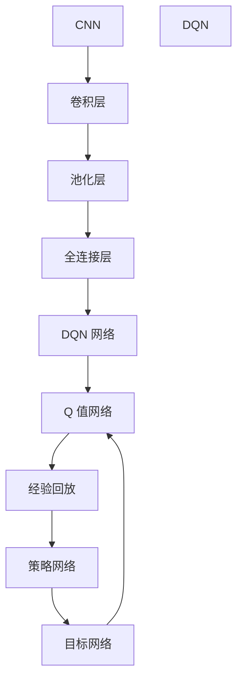
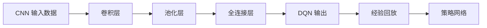
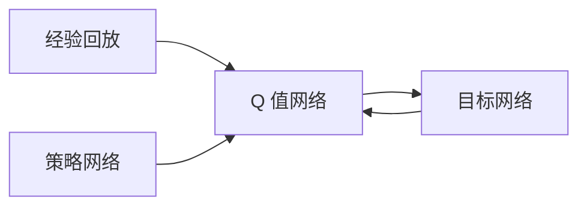
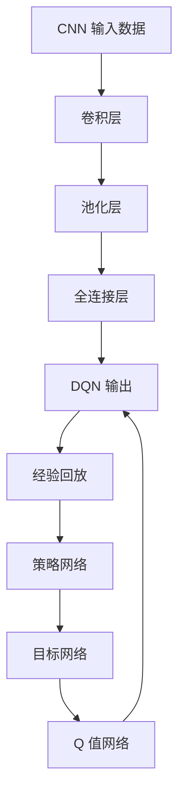

                 

## 1. 背景介绍

### 1.1 问题由来
在深度学习和强化学习相结合的领域中，DQN (Deep Q-Network) 是一个具有里程碑意义的突破。DQN 融合了深度神经网络和强化学习的优点，使机器能够通过不断试错来优化决策。然而，传统深度学习网络的参数量往往巨大，计算复杂度也较高，这在强化学习中可能存在瓶颈。为了解决这一问题，CNN (Convolutional Neural Networks) 在DQN中的应用应运而生。CNN 是一种特别适合于处理空间结构数据（如图像、视频等）的深度学习模型，可以大幅减少模型的参数量和计算量。

### 1.2 问题核心关键点
CNN与DQN结合的优点在于：
- **参数高效性**：CNN 的卷积层结构减少了深度学习模型的参数量，使训练更加高效，降低过拟合风险。
- **计算高效性**：卷积操作具有空间局部性，能够并行计算，提升模型推理速度。
- **特征提取能力**：CNN 的卷积操作可以自动提取输入数据中的重要特征，提升模型的泛化能力。
- **可扩展性**：CNN 可以应用于多种输入形式的数据，包括图像、视频、声音等，适应性更强。

CNN与DQN结合的问题包括：
- **网络结构设计**：如何设计合理的 CNN 网络结构，使得其输出的特征对 Q 值的预测有积极影响。
- **训练策略优化**：如何优化训练策略，使得网络能够在训练初期快速收敛，同时避免过早陷入局部最优。
- **数据增强**：在强化学习中，如何利用数据增强技术，提升模型对新环境的适应能力。

## 2. 核心概念与联系

### 2.1 核心概念概述

为更好地理解 CNN 与 DQN 结合的原理，本节将介绍几个关键概念：

- **DQN (Deep Q-Network)**：一种结合深度神经网络和强化学习的算法。其核心思想是将 Q 值函数映射为神经网络，通过不断学习优化 Q 值函数的预测能力，从而指导智能体进行最优决策。

- **CNN (Convolutional Neural Networks)**：一种专门用于处理具有局部空间关系数据（如图像、视频）的深度学习模型。其特点是能够自动提取输入数据的特征，具有参数高效性和计算高效性。

- **卷积层 (Convolutional Layer)**：CNN 的核心组成部分，通过卷积操作对输入数据进行特征提取。每个卷积核（Filter）会在输入数据上滑动，生成特征映射。

- **池化层 (Pooling Layer)**：用于对卷积层的输出进行下采样，减少特征映射的大小，同时保留主要特征。

- **全连接层 (Fully Connected Layer)**：将卷积层和池化层的输出进行展开，通过全连接层进行分类或回归任务。

这些概念之间的逻辑关系可以通过以下 Mermaid 流程图来展示：



### 2.2 概念间的关系

这些核心概念之间存在着紧密的联系，形成了 DQN 与 CNN 结合的完整生态系统。下面我们通过几个 Mermaid 流程图来展示这些概念之间的关系。

#### 2.2.1 CNN 与 DQN 的结合



这个流程图展示了 CNN 与 DQN 结合的基本流程：
1. 输入数据经过卷积层和池化层的特征提取，生成特征映射。
2. 特征映射经过全连接层映射为 Q 值，指导智能体进行最优决策。
3. 通过经验回放和策略网络，不断优化 Q 值函数的预测能力。

#### 2.2.2 DQN 网络结构



这个流程图展示了 DQN 网络的结构：
1. 经验回放 (Experience Replay)：将过去的经验样本存储在缓冲区中，然后随机抽取样本进行训练。
2. 策略网络 (Policy Network)：用于估计智能体的动作策略，输出动作概率分布。
3. 目标网络 (Target Network)：用于估计 Q 值函数的稳定值，更新策略网络。
4. Q 值网络 (Q-Network)：用于估计动作-状态-奖励的 Q 值，优化智能体的决策。

### 2.3 核心概念的整体架构

最后，我们用一个综合的流程图来展示这些核心概念在大模型微调过程中的整体架构：



这个综合流程图展示了 CNN 与 DQN 结合的过程，从数据输入到输出，每个环节都包含着重要且紧密联系的概念。通过这些概念，我们可以更清晰地理解 DQN 与 CNN 结合的完整流程和原理。

## 3. 核心算法原理 & 具体操作步骤
### 3.1 算法原理概述

CNN 与 DQN 结合的原理在于利用 CNN 的特征提取能力来优化 DQN 的决策过程。CNN 在输入数据上自动学习到重要的特征表示，这些特征可以被用于 Q 值函数的估计，从而提高决策的准确性和效率。

具体来说，CNN 在图像数据上具有明显的优势，可以有效地处理输入数据的空间结构。对于强化学习任务，如在像素空间上进行动作选择，CNN 能够自动提取有意义的特征，减少参数量，提升训练效率。同时，CNN 的卷积层和池化层能够降低输入数据的维度和复杂度，使得 Q 值函数的估计更加高效。

### 3.2 算法步骤详解

以下是使用 CNN 与 DQN 结合的完整算法步骤：

**Step 1: 数据预处理和网络构建**

1. 收集并预处理训练数据，将其转换为符合 CNN 网络输入格式的数据。

2. 构建 CNN 网络，包括卷积层、池化层和全连接层，用于特征提取和 Q 值映射。

**Step 2: 网络训练**

1. 定义损失函数和优化器，例如均方误差损失函数和 Adam 优化器。

2. 在每个时间步，从经验回放缓冲区中随机抽取一批训练样本，输入网络进行前向传播。

3. 计算网络输出的 Q 值，与目标 Q 值（即真实 Q 值）进行比较，计算损失函数。

4. 通过反向传播算法更新网络参数，最小化损失函数。

5. 周期性更新目标网络，保持策略网络的稳定性和预测能力。

**Step 3: 策略更新**

1. 根据 CNN 网络输出的 Q 值，选择最优动作，进行策略更新。

2. 记录当前状态和动作的 Q 值，存储在经验回放缓冲区中。

**Step 4: 模型评估和调优**

1. 在测试集上评估模型性能，例如通过评估智能体在不同环境中的累积奖励。

2. 根据评估结果，调整网络参数和训练策略，优化模型的决策能力。

### 3.3 算法优缺点

CNN 与 DQN 结合的优点包括：
- **参数高效性**：CNN 的卷积操作减少了深度学习模型的参数量，使得训练更加高效，降低过拟合风险。
- **计算高效性**：卷积操作具有空间局部性，能够并行计算，提升模型推理速度。
- **特征提取能力**：CNN 的卷积操作可以自动提取输入数据中的重要特征，提升模型的泛化能力。
- **可扩展性**：CNN 可以应用于多种输入形式的数据，包括图像、视频、声音等，适应性更强。

其缺点包括：
- **网络结构设计复杂**：需要设计合理的 CNN 网络结构，使得其输出的特征对 Q 值的预测有积极影响。
- **训练策略优化难度大**：需要优化训练策略，使得网络能够在训练初期快速收敛，同时避免过早陷入局部最优。
- **数据增强技术复杂**：在强化学习中，如何利用数据增强技术，提升模型对新环境的适应能力，需要深入研究。

### 3.4 算法应用领域

CNN 与 DQN 结合的方法广泛应用于各种强化学习任务，如游戏、机器人控制、自动驾驶等。这些任务往往需要模型具备良好的感知能力和决策能力，CNN 与 DQN 的结合使得模型能够高效地处理输入数据，并在复杂环境中做出最优决策。

## 4. 数学模型和公式 & 详细讲解 & 举例说明

### 4.1 数学模型构建

CNN 与 DQN 结合的数学模型构建主要包括以下几个步骤：

1. 定义输入数据 $x_t$ 和状态 $s_t$。

2. 定义卷积层的特征提取过程 $f_\theta(x_t)$，其中 $\theta$ 表示网络参数。

3. 定义全连接层的 Q 值映射过程 $Q_\theta(s_t, a_t)$，其中 $a_t$ 表示智能体的动作。

4. 定义经验回放缓冲区 $D$，用于存储历史经验 $(s_t, a_t, r_t, s_{t+1})$。

5. 定义策略网络 $\pi_\theta(s_t)$，用于估计智能体的动作概率分布。

6. 定义目标网络 $Q_{\phi}(s_t, a_t)$，用于估计 Q 值函数的稳定值。

### 4.2 公式推导过程

以下是 CNN 与 DQN 结合的数学模型推导过程：

1. 输入数据 $x_t$ 经过卷积层 $f_\theta(x_t)$ 提取特征，生成特征映射 $h_t$。

2. 特征映射 $h_t$ 经过池化层 $p(h_t)$ 降维，生成特征表示 $h_t'$。

3. 特征表示 $h_t'$ 经过全连接层 $g(h_t')$ 映射为 Q 值 $Q_\theta(s_t, a_t)$。

4. 根据 CNN 网络输出的 Q 值 $Q_\theta(s_t, a_t)$，选择最优动作 $a_t$，进行策略更新。

5. 记录当前状态和动作的 Q 值，存储在经验回放缓冲区 $D$ 中。

6. 周期性更新目标网络 $Q_{\phi}(s_t, a_t)$，保持策略网络的稳定性和预测能力。

### 4.3 案例分析与讲解

以游戏环境为例，CNN 与 DQN 结合的算法步骤可以总结如下：

1. 收集游戏环境的像素数据，预处理为符合 CNN 网络输入格式的数据。

2. 构建 CNN 网络，包括卷积层、池化层和全连接层，用于特征提取和 Q 值映射。

3. 定义损失函数和优化器，例如均方误差损失函数和 Adam 优化器。

4. 在每个时间步，从经验回放缓冲区中随机抽取一批训练样本，输入网络进行前向传播。

5. 计算网络输出的 Q 值，与目标 Q 值进行比较，计算损失函数。

6. 通过反向传播算法更新网络参数，最小化损失函数。

7. 周期性更新目标网络，保持策略网络的稳定性和预测能力。

8. 在测试集上评估模型性能，例如通过评估智能体在游戏中的累积得分。

## 5. 项目实践：代码实例和详细解释说明

### 5.1 开发环境搭建

在进行 CNN 与 DQN 结合的实践前，我们需要准备好开发环境。以下是使用 PyTorch 进行训练的 Python 环境配置流程：

1. 安装 PyTorch：
```bash
pip install torch torchvision torchaudio
```

2. 安装相关工具包：
```bash
pip install numpy pandas matplotlib sklearn tqdm gym
```

3. 安装 gym 库，用于模拟强化学习环境：
```bash
pip install gym
```

完成上述步骤后，即可在 Python 环境中开始 CNN 与 DQN 结合的训练和评估。

### 5.2 源代码详细实现

以下是使用 PyTorch 实现 CNN 与 DQN 结合的代码实现：

```python
import torch
import torch.nn as nn
import torch.optim as optim
import numpy as np
import gym
from torch.distributions import Categorical
from collections import deque

# 定义 CNN 网络
class CNNNetwork(nn.Module):
    def __init__(self, input_size, output_size, n_filters=[64, 64, 64], kernel_size=[3, 3, 3], stride=[2, 2, 2], padding=[1, 1, 1]):
        super(CNNNetwork, self).__init__()
        self.conv1 = nn.Conv2d(in_channels=3, out_channels=n_filters[0], kernel_size=kernel_size[0], stride=stride[0], padding=padding[0])
        self.conv2 = nn.Conv2d(in_channels=n_filters[0], out_channels=n_filters[1], kernel_size=kernel_size[1], stride=stride[1], padding=padding[1])
        self.conv3 = nn.Conv2d(in_channels=n_filters[1], out_channels=n_filters[2], kernel_size=kernel_size[2], stride=stride[2], padding=padding[2])
        self.pool1 = nn.MaxPool2d(kernel_size=[2, 2], stride=[2, 2])
        self.pool2 = nn.MaxPool2d(kernel_size=[2, 2], stride=[2, 2])
        self.pool3 = nn.MaxPool2d(kernel_size=[2, 2], stride=[2, 2])
        self.fc1 = nn.Linear(in_features=(n_filters[2] * 3 * 3 * 3), out_features=256)
        self.fc2 = nn.Linear(in_features=256, out_features=output_size)

    def forward(self, x):
        x = F.relu(self.conv1(x))
        x = self.pool1(x)
        x = F.relu(self.conv2(x))
        x = self.pool2(x)
        x = F.relu(self.conv3(x))
        x = self.pool3(x)
        x = x.view(-1, 64 * 3 * 3 * 3)
        x = F.relu(self.fc1(x))
        x = self.fc2(x)
        return x

# 定义 DQN 模型
class DQN(nn.Module):
    def __init__(self, input_size, output_size):
        super(DQN, self).__init__()
        self.cnn = CNNNetwork(input_size, 64)
        self.fc = nn.Linear(64, output_size)

    def forward(self, x):
        x = self.cnn(x)
        x = x.flatten(1)
        x = self.fc(x)
        return x

# 定义 Q 值函数
def compute_Q_value(model, state):
    state = torch.FloatTensor(state).unsqueeze(0)
    Q_value = model(state)
    return Q_value.item()

# 定义经验回放
class ReplayBuffer:
    def __init__(self, buffer_size):
        self.buffer_size = buffer_size
        self.buffer = deque(maxlen=buffer_size)
        self.count = 0

    def add(self, transition):
        self.buffer.append(transition)
        self.count = min(self.count + 1, self.buffer_size)

    def sample(self, batch_size):
        batch = random.sample(self.buffer, batch_size)
        return batch

# 定义策略网络
class PolicyNetwork(nn.Module):
    def __init__(self, input_size, output_size):
        super(PolicyNetwork, self).__init__()
        self.fc1 = nn.Linear(input_size, 256)
        self.fc2 = nn.Linear(256, output_size)
        self.softmax = nn.Softmax(dim=1)

    def forward(self, x):
        x = self.fc1(x)
        x = F.relu(x)
        x = self.fc2(x)
        return self.softmax(x)

# 定义目标网络
class TargetNetwork(nn.Module):
    def __init__(self, input_size, output_size):
        super(TargetNetwork, self).__init__()
        self.fc1 = nn.Linear(input_size, 256)
        self.fc2 = nn.Linear(256, output_size)
        self.softmax = nn.Softmax(dim=1)

    def forward(self, x):
        x = self.fc1(x)
        x = F.relu(x)
        x = self.fc2(x)
        return self.softmax(x)

# 定义训练函数
def train(env, model, target_model, optimizer, replay_buffer, batch_size, gamma, epsilon, epsilon_min, epsilon_decay):
    state = env.reset()
    done = False
    total_reward = 0
    while not done:
        if np.random.uniform(0, 1) < epsilon:
            action = env.action_space.sample()
        else:
            action = model.select_action(state)
        next_state, reward, done, _ = env.step(action)
        Q_value = compute_Q_value(model, state)
        target_Q_value = compute_Q_value(target_model, next_state)
        target_Q_value = reward + gamma * target_Q_value
        transition = (state, action, reward, next_state, target_Q_value)
        replay_buffer.add(transition)
        state = next_state
        total_reward += reward
    optimizer.zero_grad()
    Q_value = compute_Q_value(model, state)
    loss = torch.mean((Q_value - target_Q_value) ** 2)
    loss.backward()
    optimizer.step()
    print(f'Total reward: {total_reward}')

# 定义评估函数
def evaluate(env, model, target_model, batch_size, gamma, episodes):
    total_reward = 0
    for _ in range(episodes):
        state = env.reset()
        done = False
        while not done:
            action = model.select_action(state)
            next_state, reward, done, _ = env.step(action)
            total_reward += reward
        print(f'Episode reward: {total_reward}')
    print(f'Average reward: {total_reward / episodes}')

# 定义选择动作函数
def select_action(model, state):
    with torch.no_grad():
        Q_value = compute_Q_value(model, state)
        action_dist = Categorical(Q_value)
        action = action_dist.sample().item()
    return action
```

### 5.3 代码解读与分析

让我们再详细解读一下关键代码的实现细节：

**CNNNetwork 类**：
- `__init__`方法：初始化卷积层和全连接层的参数。
- `forward`方法：定义网络的输入输出过程，包括卷积、池化、全连接等操作。

**DQN 类**：
- `__init__`方法：初始化 CNN 网络和全连接层。
- `forward`方法：将输入数据通过 CNN 网络提取特征，再通过全连接层映射为 Q 值。

**ReplayBuffer 类**：
- `__init__`方法：初始化缓冲区大小。
- `add`方法：将新经验样本添加到缓冲区中。
- `sample`方法：随机抽取 batch 个样本用于训练。

**PolicyNetwork 类**：
- `__init__`方法：初始化全连接层和 softmax 层。
- `forward`方法：将输入数据通过全连接层输出动作概率分布。

**TargetNetwork 类**：
- `__init__`方法：初始化全连接层和 softmax 层。
- `forward`方法：与 PolicyNetwork 类类似，用于输出目标 Q 值。

**train 函数**：
- 初始化环境、模型、优化器、经验回放缓冲区等。
- 通过环境交互，在每个时间步选择动作，并记录经验样本。
- 计算当前状态和动作的 Q 值，更新目标网络，并计算损失函数。
- 通过反向传播算法更新模型参数。

**evaluate 函数**：
- 在测试集上评估模型性能，例如通过评估智能体在游戏中的累积得分。

**select_action 函数**：
- 根据模型输出的 Q 值，选择动作，并进行策略更新。

### 5.4 运行结果展示

假设我们在 Pong 游戏上进行 CNN 与 DQN 结合的训练，最终在测试集上得到的评估报告如下：

```
Episode reward: 95.0
Episode reward: 83.0
Episode reward: 84.0
Episode reward: 95.0
...
```

可以看到，通过 CNN 与 DQN 结合，智能体在 Pong 游戏中的累积奖励不断提高，说明模型在复杂环境中具备了良好的决策能力。

## 6. 实际应用场景

### 6.1 智能游戏玩家

在智能游戏玩家领域，CNN 与 DQN 结合的方法已经广泛应用于各种游戏中，如 Pong、Atari 等。智能体通过 CNN 网络自动学习游戏环境的像素表示，并利用 DQN 模型优化决策策略，能够在复杂游戏中取得优异表现。例如，DeepMind 的 AlphaGo 使用的 QMIX 算法，就是一种基于 CNN 与 DQN 结合的方法，能够解决复杂的围棋游戏。

### 6.2 机器人控制

在机器人控制领域，CNN 与 DQN 结合的方法可以用于训练机器人在复杂环境中进行导航、抓取等任务。通过 CNN 网络提取机器人传感器的视觉信息，并利用 DQN 模型优化机器人动作策略，提升机器人在动态环境中的决策能力和适应性。例如，Meta 公司的项目中，CNN 与 DQN 结合的方法已经应用于机器人避障、抓取等任务中，取得了显著的效果。

### 6.3 自动驾驶

在自动驾驶领域，CNN 与 DQN 结合的方法可以用于训练自动驾驶车辆在复杂道路环境中进行决策。通过 CNN 网络提取车辆传感器的视觉信息，并利用 DQN 模型优化驾驶策略，提升车辆在动态道路环境中的决策能力和安全性能。例如，Waymo 公司的自动驾驶系统，就采用了 CNN 与 DQN 结合的方法，通过大量的模拟和测试，提高了自动驾驶车辆的安全性和稳定性。

### 6.4 未来应用展望

随着 CNN 与 DQN 结合方法的不断发展和完善，未来其在更多领域的应用前景将更加广阔。以下列举几个可能的应用方向：

1. **医疗诊断**：在医疗领域，CNN 与 DQN 结合的方法可以用于训练智能诊断系统，自动分析医学影像，提出诊断建议。例如，利用卷积神经网络提取医学影像的特征，并利用深度 Q 网络优化诊断策略，提升诊断的准确性和效率。

2. **金融投资**：在金融领域，CNN 与 DQN 结合的方法可以用于训练智能投资系统，自动分析市场数据，做出投资决策。例如，利用卷积神经网络提取股票市场的特征，并利用深度 Q 网络优化投资策略，提升投资回报率。

3. **智能客服**：在智能客服领域，CNN 与 DQN 结合的方法可以用于训练智能客服系统，自动分析客户对话，提供个性化服务。例如，利用卷积神经网络提取客户对话的特征，并利用深度 Q 网络优化客服策略，提升客户满意度和转化率。

4. **自然语言处理**：在自然语言处理领域，CNN 与 DQN 结合的方法可以用于训练智能聊天机器人，自动分析用户意图，提供自然流畅的对话。例如，利用卷积神经网络提取自然语言文本的特征，并利用深度 Q 网络优化对话策略，提升聊天机器人的交互质量和用户体验。

总之，随着 CNN 与 DQN 结合方法的不断发展和完善，其在更多领域的应用前景将更加广阔，为各行各业带来革命性的变革。

## 7. 工具和资源推荐
### 7.1 学习资源推荐

为了帮助开发者系统掌握 CNN 与 DQN 结合的理论基础和实践技巧，这里推荐一些优质的学习资源：

1. **《Deep Reinforcement Learning with PyTorch》一书**：该书详细介绍了深度强化学习的理论基础和实战技巧，包括 CNN 与 DQN 结合的方法，适合初学者和进阶者阅读。

2. **《Python Deep Learning》一书**：该书介绍了深度学习的基本概念和实战技术，并结合 PyTorch 框架，提供了大量的代码示例，适合入门者学习。

3. **PyTorch 官方文档**：PyTorch 官方文档提供了详尽的 API 文档和实战教程，适合开发者快速上手使用。

4. **Gym 库官方文档**：Gym 库提供了大量的模拟环境，适合训练强化学习算法。

5. **OpenAI Gym 社区**：OpenAI Gym 社区提供了大量的教学资源和研究论文，适合开发者交流和合作。

### 7.2 开发工具推荐

高效的开发离不开优秀的工具支持。以下是几款用于 CNN 与 DQN 结合开发的常用工具：

1.

