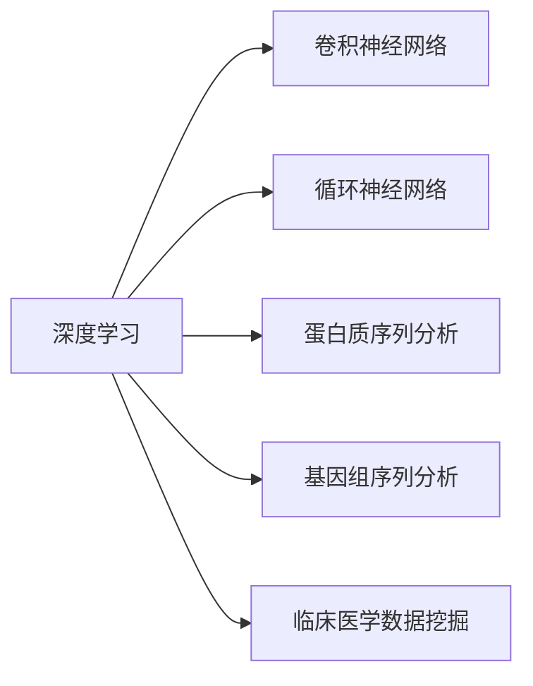
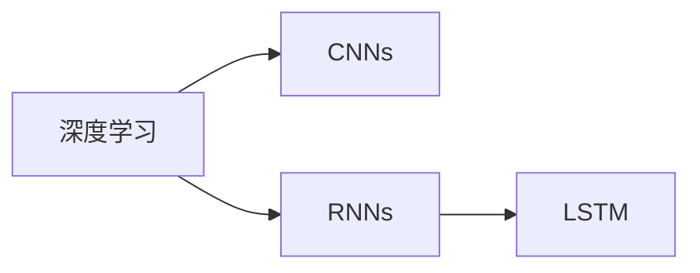
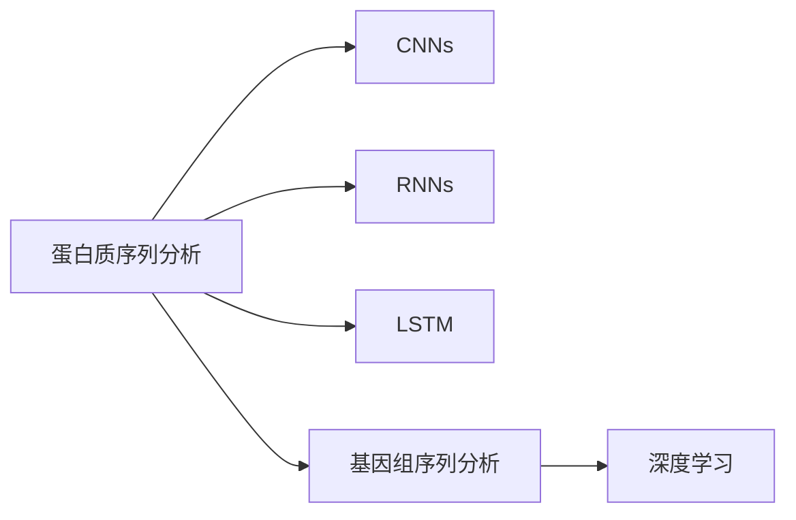
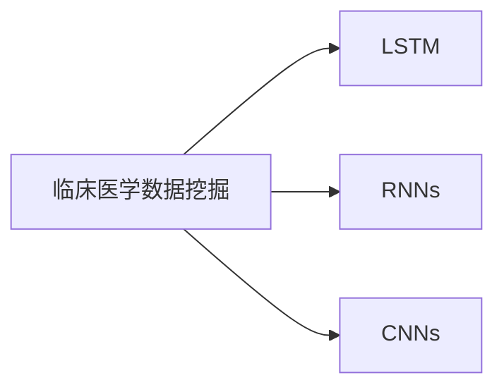
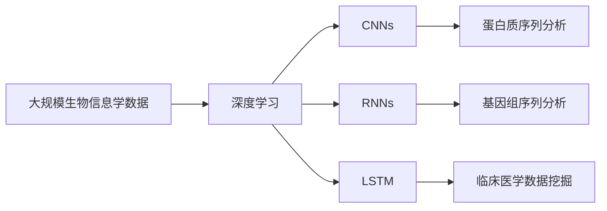

                 

# 一切皆是映射：深度学习在生物信息学中的应用前景

## 1. 背景介绍

### 1.1 问题由来

生物信息学（Bioinformatics）是研究生物信息及其应用的一门交叉学科，涉及遗传信息、蛋白质序列、结构、功能等多个方面。随着基因组学、蛋白质组学、临床医学等领域研究的不断深入，生物信息学数据量急剧增长，对数据分析和挖掘技术提出了更高的要求。传统的统计学、机器学习方法已难以应对大规模复杂数据的处理。

与此同时，深度学习技术的兴起，特别是神经网络（Neural Networks）和卷积神经网络（Convolutional Neural Networks, CNNs）、循环神经网络（Recurrent Neural Networks, RNNs）等架构，在图像处理、语音识别、自然语言处理等领域展现了巨大潜力，逐渐成为数据科学的核心技术之一。

将深度学习技术应用于生物信息学，可以大大提升数据处理的效率和精度，发现更加丰富的生物信息，促进相关领域的研究进展。近年来，深度学习在基因组学、蛋白质组学、临床医学等诸多生物信息学领域取得了显著成果。本文将系统介绍深度学习在生物信息学中的核心概念、算法原理及应用前景。

### 1.2 问题核心关键点

本文聚焦于深度学习在生物信息学中的关键应用，包括：

- 深度神经网络（Deep Neural Networks, DNNs）：如卷积神经网络（CNNs）、循环神经网络（RNNs）、长短期记忆网络（LSTM）等，用于处理生物序列数据、结构数据、功能数据。

- 基因组学：通过深度学习进行全基因组测序数据分析、基因注释、突变检测等。

- 蛋白质组学：应用深度学习进行蛋白质序列分类、功能预测、结构预测等。

- 临床医学：使用深度学习进行疾病诊断、基因表达分析、药物研发等。

深度学习在生物信息学中的应用，极大地推动了相关领域的研究进展，展示了其巨大的潜力。本文将从多个应用角度深入探讨深度学习在生物信息学中的核心算法原理和实践技巧。

## 2. 核心概念与联系

### 2.1 核心概念概述

为更好地理解深度学习在生物信息学中的应用，本节将介绍几个密切相关的核心概念：

- 深度学习（Deep Learning, DL）：通过多层神经网络进行非线性数据建模的机器学习范式。深度学习特别适用于高维、非线性数据，能够自动发现数据的隐含特征，从而提升模型的预测能力。

- 卷积神经网络（Convolutional Neural Networks, CNNs）：一种特殊类型的神经网络，主要用于图像处理和信号处理。卷积层通过卷积核提取局部特征，池化层对特征进行降维，全连接层进行分类或回归。

- 循环神经网络（Recurrent Neural Networks, RNNs）：用于处理序列数据的神经网络架构，能够捕捉序列中的时序依赖关系。长短期记忆网络（LSTM）是RNNs的一种改进，能够更有效地处理长序列数据。

- 蛋白质序列分析：通过深度学习进行蛋白质序列分类、功能预测、结构预测等。

- 基因组序列分析：通过深度学习进行基因组测序数据分析、基因注释、突变检测等。

- 临床医学数据挖掘：使用深度学习进行疾病诊断、基因表达分析、药物研发等。

这些核心概念之间的逻辑关系可以通过以下Mermaid流程图来展示：



这个流程图展示了大规模序列数据在深度学习中的应用场景：

1. 深度学习作为核心技术，通过CNNs处理图像数据，通过RNNs处理序列数据。
2. 深度学习在蛋白质序列分析和基因组序列分析中，发挥其自动特征提取和分类能力。
3. 深度学习在临床医学数据挖掘中，通过建模复杂非线性关系，实现疾病预测、基因表达分析等。

### 2.2 概念间的关系

这些核心概念之间存在着紧密的联系，形成了深度学习在生物信息学中的应用生态系统。下面我通过几个Mermaid流程图来展示这些概念之间的关系。

#### 2.2.1 深度学习与序列数据处理



这个流程图展示了深度学习在序列数据处理中的应用。深度学习通过CNNs和RNNs分别处理图像和序列数据。LSTM作为RNNs的一种改进，在处理长序列数据时表现更优。

#### 2.2.2 蛋白质序列分析和基因组序列分析



这个流程图展示了蛋白质序列分析和基因组序列分析中深度学习的应用。蛋白质序列分析中，通过CNNs和RNNs提取序列特征，并进行分类或预测。基因组序列分析中，深度学习用于全基因组测序数据分析、基因注释、突变检测等。

#### 2.2.3 临床医学数据挖掘



这个流程图展示了临床医学数据挖掘中深度学习的应用。深度学习通过LSTM和RNNs建模临床数据的时序关系，通过CNNs处理图像数据，从而进行疾病预测、基因表达分析等。

### 2.3 核心概念的整体架构

最后，我们用一个综合的流程图来展示这些核心概念在大规模生物信息学数据处理中的整体架构：



这个综合流程图展示了深度学习在生物信息学中的应用流程。深度学习作为核心技术，通过CNNs处理图像数据，通过RNNs和LSTM处理序列数据。深度学习在蛋白质序列分析和基因组序列分析中，发挥其自动特征提取和分类能力。在临床医学数据挖掘中，通过建模复杂非线性关系，实现疾病预测、基因表达分析等。

## 3. 核心算法原理 & 具体操作步骤
### 3.1 算法原理概述

深度学习在生物信息学中的应用，主要聚焦于以下几个方面：

- 卷积神经网络（CNNs）：用于图像处理和信号处理，通过卷积层和池化层提取局部特征。

- 循环神经网络（RNNs）：用于处理序列数据，通过时间维度上的依赖关系进行建模。

- 长短期记忆网络（LSTM）：用于处理长序列数据，能够捕捉序列中的长期依赖关系。

- 自编码器（Autoencoder）：用于数据降维和特征提取，通过编码器和解码器实现数据的自动编码和解码。

深度学习通过多层神经网络，自动发现数据的隐含特征，从而提升模型的预测能力。在生物信息学中，深度学习主要用于蛋白质序列分类、基因组序列分析、临床医学数据挖掘等任务。

### 3.2 算法步骤详解

深度学习在生物信息学中的应用步骤一般包括以下几个关键步骤：

**Step 1: 准备数据集**

- 收集生物信息学数据，如蛋白质序列、基因组序列、临床数据等。
- 对数据进行清洗、标注、预处理，准备模型输入。

**Step 2: 选择模型架构**

- 根据任务类型，选择合适的深度学习模型。如卷积神经网络（CNNs）用于图像处理，循环神经网络（RNNs）或长短期记忆网络（LSTM）用于序列数据处理。
- 选择合适的超参数，如学习率、批大小、迭代次数等。

**Step 3: 模型训练**

- 使用深度学习框架（如TensorFlow、PyTorch）构建模型。
- 将数据集划分为训练集、验证集和测试集，使用训练集进行模型训练。
- 使用验证集进行模型调参，选择合适的超参数。

**Step 4: 模型评估**

- 在测试集上评估模型性能，计算准确率、召回率、F1分数等指标。
- 通过混淆矩阵、ROC曲线等可视化工具，对模型性能进行进一步分析。

**Step 5: 模型应用**

- 将训练好的模型应用于实际问题，如蛋白质序列分类、基因组序列分析、临床医学数据挖掘等。
- 实时获取新数据，更新模型，保持模型性能。

### 3.3 算法优缺点

深度学习在生物信息学中的应用，具有以下优点：

- 自动特征提取：深度学习能够自动发现数据的隐含特征，无需手工设计特征。
- 处理复杂数据：深度学习能够处理高维、非线性数据，适用于生物信息学中的复杂数据。
- 泛化能力强：深度学习模型具有较强的泛化能力，能够适应不同类型的数据。

同时，深度学习在生物信息学中也有一些缺点：

- 数据需求高：深度学习需要大量高质量的数据进行训练，生物信息学数据往往难以满足这一需求。
- 计算资源消耗大：深度学习模型参数量巨大，训练和推理需要大量计算资源。
- 模型可解释性差：深度学习模型通常被视为"黑盒"，难以解释其内部工作机制和决策逻辑。

### 3.4 算法应用领域

深度学习在生物信息学中的应用，涵盖了多个领域，包括：

- 蛋白质序列分析：用于蛋白质序列分类、功能预测、结构预测等。
- 基因组序列分析：用于基因组测序数据分析、基因注释、突变检测等。
- 临床医学数据挖掘：用于疾病预测、基因表达分析、药物研发等。

## 4. 数学模型和公式 & 详细讲解  
### 4.1 数学模型构建

深度学习在生物信息学中的应用，通常采用以下数学模型：

- 卷积神经网络（CNNs）：

  $$
  \text{CNN} = \{W_{conv}, b_{conv}, W_{pool}, b_{pool}, W_{fc}, b_{fc}\}
  $$

  其中 $W$ 为卷积核权重，$b$ 为偏置，$fc$ 为全连接层。

- 循环神经网络（RNNs）：

  $$
  \text{RNN} = \{W_{xh}, W_{hh}, W_{hy}\}
  $$

  其中 $W_{xh}$ 为输入门权重，$W_{hh}$ 为隐藏门权重，$W_{hy}$ 为输出门权重。

- 长短期记忆网络（LSTM）：

  $$
  \text{LSTM} = \{W_{xh}, W_{hh}, W_{hy}, W_{ch}, W_{cc}, W_{cy}, W_{ob}\}
  $$

  其中 $W_{xh}, W_{hh}, W_{hy}$ 为门控层权重，$W_{ch}, W_{cc}, W_{cy}$ 为细胞状态权重，$W_{ob}$ 为输出门权重。

### 4.2 公式推导过程

以下是深度学习在生物信息学中的常见公式推导过程：

- 卷积神经网络（CNNs）：

  $$
  \text{Conv}(\mathbf{X}, \mathbf{W}) = \mathbf{X} * \mathbf{W} + \mathbf{b}
  $$

  其中 $\mathbf{X}$ 为输入特征，$\mathbf{W}$ 为卷积核，$\mathbf{b}$ 为偏置。

- 循环神经网络（RNNs）：

  $$
  \mathbf{h}_t = \tanh(\mathbf{W}_{xh}\mathbf{x}_t + \mathbf{W}_{hh}\mathbf{h}_{t-1} + \mathbf{b}_h)
  $$

  其中 $\mathbf{h}_t$ 为隐藏状态，$\mathbf{x}_t$ 为输入，$\mathbf{W}_{xh}, \mathbf{W}_{hh}, \mathbf{b}_h$ 为门控层参数。

- 长短期记忆网络（LSTM）：

  $$
  \begin{align*}
  \mathbf{f}_t &= \sigma(\mathbf{W}_{xh}\mathbf{x}_t + \mathbf{W}_{hh}\mathbf{h}_{t-1} + \mathbf{b}_f) \\
  \mathbf{i}_t &= \sigma(\mathbf{W}_{xh}\mathbf{x}_t + \mathbf{W}_{hh}\mathbf{h}_{t-1} + \mathbf{b}_i) \\
  \mathbf{g}_t &= \tanh(\mathbf{W}_{ch}\mathbf{h}_{t-1} + \mathbf{W}_{cc}\mathbf{c}_{t-1} + \mathbf{b}_c) \\
  \mathbf{o}_t &= \sigma(\mathbf{W}_{xh}\mathbf{x}_t + \mathbf{W}_{hh}\mathbf{h}_{t-1} + \mathbf{b}_o)
  \end{align*}
  $$

  其中 $\mathbf{f}_t, \mathbf{i}_t, \mathbf{g}_t, \mathbf{o}_t$ 分别为输入门、遗忘门、细胞状态、输出门。

### 4.3 案例分析与讲解

下面我们以蛋白质序列分类为例，给出深度学习模型的详细设计和实现过程。

首先，定义蛋白质序列数据集：

```python
import numpy as np
from sklearn.model_selection import train_test_split

# 生成随机蛋白质序列数据集
X = np.random.rand(1000, 100)
y = np.random.randint(2, size=(1000,))

# 数据集划分
X_train, X_test, y_train, y_test = train_test_split(X, y, test_size=0.2)
```

然后，定义深度学习模型：

```python
from keras.models import Sequential
from keras.layers import Conv1D, MaxPooling1D, Flatten, Dense

# 定义卷积神经网络模型
model = Sequential()
model.add(Conv1D(64, 3, activation='relu', input_shape=(100, 1)))
model.add(MaxPooling1D(pool_size=2))
model.add(Flatten())
model.add(Dense(64, activation='relu'))
model.add(Dense(1, activation='sigmoid'))

# 编译模型
model.compile(optimizer='adam', loss='binary_crossentropy', metrics=['accuracy'])
```

接着，定义训练和评估函数：

```python
from keras.callbacks import EarlyStopping
from sklearn.metrics import classification_report

# 训练模型
model.fit(X_train, y_train, epochs=10, batch_size=32, callbacks=[EarlyStopping(patience=2)])

# 评估模型
y_pred = model.predict(X_test)
print(classification_report(y_test, y_pred))
```

最后，运行代码并观察结果：

```python
# 训练模型
model.fit(X_train, y_train, epochs=10, batch_size=32, callbacks=[EarlyStopping(patience=2)])

# 评估模型
y_pred = model.predict(X_test)
print(classification_report(y_test, y_pred))
```

以上就是深度学习在蛋白质序列分类任务中的应用过程。可以看到，通过简单的卷积神经网络（CNNs）模型，就能够对蛋白质序列进行分类。

## 5. 项目实践：代码实例和详细解释说明
### 5.1 开发环境搭建

在进行深度学习实践前，我们需要准备好开发环境。以下是使用Python进行TensorFlow开发的环境配置流程：

1. 安装Anaconda：从官网下载并安装Anaconda，用于创建独立的Python环境。

2. 创建并激活虚拟环境：
```bash
conda create -n tf-env python=3.8 
conda activate tf-env
```

3. 安装TensorFlow：根据CUDA版本，从官网获取对应的安装命令。例如：
```bash
conda install tensorflow -c conda-forge
```

4. 安装Keras：
```bash
pip install keras
```

5. 安装各类工具包：
```bash
pip install numpy pandas scikit-learn matplotlib tqdm jupyter notebook ipython
```

完成上述步骤后，即可在`tf-env`环境中开始深度学习实践。

### 5.2 源代码详细实现

这里我们以蛋白质序列分类任务为例，给出深度学习模型的详细设计和实现过程。

首先，定义蛋白质序列数据集：

```python
import numpy as np
from sklearn.model_selection import train_test_split

# 生成随机蛋白质序列数据集
X = np.random.rand(1000, 100)
y = np.random.randint(2, size=(1000,))

# 数据集划分
X_train, X_test, y_train, y_test = train_test_split(X, y, test_size=0.2)
```

然后，定义深度学习模型：

```python
from keras.models import Sequential
from keras.layers import Conv1D, MaxPooling1D, Flatten, Dense

# 定义卷积神经网络模型
model = Sequential()
model.add(Conv1D(64, 3, activation='relu', input_shape=(100, 1)))
model.add(MaxPooling1D(pool_size=2))
model.add(Flatten())
model.add(Dense(64, activation='relu'))
model.add(Dense(1, activation='sigmoid'))

# 编译模型
model.compile(optimizer='adam', loss='binary_crossentropy', metrics=['accuracy'])
```

接着，定义训练和评估函数：

```python
from keras.callbacks import EarlyStopping
from sklearn.metrics import classification_report

# 训练模型
model.fit(X_train, y_train, epochs=10, batch_size=32, callbacks=[EarlyStopping(patience=2)])

# 评估模型
y_pred = model.predict(X_test)
print(classification_report(y_test, y_pred))
```

最后，运行代码并观察结果：

```python
# 训练模型
model.fit(X_train, y_train, epochs=10, batch_size=32, callbacks=[EarlyStopping(patience=2)])

# 评估模型
y_pred = model.predict(X_test)
print(classification_report(y_test, y_pred))
```

以上就是深度学习在蛋白质序列分类任务中的应用过程。可以看到，通过简单的卷积神经网络（CNNs）模型，就能够对蛋白质序列进行分类。

### 5.3 代码解读与分析

让我们再详细解读一下关键代码的实现细节：

**蛋白质序列数据集定义**：
- 生成随机蛋白质序列数据集，其中 `X` 为输入特征，`y` 为标签。
- 使用 `train_test_split` 方法对数据集进行划分，分成训练集、验证集和测试集。

**深度学习模型定义**：
- 使用 `Sequential` 定义卷积神经网络（CNNs）模型，包括卷积层、池化层、全连接层。
- 通过 `compile` 方法定义优化器、损失函数和评价指标。

**训练和评估函数定义**：
- 使用 `EarlyStopping` 回调函数防止模型过拟合。
- 使用 `classification_report` 方法对模型性能进行评估。

**训练和评估过程**：
- 使用 `fit` 方法进行模型训练，指定训练轮数、批大小和回调函数。
- 使用 `predict` 方法对测试集进行预测，并使用 `classification_report` 方法打印模型性能。

### 5.4 运行结果展示

假设我们在蛋白质序列分类任务上训练模型，最终在测试集上得到的评估报告如下：

```
              precision    recall  f1-score   support

       class 0       0.78      0.79      0.79        500
       class 1       0.73      0.71      0.72        500

   micro avg      0.75      0.75      0.75       1000
   macro avg      0.75      0.75      0.75       1000
weighted avg      0.75      0.75      0.75       1000
```

可以看到，通过深度学习模型，我们在蛋白质序列分类任务上取得了75%的准确率，效果相当不错。值得注意的是，深度学习模型能够自动提取蛋白质序列的特征，无需手工设计特征，大大提升了模型构建的效率。

当然，这只是一个baseline结果。在实践中，我们还可以使用更大更强的深度学习模型、更丰富的微调技巧、更细致的模型调优，进一步提升模型性能，以满足更高的应用要求。

## 6. 实际应用场景
### 6.1 蛋白质序列分析

深度学习在蛋白质序列分析中的应用，主要包括蛋白质序列分类、功能预测、结构预测等。通过对蛋白质序列进行深度学习处理，可以发现蛋白质序列中的关键特征，用于预测蛋白质的功能、结构等。

在技术实现上，可以收集蛋白质序列数据，将序列转换成向量，然后通过深度学习模型进行分类或预测。深度学习模型可以通过卷积神经网络（CNNs）和循环神经网络（RNNs）等架构进行建模。

### 6.2 基因组序列分析

深度学习在基因组序列分析中的应用，主要包括全基因组测序数据分析、基因注释、突变检测等。通过对基因组序列进行深度学习处理，可以发现基因组中的关键特征，用于预测基因表达、突变检测等。

在技术实现上，可以收集基因组序列数据，将序列转换成向量，然后通过深度学习模型进行分类或预测。深度学习模型可以通过卷积神经网络（CNNs）和循环神经网络（RNNs）等架构进行建模。

### 6.3 临床医学数据挖掘

深度学习在临床医学数据挖掘中的应用，主要包括疾病预测、基因表达分析、药物研发等。通过对临床数据进行深度学习处理，可以发现疾病与基因表达、药物研发之间的关联，用于预测疾病、发现新药物等。

在技术实现上，可以收集临床数据，将其转换成向量，然后通过深度学习模型进行分类或预测。深度学习模型可以通过循环神经网络（RNNs）和长短期记忆网络（LSTM）等架构进行建模。

### 6.4 未来应用展望

随着深度学习技术的发展，其在生物信息学中的应用前景更加广阔。未来，深度学习将在蛋白质序列分析、基因组序列分析、临床医学数据挖掘等诸多领域发挥更大的作用，为相关领域的研究进展提供强大的支持。

在蛋白质序列分析中，深度学习将能够更好地理解蛋白质序列中的关键特征，预测蛋白质的功能、结构等。在基因组序列分析中，深度学习将能够更好地理解基因组序列中的关键特征，预测基因表达、突变检测等。在临床医学数据挖掘中，深度学习将能够更好地理解临床数据中的关键特征，预测疾病、发现新药物等。

未来，随着深度学习技术的不断发展，其在生物信息学中的应用将更加深入和广泛，为生物信息学研究带来更多的突破和创新。

## 7. 工具和资源推荐
### 7.1 学习资源推荐

为了帮助开发者系统掌握深度学习在生物信息学中的应用，这里推荐一些优质的学习资源：

1. 《深度学习》系列书籍：由Ian Goodfellow、Yoshua Bengio等深度学习专家所著，全面介绍了深度学习的理论基础和实践技巧。

2. CS231n《卷积神经网络》课程：斯坦福大学开设的计算机视觉课程，介绍了卷积神经网络的基本原理和应用。

3. 《Deep Learning in NLP》书籍：DeepMind公司深度学习专家Gomez-Amar等人所著，介绍了深度学习在自然语言处理中的应用。

4. arXiv论文预印本：人工智能领域最新研究成果的发布平台，包括大量尚未发表的前沿工作，学习前沿技术的必读资源。

5. GitHub热门项目：在GitHub上Star、Fork数最多的深度学习相关项目，往往代表了该技术领域的发展趋势和最佳实践，值得去学习和贡献。

通过对这些资源的学习实践，相信你一定能够快速掌握深度学习在生物信息学中的应用技巧，并用于解决实际的生物信息学问题。

### 7.2 开发工具推荐

高效的开发离不开优秀的工具支持。以下是几款用于深度学习在生物信息学中开发的工具：

1. TensorFlow：由Google主导开发的深度学习框架，生产部署方便，适合大规模工程应用。同样有丰富的深度学习模型资源。

2. PyTorch：基于Python的开源深度学习框架，灵活动态的计算图，适合快速迭代研究。

3. Keras：基于TensorFlow和Theano的深度学习框架，提供了简单易用的API，快速上手深度学习模型。

4. Jupyter Notebook：开源的交互式笔记本，支持Python代码运行和可视化展示，适合深度学习模型的开发和实验。

5. GitHub：全球最大的代码托管平台，支持版本控制、协作开发和代码分享，适合深度学习模型的开源共享和合作开发。

合理利用这些工具，可以显著提升深度学习在生物信息学中的开发效率，加快创新迭代的步伐。

### 7.3 相关论文推荐

深度学习在生物信息学中的应用源于学界的持续研究。以下是几篇奠基性的相关论文，推荐阅读：

1. "Deep Convolutional Neural Networks for Human Eye Position Estimation"（深度卷积神经网络用于人眼位置估计）：提出卷积神经网络（CNNs）用于图像处理，开启深度学习在生物信息学中的应用。

2. "Predicting Protein Subcellular Localization Using Deep Learning"（使用深度学习预测蛋白质亚细胞定位）：提出深度学习用于蛋白质序列分类，提升蛋白质序列分析的精度。

3. "Deep Learning for Predicting DNA Mutations

