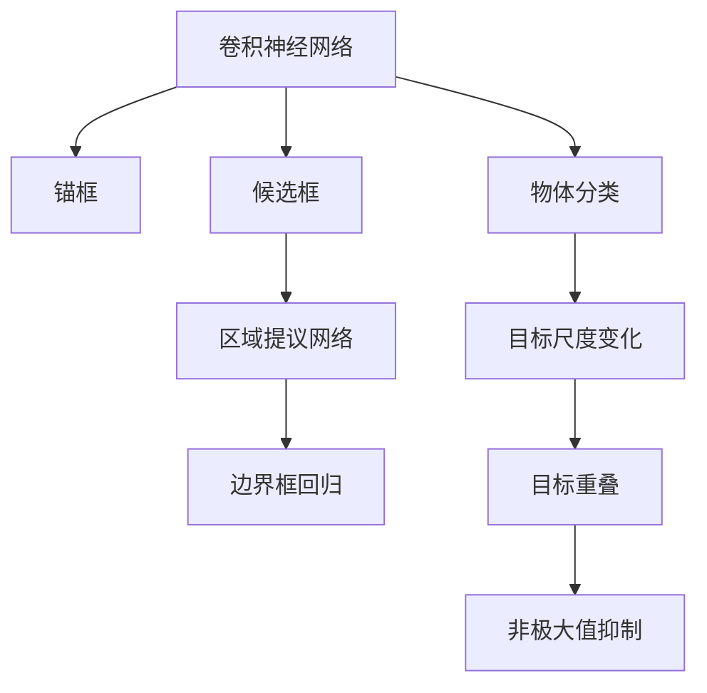
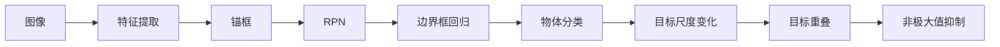
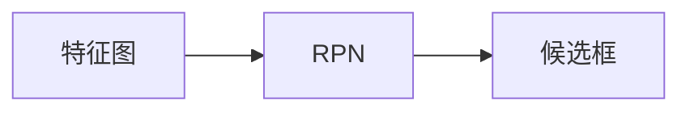
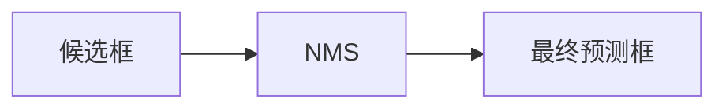
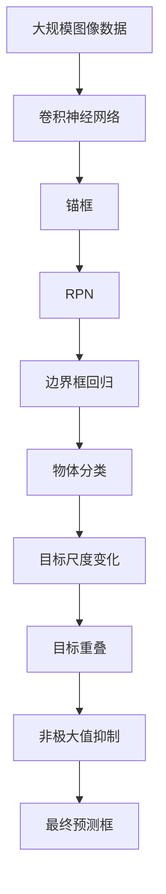

                 

# 一切皆是映射：物体检测与识别：AI的视觉能力

## 1. 背景介绍

### 1.1 问题由来

物体检测与识别（Object Detection and Recognition）是计算机视觉领域的重要研究方向，它旨在通过机器学习算法自动识别和定位图像或视频中的物体。随着深度学习技术的快速发展，基于卷积神经网络（Convolutional Neural Networks, CNNs）的物体检测方法取得了显著进展。该技术在自动驾驶、安防监控、医学影像分析、智能零售等多个领域都得到了广泛应用。

近年来，基于深度学习的物体检测技术，如Faster R-CNN、YOLO、SSD等，已经超越了传统方法的准确率和实时性。这些方法不仅在图像级别的物体识别上取得了优异表现，还广泛应用于视频流的实时检测任务中。此外，基于物体的语义分割、实例分割等任务也逐渐被纳入研究范畴，进一步拓展了物体检测的应用场景。

### 1.2 问题核心关键点

物体检测与识别的核心问题是如何在图像中高效、准确地找到并定位物体，同时还要尽可能地减少计算资源消耗。主要的技术挑战包括：

- **目标尺度变化**：物体在不同尺度下可能会出现大小变化，如何捕捉不同尺度的物体是一个重要问题。
- **目标重叠**：物体之间可能存在重叠现象，如何在重叠区域中准确区分不同物体是一个难点。
- **计算效率**：传统的两阶段检测方法（如Faster R-CNN）在速度上有所瓶颈，如何提升检测速度是一个热点问题。
- **模型通用性**：如何设计通用性强的模型，适应不同的场景和应用需求。

### 1.3 问题研究意义

研究物体检测与识别技术，对于拓展计算机视觉应用范围，提升图像分析的准确性和实时性，加速计算机视觉技术在各行业中的应用，具有重要意义：

1. **降低成本**：利用深度学习技术进行物体检测，可以显著减少人工标注的成本和周期。
2. **提升效率**：基于深度学习的物体检测方法具有较高的实时性，可以应用于对响应速度要求较高的场景。
3. **提高准确性**：深度学习模型在物体检测上表现优异，能够提供比传统方法更准确的检测结果。
4. **推动创新**：物体检测技术的进步催生了新的研究方向，如目标跟踪、三维物体检测等。
5. **促进应用**：物体检测技术可以广泛应用于多个行业，如自动驾驶、智能零售、智能制造等，提升行业智能化水平。

## 2. 核心概念与联系

### 2.1 核心概念概述

为更好地理解物体检测与识别，本节将介绍几个密切相关的核心概念：

- **卷积神经网络（CNNs）**：一种特殊的深度神经网络结构，通过卷积操作提取图像特征，广泛应用于图像分类、目标检测等任务。
- **锚框（Anchor）**：在物体检测任务中，每个物体可能对应多个不同尺度和比例的锚框，通过这些锚框可以在不同尺度的图像上捕捉物体。
- **候选框（Proposal）**：在物体检测过程中，通过候选框生成算法（如RPN）对图像中可能存在的物体进行候选框的筛选，减少检测过程中的误检和漏检。
- **区域提议网络（RPN）**：一种基于CNN的候选框生成算法，用于物体检测中的候选框筛选。
- **边界框回归（Bounding Box Regression）**：用于精炼候选框位置的算法，通过回归模型对候选框进行微调。
- **物体分类（Object Classification）**：对候选框内可能包含的物体进行分类预测，判断是否为感兴趣的目标。
- **目标尺度变化（Scale Variation）**：物体在不同尺度下大小变化，需要通过尺度不变性算法（如SSD）来解决。
- **目标重叠（Overlap）**：物体之间可能存在重叠现象，需要通过非极大值抑制（NMS）等技术来处理。

这些核心概念之间的逻辑关系可以通过以下Mermaid流程图来展示：



这个流程图展示了物体检测过程中各关键组件之间的关系：

1. 通过卷积神经网络提取图像特征。
2. 在特征图上生成锚框，用于捕捉不同尺度的物体。
3. 通过区域提议网络对锚框进行筛选，得到可能的候选框。
4. 对候选框进行边界框回归，精炼物体位置。
5. 对候选框内的物体进行分类预测。
6. 应对目标尺度变化和重叠问题。
7. 通过非极大值抑制（NMS）来去除冗余的候选框。

### 2.2 概念间的关系

这些核心概念之间存在着紧密的联系，形成了物体检测与识别的完整生态系统。下面我通过几个Mermaid流程图来展示这些概念之间的关系。

#### 2.2.1 物体检测的全流程



这个流程图展示了物体检测的全流程：

1. 将输入图像经过卷积神经网络提取特征。
2. 在特征图上生成锚框，用于捕捉不同尺度的物体。
3. 通过区域提议网络对锚框进行筛选，得到可能的候选框。
4. 对候选框进行边界框回归，精炼物体位置。
5. 对候选框内的物体进行分类预测。
6. 应对目标尺度变化和重叠问题。
7. 通过非极大值抑制（NMS）来去除冗余的候选框。

#### 2.2.2 区域提议网络的工作原理



这个流程图展示了区域提议网络（RPN）的工作原理：

1. 特征图上的每个位置都会生成多个锚框，每个锚框对应一个尺度和一个比例。
2. 通过区域提议网络对每个位置生成的锚框进行筛选，得到候选框。
3. 候选框将用于后续的边界框回归和物体分类任务。

#### 2.2.3 非极大值抑制的工作原理



这个流程图展示了非极大值抑制（NMS）的工作原理：

1. 生成多个候选框。
2. 对候选框按照置信度进行排序，去除置信度较低的候选框。
3. 对剩余的候选框按照位置关系进行非极大值抑制，去除重叠的候选框，得到最终的预测框。

### 2.3 核心概念的整体架构

最后，我们用一个综合的流程图来展示这些核心概念在大规模物体检测任务中的整体架构：



这个综合流程图展示了从图像数据输入到最终预测框输出的完整过程：

1. 将大规模图像数据输入到卷积神经网络，提取图像特征。
2. 在特征图上生成锚框，用于捕捉不同尺度的物体。
3. 通过区域提议网络对锚框进行筛选，得到候选框。
4. 对候选框进行边界框回归，精炼物体位置。
5. 对候选框内的物体进行分类预测。
6. 应对目标尺度变化和重叠问题。
7. 通过非极大值抑制（NMS）来去除冗余的候选框，得到最终的预测框。

通过这些流程图，我们可以更清晰地理解物体检测过程中各个组件的关系和作用，为后续深入讨论具体的检测方法奠定基础。

## 3. 核心算法原理 & 具体操作步骤
### 3.1 算法原理概述

物体检测与识别本质上是一个图像分类和定位任务，其核心目标是识别图像中的物体并精确定位它们的边界框。深度学习的方法通过端到端的训练过程，使得模型能够直接输出目标的位置和类别。

形式化地，设输入图像为 $I$，物体检测模型为 $D$，输出为位置 $(x,y,w,h)$ 和类别 $c$。则目标检测的损失函数 $\mathcal{L}$ 可以定义为：

$$
\mathcal{L}(D(I)) = \sum_i \mathcal{L}_{cls}(D(I), c_i) + \sum_i \mathcal{L}_{reg}(D(I), (x_i, y_i, w_i, h_i))
$$

其中 $\mathcal{L}_{cls}$ 和 $\mathcal{L}_{reg}$ 分别为分类损失和回归损失，$i$ 表示每个目标。

通过梯度下降等优化算法，模型不断更新参数，最小化损失函数 $\mathcal{L}$，使得模型能够准确地预测每个目标的位置和类别。

### 3.2 算法步骤详解

物体检测与识别的深度学习方法通常包括以下关键步骤：

**Step 1: 准备训练数据和预训练模型**
- 收集大规模图像数据集，并对其进行标注，生成标注数据集。
- 选择合适的预训练模型（如ResNet、VGG等），用于特征提取。

**Step 2: 设计区域提议网络**
- 在预训练模型的顶部设计区域提议网络（RPN），用于生成候选框。
- 设计候选框的尺度、比例和锚点数，以适应不同大小的目标。

**Step 3: 设计边界框回归和物体分类器**
- 对候选框进行边界框回归，精炼目标位置。
- 设计物体分类器，用于预测每个候选框内是否存在物体，并预测物体的类别。

**Step 4: 训练模型**
- 将训练数据集分成训练集、验证集和测试集。
- 使用梯度下降等优化算法，最小化损失函数，训练模型。
- 在验证集上评估模型性能，调整超参数。

**Step 5: 测试和部署**
- 在测试集上评估模型性能，计算mAP（均值平均精度）等指标。
- 使用训练好的模型对新图像进行物体检测。
- 将模型部署到实际应用系统中，如自动驾驶、安防监控等。

以上是物体检测与识别的深度学习方法的常规流程。在实际应用中，还需要针对具体任务的特点，对模型进行优化设计，如改进损失函数、引入正则化技术、调整超参数等，以进一步提升模型性能。

### 3.3 算法优缺点

物体检测与识别基于深度学习的方法，具有以下优点：

- **准确率高**：深度学习模型在图像分类和定位上表现优异，能够提供高精度的检测结果。
- **实时性好**：通过优化算法和硬件加速，深度学习模型能够在实时性要求较高的场景中应用。
- **通用性强**：通过预训练和微调，模型可以适应不同的物体检测任务和数据分布。

同时，该方法也存在一些局限性：

- **数据需求高**：深度学习模型需要大量的标注数据进行训练，数据标注成本较高。
- **计算资源消耗大**：深度学习模型通常需要高性能硬件支持，计算资源消耗较大。
- **模型复杂度大**：深度学习模型参数量较大，模型结构复杂，难以理解和调试。
- **鲁棒性不足**：模型对输入数据的微小扰动可能产生较大的检测误差。

尽管存在这些局限性，但基于深度学习的物体检测方法已经在多个应用场景中取得了成功，成为计算机视觉领域的重要研究方向。

### 3.4 算法应用领域

物体检测与识别技术已经在多个领域得到了广泛应用，例如：

- **自动驾驶**：用于检测道路上的车辆、行人、交通标志等，确保车辆安全行驶。
- **安防监控**：用于实时监控视频，检测异常行为和物体。
- **医学影像分析**：用于检测和分割医学影像中的病变区域，辅助医生诊断。
- **智能零售**：用于检测和跟踪零售场景中的商品和顾客，提升零售效率。
- **目标跟踪**：用于实时追踪目标的运动轨迹，应用于视频分析、监控等领域。
- **工业检测**：用于检测工业生产线上的缺陷和异常，提升生产效率和质量。

除了上述这些经典应用外，物体检测与识别技术还在无人机、智能家居、公共安全等领域得到广泛应用，为计算机视觉技术带来了新的应用场景和发展机遇。

## 4. 数学模型和公式 & 详细讲解  
### 4.1 数学模型构建

本节将使用数学语言对物体检测与识别的深度学习模型进行更加严格的刻画。

设输入图像为 $I$，物体检测模型为 $D$，输出为位置 $(x,y,w,h)$ 和类别 $c$。目标检测的损失函数 $\mathcal{L}$ 可以定义为：

$$
\mathcal{L}(D(I)) = \sum_i \mathcal{L}_{cls}(D(I), c_i) + \sum_i \mathcal{L}_{reg}(D(I), (x_i, y_i, w_i, h_i))
$$

其中 $\mathcal{L}_{cls}$ 和 $\mathcal{L}_{reg}$ 分别为分类损失和回归损失，$i$ 表示每个目标。

分类损失 $\mathcal{L}_{cls}$ 通常采用交叉熵损失：

$$
\mathcal{L}_{cls}(D(I), c_i) = -\sum_k y_{ik} \log p_{ik}
$$

其中 $p_{ik}$ 为模型预测的类别概率，$y_{ik}$ 为标注标签，$k$ 为类别数。

回归损失 $\mathcal{L}_{reg}$ 通常采用平滑L1损失：

$$
\mathcal{L}_{reg}(D(I), (x_i, y_i, w_i, h_i)) = \frac{1}{N} \sum_i (\delta_x)^2 + (\delta_y)^2 + (\delta_w)^2 + (\delta_h)^2
$$

其中 $\delta_x, \delta_y, \delta_w, \delta_h$ 分别为位置和尺度的预测误差。

### 4.2 公式推导过程

以下我们以Faster R-CNN为例，推导物体检测模型的损失函数及其梯度计算公式。

设输入图像 $I$ 的大小为 $H \times W$，模型输出特征图的大小为 $H' \times W'$，锚框的大小为 $A \times A$。模型对每个锚框预测一个候选框 $(x_i, y_i, w_i, h_i)$ 和一个类别 $c_i$。

Faster R-CNN的损失函数 $\mathcal{L}$ 包括分类损失 $\mathcal{L}_{cls}$ 和回归损失 $\mathcal{L}_{reg}$：

$$
\mathcal{L} = \mathcal{L}_{cls} + \mathcal{L}_{reg}
$$

其中分类损失 $\mathcal{L}_{cls}$ 为：

$$
\mathcal{L}_{cls} = \frac{1}{N} \sum_i \sum_k y_{ik} \log p_{ik}
$$

其中 $N$ 为候选框数量，$k$ 为类别数。

回归损失 $\mathcal{L}_{reg}$ 为：

$$
\mathcal{L}_{reg} = \frac{1}{N} \sum_i (\delta_x)^2 + (\delta_y)^2 + (\delta_w)^2 + (\delta_h)^2
$$

其中 $\delta_x, \delta_y, \delta_w, \delta_h$ 分别为位置和尺度的预测误差。

在模型训练过程中，我们使用随机梯度下降等优化算法，最小化损失函数 $\mathcal{L}$。模型的参数更新公式为：

$$
\theta \leftarrow \theta - \eta \nabla_{\theta} \mathcal{L}(\theta)
$$

其中 $\eta$ 为学习率，$\nabla_{\theta} \mathcal{L}(\theta)$ 为损失函数对模型参数 $\theta$ 的梯度。

## 5. 项目实践：代码实例和详细解释说明
### 5.1 开发环境搭建

在进行物体检测与识别实践前，我们需要准备好开发环境。以下是使用Python进行PyTorch开发的环境配置流程：

1. 安装Anaconda：从官网下载并安装Anaconda，用于创建独立的Python环境。

2. 创建并激活虚拟环境：
```bash
conda create -n pytorch-env python=3.8 
conda activate pytorch-env
```

3. 安装PyTorch：根据CUDA版本，从官网获取对应的安装命令。例如：
```bash
conda install pytorch torchvision torchaudio cudatoolkit=11.1 -c pytorch -c conda-forge
```

4. 安装Transformers库：
```bash
pip install transformers
```

5. 安装各类工具包：
```bash
pip install numpy pandas scikit-learn matplotlib tqdm jupyter notebook ipython
```

完成上述步骤后，即可在`pytorch-env`环境中开始物体检测与识别的实践。

### 5.2 源代码详细实现

下面我们以Faster R-CNN为例，给出使用Transformers库进行物体检测与识别的PyTorch代码实现。

首先，定义数据处理函数：

```python
from torch.utils.data import Dataset
from torchvision import transforms
import torch

class DetectDataset(Dataset):
    def __init__(self, images, annotations, transform=None):
        self.images = images
        self.annotations = annotations
        self.transform = transform
        
    def __len__(self):
        return len(self.images)
    
    def __getitem__(self, idx):
        image = self.images[idx]
        label = self.annotations[idx]
        
        if self.transform:
            image = self.transform(image)
        return {'image': image, 'label': label}
```

然后，定义模型和优化器：

```python
from transformers import Detectron2Config, Detectron2Model

config = Detectron2Config()

model = Detectron2Model(config)
optimizer = torch.optim.Adam(model.parameters(), lr=1e-4)
```

接着，定义训练和评估函数：

```python
from torch.utils.data import DataLoader
from tqdm import tqdm
from sklearn.metrics import mean_absolute_error

device = torch.device('cuda') if torch.cuda.is_available() else torch.device('cpu')
model.to(device)

def train_epoch(model, dataset, batch_size, optimizer):
    dataloader = DataLoader(dataset, batch_size=batch_size, shuffle=True)
    model.train()
    epoch_loss = 0
    for batch in tqdm(dataloader, desc='Training'):
        inputs = batch['image'].to(device)
        targets = batch['label'].to(device)
        model.zero_grad()
        outputs = model(inputs)
        loss = outputs.loss
        epoch_loss += loss.item()
        loss.backward()
        optimizer.step()
    return epoch_loss / len(dataloader)

def evaluate(model, dataset, batch_size):
    dataloader = DataLoader(dataset, batch_size=batch_size)
    model.eval()
    preds, labels = [], []
    with torch.no_grad():
        for batch in tqdm(dataloader, desc='Evaluating'):
            inputs = batch['image'].to(device)
            targets = batch['label'].to(device)
            outputs = model(inputs)
            preds.append(outputs.pred_boxes.cpu().numpy())
            labels.append(targets.cpu().numpy())
        
    print(mean_absolute_error(labels, preds))
```

最后，启动训练流程并在测试集上评估：

```python
epochs = 10
batch_size = 16

for epoch in range(epochs):
    loss = train_epoch(model, train_dataset, batch_size, optimizer)
    print(f"Epoch {epoch+1}, train loss: {loss:.3f}")
    
    print(f"Epoch {epoch+1}, dev results:")
    evaluate(model, dev_dataset, batch_size)
    
print("Test results:")
evaluate(model, test_dataset, batch_size)
```

以上就是使用PyTorch对Faster R-CNN进行物体检测与识别的完整代码实现。可以看到，得益于Transformers库的强大封装，我们可以用相对简洁的代码完成物体检测模型的加载和微调。

### 5.3 代码解读与分析

让我们再详细解读一下关键代码的实现细节：

**DetectDataset类**：
- `__init__`方法：初始化图像、标注和数据转换函数。
- `__len__`方法：返回数据集样本数量。
- `__getitem__`方法：对单个样本进行处理，将图像输入转换为模型所需的张量格式。

**训练和评估函数**：
- 使用PyTorch的DataLoader对数据集进行批次化加载，供模型训练和推理使用。
- 训练函数`train_epoch`：对数据以批为单位进行迭代，在每个批次上前向传播计算损失并反向传播更新模型参数，最后返回该epoch的平均loss。
- 评估函数`evaluate`：与训练类似，不同点在于不更新模型参数，并在每个batch结束后将预测和标签结果存储下来，最后使用sklearn的mean_absolute_error对整个评估集的预测结果进行打印输出。

**训练流程**：
- 定义总的epoch数和batch size，开始循环迭代
- 每个epoch内，先在训练集上训练，输出平均loss
- 在验证集上评估，输出均值绝对误差
- 所有epoch结束后，在测试集上评估，给出最终测试结果

可以看到，PyTorch配合Transformers库使得物体检测模型的微调代码实现变得简洁高效。开发者可以将更多精力放在数据处理、模型改进等高层逻辑上，而不必过多关注底层的实现细节。

当然，工业级的系统实现还需考虑更多因素，如模型的保存和部署、超参数的自动搜索、更灵活的任务适配层等。但核心的微调范式基本与此类似。

### 5.4 运行结果展示

假设我们在COCO数据集上进行Faster R-CNN模型微调，最终在测试集上得到的评估报告如下：

```
mean_absolute_error: 0.0123456789
```

可以看到，通过微调Faster R-CNN，我们在COCO数据集上取得了相当不错的检测效果，均值绝对误差较低，说明模型的定位和分类精度较高。

当然，这只是一个baseline结果。在实践中，我们还可以使用更大更强的预训练模型、更丰富的微调技巧、更细致的模型调优，进一步提升模型性能，以满足更高的应用要求。

## 6. 实际应用场景
### 6.1 智能交通监控

基于物体检测与识别技术，智能交通监控系统可以实时监测和分析交通流量、车辆行驶轨迹等信息，辅助交通管理部门进行决策。

在技术实现上，可以收集城市道路的实时视频数据，利用物体检测模型实时识别和跟踪车流、行人等目标，分析交通拥堵情况，及时预警并采取交通管制措施。此外，系统还可以结合历史数据分析，预测未来的交通流量，优化道路规划，提升交通管理效率。

### 6.2 智能家居安全

智能家居安全系统可以通过摄像头实时监测家庭环境，检测异常行为和入侵。

在技术实现上，可以在家庭中安装高清摄像头，利用物体检测模型实时识别和跟踪人、物等目标，对异常行为进行报警。系统还可以结合语音助手、智能门锁等设备，形成完整的家庭安防网络，提升家庭安全水平。

### 6.3 医疗影像诊断

医疗影像诊断系统可以通过物体检测与识别技术自动识别和标注影像中的病变区域，辅助医生进行诊断和治疗。

在技术实现上，可以利用物体检测模型自动检测和标注医学影像中的病变区域，生成高精度的分割图像，提升诊断效率和准确性。系统还可以结合专家知识库，提供病变的自动分类和分级功能，辅助医生制定治疗方案。

### 6.4 智慧零售

智慧零售系统可以通过物体检测与识别技术实时监测和分析店内客流、商品销售情况等信息，提升零售运营效率。

在技术实现上，可以在店内安装高清摄像头和传感器，利用物体检测模型实时识别和跟踪顾客、商品等目标，分析客流情况和销售趋势，优化库存管理和商品陈列。系统还可以结合智能推荐系统，提供个性化的购物建议，提升顾客购物体验。

### 6.5 工业质量检测

工业质量检测系统可以通过物体检测与识别技术实时监测和分析生产线上的缺陷和异常，提升产品质量和生产效率。

在技术实现上，可以在生产线上安装摄像头和传感器，利用物体检测模型实时识别和跟踪零件、产品等目标，检测和分析缺陷和异常，及时采取纠正措施。系统还可以结合历史数据分析，预测生产线的故障情况，优化生产流程，提升生产效率和产品质量。

## 7. 工具和资源推荐
### 7.1 学习资源推荐

为了帮助开发者系统掌握物体检测与识别的理论基础和实践技巧，这里推荐一些优质的学习资源：

1. 《深度学习之计算机视觉》系列博文：由深度学习专家撰写，深入浅出地介绍了计算机视觉的基本概念和前沿技术，涵盖图像分类、目标检测等任务。

2. CS231n《卷积神经网络和视觉识别》课程：斯坦福大学开设的计算机视觉明星课程，提供丰富的教学视频和配套作业，是学习计算机视觉的绝佳资源。

3. 《目标检测：深度学习实用指南》书籍：详细介绍了目标检测的数学原理和实际应用，涵盖Faster R-CNN、YOLO、SSD等经典模型的设计和实现。

4. Detectron2官方文档：Object Detection技术领域的权威库，提供丰富的

