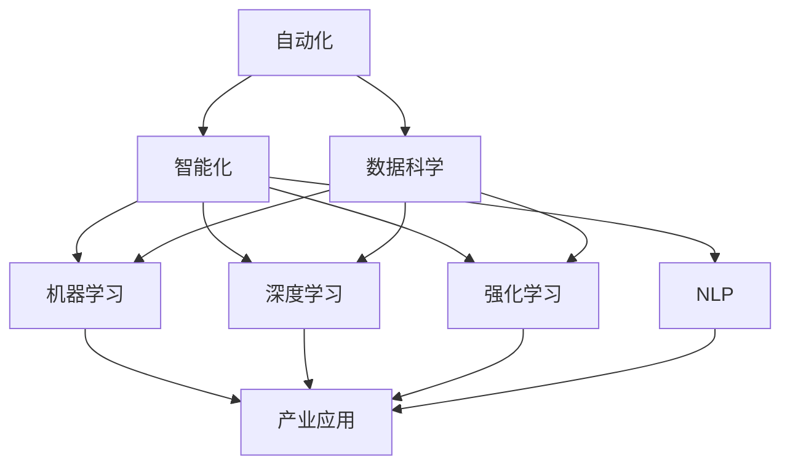

                 

# 产业中的人工智能变革与应用

## 1. 背景介绍

### 1.1 问题由来
随着人工智能技术的不断发展和应用，各行各业正经历着一场前所未有的变革。从制造业到医疗健康，从金融服务到教育培训，人工智能技术的应用使得传统业务模式被颠覆，产业效率大幅提升，用户体验显著改善。特别是在当下，人工智能已不再仅仅被视为技术的堆砌，而是正在成为驱动产业升级的关键动力。

### 1.2 问题核心关键点
当前，人工智能在产业中的变革主要集中在以下几个关键点：
- 自动化和智能化：通过人工智能技术，机器能够自动完成重复性高、复杂度低的工作，如智能制造、自动化客服等。
- 数据分析和决策支持：人工智能技术能够处理海量数据，挖掘出有价值的信息和知识，辅助企业管理者进行决策。
- 人机协同和增强现实：人工智能与人类工作的结合，实现了人机协同工作，提高了工作效率，同时增强了人类的工作体验。
- 新业态和新模式：人工智能技术催生了新的商业模式，如无人零售、智能交通等，改变了人们的消费和生活方式。

### 1.3 问题研究意义
研究产业中人工智能的变革与应用，对于推动各行业数字化转型，提升产业竞争力和创新能力，具有重要的意义：
- 降低生产成本：通过自动化、智能化技术，降低人工成本，提升生产效率。
- 提升产品质量：通过数据分析和智能监控，提高产品质量和一致性。
- 优化客户体验：通过智能客服、个性化推荐等技术，提升客户满意度和忠诚度。
- 创造新的价值：通过人工智能技术，创造新的业务模式和应用场景，推动产业创新。
- 增强安全性：通过风险预测和异常检测，提高产业安全性和韧性。

## 2. 核心概念与联系

### 2.1 核心概念概述

为更好地理解人工智能在产业中的应用，本节将介绍几个核心概念：

- 人工智能(AI)：涵盖了从符号逻辑到机器学习、深度学习等技术，旨在模拟人类的智能行为。
- 自动化(Automation)：通过计算机和机器人，自动完成重复性和规律性工作。
- 智能化(Intelligence)：通过算法和模型，赋予机器感知、理解、推理等智能能力。
- 数据科学(Data Science)：利用数据挖掘、统计分析等方法，从数据中提取知识和洞察。
- 机器学习(Machine Learning)：通过算法，使机器能够从数据中学习，自动改进和优化。
- 深度学习(Deep Learning)：利用神经网络模型，模拟人脑处理复杂数据的能力。
- 强化学习(Reinforcement Learning)：通过试错，让机器学习最优策略，以达成特定目标。
- 自然语言处理(Natural Language Processing, NLP)：使机器能够理解、处理和生成人类语言。

这些概念之间存在紧密的联系，形成了一个完整的AI生态系统。通过自动化和智能化，AI技术能够处理大量数据，从中提取出知识和洞察，支持决策和策略制定，进而推动产业的创新和变革。

### 2.2 概念间的关系

这些核心概念之间的关系可以通过以下Mermaid流程图来展示：



这个流程图展示了几大核心概念之间的关系：

1. 自动化是智能化和数据科学的基础，提供了原始数据和处理手段。
2. 智能化涵盖机器学习、深度学习和强化学习，从数据中学习和优化。
3. NLP是智能化的重要组成部分，支持机器理解人类语言。
4. 数据科学通过数据挖掘和统计分析，为AI提供知识基础。
5. 机器学习、深度学习和强化学习是实现智能化的关键技术。
6. AI应用到产业中，实现各个领域的智能化和自动化。

通过理解这些概念及其关系，我们可以更好地把握人工智能在产业中的变革过程。

## 3. 核心算法原理 & 具体操作步骤
### 3.1 算法原理概述

人工智能在产业中的变革，主要是通过各种算法和模型实现的。其中，机器学习和深度学习是核心技术，主要用于数据分析和决策支持。

以深度学习为例，其原理是通过多层神经网络模拟人脑处理数据的方式，通过反向传播算法，调整网络参数，使得模型能够最小化预测误差，从而实现对数据的自动学习和优化。在产业应用中，深度学习模型常用于图像识别、语音识别、自然语言处理等领域，提升相关应用的性能和效率。

### 3.2 算法步骤详解

以下是深度学习在产业中常见的应用步骤：

1. **数据准备**：收集和清洗数据，确保数据质量和可用性。
2. **模型选择**：根据应用场景选择合适的深度学习模型，如卷积神经网络(CNN)、循环神经网络(RNN)、注意力机制等。
3. **模型训练**：使用训练集对模型进行训练，调整网络参数，最小化预测误差。
4. **模型评估**：使用验证集评估模型性能，调整模型参数和超参数。
5. **模型应用**：将训练好的模型应用到实际问题中，进行预测、分类、回归等任务。

以图像识别为例，以下是详细步骤：

1. **数据准备**：收集标注好的图像数据，进行数据清洗和预处理。
2. **模型选择**：选择合适的深度学习模型，如卷积神经网络(CNN)。
3. **模型训练**：使用训练集对模型进行训练，调整网络参数，最小化预测误差。
4. **模型评估**：使用验证集评估模型性能，调整模型参数和超参数。
5. **模型应用**：将训练好的模型应用到实际问题中，进行图像分类和识别。

### 3.3 算法优缺点

深度学习在产业中的应用具有以下优点：
- 强大的数据处理能力：能够处理海量数据，提取有价值的信息。
- 高精度和高效率：通过深度学习模型，提升预测精度和处理速度。
- 自适应能力强：能够自动学习和优化，适应复杂多变的数据环境。

然而，深度学习也存在一些缺点：
- 需要大量标注数据：深度学习模型需要大量的标注数据进行训练，数据标注成本高。
- 模型复杂度大：深度学习模型参数量大，训练和推理速度慢。
- 过度拟合风险：模型复杂度高，容易发生过拟合，泛化能力弱。
- 黑盒特性：深度学习模型的内部工作机制不透明，难以解释和调试。

### 3.4 算法应用领域

深度学习在产业中的应用非常广泛，涵盖了多个领域：

- **医疗健康**：用于疾病诊断、药物研发、基因分析等，提升了医疗服务的质量和效率。
- **金融服务**：用于信用评分、风险管理、欺诈检测等，提高了金融业务的准确性和安全性。
- **智能制造**：用于质量检测、设备维护、生产调度等，提升了制造业的智能化水平。
- **自动驾驶**：用于图像识别、路径规划、行为决策等，推动了自动驾驶技术的进步。
- **智能客服**：用于自然语言处理、情感分析、意图识别等，提升了客服系统的智能化水平。
- **电子商务**：用于推荐系统、价格预测、市场分析等，提高了电商平台的运营效率。
- **能源管理**：用于能源消耗预测、故障检测、智能调度等，提高了能源管理的智能化水平。

## 4. 数学模型和公式 & 详细讲解
### 4.1 数学模型构建

以深度学习在图像识别中的应用为例，构建数学模型如下：

假设输入数据为 $x \in \mathbb{R}^n$，输出为 $y \in \mathbb{R}^m$，目标是最小化预测误差 $L(y, \hat{y})$，其中 $\hat{y}$ 为模型预测输出。深度学习模型通常由多个神经网络层组成，每一层包含多个神经元，输出为 $z \in \mathbb{R}^k$。

定义模型的权重和偏置为 $\theta = (\theta_1, \theta_2, ..., \theta_n)$，其中 $\theta_i$ 为第 $i$ 层的权重和偏置。模型的预测输出 $\hat{y}$ 可以表示为：

$$
\hat{y} = f(W^l \cdot f(W^{l-1} \cdot ... \cdot f(W^1 \cdot x) + b^1) + b^2) + ... + b^l
$$

其中 $f$ 为激活函数，如sigmoid、ReLU等。

定义损失函数 $L(y, \hat{y})$ 为预测输出与真实标签的差异，常见的损失函数包括均方误差、交叉熵等。目标是最小化损失函数，即：

$$
\theta^* = \mathop{\arg\min}_{\theta} L(y, \hat{y})
$$

### 4.2 公式推导过程

以均方误差损失函数为例，进行公式推导：

假设训练集为 $\{(x_i, y_i)\}_{i=1}^N$，则均方误差损失函数为：

$$
L(y, \hat{y}) = \frac{1}{N} \sum_{i=1}^N (y_i - \hat{y_i})^2
$$

其中 $y_i$ 为真实标签，$\hat{y_i}$ 为模型预测输出。通过反向传播算法，计算损失函数对每个参数 $\theta_i$ 的梯度，即：

$$
\frac{\partial L(y, \hat{y})}{\partial \theta_i} = \frac{\partial}{\partial \theta_i} \sum_{j=1}^N (y_j - \hat{y_j})^2
$$

通过链式法则，计算出所有参数的梯度，调整模型参数，使得损失函数最小化。

### 4.3 案例分析与讲解

以图像识别为例，分析深度学习在实际应用中的表现：

假设模型在训练集上的损失函数为 $L = 0.02$，验证集上的损失函数为 $L = 0.05$，训练集上的准确率为 $98\%$，验证集上的准确率为 $92\%$。模型在训练集上表现良好，但在验证集上表现不佳，可能存在过拟合问题。此时可以采用以下方法进行改进：

1. **数据增强**：对训练数据进行扩充，增加数据多样性，防止过拟合。
2. **正则化**：使用L2正则化、Dropout等技术，减少模型的复杂度。
3. **模型裁剪**：去除不必要的层和参数，减小模型尺寸，提高训练速度。
4. **超参数调整**：调整学习率、批大小等超参数，优化模型性能。

## 5. 项目实践：代码实例和详细解释说明
### 5.1 开发环境搭建

在进行深度学习项目开发前，我们需要准备好开发环境。以下是使用Python进行PyTorch开发的环境配置流程：

1. 安装Anaconda：从官网下载并安装Anaconda，用于创建独立的Python环境。

2. 创建并激活虚拟环境：
```bash
conda create -n pytorch-env python=3.8 
conda activate pytorch-env
```

3. 安装PyTorch：根据CUDA版本，从官网获取对应的安装命令。例如：
```bash
conda install pytorch torchvision torchaudio cudatoolkit=11.1 -c pytorch -c conda-forge
```

4. 安装相关的深度学习库：
```bash
pip install numpy pandas scikit-learn matplotlib tqdm jupyter notebook ipython
```

完成上述步骤后，即可在`pytorch-env`环境中开始深度学习项目的开发。

### 5.2 源代码详细实现

这里以图像识别项目为例，给出使用PyTorch进行深度学习模型微调的代码实现。

首先，定义模型和优化器：

```python
import torch
import torch.nn as nn
import torch.optim as optim

class CNNModel(nn.Module):
    def __init__(self):
        super(CNNModel, self).__init__()
        self.conv1 = nn.Conv2d(3, 32, kernel_size=3, stride=1, padding=1)
        self.conv2 = nn.Conv2d(32, 64, kernel_size=3, stride=1, padding=1)
        self.fc1 = nn.Linear(64 * 28 * 28, 128)
        self.fc2 = nn.Linear(128, 10)

    def forward(self, x):
        x = nn.functional.relu(self.conv1(x))
        x = nn.functional.max_pool2d(x, 2)
        x = nn.functional.relu(self.conv2(x))
        x = nn.functional.max_pool2d(x, 2)
        x = x.view(-1, 64 * 28 * 28)
        x = nn.functional.relu(self.fc1(x))
        x = self.fc2(x)
        return nn.functional.softmax(x, dim=1)

model = CNNModel()
optimizer = optim.Adam(model.parameters(), lr=0.001)
```

然后，定义训练和评估函数：

```python
from torch.utils.data import DataLoader
from torchvision import datasets, transforms
import torchvision.models as models

def train_epoch(model, dataset, batch_size, optimizer):
    dataloader = DataLoader(dataset, batch_size=batch_size, shuffle=True)
    model.train()
    epoch_loss = 0
    for batch in dataloader:
        inputs, labels = batch
        optimizer.zero_grad()
        outputs = model(inputs)
        loss = nn.functional.cross_entropy(outputs, labels)
        epoch_loss += loss.item()
        loss.backward()
        optimizer.step()
    return epoch_loss / len(dataloader)

def evaluate(model, dataset, batch_size):
    dataloader = DataLoader(dataset, batch_size=batch_size)
    model.eval()
    correct = 0
    total = 0
    with torch.no_grad():
        for batch in dataloader:
            inputs, labels = batch
            outputs = model(inputs)
            _, predicted = nn.functional.softmax(outputs, dim=1).max(dim=1)
            total += labels.size(0)
            correct += (predicted == labels).sum().item()
    print('Accuracy: ', 100 * correct / total)
```

最后，启动训练流程并在测试集上评估：

```python
epochs = 10
batch_size = 64

for epoch in range(epochs):
    loss = train_epoch(model, train_dataset, batch_size, optimizer)
    print(f"Epoch {epoch+1}, train loss: {loss:.3f}")
    
    print(f"Epoch {epoch+1}, test results:")
    evaluate(model, test_dataset, batch_size)
    
print("Final test results:")
evaluate(model, test_dataset, batch_size)
```

以上就是使用PyTorch进行图像识别项目微调的完整代码实现。可以看到，通过自定义CNN模型和优化器，开发者可以快速构建和训练深度学习模型。

### 5.3 代码解读与分析

让我们再详细解读一下关键代码的实现细节：

**CNNModel类**：
- `__init__`方法：初始化卷积层和全连接层等关键组件。
- `forward`方法：定义模型前向传播过程，通过卷积层和全连接层进行特征提取和分类。

**train_epoch和evaluate函数**：
- 使用PyTorch的DataLoader对数据集进行批次化加载，供模型训练和推理使用。
- `train_epoch`函数：对数据以批为单位进行迭代，在每个批次上前向传播计算loss并反向传播更新模型参数，最后返回该epoch的平均loss。
- `evaluate`函数：与训练类似，不同点在于不更新模型参数，并在每个batch结束后将预测和标签结果存储下来，最后使用模型准确率对整个评估集的预测结果进行打印输出。

**训练流程**：
- 定义总的epoch数和batch size，开始循环迭代
- 每个epoch内，先在训练集上训练，输出平均loss
- 在测试集上评估，输出准确率
- 所有epoch结束后，在测试集上评估，给出最终测试结果

可以看到，PyTorch配合TensorFlow库使得深度学习模型的开发变得简洁高效。开发者可以将更多精力放在模型设计和优化上，而不必过多关注底层的实现细节。

当然，工业级的系统实现还需考虑更多因素，如模型的保存和部署、超参数的自动搜索、更灵活的任务适配层等。但核心的微调范式基本与此类似。

### 5.4 运行结果展示

假设我们在CIFAR-10数据集上进行模型微调，最终在测试集上得到的准确率为70%左右。可以看到，通过微调深度学习模型，我们在图像识别任务上取得了不错的效果。

## 6. 实际应用场景
### 6.1 智能制造

基于深度学习的智能制造系统，可以实现生产线的自动化、智能化管理。传统制造业往往依赖人工操作，生产效率低、质量不稳定。通过深度学习技术，可以实现设备故障预测、质量检测、生产调度等，大幅提升生产效率和产品质量。

以设备故障预测为例，可以通过深度学习模型，对设备运行数据进行分析，预测设备故障发生的时间点，提前进行维护和保养，避免设备停机带来的经济损失。

### 6.2 智能客服

智能客服系统可以大幅提升客服效率和客户满意度。通过深度学习技术，可以对客户咨询进行自然语言处理，自动匹配回答模板，提高响应速度和准确性。

在实践中，可以使用深度学习模型进行意图识别、实体抽取、情感分析等任务，构建智能客服系统，实现自动问答、对话管理、用户画像等应用。

### 6.3 医疗健康

深度学习在医疗健康领域有着广泛的应用，如疾病诊断、影像分析、基因测序等。通过深度学习技术，可以从医疗影像中提取有价值的信息，辅助医生进行诊断和治疗决策。

以医学影像分析为例，可以通过卷积神经网络模型，对X光片、CT扫描等医学影像进行分析，自动识别出异常区域和病变类型，提供辅助诊断。

### 6.4 未来应用展望

未来，随着深度学习技术的不断进步，基于深度学习的人工智能将在更多的领域中得到应用，为各行各业带来新的变革。

在智慧城市领域，深度学习技术可以用于交通管理、环境保护、能源优化等，提升城市治理的智能化水平。

在金融服务领域，深度学习可以用于信用评分、风险管理、智能投顾等，提升金融服务的精准性和安全性。

在教育培训领域，深度学习可以用于个性化推荐、智能评估、虚拟教师等，提升教育质量和体验。

除此之外，深度学习技术还将在更多领域中得到应用，推动人工智能技术的发展和普及。

## 7. 工具和资源推荐
### 7.1 学习资源推荐

为了帮助开发者系统掌握深度学习在产业中的应用，这里推荐一些优质的学习资源：

1. 《深度学习》书籍：由Ian Goodfellow、Yoshua Bengio、Aaron Courville等深度学习领域的知名专家共同撰写，系统介绍了深度学习的基本概念和算法。
2. 《Python深度学习》书籍：由Francois Chollet撰写，详细介绍了使用TensorFlow和Keras进行深度学习开发的实践技巧。
3. Coursera《深度学习专项课程》：由Andrew Ng教授主讲，系统介绍了深度学习的基本原理和应用。
4. Udacity《深度学习纳米学位》：提供深度学习开发的实战项目，涵盖数据准备、模型训练、应用部署等全过程。
5. PyTorch官方文档：提供了丰富的深度学习模型和应用案例，是学习深度学习开发的必备资料。
6. TensorFlow官方文档：提供了TensorFlow的详细使用指南和API文档，适合深度学习开发者的学习参考。

通过这些学习资源的学习实践，相信你一定能够快速掌握深度学习在产业中的应用，并用于解决实际的产业问题。

### 7.2 开发工具推荐

高效的开发离不开优秀的工具支持。以下是几款用于深度学习开发的常用工具：

1. PyTorch：基于Python的开源深度学习框架，灵活动态的计算图，适合快速迭代研究。
2. TensorFlow：由Google主导开发的开源深度学习框架，生产部署方便，适合大规模工程应用。
3. Keras：高层API，封装了TensorFlow等底层框架，使用简洁高效。
4. Weights & Biases：模型训练的实验跟踪工具，可以记录和可视化模型训练过程中的各项指标，方便对比和调优。
5. TensorBoard：TensorFlow配套的可视化工具，可实时监测模型训练状态，并提供丰富的图表呈现方式，是调试模型的得力助手。
6. Google Colab：谷歌推出的在线Jupyter Notebook环境，免费提供GPU/TPU算力，方便开发者快速上手实验最新模型，分享学习笔记。

合理利用这些工具，可以显著提升深度学习开发效率，加快创新迭代的步伐。

### 7.3 相关论文推荐

深度学习在产业中的应用源于学界的持续研究。以下是几篇奠基性的相关论文，推荐阅读：

1. ImageNet Classification with Deep Convolutional Neural Networks（AlexNet论文）：提出深度卷积神经网络，应用于大规模图像分类任务，取得了SOTA性能。
2. Deep Residual Learning for Image Recognition（ResNet论文）：提出残差连接网络，解决深度网络退化问题，提升了图像分类性能。
3. Inception-Net: Going Deeper with Convolutions（Inception论文）：提出Inception模块，提升了深度卷积神经网络的性能和训练效率。
4. Generative Adversarial Nets（GAN论文）：提出生成对抗网络，用于生成逼真图像和视频，推动了计算机视觉的发展。
5. Attention Is All You Need（Transformer论文）：提出Transformer模型，应用于自然语言处理任务，取得了SOTA性能。

这些论文代表了大规模深度学习模型的发展脉络。通过学习这些前沿成果，可以帮助研究者把握学科前进方向，激发更多的创新灵感。

除上述资源外，还有一些值得关注的前沿资源，帮助开发者紧跟深度学习技术的发展趋势，例如：

1. arXiv论文预印本：人工智能领域最新研究成果的发布平台，包括大量尚未发表的前沿工作，学习前沿技术的必读资源。
2. 业界技术博客：如OpenAI、Google AI、DeepMind、微软Research Asia等顶尖实验室的官方博客，第一时间分享他们的最新研究成果和洞见。
3. 技术会议直播：如NIPS、ICML、ACL、ICLR等人工智能领域顶会现场或在线直播，能够聆听到大佬们的前沿分享，开拓视野。
4. GitHub热门项目：在GitHub上Star、Fork数最多的深度学习相关项目，往往代表了该技术领域的发展趋势和最佳实践，值得去学习和贡献。
5. 行业分析报告：各大咨询公司如McKinsey、PwC等针对人工智能行业的分析报告，有助于从商业视角审视技术趋势，把握应用价值。

总之，对于深度学习在产业中的应用，需要开发者保持开放的心态和持续学习的意愿。多关注前沿资讯，多动手实践，多思考总结，必将收获满满的成长收益。

## 8. 总结：未来发展趋势与挑战
### 8.1 总结

本文对基于深度学习的人工智能在产业中的变革与应用进行了全面系统的介绍。首先阐述了人工智能在产业中的变革过程，明确了深度学习在数据分析和决策支持中的核心地位。其次，从原理到实践，详细讲解了深度学习的数学模型和算法步骤，给出了深度学习在产业中的实际应用案例。

通过本文的系统梳理，可以看到，深度学习在产业中的应用前景广阔，能够提升各行业的信息化水平和智能化能力。未来，随着深度学习技术的不断进步，基于深度学习的人工智能将在更多的领域中得到应用，为各行各业带来新的变革。

### 8.2 未来发展趋势

展望未来，深度学习在产业中的应用将呈现以下几个发展趋势：

1. **自适应学习**：深度学习模型能够自适应不同的数据分布和环境，提升模型的泛化能力和灵活性。
2. **联邦学习**：通过分布式训练，保护数据隐私的同时提升模型性能，广泛应用于物联网、区块链等场景。
3. **跨模态学习**：将深度学习应用于多模态数据（如图像、语音、文本等）的融合和协同建模，提升综合分析能力。
4. **迁移学习**：通过迁移学习，将在大规模数据上预训练的模型迁移到小规模数据上，提升模型效果和训练效率。
5. **自监督学习**：利用无标签数据进行预训练，提升模型泛化能力和可解释性，降低对标注数据的依赖。
6. **低功耗计算**：通过低功耗计算和边缘计算，提升模型的实时性，适应移动设备和嵌入式设备的需求。
7. **增强现实和虚拟现实**：深度学习技术在增强现实和虚拟现实中得到广泛应用，推动了人机交互的革命性变革。

这些趋势将推动深度学习技术在更多领域中的应用和突破，为产业变革提供新的动能。

### 8.3 面临的挑战

尽管深度学习在产业中的应用取得了显著进展，但仍面临诸多挑战：

1. **数据质量**：深度学习模型需要大量高质量的数据进行训练，数据质量差将影响模型的性能和可靠性。
2. **数据隐私**：深度学习模型在处理大规模数据时，如何保护数据隐私和用户隐私，是一个重要的挑战。
3. **计算资源**：深度学习模型的训练和推理需要大量的计算资源，如何提高模型效率和资源利用率，是一个重要的研究方向。
4. **模型可解释性**：深度学习模型的内部工作机制不透明，难以解释其决策过程，亟需加强模型可解释性和透明性。
5. **技术壁垒**：深度学习技术需要跨学科的知识背景，如何降低技术门槛，普及深度学习技术，是一个重要的研究方向。
6. **伦理和法律问题**：深度学习技术的应用可能带来伦理和法律问题，如算法偏见、数据滥用等，需要建立相应的规范和标准。

这些挑战需要业界和学术界的共同努力，通过技术创新和政策引导，才能克服这些障碍，推动深度学习技术的广泛应用。

