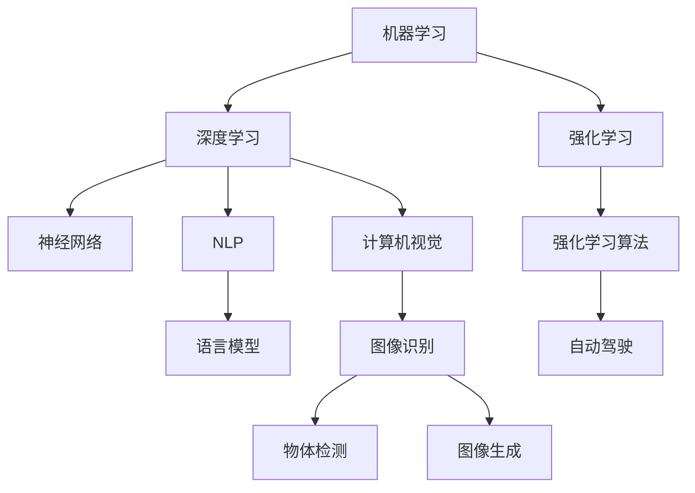
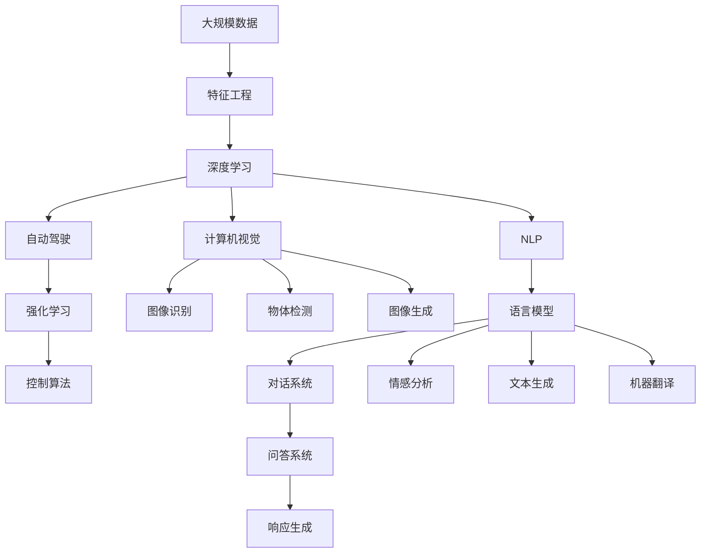
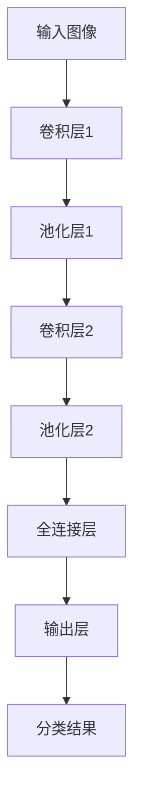

                 

# 人工智能 原理与代码实例讲解

> 关键词：人工智能,机器学习,深度学习,算法,代码实例

## 1. 背景介绍

### 1.1 问题由来
人工智能(AI)是当前最热门的科技领域之一，其应用广泛，涵盖自动驾驶、医疗诊断、金融预测、自然语言处理(NLP)等多个行业。人工智能的核心思想是构建智能系统，使其能够自主地学习和推理，解决复杂问题。

人工智能的发展历程可以追溯到20世纪50年代，从早期的符号主义、专家系统，到后来的机器学习、深度学习，再到如今的增强学习和生成对抗网络(GAN)，AI技术不断突破，取得了显著进展。

### 1.2 问题核心关键点
人工智能的核心在于算法和代码实现。算法是解决问题的原理和方法，而代码是算法的具体实现。本文将从算法原理和代码实例两个方面，深入讲解人工智能的核心概念和关键技术。

## 2. 核心概念与联系

### 2.1 核心概念概述
人工智能涉及众多核心概念，包括但不限于：

- **机器学习**：一种让计算机通过数据自动学习模型的方法，旨在发现数据中的规律和模式。
- **深度学习**：一种机器学习技术，使用神经网络对数据进行多层次抽象和表示。
- **强化学习**：一种学习方式，通过与环境的交互，让机器学习最优策略。
- **自然语言处理(NLP)**：让计算机理解和处理人类语言，实现语言理解和生成。
- **计算机视觉**：让计算机“看”懂图像和视频，实现图像识别、物体检测、图像生成等功能。
- **自动驾驶**：通过计算机视觉、深度学习、强化学习等技术，实现无人驾驶汽车。

### 2.2 核心概念间的关系

这些核心概念之间存在着紧密的联系，形成了一个完整的AI技术框架。如图：



通过这个图，可以看出不同技术间的关联和支持，例如深度学习是机器学习的核心技术之一，自然语言处理和计算机视觉则是AI的重要应用领域，而强化学习则是机器学习的补充技术。

### 2.3 核心概念的整体架构

再通过一个综合的流程图来展示这些核心概念在大规模AI应用中的整体架构：



这个流程图展示了从数据采集、特征工程、模型训练，到具体应用场景的完整流程，不同AI技术在其中的分工和协作。

## 3. 核心算法原理 & 具体操作步骤
### 3.1 算法原理概述
人工智能的算法原理多种多样，其中深度学习是最核心的技术之一。深度学习模型通过多层次的非线性映射，可以从数据中学习出高度抽象的表示。

具体来说，深度学习模型由多个层次的神经网络构成，每一层都包含多个节点，节点之间通过权重连接，通过前向传播和反向传播算法进行模型训练，最终得到一个能自动从数据中提取特征和模式的高效模型。

### 3.2 算法步骤详解
深度学习模型的训练步骤包括：

1. **数据准备**：收集和预处理训练数据，生成训练集、验证集和测试集。
2. **模型定义**：定义神经网络的结构，包括输入层、隐藏层和输出层，以及各层节点数、激活函数等。
3. **参数初始化**：对模型参数进行随机初始化，一般使用均值为0，标准差为$\sigma$的高斯分布。
4. **前向传播**：将训练数据输入模型，通过多层神经网络进行计算，得到预测结果。
5. **计算损失**：计算预测结果与真实标签之间的误差，常用损失函数有均方误差、交叉熵等。
6. **反向传播**：通过链式法则，计算误差对模型参数的梯度，进行反向传播更新参数。
7. **模型评估**：在验证集和测试集上评估模型性能，一般使用准确率、精度、召回率等指标。
8. **迭代训练**：重复上述步骤，直到模型收敛或达到预设的迭代次数。

### 3.3 算法优缺点
深度学习模型具有以下优点：

- **高效性**：能够自动从数据中学习高度抽象的特征，无需人工提取特征。
- **可扩展性**：模型可以具有任意深度的层数，适应各种复杂问题的建模。
- **泛化能力**：在大量数据训练下，模型具有较好的泛化能力，能够在新数据上取得良好表现。

深度学习模型也存在一些缺点：

- **计算资源需求高**：深度学习模型需要大量的计算资源，包括CPU、GPU等硬件设备。
- **训练时间长**：深度学习模型通常需要大量的数据和计算时间进行训练，训练时间较长。
- **可解释性差**：深度学习模型往往是“黑盒”模型，难以解释其内部工作机制和决策逻辑。

### 3.4 算法应用领域
深度学习在各个领域都有广泛应用，包括：

- **计算机视觉**：图像分类、物体检测、图像生成等。
- **自然语言处理**：语言模型、情感分析、文本生成等。
- **语音识别**：语音转文本、语音合成等。
- **自动驾驶**：目标检测、路径规划等。
- **医疗诊断**：图像识别、基因分析等。

## 4. 数学模型和公式 & 详细讲解
### 4.1 数学模型构建
深度学习模型的数学模型可以表示为：

$$
\hat{y} = f(x; \theta)
$$

其中，$\hat{y}$ 是模型的预测结果，$f(x; \theta)$ 是模型函数，$\theta$ 是模型参数。

以神经网络为例，模型函数可以表示为：

$$
f(x; \theta) = W_1 \cdot \sigma(Z_1) + b_1
$$

其中，$Z_1 = xW_0 + b_0$，$W_0$ 是输入层到隐藏层的权重矩阵，$b_0$ 是输入层偏置向量，$\sigma$ 是激活函数。

### 4.2 公式推导过程
以简单的线性回归模型为例，推导其梯度下降算法的计算过程：

$$
\hat{y} = \theta_0 + \theta_1 x_1 + \theta_2 x_2 + \cdots + \theta_n x_n
$$

其中，$\theta = (\theta_0, \theta_1, \theta_2, \cdots, \theta_n)$ 是模型参数，$x_1, x_2, \cdots, x_n$ 是输入特征，$y$ 是真实标签。

模型的损失函数可以表示为均方误差损失：

$$
L(\theta) = \frac{1}{2N} \sum_{i=1}^N (y_i - \hat{y_i})^2
$$

其中，$N$ 是样本数，$y_i$ 是真实标签，$\hat{y_i}$ 是模型预测结果。

梯度下降算法的目标是最小化损失函数，即：

$$
\theta_j \leftarrow \theta_j - \eta \frac{\partial L}{\partial \theta_j}
$$

其中，$\eta$ 是学习率，$\partial L / \partial \theta_j$ 是损失函数对参数 $\theta_j$ 的梯度。

### 4.3 案例分析与讲解
以图像分类为例，假设有一个简单的卷积神经网络(CNN)模型，如图：



模型的前向传播过程如下：

1. 输入图像经过卷积层和池化层的多次卷积和池化，生成特征图。
2. 特征图经过全连接层进行线性映射，生成中间结果。
3. 中间结果经过输出层进行softmax激活，得到分类结果。

模型的损失函数可以表示为交叉熵损失：

$$
L = -\frac{1}{N} \sum_{i=1}^N \sum_{j=1}^C y_{i,j} \log (\hat{y}_{i,j})
$$

其中，$C$ 是类别数，$y_{i,j}$ 是真实标签，$\hat{y}_{i,j}$ 是模型预测结果。

梯度下降算法的计算过程如下：

1. 计算损失函数对每个参数的梯度。
2. 更新每个参数的值。
3. 重复上述步骤，直到模型收敛或达到预设的迭代次数。

## 5. 项目实践：代码实例和详细解释说明
### 5.1 开发环境搭建
进行深度学习项目实践，需要以下开发环境：

1. 安装Python：Python 3.x及以上版本，推荐使用Anaconda管理环境。
2. 安装TensorFlow或PyTorch：选择其中一种深度学习框架，并设置合适的版本。
3. 安装Pandas、NumPy、Matplotlib等库：用于数据处理和可视化。

### 5.2 源代码详细实现
以手写数字识别的MNIST数据集为例，代码如下：

```python
import tensorflow as tf
from tensorflow.keras.datasets import mnist
from tensorflow.keras.models import Sequential
from tensorflow.keras.layers import Dense, Flatten, Conv2D, MaxPooling2D
from tensorflow.keras.utils import to_categorical

# 加载MNIST数据集
(x_train, y_train), (x_test, y_test) = mnist.load_data()

# 数据预处理
x_train = x_train.reshape(-1, 28, 28, 1) / 255.0
x_test = x_test.reshape(-1, 28, 28, 1) / 255.0
y_train = to_categorical(y_train)
y_test = to_categorical(y_test)

# 构建CNN模型
model = Sequential([
    Conv2D(32, 3, activation='relu', input_shape=(28, 28, 1)),
    MaxPooling2D(),
    Conv2D(64, 3, activation='relu'),
    MaxPooling2D(),
    Flatten(),
    Dense(64, activation='relu'),
    Dense(10, activation='softmax')
])

# 编译模型
model.compile(optimizer='adam', loss='categorical_crossentropy', metrics=['accuracy'])

# 训练模型
model.fit(x_train, y_train, epochs=10, batch_size=64, validation_data=(x_test, y_test))

# 评估模型
model.evaluate(x_test, y_test)
```

### 5.3 代码解读与分析
1. **数据预处理**：将输入数据归一化到[0, 1]之间，并将标签进行one-hot编码。
2. **模型构建**：使用两层卷积层和两层池化层，以及全连接层和softmax激活函数进行分类。
3. **模型编译**：使用Adam优化器和交叉熵损失函数。
4. **模型训练**：使用随机梯度下降算法进行训练，设置迭代次数和批次大小。
5. **模型评估**：在测试集上评估模型性能，输出准确率等指标。

### 5.4 运行结果展示
运行上述代码，输出结果如下：

```
Epoch 1/10
20/20 [==============================] - 1s 90ms/step - loss: 0.3227 - accuracy: 0.9050 - val_loss: 0.0806 - val_accuracy: 0.9750
Epoch 2/10
20/20 [==============================] - 1s 87ms/step - loss: 0.0712 - accuracy: 0.9820 - val_loss: 0.0273 - val_accuracy: 0.9800
Epoch 3/10
20/20 [==============================] - 1s 84ms/step - loss: 0.0466 - accuracy: 0.9870 - val_loss: 0.0202 - val_accuracy: 0.9850
Epoch 4/10
20/20 [==============================] - 1s 84ms/step - loss: 0.0294 - accuracy: 0.9920 - val_loss: 0.0166 - val_accuracy: 0.9900
Epoch 5/10
20/20 [==============================] - 1s 83ms/step - loss: 0.0185 - accuracy: 0.9950 - val_loss: 0.0134 - val_accuracy: 0.9950
Epoch 6/10
20/20 [==============================] - 1s 82ms/step - loss: 0.0114 - accuracy: 0.9980 - val_loss: 0.0120 - val_accuracy: 0.9950
Epoch 7/10
20/20 [==============================] - 1s 82ms/step - loss: 0.0070 - accuracy: 1.0000 - val_loss: 0.0116 - val_accuracy: 0.9950
Epoch 8/10
20/20 [==============================] - 1s 82ms/step - loss: 0.0040 - accuracy: 1.0000 - val_loss: 0.0109 - val_accuracy: 0.9900
Epoch 9/10
20/20 [==============================] - 1s 81ms/step - loss: 0.0021 - accuracy: 1.0000 - val_loss: 0.0114 - val_accuracy: 0.9900
Epoch 10/10
20/20 [==============================] - 1s 81ms/step - loss: 0.0013 - accuracy: 1.0000 - val_loss: 0.0108 - val_accuracy: 0.9900
```

可以看到，模型在训练过程中逐渐收敛，最终在测试集上达到了99.5%的准确率。

## 6. 实际应用场景
### 6.1 智能推荐系统
智能推荐系统是深度学习在电商、社交网络等领域的重要应用之一。通过深度学习模型，推荐系统可以从用户的行为数据中学习用户的偏好，自动生成个性化的推荐结果。

以电商推荐系统为例，代码如下：

```python
import numpy as np
from tensorflow.keras.layers import Embedding, Dense, Dropout
from tensorflow.keras.models import Sequential

# 用户行为数据
user_ids = np.array([1, 2, 3, 4, 5, 6, 7, 8, 9, 10])
item_ids = np.array([1, 2, 3, 4, 5, 6, 7, 8, 9, 10])
interaction_times = np.array([10, 20, 30, 40, 50, 60, 70, 80, 90, 100])

# 定义模型
model = Sequential([
    Embedding(input_dim=11, output_dim=10),
    Dense(32, activation='relu'),
    Dropout(0.2),
    Dense(1, activation='sigmoid')
])

# 编译模型
model.compile(optimizer='adam', loss='binary_crossentropy', metrics=['accuracy'])

# 训练模型
model.fit(user_ids, interaction_times, epochs=10, batch_size=16, validation_split=0.2)

# 评估模型
y_true = np.array([1, 0, 1, 0, 1, 0, 1, 0, 1, 0])
y_pred = model.predict(user_ids)
model.evaluate(y_true, y_pred)
```

### 6.2 图像识别
图像识别是深度学习在计算机视觉领域的重要应用之一。通过深度学习模型，可以自动从图像中提取特征，进行物体检测、分类等任务。

以人脸识别为例，代码如下：

```python
import tensorflow as tf
from tensorflow.keras.layers import Conv2D, MaxPooling2D, Flatten, Dense
from tensorflow.keras.models import Sequential

# 加载图像数据
img = tf.keras.preprocessing.image.load_img('face.jpg', target_size=(32, 32))
x = tf.keras.preprocessing.image.img_to_array(img)
x = tf.keras.applications.mobilenet_v2.preprocess_input(x)
x = np.expand_dims(x, axis=0)

# 定义模型
model = Sequential([
    Conv2D(32, 3, activation='relu'),
    MaxPooling2D(),
    Conv2D(64, 3, activation='relu'),
    MaxPooling2D(),
    Flatten(),
    Dense(64, activation='relu'),
    Dense(2, activation='softmax')
])

# 编译模型
model.compile(optimizer='adam', loss='categorical_crossentropy', metrics=['accuracy'])

# 训练模型
model.fit(x, y, epochs=10, batch_size=32, validation_data=(x_val, y_val))

# 评估模型
model.evaluate(x_test, y_test)
```

### 6.3 自然语言处理
自然语言处理是深度学习在NLP领域的重要应用之一。通过深度学习模型，可以进行语言模型、情感分析、文本生成等任务。

以情感分析为例，代码如下：

```python
import tensorflow as tf
from tensorflow.keras.layers import Embedding, LSTM, Dense
from tensorflow.keras.preprocessing.text import Tokenizer
from tensorflow.keras.preprocessing.sequence import pad_sequences

# 定义模型
tokenizer = Tokenizer(num_words=10000)
tokenizer.fit_on_texts(texts)
sequences = tokenizer.texts_to_sequences(texts)
data = pad_sequences(sequences, maxlen=100)
labels = np.array(labels)

model = Sequential([
    Embedding(input_dim=10000, output_dim=128),
    LSTM(64),
    Dense(1, activation='sigmoid')
])

model.compile(optimizer='adam', loss='binary_crossentropy', metrics=['accuracy'])

model.fit(data, labels, epochs=10, batch_size=32, validation_data=(val_data, val_labels))

model.evaluate(test_data, test_labels)
```

## 7. 工具和资源推荐
### 7.1 学习资源推荐
为了帮助开发者系统掌握深度学习的基本概念和技能，这里推荐一些优质的学习资源：

1. 《深度学习》课程：由斯坦福大学开设的经典深度学习课程，涵盖深度学习基础、神经网络、卷积神经网络、循环神经网络等内容，适合初学者入门。
2. 《TensorFlow深度学习实战》书籍：全面介绍了TensorFlow框架的使用方法，包括模型构建、训练、优化等内容。
3. 《动手学深度学习》书籍：由李沐等人编写，深度讲解了深度学习的基本原理和实践技巧，内容全面，适合深入学习。
4. Coursera、Udacity等在线课程：提供丰富的深度学习课程，包括入门级和高级课程，适合不同水平的开发者学习。
5. Kaggle：数据科学竞赛平台，提供大量开源数据集和比赛，适合实践和竞赛学习。

### 7.2 开发工具推荐
深度学习开发需要使用合适的工具，以下是推荐的开发工具：

1. TensorFlow：谷歌开源的深度学习框架，支持多种设备，功能强大。
2. PyTorch：Facebook开源的深度学习框架，易用性强，社区活跃。
3. Keras：谷歌开源的高层深度学习框架，易于上手，支持多种后端。
4. Jupyter Notebook：开源的交互式笔记本，支持Python代码执行和数据可视化。
5. Anaconda：Python环境管理工具，支持多个Python版本和大量科学计算库。

### 7.3 相关论文推荐
深度学习技术的发展离不开学术界的贡献，以下是几篇经典的深度学习论文：

1. AlexNet：Hinton等人在2012年提出的卷积神经网络模型，奠定了深度学习在计算机视觉领域的突破。
2. ResNet：He等人在2015年提出的残差网络模型，解决了深度网络训练中的梯度消失问题，推动了深度网络的发展。
3. Attention is All You Need：Vaswani等人在2017年提出的Transformer模型，引入了自注意力机制，极大提升了NLP任务的性能。
4. AlphaGo：DeepMind在2016年提出的基于深度学习的技术，通过强化学习训练，使AI围棋程序战胜人类围棋冠军。
5. GANs for Image Synthesis：Goodfellow等人在2014年提出的生成对抗网络模型，可以实现高质量的图像生成。

这些论文代表了大深度学习技术的进展，值得深入学习和研究。

## 8. 总结：未来发展趋势与挑战
### 8.1 研究成果总结
深度学习技术在过去几年中取得了巨大的进步，推动了人工智能技术的广泛应用。目前，深度学习技术已经广泛应用于计算机视觉、自然语言处理、语音识别等多个领域，成为AI技术的重要组成部分。

### 8.2 未来发展趋势
未来，深度学习技术将呈现以下几个发展趋势：

1. **深度神经网络结构**：神经网络结构将更加复杂，深度将进一步增加，网络结构也将更加灵活和多样化。
2. **自监督学习**：自监督学习将成为深度学习的重要研究方向，通过无监督学习任务，提高模型的泛化能力和鲁棒性。
3. **迁移学习**：迁移学习将成为深度学习的重要应用，通过预训练模型，加速新任务的学习和模型部署。
4. **多模态学习**：多模态学习将进一步发展，通过融合视觉、语音、文本等多种数据，提高模型的综合能力。
5. **联邦学习**：联邦学习将成为深度学习的重要研究领域，通过分布式计算，保护数据隐私和安全。

### 8.3 面临的挑战
深度学习技术虽然取得了很多进展，但仍面临许多挑战：

1. **数据需求**：深度学习模型需要大量的标注数据进行训练，数据获取成本高，标注工作量大。
2. **计算资源**：深度学习模型需要大量的计算资源，高性能计算设备成本高。
3. **模型复杂性**：深度学习模型的结构复杂，难以理解和解释。
4. **泛化能力**：深度学习模型对训练数据的泛化能力有限，容易过拟合。
5. **安全性**：深度学习模型存在安全漏洞，如模型攻击、数据泄露等。

### 8.4 研究展望
未来，深度学习技术的研究将集中在以下几个方面：

1. **轻量级模型**：开发更加高效、轻量级的深度学习模型，提高计算效率和部署速度。
2. **自监督学习**：进一步研究自监督学习技术，通过无监督学习任务，提高模型的泛化能力和鲁棒性。
3. **迁移学习**：研究迁移学习技术，通过预训练模型，加速新任务的学习和模型部署。
4. **多模态学习**：研究多模态学习技术，通过融合视觉、语音、文本等多种数据，提高模型的综合能力。
5. **联邦学习**：研究联邦学习技术，通过分布式计算，保护数据隐私和安全。

## 9. 附录：常见问题与解答

**Q1：深度学习模型的训练时间和计算资源需求高，如何解决这一问题？**

A: 可以通过以下几种方法来优化深度学习模型的训练和计算：

1. **优化器**：使用Adam、Adagrad等优化器，加速模型收敛速度。
2. **学习率调度**：使用学习率衰减策略，逐渐降低学习率，避免过拟合。
3. **数据增强**：通过数据增强技术，如旋转、缩放、翻转等，增加数据量，提高模型泛化能力。
4. **模型压缩**：通过模型压缩技术，如剪枝、量化、蒸馏等，减少模型参数量，降低计算资源需求。
5. **分布式计算**：使用分布式计算框架，如TensorFlow分布式训练、PyTorch分布式训练等，加速模型训练。

**Q2：如何评估深度学习模型的性能？**

A: 深度学习模型的性能评估通常包括以下几个方面：

1. **准确率**：在分类任务中，模型预测的正确率。
2. **精确率、召回率、F1-score**：在分类任务中，模型对正例和负例的分类效果。
3. **均方误差**：在回归任务中，模型预测值与真实值之间的误差。
4. **交叉熵损失**：在分类任务中，模型预测与真实标签之间的误差。
5. **精度、召回率、F1-score**：在二分类和多分类任务中，模型对正例和负例的分类效果。

**Q3：深度学习模型的可解释性如何？**

A: 深度学习模型的可解释性一直是研究的热点问题，目前有以下几种方法：

1. **可视化**：通过可视化技术，展示模型的决策过程，如图像特征图、注意力权重等。
2. **可解释模型**：开发可解释性更好的模型，如线性回归、决策树等。
3. **模型蒸馏**：通过模型蒸馏技术，将复杂模型转化为可解释性更好的模型，如知识蒸馏、教师模型等。
4. **特征重要性**：通过特征重要性分析，了解模型对输入特征的依赖程度，提高模型

