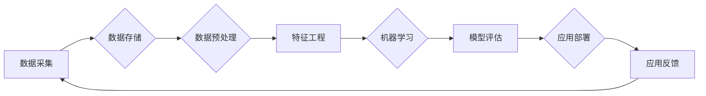

> 大数据，人工智能，机器学习，深度学习，数据科学，数据质量，数据治理，模型可解释性

# 大数据在AI中的重要性

在当今这个数据爆炸的时代，大数据成为了推动人工智能（AI）发展的关键驱动力。AI技术的进步，从图像识别、自然语言处理到推荐系统，都离不开海量数据的支持。本文将深入探讨大数据在AI中的重要性，从核心概念、算法原理、实际应用场景等多个角度进行分析，并展望未来发展趋势与挑战。

## 1. 背景介绍

### 1.1 数据时代的来临

随着互联网的普及和物联网技术的快速发展，我们正处在一个数据爆炸的时代。每天产生的数据量以惊人的速度增长，这些数据包含了人类活动的方方面面，从社交媒体到电子商务，从城市监控到科学研究，数据已经成为现代社会运行的重要基础设施。

### 1.2 人工智能的崛起

人工智能作为一门交叉学科，融合了计算机科学、数学、统计学、神经科学等多个领域。近年来，随着计算能力的提升和算法的突破，人工智能在各个领域都取得了显著的进展。而大数据则为人工智能提供了强大的数据支持，推动了AI技术的快速发展。

### 1.3 研究意义

深入理解大数据在AI中的重要性，有助于我们更好地认识AI技术的本质和应用价值。本文将探讨大数据如何影响AI的算法、模型、应用场景等方面，为AI技术的研发和应用提供有益的参考。

## 2. 核心概念与联系

### 2.1 核心概念

#### 大数据（Big Data）

大数据通常指的是规模巨大、类型多样、价值密度低的数据集合。大数据具有以下四个V特征：

- **Volume（体量）**：数据量巨大，往往是TB、PB甚至EB级别。
- **Velocity（速度）**：数据产生速度快，需要实时或近实时处理。
- **Variety（多样性）**：数据类型多样，包括结构化数据、半结构化数据和非结构化数据。
- **Value（价值）**：数据中蕴含的价值密度低，需要通过数据分析和挖掘来发现。

#### 人工智能（Artificial Intelligence，AI）

人工智能是指由人制造出来的系统能够模拟、延伸和扩展人的智能。人工智能技术主要包括机器学习、深度学习、知识工程、自然语言处理等领域。

### 2.2 Mermaid 流程图

以下是大数据在AI中的流程图，展示了大数据与AI之间的联系：



### 2.3 联系

大数据为AI提供了丰富的数据资源，是AI发展的基础。AI技术通过对大数据的分析和挖掘，提取有价值的信息，为各个领域提供智能化解决方案。

## 3. 核心算法原理 & 具体操作步骤

### 3.1 算法原理概述

AI算法主要包括以下几种：

- **监督学习（Supervised Learning）**：通过已标记的训练数据学习模型参数，用于预测未知数据的标签。
- **无监督学习（Unsupervised Learning）**：通过未标记的数据学习数据的结构和模式，如聚类、降维等。
- **半监督学习（Semi-supervised Learning）**：结合有标记和未标记数据学习模型参数。
- **强化学习（Reinforcement Learning）**：通过与环境交互，学习最优策略。

### 3.2 算法步骤详解

1. **数据采集**：收集来自各种来源的数据，如传感器、网络爬虫等。
2. **数据存储**：将数据存储在分布式文件系统或数据库中，以便进行后续处理。
3. **数据预处理**：清洗数据，去除噪声，进行数据转换和归一化等操作。
4. **特征工程**：从原始数据中提取有用的特征，为模型训练提供支持。
5. **模型训练**：使用机器学习算法训练模型，如线性回归、支持向量机、神经网络等。
6. **模型评估**：使用测试集评估模型的性能，如准确率、召回率、F1值等。
7. **应用部署**：将训练好的模型部署到生产环境中，用于实际应用。
8. **应用反馈**：收集实际应用中的反馈数据，用于模型优化和迭代。

### 3.3 算法优缺点

#### 监督学习

优点：

- 预测准确率高。
- 应用广泛。

缺点：

- 需要大量标注数据。
- 难以处理小样本问题。

#### 无监督学习

优点：

- 无需标注数据。
- 可以发现数据中的隐藏模式。

缺点：

- 难以评估模型性能。
- 结果难以解释。

#### 半监督学习

优点：

- 结合有标记和未标记数据，降低标注成本。

缺点：

- 需要大量的未标记数据。

#### 强化学习

优点：

- 能够学习复杂的决策策略。
- 适用于动态环境。

缺点：

- 训练过程可能非常耗时。

### 3.4 算法应用领域

AI算法在各个领域都有广泛的应用，如：

- **图像识别**：人脸识别、物体检测、图像分类等。
- **自然语言处理**：机器翻译、情感分析、问答系统等。
- **推荐系统**：电子商务推荐、音乐推荐等。
- **自动驾驶**：车辆识别、车道线检测等。
- **医疗诊断**：疾病预测、药物研发等。

## 4. 数学模型和公式 & 详细讲解 & 举例说明

### 4.1 数学模型构建

AI算法通常基于以下数学模型：

- **线性模型**：通过线性方程拟合数据。
- **支持向量机（SVM）**：通过找到最优的超平面来分离数据。
- **神经网络**：通过多层非线性变换模拟人脑神经网络。

### 4.2 公式推导过程

以线性回归为例，其公式推导过程如下：

$$
y = \beta_0 + \beta_1x_1 + \beta_2x_2 + ... + \beta_nx_n + \epsilon
$$

其中，$y$ 为输出变量，$x_i$ 为输入变量，$\beta_i$ 为模型参数，$\epsilon$ 为误差项。

### 4.3 案例分析与讲解

以房价预测为例，使用线性回归模型进行房价预测。

1. **数据采集**：收集房屋的面积、地段、朝向等特征以及对应的售价。
2. **数据预处理**：对数据进行清洗、归一化等操作。
3. **特征工程**：提取房屋特征，如面积、地段、朝向等。
4. **模型训练**：使用线性回归算法训练模型。
5. **模型评估**：使用测试集评估模型的性能。

## 5. 项目实践：代码实例和详细解释说明

### 5.1 开发环境搭建

1. 安装Python和相关库，如NumPy、SciPy、Matplotlib等。
2. 安装Jupyter Notebook，用于数据分析和模型训练。

### 5.2 源代码详细实现

```python
import numpy as np
from sklearn.linear_model import LinearRegression
from sklearn.model_selection import train_test_split

# 生成模拟数据
X = np.random.rand(100, 1) * 100
y = 50 + 3 * X + np.random.randn(100) * 5

# 划分训练集和测试集
X_train, X_test, y_train, y_test = train_test_split(X, y, test_size=0.2, random_state=42)

# 训练模型
model = LinearRegression()
model.fit(X_train, y_train)

# 评估模型
y_pred = model.predict(X_test)
print("R^2:", model.score(X_test, y_test))
```

### 5.3 代码解读与分析

- 首先，我们导入所需的库。
- 然后，生成模拟数据，包含100个样本，每个样本有一个输入特征和一个输出特征。
- 接着，我们将数据划分为训练集和测试集。
- 之后，我们使用线性回归算法训练模型。
- 最后，我们使用测试集评估模型的性能。

## 6. 实际应用场景

### 6.1 金融风控

在金融领域，大数据和AI技术可以用于风险评估、欺诈检测、信用评分等。

- **风险评估**：通过分析历史交易数据、用户行为数据等，评估借款人的信用风险。
- **欺诈检测**：识别可疑的交易行为，防止欺诈事件发生。
- **信用评分**：根据用户的信用历史和行为数据，预测其信用等级。

### 6.2 智能推荐

在电子商务、视频、音乐等领域，大数据和AI技术可以用于推荐系统。

- **商品推荐**：根据用户的购买历史、浏览记录等，推荐用户可能感兴趣的商品。
- **视频推荐**：根据用户的观看历史、偏好等，推荐用户可能喜欢的视频。
- **音乐推荐**：根据用户的听歌历史、偏好等，推荐用户可能喜欢的音乐。

### 6.3 智慧城市

在大数据平台和AI技术的支持下，智慧城市建设成为可能。

- **智能交通**：通过分析交通流量数据，优化交通信号灯控制，缓解交通拥堵。
- **环境监测**：通过监测空气质量、水质等数据，预警环境风险，保护生态环境。
- **公共安全**：通过视频监控数据分析，预防犯罪事件，保障公共安全。

## 7. 工具和资源推荐

### 7.1 学习资源推荐

- 《Python数据分析基础教程》
- 《机器学习实战》
- 《深度学习》
- 《数据科学入门》

### 7.2 开发工具推荐

- Jupyter Notebook
- NumPy
- SciPy
- Matplotlib
- Pandas
- Scikit-learn
- TensorFlow
- PyTorch

### 7.3 相关论文推荐

- 《The Hundred-Page Machine Learning Book》
- 《Deep Learning》
- 《Pattern Recognition and Machine Learning》
- 《Data Science from Scratch》

## 8. 总结：未来发展趋势与挑战

### 8.1 研究成果总结

大数据在AI中的应用已经取得了显著的成果，推动了各个领域的创新发展。然而，随着AI技术的不断进步，大数据在AI中的应用也面临着新的挑战。

### 8.2 未来发展趋势

- **数据质量和治理**：数据质量和治理将成为AI发展的关键，确保数据的准确性和可靠性。
- **模型可解释性**：提高模型的可解释性，使其决策过程更加透明，增强用户信任。
- **跨领域迁移学习**：发展跨领域迁移学习技术，降低数据收集成本。
- **可解释人工智能**：研究可解释人工智能技术，解释模型的决策过程。

### 8.3 面临的挑战

- **数据安全和隐私**：保护用户数据安全和隐私，防止数据泄露。
- **算法偏见和歧视**：消除算法偏见和歧视，确保AI的公平性。
- **技术伦理**：建立人工智能伦理规范，确保AI技术的健康发展。

### 8.4 研究展望

未来，大数据和AI技术将继续深度融合，推动各个领域的创新发展。在数据科学、机器学习、深度学习等领域，我们将见证更多突破性的研究成果和应用。

## 9. 附录：常见问题与解答

**Q1：大数据在AI中有什么作用？**

A：大数据为AI提供了丰富的数据资源，是AI发展的基础。通过分析大数据，可以挖掘有价值的信息，为各个领域提供智能化解决方案。

**Q2：如何保证数据质量？**

A：保证数据质量需要从数据采集、存储、处理、使用等多个环节进行控制。例如，使用数据清洗工具去除噪声，建立数据质量控制体系，加强数据安全防护等。

**Q3：如何消除算法偏见和歧视？**

A：消除算法偏见和歧视需要从数据收集、模型设计、模型评估等多个环节入手。例如，使用公平性指标评估模型，收集多元化数据，加强算法伦理研究等。

**Q4：大数据和AI技术有哪些应用场景？**

A：大数据和AI技术可以应用于金融、医疗、交通、教育、娱乐等多个领域，如风险评估、欺诈检测、智能推荐、智慧城市等。

**Q5：如何学习大数据和AI技术？**

A：学习大数据和AI技术可以从以下途径入手：
- 阅读相关书籍和论文。
- 参加线上或线下培训课程。
- 参与开源项目，实践项目经验。
- 关注业界动态，学习前沿技术。

作者：禅与计算机程序设计艺术 / Zen and the Art of Computer Programming