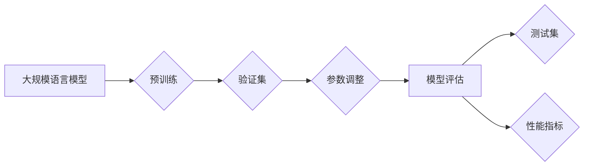

> 大规模语言模型, 模型评估, 性能指标, 评估方法, 验证集, 测试集, 预测准确性, 损失函数, F1 分数, 可解释性

# 大规模语言模型从理论到实践 模型评估概述

## 1. 背景介绍

随着深度学习技术的飞速发展，大规模语言模型（Large Language Models，LLMs）在自然语言处理（Natural Language Processing，NLP）领域取得了突破性的进展。这些模型能够理解和生成自然语言，并在各种NLP任务中取得优异的性能。然而，如何评估这些模型的性能，确保其准确性和可靠性，成为了至关重要的环节。本文将深入探讨大规模语言模型评估的理论与实践，从核心概念到具体操作，为读者提供全面而深入的指导。

## 2. 核心概念与联系

### 2.1 核心概念

#### 2.1.1 大规模语言模型

大规模语言模型是指通过在海量文本数据上预训练，能够理解和生成自然语言的深度学习模型。这些模型通常基于神经网络架构，如循环神经网络（RNN）、卷积神经网络（CNN）和 Transformer 等。

#### 2.1.2 模型评估

模型评估是指使用一组测试数据来评估模型的性能。评估指标包括准确率、召回率、F1 分数、损失函数等。

#### 2.1.3 验证集与测试集

验证集用于调整模型参数和选择模型架构，而测试集用于评估模型的最终性能。

#### 2.1.4 损失函数

损失函数用于衡量模型的预测结果与真实标签之间的差异。常见的损失函数包括交叉熵损失、均方误差损失等。

### 2.2 核心概念原理和架构的 Mermaid 流程图



## 3. 核心算法原理 & 具体操作步骤

### 3.1 算法原理概述

大规模语言模型评估的核心原理是通过测试数据集来衡量模型在特定任务上的性能。这包括计算预测准确性、评估模型的泛化能力以及识别模型的局限性。

### 3.2 算法步骤详解

#### 3.2.1 数据准备

1. 分割数据集：将数据集分为训练集、验证集和测试集。
2. 数据预处理：对数据进行清洗、去噪和格式化。

#### 3.2.2 模型训练

1. 选择模型架构：根据任务需求选择合适的模型架构。
2. 训练模型：使用训练集数据训练模型，并调整模型参数。

#### 3.2.3 验证集调整

1. 使用验证集评估模型性能。
2. 调整模型参数以优化性能。

#### 3.2.4 模型评估

1. 使用测试集评估模型的最终性能。
2. 计算性能指标。

### 3.3 算法优缺点

#### 3.3.1 优点

- 提供客观的性能度量。
- 帮助识别模型的局限性。
- 优化模型设计和参数。

#### 3.3.2 缺点

- 依赖高质量的测试数据。
- 可能受到测试数据分布的影响。
- 无法完全捕捉所有潜在的模型缺陷。

### 3.4 算法应用领域

模型评估在以下领域应用广泛：

- 自然语言处理
- 计算机视觉
- 语音识别
- 强化学习

## 4. 数学模型和公式 & 详细讲解 & 举例说明

### 4.1 数学模型构建

大规模语言模型评估的数学模型通常涉及以下公式：

#### 4.1.1 准确率

$$
\text{准确率} = \frac{\text{正确预测的样本数}}{\text{总样本数}}
$$

#### 4.1.2 召回率

$$
\text{召回率} = \frac{\text{正确预测的样本数}}{\text{实际正样本数}}
$$

#### 4.1.3 F1 分数

$$
\text{F1 分数} = 2 \times \frac{\text{准确率} \times \text{召回率}}{\text{准确率} + \text{召回率}}
$$

### 4.2 公式推导过程

这些公式的推导基于基本的概率论和统计学的原理。

### 4.3 案例分析与讲解

以一个简单的文本分类任务为例，假设我们有两个类别：正面和负面。使用上述公式计算准确率、召回率和 F1 分数。

## 5. 项目实践：代码实例和详细解释说明

### 5.1 开发环境搭建

确保您已经安装了 Python、PyTorch 和 Transformers 库。

### 5.2 源代码详细实现

```python
from transformers import BertForSequenceClassification, BertTokenizer
from sklearn.metrics import accuracy_score, precision_score, recall_score, f1_score

# 加载预训练模型和分词器
model = BertForSequenceClassification.from_pretrained('bert-base-uncased')
tokenizer = BertTokenizer.from_pretrained('bert-base-uncased')

# 加载数据
train_texts = [...]
train_labels = [...]
test_texts = [...]
test_labels = [...]

# 编码文本
train_encodings = tokenizer(train_texts, padding=True, truncation=True)
test_encodings = tokenizer(test_texts, padding=True, truncation=True)

# 训练模型
model.train(...)
# 评估模型
model.eval()
test_predictions = model(test_encodings)

# 计算性能指标
accuracy = accuracy_score(test_labels, test_predictions.logits.argmax(dim=1))
precision = precision_score(test_labels, test_predictions.logits.argmax(dim=1), average='macro')
recall = recall_score(test_labels, test_predictions.logits.argmax(dim=1), average='macro')
f1 = f1_score(test_labels, test_predictions.logits.argmax(dim=1), average='macro')

print(f"Accuracy: {accuracy}")
print(f"Precision: {precision}")
print(f"Recall: {recall}")
print(f"F1 Score: {f1}")
```

### 5.3 代码解读与分析

这段代码演示了如何使用 PyTorch 和 Transformers 库对 BERT 模型进行微调，并计算性能指标。首先，加载预训练模型和分词器。然后，加载数据并对其进行编码。接下来，训练模型并使用测试集进行评估。最后，计算并打印性能指标。

### 5.4 运行结果展示

运行上述代码后，将输出模型的准确率、精确度、召回率和 F1 分数。

## 6. 实际应用场景

### 6.1 文本分类

在文本分类任务中，模型评估用于衡量模型对文本内容的分类准确性。

### 6.2 机器翻译

在机器翻译任务中，模型评估用于衡量翻译的准确性和流畅性。

### 6.3 情感分析

在情感分析任务中，模型评估用于衡量模型对文本情感的识别准确性。

## 7. 工具和资源推荐

### 7.1 学习资源推荐

- 《深度学习》 - Ian Goodfellow, Yoshua Bengio, Aaron Courville
- 《自然语言处理综合指南》 - Daniel Jurafsky, James H. Martin
- 《深度学习自然语言处理》 - endangered languages

### 7.2 开发工具推荐

- PyTorch
- TensorFlow
- Transformers

### 7.3 相关论文推荐

- "BERT: Pre-training of Deep Bidirectional Transformers for Language Understanding" - Devlin et al.
- "Generative Language Models" - Radford et al.
- "Attention Is All You Need" - Vaswani et al.

## 8. 总结：未来发展趋势与挑战

### 8.1 研究成果总结

大规模语言模型评估在理论和实践方面都取得了显著进展。通过使用适当的评估指标和方法，可以有效地衡量模型的性能和可靠性。

### 8.2 未来发展趋势

未来，大规模语言模型评估将朝着更加自动化、可解释和可扩展的方向发展。

### 8.3 面临的挑战

尽管取得了显著进展，但大规模语言模型评估仍面临以下挑战：

- 数据集质量和标注的一致性。
- 模型的泛化能力。
- 模型的可解释性和透明度。

### 8.4 研究展望

未来的研究将集中于解决上述挑战，并推动大规模语言模型评估技术的发展。

## 9. 附录：常见问题与解答

### 9.1 问题 1

**问题**： 如何选择合适的评估指标？

**解答**： 选择评估指标取决于具体的应用场景和任务需求。例如，在文本分类任务中，准确率、精确度、召回率和 F1 分数是常用的评估指标。

### 9.2 问题 2

**问题**： 如何处理不平衡数据集？

**解答**： 在处理不平衡数据集时，可以使用重采样技术（如过采样或欠采样）或调整评估指标（如使用加权指标）来平衡数据分布。

### 9.3 问题 3

**问题**： 如何提高模型的泛化能力？

**解答**： 提高模型的泛化能力可以通过以下方法实现：

- 使用更大的数据集进行训练。
- 使用正则化技术（如 L1 或 L2 正则化）。
- 使用数据增强技术。

---

作者：禅与计算机程序设计艺术 / Zen and the Art of Computer Programming