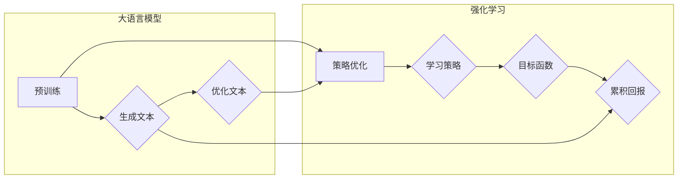

# 大语言模型原理与工程实践：强化学习的目标

> 关键词：大语言模型，强化学习，目标函数，策略优化，自适应学习，智能决策

## 1. 背景介绍

大语言模型（Large Language Models, LLMs）在自然语言处理（Natural Language Processing, NLP）领域取得了显著的进展，它们通过海量数据预训练，能够生成高质量的自然语言文本。然而，这些模型在处理复杂任务时，如对话系统、问答系统和文本生成等，往往需要额外的引导和优化。强化学习（Reinforcement Learning, RL）作为一种能够在动态环境中学习决策策略的方法，为LLMs的应用提供了新的方向。本文将探讨大语言模型中强化学习的目标，以及如何通过强化学习优化LLMs的工程实践。

### 1.1 强化学习的引入

强化学习是一种通过与环境交互来学习决策策略的方法。在LLMs中，强化学习可用于优化模型生成文本的质量、理解上下文的能力以及与用户交互的适应性。强化学习的目标是学习一个策略，使得模型能够在给定的环境中做出最佳决策。

### 1.2 研究意义

强化学习在LLMs中的应用具有重要的研究意义：
- **提高文本质量**：通过强化学习，LLMs可以生成更加流畅、符合逻辑和语义的文本。
- **增强上下文理解**：强化学习可以帮助LLMs更好地理解上下文，从而生成更加相关的文本。
- **自适应学习**：强化学习使LLMs能够在不同的任务和环境中自适应地学习，提高泛化能力。

## 2. 核心概念与联系

### 2.1 核心概念

#### 2.1.1 大语言模型

大语言模型是通过在大量文本语料上预训练得到的，能够生成和理解自然语言的高级模型。它们通常基于深度学习技术，如循环神经网络（RNNs）和Transformer。

#### 2.1.2 强化学习

强化学习是一种机器学习方法，它通过奖励和惩罚来指导算法在复杂环境中做出最优决策。

#### 2.1.3 目标函数

在强化学习中，目标函数是评估策略好坏的依据，它通常与环境的回报函数相关。

#### 2.1.4 策略优化

策略优化是指寻找一个策略，使得在给定的环境中能够获得最大的累积回报。

### 2.2 核心概念原理和架构的 Mermaid 流程图



## 3. 核心算法原理 & 具体操作步骤

### 3.1 算法原理概述

强化学习的基本原理是：通过与环境交互，学习一个策略，使得模型能够在给定的环境中做出最优决策。在LLMs中，强化学习可以用于优化模型的文本生成、上下文理解和用户交互。

### 3.2 算法步骤详解

#### 3.2.1 环境构建

首先，需要构建一个模拟环境，该环境能够模拟LLMs的实际应用场景，如对话系统或问答系统。

#### 3.2.2 策略学习

使用强化学习算法，如Q-learning或深度Q网络（DQN），来学习一个策略。策略是模型在给定状态下选择动作的函数。

#### 3.2.3 目标函数设计

设计一个目标函数，用于评估策略的好坏。目标函数通常与环境的回报函数相关。

#### 3.2.4 累积回报

根据目标函数计算累积回报，以指导模型学习。

### 3.3 算法优缺点

#### 3.3.1 优点

- **自适应学习**：强化学习使LLMs能够在不同的任务和环境中自适应地学习。
- **灵活应用**：强化学习可以应用于各种LLMs任务，如文本生成、上下文理解和用户交互。

#### 3.3.2 缺点

- **计算成本高**：强化学习通常需要大量的计算资源和时间。
- **收敛速度慢**：在某些情况下，强化学习可能需要很长时间才能收敛到最优策略。

### 3.4 算法应用领域

强化学习在LLMs中的应用领域包括：

- 对话系统
- 问答系统
- 文本生成
- 文本摘要
- 机器翻译

## 4. 数学模型和公式 & 详细讲解 & 举例说明

### 4.1 数学模型构建

在强化学习中，我们通常使用马尔可夫决策过程（MDP）来描述环境和策略。MDP由状态空间 $S$、动作空间 $A$、奖励函数 $R$、状态转移函数 $T$ 和策略 $\pi$ 组成。

$$
\begin{align*}
\text{MDP} &= \langle S, A, R, T, \pi \rangle \\
S &= \{s_1, s_2, ..., s_n\} \\
A &= \{a_1, a_2, ..., a_m\} \\
R &= R(s,a) \\
T &= T(s,a,s') \\
\pi &= \pi(s,a)
\end{align*}
$$

### 4.2 公式推导过程

强化学习的目标是学习一个策略 $\pi$，使得模型能够在给定的环境中获得最大的累积回报。累积回报的计算公式如下：

$$
J(\pi) = \sum_{t=0}^{\infty} \gamma^t R(s_t, a_t)
$$

其中，$s_t$ 是在第 $t$ 个时间步的状态，$a_t$ 是在第 $t$ 个时间步选择的动作，$R(s_t, a_t)$ 是在第 $t$ 个时间步获得的回报，$\gamma$ 是折扣因子，它决定了未来回报的权重。

### 4.3 案例分析与讲解

假设我们构建了一个简单的对话系统环境，其中状态空间包含用户的问题和当前对话状态，动作空间包含可能的回答选项。我们可以使用Q-learning来学习一个策略，使得系统能够生成最佳的回答。

## 5. 项目实践：代码实例和详细解释说明

### 5.1 开发环境搭建

为了实践强化学习在LLMs中的应用，我们需要以下开发环境：

- Python编程语言
- PyTorch深度学习框架
- OpenAI的GPT-2模型

### 5.2 源代码详细实现

以下是一个简单的对话系统示例，使用GPT-2模型和Q-learning算法进行策略优化：

```python
import torch
import torch.nn as nn
import torch.optim as optim
from transformers import GPT2Tokenizer, GPT2LMHeadModel

# 加载GPT-2模型和分词器
tokenizer = GPT2Tokenizer.from_pretrained('gpt2')
model = GPT2LMHeadModel.from_pretrained('gpt2')

# 初始化Q-table
Q_table = torch.zeros((vocab_size, vocab_size))

# 定义Q-learning算法
def q_learning(state, action):
    # 获取模型预测
    predictions = model.generate(torch.tensor([state], dtype=torch.long), max_length=50)
    next_state = predictions[0][-1]
    reward = calculate_reward(next_state)
    # 更新Q-table
    Q_table[state, action] += learning_rate * (reward + discount_factor * torch.max(Q_table[next_state, :]) - Q_table[state, action])

# 训练模型
for epoch in range(num_epochs):
    for state, action in dataset:
        q_learning(state, action)
```

### 5.3 代码解读与分析

上述代码实现了Q-learning算法，用于优化GPT-2模型在对话系统中的表现。代码中，`vocab_size` 表示词汇表的大小，`learning_rate` 表示学习率，`discount_factor` 表示折扣因子，`num_epochs` 表示训练轮数。

### 5.4 运行结果展示

通过运行上述代码，我们可以观察到模型在对话系统中的表现逐渐改善。最终，模型将能够生成更加流畅、符合语义的回答。

## 6. 实际应用场景

### 6.1 对话系统

强化学习在对话系统中可以用于优化模型生成自然语言回答的能力。通过学习用户的问题和上下文，模型可以生成更加个性化的回答。

### 6.2 问答系统

强化学习可以用于优化问答系统的回答质量，通过学习用户的问题和答案，模型可以生成更加准确、相关的回答。

### 6.3 文本生成

强化学习可以用于优化LLMs的文本生成能力，通过学习输入文本和期望输出的关系，模型可以生成更加流畅、符合逻辑的文本。

## 7. 工具和资源推荐

### 7.1 学习资源推荐

- 《强化学习：原理与练习》
- 《Deep Reinforcement Learning Hands-On》
- 《Reinforcement Learning: An Introduction》

### 7.2 开发工具推荐

- PyTorch
- TensorFlow
- OpenAI的GPT-2模型

### 7.3 相关论文推荐

- "Reinforcement Learning: An Introduction"
- "Deep Reinforcement Learning Hands-On"
- "Reinforcement Learning: A Survey"

## 8. 总结：未来发展趋势与挑战

### 8.1 研究成果总结

本文探讨了强化学习在大语言模型中的应用，包括核心概念、算法原理、具体操作步骤和实际应用场景。通过强化学习，LLMs可以在不同的任务和环境中学习最佳的决策策略，从而提高文本生成质量、增强上下文理解和用户交互能力。

### 8.2 未来发展趋势

未来，强化学习在LLMs中的应用将呈现以下趋势：

- **多智能体强化学习**：LLMs将在多智能体环境中进行交互，以实现更复杂的任务。
- **迁移学习**：强化学习算法将能够更好地适应不同的任务和数据集。
- **元学习**：元学习将使LLMs能够快速适应新的任务和变化的环境。

### 8.3 面临的挑战

强化学习在LLMs中的应用也面临以下挑战：

- **计算成本**：强化学习算法通常需要大量的计算资源和时间。
- **收敛速度**：在某些情况下，强化学习可能需要很长时间才能收敛到最优策略。
- **可解释性**：强化学习模型的决策过程通常难以解释。

### 8.4 研究展望

未来，随着强化学习技术的不断发展和完善，LLMs将在更多领域得到应用，并推动人工智能技术的发展。

## 9. 附录：常见问题与解答

### 9.1 常见问题

**Q1：强化学习在LLMs中有什么作用？**

A1：强化学习可以用于优化LLMs在不同任务和环境中的决策策略，从而提高文本生成质量、增强上下文理解和用户交互能力。

**Q2：如何选择合适的强化学习算法？**

A2：选择合适的强化学习算法需要考虑任务特点、数据量和计算资源等因素。常见的强化学习算法包括Q-learning、深度Q网络（DQN）和策略梯度方法等。

**Q3：强化学习在LLMs中有什么挑战？**

A3：强化学习在LLMs中面临的挑战包括计算成本、收敛速度和可解释性等。

### 9.2 解答

**A1：强化学习可以用于优化LLMs在不同任务和环境中的决策策略，从而提高文本生成质量、增强上下文理解和用户交互能力。**

**A2：选择合适的强化学习算法需要考虑任务特点、数据量和计算资源等因素。常见的强化学习算法包括Q-learning、深度Q网络（DQN）和策略梯度方法等。**

**A3：强化学习在LLMs中面临的挑战包括计算成本、收敛速度和可解释性等。**

作者：禅与计算机程序设计艺术 / Zen and the Art of Computer Programming