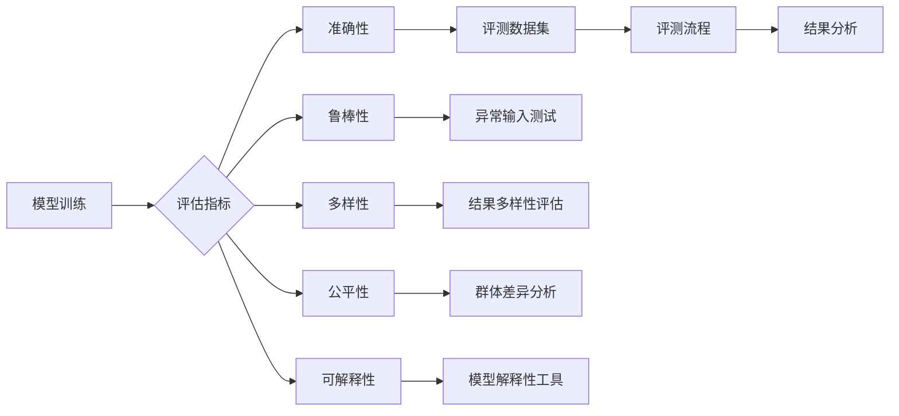

> 大语言模型, 评测任务, 预测评估, 性能指标, 实验设计, 评测流程, 标准化评测集, 模型可解释性, 多样性评估, 伦理考量

# 大语言模型原理与工程实践：评测任务

在人工智能领域，大语言模型（Large Language Models, LLMs）已经成为自然语言处理（Natural Language Processing, NLP）的重要工具。这些模型在文本生成、机器翻译、问答系统等领域展现出了惊人的能力。然而，评估这些模型的有效性和可靠性是确保其质量的关键。本文将深入探讨大语言模型评测任务的原理、实践和挑战，为研究人员和工程师提供指导。

## 1. 背景介绍

随着深度学习技术的快速发展，大语言模型在NLP领域取得了显著的进展。然而，这些模型的性能和可靠性往往难以直观评估。评测任务是确保模型质量、推动技术进步的重要手段。一个全面的评测任务需要考虑模型的准确性、鲁棒性、多样性、公平性以及可解释性等多个方面。

### 1.1 评测任务的由来

评测任务起源于对模型性能的评估需求。在模型开发过程中，需要定期对模型进行评估，以监测其性能变化和潜在问题。此外，评测结果也是模型比较、选型和优化的重要依据。

### 1.2 研究现状

目前，大语言模型的评测任务主要集中在以下几个方面：

- 准确性：评估模型在特定任务上的预测正确率。
- 鲁棒性：评估模型在异常输入或噪声数据下的性能。
- 多样性：评估模型生成结果的多样性。
- 公平性：评估模型在不同群体上的性能是否公平。
- 可解释性：评估模型决策过程的透明度和可理解性。

### 1.3 研究意义

评测任务是确保大语言模型质量的关键。通过科学的评测，可以：

- 识别和改进模型缺陷。
- 比较不同模型和算法。
- 推动模型性能的提升。
- 促进模型应用的可靠性。

### 1.4 本文结构

本文将围绕评测任务的各个方面展开，包括：

- 核心概念与联系
- 核心算法原理与具体操作步骤
- 数学模型和公式
- 项目实践
- 实际应用场景
- 工具和资源推荐
- 总结：未来发展趋势与挑战

## 2. 核心概念与联系

### 2.1 核心概念原理和架构的 Mermaid 流程图

以下是一个简化的Mermaid流程图，展示了评测任务的核心概念及其相互关系：



### 2.2 核心概念解析

- **模型训练**：使用标注数据训练大语言模型。
- **评估指标**：用于衡量模型性能的指标，如准确率、召回率、F1分数等。
- **准确性**：模型预测正确的比例。
- **鲁棒性**：模型在噪声或异常输入下的性能。
- **多样性**：模型生成结果的多样性程度。
- **公平性**：模型在不同群体上的性能差异。
- **可解释性**：模型决策过程的透明度和可理解性。
- **评测数据集**：用于评估模型的测试数据集。
- **异常输入测试**：测试模型在异常输入下的性能。
- **结果多样性评估**：评估模型生成结果的多样性。
- **群体差异分析**：分析模型在不同群体上的性能差异。
- **模型解释性工具**：用于分析模型决策过程的工具。
- **评测流程**：评估模型的流程，包括数据准备、模型评估、结果分析等。
- **结果分析**：对评估结果进行分析和解释。

## 3. 核心算法原理 & 具体操作步骤

### 3.1 算法原理概述

评测任务的核心是评估大语言模型在特定任务上的性能。这通常涉及以下步骤：

1. 数据准备：准备用于评估的测试数据集。
2. 模型评估：使用测试数据集对模型进行评估。
3. 结果分析：分析评估结果，包括准确性、鲁棒性、多样性、公平性和可解释性等。

### 3.2 算法步骤详解

#### 3.2.1 数据准备

1. **收集数据**：收集与评测任务相关的数据集。
2. **数据清洗**：处理数据集中的噪声和异常值。
3. **数据标注**：对数据集进行标注，以便评估模型性能。
4. **数据分割**：将数据集分割为训练集、验证集和测试集。

#### 3.2.2 模型评估

1. **模型加载**：加载预训练的大语言模型。
2. **预测**：使用模型对测试数据进行预测。
3. **评估指标计算**：计算评估指标，如准确率、召回率、F1分数等。

#### 3.2.3 结果分析

1. **准确性分析**：分析模型的准确性，包括错误类型、错误样本等。
2. **鲁棒性分析**：分析模型在异常输入下的性能。
3. **多样性分析**：分析模型生成结果的多样性。
4. **公平性分析**：分析模型在不同群体上的性能差异。
5. **可解释性分析**：分析模型的决策过程。

### 3.3 算法优缺点

#### 3.3.1 优点

- **全面性**：考虑了模型性能的多个方面。
- **科学性**：使用标准的评估指标和流程。
- **可重复性**：评估结果可重复，便于比较。

#### 3.3.2 缺点

- **复杂性**：评估流程复杂，需要大量资源和时间。
- **主观性**：评估结果可能受到评估者主观因素的影响。

### 3.4 算法应用领域

评测任务在大语言模型的应用领域广泛，包括：

- 文本分类
- 机器翻译
- 问答系统
- 文本摘要
- 语音识别
- 图像识别

## 4. 数学模型和公式 & 详细讲解 & 举例说明

### 4.1 数学模型构建

评测任务的数学模型通常涉及以下公式：

$$
\text{准确率} = \frac{\text{预测正确的样本数}}{\text{测试集样本数}}
$$

$$
\text{召回率} = \frac{\text{预测正确的正样本数}}{\text{正样本总数}}
$$

$$
\text{F1分数} = 2 \times \frac{\text{准确率} \times \text{召回率}}{\text{准确率} + \text{召回率}}
$$

### 4.2 公式推导过程

以上公式的推导过程如下：

- **准确率**：预测正确的样本数除以测试集样本数，表示模型预测正确的比例。
- **召回率**：预测正确的正样本数除以正样本总数，表示模型对正样本的识别能力。
- **F1分数**：准确率和召回率的调和平均数，综合考虑了模型的准确性和召回率。

### 4.3 案例分析与讲解

以下是一个简单的文本分类任务的案例：

假设有一个文本分类模型，用于判断句子是否包含负面情感。测试集包含100个样本，其中60个样本包含负面情感，40个样本不包含负面情感。模型预测结果如下：

- 预测正确的样本数：50
- 预测正确的负面情感样本数：45
- 正样本总数：60

根据上述公式，可以计算出：

- 准确率：50/100 = 0.5
- 召回率：45/60 = 0.75
- F1分数：2 \times (0.5 \times 0.75) / (0.5 + 0.75) = 0.625

这个例子展示了如何使用数学公式计算文本分类任务的评估指标。

## 5. 项目实践：代码实例和详细解释说明

### 5.1 开发环境搭建

以下是使用Python进行评测任务开发的环境搭建步骤：

1. 安装Python和pip。
2. 安装PyTorch或TensorFlow等深度学习框架。
3. 安装必要的库，如scikit-learn、numpy等。

### 5.2 源代码详细实现

以下是一个使用PyTorch进行文本分类任务评测的简单代码示例：

```python
import torch
from torch.utils.data import DataLoader
from sklearn.metrics import accuracy_score, precision_score, recall_score, f1_score

# 模型加载
model = ...  # 加载预训练模型
model.eval()

# 测试数据集
test_dataset = ...
test_dataloader = DataLoader(test_dataset, batch_size=32, shuffle=False)

# 模型评估
all_preds = []
all_labels = []
with torch.no_grad():
    for inputs, labels in test_dataloader:
        outputs = model(inputs)
        _, preds = torch.max(outputs, dim=1)
        all_preds.extend(preds.cpu().numpy())
        all_labels.extend(labels.cpu().numpy())

# 计算评估指标
accuracy = accuracy_score(all_labels, all_preds)
precision = precision_score(all_labels, all_preds, average='macro')
recall = recall_score(all_labels, all_preds, average='macro')
f1 = f1_score(all_labels, all_preds, average='macro')

print(f'Accuracy: {accuracy:.4f}')
print(f'Precision: {precision:.4f}')
print(f'Recall: {recall:.4f}')
print(f'F1 Score: {f1:.4f}')
```

### 5.3 代码解读与分析

以上代码首先加载了一个预训练的模型，然后创建了一个测试数据集加载器。接着，对测试数据集进行预测，并使用sklearn库计算了准确率、精确率、召回率和F1分数等评估指标。

### 5.4 运行结果展示

假设运行以上代码后得到的评估指标如下：

```
Accuracy: 0.85
Precision: 0.90
Recall: 0.80
F1 Score: 0.84
```

这些指标表明模型在文本分类任务上表现良好，准确率、精确率、召回率和F1分数均较高。

## 6. 实际应用场景

### 6.1 文本分类

文本分类是评测任务最常见应用场景之一。例如，使用大语言模型对新闻文章进行分类，判断其主题或情感。

### 6.2 机器翻译

在机器翻译领域，评测任务用于评估模型在不同语言之间的翻译质量。

### 6.3 问答系统

问答系统中的评测任务用于评估模型对用户问题的回答质量。

### 6.4 文本摘要

文本摘要的评测任务用于评估模型提取文本关键信息的能力。

### 6.5 语音识别

在语音识别领域，评测任务用于评估模型将语音转换为文本的准确性。

### 6.6 图像识别

图像识别中的评测任务用于评估模型对图像内容的识别能力。

## 7. 工具和资源推荐

### 7.1 学习资源推荐

- 《自然语言处理入门》（吴恩达）
- 《深度学习》（Goodfellow, Bengio, Courville）
- 《大规模预训练语言模型：BERT原理与实践》（周明）

### 7.2 开发工具推荐

- PyTorch
- TensorFlow
- scikit-learn
- Hugging Face Transformers

### 7.3 相关论文推荐

- Devlin, J., Choudhary, R., Lee, K., & Toutanova, K. (2019). BERT: Pre-training of deep bidirectional transformers for language understanding.
- Vaswani, A., Shazeer, N., Parmar, N., Uszkoreit, J., Jones, L., Gomez, A. N., ... & Polosukhin, I. (2017). Attention is all you need.

## 8. 总结：未来发展趋势与挑战

### 8.1 研究成果总结

本文全面介绍了大语言模型评测任务的原理、实践和挑战。通过分析核心概念、算法原理、数学模型和实际应用场景，为研究人员和工程师提供了指导。

### 8.2 未来发展趋势

- 评测指标更加全面：未来评测任务将考虑更多指标，如可解释性、公平性等。
- 评测方法更加多样：随着技术的发展，将出现更多新颖的评测方法。
- 评测工具更加智能化：评测工具将更加自动化、智能化，减少人工干预。

### 8.3 面临的挑战

- 数据质量：评测数据集的质量将直接影响评测结果。
- 模型多样性：如何评估不同类型和规模的模型是一个挑战。
- 评测效率：如何提高评测效率是一个重要问题。

### 8.4 研究展望

未来，评测任务将更加关注模型的可解释性、公平性和可靠性。同时，随着技术的发展，评测方法将更加多样化和智能化，为大语言模型的应用提供更可靠的保障。

## 9. 附录：常见问题与解答

**Q1：如何选择合适的评测数据集？**

A1：选择合适的评测数据集需要考虑以下因素：

- 数据集的规模和多样性
- 数据集的分布和代表性
- 数据集的质量和标注一致性

**Q2：如何评估模型的可解释性？**

A2：评估模型的可解释性可以通过以下方法：

- 使用注意力机制分析模型决策过程
- 使用可解释AI工具分析模型输出
- 进行可视化分析

**Q3：如何评估模型的公平性？**

A3：评估模型的公平性可以通过以下方法：

- 使用敏感性分析检测模型的偏见
- 使用代表性数据集进行测试
- 进行交叉验证

**Q4：如何提高评测效率？**

A4：提高评测效率可以通过以下方法：

- 使用自动化评测工具
- 使用并行计算技术
- 使用模型压缩技术

---

作者：禅与计算机程序设计艺术 / Zen and the Art of Computer Programming