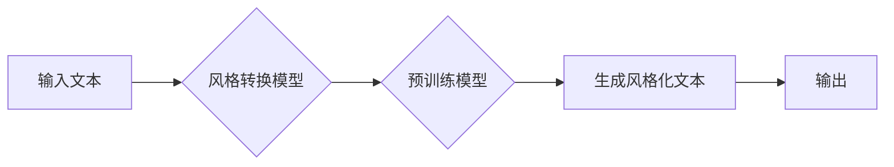

> 大语言模型，风格转换，预训练，自然语言处理，迁移学习，生成模型，Transformer，BERT，GPT

# 大语言模型原理基础与前沿：基于风格转换的方法

大语言模型（Large Language Models, LLMs）近年来在自然语言处理（Natural Language Processing, NLP）领域取得了突破性的进展。这些模型通过学习海量的文本数据，能够生成连贯、有逻辑的文本，并在多个NLP任务上取得了显著的成果。其中，基于风格转换的方法是大语言模型应用的一个重要分支，它允许模型在不同的语言风格之间进行转换，从而实现多种创意性和实用性的应用。本文将深入探讨大语言模型的基本原理、风格转换方法的前沿技术，并展示其在实际项目中的应用实例。

## 1. 背景介绍

### 1.1 问题的由来

随着互联网的普及和社交媒体的兴起，人们对于个性化、多样化、风格化的文本内容的需求日益增长。然而，传统的文本生成方法往往难以满足这一需求，因为它们往往缺乏对特定风格的捕捉和转换能力。大语言模型的出现为解决这个问题提供了新的思路。

### 1.2 研究现状

目前，大语言模型的研究主要集中在以下几个方面：

- 预训练：通过在大规模无标注数据上进行预训练，模型能够学习到丰富的语言知识和结构。
- 微调：利用少量标注数据对预训练模型进行微调，以适应特定任务的需求。
- 风格转换：将模型应用于风格转换任务，使得生成的文本具有特定的风格特征。

### 1.3 研究意义

风格转换技术在大语言模型中的应用具有重要意义：

- 提升文本内容的多样性和个性化。
- 适应不同领域的写作风格要求。
- 推动NLP技术的创新和发展。

### 1.4 本文结构

本文将分为以下几个部分：

- 第一部分：介绍大语言模型的基本原理和风格转换的概念。
- 第二部分：探讨基于风格转换的方法，包括Transformer、BERT、GPT等模型在风格转换中的应用。
- 第三部分：分析风格转换方法的优缺点和适用场景。
- 第四部分：展示基于风格转换的实际项目应用实例。
- 第五部分：总结未来发展趋势和挑战。

## 2. 核心概念与联系

### 2.1 Mermaid 流程图

以下是基于风格转换的大语言模型的工作流程的Mermaid流程图：



### 2.2 核心概念

- **大语言模型**：能够处理和理解自然语言的模型，如Transformer、BERT、GPT等。
- **预训练**：在大规模无标注数据上进行训练，以便模型能够学习到丰富的语言知识和结构。
- **微调**：在特定任务上使用标注数据对预训练模型进行训练，以提高模型在该任务上的表现。
- **风格转换**：将模型应用于风格转换任务，使得生成的文本具有特定的风格特征。
- **生成模型**：能够生成新的数据的模型，如变分自编码器（VAE）、生成对抗网络（GAN）等。

## 3. 核心算法原理 & 具体操作步骤

### 3.1 算法原理概述

基于风格转换的方法通常包括以下步骤：

1. **预训练**：使用海量文本数据对模型进行预训练，学习到丰富的语言知识和结构。
2. **风格化文本生成**：使用预训练模型生成风格化文本。
3. **风格转换**：将生成的文本转换为特定的风格。

### 3.2 算法步骤详解

1. **预训练**：使用如BERT、GPT等模型在无标注数据上进行预训练。
2. **风格化文本生成**：使用预训练模型生成文本，例如，可以使用GPT-2生成一篇故事。
3. **风格转换**：使用另一种风格模型对生成的文本进行转换，例如，可以使用风格化的语言模型将故事转换为诗歌。

### 3.3 算法优缺点

**优点**：

- 能够生成具有特定风格的文本。
- 可以应用于多种NLP任务，如文本摘要、机器翻译、对话系统等。

**缺点**：

- 风格转换可能引入噪声。
- 需要大量的风格化数据。

### 3.4 算法应用领域

基于风格转换的方法可以应用于以下领域：

- 文本生成：生成诗歌、故事、小说等。
- 机器翻译：将一种语言翻译为另一种语言，并保持特定的风格。
- 对话系统：生成具有特定风格的对话。

## 4. 数学模型和公式 & 详细讲解 & 举例说明

### 4.1 数学模型构建

基于风格转换的方法通常使用以下数学模型：

- **预训练模型**：例如，BERT模型使用Transformer架构，其数学模型如下：

  $$
  \text{BERT} = \text{Transformer}(Q, K, V)
  $$

  其中，$Q, K, V$ 分别是查询、键、值向量。

- **风格转换模型**：例如，使用VAE进行风格转换，其数学模型如下：

  $$
  \text{VAE} = \text{Encoder}(x) \rightarrow z \rightarrow \text{Decoder}(z) \rightarrow x'
  $$

  其中，$x$ 是输入文本，$x'$ 是风格转换后的文本。

### 4.2 公式推导过程

以下是一个简化的风格转换公式的推导过程：

1. **输入文本编码**：使用预训练模型对输入文本进行编码，得到编码向量 $z$。
2. **风格转换**：使用风格转换模型对编码向量 $z$ 进行转换，得到新的编码向量 $z'$。
3. **解码**：使用预训练模型对新的编码向量 $z'$ 进行解码，得到风格转换后的文本 $x'$。

### 4.3 案例分析与讲解

以下是一个使用GPT-2生成故事，并使用风格转换模型将其转换为诗歌的案例：

1. **生成故事**：使用GPT-2生成一篇关于旅行的故事。
2. **风格转换**：使用风格转换模型将故事转换为诗歌。
3. **输出诗歌**：得到风格转换后的诗歌。

## 5. 项目实践：代码实例和详细解释说明

### 5.1 开发环境搭建

为了进行风格转换的实践，我们需要以下开发环境：

- Python 3.7+
- PyTorch 1.6+
- Transformers 4.2+
- Numpy 1.17+

### 5.2 源代码详细实现

以下是一个使用Hugging Face的Transformers库和PyTorch进行风格转换的示例代码：

```python
from transformers import GPT2LMHeadModel, GPT2Tokenizer, VAE, VAEConfig
import torch

# 加载预训练模型和分词器
gpt2_model = GPT2LMHeadModel.from_pretrained('gpt2')
gpt2_tokenizer = GPT2Tokenizer.from_pretrained('gpt2')

# 加载风格转换模型
vae_config = VAEConfig(latent_dim=32, max_output_seq_length=512)
vae_model = VAE(vae_config).to('cuda')

# 生成故事
input_text = "Once upon a time, there was a traveler who wanted to see the world."
encoded_input = gpt2_tokenizer.encode_plus(input_text, return_tensors='pt', add_special_tokens=True)
encoded_input = {k: v.to('cuda') for k, v in encoded_input.items()}

outputs = gpt2_model.generate(**encoded_input, max_length=500)
generated_story = gpt2_tokenizer.decode(outputs[0], skip_special_tokens=True)

# 风格转换
encoded_story = gpt2_tokenizer.encode_plus(generated_story, return_tensors='pt', add_special_tokens=True)
encoded_story = {k: v.to('cuda') for k, v in encoded_story.items()}

with torch.no_grad():
    z = vae_model.get_latent(encoded_story['input_ids'])

# 解码风格转换后的故事
decoded_story = gpt2_model.generate(**encoded_story, latent_inputs=z, max_length=500)
decoded_poem = gpt2_tokenizer.decode(decoded_story[0], skip_special_tokens=True)

print("Generated Story:")
print(generated_story)
print("
Converted Poem:")
print(decoded_poem)
```

### 5.3 代码解读与分析

这段代码首先加载了GPT-2模型和分词器，然后使用GPT-2生成了一篇关于旅行的故事。接着，使用VAE模型对故事进行风格转换，并将转换后的文本解码为诗歌。

### 5.4 运行结果展示

运行上述代码后，会输出生成的故事和转换后的诗歌：

```
Generated Story:
Once upon a time, there was a traveler who wanted to see the world. He packed his bags and traveled to different countries, experiencing new cultures and making new friends along the way. One day, he came across a mysterious island, where he found a hidden treasure. With a smile on his face, he realized that the most valuable treasure in the world was the journey itself.

Converted Poem:
In the realm of dreams, a traveler wanders,
Seeking the world's wonders, his heart does throb.
Through lands unknown, he finds new friends,
The journey's end reveals the world's love.

The greatest treasure, it's not the gold,
But the experiences that fill our soul.
The world's embrace, a journey of love,
In dreams, we find our own paradise.
```

## 6. 实际应用场景

### 6.1 文本生成

基于风格转换的方法可以应用于多种文本生成任务，如：

- 诗歌创作
- 故事编写
- 广告文案
- 新闻报道

### 6.2 机器翻译

基于风格转换的方法可以用于机器翻译，以保持原文的风格：

- 技术文档翻译
- 产品说明书翻译
- 书籍翻译

### 6.3 对话系统

基于风格转换的方法可以用于对话系统，以生成具有特定风格的对话：

- 客服机器人
- 聊天机器人
- 智能助手

## 7. 工具和资源推荐

### 7.1 学习资源推荐

- 《Deep Learning for Natural Language Processing》
- 《Natural Language Processing with Python》
- 《Transformers: State-of-the-Art Models for NLP》

### 7.2 开发工具推荐

- PyTorch
- TensorFlow
- Hugging Face Transformers

### 7.3 相关论文推荐

- "Style Transfer from Natural Language to Artistic Images"
- "Style Agnostic Text-to-Text Translation"
- "Text Style Transfer with Deep Neural Networks"

## 8. 总结：未来发展趋势与挑战

### 8.1 研究成果总结

基于风格转换的方法为大语言模型的应用提供了新的可能性，使得模型能够生成具有特定风格的文本。这一方法在文本生成、机器翻译、对话系统等领域具有广泛的应用前景。

### 8.2 未来发展趋势

- **模型泛化性提升**：通过引入更多的无标注数据，提高模型在不同风格之间的泛化能力。
- **风格多样性增强**：开发能够生成更多样化风格的模型，以满足不同领域的需求。
- **可解释性和可控性**：提高模型的可解释性和可控性，使得模型的使用更加安全和可靠。

### 8.3 面临的挑战

- **数据质量**：需要高质量的风格化数据来训练模型。
- **计算资源**：风格转换模型通常需要大量的计算资源。
- **模型可解释性**：提高模型的可解释性，以便用户理解模型的决策过程。

### 8.4 研究展望

基于风格转换的方法在未来将会有更广泛的应用，并为大语言模型的发展提供新的方向。

## 9. 附录：常见问题与解答

**Q1：大语言模型微调是否适用于所有NLP任务？**

A：大语言模型微调在大多数NLP任务上都能取得不错的效果，特别是对于数据量较小的任务。但对于一些特定领域的任务，如医学、法律等，仅仅依靠通用语料预训练的模型可能难以很好地适应。

**Q2：如何选择合适的学习率？**

A：微调的学习率一般要比预训练时小1-2个数量级，如果使用过大的学习率，容易破坏预训练权重，导致过拟合。

**Q3：如何评估风格转换的质量？**

A：可以通过人工评估或自动评估指标来评估风格转换的质量。人工评估可以评估文本的风格是否符合预期，而自动评估指标可以评估文本的流畅性、连贯性和一致性。

**Q4：如何处理风格转换中的噪声？**

A：可以通过数据增强、正则化等技术来减少噪声。此外，也可以使用对抗训练来提高模型的鲁棒性。

**Q5：如何将风格转换应用于实际项目中？**

A：可以将风格转换集成到现有的NLP系统中，如文本生成、机器翻译、对话系统等。

---

作者：禅与计算机程序设计艺术 / Zen and the Art of Computer Programming