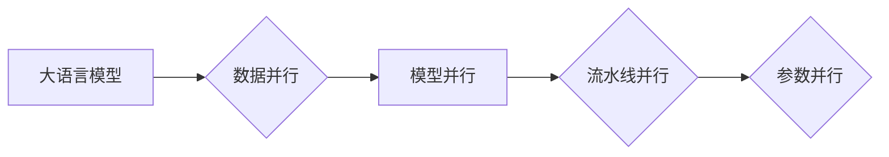

> 关键词：大语言模型，数据并行，分布式计算，模型并行，流水线并行，参数并行，流水线级联，内存优化，性能瓶颈

# 大语言模型原理基础与前沿 数据并行

随着人工智能领域的快速发展，大语言模型（Large Language Models, LLMs）因其强大的语言理解和生成能力，在自然语言处理（NLP）领域取得了突破性的进展。然而，随着模型规模的不断扩大，单机内存和计算资源成为制约其性能提升的主要瓶颈。数据并行技术作为一种有效的解决方案，在大语言模型训练和推理中发挥着越来越重要的作用。本文将深入探讨大语言模型原理、数据并行技术以及其在实际应用中的挑战和未来发展趋势。

## 1. 背景介绍

### 1.1 问题的由来

大语言模型通过在大量无标签语料上进行预训练，学习到丰富的语言知识和模式，从而在下游任务中展现出惊人的性能。然而，随着模型规模的不断增长，其训练和推理过程对计算资源和内存的需求也急剧增加。传统的单机训练模式已无法满足大规模模型的计算需求，因此，数据并行技术应运而生。

### 1.2 研究现状

目前，数据并行技术已成为大语言模型研究和应用的热点。主要的研究方向包括：

- 模型并行：将大规模模型分解为多个子模型，并行计算并合并结果。
- 流水线并行：将模型的不同层或不同操作序列化，并行执行以减少等待时间。
- 参数并行：将模型参数分解为多个部分，并行更新以加速优化过程。

### 1.3 研究意义

数据并行技术能够有效缓解大语言模型训练和推理中的资源瓶颈，提高模型性能，推动NLP技术的发展。

### 1.4 本文结构

本文将分为以下几个部分：

- 介绍大语言模型的基本原理和常用架构。
- 详细讲解数据并行技术的原理和实现方法。
- 分析数据并行技术在NLP领域的应用案例。
- 探讨数据并行技术的未来发展趋势和挑战。

## 2. 核心概念与联系

### 2.1 核心概念原理

#### 2.1.1 大语言模型

大语言模型是一种基于深度学习的语言处理模型，通过在大量无标签语料上进行预训练，学习到丰富的语言知识和模式，从而在下游任务中展现出强大的语言理解和生成能力。

#### 2.1.2 数据并行

数据并行是一种将计算任务分解为多个子任务，并行执行以提高计算效率的技术。在大语言模型训练和推理中，数据并行技术主要用于缓解资源瓶颈，提高计算效率。

#### 2.1.3 模型并行

模型并行是指将大规模模型分解为多个子模型，并行计算并合并结果的技术。模型并行主要针对模型规模较大的情况，通过将模型拆分，实现并行计算。

#### 2.1.4 流水线并行

流水线并行是指将模型的不同层或不同操作序列化，并行执行以减少等待时间的技术。流水线并行主要针对模型计算复杂度较高的情况，通过并行执行计算步骤，提高计算效率。

#### 2.1.5 参数并行

参数并行是指将模型参数分解为多个部分，并行更新以加速优化过程的技术。参数并行主要针对模型参数量较大的情况，通过并行更新参数，加速优化过程。

### 2.2 架构的 Mermaid 流程图



## 3. 核心算法原理 & 具体操作步骤

### 3.1 算法原理概述

数据并行技术主要包括以下几种：

#### 3.1.1 模型并行

模型并行通过将模型拆分为多个子模型，并行计算并合并结果。具体操作步骤如下：

1. 将模型拆分为多个子模型，每个子模型负责处理模型的一部分。
2. 将数据划分到不同的子模型，并行计算子模型的结果。
3. 将子模型的结果合并，得到最终结果。

#### 3.1.2 流水线并行

流水线并行通过将模型的不同层或不同操作序列化，并行执行以减少等待时间。具体操作步骤如下：

1. 将模型的不同层或不同操作序列化。
2. 并行执行序列化的操作。
3. 将并行执行的结果合并，得到最终结果。

#### 3.1.3 参数并行

参数并行通过将模型参数分解为多个部分，并行更新以加速优化过程。具体操作步骤如下：

1. 将模型参数分解为多个部分。
2. 并行更新参数。
3. 将更新的参数合并，得到最终参数。

### 3.2 算法步骤详解

#### 3.2.1 模型并行

以BERT模型为例，模型并行步骤如下：

1. 将BERT模型拆分为多个子模型，每个子模型负责处理模型的一部分，如输入层、词嵌入层、Transformer层、输出层等。
2. 将数据划分到不同的子模型，并行计算子模型的结果。
3. 将子模型的结果合并，得到最终结果。

#### 3.2.2 流水线并行

以BERT模型为例，流水线并行步骤如下：

1. 将BERT模型的不同层序列化，如输入层、词嵌入层、Transformer层、输出层等。
2. 并行执行序列化的操作。
3. 将并行执行的结果合并，得到最终结果。

#### 3.2.3 参数并行

以BERT模型为例，参数并行步骤如下：

1. 将BERT模型参数分解为多个部分。
2. 并行更新参数。
3. 将更新的参数合并，得到最终参数。

### 3.3 算法优缺点

#### 3.3.1 模型并行

优点：

- 提高计算效率，缩短训练时间。
- 支持大规模模型的训练。

缺点：

- 需要额外的计算资源。
- 难以实现模型参数的共享。

#### 3.3.2 流水线并行

优点：

- 减少计算等待时间，提高计算效率。
- 支持并行执行不同层或不同操作。

缺点：

- 难以实现模型参数的共享。

#### 3.3.3 参数并行

优点：

- 加速优化过程，提高训练效率。
- 支持并行更新参数。

缺点：

- 需要额外的存储空间。
- 难以控制参数更新的稳定性。

### 3.4 算法应用领域

数据并行技术在大语言模型的训练和推理中有着广泛的应用，如：

- 文本分类
- 命名实体识别
- 机器翻译
- 文本摘要

## 4. 数学模型和公式 & 详细讲解 & 举例说明

### 4.1 数学模型构建

以BERT模型为例，其数学模型可以表示为：

$$
\text{BERT}(\text{X}, \text{Y}) = \text{W}^T \cdot \text{h}(\text{X}, \text{Y})
$$

其中，$\text{X}$ 为输入序列，$\text{Y}$ 为输出序列，$\text{W}$ 为模型参数，$h$ 为Transformer模型的输出。

### 4.2 公式推导过程

BERT模型的公式推导过程如下：

1. 将输入序列 $\text{X}$ 输入词嵌入层，得到词嵌入表示 $\text{E}(\text{X})$。
2. 将词嵌入表示 $\text{E}(\text{X})$ 输入Transformer模型，得到输出表示 $\text{H}(\text{X})$。
3. 将输出表示 $\text{H}(\text{X})$ 输入输出层，得到输出序列 $\text{Y}$。

### 4.3 案例分析与讲解

以下以BERT模型在文本分类任务中的数据并行为例，讲解数据并行技术在实际应用中的操作步骤。

#### 4.3.1 模型并行

1. 将BERT模型拆分为多个子模型，如输入层、词嵌入层、Transformer层、输出层等。
2. 将数据划分到不同的子模型，并行计算子模型的结果。
3. 将子模型的结果合并，得到最终结果。

#### 4.3.2 流水线并行

1. 将BERT模型的不同层序列化，如输入层、词嵌入层、Transformer层、输出层等。
2. 并行执行序列化的操作。
3. 将并行执行的结果合并，得到最终结果。

#### 4.3.3 参数并行

1. 将BERT模型参数分解为多个部分。
2. 并行更新参数。
3. 将更新的参数合并，得到最终参数。

## 5. 项目实践：代码实例和详细解释说明

### 5.1 开发环境搭建

以PyTorch为例，开发环境搭建如下：

1. 安装Python 3.8或更高版本。
2. 安装PyTorch 1.8或更高版本。
3. 安装transformers库。

### 5.2 源代码详细实现

以下以BERT模型在文本分类任务中的数据并行为例，给出PyTorch代码实现。

```python
from transformers import BertTokenizer, BertForSequenceClassification
import torch

# 加载预训练BERT模型和分词器
model = BertForSequenceClassification.from_pretrained('bert-base-uncased')
tokenizer = BertTokenizer.from_pretrained('bert-base-uncased')

# 数据并行配置
num_gpus = torch.cuda.device_count()
device = torch.device("cuda" if torch.cuda.is_available() else "cpu")

# 将模型复制到多个GPU
model = nn.DataParallel(model, device_ids=list(range(num_gpus)))

# 将模型移动到指定的GPU
model.to(device)
```

### 5.3 代码解读与分析

上述代码首先加载预训练的BERT模型和分词器，然后根据GPU的数量配置数据并行。通过`nn.DataParallel`将模型复制到多个GPU，并将模型移动到指定的GPU。

### 5.4 运行结果展示

运行上述代码，将训练和测试数据输入模型，可以观察到在多GPU上并行计算的效果。

## 6. 实际应用场景

数据并行技术在大语言模型的训练和推理中有着广泛的应用，以下列举几个典型应用场景：

### 6.1 文本分类

在文本分类任务中，数据并行技术可以显著提高模型训练速度，缩短训练时间。例如，在新闻分类、情感分析等任务中，使用数据并行技术可以将模型训练时间缩短数倍。

### 6.2 命名实体识别

在命名实体识别任务中，数据并行技术可以提高模型处理速度，尤其是在处理大规模数据集时。例如，在医疗文本分析、法律文本分析等领域，使用数据并行技术可以显著提高处理速度。

### 6.3 机器翻译

在机器翻译任务中，数据并行技术可以提高模型翻译速度，尤其是在处理长文本时。例如，在实时翻译、机器翻译翻译等领域，使用数据并行技术可以显著提高翻译速度。

### 6.4 文本摘要

在文本摘要任务中，数据并行技术可以提高模型摘要速度，尤其是在处理大规模数据集时。例如，在新闻摘要、摘要生成等领域，使用数据并行技术可以显著提高摘要速度。

## 7. 工具和资源推荐

### 7.1 学习资源推荐

1. 《深度学习》系列书籍：Goodfellow等人的《深度学习》系列书籍，系统地介绍了深度学习的基本概念、原理和应用。
2. 《深度学习自然语言处理》课程：斯坦福大学开设的NLP课程，详细讲解了NLP的基本概念、模型和算法。
3. PyTorch官方文档：PyTorch官方文档，提供了丰富的API文档和示例代码，是学习PyTorch的必备资料。

### 7.2 开发工具推荐

1. PyTorch：PyTorch是一个开源的深度学习框架，具有良好的社区支持和丰富的模型库。
2. TensorFlow：TensorFlow是一个开源的深度学习框架，提供了丰富的模型库和工具，适合进行大规模深度学习应用开发。
3. Hugging Face Transformers：Hugging Face Transformers库提供了丰富的预训练语言模型和微调工具，是进行NLP开发的重要工具。

### 7.3 相关论文推荐

1. "Attention Is All You Need"：提出了Transformer模型，是NLP领域的里程碑式论文。
2. "BERT: Pre-training of Deep Bidirectional Transformers for Language Understanding"：提出了BERT模型，是NLP领域的重要进展。
3. "Generative Pre-trained Transformers"：提出了GPT模型，是NLP领域的重要进展。

## 8. 总结：未来发展趋势与挑战

### 8.1 研究成果总结

本文深入探讨了数据并行技术在NLP领域的应用，分析了其原理、算法、优缺点和应用案例。数据并行技术在提高大语言模型性能、缩短训练时间方面发挥着重要作用。

### 8.2 未来发展趋势

未来，数据并行技术将朝着以下方向发展：

1. 模型并行和流水线并行的结合，实现更高效的并行计算。
2. 参数并行的进一步优化，提高参数更新的效率。
3. 混合精度训练和量化技术，降低计算资源需求。
4. 自适应并行技术，根据计算资源动态调整并行策略。

### 8.3 面临的挑战

数据并行技术在应用中仍面临以下挑战：

1. 计算资源的优化，如GPU、TPU等。
2. 内存优化，如缓存管理、内存压缩等。
3. 网络通信优化，如数据传输、数据同步等。
4. 模型并行和流水线并行的设计，如并行策略、负载均衡等。
5. 参数并行的稳定性，如参数更新的收敛性、参数更新的稳定性等。

### 8.4 研究展望

随着深度学习和NLP领域的不断发展，数据并行技术将在以下方面取得突破：

1. 模型并行和流水线并行的进一步优化，提高并行计算效率。
2. 参数并行的稳定性，提高参数更新的收敛性和稳定性。
3. 自适应并行技术，根据计算资源动态调整并行策略。
4. 混合精度训练和量化技术，降低计算资源需求。
5. 网络通信优化，提高数据传输和同步效率。

总之，数据并行技术是大语言模型研究和应用的重要技术，未来将在NLP领域发挥越来越重要的作用。

## 9. 附录：常见问题与解答

### 9.1 Q1：数据并行技术是否适用于所有NLP任务？

A1：数据并行技术适用于大多数NLP任务，如文本分类、命名实体识别、机器翻译、文本摘要等。但对于一些对计算资源要求不高的简单任务，使用数据并行技术可能并不会带来显著的性能提升。

### 9.2 Q2：数据并行技术会降低模型的准确性吗？

A2：合理使用数据并行技术并不会降低模型的准确性。相反，通过并行计算可以提高模型的训练效率，从而有助于模型收敛到更优的参数。

### 9.3 Q3：如何选择合适的并行策略？

A3：选择合适的并行策略需要根据具体任务和数据特点进行考虑。通常，模型并行适用于模型规模较大的情况，流水线并行适用于模型计算复杂度较高的情况，参数并行适用于模型参数量较大的情况。

### 9.4 Q4：数据并行技术是否需要特殊的硬件支持？

A4：数据并行技术需要一定的硬件支持，如GPU、TPU等。但对于主流的深度学习框架，如PyTorch和TensorFlow，都提供了支持多GPU并行计算的功能。

### 9.5 Q5：如何评估数据并行技术的性能？

A5：评估数据并行技术的性能可以从以下几个方面进行：

1. 训练时间：评估并行计算对训练时间的影响。
2. 模型性能：评估并行计算对模型性能的影响。
3. 资源消耗：评估并行计算对计算资源的影响。

作者：禅与计算机程序设计艺术 / Zen and the Art of Computer Programming