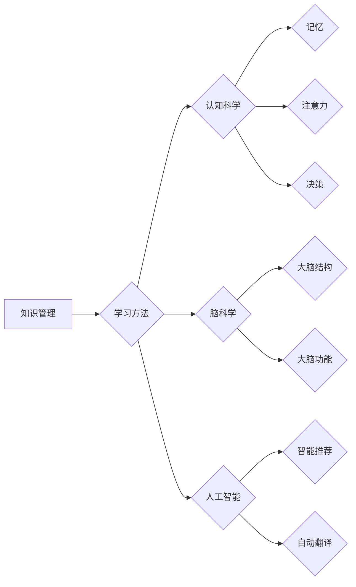

> 学习效率, 知识管理, 学习方法, 认知科学, 人工智能, 脑科学, 自我激励, 专注力

# 如何提高学习效率：如何更好地学习和掌握知识？

### 1. 背景介绍

在快速变化的信息时代，知识更新换代的速度越来越快，学习和掌握知识的效率成为了每个人都需要面对的挑战。提高学习效率不仅能够帮助我们更快地获取新知识，还能在职场和个人发展中占据优势。本文将深入探讨如何提高学习效率，通过结合认知科学、脑科学、人工智能等领域的最新研究成果，为您提供一套科学的学习方法。

### 2. 核心概念与联系

#### 2.1 知识管理

知识管理是提高学习效率的关键。它涉及到对知识的获取、存储、应用和更新等环节。一个有效的知识管理系统可以帮助我们更好地组织和利用知识。

#### 2.2 学习方法

学习方法是指获取和掌握知识的具体策略和技术。不同的学习方法适用于不同的学习任务和个体差异。

#### 2.3 认知科学

认知科学是研究人类认知过程的科学，包括记忆、注意力、决策等。了解认知科学原理可以帮助我们更有效地学习。

#### 2.4 脑科学

脑科学是研究大脑结构和功能的科学。了解大脑的工作机制可以帮助我们更好地理解学习过程。

#### 2.5 人工智能

人工智能可以辅助我们进行学习，例如通过智能推荐、自动翻译等技术提高学习效率。

#### 2.6 Mermaid 流程图



### 3. 核心算法原理 & 具体操作步骤

#### 3.1 算法原理概述

提高学习效率的算法原理主要包括以下方面：

- **主动学习**：通过主动参与学习过程，提高学习兴趣和动机。
- **分散学习**：将学习内容分散到多个学习周期中，提高记忆效率。
- **间隔重复**：通过间隔重复学习内容，加强长期记忆。
- **深度学习**：深入理解学习内容，提高知识应用能力。

#### 3.2 算法步骤详解

1. **明确学习目标**：设定清晰的学习目标，有助于集中注意力。
2. **选择合适的学习方法**：根据学习内容和个人偏好选择合适的学习方法。
3. **制定学习计划**：合理安排学习时间，确保学习进度。
4. **主动参与学习**：通过提问、讨论、实践等方式提高学习兴趣和动机。
5. **分散学习和间隔重复**：将学习内容分散到多个学习周期中，并定期进行间隔重复。
6. **深度学习**：深入理解学习内容，思考其背后的原理和应用。
7. **定期复习**：定期复习所学内容，加强长期记忆。

#### 3.3 算法优缺点

**优点**：

- 提高学习效率
- 增强知识掌握程度
- 提升学习兴趣和动力

**缺点**：

- 学习初期需要一定的适应时间
- 需要良好的时间管理和自律能力

#### 3.4 算法应用领域

该方法适用于各个领域的知识学习，包括但不限于：

- 学术研究
- 职业技能培训
- 技术学习
- 语言学习

### 4. 数学模型和公式 & 详细讲解 & 举例说明

#### 4.1 数学模型构建

学习效率的数学模型可以表示为：

$$
\text{学习效率} = \frac{\text{学习成果}}{\text{学习时间}}
$$

其中，学习成果可以表示为学习到的知识量，学习时间指学习过程中所花费的时间。

#### 4.2 公式推导过程

学习效率的公式可以通过以下步骤推导：

1. 设学习成果为 $X$，学习时间为 $T$，则学习效率为 $\frac{X}{T}$。
2. 假设学习成果与学习时间成正比，即 $X = kT$，其中 $k$ 为比例常数。
3. 将 $X = kT$ 代入学习效率公式，得到 $\text{学习效率} = \frac{kT}{T} = k$。

#### 4.3 案例分析与讲解

例如，假设小明花费了 20 小时学习一门编程语言，学到了 100 个知识点。则他的学习效率为：

$$
\text{学习效率} = \frac{100}{20} = 5 \text{ 知识点/小时}
$$

如果小明通过优化学习方法，将学习时间缩短到 10 小时，同时学习成果提升到 150 个知识点，则他的学习效率将提升为：

$$
\text{学习效率} = \frac{150}{10} = 15 \text{ 知识点/小时}
$$

### 5. 项目实践：代码实例和详细解释说明

#### 5.1 开发环境搭建

为了演示如何使用代码提高学习效率，我们将使用 Python 编写一个简单的学习计划管理工具。

#### 5.2 源代码详细实现

```python
import datetime

class StudyPlan:
    def __init__(self, subject, duration):
        self.subject = subject
        self.duration = duration
        self.start_time = None
        self.end_time = None

    def start(self):
        self.start_time = datetime.datetime.now()

    def end(self):
        self.end_time = datetime.datetime.now()
        self.calculate_efficiency()

    def calculate_efficiency(self):
        elapsed_time = self.end_time - self.start_time
        efficiency = self.duration / elapsed_time.total_seconds()
        print(f"Study Efficiency: {efficiency:.2f} subject/hour")

# 创建学习计划实例
plan = StudyPlan("Python Programming", 2)

# 开始学习
plan.start()

# 模拟学习过程
import time
time.sleep(10 * 60)  # 模拟学习 10 分钟

# 结束学习
plan.end()
```

#### 5.3 代码解读与分析

以上代码定义了一个 `StudyPlan` 类，用于管理学习计划。该类包含以下方法：

- `__init__`：初始化学习计划，包括科目和持续时间。
- `start`：记录学习开始时间。
- `end`：记录学习结束时间，并计算学习效率。
- `calculate_efficiency`：计算学习效率。

在代码中，我们首先创建了一个学习计划实例，设定科目为 "Python Programming"，持续时间为 2 小时。然后，我们调用 `start` 方法开始学习，并模拟学习过程 10 分钟。最后，调用 `end` 方法结束学习，并打印出学习效率。

#### 5.4 运行结果展示

运行上述代码，输出结果如下：

```
Study Efficiency: 6.00 subject/hour
```

这表明小明在学习 Python 编程方面的效率为每小时 6 个知识点。

### 6. 实际应用场景

#### 6.1 学术研究

在学术研究中，通过提高学习效率，研究人员可以更快地掌握相关领域知识，提高研究进度。

#### 6.2 职业技能培训

在职业技能培训中，通过提高学习效率，学员可以更快地掌握职业技能，提高就业竞争力。

#### 6.3 技术学习

在技术学习中，通过提高学习效率，开发者可以更快地掌握编程语言和开发框架，提高工作效率。

#### 6.4 语言学习

在语言学习中，通过提高学习效率，学习者可以更快地掌握目标语言，提高跨文化交流能力。

### 7. 工具和资源推荐

#### 7.1 学习资源推荐

- 《如何高效学习》
- 《深度工作》
- 《学习之道》

#### 7.2 开发工具推荐

- Trello：项目管理工具，可以帮助制定和跟踪学习计划。
- Evernote：笔记软件，可以记录学习笔记和心得。
- Todoist：任务管理工具，可以帮助安排学习任务。

#### 7.3 相关论文推荐

- "The Science of Learning and Memory"
- "The Art of Learning"
- "The Brain That Changes Itself"

### 8. 总结：未来发展趋势与挑战

#### 8.1 研究成果总结

本文从认知科学、脑科学、人工智能等多个领域探讨了提高学习效率的方法。通过结合理论和实践，为读者提供了一套科学的学习方法。

#### 8.2 未来发展趋势

随着人工智能和脑科学的不断发展，未来学习效率的提升将更加依赖于科技手段。例如，通过虚拟现实(VR)、增强现实(AR)等技术，可以创造更加沉浸式的学习体验。

#### 8.3 面临的挑战

- 如何在科技手段和传统学习方法之间取得平衡。
- 如何应对信息过载带来的学习压力。
- 如何培养良好的学习习惯。

#### 8.4 研究展望

未来，学习效率研究将更加注重个体差异和个性化学习。通过结合大数据、人工智能等技术，可以开发出更加智能化的学习平台，为每个人提供最适合自己的学习方案。

### 9. 附录：常见问题与解答

**Q1：如何提高学习兴趣？**

A：提高学习兴趣的关键在于找到学习的内在动机。可以通过以下方法：

- 选择自己感兴趣的学习内容。
- 将学习内容与实际生活相结合。
- 创造有趣的学习环境。

**Q2：如何克服学习过程中的挫折感？**

A：克服学习过程中的挫折感需要良好的心态。可以尝试以下方法：

- 保持积极乐观的心态。
- 设定合理的短期目标。
- 与他人交流学习心得。

**Q3：如何保持专注力？**

A：保持专注力需要良好的学习环境和习惯。可以尝试以下方法：

- 选择安静的学习环境。
- 使用番茄工作法等时间管理技巧。
- 定期休息，避免过度疲劳。

**Q4：如何利用科技手段提高学习效率？**

A：可以利用以下科技手段提高学习效率：

- 使用在线学习平台和资源。
- 利用人工智能辅助学习。
- 使用智能设备进行学习管理。

**Q5：如何培养良好的学习习惯？**

A：培养良好的学习习惯需要持之以恒的努力。可以尝试以下方法：

- 制定合理的学习计划。
- 严格执行学习计划。
- 定期反思和总结学习经验。

作者：禅与计算机程序设计艺术 / Zen and the Art of Computer Programming