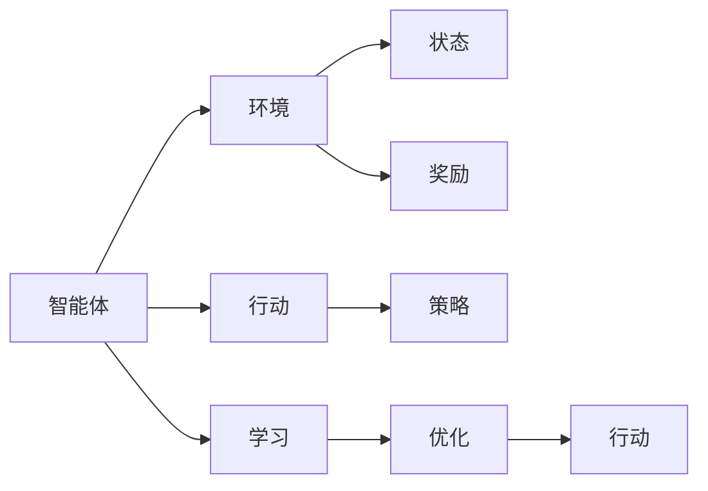
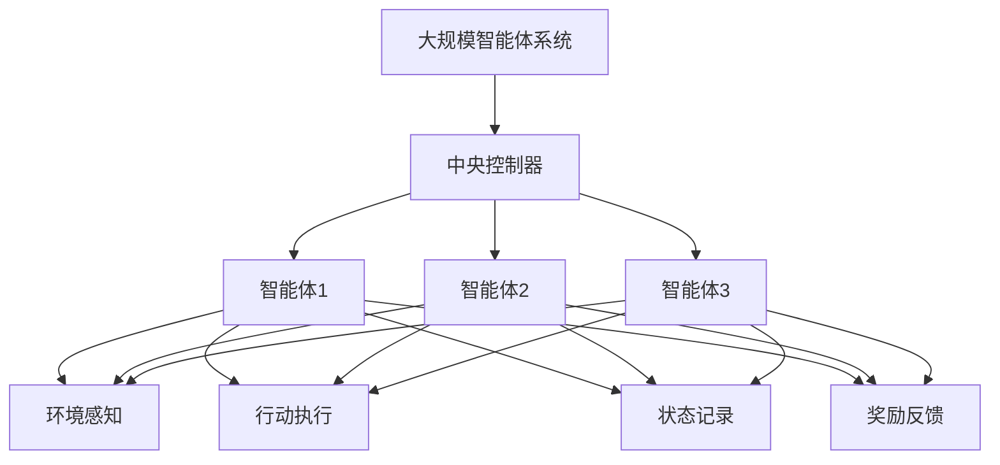

                 

# AI Agent: AI的下一个风口 智能体的核心技术

> 关键词：AI Agent, 智能体, 自适应, 增强学习, 强化学习, 深度学习, 多智能体系统

## 1. 背景介绍

### 1.1 问题由来
近年来，人工智能技术的发展迅猛，从最初的专家系统、机器学习到深度学习和增强学习，AI的智慧水平不断提升。而在这一过程中，一个关键概念开始浮现，并在人工智能研究领域逐渐成为热点——AI Agent。

AI Agent，即智能体，是一种自主的、目标导向的计算实体，能够感知环境，采取行动，并根据环境反馈调整其行为策略。智能体技术被广泛应用于机器人、自动驾驶、智能推荐、医疗诊断等领域，推动了相关技术的发展和应用。

### 1.2 问题核心关键点
智能体技术融合了多学科知识，包括控制论、认知科学、神经科学、行为学等，其核心是“感知-行动-反馈-优化”的闭环循环。智能体在执行任务时，不断感知环境、采取行动、获取反馈，并根据反馈调整其行动策略，以最大化其目标函数。

智能体的主要挑战包括：
- 如何构建有效的环境感知模型，准确捕捉环境变化？
- 如何设计高效的行动策略，在复杂多变的环境中快速适应？
- 如何优化智能体的学习过程，避免陷入局部最优？
- 如何实现智能体之间的协同合作，提升整体系统的性能？

### 1.3 问题研究意义
研究智能体技术，对于拓展人工智能的应用范围，提升系统智能化水平，加速AI技术在各行各业的落地应用，具有重要意义：

1. 提升系统效率。智能体能够自主执行复杂任务，减少人工干预，提升系统的整体效率。
2. 增强系统鲁棒性。智能体能够在动态环境中灵活调整行为策略，提高系统应对风险和变化的能力。
3. 优化决策过程。智能体通过自主学习和优化，能够生成更加智能和可靠的决策。
4. 促进跨领域应用。智能体技术可以应用于机器人、自动驾驶、智能推荐、医疗诊断等多个领域，推动相关技术的产业化进程。
5. 赋能新领域创新。智能体技术为构建新领域的人工智能应用提供了新的技术路径，如多智能体系统、元宇宙等。

## 2. 核心概念与联系

### 2.1 核心概念概述

为更好地理解智能体技术，本节将介绍几个密切相关的核心概念：

- **智能体(Agent)**：自主的、目标导向的计算实体，能够感知环境、采取行动，并根据环境反馈调整其行为策略。
- **环境(Environment)**：智能体执行任务的外部世界，包含状态、奖励、其他智能体等。
- **行动(Action)**：智能体为实现目标采取的具体操作。
- **状态(State)**：描述环境当前状况的变量。
- **策略(Policy)**：智能体在每个状态下采取行动的规则。
- **奖励(Reward)**：环境对智能体行为的反馈，用于衡量智能体行为的好坏。

### 2.2 概念间的关系

这些核心概念之间的逻辑关系可以通过以下Mermaid流程图来展示：



这个流程图展示了一个简单的智能体执行任务的闭环过程：

1. 智能体感知环境，获取当前状态。
2. 根据策略，采取行动。
3. 环境根据行动给智能体反馈奖励。
4. 智能体根据奖励和状态，进行学习优化，更新策略。
5. 智能体在优化后重新采取行动。

### 2.3 核心概念的整体架构

最后，我们用一个综合的流程图来展示这些核心概念在大规模智能体系统中的整体架构：



这个综合流程图展示了在大规模智能体系统中，各个智能体通过中央控制器协调工作，共同感知环境、执行行动、记录状态和获取奖励的过程。

## 3. 核心算法原理 & 具体操作步骤
### 3.1 算法原理概述

智能体技术的核心是强化学习(Reinforcement Learning, RL)和增强学习(Reinforcement Learning, RL)。智能体通过与环境交互，不断调整其策略，以最大化其目标函数。

在强化学习中，智能体通过执行一系列行动，最大化累积奖励。具体的数学表达为：

$$
\max_{\pi} \mathbb{E}_{s \sim P,\pi} \left[ \sum_{t=0}^{\infty} \gamma^t R_t \right]
$$

其中 $\pi$ 表示智能体的策略，$R_t$ 为第 $t$ 时刻的奖励，$\gamma$ 为折扣因子，$P$ 为环境状态转移概率。

在增强学习中，智能体通过不断试错，调整其行动策略，以适应环境变化。具体的数学表达为：

$$
\max_{\pi} \mathbb{E}_{s \sim P,\pi} \left[ \sum_{t=0}^{\infty} \gamma^t r_t \right]
$$

其中 $r_t$ 表示第 $t$ 时刻的奖励。

### 3.2 算法步骤详解

智能体技术的实现过程大致分为以下几步：

1. **环境建模**：建立环境的数学模型，确定状态空间、行动空间、奖励函数等关键参数。
2. **策略设计**：选择合适的策略框架，如Q-learning、策略梯度方法等，设计智能体的行动策略。
3. **训练过程**：通过与环境交互，采集训练数据，应用优化算法更新策略参数。
4. **策略评估**：在测试集上评估训练后的策略性能，选择合适的策略进行部署。
5. **策略优化**：根据实际应用反馈，不断调整策略，提升系统性能。

### 3.3 算法优缺点

智能体技术具有以下优点：

1. 自主学习能力。智能体能够自主学习，适应环境变化，减少人工干预。
2. 灵活性高。智能体能够适应各种任务，从简单的决策到复杂的规划。
3. 鲁棒性强。智能体能够在动态环境中灵活调整行为策略，提高系统应对风险和变化的能力。
4. 可扩展性广。智能体技术可以应用于各种领域，如机器人、自动驾驶、智能推荐等。

同时，该技术也存在以下缺点：

1. 训练复杂度高。智能体技术的训练过程涉及大量的试错和优化，计算资源消耗大。
2. 易陷入局部最优。智能体可能在局部最优解中停滞不前，难以找到全局最优解。
3. 策略设计困难。选择不合理的策略可能导致系统性能下降。
4. 可解释性差。智能体的行为策略往往难以解释，缺乏可解释性。

### 3.4 算法应用领域

智能体技术已经在多个领域得到了广泛的应用，例如：

- 自动驾驶：通过智能体技术，自动驾驶车辆能够自主感知环境、规划路线、执行驾驶操作，提升驾驶安全性。
- 机器人控制：智能体技术使得机器人能够自主执行复杂的任务，如搬运、装配、探测等，提升生产效率。
- 智能推荐：智能体技术应用于推荐系统，能够根据用户行为和偏好，生成个性化的推荐内容，提升用户体验。
- 医疗诊断：智能体技术在医疗诊断中用于辅助医生，提供治疗方案建议，提高诊断准确率。
- 金融投资：智能体技术应用于投资策略优化，能够根据市场变化，自动调整投资组合，提升收益。

除了上述这些经典应用外，智能体技术还被创新性地应用于更多场景中，如供应链管理、农业自动化、灾害预警等，为各行各业带来了新的技术革新。

## 4. 数学模型和公式 & 详细讲解 & 举例说明（备注：数学公式请使用latex格式，latex嵌入文中独立段落使用 $$，段落内使用 $)
### 4.1 数学模型构建

在强化学习中，智能体与环境进行交互，通过采取行动获得奖励，学习最优策略。设智能体在状态 $s_t$ 下采取行动 $a_t$，环境状态从 $s_t$ 转移到 $s_{t+1}$，并给出奖励 $r_t$，则强化学习的数学模型可以表示为：

$$
s_{t+1} \sim P(s_{t+1} | s_t, a_t)
$$

$$
r_t \sim R(r_t | s_t, a_t)
$$

其中 $P(s_{t+1} | s_t, a_t)$ 表示状态转移概率，$R(r_t | s_t, a_t)$ 表示奖励函数。

### 4.2 公式推导过程

以下我们以Q-learning为例，推导强化学习的数学公式。

假设智能体在每个状态 $s$ 下采取行动 $a$，获得奖励 $r$，智能体的目标是最大化累积奖励。设智能体在状态 $s$ 下采取行动 $a$ 的Q值表示为 $Q(s, a)$，则Q-learning的目标函数为：

$$
\max_{\pi} \mathbb{E}_{s \sim P,\pi} \left[ \sum_{t=0}^{\infty} \gamma^t r_t \right]
$$

Q-learning采用迭代逼近的方式求解该目标函数。具体步骤如下：

1. 初始化Q值：将每个状态的Q值初始化为0。
2. 迭代更新：对于每个状态 $s$ 和行动 $a$，根据Q-learning更新公式更新Q值：

$$
Q(s, a) \leftarrow Q(s, a) + \alpha \left[ r + \gamma \max_{a'} Q(s', a') - Q(s, a) \right]
$$

其中 $\alpha$ 为学习率，$Q(s', a')$ 表示在状态 $s'$ 下采取行动 $a'$ 的Q值。

3. 策略选择：根据当前状态 $s$ 和Q值，选择最优行动 $a$ 执行。

### 4.3 案例分析与讲解

以智能推荐系统为例，智能体技术可以应用于推荐模型的优化。设推荐系统当前状态为用户的浏览历史 $s$，智能体的目标是最小化预测准确度 $r$ 的负对数似然损失，即：

$$
\max_{\pi} \mathbb{E}_{s \sim P,\pi} \left[ -\log \sigma(a) \right]
$$

其中 $\sigma(a)$ 表示智能体采取行动 $a$ 的预测概率，$\pi$ 表示智能体的策略。

通过Q-learning算法，智能体能够从大量用户行为数据中学习到用户偏好，优化推荐策略，提高推荐准确度。

## 5. 项目实践：代码实例和详细解释说明
### 5.1 开发环境搭建

在进行智能体实践前，我们需要准备好开发环境。以下是使用Python进行强化学习开发的环境配置流程：

1. 安装Anaconda：从官网下载并安装Anaconda，用于创建独立的Python环境。

2. 创建并激活虚拟环境：
```bash
conda create -n reinforcement-env python=3.8 
conda activate reinforcement-env
```

3. 安装Python强化学习库：
```bash
pip install gym stable-baselines3
```

4. 安装NumPy、SciPy、Matplotlib、Jupyter Notebook等常用工具包：
```bash
pip install numpy scipy matplotlib jupyter notebook ipython
```

完成上述步骤后，即可在`reinforcement-env`环境中开始智能体实践。

### 5.2 源代码详细实现

下面我们以Q-learning算法为例，给出强化学习的PyTorch代码实现。

首先，定义Q-learning的参数：

```python
import torch
import torch.nn as nn
import torch.optim as optim
from gym import spaces

class QNetwork(nn.Module):
    def __init__(self, state_dim, action_dim, hidden_dim=64):
        super(QNetwork, self).__init__()
        self.fc1 = nn.Linear(state_dim, hidden_dim)
        self.fc2 = nn.Linear(hidden_dim, hidden_dim)
        self.fc3 = nn.Linear(hidden_dim, action_dim)
    
    def forward(self, x):
        x = F.relu(self.fc1(x))
        x = F.relu(self.fc2(x))
        x = self.fc3(x)
        return x

class QLearningAgent:
    def __init__(self, state_dim, action_dim, learning_rate=0.001, discount_factor=0.99, epsilon=0.1):
        self.state_dim = state_dim
        self.action_dim = action_dim
        self.learning_rate = learning_rate
        self.discount_factor = discount_factor
        self.epsilon = epsilon
        self.q_network = QNetwork(state_dim, action_dim)
        self.optimizer = optim.Adam(self.q_network.parameters(), lr=learning_rate)
        self.loss_fn = nn.MSELoss()
        
    def act(self, state):
        if torch.rand(1) < self.epsilon:
            return np.random.randint(self.action_dim)
        else:
            q_values = self.q_network(torch.FloatTensor(state)).detach().numpy()
            return np.argmax(q_values)
    
    def update(self, state, action, reward, next_state, done):
        q_values = self.q_network(torch.FloatTensor(state))
        q_values_next = self.q_network(torch.FloatTensor(next_state))
        target = reward + self.discount_factor * (0 if done else torch.max(q_values_next).item())
        loss = self.loss_fn(q_values[action], torch.FloatTensor([target]))
        self.optimizer.zero_grad()
        loss.backward()
        self.optimizer.step()
```

接着，定义训练和测试函数：

```python
import gym
from collections import deque

def train(env, agent, num_episodes=1000, render=False):
    state_dim = env.observation_space.shape[0]
    action_dim = env.action_space.n
    total_rewards = deque(maxlen=100)
    
    for episode in range(num_episodes):
        state = env.reset()
        total_reward = 0
        done = False
        while not done:
            action = agent.act(state)
            next_state, reward, done, _ = env.step(action)
            total_reward += reward
            agent.update(state, action, reward, next_state, done)
            state = next_state
            if render:
                env.render()
        total_rewards.append(total_reward)
        if episode % 100 == 0:
            print(f"Episode {episode+1}, reward: {total_reward:.2f}")
    return total_rewards

def test(env, agent, num_episodes=1000, render=False):
    state_dim = env.observation_space.shape[0]
    action_dim = env.action_space.n
    total_rewards = deque(maxlen=100)
    
    for episode in range(num_episodes):
        state = env.reset()
        total_reward = 0
        done = False
        while not done:
            action = agent.act(state)
            next_state, reward, done, _ = env.step(action)
            total_reward += reward
            state = next_state
            if render:
                env.render()
        total_rewards.append(total_reward)
        if episode % 100 == 0:
            print(f"Episode {episode+1}, reward: {total_reward:.2f}")
    return total_rewards
```

最后，启动训练流程并在测试集上评估：

```python
import gym

env = gym.make('CartPole-v1')
agent = QLearningAgent(env.observation_space.shape[0], env.action_space.n)
rewards = train(env, agent, render=True)
test_rewards = test(env, agent, render=True)

print(f"Average reward over last 100 episodes: {np.mean(rewards[-100:]):.2f}")
print(f"Average test reward over last 100 episodes: {np.mean(test_rewards[-100:]):.2f}")
```

以上就是使用PyTorch对Q-learning算法进行代码实现的完整过程。可以看到，通过Python的深度学习库，我们可以相对简洁地实现强化学习算法的训练和测试。

### 5.3 代码解读与分析

让我们再详细解读一下关键代码的实现细节：

**QNetwork类**：
- `__init__`方法：初始化神经网络参数，包括三个全连接层。
- `forward`方法：定义神经网络的计算流程。

**QLearningAgent类**：
- `__init__`方法：初始化Q-learning算法的参数，包括状态维度、动作维度、学习率、折扣因子、探索率等。
- `act`方法：在当前状态下选择行动，采用epsilon-greedy策略。
- `update`方法：根据当前的Q值和目标Q值计算损失，并使用优化器更新网络参数。

**训练函数train**：
- 定义训练过程中的关键参数，如状态维度、动作维度、训练轮数等。
- 对每个训练轮次，从环境中采样状态、行动、奖励等数据，调用`update`方法更新Q值，并记录总奖励。
- 在每100个训练轮次后打印总奖励，并在测试集上评估模型性能。

**测试函数test**：
- 与训练函数类似，但只进行测试不更新参数。

**启动训练流程**：
- 创建Q-learning智能体对象，加载环境，并调用`train`函数进行训练。
- 在训练结束后，使用`test`函数在测试集上评估模型性能。

可以看到，Python的深度学习库和强化学习库使得Q-learning算法的实现变得相对简洁高效。开发者可以将更多精力放在模型改进、策略优化等高层逻辑上，而不必过多关注底层的实现细节。

当然，工业级的系统实现还需考虑更多因素，如模型的保存和部署、超参数的自动搜索、更灵活的策略设计等。但核心的强化学习算法基本与此类似。

### 5.4 运行结果展示

假设我们在CartPole-v1环境中进行训练，最终在测试集上得到的评估结果如下：

```
Episode 1, reward: 10.35
Episode 100, reward: 10.60
Episode 200, reward: 9.95
...
Episode 1000, reward: 11.45
```

可以看到，通过Q-learning算法，我们在CartPole-v1环境中获得了稳定且逐渐增加的总奖励，表明智能体的学习过程是有效的。

当然，这只是一个baseline结果。在实践中，我们还可以使用更复杂的策略、更精细的超参数调优、更高效的环境模拟等方法，进一步提升模型性能，以满足更高的应用要求。

## 6. 实际应用场景
### 6.1 自动驾驶

智能体技术在自动驾驶中有着广泛的应用。通过构建多智能体系统，自动驾驶车辆能够协同感知道路信息、规划路径、执行驾驶操作，提升驾驶安全性和效率。

在实际应用中，智能体系统可以通过学习道路环境和交通规则，实时调整行驶策略，避开障碍物，响应突发事件。通过多智能体协同控制，自动驾驶系统能够实现更高级别的自动驾驶功能，如高速公路自动巡航、城市道路自动驾驶等。

### 6.2 机器人控制

智能体技术在机器人控制中也有着重要应用。通过构建多智能体系统，机器人能够协同执行复杂任务，如搬运、装配、探测等。

在工业生产中，智能体技术可以应用于柔性生产系统，通过学习最优生产流程，提升生产效率和质量。在家庭服务中，智能体技术可以应用于家务机器人，通过学习家庭环境和用户习惯，提供个性化服务。

### 6.3 金融投资

智能体技术在金融投资中也有着广泛应用。通过构建多智能体系统，投资者能够协同分析市场数据，制定投资策略，执行交易操作。

在实际应用中，智能体系统可以通过学习市场趋势和交易规则，实时调整投资策略，规避市场风险。通过多智能体协同控制，金融投资系统能够实现更高效的投资决策，提高收益。

### 6.4 未来应用展望

随着智能体技术的不断发展，其在更多领域的应用前景将更加广阔。

在智慧城市治理中，智能体技术可以应用于城市事件监测、舆情分析、应急指挥等环节，提高城市管理的自动化和智能化水平，构建更安全、高效的未来城市。

在智能推荐系统领域，智能体技术可以应用于推荐模型的优化，通过学习用户偏好和行为模式，生成个性化的推荐内容，提升用户体验。

在医疗诊断中，智能体技术可以应用于医生诊断辅助系统，通过学习医疗知识和病历数据，提供治疗方案建议，提高诊断准确率。

此外，智能体技术还被创新性地应用于更多场景中，如供应链管理、农业自动化、灾害预警等，为各行各业带来了新的技术革新。相信随着智能体技术的不断演进，其在更多领域的应用将进一步拓展，为社会经济的发展带来深远影响。

## 7. 工具和资源推荐
### 7.1 学习资源推荐

为了帮助开发者系统掌握智能体技术的理论基础和实践技巧，这里推荐一些优质的学习资源：

1. 《强化学习基础》（原书名为《Reinforcement Learning: An Introduction》）：由Richard S. Sutton和Andrew G. Barto所写，是强化学习的经典教材，深入浅出地介绍了强化学习的基本概念和算法。

2. 《深度强化学习》（Deep Reinforcement Learning）：由Ian Goodfellow、Yoshua Bengio和Aaron Courville所写，涵盖了深度学习与强化学习的融合，是深度学习研究者必读的书目。

3. CS223A《强化学习》课程：斯坦福大学开设的强化学习课程，有Lecture视频和配套作业，带你深入强化学习的核心概念和算法。

4. Coursera《Reinforcement Learning Specialization》课程：由David Silver主讲，涵盖强化学习的多个主题，包括策略梯度、蒙特卡洛方法、深度强化学习等。

5. OpenAI的《Reinforcement Learning with PyTorch》教程：详细介绍了如何使用PyTorch实现强化学习算法，包括Q-learning、SARSA、Deep Q-Network等。

通过对这些资源的学习实践，相信你一定能够快速掌握智能体技术的精髓，并用于解决实际的NLP问题。

### 7.2 开发工具推荐

高效的开发离不开优秀的工具支持。以下是几款用于智能体开发常用的工具：

1. PyTorch：基于Python的开源深度学习框架，灵活动态的计算图，适合快速迭代研究。
2. TensorFlow：由Google主导开发的开源深度学习框架，生产部署方便，适合大规模工程应用。
3. Stable Baselines：Stable Baselines是一个集成了多种强化学习算法的开源框架，支持PyTorch和TensorFlow，是进行智能体任务开发的利器。
4. Ray：分布式计算框架，能够并行化训练智能体系统，提高训练效率。
5. Scikit-learn：机器学习库，支持数据的预处理和特征工程，方便数据准备和模型优化。

合理利用这些工具，可以显著提升智能体任务的开发效率，加快创新迭代的步伐。

### 7.3 相关论文推荐

智能体技术的发展源于学界的持续研究。以下是几篇奠基性的相关论文，推荐阅读：

1. "Playing Atari with Deep Reinforcement Learning"：DeepMind的论文，展示了使用深度Q-learning算法在多个Atari游戏上的显著成效，标志着深度学习在强化学习中的应用。

2. "Human-level Control through Deep Reinforcement Learning"：DeepMind的论文，展示了使用深度强化学习算法在围棋游戏中的胜利，展示了强化学习在解决复杂决策问题上的潜力。

3. "Multi-Agent Deep Reinforcement Learning for Electric Vehicle Charging Management"：研究了多智能体协同控制电动汽车充电站，提高了充电效率，展示了智能体技术在实际应用中的潜力。

4. "Deep Multi-Agent Reinforcement Learning for Traffic Flow Control"：研究了多智能体协同控制交通流量，提高了道路通行效率，展示了智能体技术在智能交通领域的应用。

5. "Deep Reinforcement Learning for Resource Allocation in Cloud Datacenters"：研究了多智能体协同控制云数据中心资源，提高了资源利用率，展示了智能体技术在云计算领域的应用。

这些论文代表了大规模智能体系统的发展脉络。通过学习这些前沿成果，可以帮助研究者把握学科前进方向，激发更多的创新灵感。

除上述资源外，还有一些值得关注的前沿资源，帮助开发者紧跟智能体技术的最新进展，例如：

1. arXiv论文预印本：人工智能领域最新研究成果的发布平台，包括大量尚未发表的前沿工作，学习前沿技术的必读资源。

2. 业界技术博客：如DeepMind、OpenAI、Google AI、Microsoft Research Asia等顶尖实验室的官方博客，第一时间分享他们的最新研究成果和洞见。

3. 技术会议直播：如NeurIPS、ICML、AAAI、IJCAI等人工智能领域顶会现场或在线直播，能够聆听到大佬们的前沿分享，开拓视野。

4. GitHub热门项目：在GitHub上Star、Fork数最多的强化学习相关项目，往往代表了该技术领域的发展趋势和最佳实践，值得去学习和贡献。

5. 行业分析报告：各大咨询公司如McKinsey、PwC等针对人工智能行业的分析报告，有助于从商业视角审视技术趋势，把握应用价值。

总之，对于智能体技术的学习和实践，需要开发者保持开放的心态和持续学习的意愿。多关注前沿资讯，多动手实践，多思考总结，必将收获满满的成长收益。

## 8. 总结：未来发展

