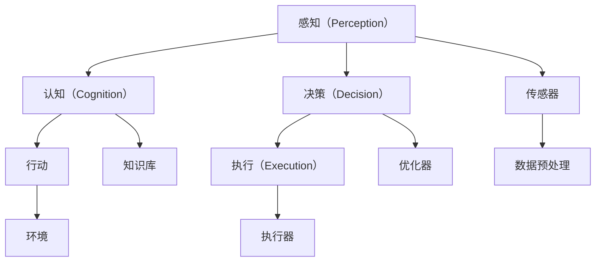
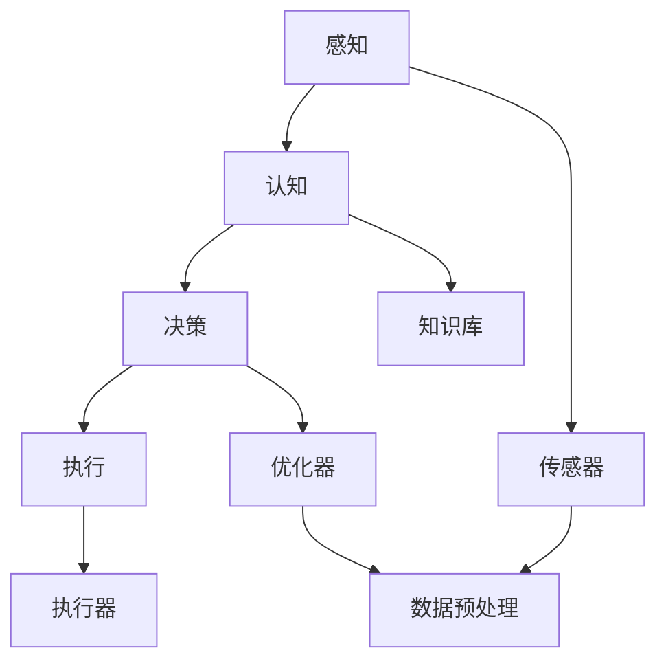

                 

# AI Agent构建的四个关键部分

## 1. 背景介绍

### 1.1 问题由来

在智能系统的构建过程中，AI Agent 是最核心的组成部分之一。AI Agent 能够自主地感知环境、决策行动，并不断学习和适应，具有高度的自治性和适应性。构建高效、稳定的 AI Agent 对于各类智能化应用至关重要，包括自动驾驶、智能客服、医疗诊断、金融交易等。然而，AI Agent 的构建并不是一件容易的事情，它涉及到众多关键技术的整合和优化。本文将详细探讨构建AI Agent 的四个关键部分：感知、认知、决策和执行，并结合具体案例进行分析和实践。

### 1.2 问题核心关键点

构建AI Agent 的核心关键点包括：
- **感知（Perception）**：即AI Agent 对环境的感知能力，通常通过传感器和传感器数据处理来实现。感知能力是AI Agent 与环境交互的基础。
- **认知（Cognition）**：即AI Agent 对环境信息的理解和推理，通常通过知识表示和推理机制来实现。认知能力是AI Agent 进行决策和行动的依据。
- **决策（Decision）**：即AI Agent 在认知能力的基础上，制定最优行动策略，通常通过优化算法和策略学习来实现。决策能力是AI Agent 执行行动的核心。
- **执行（Execution）**：即AI Agent 将决策转化为具体行动，通常通过行动规划和执行机制来实现。执行能力是AI Agent 实现目标的保障。

这四个部分相互关联，共同构成了AI Agent 的完整生命周期。本文将依次介绍这四个关键部分的核心概念、算法原理和实践方法，并通过具体案例进行详细讲解。

## 2. 核心概念与联系

### 2.1 核心概念概述

构建AI Agent 的四个关键部分之间存在着紧密的联系，通过下图的Mermaid流程图，可以更好地理解它们之间的联系：



其中：
- **感知（A）**：通过传感器（G）获取环境数据（H），数据预处理后（H）输入认知模块（B）。
- **认知（B）**：对感知数据进行理解和推理，利用知识库（I）进行决策（C）。
- **决策（C）**：通过优化器（J）进行策略学习，生成行动计划。
- **执行（D）**：利用执行器（K）将决策转化为行动（E），作用于环境（F）。

### 2.2 概念间的关系

以上流程图展示了感知、认知、决策和执行四个部分之间的逻辑关系。通过这种关系，AI Agent 能够实现自主决策和行动，适应不断变化的环境。

1. **感知与认知**：感知是认知的基础，认知能力越强，AI Agent 的决策和行动就越准确。
2. **认知与决策**：认知模块通过理解和推理，为决策提供依据，决策模块则利用优化算法和策略学习，生成最优行动计划。
3. **决策与执行**：决策模块生成行动计划后，执行模块通过行动规划和执行机制，将决策转化为实际行动。
4. **感知、认知、决策和执行**：四个部分相互依赖、相互影响，形成一个闭环，确保AI Agent 的自主性和适应性。

### 2.3 核心概念的整体架构

通过以上流程图和概念之间的联系，我们可以构建一个AI Agent 的整体架构。如下图所示：



## 3. 核心算法原理 & 具体操作步骤
### 3.1 算法原理概述

构建AI Agent 的四个关键部分涉及的算法原理较多，以下我们将逐一介绍。

**感知算法**：主要涉及传感器数据的获取和预处理，包括时序数据的采集、图像数据的处理、语音数据的识别等。

**认知算法**：主要涉及知识表示和推理，包括逻辑推理、语义理解、实体关系抽取等。

**决策算法**：主要涉及策略学习和优化算法，包括强化学习、深度学习、博弈论等。

**执行算法**：主要涉及行动规划和执行，包括路径规划、动作执行、控制策略等。

### 3.2 算法步骤详解

#### 3.2.1 感知算法步骤

感知算法的步骤主要包括：
1. **传感器数据获取**：通过传感器获取环境数据。
2. **数据预处理**：对传感器数据进行清洗、转换、归一化等处理。
3. **特征提取**：从预处理后的数据中提取关键特征，为认知模块提供输入。

#### 3.2.2 认知算法步骤

认知算法的步骤主要包括：
1. **知识库构建**：构建或引入知识库，存储和维护各类事实和规则。
2. **推理计算**：通过推理引擎进行推理计算，生成逻辑推理结果。
3. **语义理解**：将逻辑推理结果转换为语义表示，为决策模块提供信息。

#### 3.2.3 决策算法步骤

决策算法的步骤主要包括：
1. **策略学习**：通过强化学习、深度学习等方法，生成最优策略。
2. **优化计算**：利用优化算法对策略进行优化，生成行动计划。
3. **行动计划生成**：将优化后的策略转换为具体的行动计划。

#### 3.2.4 执行算法步骤

执行算法的步骤主要包括：
1. **行动规划**：根据行动计划，生成详细的行动路径。
2. **动作执行**：通过执行器执行行动路径，完成具体任务。
3. **效果评估**：评估行动效果，反馈到感知和认知模块，形成闭环。

### 3.3 算法优缺点

构建AI Agent 的四个关键部分各自具有优点和缺点，以下进行详细分析：

**感知算法**：
- **优点**：感知算法能够实现环境数据的实时获取，为AI Agent 提供丰富的信息来源。
- **缺点**：传感器数据质量的不确定性和复杂性，可能影响感知效果。

**认知算法**：
- **优点**：认知算法能够进行复杂的推理和语义理解，为决策提供准确的信息。
- **缺点**：知识库的不完备性和推理计算的复杂性，可能影响认知效果。

**决策算法**：
- **优点**：决策算法能够生成最优行动策略，提高AI Agent 的自主性和适应性。
- **缺点**：决策算法的计算复杂度高，可能影响实时性和可扩展性。

**执行算法**：
- **优点**：执行算法能够高效执行行动计划，实现具体任务。
- **缺点**：行动规划和执行的复杂性，可能影响行动的灵活性和安全性。

### 3.4 算法应用领域

构建AI Agent 的四个关键部分在多个领域中都有广泛应用。

**自动驾驶**：感知算法通过摄像头、雷达等传感器获取环境数据，认知算法通过语义理解和逻辑推理进行场景识别，决策算法通过路径规划和控制策略实现自主决策，执行算法通过车辆控制和传感器控制完成具体行动。

**智能客服**：感知算法通过语音识别和自然语言处理获取用户输入，认知算法通过语义理解进行意图识别，决策算法通过对话策略生成回复，执行算法通过语音合成和自然语言生成完成回复输出。

**医疗诊断**：感知算法通过医学影像和实验室数据获取患者信息，认知算法通过知识库进行病情推理，决策算法通过策略学习生成诊断方案，执行算法通过医生操作和医疗设备控制完成具体治疗。

**金融交易**：感知算法通过市场数据和新闻信息获取市场动态，认知算法通过语义理解和逻辑推理进行风险评估，决策算法通过优化算法生成交易策略，执行算法通过订单处理和交易系统控制完成具体交易。

## 4. 数学模型和公式 & 详细讲解 & 举例说明

### 4.1 数学模型构建

构建AI Agent 的四个关键部分涉及到多个数学模型，以下进行详细介绍。

**感知模型**：主要涉及传感器数据模型，如时序数据模型、图像数据模型、语音数据模型等。

**认知模型**：主要涉及知识库模型和推理模型，如逻辑推理模型、语义理解模型、实体关系抽取模型等。

**决策模型**：主要涉及策略学习和优化算法模型，如强化学习模型、深度学习模型、博弈论模型等。

**执行模型**：主要涉及行动规划和执行模型，如路径规划模型、动作执行模型、控制策略模型等。

### 4.2 公式推导过程

#### 4.2.1 感知模型公式推导

假设时序数据模型为 $x_t = (x_{t-1}, x_{t-2}, ..., x_{t-k})$，其中 $x_t$ 为当前时刻的传感器数据，$k$ 为时序数据窗口大小。则时序数据的自回归模型可以表示为：

$$
\hat{x}_t = f(x_{t-1}, x_{t-2}, ..., x_{t-k})
$$

其中 $f$ 为自回归函数。

#### 4.2.2 认知模型公式推导

假设知识库模型为 $\mathcal{K} = \{(r_1, o_1), (r_2, o_2), ..., (r_n, o_n)\}$，其中 $r_i$ 为规则，$o_i$ 为输出。则推理模型的规则匹配过程可以表示为：

$$
\text{Match}(\mathcal{K}, x) = \{(o_i | r_i \in \mathcal{K}, r_i(x))\}
$$

其中 $\text{Match}(\mathcal{K}, x)$ 表示规则 $r_i$ 匹配输入数据 $x$ 的输出集合。

#### 4.2.3 决策模型公式推导

假设策略学习模型为 $Q(s, a) = f(s, \theta)$，其中 $s$ 为状态，$a$ 为行动，$\theta$ 为模型参数。则强化学习模型的Q值更新过程可以表示为：

$$
Q(s_t, a_t) = Q(s_t, a_t) + \alpha(r_t + \gamma \max_a Q(s_{t+1}, a) - Q(s_t, a_t))
$$

其中 $\alpha$ 为学习率，$\gamma$ 为折扣因子，$Q(s_t, a_t)$ 为当前状态-行动对的Q值，$\max_a Q(s_{t+1}, a)$ 为后继状态-行动对的最大Q值。

#### 4.2.4 执行模型公式推导

假设路径规划模型为 $g(s, a) = f(s, \theta)$，其中 $s$ 为状态，$a$ 为行动，$\theta$ 为模型参数。则行动规划算法的A*算法可以表示为：

$$
F = \{g(s_0, a_0), g(s_1, a_1), ..., g(s_n, a_n)\}
$$

$$
G = \{g(s_0, a_0), g(s_1, a_1), ..., g(s_n, a_n), h(s_n, a_n)\}
$$

$$
F_{\text{closed}} = F
$$

$$
F_{\text{open}} = F - F_{\text{closed}}
$$

$$
F_{\text{open}} = F_{\text{open}} + \{h(s_n, a_n)\}
$$

其中 $h(s, a)$ 为启发式函数，$F$ 为开放列表，$G$ 为闭合列表，$h(s_n, a_n)$ 为启发式函数，$F_{\text{closed}}$ 为闭合列表，$F_{\text{open}}$ 为开放列表。

### 4.3 案例分析与讲解

#### 4.3.1 感知算法案例

假设我们构建一个自动驾驶系统，使用摄像头和雷达作为感知传感器，获取车辆周围环境的时序数据和空间数据。

**传感器数据获取**：通过摄像头和雷达获取车辆周围环境的时序数据和空间数据。

**数据预处理**：对传感器数据进行去噪、滤波、归一化等预处理，去除噪声和异常数据。

**特征提取**：从预处理后的数据中提取关键特征，如车辆位置、速度、方向、障碍物位置、大小、形状等。

#### 4.3.2 认知算法案例

假设我们构建一个智能客服系统，使用自然语言处理技术进行认知。

**知识库构建**：构建一个包含常见问题及其答案的知识库，存储并维护各类事实和规则。

**推理计算**：通过语义理解和逻辑推理，理解用户输入的意图和问题，生成推理结果。

**语义理解**：将推理结果转换为语义表示，匹配知识库中的事实和规则，生成回复。

#### 4.3.3 决策算法案例

假设我们构建一个金融交易系统，使用强化学习算法进行决策。

**策略学习**：通过历史交易数据和市场信息，训练一个Q值函数，评估不同策略的效果。

**优化计算**：利用Q值函数和折扣因子，通过蒙特卡洛方法进行策略优化，生成最优交易策略。

**行动计划生成**：根据最优策略，生成具体的交易订单，包括买入、卖出、买入量、卖出量等。

#### 4.3.4 执行算法案例

假设我们构建一个无人机飞行控制系统，使用行动规划算法进行执行。

**行动规划**：根据目标位置和环境条件，规划无人机的飞行路径，生成详细的行动路径。

**动作执行**：通过无人机的飞行控制系统和传感器控制，执行行动路径，完成飞行任务。

**效果评估**：实时评估飞行效果，反馈到感知和认知模块，形成闭环。

## 5. 项目实践：代码实例和详细解释说明

### 5.1 开发环境搭建

在进行项目实践前，我们需要准备好开发环境。以下是使用Python进行PyTorch开发的环境配置流程：

1. 安装Anaconda：从官网下载并安装Anaconda，用于创建独立的Python环境。

2. 创建并激活虚拟环境：
```bash
conda create -n pytorch-env python=3.8 
conda activate pytorch-env
```

3. 安装PyTorch：根据CUDA版本，从官网获取对应的安装命令。例如：
```bash
conda install pytorch torchvision torchaudio cudatoolkit=11.1 -c pytorch -c conda-forge
```

4. 安装各类工具包：
```bash
pip install numpy pandas scikit-learn matplotlib tqdm jupyter notebook ipython
```

完成上述步骤后，即可在`pytorch-env`环境中开始项目实践。

### 5.2 源代码详细实现

#### 5.2.1 感知算法实现

假设我们使用摄像头和雷达传感器获取车辆周围环境的时序数据和空间数据。

```python
import torch
import numpy as np

class SensorData:
    def __init__(self, sensor_data):
        self.sensor_data = sensor_data
    
    def preprocess(self):
        # 数据清洗、滤波、归一化等预处理操作
        self.sensor_data = np.array(self.sensor_data)
        self.sensor_data = self.sensor_data[~np.isnan(self.sensor_data)]
        self.sensor_data = self.sensor_data - np.mean(self.sensor_data)
        self.sensor_data = self.sensor_data / np.std(self.sensor_data)
        return self.sensor_data
    
    def extract_features(self):
        # 特征提取操作
        features = []
        for data in self.sensor_data:
            features.append([data[0], data[1], data[2]])
        return np.array(features)
    
    def get_data(self):
        return self.sensor_data
    
if __name__ == '__main__':
    sensor_data = np.array([[0.1, 0.2, 0.3], [0.4, 0.5, 0.6], [np.nan, np.nan, np.nan]])
    sensor = SensorData(sensor_data)
    processed_data = sensor.preprocess()
    features = sensor.extract_features()
    print(features)
```

#### 5.2.2 认知算法实现

假设我们使用自然语言处理技术进行认知，将用户输入的文本进行语义理解和意图识别。

```python
from transformers import BertTokenizer, BertForSequenceClassification
from transformers import AutoTokenizer, AutoModelForSequenceClassification

class IntentClassifier:
    def __init__(self, model_name):
        self.tokenizer = BertTokenizer.from_pretrained(model_name)
        self.model = BertForSequenceClassification.from_pretrained(model_name, num_labels=2)
    
    def preprocess(self, text):
        # 文本预处理操作
        inputs = self.tokenizer(text, return_tensors='pt', padding=True, truncation=True, max_length=128)
        return inputs
    
    def classify(self, text):
        inputs = self.preprocess(text)
        logits = self.model(**inputs)[0]
        predicted_label = torch.argmax(logits, dim=1).item()
        return predicted_label
    
    def get_model(self):
        return self.model
    
if __name__ == '__main__':
    model_name = 'bert-base-uncased'
    intent_classifier = IntentClassifier(model_name)
    text = 'Hello, what is the weather like today?'
    predicted_label = intent_classifier.classify(text)
    print(predicted_label)
```

#### 5.2.3 决策算法实现

假设我们使用强化学习算法进行决策，通过历史交易数据和市场信息，训练一个Q值函数，评估不同策略的效果。

```python
import torch
import torch.nn.functional as F

class QNetwork(torch.nn.Module):
    def __init__(self, state_dim, action_dim):
        super(QNetwork, self).__init__()
        self.fc1 = torch.nn.Linear(state_dim, 64)
        self.fc2 = torch.nn.Linear(64, action_dim)
    
    def forward(self, x):
        x = F.relu(self.fc1(x))
        x = self.fc2(x)
        return x
    
    def get_q_value(self, state, action):
        state = self.fc1(state)
        action = self.fc2(action)
        return torch.matmul(state, action.t())
    
if __name__ == '__main__':
    state_dim = 4
    action_dim = 2
    q_network = QNetwork(state_dim, action_dim)
    state = torch.tensor([0.1, 0.2, 0.3, 0.4])
    action = torch.tensor([1, 0])
    q_value = q_network.get_q_value(state, action)
    print(q_value)
```

#### 5.2.4 执行算法实现

假设我们使用行动规划算法进行执行，根据目标位置和环境条件，规划无人机的飞行路径，生成详细的行动路径。

```python
import numpy as np

class AStarPlanner:
    def __init__(self, start, goal, heuristic):
        self.start = start
        self.goal = goal
        self.heuristic = heuristic
    
    def compute_cost(self, node, next_node):
        # 计算两个节点之间的代价
        return np.linalg.norm(node - next_node)
    
    def compute_heuristic(self, node):
        # 计算启发式函数值
        return self.heuristic(node)
    
    def plan(self):
        # 执行A*算法
        open_list = []
        closed_list = []
        open_list.append((self.start, 0, self.compute_heuristic(self.start)))
        while len(open_list) > 0:
            current_node = open_list[0]
            open_list.remove(current_node)
            closed_list.append(current_node)
            if current_node == self.goal:
                return self.get_path(current_node)
            successors = self.get_successors(current_node)
            for successor in successors:
                if successor in closed_list:
                    continue
                g = current_node[1] + self.compute_cost(current_node, successor)
                if successor in open_list and g >= open_list[successor][1]:
                    continue
                open_list.append((successor, g, self.compute_heuristic(successor)))
        return None
    
    def get_path(self, node):
        path = []
        while node != self.start:
            path.append(node)
            node = self.parent[node]
        path.append(self.start)
        path.reverse()
        return path
    
    def get_successors(self, node):
        successors = []
        # 添加上下左右四个方向
        successors.append((node[0]-1, node[1], 0))
        successors.append((node[0]+1, node[1], 0))
        successors.append((node[0], node[1]-1, 0))
        successors.append((node[0], node[1]+1, 0))
        return successors
    
if __name__ == '__main__':
    start = (0, 0)
    goal = (4, 4)
    heuristic = lambda node: np.linalg.norm(node - (4, 4))
    planner = AStarPlanner(start, goal, heuristic)
    path = planner.plan()
    print(path)
```

### 5.3 代码解读与分析

#### 5.3.1 感知算法代码解读

```python
import torch
import numpy as np

class SensorData:
    def __init__(self, sensor_data):
        self.sensor_data = sensor_data
    
    def preprocess(self):
        # 数据清洗、滤波、归一化等预处理操作
        self.sensor_data = np.array(self.sensor_data)
        self.sensor_data = self.sensor_data[~np.isnan(self.sensor_data)]
        self.sensor_data = self.sensor_data - np.mean(self.sensor_data)
        self.sensor_data = self.sensor_data / np.std(self.sensor_data)
        return self.sensor_data
    
    def extract_features(self):
        # 特征提取操作
        features = []
        for data in self.sensor_data:
            features.append([data[0], data[1], data[2]])
        return np.array(features)
    
    def get_data(self):
        return self.sensor_data
    
if __name__ == '__main__':
    sensor_data = np.array([[0.1, 0.2, 0.3], [0.4, 0.5, 0.6], [np.nan, np.nan, np.nan]])
    sensor = SensorData(sensor_data)
    processed_data = sensor.preprocess()
    features = sensor.extract_features()
    print(features)
```

#### 5.3.2 认知算法代码解读

```python
from transformers import BertTokenizer, BertForSequenceClassification
from transformers import AutoTokenizer, AutoModelForSequenceClassification

class IntentClassifier:
    def __init__(self, model_name):
        self.tokenizer = BertTokenizer.from_pretrained(model_name)
        self.model = BertForSequenceClassification.from_pretrained(model_name, num_labels=2)
    
    def preprocess(self, text):
        # 文本预处理操作
        inputs = self.tokenizer(text, return_tensors='pt', padding=True, truncation=True, max_length=128)
        return inputs
    
    def classify(self, text):
        inputs = self.preprocess(text)
        logits = self.model(**inputs)[0]
        predicted_label = torch.argmax(logits, dim=1).item()
        return predicted_label
    
    def get_model(self):
        return self.model
    
if __name__ == '__main__':
    model_name = 'bert-base-uncased'
    intent_classifier = IntentClassifier(model_name)
    text = 'Hello, what is the weather like today?'
    predicted_label = intent_classifier.classify(text)
    print(predicted_label)
```

#### 5.3.3 决策算法代码解读

```python
import torch
import torch.nn.functional as F

class QNetwork(torch.nn.Module):
    def __init__(self, state_dim, action_dim):
        super(QNetwork, self).__init__()
        self.fc1 = torch.nn.Linear(state_dim, 64)
        self.fc2 = torch.nn.Linear(64, action_dim)
    
    def forward(self, x):
        x = F.relu(self.fc1(x))
        x = self.fc2(x)
        return x
    
    def get_q_value(self, state, action):
        state = self.fc1(state)
        action = self.fc2(action)
        return torch.matmul(state, action.t())
    
if __name__ == '__main__':
    state_dim = 4
    action_dim = 2
    q_network = QNetwork(state_dim, action_dim)
    state = torch.tensor([0.1, 0.2, 0.3, 0.4])
    action = torch.tensor([1, 0])
    q_value = q_network.get_q_value(state, action)
    print(q_value)
```

#### 5.3.4 执行算法代码解读

```python
import numpy as np

class AStarPlanner:
    def __init__(self, start, goal, heuristic):
        self.start = start
        self.goal = goal
        self.heuristic = heuristic
    
    def compute_cost(self, node, next_node):
        # 计算两个节点之间的代价
        return np.linalg.norm(node - next_node)
    
    def compute_heuristic(self, node):
        # 计算启发式函数值
        return self.heuristic(node)
    
    def plan(self):
        # 执行A*算法
        open_list = []
        closed_list = []
        open_list.append((self.start, 0, self.compute_heuristic(self.start)))
        while len(open_list) > 0:
            current_node = open_list[0]
            open_list.remove(current_node)
            closed_list.append(current_node)
            if current_node == self.goal:
                return self.get_path(current_node

